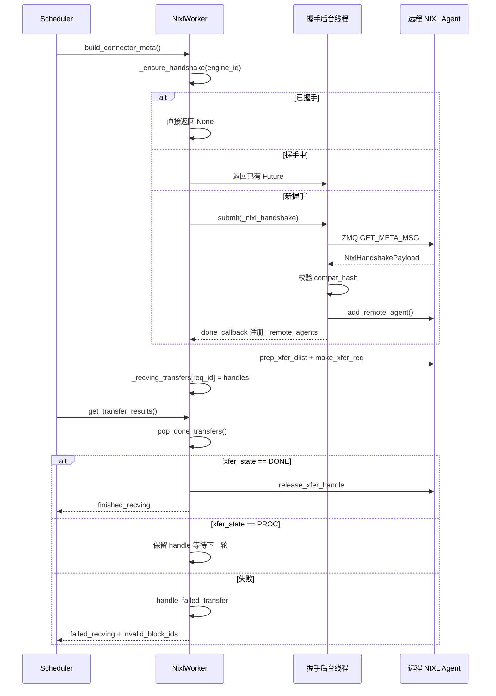

# Kapitel 9: KV-Cache-Übertragung und disaggregierte Bereitstellung (PD-Disaggregation)

Im vorherigen Kapitel haben wir den Blick auf eine einzelne Inferenzinstanz beschränkt: Wie TP/PP/DP/EP-Prozessgruppen gebildet werden, wie Tensoren zwischen Karten aufgeteilt werden und wie EPLB in der MoE-Schicht einen Experten-Neuausgleich durchführt. Doch all diese Mechanismen bauen auf derselben Voraussetzung auf – Prefill und Decode laufen in derselben Instanz, und der KV-Cache bleibt von Anfang bis Ende im lokalen Speicher. Die disaggregierte Bereitstellung (Prefill-Decode Disaggregation, kurz PD-Disaggregation) bricht diese Voraussetzung auf. Sie teilt Prefill und Decode in zwei unabhängige vLLM-Instanzen auf: Die Prefill-Instanz führt nur die Vorwärtsberechnung des Prompts durch, erzeugt den KV-Cache und übergibt ihn an die Decode-Instanz; die Decode-Instanz verwendet diesen KV-Cache, um die autoregressive Generierung fortzusetzen. Der Vorteil besteht darin, dass Ressourcen unabhängig nach den Eigenschaften der Phase konfiguriert werden können – Prefill ist rechenintensiv und eignet sich für großes TP und große Batches; Decode ist speicherzugriffsintensiv und eignet sich für kleine Batches und Scheduling mit niedriger Latenz. Beide behindern sich nicht mehr gegenseitig. Der Preis dafür ist: Der KV-Cache muss zwischen Instanzen übertragen werden. Das ist der Protagonist dieses Kapitels – der KV-Connector. Der Dateikommentar am Anfang von vllm/distributed/kv_transfer/kv_connector/v1/base.py listet bereits die zentralen Primitive der gesamten Abstraktion auf: Die Scheduler-Seite ist für das Binden von Metadaten, das Abfragen von Remote-Cache-Treffern und die Entscheidung über die asynchrone Freigabe von Blöcken zuständig; die Worker-Seite ist für das tatsächliche Laden und Speichern des KV verantwortlich. Das Designziel dieser Schnittstelle ist es, die übergeordnete Scheduling-Logik vollständig vom zugrunde liegenden Übertragungs-Backend (NIXL, Mooncake, MoRIIO) zu entkoppeln. Aus technischer Sicht ist das größte Risiko der PD-Disaggregation nicht eine langsame Übertragung, sondern inkonsistente Zustände: Die Prefill-Instanz glaubt, der KV sei bereits gesendet worden, aber die Decode-Instanz hat ihn nicht empfangen; oder die Decode-Instanz gibt einen Block vorzeitig frei, während Prefill noch hineinschreibt. Dieses Kapitel soll klären, wie dieses Connector-System mit Handshake-Protokollen, Leases, Heartbeats und Fehlerwiederherstellungsmechanismen diese Grenzfälle absichert.

# 一、KVConnectorBase_V1: Dual-Rollen-Abstraktion und Metadaten-Vertrag

## Intuitives Modell

Der KV-Connector ist wie ein Kuriersystem zwischen zwei Filialen. Der Prefill-Laden hat ein Halbfertigprodukt (KV-Cache) berechnet, packt es ein und schickt es zum Decode-Laden, der die Weiterverarbeitung übernimmt. Doch ein Kuriersystem darf nicht nur aus dem einen Vorgang „Versenden“ bestehen – es braucht einen Frachtbrief (Metadaten), der angibt, was wohin geschickt wird; es braucht einen Empfangsbestätigungsmechanismus, um zu bestätigen, dass die Gegenseite erhalten hat; und es braucht eine Reihe von Timeout-Regeln, um zu verhindern, dass Pakete für immer unterwegs festhängen und Regalplatz belegen.

Ohne diese Abstraktion müsste jedes Übertragungs-Backend (NIXL, Mooncake) seine eigene Scheduling-Logik implementieren, und der vLLM-Scheduler müsste für jedes Backend eigenen Anpassungscode schreiben. Der Wert von KVConnectorBase_V1 besteht darin, diesen Vertrag festzuschreiben.

## Duale Rollen: Scheduler-Seite und Worker-Seite

[FACT:vllm/distributed/kv_transfer/kv_connector/v1/base.py:137-142]definiert die beiden Rollen des Connectors:

```python
class KVConnectorRole(enum.Enum):
    # Connector running in the scheduler process
    SCHEDULER = 0
    # Connector running in the worker process
    WORKER = 1
```

Diese Aufteilung ist nicht willkürlich. Der Scheduler-Prozess ist für globale Scheduling-Entscheidungen verantwortlich – welche Anfragen übertragen werden müssen, wann Blöcke freigegeben werden können; der Worker-Prozess ist für den tatsächlichen Datentransport zuständig. Beide kommunizieren über`KVConnectorMetadata`.

[FACT:vllm/distributed/kv_transfer/kv_connector/v1/base.py:153-158]definiert die Basisklasse für Metadaten in Richtung Scheduler zu Worker:

```python
class KVConnectorMetadata(ABC):  # noqa: B024
    """Abstract Metadata used to communicate
    Scheduler KVConnector -> Worker KVConnector.
    """
    pass
```

In umgekehrter Richtung von Worker zu Scheduler[FACT:vllm/distributed/kv_transfer/kv_connector/v1/base.py:161-176]definiert`KVConnectorWorkerMetadata`, wobei die Implementierung der Methode`aggregate`erforderlich ist – denn in einem Engine-Step können mehrere Worker jeweils Metadaten zurückgeben, die vor der Übergabe an den Scheduler aggregiert werden müssen.

## Zentrale Datenstruktur: KVConnectorTransferResults

[FACT:vllm/distributed/kv_transfer/kv_connector/v1/base.py:87-96]definiert die Snapshot-Struktur der Übertragungsergebnisse:

```python
@dataclass
class KVConnectorTransferResults:
    finished_sending: set[str] = field(default_factory=set)
    finished_recving: set[str] = field(default_factory=set)
    failed_recving: set[str] = field(default_factory=set)
```

Beachten Sie das entscheidende Design in den Kommentaren:**Fehlgeschlagene Empfänge erscheinen ebenfalls in`finished_recving`**. Dies dient dazu, dass der Scheduler die Anfrage aus dem Zustand „wartet auf Übertragung" freigeben kann – selbst wenn die Übertragung fehlschlägt, darf die Anfrage nicht ewig hängen bleiben. Fehlerinformationen werden über`failed_recving`separat übermittelt, und der Scheduler entscheidet darauf basierend, ob ein erneuter Versuch unternommen oder eine Degradierung vorgenommen wird.

## Lifecycle-Hooks: Von der Anfrage bis zur Freigabe

Der gesamte Lebenszyklus des Connectors dreht sich um einige zentrale Hooks. Auf der Scheduler-Seite:

- `get_num_new_matched_tokens` [FACT:vllm/distributed/kv_transfer/kv_connector/v1/base.py:485-518]: Abfrage, wie viele Tokens im Remote-Cache getroffen werden können. Der Kommentar betont ausdrücklich, dass „nur der tatsächlich verfügbare maximale Präfix berücksichtigt werden sollte" – wenn bestimmte Tokens aufgrund von Verbindungsproblemen oder Eviction nicht abrufbar sind, dürfen sie nicht mitgezählt werden.
- `update_state_after_alloc` [FACT:vllm/distributed/kv_transfer/kv_connector/v1/base.py:520-544]: Aktualisierung des Status nach der Block-Zuweisung. Im Kommentar gibt es eine leicht zu übersehende Fallgrube – ob geladen werden soll, hängt davon ab, ob`num_external_tokens`, und nicht davon, ob`blocks`leer ist, da die nicht ausgewählten Sub-Connectoren von MultiConnector ebenfalls echte Blocks erhalten.
- `request_finished` [FACT:vllm/distributed/kv_transfer/kv_connector/v1/base.py:579-598]: Wird bei Abschluss der Anfrage aufgerufen und gibt`True`zurück, was bedeutet, dass der Connector die Verantwortung für die asynchrone Freigabe des Blocks übernimmt.

Auf der Worker-Seite:

- `start_load_kv` / `wait_for_layer_load`: Schichtweises Laden, unterstützt Pipelining.
- `save_kv_layer` / `wait_for_save`: Schichtweises Speichern.
- `get_transfer_results` [FACT:vllm/distributed/kv_transfer/kv_connector/v1/base.py:396-397]: Gibt den Abschlussstatus der asynchronen Übertragung zurück.

[FACT:vllm/distributed/kv_transfer/kv_connector/v1/base.py:192-201]Es gibt noch ein leicht zu übersehendes, aber sehr kritisches Design –`requires_kv_delivery`das Attribut:

```python
@property
def requires_kv_delivery(self) -> bool:
    """Whether this connector hands off KV that must be reliably delivered.
    ...
    """
    return self._kv_transfer_config.is_kv_producer
```

Der Kommentar erklärt die Motivation: Wenn eine Anfrage preemptiert wird, bevor die KV-Übergabe abgeschlossen ist, sollte sie neu berechnet werden, anstatt sie abzuschließen und bereits durch Preemption freigegebene Blocks zu übergeben. Nur die Producer-Rolle benötigt zuverlässige Zustellung; bei Best-Effort-Caches führt ein Verlust lediglich zu einem zukünftigen Cache-Miss.

## Handshake-Metadaten

[FACT:vllm/distributed/kv_transfer/kv_connector/v1/base.py:145-150]definiert die Basisklasse für Handshake-Metadaten:

```python
class KVConnectorHandshakeMetadata(ABC):  # noqa: B024
    """Metadata used for out of band connector handshake between
    P/D workers. This needs to serializable.
    """
    pass
```

„Out of band" bedeutet, dass der Handshake nicht über den normalen Anfragepfad läuft, sondern direkt zwischen P/D-Workern kommuniziert wird. Dies bereitet den Weg für das ZMQ-Handshake-Protokoll von NIXL.

---

# Zweitens: NIXL-Connector: Handshake, Registrierung und Descriptor-Erstellung

## Intuitives Modell

NIXL (NVIDIA Inference Xfer Library) ist eine von NVIDIA bereitgestellte Low-Level-Übertragungsbibliothek, die verschiedene Backends wie UCX und GDS unterstützt. Die Rolle von NixlBaseConnectorWorker ähnelt einem Sortierzentrum eines Kurierdienstes – es muss zunächst eine dedizierte Verbindung zum Sortierzentrum der Gegenseite aufbauen (Handshake), das eigene Regal-Layout registrieren (KV-Cache-Speicherbereiche registrieren) und kann erst dann effizient Waren nach Adresse abholen und versenden.

Ohne dieses Mechanismus müssten bei jeder Übertragung Adressen neu ausgehandelt und Verbindungen neu aufgebaut werden, was zu unakzeptabel hohen Latenzen führen würde.

## Speicherlayout: Region und Descriptor

Das Kernkonzept von NIXL ist**region**(Speicherbereich) und**descriptor**(Descriptor). Jede KV-Cache-Schicht wird in NIXL als eine oder mehrere Regions registriert, wobei jede Region eine Basisadresse, Blocklänge und Blockstride hat.

[FACT:vllm/distributed/kv_transfer/kv_connector/v1/nixl/base_worker.py:740-751]listet die regionsbezogenen Kernfelder auf:

```python
# Number of NIXL regions. Currently one region per cache
# (so 1 per layer for MLA, otherwise 2 per layer)
self.num_regions = 0
self.region_mem_types: list[str] = []
self.region_group_ids: list[int] = []
self._uses_region_group_mapping = False
self.region_names: list[str] = []
self.region_num_blocks: list[int] = []
self._mixed_mem_types = False
```

[FACT:vllm/distributed/kv_transfer/kv_connector/v1/nixl/base_worker.py:897-900]erläutert weiter die Herkunft des Block-Strides:

```python
# Per-region block stride in bytes. Taken from the registered tensor's
# stride(0) so it stays correct under layouts that interleave layers
# within a block (BLHNC/BHLNC), where stride > block_len.
self.block_stride_per_layer = list[int]()
```

Die zentrale Erkenntnis hier ist:**block_stride ist nicht gleich block_len**. Bei schichtweise verschachtelten Layouts wie BLHNC/BHLNC kann die tatsächliche Spannweite eines Blocks größer sein als seine effektive Datenlänge. Wenn man block_len direkt als Stride verwendet, werden falsche Adressen gelesen.

## Handshake-Protokoll: ZMQ + Kompatibilitäts-Hash

Der Handshake ist der komplexeste Teil des NIXL-Connectors.[FACT:vllm/distributed/kv_transfer/kv_connector/v1/nixl/base_worker.py:974-1128]Die`_nixl_handshake`-Methode von

zeigt diesen Prozess vollständig.[FACT:vllm/distributed/kv_transfer/kv_connector/v1/nixl/base_worker.py:988-998]Der erste Schritt ist das Einrichten des CUDA-Gerätekontexts.

```python
# the first time we connect to a remote agent.
# be careful, the handshake happens in a background thread.
# it does not have an active cuda context until any cuda runtime
# call is made. when UCX fails to find a valid cuda context, it will
# disable any cuda ipc communication, essentially disabling any NVLink
# communication.
if not self.use_host_buffer:
    current_platform.set_device(self.device_id)
```

erklärt den Grund:

Kopieren[FACT:vllm/distributed/kv_transfer/kv_connector/v1/nixl/base_worker.py:1029-1036]：

```python
msg = msgspec.msgpack.encode(
    (GET_META_MSG, remote_pp_rank, remote_rank)
)
# Set receive timeout to 5 seconds to avoid hanging on dead server
sock.setsockopt(zmq.RCVTIMEO, 5000)  # milliseconds
start_time = time.perf_counter()
sock.send(msg)
reply_parts = sock.recv_multipart()
```

Der zweite Schritt ist das Senden einer Metadaten-Abfrage über ZMQ.[FACT:vllm/distributed/kv_transfer/kv_connector/v1/nixl/base_worker.py:1042-1045]Kopieren

Das 5-Sekunden-Timeout verhindert unendliches Warten, wenn die Gegenseite ausgefallen ist. Gleichzeitig schätzt der Code die Uhrzeitverschiebung[FACT:vllm/distributed/kv_transfer/kv_connector/v1/nixl/base_worker.py:1063-1080]：

```python
assert self.compat_hash is not None
if (
    self.enforce_compat_hash
    and handshake_payload.compatibility_hash != self.compat_hash
):
    raise RuntimeError(
        f"NIXL compatibility hash mismatch. "
        ...
    )
```

Der dritte Schritt ist die Kompatibilitätsprüfung.[FACT:vllm/distributed/kv_transfer/kv_connector/v1/nixl/base_worker.py:1372-1376]Kopieren

```python
self.compat_hash = compute_nixl_compatibility_hash(
    self.vllm_config,
    self.backend_name,
    transfer_mode=self._TRANSFER_MODE,
)
```

berechnet:`transfer_mode`Kopieren[FACT:vllm/distributed/kv_transfer/kv_connector/v1/nixl/base_worker.py:163-166]Beachten Sie, dass

## ebenfalls in den Hash einfließt –

Der Kommentar von[FACT:vllm/distributed/kv_transfer/kv_connector/v1/nixl/base_worker.py:824-835]：

```python
self._handshake_initiation_executor = ThreadPoolExecutor(
    # NIXL is not guaranteed to be thread-safe, limit 1 worker.
    max_workers=1,
    thread_name_prefix="vllm-nixl-handshake-initiator",
)
self._ready_requests = queue.Queue[tuple[ReqId, ReqMeta]]()
self._handshake_futures: dict[
    EngineId, Future[tuple[dict[tuple[int, int], str], float]]
] = {}
# Protects _handshake_futures and _remote_agents.
self._handshake_lock = threading.RLock()
```

`max_workers=1`Asynchrone Handshake-Planung`_handshake_lock`Der Handshake ist asynchron und wird über einen Thread-Pool ausgeführt.`_handshake_futures`Kopieren`_remote_agents`ist darauf zurückzuführen, dass NIXL keine Thread-Sicherheit garantiert.

`_ensure_handshake` [FACT:vllm/distributed/kv_transfer/kv_connector/v1/nixl/base_worker.py:1257-1317]schützt die beiden Dictionaries

## und

.[FACT:vllm/distributed/kv_transfer/kv_connector/v1/nixl/base_worker.py:172-310]implementiert einen idempotenten Handshake-Start: Wenn der Handshake bereits erfolgreich war, wird direkt None zurückgegeben; wenn gerade ein Handshake läuft, wird das vorhandene Future zurückgegeben; andernfalls wird eine neue Aufgabe eingereicht und ein Callback registriert.`_compute_desc_ids`Descriptor-Erstellung: Von der Block-ID zum NIXL-Descriptor

Nach Abschluss des Handshakes müssen für jede Anfrage Descriptors erstellt werden.[FACT:vllm/distributed/kv_transfer/kv_connector/v1/nixl/base_worker.py:226-262]Das

```python
# NOTE (NickLucche) With HMA, every kv group has the same number of layers
# and layers from different groups share the same kv tensor.
# eg block_ids=[[1, 2], [3]]->blocks [1, 2] need to be
# read across all regions, same for [3], but group0-group1 blocks will
# always differ (different areas). Therefore we can just flatten the
# block_ids and compute the descs ids for all groups at once.
```

ist der Kern.[FACT:vllm/distributed/kv_transfer/kv_connector/v1/nixl/base_worker.py:285-304]：

```python
elif _is_ssm_spec(spec_type):
    # NOTE (NickLucche) SSM and Attention block regions can
    # be exchanged arbitrarily by manager.  Therefore, descs
    # are laid out as:
    #   [descs_fa (all regions) | descs_ssm (all regions)].
    # num_fa_descs offset must be computed per-engine since
    # P and D can have different num_blocks (and thus
    # different FA desc counts).
```

## verwendet. Der Kommentar erklärt die Behandlung im HMA-Szenario:

Kopieren[FACT:vllm/distributed/kv_transfer/kv_connector/v1/nixl/base_worker.py:2130-2178]Für hybride SSM-Modelle ist das Descriptor-Layout komplexer`add_remote_agent`Kopieren

Wenn D.world_size > P.world_size, lesen mehrere D-Worker unterschiedliche KV-Head-Shards vom selben P-Worker. Die Dokumentation gibt ein konkretes Beispiel: D TP=4, P TP=2, tp_ratio=2. D-Worker0 liest die erste Hälfte der KV-Heads von P-Worker0, D-Worker1 liest die zweite Hälfte.

Bei MLA-Modellen wird der KV-Cache zwischen TP-Workern repliziert, daher ist rank_offset immer 0.

## Lease und Heartbeat: Verhindern, dass Blöcke vorzeitig freigegeben werden

Dies ist eines der raffiniertesten Designs des NIXL-Connectors. Nachdem die Prefill-Instanz KV gesendet hat, darf sie den Block nicht sofort freigeben – da die Decode-Instanz möglicherweise noch liest. Wenn er jedoch niemals freigegeben wird, kommt es zu einem Speicherleck.

Die Lösung ist eine Lease.[FACT:vllm/distributed/kv_transfer/kv_connector/v1/nixl/base_worker.py:528-528]：

```python
kv_lease_duration: int = vllm_config.kv_transfer_config.get_from_extra_config(
    "kv_lease_duration", 30
)
# NOTE (NickLucche): For now we use a hardcoded value for a simpler interface.
self._lease_extension = kv_lease_duration * 2 // 3
```

Standard-Lease 30 Sekunden, jede Heartbeat-Verlängerung um 20 Sekunden (2/3).

Die Heartbeat-Verarbeitung befindet sich in[FACT:vllm/distributed/kv_transfer/kv_connector/v1/nixl/base_worker.py:3014-3034]：

```python
def _handle_heartbeat(self, payload: str) -> None:
    new_expiry = time.perf_counter() + self._lease_extension
    for req_id in payload.split(","):
        if req_id in self._reqs_to_send:
            old = self._reqs_to_send[req_id]
            self._reqs_to_send[req_id] = max(old, new_expiry)
```

Beachten Sie`max(old, new_expiry)`– Heartbeats können die Lease nur verlängern, nicht verkürzen.

Die Rückgewinnung nach Ablauf der Lease befindet sich in[FACT:vllm/distributed/kv_transfer/kv_connector/v1/nixl/base_worker.py:2986-3012]：

```python
def _reap_expired_send_leases(self, done_sending: set[str]) -> None:
    """Reclaim expired send-side KV leases into ``done_sending``.

    ``_reqs_to_send`` is not ordered by expiry: heartbeats update the
    deadline in place, and mixed TTLs share the map, so a live head
    entry can sit in front of already-expired ones. Scan every entry
    rather than stopping at the first still-live request.
    """
```

Der Kommentar weist auf einen leicht zu machenden Fehler hin: Man darf nicht beim ersten nicht abgelaufenen Request mit dem Scannen aufhören, da Heartbeats die Ablaufzeit in-place aktualisieren, wodurch die Map nicht nach Ablaufzeit sortiert ist.

## Übertragungszustandsmaschine und Fehlerwiederherstellung

Der Lebenszyklus einer Übertragung wird durch`_pop_done_transfers` [FACT:vllm/distributed/kv_transfer/kv_connector/v1/nixl/base_worker.py:3036-3086]verwaltet:

```python
for handle in handles:
    try:
        xfer_state = self.nixl_wrapper.check_xfer_state(handle)
        if xfer_state == "DONE":
            res = self.nixl_wrapper.get_xfer_telemetry(handle)
            self.xfer_stats.record_transfer(res)
            self.nixl_wrapper.release_xfer_handle(handle)
        elif xfer_state == "PROC":
            in_progress.append(handle)
        else:
            self._log_failure(
                failure_type="transfer_failed",
                req_id=req_id,
                xfer_state=xfer_state,
            )
```

NIXL-Übertragungen haben drei Zustände:`DONE`(abgeschlossen),`PROC`(in Bearbeitung), andere (fehlgeschlagen).

Die Fehlerbehandlung befindet sich in[FACT:vllm/distributed/kv_transfer/kv_connector/v1/nixl/base_worker.py:3103-3127]：

```python
def _handle_failed_transfer(
    self,
    req_id: str,
    handle: int | None,
    failed_req_ids: set[str] | None = None,
    record_failed_transfer: bool = True,
) -> bool:
    if record_failed_transfer:
        self.xfer_stats.record_failed_transfer()
    if failed_req_ids is not None:
        failed_req_ids.add(req_id)
    return handle is None or self._try_release_xfer_handle(req_id, handle)
```

`_try_release_xfer_handle` [FACT:vllm/distributed/kv_transfer/kv_connector/v1/nixl/base_worker.py:3088-3101]Der Kommentar von ist entscheidend:

```python
except Exception as e:
    # A status error does not guarantee that the backend stopped DMA.
    self._log_failure(
        failure_type="transfer_release_failed",
        msg="Retaining handle and blocks until release succeeds",
        ...
    )
    return False
```

**Ein Statusfehler garantiert nicht, dass das Backend die DMA gestoppt hat**. Wenn die Freigabe fehlschlägt, müssen Handle und Block beibehalten werden, bis die Freigabe erfolgreich ist. Dies ist ein typisches „lieber leaken als falsch verwenden"-Design.

## Block-Behandlung bei fehlgeschlagenen Requests

Wenn der Empfang fehlschlägt,[FACT:vllm/distributed/kv_transfer/kv_connector/v1/nixl/base_worker.py:2876-2891]zeigt die Behandlungslogik:

```python
for req_id in done_recving:
    meta = self._recving_metadata.pop(req_id, None)
    assert meta is not None, f"{req_id} not found in recving_metadata list"

    # Skip KV sync and post-processing for failed requests
    if req_id in failed_recv_reqs:
        self._pending_recv_notifs.pop(req_id, None)
        # TODO (NickLucche) handle failed transfer for HMA.
        if not self._is_hma_required:
            self._invalid_block_ids.put(set(meta.local_block_ids[0]))
        logger.warning(
            "Skipping KV post-processing for failed request %s",
            req_id,
        )
        continue
```

Die fehlgeschlagene Block-ID wird in die`_invalid_block_ids`-Warteschlange eingefügt, der Scheduler entnimmt sie über`get_block_ids_with_load_errors` [FACT:vllm/distributed/kv_transfer/kv_connector/v1/nixl/base_worker.py:3491-3504]und entscheidet, ob ein erneuter Versuch unternommen wird.

## TTL-Verdrängung von Remote-Engines

Lang laufende Instanzen stoßen ständig auf neue Remote-Engines; ohne Bereinigung würde der Speicher unbegrenzt wachsen.[FACT:vllm/distributed/kv_transfer/kv_connector/v1/nixl/base_worker.py:3506-3532]Die`_evict_stale_engines`von implementiert die TTL-Verdrängung:

```python
def _evict_stale_engines(self) -> None:
    """Scan for and evict remote engines that have exceeded their TTL.

    Called from the main thread in when a new remote engine appears.
    We can only go OOM as we discover and register a new remote, therefore we make
    sure we clean up stale engine data structures before then.
    """
    if self._engine_ttl  self._engine_ttl and eid not in busy:
            self._cleanup_remote_engine(eid)
```

Die entscheidende Einschränkung ist die`busy`-Menge – Engines mit laufenden Übertragungen dürfen nicht verdrängt werden.[FACT:vllm/distributed/kv_transfer/kv_connector/v1/nixl/base_worker.py:3534-3546]Der Kommentar von erklärt den Grund:

```python
"""Remote engines a transfer is still reading from.

The timestamp is stamped when a read is issued and not refreshed while
it runs, so a transfer that outlives the TTL leaves its engine looking
idle. A peer that has lost its NIC holds one indefinitely.
"""
```

Wenn die Netzwerkkarte des Gegenübers defekt ist, kann die Übertragung für immer hängen bleiben, der Zeitstempel wird nicht aktualisiert, und die Engine erscheint inaktiv.`busy`Die -Menge schützt diesen Fall explizit.

## Timing von Handshake und Übertragung

Das folgende Sequenzdiagramm zeigt die Kerninteraktionen vom Request bis zum Abschluss der Übertragung:



---

# III. Designüberlegungen: Warum wurde es so entworfen

## Warum muss der Handshake asynchron sein?

Der Handshake beinhaltet einen Netzwerk-Roundtrip und kann mehrere zehn Millisekunden dauern. Bei synchroner Ausführung würde die Hauptschleife des Schedulers blockiert und die Planung aller Requests beeinträchtigt. Asynchrone Handshakes ermöglichen es dem Scheduler, zunächst andere Requests zu bearbeiten, und nach Abschluss des Handshakes wird per Callback benachrichtigt.

Aber Asynchronität bringt auch Komplexität mit sich:`_handshake_futures`Das -Dictionary muss durch einen Lock geschützt werden, im Callback müssen sowohl Erfolg als auch Fehler behandelt werden, und doppelte Handshakes müssen verhindert werden.

## Warum Lease statt Referenzzählung?

Referenzzählung erfordert, dass die Decode-Instanz der Prefill-Instanz explizit mitteilt „Ich habe fertig gelesen". Wenn die Decode-Instanz jedoch abstürzt, kommt die Benachrichtigung nie an, und der Block der Prefill-Instanz leakt für immer.

Die Lease ist die robustere Lösung: Selbst wenn Decode abstürzt, wird der Block nach Ablauf der Lease automatisch von Prefill zurückgewonnen. Der Heartbeat-Mechanismus gewährleistet die Lease-Verlängerung im Normalbetrieb.

## Warum wird das Handle bei Fehlern beibehalten?

[FACT:vllm/distributed/kv_transfer/kv_connector/v1/nixl/base_worker.py:3088-3101]Der Kommentar von sagt es klar: Ein Statusfehler garantiert nicht, dass die DMA gestoppt wurde. Wenn das Handle zu diesem Zeitpunkt freigegeben wird, schreibt die DMA möglicherweise noch in den freigegebenen Speicher, was zu Datenkorruption oder Abstürzen führt. Lieber vorübergehend leaken, als dieses Risiko einzugehen.

## Warum muss die TTL-Verdrängung busy prüfen?

[FACT:vllm/distributed/kv_transfer/kv_connector/v1/nixl/base_worker.py:3534-3546]Der Kommentar von enthüllt ein verstecktes Bug-Szenario: Der Zeitstempel wird beim Start des Lesevorgangs gesetzt und während des Lesens nicht aktualisiert. Wenn die Übertragung länger als die TTL dauert, erscheint die Engine inaktiv, wird aber tatsächlich noch gelesen. Bei einer Verdrängung zu diesem Zeitpunkt würde die laufende Übertragung fehlschlagen.

## Fallstricke im Produktivbetrieb

1. **CUDA-Kontext-Problem**: Der Handshake wird in einem Hintergrund-Thread ausgeführt, es muss explizit`set_device`werden, sonst deaktiviert UCX NVLink stillschweigend.

2. **Kompatibilitäts-Hash-Nichtübereinstimmung**: vLLM-Version, Modell, dtype, KV-Layout und Attention-Backend der P/D-Instanzen müssen vollständig übereinstimmen. Bei Nichtübereinstimmung schlägt der Handshake fehl, und die Fehlermeldung gibt Hinweise, wie die Prüfung deaktiviert werden kann (jedoch nicht empfohlen).

3. **Lease-Ablauf**: Wenn die Decode-Instanz stark ausgelastet ist, kann der Heartbeat verzögert werden, was zum Ablauf der Lease führt. Im Log erscheint die Warnung „Releasing expired KV blocks". Man kann`kv_lease_duration`。

4. **TP-Nichtübereinstimmung**: Heterogenes TP erfordert ein block-contiguous Layout (z. B. LBHNC). Bei Verwendung eines nicht-kontinuierlichen Layouts schlägt heterogenes TP fehl.

5. **NIXL UAR-Erschöpfung**：[FACT:vllm/distributed/kv_transfer/kv_connector/v1/nixl/base_worker.py:631-636]Kommentarwarnung: Jeder UCX-Thread alloziert UAR (Doorbell Pages) über DevX. Übermäßige NIXL-UAR-Nutzung erschöpft den NIC-UAR-Speicherplatz, was dazu führt, dass NVSHMEM (verwendet vom DeepEP-Kernel) bei der RDMA-Initialisierung fehlschlägt.

---

# Zusammenfassung dieses Kapitels

Dieses Kapitel behandelt die Kernmechanismen des KV-Connector-Systems im Detail:

1. **KVConnectorBase_V1**Es definiert die Dual-Rollen-Abstraktion auf Scheduler-Seite und Worker-Seite, implementiert Metadatenaustausch und Übertragungsergebnis-Feedback über`KVConnectorMetadata`und`KVConnectorTransferResults`.

2. **NIXL-Connector**ist die ausgereifteste Implementierung. Er etabliert Verbindungen zwischen P/D-Instanzen über ein ZMQ-Handshake-Protokoll, verhindert Konfigurationsfehlanpassungen durch Kompatibilitäts-Hashing und vermeidet Blockierung der Hauptschleife durch asynchrone Thread-Pools.

3. **Lease- und Heartbeat-**Mechanismen lösen das Timing-Problem bei der Block-Freigabe: Prefill gibt KV nicht sofort frei, nachdem es gesendet wurde, sondern wartet auf Heartbeat-Verlängerung oder Lease-Ablauf von Decode.

4. **Fehlerwiederherstellung**folgt dem Prinzip „lieber leaken als falsch verwenden": Bei fehlgeschlagener Freigabe wird das Handle beibehalten, und die fehlgeschlagene Block-ID wird an den Scheduler gemeldet, der über einen erneuten Versuch entscheidet.

5. **TTL-Verdrängung**verhindert unbegrenztes Wachstum des Remote-Engine-Zustands bei langem Betrieb, muss aber Engines mit laufenden Übertragungen schützen.

Im nächsten Kapitel wenden wir uns einer anderen Richtung der Overhead-Reduzierung zu: Kompilierungsbeschleunigung und CUDA Graph. Nachdem die PD-Trennung das Problem der Ressourcenauslastung gelöst hat, wird der Startaufwand eines einzelnen Forward-Passes zum neuen Engpass – wie man mit CUDA Graph Hunderte bis Tausende von Kernel-Starts zu einer einzigen Wiedergabe komprimiert.

# Denkanstöße und Selbsttests zu diesem Kapitel

Q1: Wenn man die Ausnahmebehandlung in`_try_release_xfer_handle`entfernt und direkt`release_xfer_handle`aufruft, in welchen Szenarien führt dies zu Datenkorruption? Warum?

**Referenzanalyse**：`_try_release_xfer_handle` [FACT:vllm/distributed/kv_transfer/kv_connector/v1/nixl/base_worker.py:3088-3101]Der Kommentar in weist ausdrücklich darauf hin: „A status error does not guarantee that the backend stopped DMA." Wenn die Ausnahmebehandlung entfernt wird und`release_xfer_handle`eine Ausnahme wirft, geht der Aufrufer davon aus, dass die Freigabe erfolgreich war, und gibt den Block weiter frei. Tatsächlich kann die DMA des NIXL-Backends noch laufen und Daten in diesen Speicher schreiben. Sobald der Block einem anderen Request neu zugewiesen wird, verunreinigt der DMA-Schreibvorgang den KV-Cache des neuen Requests, was zu fehlerhafter Ausgabe oder NaN führt. Schlimmer noch: Wenn der Block an den GPU-Speicherpool zurückgegeben und von anderen Tensoren wiederverwendet wird, kann die DMA an eine ungültige Adresse schreiben und einen Absturz verursachen. Die korrekte Vorgehensweise ist, Handle und Block beizubehalten und die Freigabe in der nächsten Runde von`_pop_done_transfers`erneut zu versuchen.

Q2: `_reap_expired_send_leases`Der Kommentar in besagt: „Man darf nicht die Scan abbrechen, nur weil man auf den ersten nicht abgelaufenen Request stößt." Wenn man stattdessen bei einem nicht abgelaufenen Request abbricht, in welchen Szenarien tritt dann ein Block-Leak auf?

**Referenzanalyse**：`_reqs_to_send`ist ein gewöhnliches dict, keine nach Ablaufzeit sortierte Prioritätswarteschlange. Die Heartbeat-Verarbeitung`_handle_heartbeat` [FACT:vllm/distributed/kv_transfer/kv_connector/v1/nixl/base_worker.py:3014-3034]aktualisiert die Ablaufzeit in-place:`self._reqs_to_send[req_id] = max(old, new_expiry)`. Das bedeutet, dass ein früher hinzugefügter Request durch kontinuierliche Heartbeats eine sehr späte Ablaufzeit haben kann, während ein dahinter stehender Request bereits abgelaufen sein kann. Wenn man beim ersten nicht abgelaufenen Request abbricht, werden die dahinter liegenden abgelaufenen Requests nie zurückgewonnen, und ihre Blöcke belegen weiterhin GPU-Speicher. In Szenarien mit langem Betrieb und gemischten Request-Mustern (manche Requests werden häufig durch Heartbeats verlängert, die Decode-Instanzen anderer Requests sind bereits abgestürzt) summiert sich dies zu einem schwerwiegenden Speicherleck.

Q3: `_evict_stale_engines`verwendet`_engines_with_inflight_transfers`, um Engines mit laufenden Übertragungen zu schützen. Wenn man diesen Schutz entfernt, in welchen Netzwerkfehler-Szenarien führt dies zu Übertragungsfehlern?

**Referenzanalyse**：`_engines_with_inflight_transfers` [FACT:vllm/distributed/kv_transfer/kv_connector/v1/nixl/base_worker.py:3534-3546]Der Kommentar in erklärt ein kritisches Szenario: „The timestamp is stamped when a read is issued and not refreshed while it runs, so a transfer that outlives the TTL leaves its engine looking idle. A peer that has lost its NIC holds one indefinitely." Angenommen, die NIC des Peers fällt aus und eine NIXL-Leseoperation hängt länger als die TTL (Standard 3600 Sekunden).`_engine_last_active`Der Zeitstempel wird beim Start des Lesevorgangs gesetzt und während des Lesens nicht aktualisiert, sodass die Engine idle erscheint. Wenn zu diesem Zeitpunkt`_evict_stale_engines`diese Engine verdrängt, wird`_cleanup_remote_engine`aufgerufen, um`dst_xfer_side_handles`freizugeben und den Remote-Agent zu entfernen. Aber die laufende DMA verwendet diese Ressourcen noch, und die Freigabe führt zu Übertragungsfehlern oder sogar Abstürzen.`busy`Die Menge schützt diesen Fall explizit und stellt sicher, dass Engines mit laufenden Übertragungen nicht verdrängt werden.

Damit haben wir gesehen, wie der KV Connector einen zuverlässigen Datenkanal zwischen Prefill- und Decode-Instanzen aufbaut und wie er mit Lease-, Heartbeat- und Fehlerwiederherstellungsmechanismen die Zustandskonsistenz sichert. Doch die instanzübergreifende Übertragung ist nur die Hälfte der PD-Trennung – sobald der KV Cache die Decode-Instanz erreicht, muss die Inferenz-Engine jeden Schritt der Vorwärtsberechnung weiterhin effizient innerhalb einer einzelnen Instanz ausführen. Und der Overhead durch Python-Scheduling und Kernel-Starts ist genau der nächste Engpass, der die Latenz pro Schritt begrenzt. Das nächste Kapitel wendet sich der Kompilierungsbeschleunigung und CUDA Graph zu und zeigt, wie vLLM mit torch.compile und piecewise backend diese Overheads beseitigt und CUDA Graph mit dynamischen Batch-Formen koexistieren lässt.
