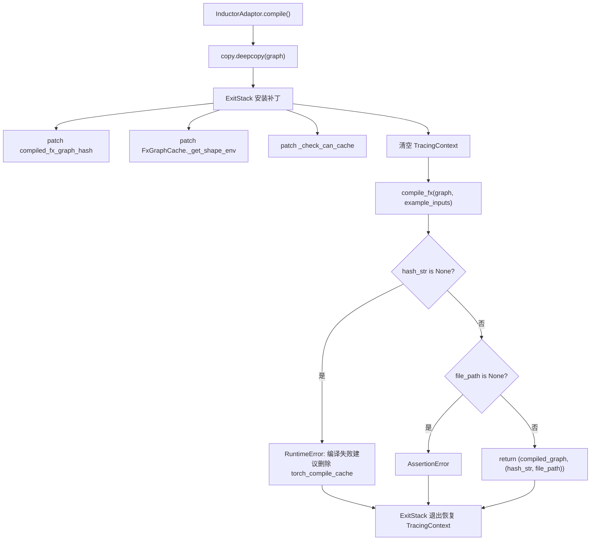
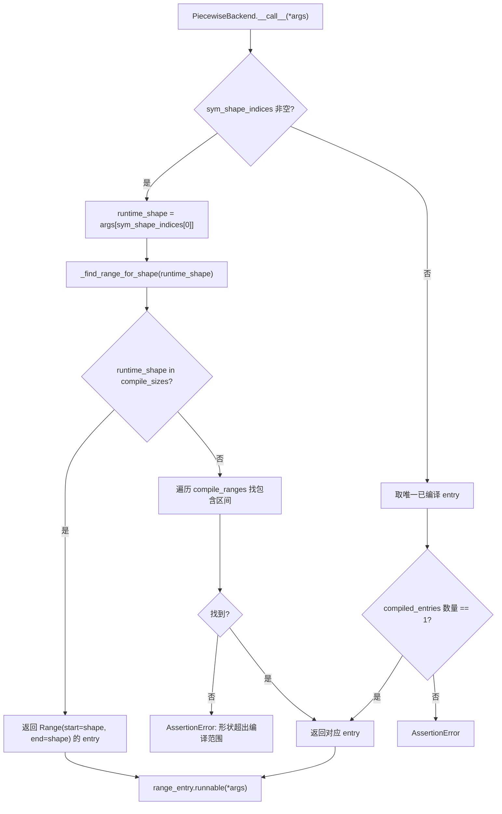

# Kapitel 10: Kompilierungsbeschleunigung und CUDA Graph: Beseitigung von Start- und Scheduling-Overhead

Im vorherigen Kapitel haben wir gesehen, wie der KV Connector über Konnektoren wie NIXL und Mooncake den KV cache effizient zwischen Prefill- und Decode-Engines transportiert, wodurch die disaggregierte Architektur TTFT senkt und gleichzeitig die Ressourcennutzung verbessert. Doch selbst wenn die Übertragung noch so schnell ist, gibt es bei der autoregressiven Dekodierung zwei feste Kosten, die nicht durch Algorithmen beseitigt werden können: den Scheduling-Overhead des Python-Interpreters und den Start-Overhead der GPU-Kernel. Wenn der Vorwärtsdurchlauf des Modells in Hunderte von Operatoren aufgeteilt wird und jeder Operator einen Python-Funktionsaufruf und einen CUDA-Kernel-Start durchlaufen muss, reicht der CPU-seitige Overhead aus, um die GPU zwischen zwei Berechnungen leerlaufen zu lassen. Dieses Kapitel analysiert, wie vLLM mit torch.compile Operatoren zu einem statischen Graphen fusioniert und dann mit CUDA Graph die gesamte Kernel-Startsequenz als einmalige Wiedergabe aufzeichnet, um diese beiden Arten von Overhead nahezu auf null zu drücken.

# Kompilierungs-Cache und Compiler-Anpassungsschicht: Wiederverwendung von Kompilierungsergebnissen über Prozesse hinweg

## Intuitives Modell

Der Nutzen der Kompilierungsbeschleunigung ist „einmal kompilieren, mehrfach ausführen“, aber der Preis ist, dass die erstmalige Kompilierung mehrere Minuten dauern kann. Ohne Cache müsste bei jedem Dienstneustart neu kompiliert werden, und die Kaltstartzeit wäre nicht akzeptabel.`CompilerInterface`Diese Schicht muss genau das Problem lösen, „wie Kompilierungsartefakte serialisiert, wie sie mit einem Hash gekennzeichnet und wie sie beim nächsten Start präzise getroffen werden“. Ohne sie besteht die Katastrophe für das System nicht in einem Absturz, sondern darin, dass jeder Neustart zu einem „ersten Lauf“ degeneriert – in einer Produktionsumgebung mit automatischer Skalierung bedeutet dies, dass hochskalierte Instanzen mehrere Minuten lang keine Dienste mit niedriger Latenz bereitstellen können.

## Datenstrukturen und Schnittstellenverträge

`CompilerInterface`Definiert den abstrakten Vertrag des Compiler-Adapters, dessen Kern vier Methoden sind:`initialize_cache`Ist dafür verantwortlich, das Cache-Verzeichnis des Compilers selbst in das Cache-Verzeichnis von vLLM umzuleiten[FACT:vllm/compilation/compiler_interface.py:36-51]；`compute_hash`Sammelt compilerbezogene Konfigurationsinformationen und erzeugt einen Hash[FACT:vllm/compilation/compiler_interface.py:53-62]；`compile`Führt die Kompilierung aus und gibt ein aufrufbares Objekt und ein Handle zurück[FACT:vllm/compilation/compiler_interface.py:64-95]；`load`Stellt das Kompilierungsergebnis aus dem Handle wieder her[FACT:vllm/compilation/compiler_interface.py:97-103]。

Das entscheidende Design hier ist`compile`Gibt ein Tupel zurück`(callable, handle)`。`callable`Ist das in diesem Prozess direkt aufrufbare Kompilierungsergebnis;`handle`Ist der Nachweis, „der beim nächsten Start zur Wiederherstellung verwendet wird“, und die Dokumentation verlangt ausdrücklich, dass es ein „plain Python object, preferably a string or a file path“ sein sollte[FACT:vllm/compilation/compiler_interface.py:81-81]. Diese Trennung ermöglicht es, dass der Cache-Treffer-Pfad und der Erstkompilierungspfad völlig unterschiedlichen Code durchlaufen – bei einem Treffer wird überhaupt kein`compile`benötigt, nur`load`。

`compile_range`Der Parameter trägt die Semantik dynamischer Formen. Der Kommentar erklärt, dass er „could be concrete size (if compile_sizes is provided), e.g. [4, 4] or a range [5, 8]“ sein kann und dass „Right now we only support one variable in ranges for all inputs, which is the batchsize (number of tokens) during inference“[FACT:vllm/compilation/compiler_interface.py:74-74]. Dies ist die zentrale Einschränkung der Kompilierungsstrategie von vLLM: Alle dynamischen Formen werden auf eine einzige Variable reduziert – die Token-Anzahl.

## Szenariogesteuert: Der vollständige Ablauf einer Kompilierungsanfrage

Angenommen, der Dienst wird zum ersten Mal gestartet und`InductorAdaptor.compile`Wird aufgerufen. Es erhöht zunächst den Kompilierungszähler[FACT:vllm/compilation/compiler_interface.py:477-489], und tritt dann in einen sorgfältig konstruierten Patch-Stack ein.

Der erste Schritt ist das tiefe Kopieren des Graphen. Der Kommentar weist darauf hin, dass „inductor can inplace modify the graph, so we need to copy it“[FACT:vllm/compilation/compiler_interface.py:500-502], dies ist ein defensives Design – nach einem Kompilierungsfehler kann der ursprüngliche Graph weiterhin für einen erneuten Versuch verwendet werden.

Der zweite Schritt ist die Installation einer Reihe von Monkey-Patches.`hijacked_compile_fx_inner`Umhüllt die interne Kompilierungsfunktion von Inductor und greift nach Abschluss der Kompilierung aus`inductor_compiled_graph._fx_graph_cache_key`Den Hash ab[FACT:vllm/compilation/compiler_interface.py:512-536]。`hijack_compiled_fx_graph_hash`Fängt dagegen die Hash-Berechnungsfunktion selbst ab[FACT:vllm/compilation/compiler_interface.py:538-542]. Warum den Hash „entführen“? Weil vLLM außerhalb des Dynamo-Tracing-Kontexts separat kompilieren muss und die Hash-Berechnung von Inductor von diesem Kontext abhängt.

Der dritte Schritt ist`_check_can_cache`Patch, der direkt zurückkehrt und keine Prüfungen durchführt[FACT:vllm/compilation/compiler_interface.py:544-551]. Der Kommentar erklärt die Motivation: „Inductor weigert sich, den Graphen außerhalb des Dynamo-Tracing-Kontexts zu cachen, und deaktiviert auch das Caching für Graphen mit High-Order-Ops. Für vLLM wollen wir in beiden Fällen den Graphen cachen“[FACT:vllm/compilation/compiler_interface.py:544-551]。

Der vierte Schritt ist die Bereinigung des Tracing-Kontexts. Dies ist die subtilste Stelle: vLLM ruft von`PiecewiseCompileInterpreter`intern auf`compile_fx`, wobei Dynamos`FakeTensorMode`und die Subgraph-Eingabe`FakeTensorMode`nicht übereinstimmen,`detect_fake_mode()`schlägt die Assertion fehl[FACT:vllm/compilation/compiler_interface.py:615-622]. Der Code speichert`TracingContext`, setzt es dann auf null und registriert einen Callback, um es beim Beenden wiederherzustellen[FACT:vllm/compilation/compiler_interface.py:623-630]。

## Designüberlegungen: AlwaysHitShapeEnv und Cache-Konsistenz

`AlwaysHitShapeEnv`Diese Klasse verdient eine separate Analyse. Ihr Docstring erklärt die Motivation unmissverständlich: vLLM führt nur einmal eine Dynamo-Bytecode-Kompilierung durch, muss aber Inductor-Kompilierungen mit verschiedenen Shapes plus einer generischen Shape mehrfach ausführen; die shapespezifische Kompilierung findet außerhalb des Dynamo-Kontexts statt, wo keine Shape-Environment für Inductor verfügbar ist, was zu Fehlern bei der Inductor-Code-Cache-Suche führt[FACT:vllm/compilation/compiler_interface.py:114-131]。

Die Lösung besteht darin, eine „immer treffende“ Fake-Shape-Environment bereitzustellen:`evaluate_guards_expression`gibt konstant zurück`True` [FACT:vllm/compilation/compiler_interface.py:144-145]，`get_pruned_guards`gibt eine leere Liste zurück[FACT:vllm/compilation/compiler_interface.py:144-145]，`produce_guards_expression`gibt einen leeren String zurück[FACT:vllm/compilation/compiler_interface.py:147-159]. Der Kommentar gibt offen zu, dass diese Methoden „obtained by trial-and-error until it works“ sind[FACT:vllm/compilation/compiler_interface.py:137-142]– dies ist ein fragiler Punkt, der an PyTorch-Interna gekoppelt ist, und die Stelle, die bei einem PyTorch-Upgrade am wahrscheinlichsten Probleme verursacht.

Die Zusammensetzung des Cache-Hashes ist ebenfalls entscheidend.`get_inductor_factors`sammelt drei Arten von Faktoren: Systemzustand`CacheBase.get_system()`, PyTorch-Zustand`torch_key()`sowie die Konfiguration von Inductor und functorch[FACT:vllm/compilation/compiler_interface.py:165-185]. Beachten Sie, dass die functorch-Konfiguration im`patch(_get_vllm_functorch_config())`-Kontext erfasst wird[FACT:vllm/compilation/compiler_interface.py:188-189], was sicherstellt, dass „die Kompilierungszeitkonfiguration und der Cache-Schlüssel stets konsistent sind“ – der Kommentar sagt ausdrücklich, dass dies dazu dient,`set_functorch_config()`und`get_inductor_factors()`konsistent zu halten[FACT:vllm/compilation/compiler_interface.py:147-159]. Wenn diese beiden Stellen inkonsistent sind, entsteht eine Fehlpaarung, bei der „zur Kompilierungszeit Konfiguration A verwendet wurde, der Cache-Schlüssel aber nach Konfiguration B berechnet wird“, was dazu führt, dass bei einem Cache-Treffer das falsche Artefakt geladen wird.

Produktions-Fallstricke:`_patch_standalone_compile_atomic_save`ist ein Backport für torch < 2.10.0[FACT:vllm/compilation/compiler_interface.py:205-243]. Es ändert`CompiledArtifact.save()`dahingehend, dass`write_atomic`zum Schreiben des Binärformats verwendet wird; der Kommentar erläutert den Zweck: „preventing corrupt cache files when multiple processes compile concurrently“[FACT:vllm/compilation/compiler_interface.py:208-210]. Im Szenario eines gleichzeitigen Kaltstarts mehrerer Replikate schreiben mehrere Prozesse gleichzeitig in dieselbe Cache-Datei; nicht-atomare Schreibvorgänge erzeugen halbe Dateien, und nachfolgende Prozesse lesen beschädigte Artefakte, was zu unvorhersehbarem Verhalten führt.

# PiecewiseBackend: Kompilierung nach Shape-Stufen und Laufzeit-Dispatch

## Intuitives Modell

`PiecewiseBackend`ist der Koordinationsknotenpunkt zwischen Kompilierung und Ausführung. Es kompiliert „einen FX-Subgraphen“ in „aufrufbare Objekte für mehrere Shape-Stufen“ und wählt zur Laufzeit anhand der tatsächlichen Token-Anzahl das am besten geeignete aus. Ohne dieses Modul müssten entweder alle Shapes dieselbe generische Kompilierung durchlaufen (suboptimale Leistung) oder jede Shape einzeln kompiliert werden (explodierende Kompilierungszeit).

## Datenstruktur: RangeEntry und Kompilierungsbereich

Die zentrale Datenstruktur ist`RangeEntry`, die das`compile_range`、`compiled`-Flag und`runnable`miteinander verbindet[FACT:vllm/compilation/piecewise_backend.py:80-83]。`PiecewiseBackend`. Die Konstruktion eines`range_entries: dict[Range, RangeEntry]` [FACT:vllm/compilation/piecewise_backend.py:166-171]。

-Kompilierungsbereichs erfolgt in zwei Schritten. Zuerst wird`compile_sizes`(exakte Größe) behandelt; für jede Größe wird ein`Range(start=size, end=size)`Einzelpunktintervall erzeugt[FACT:vllm/compilation/piecewise_backend.py:166-171]. Beachten Sie, dass hier für den String`"cudagraph_capture_sizes"`direkt`NotImplementedError`geworfen wird, mit der Erläuterung „should be handled in`post_init_cudagraph_sizes`" [FACT:vllm/compilation/piecewise_backend.py:166-171]“ – dies ist eine explizite Erklärung der Zuständigkeitsgrenze. Dann wird`compile_ranges`(Intervall) behandelt; für jedes Intervall wird ein Entry erzeugt[FACT:vllm/compilation/piecewise_backend.py:173-173]。

`PiecewiseBackend`. Es werden zwei sich gegenseitig ausschließende Modi unterstützt, und der Konstruktor erzwingt dies durch eine XOR-Assertion[FACT:vllm/compilation/piecewise_backend.py:117-119]: Der Kompilierungsmodus (mit graph, ohne compiled_runnables) verwendet`compile_all_ranges()` [FACT:vllm/compilation/piecewise_backend.py:193-194]; der Vorkompilierungsmodus (ohne graph, mit compiled_runnables) verwendet`load_all_ranges()` [FACT:vllm/compilation/piecewise_backend.py:193-194]. Dieses Design ermöglicht es Kaltstart und Warmstart, dieselbe Klasse zu teilen, nur mit unterschiedlichen Datenquellen.

## Szenariogesteuert: Von der Kompilierung zum Laufzeit-Dispatch

**Kompilierungsphase**：`compile_all_ranges`durchläuft alle Range-Einträge und ruft für jeden nicht kompilierten Eintrag`_log_compile_start`auf, wobei Tracing-Ereignisse aufgezeichnet werden[FACT:vllm/compilation/piecewise_backend.py:252-256]. Die entscheidende Verzweigung liegt in der Parameterkonstruktion: Bei einer Einzelpunktgröße wird`create_concrete_args`aufgerufen, um einen FakeTensor mit konkreter Shape zu erzeugen[FACT:vllm/compilation/piecewise_backend.py:258-261]; andernfalls wird`get_fake_args_from_graph`aufgerufen, um direkt die Placeholder-Metadaten aus dem Graphen wiederzuverwenden[FACT:vllm/compilation/piecewise_backend.py:262-263]。

`create_concrete_args`. Die Implementierung von`ShapeEnv`offenbart die Details der Symbolic-Shape-Konkretisierung. Es wird ein`FakeTensorMode` [FACT:vllm/compilation/piecewise_backend.py:54]mit`SymInt`konstruiert und dann werden die Placeholder-Knoten durchlaufen. Für Eingaben vom Typ`concretize`werden mit`size` [FACT:vllm/compilation/piecewise_backend.py:47-52]alle freien Symbole durch`Tensor`ersetzt; für den Typ`compute_required_storage_length`müssen gleichzeitig Shape, Stride und Storage-Offset konkretisiert werden, und mit`as_strided`wird die erforderliche Speicherlänge berechnet, um dann über[FACT:vllm/compilation/piecewise_backend.py:64-73]. Warum kann man nicht nur die Shape ändern? Weil stride und storage_offset ebenfalls Symbole enthalten können und alle drei konsistent sein müssen, sonst`as_strided`kommt es zu einem Out-of-Bounds-Zugriff.

**Laufzeit-Dispatch**：`__call__`ist ein Hot Path. Falls`sym_shape_indices`existiert, wird aus`args`die Laufzeit-Shape[FACT:vllm/compilation/piecewise_backend.py:357-362]entnommen und dann`_find_range_for_shape`aufgerufen, um zu suchen. Die Suchlogik hat eine Priorität: Zuerst wird geprüft, ob ein exakter`compile_sizes`getroffen wird; bei Treffer wird dieses Einzelpunkt-Intervall[FACT:vllm/compilation/piecewise_backend.py:342-355]zurückgegeben; andernfalls wird`compile_ranges`durchlaufen, um das Intervall zu finden, das diese Shape enthält.[FACT:vllm/compilation/piecewise_backend.py:342-355]。

## Designüberlegung: Serialisierung und die spezielle Behandlung des CachingAutotuner

> **[Design Inference & Architectural Trade-offs]**
> `to_bytes`Die Methode ist dafür verantwortlich, das Kompilierungsartefakt zu serialisieren, für den AOT-Cache. Hier gibt es einen raffinierten`reducer_override`: Wenn pickle auf`CachingAutotuner`trifft, wird zuerst`obj.prepare_for_pickle()`aufgerufen und dann[FACT:vllm/compilation/piecewise_backend.py:209-218]serialisiert. Warum wird dieser Hook benötigt?`CachingAutotuner`hält intern Triton-Kompilierungsartefakte und Laufzeitzustand; direktes Pickling kann fehlschlagen oder nicht wiederverwendbare Objekte erzeugen;`prepare_for_pickle`wandelt das Objekt offensichtlich in eine serialisierbare, reine Form um.

Bei der Serialisierung wird außerdem vorübergehend`bundled_autograd_cache` [FACT:vllm/compilation/piecewise_backend.py:222]aktiviert, was mit der Logik in`_get_vllm_functorch_config`übereinstimmt – wenn`VLLM_USE_MEGA_AOT_ARTIFACT`nicht aktiviert ist, ist diese Konfiguration`False` [FACT:vllm/compilation/compiler_interface.py:160-161], bei der Serialisierung wird sie jedoch auf`True`erzwungen, um sicherzustellen, dass das Artefakt gepackt wird.

`load_all_ranges`ist der Warmstart-Pfad; er stellt sicher, dass jeder range einen entsprechenden Key in`compiled_runnables`findet, andernfalls wird ein Fehler mit der Liste der verfügbaren Keys geworfen[FACT:vllm/compilation/piecewise_backend.py:329-339]. Diese Fehlermeldung ist sehr praktisch gestaltet – sie listet die verfügbaren Keys direkt auf, was die Fehlersuche bei Cache-Versionskonflikten erleichtert.

# CUDA-Graph-Wrapper: Aufzeichnung, Wiedergabe und verschachtelter Dispatch

## Intuitives Modell

CUDA Graph zeichnet „eine Folge von Kernel-Starts" als statischen Graphen auf; jede spätere Wiedergabe erfordert nur einen einzigen API-Aufruf.`CUDAGraphWrapper`ist der Ausführende von Aufzeichnung und Wiedergabe. Die zentrale Herausforderung: Die Batch-Größe von vLLM ist dynamisch, während CUDA Graph feste Eingabeadressen erfordert. Die Lösung ist „Aufzeichnung nach Batch-Descriptor-Stufen" – für jede Shape-Stufe wird ein Graph aufgezeichnet, und zur Laufzeit wird per Descriptor in der Tabelle nachgeschlagen und wiedergegeben.

## Datenstruktur: CUDAGraphEntry und Dispatch-Vertrag

`CUDAGraphEntry`hält drei Schlüsselfelder:`batch_descriptor`als Dispatch-Schlüssel[FACT:vllm/compilation/cuda_graph.py:128-135]、`cudagraph`ist das aufgezeichnete Graph-Objekt[FACT:vllm/compilation/cuda_graph.py:128-135]、`output`ist die Ausgabe zum Zeitpunkt der Aufzeichnung (als Weak Reference gespeichert, um Speicher zu sparen)[FACT:vllm/compilation/cuda_graph.py:128-135]。`input_addresses`dient nur im Debug-Modus zur Überprüfung, dass die Eingabeadressen bei der Wiedergabe übereinstimmen.[FACT:vllm/compilation/cuda_graph.py:128-135]。

`CUDAGraphWrapper`Die Klassendokumentation von beschreibt den Dispatch-Vertrag präzise: Bei der Initialisierung wird ein Runtime-Modus (FULL oder PIECEWISE) zugewiesen[FACT:vllm/compilation/cuda_graph.py:158-158]; zur Laufzeit werden runtime_mode und batch_descriptor aus dem Forward-Context empfangen und „blindly trust them"[FACT:vllm/compilation/cuda_graph.py:158-158]; wenn runtime_mode NONE ist oder nicht übereinstimmt, wird direkt[FACT:vllm/compilation/cuda_graph.py:158-158]aufgerufen; andernfalls wird die Aufzeichnung oder Wiedergabe ausgeführt.[FACT:vllm/compilation/cuda_graph.py:158-158]。

Die Dokumentation erklärt außerdem ausdrücklich eine Grenze: „CUDAGraphWrapper does not store persistent buffers or copy any runtime inputs into that buffers for replay"[FACT:vllm/compilation/cuda_graph.py:164-164]. Das bedeutet, die Verwaltung der Eingabepuffer liegt in der Verantwortung des Aufrufers – der Wrapper kümmert sich nur um den Graphen selbst.

## Szenariogetrieben: eine Aufzeichnung und eine Wiedergabe

**Aufzeichnungspfad**: Wenn`__call__`ausgelöst wird und der runtime_mode übereinstimmt, wird zuerst geprüft, ob der Forward-Context verfügbar ist. Falls nicht (z. B. der Forward des Vision-Encoders), wird direkt die zugrunde liegende Funktion[FACT:vllm/compilation/cuda_graph.py:232-233]aufgerufen. Dies ist der entscheidende Zweig für multimodale Szenarien – der ViT-Forward durchläuft nicht CUDA Graph.

Als Nächstes werden`batch_descriptor`und`cudagraph_runtime_mode` [FACT:vllm/compilation/cuda_graph.py:242-244]entnommen. Wenn der Modus NONE ist oder nicht übereinstimmt, wird direkt[FACT:vllm/compilation/cuda_graph.py:246-256]aufgerufen. Dieses Design des „Durchreichens bei Nichtübereinstimmung" ermöglicht die Koexistenz verschachtelter Wrapper: FULL-Wrapper außen, PIECEWISE-Wrapper innen; zur Laufzeit wird nur einer aktiviert.

Wenn das`cudagraph`des Eintrags None ist, wird die Aufzeichnung begonnen. Zuerst wird`validate_cudagraph_capturing_enabled()`aufgerufen, um die Gültigkeit zu prüfen[FACT:vllm/compilation/cuda_graph.py:279], dann werden die Eingabeadressen aufgezeichnet[FACT:vllm/compilation/cuda_graph.py:281-284], und`torch.cuda.CUDAGraph()` [FACT:vllm/compilation/cuda_graph.py:285]。

erstellt. Im Aufzeichnungskontext gibt es mehrere kritische Operationen. Wenn`gc_disable`aktiviert ist, werden`gc.collect`und`torch.accelerator.empty_cache` [FACT:vllm/compilation/cuda_graph.py:288-303]gepatcht. Der Kommentar erklärt den Grund: Im Piecewise-Modus muss für jede Schicht ein Graph aufgezeichnet werden; wiederholte GC würde die Aufzeichnung extrem verlangsamen, daher „only run gc for the first graph, and disable gc for the rest"[FACT:vllm/compilation/cuda_graph.py:289-294]. Danach wird die Graph-Pool-ID gesetzt[FACT:vllm/compilation/cuda_graph.py:305-308], und der Copy-Stream des Offloaders wird synchronisiert.[FACT:vllm/compilation/cuda_graph.py:310-312]。

Die eigentliche Aufzeichnung erfolgt im`torch.cuda.graph(cudagraph, pool=..., stream=...)`-Kontext`self.runnable(*args, **kwargs)` [FACT:vllm/compilation/cuda_graph.py:315-321]. Nach der Aufzeichnung wird`get_offloader().join_after_forward()`aufgerufen, um Fehler durch nicht gejointen Streams zu vermeiden[FACT:vllm/compilation/cuda_graph.py:322-326]. Wenn`weak_ref_output`aktiviert ist, wird die Ausgabe in eine Weak Reference umgewandelt, um Speicher zu sparen[FACT:vllm/compilation/cuda_graph.py:327-334]. Schließlich speichert der Eintrag die Weak-Reference-Ausgabe und das Graph-Objekt[FACT:vllm/compilation/cuda_graph.py:338-339], aber**zurückgegeben wird die ursprüngliche Ausgabe, nicht die Weak Reference**– der Kommentar betont, dass dies nötig ist, damit PyTorch während der Aufzeichnung den Speicher korrekt verwaltet.[FACT:vllm/compilation/cuda_graph.py:343-346]。

**Wiedergabepfad**: Wenn der Eintrag bereits einen Graphen hat, wird im Debug-Modus die Übereinstimmung der Eingabeadressen geprüft[FACT:vllm/compilation/cuda_graph.py:348-357], dann der Offloader synchronisiert[FACT:vllm/compilation/cuda_graph.py:359-361], und`entry.cudagraph.replay()`aufgerufen und zurückgegeben.`entry.output` [FACT:vllm/compilation/cuda_graph.py:362-363]。

## Designüberlegung: Warum die Ausgabe eine schwache Referenz sein muss, die Rückgabe jedoch eine starke Referenz

Dies ist`CUDAGraphWrapper`eine der kontraintuitivsten Stellen in`output`wird bei der Erfassung vom cudagraph-Pool von PyTorch verwaltet[FACT:vllm/compilation/cuda_graph.py:320]. Wenn der Eintrag output stark referenziert, kann der von diesem Graphen belegte Speicher niemals freigegeben werden; wenn man ihn jedoch während der Erfassung in eine schwache Referenz umwandelt, könnte PyTorch den Speicher vor Abschluss der Erfassung freigeben, was die Erfassung fehlschlagen lässt. Daher verwendet der Code innerhalb des Erfassungsblocks eine schwache Referenz[FACT:vllm/compilation/cuda_graph.py:334], speichert im Eintrag eine schwache Referenz[FACT:vllm/compilation/cuda_graph.py:338], aber der Rückgabewert der Funktion ist eine starke Referenz[FACT:vllm/compilation/cuda_graph.py:346]. Dieser „dreifache Referenzzustand" ist eine präzise Balance zwischen Speichersicherheit und Speichereffizienz.

Ein weiteres bemerkenswertes Design ist`_all_instances`dieses`WeakSet` [FACT:vllm/compilation/cuda_graph.py:173-176]. Es ermöglicht`clear_all_graphs`, alle Graphen aller Wrapper auf einmal zu leeren[FACT:vllm/compilation/cuda_graph.py:173-176], für Notfall-Rückgewinnung bei knappem Speicher. Die Verwendung von`WeakSet`statt einer normalen Menge dient dazu, den Wrapper nicht am GC zu hindern – andernfalls würde der Wrapper selbst lecken.

Produktions-Fallstricke:`__getattr__`Die Implementierung von[FACT:vllm/compilation/cuda_graph.py:211-217]wirft im Debug-Modus einen Fehler mit Kontext für nicht existierende Attribute`AttributeError`. Das scheint eine Kleinigkeit zu sein, aber bei der Fehlersuche „warum ein bestimmter Methodenaufruf fehlschlägt" ist die Zeichenkettenbeschreibung des vom Wrapper umschlossenen Runnable weitaus nützlicher als ein nacktes

# Designüberlegung: Entkopplung von Kompilierung und CUDA Graph

Das Designdokument dokumentiert ausdrücklich die Motivation für dieses Refactoring. Die frühe piecewise-Kompilierung diente dazu, piecewise CUDA Graph-Erfassung zu unterstützen und Operatoren, die CUDA Graph nicht unterstützen (hauptsächlich attention), auszuschließen[FACT:docs/design/cuda_graphs.md:25]. Später wurde full CUDA Graph-Unterstützung hinzugefügt, aber „this tight coupling between compilation and cudagraph capture led to an all-or-nothing experience with little flexibility"[FACT:docs/design/cuda_graphs.md:25]。

Nach dem Refactoring gibt es vier Ziele: prefill/mixed- und uniform-decode-Batches explizit unterscheiden und getrennt erfassen[FACT:docs/design/cuda_graphs.md:25-25]; die CUDA Graph-Erfassungslogik von der Kompilierung entkoppeln, sodass „capturing piecewise and full cudagraphs using the same compiled graph"[FACT:docs/design/cuda_graphs.md:25-25]; zur Laufzeit nach Batch-Zusammensetzung dispatchen[FACT:docs/design/cuda_graphs.md:25-25]; zentrale Steuerung zur Reduzierung der Komplexität[FACT:docs/design/cuda_graphs.md:25-25]。

`BatchDescriptor`ist die Kernstruktur des Dispatch-Schlüssels und enthält`num_tokens`、`num_reqs`、`uniform`、`has_lora`vier Felder[FACT:docs/design/cuda_graphs.md:86-93]。`uniform`Das Flag ist besonders kritisch – viele attention-Backends unterstützen full CUDA Graph nur, wenn der Batch uniform ist[FACT:docs/design/cuda_graphs.md:95-95]. Das Dokument kündigt außerdem an, dass diese Struktur möglicherweise erweitert wird, z. B. durch Hinzufügen von`uniform_query_len`zur Unterstützung mehrerer uniform decode-Längen[FACT:docs/design/cuda_graphs.md:95-95]。

Die Dispatch-Priorität ist`FULL > PIECEWISE > None`, und wenn der Dispatch-Schlüssel nicht existiert, wird auf den NONE-Modus für eager-Ausführung zurückgegriffen[FACT:docs/design/cuda_graphs.md:112-115]. Diese „Degradierung statt Fehler"-Strategie stellt sicher, dass jede Batch-Kombination ausgeführt werden kann, nur mit unterschiedlicher Leistung.

`AttentionCGSupport`Die Enumeration quantifiziert die CUDA Graph-Fähigkeiten des Backends, mit den Werten`ALWAYS=3 > UNIFORM_BATCH=2 > UNIFORM_SINGLE_TOKEN_DECODE=1 > NEVER=0` [FACT:docs/design/cuda_graphs.md:153-162]. Hybride attention-Modelle (wie mamba mixer) nehmen das Minimum aller Backend-Fähigkeiten und degradieren entsprechend den CUDA Graph-Modus[FACT:docs/design/cuda_graphs.md:173-175]. Dieses Design entkoppelt „Fähigkeitsdeklaration" von „Modusauswahl" – ein neues Backend muss nur seine Fähigkeiten deklarieren, die Degradierungsstrategie greift automatisch.

# Kapitelzusammenfassung

# Kapitelüberlegungen und Selbsttest

Q1: Wenn man den`_check_can_cache`Patch ([FACT:vllm/compilation/compiler_interface.py:544-551]) entfernt und Inductor selbst entscheiden lässt, ob gecacht wird, in welchen Szenarien würde dann der Kompilierungs-Cache ungültig werden? Warum besagt der Kommentar „Inductor refuses to cache the graph outside of Dynamo tracing context"?

**Referenzanalyse**：`_check_can_cache`gibt direkt zurück, ohne jegliche Prüfung; der Kommentar erklärt, dass Inductor in zwei Fällen das Cachen ablehnt: außerhalb des Dynamo-Tracing-Kontexts und wenn der Graph Operatoren höherer Ordnung enthält[FACT:vllm/compilation/compiler_interface.py:544-551]. Der Kompilierungsablauf von vLLM liegt genau außerhalb des Dynamo-Kontexts (`compile_fx`wird von`PiecewiseCompileInterpreter`aufgerufen, und der Code leert explizit`TracingContext` [FACT:vllm/compilation/compiler_interface.py:623-625]). Wenn der Patch entfernt würde, würde Inductor „nicht cachebar" urteilen und bei jedem Start neu kompilieren, wodurch die Kaltstartzeit von Sekunden auf Minuten degradiert. Noch subtiler: Da vLLM darauf angewiesen ist, dass`hijacked_compile_fx_inner`abruft`hash_str`, könnte bei Überspringen des Cache-Pfads`hash_str`None sein, was einen RuntimeError von[FACT:vllm/compilation/compiler_interface.py:640-652]auslöst. Dies erklärt, warum der Kommentar betont „vLLM today assumes and requires the monkey-patched functions to get hit"[FACT:vllm/compilation/compiler_interface.py:596-598]。

Q2: `CUDAGraphWrapper`wandelt bei der Erfassung output in eine schwache Referenz um und speichert sie im Eintrag ([FACT:vllm/compilation/cuda_graph.py:338]), gibt aber eine starke Referenz zurück ([FACT:vllm/compilation/cuda_graph.py:346]). Wenn man den Rückgabewert ebenfalls in eine schwache Referenz ändern würde, in welchen Szenarien würde es abstürzen?

**Referenzanalyse**: Während der Erfassung wird`output`vom cudagraph-Pool von PyTorch verwaltet[FACT:vllm/compilation/cuda_graph.py:320]. Wenn der Rückgabewert eine schwache Referenz ist, kann das vom Aufrufer erhaltene Objekt unmittelbar nach dem Verlassen des Catch-Blocks vom GC eingesammelt werden – da zu diesem Zeitpunkt keine starke Referenz es hält. PyTorch benötigt während der Capture-Phase, dass output am Leben bleibt, um die Mapping-Beziehung des Speicherpools korrekt aufzubauen; sobald es eingesammelt wird, ist bei der späteren Wiedergabe`entry.output`die schwache Referenz, auf die gezeigt wird, bereits ungültig,`replay()`das nach dem Zurückgeben erhaltene Objekt kann bereits überschrieben oder freigegeben sein. Der Kommentar sagt ausdrücklich: „we need to return the output, rather than the weak ref of the output, so that pytorch can correctly manage the memory during cuda graph capture“[FACT:vllm/compilation/cuda_graph.py:343-345]. Dieses Design ist eine präzise Balance zwischen „starke Referenz während der Capture-Phase, schwache Referenz während der Speicherphase“.

Q3: In`PiecewiseBackend._find_range_for_shape`（[FACT:vllm/compilation/piecewise_backend.py:342-355]) hat die exakte Größenabfrage Vorrang vor der Bereichsabfrage. Angenommen`compile_sizes=[8]`、`compile_ranges=[Range(1,16)]`, zur Laufzeit shape=8, welcher entry wird getroffen? Welche Konsequenzen hätte es, wenn man die Priorität umkehrt?

**Referenzanalyse**: Die aktuelle Logik prüft zuerst`runtime_shape in self.compile_sizes`, bei Treffer wird`Range(start=8, end=8)`der Einzelpunkt-entry zurückgegeben[FACT:vllm/compilation/piecewise_backend.py:342-355]. Dieser entry wurde mit`create_concrete_args`kompiliert, die Form ist vollständig konkretisiert, der Triton-Kernel kann maximal spezialisiert werden (z. B. wird in`set_inductor_config`bei Einzelpunktgrößen`max_autotune` [FACT:vllm/compilation/compiler_interface.py:747-754]aktiviert). Wenn man die Priorität umkehrt, würde shape=8 den entry des Bereichs`Range(1,16)`treffen – das ist die generische Version, die mit symbolischen Formen kompiliert wurde, mit suboptimaler Leistung. Noch gravierender ist,`compile_sizes`stammt üblicherweise aus`cudagraph_capture_sizes`, diese Größen sind genau die Stufen, die CUDA Graph erfassen soll; wenn zur Laufzeit an den generischen entry dispatcht wird, stimmt das von CUDA Graph erfasste Diagramm nicht mit dem dispatchten runnable überein, was bei der Wiedergabe zu Formen-Nichtübereinstimmung führen kann. Daher ist exakte Priorität nicht nur eine Leistungswahl, sondern eine Korrektheitsanforderung.

Das nächste Kapitel wendet sich der Quantisierung und benutzerdefinierten Kernels zu und betrachtet, wie vLLM bereits ab der Gewichts-Ladephase in die Präzisionskontrolle eingreift und mit hochspezialisierten Operatoren die Quantisierungsgewinne tatsächlich in Durchsatzsteigerung umsetzt.

Dieses Kapitel hat die zweischichtige Mechanik der vLLM-Kompilierungsbeschleunigung analysiert. Die erste Schicht sind CompilerInterface und PiecewiseBackend: Ersteres definiert den Compiler-Adaptervertrag und die Cache-Hash-Strategie und umgeht mit AlwaysHitShapeEnv das Problem des fehlenden Dynamo-Kontexts; Letzteres kompiliert einen einzelnen FX-Subgraphen in mehrere Formstufen und dispatcht zur Laufzeit nach Token-Anzahl. Die zweite Schicht ist CUDAGraphWrapper: Er erfasst CUDA Graphs nach BatchDescriptor gestaffelt, realisiert verschachteltes Dispatching durch runtime-mode-Matching und lässt die beiden Modi FULL und PIECEWISE auf demselben kompilierten Graphen koexistieren. Die Entkopplung beider ist der Kern dieser Refaktorierung – die Kompilierungsartefakte können von beiden CUDA-Graph-Modi wiederverwendet werden, und CUDA Graph kann auch unabhängig von der Kompilierung arbeiten. Allerdings: Kompilierung und Graph-Capture lösen den Scheduling-Overhead, die Gewichtspräzision und Operatoreffizienz des Modells selbst bleiben eine weitere Optimierungslinie. Das nächste Kapitel wendet sich der Quantisierung und benutzerdefinierten Kernels zu und betrachtet, wie vLLM Quantisierungskonfigurationen parst, beim Gewichts-Laden Formatkonvertierungen wie FP8/INT4/AWQ/GPTQ abschließt und mit _custom_ops und Triton-Kernels die Hardwareleistung weiter auspresst.
