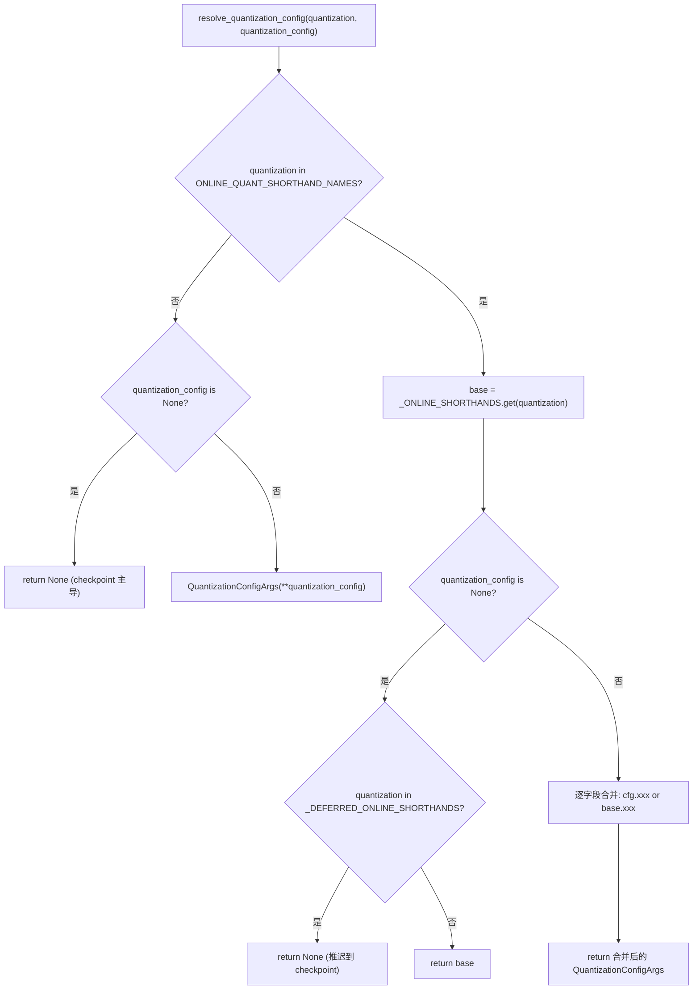
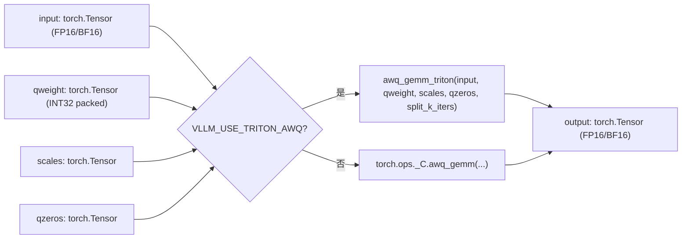
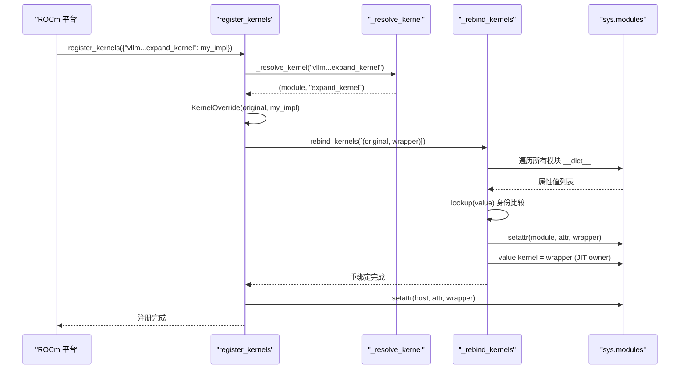

# Kapitel 11: Quantisierung und benutzerdefinierte Kernels: Vom Gewichts-Laden zu Hochleistungsoperatoren

Im vorherigen Kapitel haben wir gesehen, wie torch.compile und CUDA Graph den Python-Scheduling- und Kernel-Start-Overhead auf ein Minimum reduziert haben. Aber so schnell das Scheduling auch sein mag – wenn die Gewichte selbst FP16 sind und die Matrixmultiplikation über generisches GEMM läuft, wird die Hardware-Rechenleistung weiterhin von Speicherbandbreite und ineffizienten Operatoren ausgebremst. Quantisierung und benutzerdefinierte Kernels sind eine weitere orthogonale Optimierungslinie: Erstere senkt die Präzision bereits in der Gewichts-Ladephase, Letztere setzt die Quantisierungsgewinne tatsächlich in Durchsatz um. Dieses Kapitel beginnt beim Parsing-Einstieg der Quantisierungskonfiguration und führt bis zur Operator-Registrierung von _custom_ops und dem Triton-Kernel-Scheduling.

# 11.1 Quantisierungskonfiguration: Vom CLI-String zum QuantKey

## Intuitives Modell

Die Rolle des Quantisierungskonfigurationsmoduls gleicht einem Menüübersetzer in einem Restaurant. Der Benutzer sagt an der Theke „Ich möchte fp8_per_tensor“ (CLI-String), die Küche benötigt die präzise Rezeptnummer (`QuantKey`). Der Übersetzer muss drei Arten von Eingaben verarbeiten: reine CLI-Kurzschreibweise, im Checkpoint mitgelieferte Quantisierungs-Metadaten und den kombinierten Fall beider. Ohne diese Übersetzungsschicht erhielte die Küche einen Haufen mehrdeutiger Strings und könnte nicht entscheiden, welcher Kernel aufgerufen werden soll.

## Datenstrukturen und Speicherlayout

Die zentrale Datenstruktur ist`QuantSpec`und`QuantizationConfigArgs`. Erstere beschreibt die Gewichts- und Aktivierungs-Quantisierungsschlüssel einer einzelnen Schichtart (linear oder MoE), Letztere ist die benutzersichtbare Top-Level-Konfiguration.

[FACT:vllm/config/quantization.py:73-99]

```python
@config
class QuantSpec:
    weight: QuantKeyField = None
    activation: QuantKeyField = None

    def __str__(self) -> str:
        def quant_key_str(quant_key: QuantKey | None) -> str:
            if quant_key is None:
                return "None"
            return next(
                (
                    name
                    for name, known_quant_key in QUANT_KEY_NAMES.items()
                    if known_quant_key == quant_key
                ),
                str(quant_key),
            )
        return quant_key_str(self.weight)
```

`weight`und`activation`sind beide optional`QuantKey`。`None`Die Semantik von ist „Rückfall auf den eigenen Standardwert der Methodenklasse“ – normalerweise vom Checkpoint geerbt; im Online-Quantisierungs-Szenario bedeutet dies keine Quantisierung.[FACT:vllm/config/quantization.py:74-74]。`QuantKey`selbst ist ein komplexer Typ, der`NamedTuple`und`ClassVar[GroupShape]`Deklarationen enthält; pydantic kann ihn nicht direkt introspektieren, daher hat der Autor mit`GetPydanticSchema`einen benutzerdefinierten Validator injiziert,`_coerce_quant_key`der Zeichenketten oder`QuantKey`einheitlich normalisiert.[FACT:vllm/config/quantization.py:60-69]。

`QuantizationConfigArgs`Das Feldlayout von ist bemerkenswert:[FACT:vllm/config/quantization.py:102-126]：

- `linear` / `moe`wirkt jeweils auf`LinearBase`und`FusedMoEFactory`Ebenen;
- `ignore`Liste der Ebenennamen, die die Quantisierung überspringen; Online-Quantisierung unterstützt zusätzlich fnmatch-Wildcards;
- `targets`schichtweise Online-Quantisierungsüberschreibung; Schlüssel können exakte Ebenennamen,`re:`Präfix-Regexe oder fnmatch-Muster sein; Werte sind mit`linear`/`moe`gegenseitig ausschließend.

`targets`und`linear`/`moe`werden durch`model_validator`erzwungen[FACT:vllm/config/quantization.py:172-179]. Diese Einschränkung ist nicht formalistisch:`targets`verwendet den schichtweisen Überschreibungspfad,`linear`/`moe`verwendet den globalen Standardpfad; wenn beide gleichzeitig existieren, wird unentscheidbar, „welche Spezifikation eine bestimmte Schicht letztendlich verwendet“.

## Schritt für Schritt: eine`--quantization fp8_per_tensor`Analyse

Szenario: Der Benutzer übergibt auf der Kommandozeile`--quantization fp8_per_tensor`und gibt gleichzeitig über`--quantization-config`die Aktivierungsquantisierung der MoE-Schicht an.

Erster Schritt:`resolve_quantization_config`wird aufgerufen, Parameter sind der CLI-String und das Konfigurationswörterbuch[FACT:vllm/config/quantization.py:233-235]. Es prüft zunächst, ob`quantization`in`ONLINE_QUANT_SHORTHAND_NAMES`enthalten ist – dieses Tupel enthält alle Kurznamen plus ein`"online"` [FACT:vllm/config/quantization.py:216-222]。

Zweiter Schritt:`fp8_per_tensor`trifft die Kurznamen-Tabelle,`base`wird zu`_ONLINE_SHORTHANDS["fp8_per_tensor"]`aufgelöst, d. h. linear und moe verwenden beide`kFp8StaticTensorSym` [FACT:vllm/config/quantization.py:188-190]。

Dritter Schritt:`quantization_config`ist nicht leer und wird als`QuantizationConfigArgs`Objekt konstruiert. Danach folgt die Zusammenführungslogik[FACT:vllm/config/quantization.py:267-268]: Jedes Feld wird durch`quantization_config.xxx or base.xxx`entschieden – vom Benutzer explizit gesetzte Felder haben Vorrang, nicht gesetzte erben den Kurznamen-Standardwert. Hier wird`or`statt`if is not None`verwendet, was beabsichtigt ist:`QuantSpec`und leere Listen sind beide falsy; semantisch sind „nicht gesetzt“ und „leer“ äquivalent.

Vierter Schritt: Wenn`quantization`nicht in der Kurznamen-Tabelle ist (z. B. ein vom Checkpoint mitgebrachtes`awq`) und`quantization_config`gleich`None`ist, gibt die Funktion direkt`None` [FACT:vllm/config/quantization.py:256-257]zurück. Dies bedeutet „keine Online-Quantisierung überlagern“; die Quantisierungsmethode des Checkpoints bleibt maßgeblich.

Es gibt einen leicht zu übersehenden Zweig:`_DEFERRED_ONLINE_SHORTHANDS`enthält`mxfp4`und`mxfp8` [FACT:vllm/config/quantization.py:233-235]. Diese beiden Namen sind sowohl CLI-Kurznamen als auch Checkpoint-Quantisierungsmethodennamen. Wenn der Benutzer nur`--quantization mxfp4`übergibt und nicht`quantization_config`, gibt die Funktion`None`statt`base` [FACT:vllm/config/quantization.py:267-268]zurück und verschiebt die Entscheidung auf die Checkpoint-Metadaten – erst wenn der Checkpoint keine Quantisierungsinformationen hat, wird auf den Online-Kurznamen zurückgegriffen.



## Designüberlegungen und Fallstricke

`_coerce_spec`Der Validator behandelt ein subtiles Szenario: Wenn`linear`oder`moe`eine Zeichenkette erhält, wird zuerst`_ONLINE_SHORTHANDS`nachgeschlagen; bei Treffer wird die Spezifikation des entsprechenden Feldes entnommen; bei Nichttreffer wird sie als einzelner`QuantKey`Name behandelt[FACT:vllm/config/quantization.py:130-139]. Das bedeutet,`linear="fp8_per_tensor"`und`linear="fp8_per_tensor_static"`nehmen zwei verschiedene Pfade – Ersteres ist eine vollständige Konfigurationskurzform, Letzteres ein einzelner Quantisierungsschlüssel. Wenn das Feld im Kurznamen`None`ist (z. B.`int8_per_channel_weight_only`hat kein`linear`Feld), wird ein expliziter`ValueError`geworfen statt still`None` [FACT:vllm/config/quantization.py:130-139]。

zurückzugeben.`targets`Eine häufige Falle in Produktionsumgebungen:`_validate_targets`Regex-Schlüssel von werden in[FACT:vllm/config/quantization.py:166-167]vorkompiliert validiert, aber Schlüssel von fnmatch-Mustern werden nicht validiert. Wenn der Benutzer ein fnmatch-Muster schreibt, das nie eine Schicht trifft, gibt es keinen Fehler; die Schicht bleibt einfach unquantisiert – bei der Fehlersuche muss geprüft werden, ob der Schichtname wirklich übereinstimmt.

# 11.2 `_custom_ops`: Operator-Registrierung und Fake-Implementierung

## Intuitives Modell

`_custom_ops.py`ist die Anpassungsschicht zwischen vLLM und den zugrunde liegenden CUDA/C++-Operatoren, wie ein Zollamt. Im`torch.ops._C`Namensraum von PyTorch sind kompilierte C++-Operatoren registriert, aber der direkte Aufruf hat drei Probleme: Der Operatorsatz unterscheidet sich je nach Plattform (CUDA/ROCm/CPU/XPU),`torch.compile`benötigt Fake-Implementierungen zur Ableitung der Ausgabeform, und einige Operatoren benötigen Python-seitige Parameter-Vorverarbeitung.`_custom_ops`kapselt diese Probleme einheitlich.

## Datenstrukturen und Registrierungsmechanismus

Beim Laden des Moduls wird zuerst`current_platform.import_kernels()` [FACT:vllm/_custom_ops.py:25-26]aufgerufen, damit die Plattformschicht ihre eigene Operatorbibliothek importieren kann. Danach wird`register_fake`definiert – unter`TYPE_CHECKING`ein leerer Decorator, zur Laufzeit aus`torch.library`importiert[FACT:vllm/_custom_ops.py:25-26]。

Der Kernzweck der Fake-Implementierung besteht darin,`torch.compile`in der Trace-Phase die Ausgabeform und den dtype des Operators mitzuteilen, ohne ihn tatsächlich auszuführen. Am Beispiel von`scaled_fp4_quant`:

[FACT:vllm/_custom_ops.py:90-100]

```python
if hasattr(torch.ops, "_C") and hasattr(torch.ops._C, "scaled_fp4_quant"):

    @register_fake("_C::scaled_fp4_quant")
    def _scaled_fp4_quant_fake(
        input: torch.Tensor,
        input_scale: torch.Tensor,
        is_sf_swizzled_layout: bool,
    ) -> tuple[torch.Tensor, torch.Tensor]:
        n = input.shape[-1]
        m = input.numel() // n
        return create_fp4_output_tensors(m, n, input.device, is_sf_swizzled_layout)
```

Beachten Sie den`hasattr`Guard: Nur wenn die Plattform tatsächlich`_C::scaled_fp4_quant`registriert hat, wird die Fake-Implementierung definiert. Dies stellt sicher, dass der Import des Moduls auf CPU oder älteren GPUs nicht wegen fehlender Operatoren abstürzt.

`create_fp4_output_tensors`zeigt die Details des Speicherlayouts der FP4-Quantisierungsausgabe[FACT:vllm/_custom_ops.py:69-87]. Wenn`is_sf_swizzled_layout=True`, muss der Scale-Tensor gemäß dem von Tensor Cores geforderten 128x4-Tile-Layout angeordnet werden: Zeilenzahl aufgerundet auf ein Vielfaches von 128, Spaltenzahl (`n // 16`) aufgerundet auf ein Vielfaches von 4, jeweils 4 float8_e4m3 in einen int32 gepackt[FACT:vllm/_custom_ops.py:55-64]. Der Kommentar weist ausdrücklich darauf hin, dass der NVFP4-Quantisierungskernel alle Padding-Scale-Einträge explizit auf null setzt, daher ist kein separater Nullinitialisierungs-Kernel erforderlich[FACT:vllm/_custom_ops.py:60-61]。

## Schritt für Schritt: Der Aufrufablauf eines AWQ GEMM

Szenario: Das Modell hat AWQ-quantisierte Gewichte geladen; in der Vorwärtspropagation muss eine Matrixmultiplikation von Aktivierungen und quantisierten Gewichten durchgeführt werden.

Erster Schritt: Aufruf von`awq_gemm` [FACT:vllm/_custom_ops.py:587-592]. Die Funktion prüft zunächst die Umgebungsvariable`VLLM_USE_TRITON_AWQ`. Wenn wahr, wird`awq_gemm_triton`verzögert importiert und aufgerufen – dies ist ein reiner Triton-Implementierungspfad für Plattformen, die CUDA-Operatoren nicht unterstützen, oder für Debugging-Szenarien.

Zweiter Schritt: Der Standardpfad ruft`torch.ops._C.awq_gemm`auf und übergibt input, qweight, scales, qzeros und`split_k_iters` [FACT:vllm/_custom_ops.py:598-598]。

Dritter Schritt: Wenn`torch.ops._C.awq_gemm`Existiert, fake-Implementierung ist registriert[FACT:vllm/_custom_ops.py:601-616]. Die von fake zurückgegebene Form ist`(split_k_iters, num_in_feats, qweight.size(1) * 8)`dann`.sum(0)`— dies simuliert exakt die Zwischenergebnisform von split-K und die endgültige Form nach der Reduktion.`qweight.size(1) * 8`Aus der Packing-Methode von AWQ: Jeder int32 speichert 8 4-Bit-Gewichte.

Vierter Schritt,`awq_dequantize`folgt einem ähnlichen Pfad[FACT:vllm/_custom_ops.py:553-559], aber die Formableitung der fake-Implementierung unterscheidet sich:`out_c = qout_c * 8`, da sich die Spaltenanzahl nach der Dequantisierung um das 8-fache erweitert[FACT:vllm/_custom_ops.py:587-592]。

Die repack-Funktion der Marlin-Serie zeigt ein weiteres Muster.`gptq_marlin_repack`Die fake-Implementierung von berechnet`pack_factor = 32 // num_bits`, die Ausgabeform ist`(size_k // 16, size_n * 16 // pack_factor)` [FACT:vllm/_custom_ops.py:1103-1119]. Hierbei ist`16`die Marlin-Tile-Größe,`size_k // 16`bedeutet, dass die K-Dimension nach Tiles aufgeteilt wird. Die MoE-Version von`gptq_marlin_moe_repack`ruft in der Python-Ebene für jeden Expert die repack-Funktion des Einzel-Experts auf[FACT:vllm/_custom_ops.py:1154-1172], und assertiert`size_k % 16 == 0`— dies ist eine harte Einschränkung des Marlin-Formats.



## Designüberlegungen und Fallstricke

Die fake-Implementierung muss exakt mit der Ausgabeform des echten Operators übereinstimmen, sonst wird`torch.compile`der getracte Graph zur Laufzeit eine Form-Nichtübereinstimmung aufweisen.`create_fp4_output_tensors`Der Kommentar von betont besonders: „Must match the C++ scaled_fp4_quant_func allocation exactly when padded_n is None“[FACT:vllm/_custom_ops.py:69-74]. Dies ist ein fehleranfälliger Punkt: Wenn die C++-Seite die Allokationslogik ändert und fake nicht synchronisiert wird, stürzt der kompilierte Graph bei der CUDA-Graph-Wiedergabe ab.

Eine weitere Falle ist`torch.library.custom_op`die Alias-Regel von .`safeFusedQuantizeNv`Der Kommentar von weist darauf hin, dass torch 2.12+ nicht erlaubt, dass die Ausgabe eines benutzerdefinierten Operators ein beliebiges Eingabe-Alias ist, daher hat der Autor den Rückgabe-Tensor in einen In-Place-Parameter geändert[FACT:vllm/_custom_ops.py:4650-4655]. Diese Praxis, „die API-Form zu ändern, um Framework-Einschränkungen zu umgehen“, ist in Operator-Anpassungsschichten weit verbreitet. Bei der Fehlersuche muss darauf geachtet werden, ob die`mutates_args`Deklaration mit dem tatsächlichen Verhalten übereinstimmt.

`CPUDNNLGEMMHandler`zeigt ein weiteres Ressourcenverwaltungsmuster: Der Handler-Zeiger wird in einem int64-Tensor gespeichert,`__del__`ruft bei`release_dnnl_matmul_handler`auf, um[FACT:vllm/_custom_ops.py:3708-3717]freizugeben. Der Zeiger wird in einem Tensor gespeichert, um zu verhindern, dass er durch die Integer-Inlining-Optimierung von Python entfernt wird — dies ist eine klassische Technik für Low-Level-Bindings.

# 11.3 Triton-Kernel-Dispatching:`KernelOverride`und modulübergreifende Neubindung

## Intuitives Modell

Die Rolle des Triton-Kernel-Dispatchers ähnelt einem Stellvertretersystem für Stellen in einem Unternehmen. Wenn eine Plattform (z. B. ROCm) ihre eigene Implementierung verwenden muss, um den Triton-Kernel im vLLM-Kern zu ersetzen, kann sie nicht direkt den Kerncode ändern — das würde Upstream verunreinigen.`dispatcher`erlaubt der Plattform, einen Stellvertreter zu registrieren und dann alle Referenzen auf den ursprünglichen Kernel stillschweigend durch den Stellvertreter zu ersetzen. Ohne diese Mechanismusschicht müsste jede Plattform einen Fork pflegen, was bei der Zusammenführung von Upstream-Änderungen zu ständigen Konflikten führen würde.

## Datenstrukturen und Speicherlayout

Die zentrale Datenstruktur ist`_registry`das Dictionary und`KernelOverride`die Klasse[FACT:vllm/triton_utils/dispatcher.py:29-36]。

`KernelOverride`Die Schlüsselfelder von[FACT:vllm/triton_utils/dispatcher.py:50-61]：

- `_impl`: Plattform-Implementierungsfunktion;
- `arg_names`: Tupel der Parameternamen, das den ursprünglichen Kernel spiegelt, für die Keyword-Bindung beim Launch;
- `constexprs`: vom ursprünglichen Kernel geerbte constexpr-Deklarationen;
- `func`: zeigt auf die Implementierungsfunktion, für Warmup-Introspektion;
- `_forward_by_name`: Boolesches Flag, das entscheidet, ob beim Launch Parameter per Keyword oder per Position weitergeleitet werden.

`_forward_by_name`Die Berechnungslogik von ist: Vergleiche`inspect.signature(impl).parameters`mit dem`arg_names`des ursprünglichen Kernels auf vollständige Gleichheit[FACT:vllm/triton_utils/dispatcher.py:50-61]. Wenn gleich, bedeutet dies, dass die Parameternamen der Implementierung mit dem Kernel übereinstimmen und sicher per Keyword weitergeleitet werden können; andernfalls muss per Position in der Parameterreihenfolge des ursprünglichen Kernels weitergeleitet werden.

## Step-by-Step: Eine`register_kernels`Neubindung

Szenario: Die ROCm-Plattform ruft bei der Initialisierung`register_kernels({"vllm.v1.sample.rejection_sampler.expand_kernel": my_expand_impl})`。

Erster Schritt,`register_kernels`iteriert über overrides, ruft für jeden Namen`_resolve_kernel` [FACT:vllm/triton_utils/dispatcher.py:162-166]。`_resolve_kernel`auf, zerlegt den Namen am letzten`.`in Modulname und Attributname[FACT:vllm/triton_utils/dispatcher.py:83-94]. Wenn der erste Buchstabe des letzten Segments des Modulnamens großgeschrieben ist, gehört der Kernel zu einer Klasse (JIT warmup owner), dann muss zuerst das Elternmodul importiert und dann`getattr`die Klasse geholt werden, Rückgabe`(类, 属性名)`; andernfalls wird das Modul selbst importiert, Rückgabe`(模块, 属性名)`。

Zweiter Schritt, nach Erhalt des ursprünglichen Kernel-Objekts wird`KernelOverride`der Wrapper konstruiert und in`_registry` [FACT:vllm/triton_utils/dispatcher.py:167-169]。

aufgezeichnet. Dritter Schritt,`_rebind_kernels`führt einen Ganzmodul-Scan durch[FACT:vllm/triton_utils/dispatcher.py:97-144]. Es iteriert über`sys.modules`alle Module in`__dict__`, und führt für jeden Attributwert einen Identitätsvergleich durch — beachten Sie`is`statt`==`, da einige Attributwerte (wie`PlaceholderModule`Sentinel) beim hash/eq Import oder Ausnahmen auslösen können[FACT:vllm/triton_utils/dispatcher.py:116-123]。

Vierter Schritt, für Attribute, die mit dem ursprünglichen Kernel übereinstimmen, wird direkt`setattr`durch den Wrapper ersetzt[FACT:vllm/triton_utils/dispatcher.py:125-135]. Für JIT warmup owner (Instanzattribute`kernel`, die auf das ursprüngliche Kernel-Objekt zeigen), wird`value.kernel`ersetzt und der gecachte`_kernel_arg_names`gelöscht, damit die Launch-Bindung erneut vom Wrapper abgeleitet wird[FACT:vllm/triton_utils/dispatcher.py:138-139]。

Fünfter Schritt,`_rebind_kernels`nach Abschluss von wird erst dann das Attribut an der Definitionsstelle ebenfalls durch den Wrapper ersetzt[FACT:vllm/triton_utils/dispatcher.py:170-174]. Der Kommentar erklärt die Wichtigkeit der Reihenfolge: Wenn zuerst die Definitionsstelle ersetzt wird, kann der ursprüngliche Kernel beim Scan nicht mehr gefunden werden[FACT:vllm/triton_utils/dispatcher.py:170-171]。



## Designüberlegungen und Fallstricke

`KernelOverride.__getitem__`gibt`self._launch`zurück, wodurch`kernel[grid](**kwargs)`diese Triton-Standard-Launch-Syntax für den Wrapper transparent ist[FACT:vllm/triton_utils/dispatcher.py:63-74]。`_launch`Die Weiterleitungslogik von hat drei Fälle[FACT:vllm/triton_utils/dispatcher.py:63-74]: Bei Positionsargumenten wird direkt durchgereicht;`_forward_by_name`wenn wahr, wird per Keyword weitergeleitet; andernfalls wird geprüft, ob kwargs Parameternamen enthält, die der ursprüngliche Kernel nicht kennt. Wenn ja, wird`RuntimeError`geworfen, wenn nein, werden die Werte in der Parameterreihenfolge des ursprünglichen Kernels extrahiert und per Position weitergeleitet.

Dieses`RuntimeError`ist eine wichtige Verteidigung: Wenn die von der Plattform implementierten Parameternamen nicht mit dem Kernel übereinstimmen und der Aufrufer Parameter übergibt, die die Implementierung nicht kennt, führt stilles Ignorieren zu schwer nachvollziehbaren fehlerhaften Ergebnissen. Explizite Fehler lassen das Problem bereits in der Registrierungsphase sichtbar werden.

Eine Falle in der Produktionsumgebung:`_rebind_kernels`Das Scannen von ist O(Anzahl Module × Anzahl Attribute × Anzahl Kernel). Bei großen Modellen`sys.modules`kann es Tausende von Modulen geben, jedes mit Hunderten von Attributen. Obwohl es nur einmal bei der Initialisierung ausgeführt wird, kann die Startzeit deutlich zunehmen, wenn viele Kernel registriert sind.`lookup`Die Funktion verwendet lineares Scannen statt Hash-Lookup, und der Kommentar erklärt den Grund – einige Attributwerte sind nicht hashbar[FACT:vllm/triton_utils/dispatcher.py:116-123]. Dies ist ein typischer Kompromiss „Korrektheit vor Leistung“.

Eine weitere Falle:`_resolve_kernel`Durch „den ersten Buchstaben des letzten Abschnitts des Modulnamens großschreiben“ wird beurteilt, ob es sich um ein Klassenattribut handelt[FACT:vllm/triton_utils/dispatcher.py:83-94]. Wenn ein Modulname zufällig mit einem Großbuchstaben beginnt (was nicht der Python-Namenskonvention entspricht, aber syntaktisch gültig ist), wird er fälschlich als Klasse erkannt. Dies ist ein Design, bei dem Konvention vor Konfiguration gilt, und es hängt von den internen Namenskonventionen von vLLM ab.

# Designüberlegungen

Die beiden Mechanismen – Quantisierungskonfiguration und Operatorregistrierung – bilden gemeinsam die „Genauigkeit-Leistung“-Stellschraube von vLLM.`QuantizationConfigArgs`Das Design von spiegelt die Trennung von „Benutzerabsicht“ und „Methodenstandardwert“ wider:`None`bedeutet nicht „nicht quantisieren“, sondern „die Methodenklasse selbst entscheiden lassen“. Diese verzögerte Entscheidung ermöglicht es, dieselbe Konfiguration sowohl für Checkpoint-Quantisierung als auch für Online-Quantisierung zu verwenden.

`_custom_ops`Das Fake-Implementierungsmuster von ist`torch.compile`Standard im Ökosystem, aber das Besondere an vLLM ist die`hasattr`allgegenwärtige Verwendung von Guards. Dadurch kann dasselbe Modul auf CUDA, ROCm, CPU und XPU importiert werden, ohne abzustürzen, zum Preis von drei Codestellen pro Operator: Python-Wrapper, Fake-Implementierung und Plattform-Guard.

Die modulübergreifende Neubindung des Triton-Dispatchers ist ein radikaler Ansatz. Er verlässt sich nicht auf Python-Import-Hooks oder`__getattr__`, sondern scannt und ersetzt direkt alle Referenzen. Der Vorteil dieses Ansatzes ist seine Gründlichkeit – egal, in wie viele Stellen der Kernel`from mod import kernel`kopiert wurde, er kann ersetzt werden; der Nachteil ist seine Fragilität – jede neue Art, eine Kernel-Referenz zu halten (z. B. Closure-Capture), kann dem Scan entgehen.

# Zusammenfassung dieses Kapitels

# Denkanstöße und Selbsttests zu diesem Kapitel

F1: In`resolve_quantization_config`, was passiert, wenn der`_DEFERRED_ONLINE_SHORTHANDS`-Zweig entfernt wird (d. h. wenn`quantization in _DEFERRED_ONLINE_SHORTHANDS`, dann wird`base`statt`None`zurückgegeben), beim Laden eines Modells, das ein Checkpoint-eigenes`quant_method: "mxfp4"`mitbringt, und der Benutzer nur`--quantization mxfp4`übergibt?

**Referenzanalyse**：`_DEFERRED_ONLINE_SHORTHANDS`Die Designabsicht von ist, dass die Checkpoint-Quantisierungsmethode Vorrang hat[FACT:vllm/config/quantization.py:233-235]. Wenn dieser Zweig entfernt wird,`mxfp4`trifft auf`_ONLINE_SHORTHANDS`und gibt`base`zurück (d. h.`QuantSpec(weight=kMxfp4Static)`）[FACT:vllm/config/quantization.py:198-210]. Dann überschreibt die Online-Quantisierungskonfiguration die Quantisierungsmethode des Checkpoints, während die Gewichte des Checkpoints im`mxfp4`-Format gespeichert sind – wenn die`kMxfp4Static`der Online-Konfiguration nicht vollständig mit dem tatsächlichen Format des Checkpoints übereinstimmt (z. B. unterschiedliches Scale-Layout), schlägt das Laden der Gewichte fehl oder erzeugt fehlerhafte Ergebnisse. Ein subtilerer Fall ist: Das`mxfp4`des Checkpoints verwendet möglicherweise eine andere Gruppengröße oder einen anderen Scale-Dtype, und die Standardwerte der Online-Konfiguration passen nicht dazu, was zu einer Verschlechterung der Inferenzgenauigkeit führt, ohne einen Fehler zu melden.

Q2: `KernelOverride._launch`In`_forward_by_name`, wenn`False`gleich`RuntimeError`ist und die vom Aufrufer übergebenen kwargs einen Parameternamen enthalten, den der ursprüngliche Kernel nicht kennt, wirft der Code

**. Wenn diese Prüfung entfernt und stattdessen unbekannte Parameter stillschweigend ignoriert würden, in welchen Szenarien würde dies zu schwer nachvollziehbaren Problemen führen?**：`_forward_by_name`Referenzanalyse`False`Wenn[FACT:vllm/triton_utils/dispatcher.py:50-61]gleich`RuntimeError`ist, bedeutet dies, dass die Parameternamen der Plattformimplementierung nicht mit dem ursprünglichen Kernel übereinstimmen und positional weitergegeben werden müssen[FACT:vllm/triton_utils/dispatcher.py:63-74]。

Q3: `_rebind_kernels`. Wenn der Aufrufer einen Parameter übergibt, den der ursprüngliche Kernel nicht kennt (z. B. wenn upstream ein neuer optionaler Parameter hinzugefügt wurde), führt stilles Ignorieren zum Verlust des Werts dieses Parameters. Im Fall von Triton-Kernels bedeutet dies normalerweise, dass eine constexpr- oder grid-Dimension nicht übergeben wird und der Kernel möglicherweise mit Standardwerten startet – das Ergebnis kann eine falsche Berechnung statt eines Absturzes sein. Da fehlerhafte Ergebnisse von Triton-Kernels oft als numerische Abweichungen statt als Ausnahmen auftreten, ist die Fehlersuche extrem schwierig. Explizites`kernel`lässt das Problem bereits beim ersten Launch sichtbar werden`value.__dict__.pop("_kernel_arg_names", None)`Nach dem Ersetzen des

**-Attributs des JIT-Warmup-Owners wird**ausgeführt. Wenn diese Zeile entfernt wird, in welchen Fällen führt dies zu einem fehlerhaften Launch-Binding?`_kernel_arg_names`Referenzanalyse[FACT:vllm/triton_utils/dispatcher.py:138-139]: Der JIT-Warmup-Owner cached`kernel`, um beim Launch kwargs an die Kernel-Parameter zu binden`arg_names`. Nach dem Ersetzen von`arg_names`durch den Wrapper kann das`_forward_by_name`des Wrappers vom ursprünglichen Kernel abweichen (wenn die Parameternamen der Plattformimplementierung unterschiedlich sind, spiegelt das`False`des Wrappers weiterhin den ursprünglichen Kernel wider, aber`KernelOverride._launch`kann`_forward_by_name`sein). Wenn der Cache nicht geleert wird, verwendet der Warmup-Mechanismus weiterhin die alte Parameterliste zum Binden, während die Launch-Logik des Wrappers möglicherweise eine andere Bindungsart erwartet. Konkret:`False`extrahiert Werte in der Reihenfolge von`self.arg_names`, wenn[FACT:vllm/triton_utils/dispatcher.py:79-80]gleich`_kernel_arg_names`ist`arg_names`. Wenn das gecachte

nicht mit dem

Dieses Kapitel analysiert die zweischichtige Infrastruktur von vLLM für Quantisierung und benutzerdefinierte Kernel. Die erste Schicht ist die Quantisierungskonfigurationsauflösung: QuantSpec und QuantizationConfigArgs normalisieren CLI-Strings, Checkpoint-Metadaten und schichtweise Überschreibungen einheitlich zu QuantKey, resolve_quantization_config übernimmt die Abkürzungserweiterung und Feldzusammenführung, und _DEFERRED_ONLINE_SHORTHANDS löst Namenskonfliktszenarien. Die zweite Schicht ist die Operator-Anpassung: _custom_ops implementiert plattformübergreifende Operator-Registrierung durch hasattr-Guards und register_fake, wobei die Fake-Implementierung die Ausgabeform des echten Operators präzise spiegelt, um torch.compile zu unterstützen; der dispatcher implementiert die Plattformersetzung von Triton-Kernels durch KernelOverride und vollständiges Modul-Scanning. Beide zusammen unterstützen die Realisierung des Quantisierungsnutzens vom Gewichts-Laden bis zur Vorwärtsberechnung. Als Nächstes wenden wir uns den fortgeschrittenen Inferenzfunktionen zur Steigerung des Durchsatzes und Reduzierung der Latenz zu: wie automatisches Prefix-Caching das KV über Anfragen hinweg wiederverwendet, wie spekulative Dekodierung die Generierung mit einem Entwurfsmodell beschleunigt und wie LoRA Adapter dynamisch wechselt.
