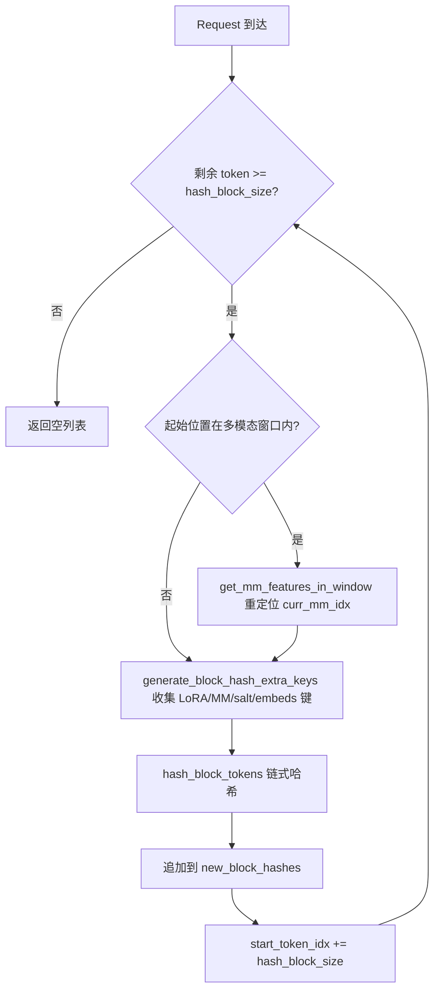
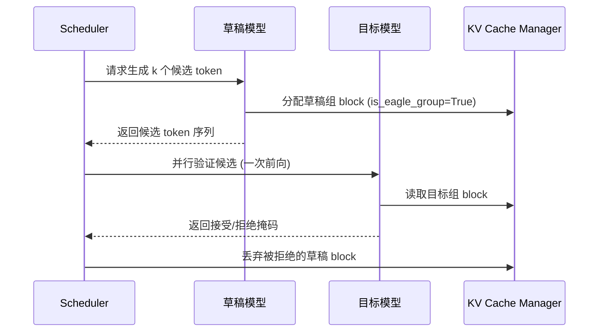

# Kapitel 12: Fortgeschrittene Inferenzfunktionen: Prefix-Caching, spekulative Dekodierung und LoRA

Im vorherigen Kapitel haben wir uns eingehend mit dem Quantisierungssystem und der Infrastruktur für benutzerdefinierte Operatoren von vLLM befasst und gesehen, wie Quantisierungskonfigurationen aufgelöst und entsprechende Kernel ausgewählt werden und wie FP8, INT4, AWQ, GPTQ und andere Ansätze die Konvertierung beim Gewichts-Laden durchführen. Gleichzeitig haben wir untersucht, wie _custom_ops CUDA-Operatoren registriert, den Scheduling-Mechanismus von Triton-Kernels und wie MoE-Fusion-Kernels den Speicher-Roundtrip reduzieren. Diese zugrunde liegenden Fähigkeiten ebnen den Weg für fortgeschrittenere Inferenzoptimierungen. Dieses Kapitel konzentriert sich auf drei fortgeschrittene Inferenzfunktionen von vLLM: automatisches Prefix-Caching (APC), spekulative Dekodierung und LoRA. Sie scheinen unabhängig zu sein, teilen aber tatsächlich dieselbe zugrunde liegende Infrastruktur – das Hashing von KV-Blöcken, die Slot-Zuweisung des Schedulers und die dynamische Gewichtsinjektion bei der Modellausführung. Der Schlüssel zum Verständnis liegt darin, zu verstehen, wie sie die „Wiederverwendung" maximieren, ohne die PagedAttention-Paging-Semantik zu verletzen.

# 12.1 Prefix-Caching: Wie der Block-Hash ein Präfix fingerprintet

## Intuitives Modell

Prefix-Caching ist wie das „gemeinsame Abschreibheft für öffentliche Absätze" in einer Bibliothek: Zwei Schüler schreiben Aufsätze und zitieren am Anfang denselben klassischen Text. Der Lehrer muss diesen klassischen Text nur einmal korrigieren und kann dann die jeweils unterschiedlichen Teile separat betrachten. Ohne dieses Verfahren müsste jede Anfrage den gesamten Prompt von Anfang an prefillen, und in Szenarien mit langen Dokumenten-Frage-Antworten würde die Rechenleistung mehrfach wiederholt verbraucht.

## Datenstruktur: Die Abbildung von Token zu Block-Hash

Der Kern des Prefix-Cachings ist die Frage: „Wie stellt man fest, dass die Präfixe zweier Anfragen identisch sind?" Die Antwort von vLLM lautet: Die Token-Sequenz wird in Blöcke aufgeteilt und für jeden Block ein verketteter Hash berechnet. Verkettet bedeutet, dass der Hash des N-ten Blocks die Hashes der vorherigen N-1 Blöcke enthält, sodass ein Block-Hash eindeutig das gesamte Präfix „vom Anfang der Sequenz bis zum Ende dieses Blocks" fingerprintet.

Der Träger des Hashs ist`BlockHash`, der als`bytes`von`NewType`definiert ist, nicht als nackter`bytes`, um auf Typebene die Fehlverwendung von[FACT:vllm/v1/core/kv_cache_utils.py:59-62]zu verhindern. Wenn der Block-Hash mit der KV-Cache-Gruppen-ID zu einem Dictionary-Schlüssel kombiniert werden muss, verwendet vLLM kein Tupel, sondern hängt die 4-Byte-Big-Endian-Gruppen-ID direkt an das Ende der Hash-Bytes an[FACT:vllm/v1/core/kv_cache_utils.py:75-76]：

```python
def make_block_hash_with_group_id(block_hash, group_id):
    return BlockHashWithGroupId(block_hash + group_id.to_bytes(4, "big", signed=False))
```

> **[Design Inference & Architectural Trade-offs]**
> Dies ist eine typische „Vermeidung von Tupel-Allokation"-Optimierung: Im Hot Path muss bei jeder Block-Suche ein Schlüssel konstruiert werden. Tupel bringen zusätzlichen Python-Objekt-Allokations- und Hash-Overhead, während die Byte-String-Verkettung auf C-Ebene erfolgt und der Byte-String selbst hashbar ist. Beim Abrufen wird durch Slicing`key[:-4]`und`int.from_bytes(key[-4:])`wiederhergestellt[FACT:vllm/v1/core/kv_cache_utils.py:87-89]。

Die Hash-Funktion selbst wird von`hash_block_tokens`übernommen, die den Eltern-Block-Hash, das Token-ID-Tupel des aktuellen Blocks und zusätzliche Schlüssel zusammen an die Hash-Funktion übergibt[FACT:vllm/v1/core/kv_cache_utils.py:650-680]. Beachten Sie, dass der Eltern-Hash des ersten Blocks nicht`None`ist, sondern der globale`NONE_HASH`：

```python
if not parent_block_hash:
    parent_block_hash = NONE_HASH
```

[FACT:vllm/v1/core/kv_cache_utils.py:674-675]。`NONE_HASH`Die Seed-Auswahl von`"vllm-none-hash"`verbirgt ein Sicherheitsdesign: Für kryptografische Hashes wie SHA-256 ist der Seed fest[FACT:vllm/v1/core/kv_cache_utils.py:105-126]。`resolve_none_hash_seed`, sodass verschiedene vLLM-Prozesse für denselben Inhalt denselben Hash berechnen und somit Prefix-Caching knotenübergreifend geteilt werden kann; für nicht-kryptografische Hashes wie xxhash ist der Seed pro Prozess zufällig, da ein vorhersagbarer Seed es Angreifern ermöglichen würde, kollidierende Blöcke offline vorzuberechnen`PYTHONHASHSEED`implementiert diese Verzweigung:`os.urandom(32)` [FACT:vllm/v1/core/kv_cache_utils.py:132-145]。

## Umgebungsvariablen haben Vorrang, andernfalls verwenden kryptografische Hashes einen festen Seed und nicht-kryptografische Hashes

Angenommen, eine Anfrage kommt mit 128 Token herein, und die Blockgröße beträgt 16.`get_request_block_hasher`Die zurückgegebene Closure ist für die inkrementelle Berechnung zuständig.[FACT:vllm/v1/core/kv_cache_utils.py:802-861]：

Erster Schritt: Bestimmen, wo mit der Berechnung begonnen werden soll.`start_token_idx = len(request.block_hashes) * hash_block_size` [FACT:vllm/v1/core/kv_cache_utils.py:812-812], d. h. die Anzahl der bereits berechneten Blöcke multipliziert mit der Blockgröße. Wenn die verbleibenden Token weniger als einen Block füllen, wird direkt leer zurückgegeben.[FACT:vllm/v1/core/kv_cache_utils.py:812-812]。

Zweiter Schritt: Behandlung des multimodalen Offsets. Wenn die Startposition innerhalb einer multimodalen Eingabe liegt, muss`get_mm_features_in_window`neu positioniert werden`curr_mm_idx` [FACT:vllm/v1/core/kv_cache_utils.py:823-832]. Der Grund dafür ist, dass die Placeholder-Token der multimodalen Eingabe selbst keine Semantik tragen; daher müssen der mm-Feature-Identifikator und sein Offset innerhalb des Blocks als zusätzliche Schlüssel in den Hash eingemischt werden.

Dritter Schritt: Schleifenberechnung für jeden Block.`generate_block_hash_extra_keys`Alle zusätzlichen Schlüssel sammeln[FACT:vllm/v1/core/kv_cache_utils.py:611-647], einschließlich LoRA-Name, multimodaler Schlüssel, Cache-Salt, Prompt-Embeds-Hash. Dabei wirkt der Cache-Salt nur im ersten Block[FACT:vllm/v1/core/kv_cache_utils.py:633-635], was beabsichtigt ist: Der Salt dient dazu, den gesamten Cache-Namensraum zu isolieren, und muss nur einmal am Anfang der Kette injiziert werden.

Vierter Schritt:`hash_block_tokens`Den Eltern-Hash, das Token-Tupel und die zusätzlichen Schlüssel zusammen hashen; das Ergebnis dient als Eltern-Hash des nächsten Blocks[FACT:vllm/v1/core/kv_cache_utils.py:851-857]. Dadurch entsteht die Kettenstruktur.

## Granularitätsumwandlung bei mehreren Blockgrößen

Wenn das Modell mehrere KV-Cache-Gruppen mit unterschiedlichen Blockgrößen hat, kann die Hash-Granularität von der Block-Granularität der Gruppe abweichen.`BlockHashListWithBlockSize`Dieses Problem wird gelöst, indem der Hash nicht neu berechnet wird, sondern die Eigenschaft des Ketten-Hashings genutzt wird – der Hash eines Target-Blocks ist der Hash des letzten Hash-Blocks innerhalb desselben[FACT:vllm/v1/core/kv_cache_utils.py:2781-2851]. Wenn beispielsweise der Hash-Block 16 und der Target-Block 32 beträgt, ist der Hash der Token 0–31 der zweite 16er-Hash (der bereits kettenartig 0–31 abdeckt).[FACT:vllm/v1/core/kv_cache_utils.py:2794-2806]。`_get_value_at`Die Implementierung ist`self.block_hashes[(idx + 1) * self.scale_factor - 1]` [FACT:vllm/v1/core/kv_cache_utils.py:2848-2851]。



## Designüberlegungen und Stolperfallen

**Warum Ketten-Hashing statt unabhängigem Hashing?**Unabhängiges Hashing kann nicht unterscheiden, ob „derselbe Block an unterschiedlichen Präfixpositionen auftritt“. Ketten-Hashing macht den Block-Hash zu einem eindeutigen Fingerabdruck des gesamten Präfixes – genau das ist die Voraussetzung dafür, dass`find_longest_cache_hit`KV sicher wiederverwenden kann.

**Die prozessübergreifende Falle nicht-kryptografischer Hashes.**Wenn xxhash verwendet wird und`PYTHONHASHSEED`nicht gesetzt ist, ist`NONE_HASH`pro Prozess unterschiedlich, wodurch der prozessübergreifende Präfix-Cache vollständig unwirksam wird.`init_none_hash`Es wird eine Warnung ausgegeben[FACT:vllm/v1/core/kv_cache_utils.py:161-169]. Wenn in der Produktion mehrere Instanzen einen gemeinsamen Cache verwenden, muss`PYTHONHASHSEED`explizit gesetzt oder auf sha256 umgestellt werden.

**Die Feinheiten des multimodalen Offsets.** `_gen_mm_extra_hash_keys`Wird`(mm_identifier, offset - start_token_idx)`als zusätzlicher Schlüssel verwendet[FACT:vllm/v1/core/kv_cache_utils.py:552]. Der Offset ist relativ zum Blockanfang, sodass dasselbe mm-Element an unterschiedlichen Blockpositionen unterschiedliche Hashes erzeugt und Fehltreffer vermieden werden.

# 12.2 Spekulative Dekodierung: Zusammenspiel von Entwurf und Verifikation

## Intuitives Modell

Spekulative Dekodierung ist wie eine Sekretärin, die dem Chef zunächst mehrere Antwortentwürfe vorbereitet, und der Chef nur schnell markieren muss, welche Version brauchbar ist. Das Entwurfsmodell (Drafter) sagt mit extrem geringen Kosten mehrere Kandidaten-Token voraus, und das Zielmodell (Target) verifiziert diese Kandidaten in einem einzigen Vorwärtsdurchlauf parallel und akzeptiert die übereinstimmenden Teile. Ohne dies könnte das Zielmodell nur Token für Token seriell generieren, und die GPU-Auslastung wäre in der Decode-Phase extrem niedrig.

## Datenstruktur: Annotation der EAGLE-Gruppe

Das Kernproblem der spekulativen Dekodierung im KV-Cache-Management ist: Wie werden die KV-Schichten des Entwurfsmodells und die KV-Schichten des Zielmodells gruppiert?`_annotate_eagle_groups`Zwei Regeln werden verwendet, um die Entwurfsgruppe zu identifizieren[FACT:vllm/v1/core/kv_cache_utils.py:2134-2189]：

Regel eins ist spec-getrieben:`non_causal_multi_token_decode`Das Flag wird auf`MLAAttentionSpec`deklariert, von der Draft-Attention-Schicht gesetzt, die nicht-kausales Multi-Token-Decode ausführt, und kann`merge`Operationen überleben[FACT:vllm/v1/core/kv_cache_utils.py:2175-2177]。

Regel zwei ist Positionsrückfall: MTP-Drafter (wie DeepseekV4/V4.1 DSpark) verwenden die Decoder-Schichten des Zielmodells selbst wieder; in der Spec gibt es keine Markierung, aber ihre Draft-Attention-Schichten werden immer nach allen Zielschichten registriert, daher wird die Gruppe annotiert, die die zuletzt registrierte Schicht enthält[FACT:vllm/v1/core/kv_cache_utils.py:2183-2184]. Diese Regel greift nur, wenn die Gruppe genau`kv_cache_spec`alle Schichten abdeckt[FACT:vllm/v1/core/kv_cache_utils.py:2183-2184]。

## Szenariogetrieben: KV-Zuweisung bei spekulativer Dekodierung

Wenn`speculative_config`aktiviert ist und`use_eagle_block_drop()`wahr ist,`_annotate_eagle_groups`aufgerufen[FACT:vllm/v1/core/kv_cache_utils.py:2175-2177]. Das Annotationsergebnis`is_eagle_group`beeinflusst die nachfolgende Blockzuweisungsstrategie – die Blöcke der Entwurfsgruppe können nach der Verifikation verworfen werden.

Im Hauptpfad von`get_kv_cache_groups`erfolgt die Annotation nach der Gruppierung[FACT:vllm/v1/core/kv_cache_utils.py:2364-2365]. Wenn keine Gruppe als Entwurfsgruppe annotiert wurde,`_warn_if_unannotated_eagle_mamba`wird eine Warnung ausgegeben[FACT:vllm/v1/core/kv_cache_utils.py:2192-2222]。



## Designüberlegungen und Stolperfallen

**Warum muss die Entwurfsgruppe separat annotiert werden?**Die vom Entwurfsmodell erzeugten Token können nach der Verifikation abgelehnt werden, und die entsprechenden KV müssen verworfen werden. Wenn Entwurfs-KV und Ziel-KV in derselben Gruppe vermischt werden, würde die Verwerfungsoperation fälschlicherweise Ziel-KV treffen. Die Annotation ermöglicht es dem Scheduler, präzise zurückzugewinnen.

**Die Fragilität der Positionsrückfall-Regel.**Regel zwei hängt von der Konvention ab, dass „die Entwurfsschicht zuletzt registriert wird“; im Kommentar ist ausdrücklich vermerkt, dass dies ein hacky check ist, und es wurde ein FIXME hinterlassen[FACT:vllm/v1/core/kv_cache_utils.py:2158-2159]. Wenn der Tail-Cache des Entwurfs mehrere Gruppen umspannt, annotiert diese Regel nur die Gruppe, die die letzte Schicht enthält, und muss verallgemeinert werden.

**Zusätzliche Einschränkungen bei Mamba-Modellen.**Wenn spekulatives Decoding aktiviert ist, aber keine Gruppe als Draft-Gruppe erkannt wird und eine Mamba-Gruppe existiert, wird eine Warnung ausgelöst[FACT:vllm/v1/core/kv_cache_utils.py:2211-2213]. Dies bedeutet normalerweise, dass die spec der Draft-Schicht nicht von der Zielschicht unterschieden werden kann, und die Modellregistrierungsreihenfolge überprüft werden muss.

# 12.3 LoRA: Dynamische Adapter ohne Neuladen des Basismodells

## Intuitives Modell

LoRA ist wie das Wechseln verschiedener Handyhüllen für dasselbe Telefon: Das Telefon selbst (Basismodell) bleibt unverändert, aber mit einer anderen Hülle (Adapter) ändert sich der Stil. Ohne dies müsste für jede Feinabstimmungsaufgabe eine vollständige Gewichtung geladen werden, was den VRAM-Speicher überlasten würde.

## Datenstruktur: Doppelter LRU-Cache und Slot-Array

`LoRAModelManager`Zwei LRU-Caches verwalten den Lebenszyklus der Adapter[FACT:vllm/lora/model_manager.py:115-120]：

```python
self._registered_adapters: AdapterLRUCache[LoRAModel] = AdapterLRUCache(
    self.capacity, self.deactivate_adapter
)
self._active_adapters: AdapterLRUCache[None] = AdapterLRUCache(
    self.lora_slots, self._deactivate_adapter
)
```

`capacity`ist die Gesamtzahl der Adapter, die auf der CPU-Seite zwischengespeichert werden können (`max_cpu_loras`）[FACT:vllm/lora/model_manager.py:340-342]，`lora_slots`ist die Anzahl der Adapter, die gleichzeitig auf der GPU-Seite aktiviert werden können (`max_loras`）[FACT:vllm/lora/model_manager.py:345-346]。`_registered_adapters`wird beim Entfernen ausgelöst`deactivate_adapter`Callback[FACT:vllm/lora/model_manager.py:71-74], um sicherzustellen, dass beim Entfernen aus dem CPU-Cache auch die Kopien auf der GPU bereinigt werden.

`lora_index_to_id`ist ein Array der Länge`lora_slots`, das GPU-Slot-Indizes auf Adapter-IDs abbildet[FACT:vllm/lora/model_manager.py:122]. Dieses Array ist der zentrale Index für den punica wrapper bei der Berechnung von Batch-LoRA.

## Szenario-getrieben: Adapter-Aktivierung

Wenn eine Anfrage mit einem LoRA-Adapter eingeht,`activate_adapter`wird aufgerufen[FACT:vllm/lora/model_manager.py:352-409]：

Erster Schritt: Überprüfen, ob bereits aktiviert, und falls ja, direkt zurückgeben[FACT:vllm/lora/model_manager.py:352-354]。

Zweiter Schritt: Nach einem freien Slot suchen. Durchlaufen von`lora_index_to_id`und Finden des ersten`None` [FACT:vllm/lora/model_manager.py:362-362]. Wenn kein freier Slot vorhanden ist, wird`ValueError("No free lora slots")` [FACT:vllm/lora/model_manager.py:368-368]。

ausgelöst Dritter Schritt: Status aktualisieren und alle umschlossenen Module durchlaufen, Aufrufen von`module.set_lora(index, lora_a, lora_b)`um die Gewichte in den GPU-stacked buffer zu kopieren[FACT:vllm/lora/model_manager.py:377-401]. Wenn ein Modul keine entsprechenden LoRA-Gewichte hat, wird`reset_lora(index)`aufgerufen, um sie auf null zu setzen[FACT:vllm/lora/model_manager.py:378-385]。

Vierter Schritt: Wenn keine Gewichte angewendet wurden, wird ein einmaliges Debug-Log ausgegeben[FACT:vllm/lora/model_manager.py:411-416]. Dies ist unter Pipeline-Parallelität oder Expert-Parallelität erwartetes Verhalten – einige Ranks besitzen die angepassten Schichten nicht.

## Modul-Wrapping: Von nn.Linear zu BaseLayerWithLoRA

`_create_lora_modules`Durchläuft alle benannten Module des Modells[FACT:vllm/lora/model_manager.py:462-606]. Zentrale Logik:

- Überspringen von`PPMissingLayer` [FACT:vllm/lora/model_manager.py:473-474]。
- Filtern basierend auf`target_modules`: Wenn nicht angegeben, wird`is_supported_lora_module`zur Beurteilung verwendet, andernfalls`_match_target_modules` [FACT:vllm/lora/model_manager.py:479-493]。
- Behandlung von Alias-Modulen: Dasselbe zugrunde liegende Modul kann über mehrere Pfade zugänglich sein (z. B. ist ein MoE-Gate sowohl im Block als auch im Runner). In diesem Fall werden Alias-Attribute auf denselben Wrapper umgeleitet, aber nicht erneut registriert, da sonst`activate_adapter`für den Alias`reset_lora`aufruft und die gerade gesetzten Gewichte löscht[FACT:vllm/lora/model_manager.py:512-527]。
- Verwenden von`from_layer`um einen Wrapper zu erstellen und das ursprüngliche Modul zu ersetzen[FACT:vllm/lora/model_manager.py:546-553]。

## Designüberlegungen und Fallstricke

**Änderungen im Slot-Layout lösen Aktualisierungen der Zuordnung aus.** `set_adapter_mapping`vergleicht nicht nur, ob sich das Mapping geändert hat, sondern auch`lora_index_to_id`den Tupel-Snapshot von[FACT:vllm/lora/model_manager.py:1323-1331]. Der Grund ist im Kommentar klar erklärt: Ein Out-of-Band-`add_lora()`kann LRU-Eviction auslösen und Slots neu zuweisen, während der laufende Batch und sein Mapping unverändert bleiben[FACT:vllm/lora/model_manager.py:1323-1331]. Wenn nur das Mapping betrachtet wird, verwendet die punica-Metadaten ein veraltetes Slot-Layout.

**EP-Slicing für MoE.**Wenn Expert-Parallelität aktiviert ist, hält der Checkpoint die Gewichte aller globalen Experten, aber jeder Rank besitzt nur`local_num_experts`.`_stack_moe_lora_weights`Zuerst nach`global_num_experts`reshape, dann Slicing`[expert_start:expert_end]` [FACT:vllm/lora/model_manager.py:966-977]. Ohne EP ist das Slicing ein No-Op.

**Zeitpunkt von pin_memory.**Gewichtspackung (z. B.`pack_moe`) kann die pin_memory-Zuweisung ungültig machen, daher wird pin_memory nach dem Zusammenführen aller Gewichte ausgeführt[FACT:vllm/lora/model_manager.py:916-934]. Der Kommentar nennt zwei Gründe: Bei MoE-Modellen ist die Anzahl der LoRA-Gewichte groß, und ein zu frühes Pinning verursacht erheblichen Overhead; das Packen kann die Zuweisung ungültig machen[FACT:vllm/lora/model_manager.py:916-921]。

# Designüberlegung: Die Synergie der drei

Die drei Merkmale treffen sich in der KV-Cache-Verwaltungsschicht. Prefix-Caching verwendet KV über Block-Hash wieder; spekulatives Decoding verwendet`is_eagle_group`zur Kennzeichnung und Unterscheidung von Draft-KV; LoRA mischt den Adapternamen über`_gen_lora_extra_hash_keys`in den Block-Hash ein[FACT:vllm/v1/core/kv_cache_utils.py:568-581], um sicherzustellen, dass identische Token-Sequenzen verschiedener Adapter nicht fälschlicherweise die KV des jeweils anderen treffen.

`generate_block_hash_extra_keys`platziert den LoRA-Schlüssel an erster Stelle der zusätzlichen Schlüsselliste[FACT:vllm/v1/core/kv_cache_utils.py:640-642], zusammen mit multimodalen Schlüsseln, Cache-Salt und Prompt-Embeds-Schlüsseln als vollständige Hash-Eingabe. Dies garantiert: Selbst wenn zwei Anfragen identische Token haben, unterscheiden sich ihre Block-Hashes, solange die LoRA-Adapter unterschiedlich sind, und die KV werden nicht vermischt.

# Kapitelzusammenfassung

# Kapitelüberlegungen und Selbsttest

Q1: Wenn in`init_none_hash`die Zufallsseed-Logik für nicht-kryptografisches Hashing entfernt und stattdessen immer ein fester Seed verwendet wird, in welchen Szenarien würde dies Sicherheitsrisiken einführen? Warum betont der Quellcode-Kommentar besonders, dass xxhash einen geheimen Seed benötigt?

**Referenzanalyse**: Der Quellcode listet in`_NON_CRYPTO_HASH_FUNCTIONS`xxhash und xxhash_cbor explizit als nicht kollisionsresistente Algorithmen auf[FACT:vllm/v1/core/kv_cache_utils.py:125-126]。`resolve_none_hash_seed`und gibt für solche Algorithmen`os.urandom(32).hex()` [FACT:vllm/v1/core/kv_cache_utils.py:143-144]zurück. Wenn ein fester Seed verwendet würde, könnte ein Angreifer offline Blöcke vorberechnen, die mit dem Ziel-Prefix kollidieren, und Anfragen mit identischem Hash aber unterschiedlichem Inhalt konstruieren, um so den KV-Cache anderer zu treffen und zu lesen – dies ist eine Informationslecks über Anfragen hinweg. Die Kollisionsresistenz von SHA-256 hängt nicht von der Geheimhaltung des Seeds ab, daher beeinflusst ein fester Seed nur die Reproduzierbarkeit, nicht die Sicherheit[FACT:vllm/v1/core/kv_cache_utils.py:97-111]。

Q2: `_create_lora_modules`Bei der Behandlung von Alias-Modulen, wenn die Logik „nicht erneut registrieren“ entfernt und direkt für den Alias`register_module`aufgerufen wird, in`activate_adapter`Was passiert? Bitte analysieren Sie dies im Zusammenhang mit`reset_lora`dem Aufrufpfad von

**Referenzanalyse**：`activate_adapter`durchläuft`self.modules`und ruft für jedes Modul`set_lora`oder`reset_lora` [FACT:vllm/lora/model_manager.py:377-401]auf. Wenn sowohl Alias als auch kanonischer Name registriert sind, wird derselbe zugrunde liegende Wrapper zweimal aufgerufen. Unter dem Pfad des kanonischen Namens kann`_get_lora_layer_weights`die Gewichte finden und`set_lora`aufrufen, um sie zu schreiben; unter dem Alias-Pfad gibt`_get_lora_layer_weights`aufgrund der Namensabweichung None zurück, was`reset_lora(index)` [FACT:vllm/lora/model_manager.py:378-385]auslöst und die gerade geschriebenen Gewichte auf null setzt. Der Quellcode-Kommentar weist ausdrücklich auf diese Falle hin[FACT:vllm/lora/model_manager.py:519-523]. Die korrekte Vorgehensweise besteht darin, das Alias-Attribut auf denselben Wrapper umzuleiten, ohne es erneut zu registrieren[FACT:vllm/lora/model_manager.py:531-537]。

Q3: `BlockHashListWithBlockSize`hängt von der Eigenschaft ab, dass „der Hash des Target-Blocks gleich dem Hash seines internen letzten Hash-Blocks ist“. Wenn die Hash-Funktion nicht verkettet ist (d. h. jeder Block unabhängig gehasht wird), kann diese Klasse dann noch korrekt funktionieren? In welchen Fällen kommt es zu fehlerhaften Cache-Treffern?

**Referenzanalyse**: Nein.`_get_value_at`gibt direkt`self.block_hashes[(idx + 1) * self.scale_factor - 1]` [FACT:vllm/v1/core/kv_cache_utils.py:2848-2851]zurück. Die Voraussetzung dieser Implementierung ist, dass der Hash des letzten Hash-Blocks bereits alle vorherigen Token verkettet abdeckt. Wenn die Hashes unabhängig sind, fingerprintet dieser Wert nur den Inhalt des letzten Hash-Blocks, nicht den gesamten Target-Block. Zwei Target-Blocks können sich im vorderen Teil unterscheiden, aber denselben letzten Hash-Block haben, was zu einer Hash-Kollision führt und`find_longest_cache_hit`fälschlicherweise nicht übereinstimmende KV wiederverwendet. Der Quellcode-Kommentar stellt ausdrücklich fest: „Each hash_block_size hash is already chained over its entire prefix“[FACT:vllm/v1/core/kv_cache_utils.py:2787-2792]。

Das nächste Kapitel wendet sich dem Plugin-System und der Erweiterbarkeit zu und zeigt, wie vLLM durch Plattformabstraktion, IO-Prozessoren und Endpunkt-Erweiterungen vielfältige Deployment-Formen unterstützt.

Dieses Kapitel analysiert die zugrunde liegenden Mechanismen der drei fortgeschrittenen Inferenzfunktionen von vLLM. Der Kern des Prefix-Caching ist der verkettete Block-Hash: hash_block_tokens hasht den Parent-Hash, das Token-Tupel und zusätzliche Schlüssel gemeinsam; die Seed-Strategie von NONE_HASH wägt zwischen prozessübergreifender gemeinsamer Nutzung und Kollisionssicherheit ab. Speculative Decoding unterscheidet Draft-KV-Gruppen durch is_eagle_group-Annotationen. LoRA verwaltet den Lebenszyklus von Adaptern durch einen doppelten LRU-Cache und ein Slot-Array und mischt den Adapternamen in den Block-Hash ein, um Cache-Isolation zu erreichen. Diese Funktionen zeigen gemeinsam die Tiefe und Flexibilität von vLLM bei der Inferenzoptimierung. Als Nächstes wenden wir uns dem Plugin-System und der Erweiterbarkeit von vLLM zu und schauen, wie Plattform-Plugins neue Hardware adaptieren, wie IO-Processor-Plugins in die multimodale Eingabeverarbeitung eingreifen und wie Endpoint-Plugins benutzerdefinierte API-Routen injizieren. Das Verständnis der Ladereihenfolge von Plugin-Registrierung und -Erkennung wird zeigen, wie die Fähigkeiten von vLLM erweitert werden können, ohne den Kerncode zu ändern.
