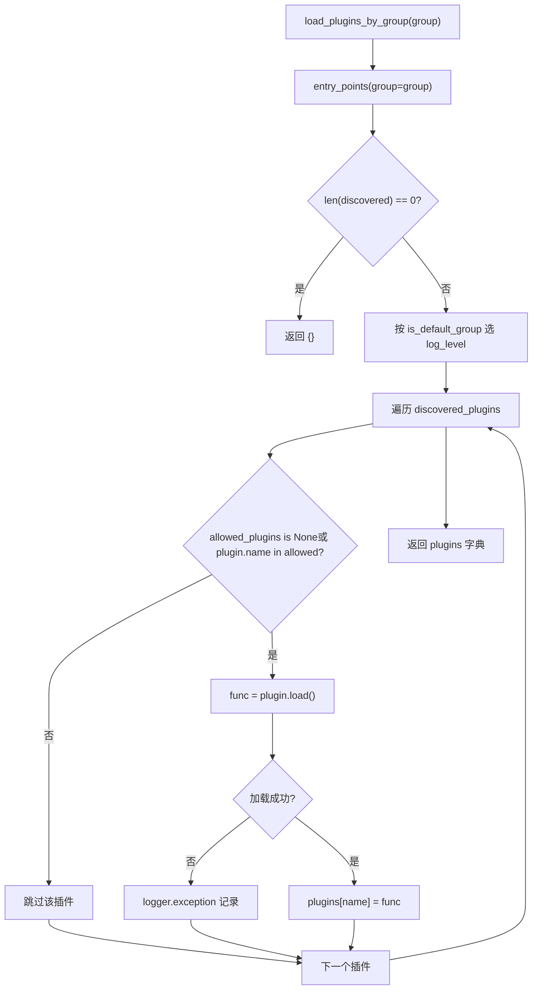
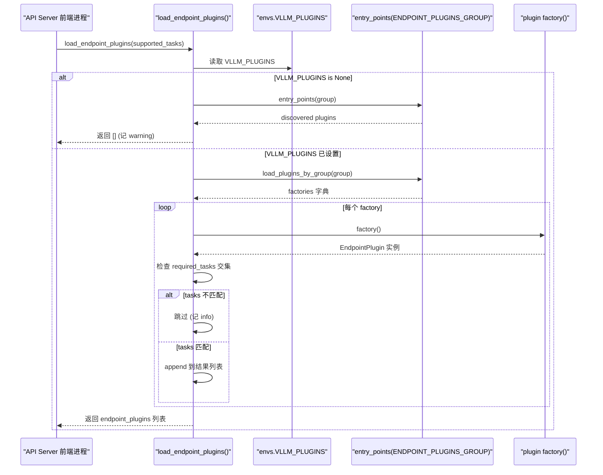

# Kapitel 13: Plugin-System und Erweiterbarkeit: Plattform-, IO-Prozessor- und Endpunkt-Erweiterungen

Im vorherigen Kapitel haben wir gesehen, dass fortgeschrittene Funktionen wie Prefix-Caching, Speculative Decoding und LoRA tief in den Kernpfaden von Scheduler, KV-Management und Modellausführung gekoppelt sind. Doch damit eine Inferenz-Engine wirklich produktionsreif wird, reicht Leistung allein nicht aus – sie muss eine schwierigere Frage beantworten: Wie kann die Community neue Hardware, ein neues multimodales Eingabeformat oder eine benutzerdefinierte HTTP-Route integrieren, ohne den Kerncode zu forken? Genau das ist der Sinn des Plugin-Systems. Die Architektur von vLLM ist von Natur aus multiprozessbasiert: der API-Server-Frontend-Prozess, der EngineCore-Prozess und die Worker-Prozesse für jeden TP/PP-Rang. Wenn der Plugin-Mechanismus einfach nur „beim Import ein Stück Code ausführen“ würde, dann würde er entweder in jedem Prozess wiederholt ausgeführt, was zu kumulativen Seiteneffekten führt, oder nur im Hauptprozess ausgeführt, sodass Worker die Erweiterung nicht erhalten. Dieses Kapitel entschlüsselt, wie vLLM den Python-Standardmechanismus entry_points zusammen mit den drei Einschränkungen Gruppierung (group) + Prozessgrenze + Ladezeitpunkt nutzt, um ein Plugin-System aufzubauen, das alle Prozesse abdeckt und gleichzeitig die Exposition präzise steuert. Wir konzentrieren uns auf drei Hauptlinien: Plattform-Plugins (Adaption neuer Hardware), IO-Processor-Plugins (Eingriff in die multimodale Eingabeverarbeitung) und Endpoint-Plugins (Injektion benutzerdefinierter API-Routen). Die Ladestrategien der drei unterscheiden sich grundlegend; wer diesen Unterschied versteht, versteht die Abwägungsphilosophie von vLLM zwischen „Erweiterbarkeit“ und „Sicherheitsgrenzen“.

# I. Plugin-Erkennung und -Laden: der Gruppierungsvertrag von entry_points

## Intuitives Modell: die „Broadcast-Kanäle“ von Plugins

Stellen Sie sich das Plugin-System von vLLM als eine Gruppe von Broadcast-Kanälen vor. Jedes Plugin-Paket „registriert“ bei der Installation über`setup.py`die`entry_points`von

Ohne dieses Mechanismus könnte vLLM nur durch Änderungen am Quellcode erweitert werden – für jede neue Hardware müsste die Community einen Fork pflegen, was letztlich zu einer Versionsspaltung führt. Der Wert des Gruppierungsmechanismus liegt darin:**Dasselbe Plugin-Paket kann nur bei einem bestimmten Kanal registriert werden und ist somit auf das Laden in einem bestimmten Prozess beschränkt**。

## Datenstruktur: Fünf Gruppenkonstanten und ein globales Flag

vLLM definiert am`vllm/plugins/__init__.py`Anfang fünf Entry-Point-Group-Konstanten, wobei jede Konstante einer Ladestrategie entspricht:

[FACT:vllm/plugins/__init__.py:16-30]

```python
DEFAULT_PLUGINS_GROUP = "vllm.general_plugins"
IO_PROCESSOR_PLUGINS_GROUP = "vllm.io_processor_plugins"
PLATFORM_PLUGINS_GROUP = "vllm.platform_plugins"
STAT_LOGGER_PLUGINS_GROUP = "vllm.stat_logger_plugins"
ENDPOINT_PLUGINS_GROUP = "vllm.endpoint_plugins"
```

In den Kommentaren stecken entscheidende Informationen:`DEFAULT_PLUGINS_GROUP`In**allen Prozessen**geladen (process0, Engine Core, Worker);`IO_PROCESSOR_PLUGINS_GROUP` **nur in process0**；`PLATFORM_PLUGINS_GROUP`in allen Prozessen geladen, aber der Auslösezeitpunkt ist`current_platform`beim ersten Zugriff;`STAT_LOGGER_PLUGINS_GROUP`nur in process0 und im asynchronen Modus;`ENDPOINT_PLUGINS_GROUP`nur im API-Server-Frontend-Prozess.

Direkt danach folgt eine globale Variable auf Modulebene`plugins_loaded = False` [FACT:vllm/plugins/__init__.py:32-33], die als Wächter für idempotentes Laden dient – der Kommentar besagt ausdrücklich „make sure one process only loads plugins once“.

## Schritt für Schritt: Ein vollständiger Aufrufablauf von`load_plugins_by_group`

Szenario: Der Benutzer hat in`setup.py`unter`vllm.general_plugins`die`register_dummy_model`registriert; nun startet vLLM und ein Prozess ruft`load_general_plugins()`。

**Erster Schritt: Idempotenz-Wächter.** `load_general_plugins`Zuerst wird`plugins_loaded`geprüft; ist es bereits`True`, wird direkt[FACT:vllm/plugins/__init__.py:77-90]zurückgegeben. Beachten Sie eine Feinheit: Der Wächter wird gesetzt, bevor**geladen wird**, was bedeutet, dass selbst wenn das nachfolgende Laden eine Ausnahme wirft, kein erneuter Versuch unternommen wird. Das ist beabsichtigt – ein fehlgeschlagenes Plugin-Laden sollte nicht dazu führen, dass der Prozess es wiederholt versucht.

**Zweiter Schritt: Discovery.**Es wird`load_plugins_by_group`betreten und über`importlib.metadata.entry_points(group=group)`werden alle installierten Entry Points unter dieser Gruppe abgerufen[FACT:vllm/plugins/__init__.py:36-45]. Ist die Menge leer, wird eine Debug-Logzeile geschrieben und ein leeres Dictionary zurückgegeben.

**Dritter Schritt: Log-Level-Stufung.**Der Quellcode unterscheidet das Log-Level zwischen der Standardgruppe und Nicht-Standardgruppen:`is_default_group`Wenn wahr, wird`logger.debug`verwendet, andernfalls`logger.info` [FACT:vllm/plugins/__init__.py:47-54]. Die Motivation ist sehr praktisch –`vllm.general_plugins`unter

**hängen normalerweise viele Modellregistrierungs-Plugins, und INFO würde das Log fluten; Plattform-/Endpoint-Plugins sind dagegen wenige und wichtig und verdienen INFO-Sichtbarkeit.**Vierter Schritt: Whitelist-Filterung.`envs.VLLM_PLUGINS`Es wird`None`gelesen; ist es[FACT:vllm/plugins/__init__.py:62-70], werden alle geladen, andernfalls nur die Plugins, deren Namen in der Liste stehen`plugin.load()`. Beachten Sie, dass[FACT:vllm/plugins/__init__.py:68-72]。

**in try/except eingebettet ist; ein einzelner Plugin-Ladefehler wird nur als Exception geloggt und beeinträchtigt die anderen Plugins nicht**Fünfter Schritt: Ausführung.`load_general_plugins`Zurück in`func()` [FACT:vllm/plugins/__init__.py:77-90]wird für jede geladene Funktion direkt**aufgerufen. Deshalb betont die Dokumentation, dass Plugin-Funktionen**re-entrant sein müssen

– sie können in mehreren Prozessen mehrfach aufgerufen werden.`load_plugins_by_group`Das folgende Flussdiagramm beschreibt den vollständigen Entscheidungspfad von



## Designüberlegung: Warum entry_points statt Konfigurationsdateien

> **[Design Inference & Architectural Trade-offs]**
> Die Wahl von`entry_points`statt einer benutzerdefinierten Konfigurationsdatei hat als Kernmotivation,**Plugins zusammen mit dem Python-Paket auszuliefern**. Nachdem der Benutzer`pip install vllm-add-dummy-platform`ausgeführt hat, erscheinen die Plugins automatisch in der entsprechenden Gruppe, ohne dass die vLLM-Konfiguration manuell bearbeitet werden muss. Dies steht in einer Linie mit dem Plugin-Ökosystem von Tools wie pytest und flake8. Der Preis ist, dass die Plugin-Erkennung von den Metadaten des Pakets abhängt; wenn das Plugin-Paket unvollständig installiert ist (z. B. nur das Quellverzeichnis kopiert wurde, ohne pip zu verwenden), kann entry_points es nicht finden.

---

# Zwei, Plattform-Plugins: Die Abstraktionsschicht für Hardware-Anpassung

## Intuitives Modell: Die Plattform ist der „Übersetzer für Hardware-Dialekte“

`Platform`Die Klasse**ist der**einzige Übersetzer`current_platform.get_attn_backend_cls()`、`current_platform.is_cuda_alike()`für die gesamte Kommunikation zwischen vLLM und der Hardware. Modellcode ruft nur abstrakte Methoden wie`import torch.cuda`auf und niemals direkt`if device == "xpu"`. Ohne diese Abstraktionsschicht müsste für jede neue Hardware in den Modellcode ein

## -Zweig eingefügt werden, was schließlich zu Spaghetti-Code führt.

`Platform`Datenstruktur: Feldlayout der Platform-Basisklasse`vllm/platforms/interface.py`ist eine reine Klasse (nicht zur Instanziierung gedacht); die wichtigsten Klassenattribute sind am Anfang von[FACT:vllm/platforms/interface.py:135-179]：

```python
class Platform:
    _enum: PlatformEnum
    device_name: str
    device_type: str
    dispatch_key: str = "CPU"
    ray_device_key: str = ""
    device_control_env_var: str = "VLLM_DEVICE_CONTROL_ENV_VAR_PLACEHOLDER"
    ray_noset_device_env_vars: list[str] = []
    simple_compile_backend: str = "inductor"
    dist_backend: str = ""
    supported_quantization: list[str] = []
    additional_env_vars: list[str] = []
    _global_graph_pool: Any | None = None
```

`_enum`Kopieren`PlatformEnum`ist ein`is_cuda()`、`is_rocm()`-Enum-Wert und entscheidet über Prüfungen wie[FACT:vllm/platforms/interface.py:69-78]。`device_control_env_var``CUDA_VISIBLE_DEVICES`ist die plattformunabhängige Abstraktion der „Device-Visibility-Umgebungsvariablen“ – CUDA ist[FACT:vllm/platforms/interface.py:151-152]。`_global_graph_pool`, andere Plattformen definieren jeweils`get_global_graph_pool`[FACT:vllm/platforms/interface.py:1210-1215]。

ist ein CUDA-Graph-Speicherpool-Cache auf Klassenebene, der über`__getattr__`lazy initialisiert wird[FACT:vllm/platforms/interface.py:1189-1208]Bemerkenswert ist die Fallback-Logik von`torch.<device_type>`: Beim Zugriff auf ein Attribut, das auf Platform nicht existiert, wird versucht, aus dem`current_platform.memory_allocated()`-Namespace weiterzuleiten. Dadurch kann Plattformcode`torch.cuda.memory_allocated()`schreiben und tatsächlich`__getstate__`aufrufen. Der Quellcode schließt jedoch bewusst Dunder-Methoden aus – andernfalls würde die pickle-Prüfung`None`erhalten und versuchen, es aufzurufen[FACT:vllm/platforms/interface.py:1182-1185]。

## Schritt für Schritt: Drei-Namespace-Konvertierung der Device-ID

Der stolperanfälligste Punkt in der Plattformabstraktion ist der**Device-ID-Namespace**. Die Quellcode-Kommentare listen ausdrücklich drei[FACT:vllm/platforms/interface.py:275-283]：

- **logical**auf: den vLLM-internen local rank, Index`_assigned_physical_gpu_ids`
- **visible**: die torch/CUDA-Nummer des aktuellen Prozesses nach`CUDA_VISIBLE_DEVICES`-Remapping
- **physical**: die globale GPU-ID, die von Topologie-APIs wie NVML verwendet wird und nicht von Umgebungsvariablen beeinflusst wird

Szenario: Ein Worker-Prozess erhält die physische GPU`[4, 5]`, die Umgebungsvariable`CUDA_VISIBLE_DEVICES=4,5`, und nun muss local rank 0 in`torch.device("cuda:0")`。

**umgewandelt werden** `device_id_to_physical_device_id(0)`Erster Schritt: logical → physical.`_assigned_physical_gpu_ids`Zuerst wird`4` [FACT:vllm/platforms/interface.py:296-297]geprüft; ist es gesetzt, wird direkt per Index`device_control_env_var`zurückgegeben. Ist es nicht gesetzt, wird aus[FACT:vllm/platforms/interface.py:305-311]die durch Kommas getrennte Liste aufgeteilt und das 0-te Element genommen**. Beachten Sie, dass der Quellcode bewusst**die leere Zeichenkette[FACT:vllm/platforms/interface.py:296-297]。

**Zweiter Schritt: physical → visible.** `logical_device_id_to_visible_device_id(0)`Nachdem physical`4`abgerufen wurde, werden die Umgebungsvariablen aufgeteilt in`[4, 5]`, um den Index von`4`zu finden`0`und[FACT:vllm/platforms/interface.py:316-339]zurückzugeben. Wenn die physical ID nicht in der sichtbaren Liste steht, wird`RuntimeError`geworfen – dies ist ein harter Schutz, um prozessübergreifende Fehlnutzung unsichtbarer Geräte zu verhindern.

`set_assigned_physical_gpu_ids`Auch das idempotente Design von`RuntimeError` [FACT:vllm/platforms/interface.py:38-56]ist beachtenswert: Wiederholtes Setzen desselben Werts ist eine No-Op, das Setzen eines anderen Werts wirft

## . Dies verhindert, dass die Gerätezuordnung in Multithread-Umgebungen versehentlich überschrieben wird.

Registrierung und Konfigurationsinjektion von Plattform-Plugins`vllm.platform_plugins`Plattform-Plugins werden über die`None`-Gruppe registriert, die Plugin-Funktion gibt den vollqualifizierten Namen der Plattformklasse zurück (oder[FACT:docs/design/plugin_system.md:50-50], um anzuzeigen, dass die aktuelle Umgebung nicht unterstützt wird)[FACT:docs/design/plugin_system.md:100-100]：

- `_enum`. Die in der Dokumentation angegebene Minimalimplementierung erfordert`PlatformEnum.OOT`（out-of-tree）
- `device_type`wird üblicherweise auf
- `check_and_update_config`gesetzt und gibt den von PyTorch erkannten Gerätetyp-String zurück**wird früh in der vLLM-Initialisierung aufgerufen,`worker_cls`**
- `get_attn_backend_cls`muss hier gesetzt werden
- `get_device_communicator_cls`gibt den Klassennamen des Attention-Backends zurück

`check_and_update_config`gibt den Klassennamen des Communicators zurück[FACT:vllm/platforms/interface.py:583-592]ist der wichtigste Hook des Plattform-Plugins`VllmConfig`. Er empfängt die[FACT:docs/design/plugin_system.md:105-105]-Referenz und modifiziert sie in-place, kann block size, graph mode usw. anpassen. Die Dokumentation betont: „Am wichtigsten ist, dass worker_cls hier gesetzt werden muss“

## – denn vLLM muss wissen, welche Worker-Klasse zur Instanziierung des Arbeitsprozesses verwendet werden soll.

Designüberlegung: Dreiphasige Strategie zur Block-Size-Ausrichtung`update_block_size_for_backend` [FACT:vllm/platforms/interface.py:666-708]Die komplexeste Logik in der Plattform-Schnittstelle ist

**Phase 1**. Sie stellt in drei Phasen sicher, dass die Block Size mit dem Attention-Backend kompatibel ist:`--block-size`: Wenn der Benutzer nicht explizit`_preferred_block_size_for_backends`angegeben hat, wird[FACT:vllm/platforms/interface.py:687-697]aufgerufen, um die kleinste Block Size auszuwählen, die von allen Backends unterstützt wird[FACT:vllm/platforms/interface.py:622-663]。

**Phase 2**. Diese Funktion verwendet LCM (kleinstes gemeinsames Vielfaches), um Kandidatenwerte zu enumerieren, da einige Backends (wie CPU_MLA) nur exakte Größen und keine Vielfachen akzeptieren[FACT:vllm/platforms/interface.py:699-702]。

**Phase 3**: Hybride Modelle (Attention + Mamba) müssen Block und Mamba Page Size ausrichten[FACT:vllm/platforms/interface.py:704-708]。

> **[Design Inference & Architectural Trade-offs]**
> 〔Design-Inferenz und Architektur-Abwägungen〕

---

# Dieses phasenweise Design spiegelt die Realität wider, mit der vLLM konfrontiert ist: Unterschiedliche Hardware, unterschiedliche Quantisierungsschemata und unterschiedliche Modellarchitekturen stellen widersprüchliche Anforderungen an die Block Size, die nicht mit einer einzigen Formel gelöst werden können. Die Phasenaufteilung ermöglicht die unabhängige Behandlung jeder Einschränkung und wählt schließlich die Lösung, die alle Einschränkungen erfüllt.

## Drei, IO Processor und Endpoint-Plugins: Eingabeverarbeitung und API-Erweiterung

Intuitives Modell: IO Processor ist eine „multimodale Übersetzungsschicht“

## Die Eingabe multimodaler Modelle (wie LLaVA) ist nicht reiner Text, sondern eine Mischung aus Text + Bildern. Das IO-Processor-Plugin ist dafür verantwortlich, die rohen multimodalen Daten in Tensoren umzuwandeln, die das Modell verarbeiten kann, und die Modellausgabe wieder in ein menschenlesbares Format zu bringen. Es ist wie ein Übersetzer beim Zoll: Die eingehende Fremdsprache (Bilder/Audio) wird in die Muttersprache des Modells übersetzt, die ausgehende Muttersprache des Modells zurück in die Fremdsprache.

Step-by-Step: Entdeckung und Instanziierung des IO Processors`io_processor_plugin`Szenario: Laden eines Modells mit einer HF-Config, die ein

**-Feld enthält.** `get_io_processor`Erster Schritt: Plugin-Namen bestimmen.`plugin_from_init`Bevorzugt wird das explizit übergebene`hf_config`verwendet, andernfalls wird aus`io_processor_plugin`das[FACT:vllm/plugins/io_processors/__init__.py:42-50]-Feld gelesen`None`. Wenn beide leer sind, wird[FACT:vllm/plugins/io_processors/__init__.py:52-54]。

**zurückgegeben – dies bedeutet, dass das Modell keinen IO Processor benötigt**Zweiter Schritt: Alle installierten Plugins laden.`load_plugins_by_group(IO_PROCESSOR_PLUGINS_GROUP)`Aufruf von[FACT:vllm/plugins/io_processors/__init__.py:59-61]。

**, um alle Plugins unter dieser Gruppe zu erhalten**Dritter Schritt: Ladbare Zuordnung erstellen.`processor_cls_qualname`Jedes Plugin wird durchlaufen, seine Funktion aufgerufen, um`None`zu erhalten; wenn nicht`loadable_plugins` [FACT:vllm/plugins/io_processors/__init__.py:66-76], wird es in

**eingetragen. Beachten Sie, dass der Funktionsaufruf jedes Plugins ebenfalls in try/except eingebettet ist, ein einzelner Fehler beeinflusst die anderen nicht.**Vierter Schritt: Validierung und Instanziierung.`ValueError`Wenn die Anzahl ladbarer Plugins 0 ist, wird[FACT:vllm/plugins/io_processors/__init__.py:66-76]geworfen mit dem Hinweis „IOProcessor-Plugin erforderlich, aber keines installiert“`ValueError`. Wenn der vom Modell geforderte Plugin-Name nicht in der ladbaren Liste steht, wird[FACT:vllm/plugins/io_processors/__init__.py:80-81]geworfen und alle verfügbaren Plugin-Namen aufgelistet`resolve_obj_by_qualname`. Schließlich wird über[FACT:vllm/plugins/io_processors/__init__.py:80-81]。

## der Klassenname aufgelöst und instanziiert

Endpoint-Plugins: Standardmäßig ablehnende Sicherheitshaltung**Endpoint-Plugins sind die speziellste Kategorie in diesem Kapitel, denn sie werden**。`load_endpoint_plugins`standardmäßig nicht geladen`load_plugins_by_group`. Der Docstring von[FACT:vllm/plugins/__init__.py:93-94]。

erklärt den Grund explizit: Endpoint-Plugins fügen dem API Server HTTP-Routen hinzu, vergrößern die Netzwerkangriffsfläche und nehmen daher eine strengere „standardmäßig ablehnende“ Haltung ein als**Die konkrete Regel lautet: Nur wenn der Plugin-Name`VLLM_PLUGINS`explizit in**erscheint`required_tasks`und sein`None`entweder[FACT:vllm/plugins/__init__.py:108-108]。

ist oder eine Schnittmenge mit den vom Server unterstützten Tasks hat, wird es geladen`VLLM_PLUGINS`。

**Szenario: Der Benutzer hat ein Endpoint-Plugin installiert, aber vergessen,**zu setzen`envs.VLLM_PLUGINS is None`Erster Schritt: Prüfen, ob VLLM_PLUGINS nicht gesetzt ist.[FACT:vllm/plugins/__init__.py:126-126]Wenn`VLLM_PLUGINS=""`, werden zunächst die Plugins dieser Gruppe entdeckt; falls vorhanden, wird eine Warnung ausgegeben mit dem Hinweis „muss explizit allowlistet werden“`[""]`. Beachten Sie, dass der Quellcode-Kommentar besonders darauf hinweist:`None`wird als[FACT:vllm/plugins/__init__.py:108-108]und nicht als`None`geparst, daher gilt es als „Allowlist, die auf kein Plugin passt“ und nicht als „nicht gesetzt“

**. Diese Grenzunterscheidung ist wichtig – ein leerer String bedeutet explizit „nichts laden“, während**„nicht konfiguriert“ bedeutet.`load_plugins_by_group`Zweiter Schritt: Laden und Instanziieren.`factory()`Nachdem über[FACT:vllm/plugins/__init__.py:133-141]die Factory-Funktion erhalten wurde, wird nacheinander

**aufgerufen, um**zu instanziieren`plugin.required_tasks`. Bei Instanziierungsfehlern wird eine Exception protokolliert und mit continue fortgefahren.`None`Dritter Schritt: Task-Gating.`supported_tasks`Keine Schnittmenge, Plugin wird übersprungen[FACT:vllm/plugins/__init__.py:144-145]. Dies ermöglicht es, dass dasselbe Plugin-Paket für verschiedene Aufgaben (z. B. embedding vs. generation) unterschiedliche Endpunkte registriert.

Das folgende Sequenzdiagramm zeigt die vollständige Interaktion eines Endpunkt-Plugins von der Entdeckung bis zum Laden:



## Designüberlegung: Prozessgrenzen bestimmen die Ladestrategie

Die Unterschiede in den Ladestrategien der drei Plugin-Typen sind im Wesentlichen eine Abbildung der**Prozessgrenzen**:

| Plugin-Typ | Ladeprozess | Standardverhalten | Motivation |
| --- | --- | --- | --- |
| general | Alle Prozesse | Alle laden | Modellregistrierung muss in jedem Worker sichtbar sein |
| platform | Alle Prozesse | Alle laden | Hardware-Abstraktion wird von allen Prozessen benötigt |
| io_processor | Nur process0 | Alle laden | Eingabeverarbeitung findet nur im Frontend statt |
| stat_logger | Nur process0 (asynchron) | Alle laden | Logs werden nur im Hauptprozess gesammelt |
| endpoint | Nur API Server | **Standardmäßig ablehnen** | Vergrößert die Netzwerkangriffsfläche, erfordert explizite Autorisierung |

> **[Design Inference & Architectural Trade-offs]**
> Die "standardmäßige Ablehnung" von Endpunkt-Plugins ist eine Standardpraxis im Security Engineering: Jede Erweiterung, die die Angriffsfläche vergrößert, sollte opt-in sein. Andere Plugins werden standardmäßig geladen, weil sie keine Netzwerkschnittstellen direkt exponieren und das Community-Ökosystem eine reibungslose Integration benötigt.

## Produktions-Fallstrick: Stiller Degradationsmodus bei Plugin-Ladefehlern

`load_plugins_by_group`Für jedes Plugin wird`plugin.load()`in try/except eingebettet, bei Fehlern wird nur eine exception geloggt[FACT:vllm/plugins/__init__.py:68-72]. Das bedeutet:**Ein defektes Plugin verhindert nicht den Start von vLLM**, gibt aber auch keinen expliziten Fehler aus – Benutzer könnten verwirrt sein, warum "mein Plugin nicht wirksam wird".

Fehlerbehebungsempfehlung: Log-Level auf DEBUG setzen, nach`"Failed to load plugin"`suchen. Wenn das Plugin unter der`vllm.general_plugins`-Gruppe läuft, ist das Standard-Log-Level DEBUG, es muss explizit aktiviert werden, um Ladedetails zu sehen[FACT:vllm/plugins/__init__.py:49-50]。

Ein weiterer Fallstrick ist der Zeitpunkt der`plugins_loaded`-Guard-Setzung[FACT:vllm/plugins/__init__.py:77-90]: Sie wird vor dem Laden gesetzt`True`. Wenn das erste Laden aus irgendeinem Grund fehlschlägt (z. B. eine Ausnahme beim entry_points-Scan), geben nachfolgende Aufrufe direkt zurück, ohne es erneut zu versuchen. Dies kann in Testumgebungen zu dem seltsamen Phänomen führen, dass "das Plugin manchmal funktioniert und manchmal nicht".

---

# Kapitelzusammenfassung

Das Plugin-System von vLLM basiert auf Python`entry_points`und unterteilt Erweiterungstypen durch**fünf Gruppenkonstanten**, bestimmt den Ladungsumfang durch**Prozessgrenzen**und kontrolliert die Lademenge durch**`VLLM_PLUGINS`eine Whitelist**. Plattform-Plugins abstrahieren Hardware-Unterschiede mit der`Platform`-Basisklasse; ihre Drei-Namensraum-Transformation der Geräte-ID (logical/visible/physical) ist der Kern des prozessübergreifenden Gerätemanagements; IO-Processor-Plugins werden durch das`io_processor_plugin`-Feld der HF-Config ausgelöst und sind für die Übersetzung multimodaler Eingaben verantwortlich; Endpunkt-Plugins verfolgen eine "standardmäßige Ablehnung"-Haltung und werden nur geladen, wenn sie explizit in der Allowlist stehen und die Task übereinstimmt, um die Netzwerkangriffsfläche zu kontrollieren.

Die drei Hauptlinien teilen denselben Entdeckungsmechanismus, aber die Unterschiede in den Ladestrategien spiegeln die Abwägung von vLLM zwischen "Erweiterungsfreundlichkeit" und "Sicherheitsgrenzen" wider: Plugins, die keine Netzwerke exponieren, werden standardmäßig geladen; Plugins, die Netzwerke exponieren, müssen opt-in sein.

# Kapitel-Überlegungen und Selbsttest

Q1: Wenn man in`load_plugins_by_group`das try/except von`plugin.load()`entfernt und Ladefehler direkt geworfen werden, welche Auswirkungen hätte das auf den Multiprozess-Start von vLLM? In welchen Szenarien wäre dies stattdessen ein besseres Design?

> **[Design Inference & Architectural Trade-offs]**
> **Referenzanalyse**: Die aktuelle Implementierung[FACT:vllm/plugins/__init__.py:68-72]lässt einen einzelnen Plugin-Ladefehler stillschweigend verschlucken und loggt nur eine exception. Wenn man try/except entfernt, würde sich ein Ladefehler nach oben bis zu`load_general_plugins`propagieren und den Prozessstart unterbrechen. In Multiprozess-Szenarien würde dies dazu führen: Wenn das Laden eines Plugins in einem Worker-Prozess fehlschlägt, kann die gesamte Engine nicht starten – das kann gut sein (schnelles Scheitern, um inkonsistente Zustände durch teilweise fehlerhafte Prozesse zu vermeiden), oder schlecht (ein Bug in einem optionalen Plugin reißt den gesamten Dienst mit). Ein besseres Design könnte eine`VLLM_PLUGINS_STRICT`-Umgebungsvariable einführen: standardmäßig locker (aktuelles Verhalten), im strikten Modus wird bei Ladefehlern eine Ausnahme geworfen. So kann die Produktionsumgebung fordern, dass "alle deklarierten Plugins erfolgreich geladen werden müssen", während die Entwicklungsumgebung fehlertolerant bleibt.

Q2: `load_endpoint_plugins`In`VLLM_PLUGINS=""`, was ist der Verhaltensunterschied zwischen`VLLM_PLUGINS`und`None`, wenn nicht gesetzt (

> **[Design Inference & Architectural Trade-offs]**
> **〔Design-Inferenz und Architektur-Abwägung〕**Referenzanalyse`VLLM_PLUGINS=""`: Der Quellcode-Kommentar weist ausdrücklich darauf hin, dass`[""]`als`None`und nicht als[FACT:vllm/plugins/__init__.py:108-108]interpretiert wird, daher gilt es als "Allowlist, die auf kein Plugin passt"`VLLM_PLUGINS is None`. Wenn`load_endpoint_plugins`, gibt`[]`direkt[FACT:vllm/plugins/__init__.py:126-126]zurück und loggt eine warning`VLLM_PLUGINS=""`; wenn`load_plugins_by_group`, geht der Code weiter zu**, aber da der leere String auf keinen Plugin-Namen passt, wird letztendlich ebenfalls eine leere Liste zurückgegeben. Beide haben das**gleiche Ergebnis**(keine Endpunkt-Plugins werden geladen), aber**：`None`unterschiedliche Semantik`""`: bedeutet "Benutzer hat nicht konfiguriert, wir lehnen aktiv ab und warnen",

Q3: `device_id_to_physical_device_id`bedeutet "Benutzer hat explizit eine leere Allowlist konfiguriert, wir respektieren seine Absicht und warnen nicht". Diese Unterscheidung ermöglicht es dem Betrieb, durch Setzen eines leeren Strings "alle Endpunkt-Plugins stillschweigend zu deaktivieren", ohne den Warning-Lärm bei jedem Start ertragen zu müssen.`device_control_env_var`In[FACT:vllm/platforms/interface.py:302-308], warum behandelt der Quellcode ein leeres

**als nicht gesetzt**? Was würde passieren, wenn man diese Leerstring-Prüfung entfernt, im Szenario von Rays CPU-only Placement Group?[FACT:vllm/platforms/interface.py:296-297]Referenzanalyse`!= ""`: Der Quellcode-Kommentar erklärt, dass eine leere Umgebungsvariable eine legitime Konfiguration ist, wenn Ray eine CPU-only Placement Group auf GPU-Knoten startet`device_ids = "".split(",")`. Wenn man die`[""]`-Prüfung entfernt, würde der Code in den`device_ids[device_id]`-Zweig eintreten, was zu`int("")`führt, dann gibt`ValueError`. Dies führt dazu, dass die Engine bei einer legitimen Ray-Konfiguration nicht startet. Nach Beibehaltung der Prüfung geht eine leere Umgebungsvariable in den`else`-Zweig und gibt direkt`device_id`zurück, d. h. es wird angenommen, dass die logische ID gleich der physischen ID ist – dies ist im CPU-only-Szenario sicher, da keine GPU zugeordnet werden muss. Dieser Fall zeigt: „nicht gesetzt“ und „auf leer gesetzt“ haben in verteilten Orchestrierungssystemen unterschiedliche Semantik, und der Code muss dies explizit behandeln.

---

Das nächste Kapitel wendet sich Architekturabwägungen, Produktions-Fallstricken und der zukünftigen Entwicklung zu. Wir werden die in den vorherigen dreizehn Kapiteln zerlegten Mechanismen zusammenführen, die Abwägungen von vLLM zwischen Leistung, Wartbarkeit und Erweiterbarkeit untersuchen und die Entwicklungsrichtung von Inferenz-Engines skizzieren.

Bis hierhin haben wir gesehen, wie vLLM durch die Gruppierungsmechanismen von entry_points, den prozessgrenzenbewussten Ladezeitpunkt sowie die differenzierten Strategien für die drei Plugin-Typen Plattform, IO processor und Endpunkt die Kerncodebasis stabil hält und gleichzeitig Erweiterungsflächen öffnet. Dieses Plugin-System ermöglicht es, neue Hardware, neue Eingabeformate und neue API-Routen nicht-invasiv anzubinden, aber Erweiterbarkeit bedeutet auch mehr Dimensionen, die abgewogen werden müssen. Das nächste Kapitel wird das Buch abschließen, systematisch die Spannungen in den zentralen Designentscheidungen von vLLM aufarbeiten – kontinuierliches Batching und Speicherfragmentierung, CUDA Graph und dynamische Formen, disaggregierte Bereitstellung und Netzwerk-Overhead – und eine Checkliste für Fallstricke in Produktionsumgebungen sowie einen Diagnosepfad bereitstellen, während es zugleich die Entwicklungstrends in Richtung Rust-Frontend, IR-Schicht und heterogener Hardware skizziert.
