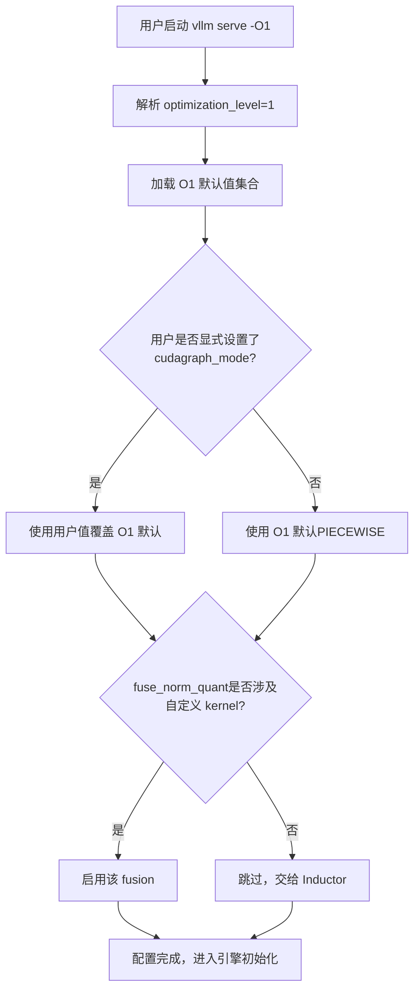
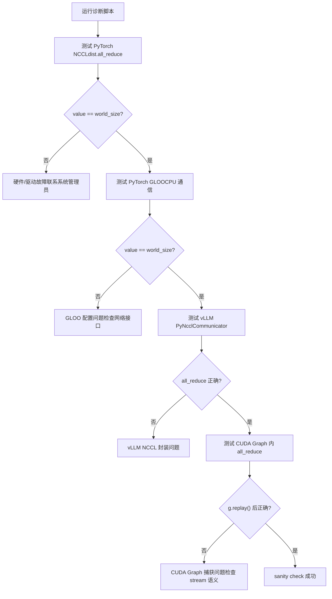
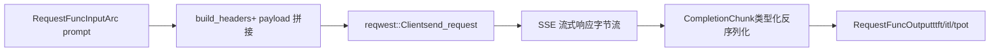

# Kapitel 14: Architekturabwägungen, Produktions-Fallstricke und zukünftige Entwicklung

Im vorherigen Kapitel haben wir den Plugin-Erweiterungsmechanismus von vLLM zerlegt und gesehen, wie Plattform-Plugins, IO-processor-Plugins und Endpunkt-Plugins es ermöglichen, die Engine an neue Hardware, neue Modalitäten und neue APIs anzupassen, ohne den Kerncode zu ändern. Diese Erweiterbarkeit erlaubt es vLLM, Veränderungen schnell aufzugreifen, aber je mehr Erweiterungspunkte es gibt, desto komplexer werden die Interaktionspfade in Produktionsumgebungen. Wenn reale Probleme wie Speicherfragmentierung, NCCL-Handshake-Fehler, ungültig gewordene Compile-Caches und Netzwerkschwankungen gleichzeitig auftreten, geraten die in den vorherigen dreizehn Kapiteln vorgestellten Mechanismen miteinander in Spannung und legen Spannungen offen, die in idealen Umgebungen nicht sichtbar waren. Dieses Kapitel führt keine neuen Kernmechanismen ein, sondern stellt diese Mechanismen zusammen, verankert sie an der offiziellen Troubleshooting-Dokumentation, verbindet sie mit dem Design des Rust-Frontend-bench-Tools, untersucht die Abwägungen zwischen Leistung und Betreibbarkeit und gibt einen umsetzbaren Diagnosepfad an.

# I. Optimierungsstufen: ein expliziter Vertrag zwischen Startzeit und Laufzeitleistung

## Intuitives Modell

Optimierungsstufen sind wie die „Szenenmodi“ einer Kamera: Der Automatikmodus (`-O2`) eignet sich für die meisten Szenarien, aber wenn Sie einen schnellen Schnappschuss (Debugging) benötigen, liefert der Wechsel in den manuellen Modus (`-O0`) sofortige Reaktion, auf Kosten einer Verschlechterung der Bildqualität (Leistung). vLLM macht diese Abwägung zu einem expliziten Vertrag mit vier Stufen, statt sie in Dutzenden boolescher Flags zu verstecken, die Nutzer selbst zusammensetzen müssen.

## Feldlayout der vier Stufen

vLLM bietet`-O0`bis`-O3`vier Stufen[FACT:docs/design/optimization_levels.md:5-5]. Das zentrale Designprinzip ist:**Vom Nutzer explizit gesetzte Flags haben Vorrang vor den Standardwerten der Optimierungsstufe** [FACT:docs/design/optimization_levels.md:5-5]. Das bedeutet, die Optimierungsstufe ist nur eine Menge von Standardwerten, keine harte Einschränkung.

`-O0`schaltet alles aus: kein Autotuning, kein Compile, kein cudagraph[FACT:docs/design/optimization_levels.md:32-33]. Konkret fällt dies auf vier Schalter herunter:`cudagraph_mode=NONE`、`mode=NONE`, alle Fusionen aus,`enable_flashinfer_autotune=False` [FACT:docs/design/optimization_levels.md:37-40]。

`-O1`ist der Balancepunkt für Entwicklungsszenarien: aktiviert`PIECEWISE`cudagraph und`VLLM_COMPILE`-Modus[FACT:docs/design/optimization_levels.md:50-51]. Beachten Sie hier ein feines Detail:`fuse_norm_quant`und`fuse_act_quant`werden nur aktiviert, wenn einer der Operatoren einen benutzerdefinierten Kernel verwendet; andernfalls ist die automatische Fusion von Inductor besser[FACT:docs/design/optimization_levels.md:61]. Dies ist eine typische Designentscheidung nach dem Motto „dem Compiler nicht die Arbeit wegnehmen“.

`-O2`ist der Standardwert und auf Produktion ausgerichtet[FACT:docs/design/optimization_levels.md:66-67]. Aufbauend auf`-O1`fügt es`FULL_AND_PIECEWISE`cudagraph und`fuse_allreduce_rms` [FACT:docs/design/optimization_levels.md:72-73]。`-O3`hinzu; derzeit entspricht es`-O2`und reserviert[FACT:docs/design/optimization_levels.md:80-81]。

## für zukünftig aggressivere experimentelle Optimierungen. Szenariogesteuerter Auswahlprozess

Was passiert intern, wenn ein Nutzer`vllm serve model -O1`ausführt? Das folgende Flussdiagramm zeigt, wie die Optimierungsstufe mit Nutzer-Flags interagiert:

Der Schlüssel in diesem Ablauf liegt im`check_user`-Zweig: Vom Nutzer explizit gesetzte Werte haben immer Vorrang[FACT:docs/design/optimization_levels.md:5-5]. Dies vermeidet schwer zu diagnostizierende Probleme wie „die Optimierungsstufe hat stillschweigend mein Debug-Flag überschrieben“.

## Designüberlegungen und Fallstricke

Die häufigste Produktionsfalle bei Optimierungsstufen ist**eine zu lange Startzeit**. Die Dokumentation empfiehlt ausdrücklich: Bei zu langer Startzeit`-O0`oder`-O1` [FACT:docs/design/optimization_levels.md:87]verwenden. Aber hier gibt es versteckte Kosten –`-O0`ohne cudagraph werden die CPU-Launch-Kosten jedes Kernels sichtbar, und in Szenarien mit hoher Nebenläufigkeit kann der Durchsatz um ein Mehrfaches sinken.

Eine weitere Falle ist**ein Compile-Fehler**。`-O2`:`FULL_AND_PIECEWISE`cudagraph hat stärkere Annahmen über die Modellstruktur; manche benutzerdefinierten Modelle lassen sich unter`-O2`nicht kompilieren, funktionieren aber unter`-O1`normal. Die Dokumentation empfiehlt,`debug_dump_path`zu verwenden, um mehr Debug-Informationen zu erhalten[FACT:docs/design/optimization_levels.md:88]. Der Diagnosepfad sollte sein: Zuerst mit`-O0`die funktionale Korrektheit bestätigen, dann schrittweise auf`-O1`、`-O2`erhöhen und lokalisieren, welche Stufe das Problem eingeführt hat.

> **[Design Inference & Architectural Trade-offs]**
> Diese Art von „stufenweiser Degradation“ als Diagnoseansatz ähnelt im Wesentlichen dem von CUDA Graph`--enforce-eager`Es ist dieselbe Methodik: Zuerst mit der konservativsten Konfiguration die Korrektheit bestätigen, dann schrittweise Optimierungen aktivieren und das Problem auf die kleinste Konfigurationsdifferenz isolieren.

---

# Zwei. Produktions-Fallstricke: Diagnosepfad vom Symptom zur Grundursache

## Intuitives Modell

Fehlerbehebung in der Produktion ist wie Triage in der Notaufnahme: Man kann nicht bei allen Patienten alle Untersuchungen durchführen, sondern muss zunächst anhand der Symptome (OOM, Hang, Absturz) den Bereich schnell eingrenzen und dann gezielt tiefer graben. Die Troubleshooting-Dokumentation von vLLM ist im Wesentlichen ein Triage-Handbuch.

## Symptomklassifizierung und Diagnosewerkzeuge

Die Dokumentation unterteilt häufige Probleme in mehrere große Kategorien. Wir gehen sie nach aufsteigender Diagnoseschwierigkeit durch.

**Erste Kategorie: Modell-Download/-Laden hängt.**Das Symptom ist, dass nach dem Start lange keine Reaktion erfolgt. Die Grundursache ist meist ein langsames Netzwerk oder ein langsames gemeinsam genutztes Dateisystem.[FACT:docs/usage/troubleshooting.md:11-11]. Das Diagnosemittel ist`--load-format dummy`das Überspringen des Gewichts-Ladens, um zu isolieren, ob der Download oder das Laden langsam ist[FACT:docs/usage/troubleshooting.md:23-23]. Dies ist eine typische „Bisektions-Isolationstechnik“.

**Zweite Kategorie: VRAM-OOM.**Die Dokumentation verweist direkt auf die conserving_memory-Konfigurationsdokumentation[FACT:docs/usage/troubleshooting.md:23]. Doch OOM in der Produktion liegt oft nicht daran, dass das Modell zu groß ist, sondern an KV-Cache-Fragmentierung oder einer unerwartet hohen Anzahl gleichzeitiger Anfragen.

**Dritte Kategorie: Änderung der Generierungsqualität.**Dies ist eine leicht übersehene Falle. v0.8.0 hat die Quelle der Standard-Sampling-Parameter geändert: von den neutralen Standardwerten von vLLM hin zu denen des Modellautors`generation_config.json` [FACT:docs/usage/troubleshooting.md:23-23]. In den meisten Fällen verbessert dies die Qualität, aber bei manchen Modellen ist die Konfiguration sogar schlechter[FACT:docs/usage/troubleshooting.md:23-23]. Die Diagnosemethode ist, auf`--generation-config vllm`zurückzufallen und[FACT:docs/usage/troubleshooting.md:23-23]。

**zu vergleichen.**Vierte Kategorie: Hängen (Hang).[FACT:docs/usage/troubleshooting.md:41-41]：

- `VLLM_LOGGING_LEVEL=DEBUG`Dies ist die am schwierigsten zu diagnostizierende Kategorie. Die Dokumentation gibt eine Reihe schrittweiser Debug-Umgebungsvariablen an
- `VLLM_LOG_STATS_INTERVAL=1.`: ausführliche Protokollierung aktivieren
- `CUDA_LAUNCH_BLOCKING=1`: hochfrequente Ausgabe von Warteschlangen- und Cache-Trefferstatus
- `NCCL_DEBUG=TRACE`: lokalisieren, welcher CUDA-Kernel das Problem verursacht
- `VLLM_TRACE_FUNCTION=1`: ausführliche NCCL-Protokollierung aktivieren[FACT:docs/usage/troubleshooting.md:41]

: alle Funktionsaufrufe aufzeichnen, aber dies verlangsamt um mehr als das 100-Fache[FACT:docs/usage/troubleshooting.md:11-11]。

## Hier gibt es eine wichtige Betriebsdisziplin: Nach dem Debuggen müssen diese Umgebungsvariablen deaktiviert oder direkt eine neue Shell geöffnet werden, sonst verlangsamt die verbleibende Debug-Konfiguration das System weiter

Prozessgrenzen-Falle beim Breakpoint-Debugging`pdb`Die Multiprozess-Architektur von vLLM lässt herkömmliche`BdbQuit` [FACT:docs/usage/troubleshooting.md:45-54]Breakpoints unwirksam werden – wenn ein Breakpoint in einem Kindprozess ausgeführt wird, wird`forked-pdb` [FACT:docs/usage/troubleshooting.md:57-61]ausgelöst. Zwei Lösungen: Verwenden von`VLLM_ENABLE_V1_MULTIPROCESSING=0`, oder Setzen von[FACT:docs/usage/troubleshooting.md:63-68]。

> **[Design Inference & Architectural Trade-offs]**
> 〔Designableitung und Architekturabwägung〕

## Die zweite Methode ist zwar praktisch, ändert aber das Ausführungsmodell – im Einzelprozessmodus kommunizieren EngineCore und API Server nicht mehr über Warteschlangen, sodass bestimmte Nebenläufigkeitsfehler möglicherweise nicht reproduziert werden können. Sie eignet sich daher zum Lokalisieren logischer Fehler, nicht zum Reproduzieren von Nebenläufigkeitsproblemen.

Diagnose der verteilten Kommunikation**Für verteilte Bereitstellung gibt es eine spezielle Diagnosedokumentation. Die Kernempfehlung lautet:**Umgebungsvariablen beim Erstellen des Clusters setzen[FACT:docs/serving/distributed_troubleshooting.md:16-16]。

, da Variablen an alle Knoten weitergegeben werden; in der Shell gesetzte Variablen wirken nur auf den lokalen Knoten`No available node types can fulfill resource request`Ein häufiges Problem ist[FACT:docs/serving/distributed_troubleshooting.md:16-16], das selbst bei ausreichend GPUs im Cluster auftritt`VLLM_HOST_IP`. Die Grundursache ist meist, dass ein Knoten mehrere IPs hat und vLLM die falsche auswählt. Die Lösung ist, mit`ray status`explizit anzugeben und mit[FACT:docs/serving/distributed_troubleshooting.md:16-16]。

## zu verifizieren

Diagnoseskript für NCCL-Initialisierungsfehler[FACT:docs/usage/troubleshooting.md:89-150]Die Dokumentation bietet ein vollständiges Diagnoseskript, das den Kommunikationsstack schichtweise verifiziert

Kopieren[FACT:docs/usage/troubleshooting.md:90-146]Das Raffinierte an diesem Skript ist die schichtweise Isolation: Zuerst wird das unterste PyTorch NCCL verifiziert, dann das CPU-seitige GLOO, dann die vLLM-eigene PyNcclCommunicator-Kapselung und schließlich die Kommunikation innerhalb des CUDA Graph

. Jede fehlgeschlagene Schicht weist auf eine andere Grundursache hin.`pynccl.disabled = False`Ein bemerkenswertes Detail im Skript:[FACT:docs/usage/troubleshooting.md:121-125]dient der Abwärtskompatibilität mit Version 0.6.4 und niedriger

. Ab 0.6.5 ist es standardmäßig aktiviert, aber diese Zeile bleibt erhalten, damit Nutzer der neuesten Dokumentation nicht verwirrt werden.`--rdzv_backend=static`Beim Mehrknoten-Test verwendet die Dokumentation absichtlich`c10d`statt`c10d`, weil[FACT:docs/usage/troubleshooting.md:168-168]bei mehreren Knoten aufgrund von DNS-Auflösungsfehlern fehlschlägt

## . Dies ist eine typische Konfiguration, die man erst kennt, wenn man die Falle selbst erlebt hat.

**Designüberlegungen und Fallstricke**（`ncclCommInitRank`NCCL-Initialisierungsfehler`IPC_LOCK`meldet unhandled system error) weist meist auf zwei Grundursachen hin: fehlende`/dev/shm`capability oder nicht eingebundenes[FACT:docs/usage/troubleshooting.md:311-311]. Beides sind klassische Fallen containerisierter Bereitstellungen.

**CUDA-PTX-Toolchain-Nichtübereinstimmung**（`the provided PTX was compiled with an unsupported toolchain`) bedeutet, dass das PTX im Wheel mit einer höheren Version des CUDA-Toolkits kompiliert wurde[FACT:docs/usage/troubleshooting.md:325-327]. Die Lösung ist, CUDA Forward Compatibility zu aktivieren: unter Docker`-e VLLM_ENABLE_CUDA_COMPATIBILITY=1` [FACT:docs/usage/troubleshooting.md:325-327]hinzufügen, auf Bare-Metal`cuda-compat`installieren und`VLLM_CUDA_COMPATIBILITY_PATH` [FACT:docs/usage/troubleshooting.md:325-327]。

**setzen.**：vLLM `>= 0.4.3, <= 0.10.1.1`Bekanntes NCCL-Speicher-Overhead-Problem`NCCL_CUMEM_ENABLE=0`setzt[FACT:docs/usage/troubleshooting.md:375], um einen NCCL-Bug zu umgehen. Wenn externe Prozesse sich mit vLLM verbinden, muss diese Variable ebenfalls gesetzt werden, sonst kommt es zu Hang oder Absturz[FACT:docs/usage/troubleshooting.md:375]. Nach der Behebung in NCCL 2.22.3 wurde diese Überschreibung in neueren Versionen entfernt, um Leistungsoptimierungen zu ermöglichen**. Dieser Fall zeigt:**Der prozessübergreifende Umgebungsvariablen-Vertrag ist eine implizite Abhängigkeit verteilter Systeme

---

# und muss bei Upgrades synchron angepasst werden.

## Drei. Rust-Frontend: Die Zero-Copy-Designphilosophie des bench-Tools

Intuitives Modell

## Wenn das Python-Frontend ein „funktionsvollständiges, aber schwerfälliges“ Schweizer Taschenmesser ist, dann ist das Rust-bench-Tool ein „nur für Lasttests geschaffenes“ Skalpell. Sein Designziel ist nicht Funktionsabdeckung, sondern den Eigenoverhead des Clients unter hoher Nebenläufigkeit minimiert zu halten, damit die gemessenen Zahlen die Serverleistung wahrheitsgetreu widerspiegeln.

Die zentrale Datenstruktur des bench-Tools ist`RequestFuncInput` [FACT:rust/src/bench/src/backends/mod.rs:59-89]. Es verwendet intensiv`Arc<str>`und`Arc<[u32]>`statt`String`/`Vec`, was der Kern des Zero-Copy-Designs ist.

Betrachten wir einige Schlüsselfelder:`prompt: Arc<str>` [FACT:rust/src/bench/src/backends/mod.rs:50-52]——Mehrere gleichzeitige Anfragen können denselben Prompt-String teilen, wodurch vermieden wird, dass jede Anfrage eine Kopie klont.`prompt_token_ids: Option<Arc<[u32]>>` [FACT:rust/src/bench/src/backends/mod.rs:77]——Vorberechnete Token-IDs werden direkt an den Server gesendet, wodurch die serverseitige Tokenisierung übersprungen wird[FACT:rust/src/bench/src/backends/mod.rs:74-76]。

Am raffiniertesten ist`multi_modal_content: Option<Arc<[Arc<str>]>>` [FACT:rust/src/bench/src/backends/mod.rs:81]. Der Kommentar erklärt: Multimodale Inhalte werden als vorserialisierte JSON-Fragmente behandelt, und das Chat-Backend fügt sie direkt in den Payload-Byte-Stream ein, wodurch jegliches Parsen oder tiefes Kopieren von Base64-Bilddaten vermieden wird[FACT:rust/src/bench/src/backends/mod.rs:78-80]. Dies ist eine zweischichtige`Arc`-Struktur: Die äußere`Arc<[...]>`teilt das gesamte Array, die innere`Arc<str>`teilt einzelne Fragmente.

`chat_messages_json: Option<Arc<str>>`hat die höchste Priorität und wird direkt unverändert in den Payload eingefügt[FACT:rust/src/bench/src/backends/mod.rs:82-85]。

## Null-Allokations-Deserialisierung

Die Analyse von SSE-Streaming-Antworten ist ein weiterer kritischer Performance-Punkt. Der Kommentar stellt ausdrücklich fest: Typisierte Deserialisierung wird verwendet, um den Aufbau eines vollständigen`serde_json::Value`-Baums zu vermeiden und nur die benötigten Felder zu extrahieren[FACT:rust/src/bench/src/backends/mod.rs:20-24]。

`CompletionChunk`Nur`choices`und`usage`werden beibehalten[FACT:rust/src/bench/src/backends/mod.rs:20-24]，`ChatChunk`Ebenso[FACT:rust/src/bench/src/backends/mod.rs:33-37]。`#[serde(default)]`lässt fehlende`choices`-Felder standardmäßig ein leeres Array sein[FACT:rust/src/bench/src/backends/mod.rs:20-24], was ein häufiger Fall bei Streaming-Antworten ist.

## Szenariogesteuerter Anfrageablauf

Wenn eine Lasttest-Anfrage gesendet wird, wie fließen die Daten? Das folgende Datenflussdiagramm zeigt die Transformation von der Eingabe zur Ausgabe:

`Backend`Das Enum verwendet statischen Dispatch, um das Problem von async trait objects zu vermeiden[FACT:rust/src/bench/src/backends/mod.rs:150-154]。`send_request`Durch`match`wird an die konkrete Implementierung verteilt[FACT:rust/src/bench/src/backends/mod.rs:158-168]。`get_backend`Je nach`BackendKind`wird das entsprechende Backend zurückgegeben[FACT:rust/src/bench/src/backends/mod.rs:172-181]。

Ein Detail:`API_KEY`verwendet`OnceLock`-Caching, um zu vermeiden, dass jede Anfrage einen Umgebungsvariablen-Syscall durchführt[FACT:rust/src/bench/src/backends/mod.rs:186-188]。`build_headers`Content-Type, Authorization, extra headers, request-id werden nacheinander eingefügt[FACT:rust/src/bench/src/backends/mod.rs:191-215]。

## Designüberlegungen und Stolperfallen

> **[Design Inference & Architectural Trade-offs]**
> Das Zero-Copy-Design des Rust-bench-Tools spiegelt eine wichtige Einschätzung wider:**Der Client-Overhead von Lasttest-Tools wird zur Quelle von Messfehlern**. Wenn jede Anfrage den Prompt klont, vollständiges JSON parst und Base64-Bilder tief kopiert, mischt sich Client-Overhead in die gemessene Latenz ein, und die tatsächliche Serverleistung kann nicht wahrheitsgetreu widergespiegelt werden. Die Verwendung von`Arc`zur gemeinsamen Nutzung unveränderlicher Daten und typisierter Deserialisierung zum Überspringen irrelevanter Felder reduziert den Client-Overhead im Wesentlichen auf nahezu null.

`RequestFuncOutput`Das Felddesign von`ttft`（time to first token）、`itl`(inter-token latency array),`tpot`（time per output token）[FACT:rust/src/bench/src/backends/mod.rs:93-105]. Diese drei Metriken entsprechen unterschiedlichen Leistungsdimensionen: TTFT spiegelt Prefill- und Warteschlangenlatenz wider, ITL spiegelt die Stabilität des Decodings wider, TPOT spiegelt den Gesamtdurchsatz wider. Wenn beim Lasttest nur die durchschnittliche Latenz betrachtet wird, wird das Jitter von ITL verschleiert.

---

# Designüberlegung: Die zugrunde liegende Logik von Architekturabwägungen

Wenn man die Mechanismen dieses Kapitels und der vorherigen dreizehn Kapitel zusammen betrachtet, lassen sich mehrere Kernabwägungslinien von vLLM erkennen.

> **[Design Inference & Architectural Trade-offs]**
> **Kontinuierliches Batching vs. VRAM-Fragmentierung.**Kontinuierliches Batching ermöglicht die Neuzusammensetzung des Batches bei jedem Schritt, was den Durchsatz erheblich steigert, aber auf Kosten extrem häufiger Zuweisung und Freigabe des KV-Cache. Der Blocktabellenmechanismus von PagedAttention ist genau darauf ausgelegt, diese hochfrequente Zuweisung zu bewältigen – Blöcke fester Größe eliminieren externe Fragmentierung, führen jedoch den Indirektionsoverhead der Blocktabelle und interne Fragmentierung ein (der letzte Block ist möglicherweise nicht vollständig gefüllt). Dies ist eine typische Abwägung von „Indirektionsebene gegen Fragmentierungsrate“, dieselbe Denkweise wie die virtuelle Speicherpaginierung von Betriebssystemen.

**CUDA Graph vs. dynamische Formen.**CUDA Graph erfordert statische Formen, aber die Batchgröße des kontinuierlichen Batchings ändert sich bei jedem Schritt. Die Lösung von vLLM ist`PIECEWISE`und`FULL_AND_PIECEWISE`-Modus[FACT:docs/design/optimization_levels.md:50,72]——der statisch machbare Teil wird als Graph erfasst, der dynamische Teil bleibt eager.`-O0`Das vollständige Deaktivieren von cudagraph dient dem Debugging,`-O2`das vollständige Aktivieren dient der Produktion, und das dazwischenliegende`-O1`ist ein Kompromiss.

**Disaggregierte Bereitstellung vs. Netzwerkoverhead.**Der KV Connector ermöglicht die Trennung von Prefill und Decode auf verschiedene Instanzen, aber die instanzübergreifende Übertragung des KV-Cache führt zu Netzwerklatenz. Die Konfigurationsanforderungen für GPUDirect RDMA in der Dokumentation (`IPC_LOCK`、`/dev/shm`）[FACT:docs/usage/troubleshooting.md:311-311]zeigen, dass dieser Pfad harte Anforderungen an die Infrastruktur stellt. Netzwerk-Jitter kann zu Timeouts bei der KV-Übertragung führen, was wiederum Wiederholungsversuche oder Degradierung auslöst.

**Betreibbarkeit vs. Leistung.**Optimierungsstufen, Debug-Umgebungsvariablen, Diagnoseskripte – all dies sind Kosten, die für die Betreibbarkeit anfallen.`VLLM_TRACE_FUNCTION=1`verlangsamt um das 100-fache[FACT:docs/usage/troubleshooting.md:41], aber es ist das letzte Mittel zur Lokalisierung von Hang-Problemen. Eine ausgereifte Engine muss diese „langsamen, aber sichtbaren“ Werkzeuge bereitstellen.

---

# Zusammenfassung dieses Kapitels

Dieses Kapitel schließt das Buch ab und betrachtet die Mechanismen der vorherigen dreizehn Kapitel erneut aus der Perspektive des Produktivbetriebs.

Optimierungsstufen (`-O0`bis`-O3`) sind ein expliziter Vertrag zwischen Startzeit und Laufzeitleistung; Benutzer-Flags haben immer Vorrang vor den Standardwerten der Stufe[FACT:docs/design/optimization_levels.md:5-5]. Die Checkliste für Produktionsstolperfallen deckt den vollständigen Diagnosepfad von Modellladen, VRAM-OOM, Änderungen der Generierungsqualität bis hin zu Fehlern bei der verteilten Kommunikation ab; die Kernmethodik ist „binäre Isolation“ und „schichtweise Verifikation“. Das Rust-bench-Tool reduziert den Client-Overhead durch`Arc`-Sharing und typisierte Deserialisierung auf nahezu null, um sicherzustellen, dass die Lasttestzahlen die Serverleistung wahrheitsgetreu widerspiegeln.

Drei zentrale Spannungslinien durchziehen das gesamte Buch: kontinuierliches Batching vs. VRAM-Fragmentierung, CUDA Graph vs. dynamische Shapes, disaggregierte Bereitstellung vs. Netzwerk-Overhead. Diese Spannungen zu verstehen ist wichtiger, als sich an irgendeinen einzelnen Mechanismus zu erinnern – denn jede Optimierung in der Produktion ist im Wesentlichen eine Suche nach dem Gleichgewichtspunkt zwischen diesen Spannungen.

# Gedanken und Selbsttest zu diesem Kapitel

Q1: Wenn man`-O2`das`FULL_AND_PIECEWISE`cudagraph zu`-O1`dem`PIECEWISE`ändert, in welchen Szenarien würde ein Performance-Rückgang ausgelöst? Warum?

**Referenzanalyse**：`-O2`Aufbauend auf`-O1`wird`FULL_AND_PIECEWISE`cudagraph-Modus[FACT:docs/design/optimization_levels.md:72]。`FULL`hinzugefügt. Der Modus erfasst den gesamten Forward-Pass als ein einziges Diagramm, während`PIECEWISE`nur die statischisierbaren Fragmente erfasst. In Produktionsszenarien mit stabilen Batch-Shapes kann der`FULL`-Modus mehr Kernel-Launch-Overhead eliminieren und bietet höheren Durchsatz. Wenn das Modell jedoch dynamische Kontrollflüsse enthält (wie das Token-Routing von MoE), kann der`FULL`-Modus möglicherweise nicht erfassen oder verhält sich nach der Erfassung abnormal; in diesem Fall ist`PIECEWISE`stabiler. Performance-Rückgänge treten auf, wenn: die Batch-Größe häufig wechselt, sodass das`FULL`-Diagramm nicht getroffen wird, oder die Modellstruktur den Fallback-Pfad des`FULL`-Modus auslöst. Die Fehlersuche erfolgt, indem man zunächst mit`-O1`die Baseline bestätigt, dann auf`-O2`hochgeht zum Vergleich und mit`VLLM_LOG_STATS_INTERVAL=1.`den Warteschlangenstatus beobachtet.[FACT:docs/usage/troubleshooting.md:41-41]。

Q2: Warum muss im Diagnoseskript vor dem Test des vLLM PyNcclCommunicator zuerst PyTorch GLOO getestet werden? Was würde übersehen, wenn man den GLOO-Test überspringt und direkt PyNccl testet?

**Referenzanalyse**: Die Ausführungsreihenfolge des Skripts ist PyTorch NCCL → PyTorch GLOO → vLLM PyNccl → CUDA Graph[FACT:docs/usage/troubleshooting.md:90-146]. GLOO testet die CPU-seitige Kommunikation[FACT:docs/usage/troubleshooting.md:106-112], während vLLMs`PyNcclCommunicator`eine GLOO-Gruppe als Bootstrap benötigt[FACT:docs/usage/troubleshooting.md:120]. Wenn man den GLOO-Test überspringt, kann man bei einem PyNccl-Initialisierungsfehler nicht unterscheiden, ob es sich um ein NCCL-Problem selbst oder um ein GLOO-Bootstrap-Problem handelt. GLOO hängt von der Netzwerkschnittstellen-Konfiguration ab (`GLOO_SOCKET_IFNAME`）[FACT:docs/usage/troubleshooting.md:81-81], was in komplexen Netzwerkumgebungen ein häufiger Fehlerpunkt ist. Der Wert schichtweiser Tests liegt darin, Fehler auf die kleinste Konfigurationsdifferenz zu isolieren.

Q3: Das Rust-Bench-Tool verwendet`Arc<str>`gemeinsam genutzte Prompts. Wenn das Lasttestszenario erfordert, dass jede Anfrage einen anderen Prompt sendet, versagt dieses Design dann? Warum?

**Referenzanalyse**：`Arc<str>`Das Designziel von[FACT:rust/src/bench/src/backends/mod.rs:50-52]ist es, dass mehrere gleichzeitige Anfragen denselben unveränderlichen String`Arc`gemeinsam nutzen. Wenn der Prompt jeder Anfrage unterschiedlich ist, verschwindet der Sharing-Vorteil von`Arc<str>`tatsächlich – jede Anfrage muss ihr eigenes`Arc<str>`konstruieren. Aber das Design versagt nicht:`String`vermeidet im Vergleich zu`prompt_token_ids: Option<Arc<[u32]>>` [FACT:rust/src/bench/src/backends/mod.rs:77]immer noch mehrfache Klonvorgänge während des Request-Flusses (z. B. von der Eingabewarteschlange zum Backend und dann zur Payload-Konstruktion). Die wahre Zero-Copy-Optimierung liegt in`Arc`– selbst wenn der Prompt-Text unterschiedlich ist, kann das vorberechnete Token-ID-Array weiterhin über`Arc<str>`während des Request-Lebenszyklus geteilt werden, um wiederholte Allokationen zu vermeiden. Die Designannahme des Lasttest-Tools ist „derselbe Prompt bei hoher Nebenläufigkeit" oder „vorberechnete Token-IDs"; Ersteres nutzt`Arc<[u32]>`zum Teilen von Text, Letzteres nutzt

---

zum Teilen von Token-Sequenzen.

Damit endet die Quellcode-Analyse der vierzehn Kapitel des Buches. Wir starteten bei einem API-Aufruf, durchquerten den Scheduler, den KV-Cache-Manager, das Attention-Backend, die verteilte Kommunikationsschicht, erreichten schließlich den Launch-Punkt des GPU-Kernels und kehrten dann zum Diagnose-Cockpit des Produktionsbetriebs zurück. Hinter jeder Designentscheidung von vLLM steht ein klarer Kompromiss. Nur wenn man diese Kompromisse versteht, kann man angesichts neuer Hardware, neuer Modelle und neuer Lasten die richtigen technischen Entscheidungen treffen. Die Evolution der Inferenz-Engines wird nicht aufhören – Rust-Frontend, IR-Schicht, Unterstützung heterogener Hardware schreiten schnell voran – aber die zugrundeliegende Kompromisslogik ist stabil, und genau das ist die Kernkompetenz, die dieses Buch vermitteln möchte.
