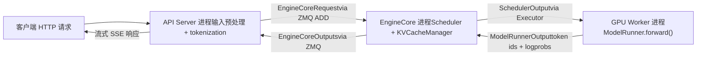
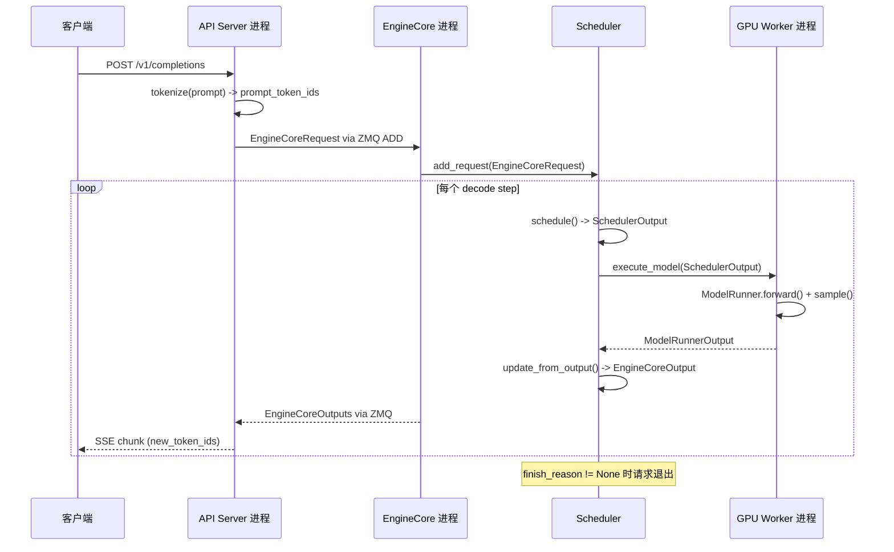

# Chapter 1: vLLM's Design Philosophy and Overall Architecture Overview

Suppose you have an A100 and want to use LLaMA-7B to provide online inference services. The most naive approach is: a request comes in, run model.generate() once, return the result. This approach will immediately collapse once concurrency picks up—not because GPU compute is insufficient, but because of two things: First, memory is eaten up by fragmentation. Autoregressive generation requires caching the Key/Value tensors of each layer (KV Cache). If each request pre-allocates an entire contiguous block of GPU memory according to max_model_len, a 4096-token request would occupy tens of MB, while the actually generated sequence might only be 200 tokens. Worse still, as requests of different lengths enter and exit alternately, contiguous memory blocks get chopped into pieces, and ultimately even though the total amount is sufficient, no contiguous space large enough can be found—this is the classic GPU memory fragmentation problem. Second, batching efficiency is low. Traditional static batching requires all requests in a batch to start and finish at the same time. But the output length of generation tasks is inherently unpredictable: one request might stop after 10 tokens, while another needs to generate 2000. After a short request finishes, the batch slot it occupied can only wait idly for the long request to complete, and GPU utilization plummets. vLLM's two design cornerstones are precisely aimed at these two pain points: PagedAttention uses a paging mechanism to eliminate memory fragmentation, and Continuous Batching uses iteration-level scheduling to eliminate batch idling. This chapter does not dive into the implementation details of these two mechanisms (those are the topics of Chapters 2 and 4), but first establishes a global map: what vLLM v1's process architecture looks like, how responsibilities are divided across layers, and which components a request must pass through from entering the system to emitting tokens. Only after understanding this map can the source code analysis in each subsequent chapter have a foothold.

# Process Architecture: Why vLLM Is Not a Single-Process Program

## Intuitive Model

Think of vLLM as a restaurant. The front desk (API Server) is responsible for receiving guests and recording orders; the kitchen core (EngineCore) decides which dish to cook first and which stove to use; each stove (GPU Worker) is exclusively operated by one chef. If one person both receives guests and cooks, things will inevitably become chaotic during peak hours—this is why vLLM splits these roles into independent processes.

> **[Design Inference & Architectural Trade-offs]**
> The core motivation for this multi-process split is**separation of concerns**: HTTP parsing, tokenization, and multimodal data loading are CPU-intensive and potentially blocking operations, while model forward passes are GPU-intensive. If placed in the same process, Python's GIL would cause the two to drag each other down. After splitting into independent processes, the API Server can continuously receive new requests, EngineCore can continuously schedule, and GPU Workers can continuously compute, with the three decoupled through ZMQ message queues.

## Process Topology and Quantity Relationships

vLLM v1's process architecture can be summarized with a formula. For`N`GPUs, tensor parallelism degree`TP`, pipeline parallelism degree`PP`, data parallelism degree`DP`, number of API Servers`A`deployment:

| Process Type | Quantity | Responsibility |
| --- | --- | --- |
| API Server | `A`(default equal to`DP`） | HTTP request handling, input preprocessing, streaming return of results |
| EngineCore | `DP`(default 1) | Scheduling, KV Cache management, coordinating GPU Workers |
| GPU Worker | `N`（= `DP × PP × TP`） | Loading weights, executing forward passes, managing GPU memory |
| DP Coordinator | `DP > 1`When  is 1, otherwise 0 | Inter-DP-rank load balancing and MoE wave coordination |

[FACT:docs/design/arch_overview.md:113-113]provides the authoritative definition of this table. A typical single-machine 4-GPU deployment (`vllm serve -tp=4`) produces 1 API Server + 1 EngineCore + 4 GPU Workers = 6 processes[FACT:docs/design/arch_overview.md:115-115]. An 8-GPU TP=2/DP=4 deployment, however, balloons to 4 + 4 + 8 + 1 = 17 processes[FACT:docs/design/arch_overview.md:123-123]。

There is a detail here that is easy to overlook:**The number of API Servers follows the DP size by default**. When`--data-parallel-size 4`, 4 API Servers are automatically started, each connecting to all EngineCores via ZMQ in a many-to-many topology[FACT:docs/design/arch_overview.md:73-73]. This means any API Server can route requests to any EngineCore, avoiding a single point of bottleneck.

## Data flow

The diagram below shows the complete flow path of a request across processes. Note that each node is labeled with real class names and data structures:



The key point of this diagram is:**Communication between API Server and EngineCore is asynchronous message passing**, not function calls. Requests are serialized into the`EngineCoreRequest`structure (a`msgspec.Struct`, see[FACT:vllm/v1/engine/__init__.py:109-113]), sent via ZMQ's`ADD`message type[FACT:vllm/v1/engine/__init__.py:287-299]. After EngineCore finishes processing, it packages the result into`EngineCoreOutputs`and returns it[FACT:vllm/v1/engine/__init__.py:256-260]。

> **[Design Inference & Architectural Trade-offs]**
> ZMQ was chosen over gRPC or shared memory because ZMQ has extremely low latency (microsecond level) in inter-process communication scenarios, and naturally supports many-to-many topologies and message queue semantics. For inference services, which are sensitive to first-token latency, communication overhead must be as small as possible.

## Design thinking: Why EngineCore is a separate process rather than a thread

A natural question is: since EngineCore and API Server are on the same machine, why not put them in the same process and communicate with threads?

The answer lies in EngineCore's working mode. EngineCore runs a**busy loop**(busy loop), continuously scheduling requests and dispatching work to GPU Workers[FACT:docs/design/arch_overview.md:73-73]. This loop cannot be interrupted—once blocked by HTTP parsing or tokenization, bubbles will appear in the entire inference pipeline. A separate process ensures that EngineCore's CPU time slice will not be preempted by frontend logic.

In addition, a separate process also brings**fault isolation**: if the API Server crashes due to a malformed request, EngineCore and GPU Workers are unaffected and can continue serving requests forwarded by other API Servers.

# Layered mental model: Responsibility boundaries from entrypoint to GPU

## Intuitive model

If the process architecture is "who does the work and where," then the layered model is "what decisions each layer is responsible for." vLLM's code organization follows a clear layering principle:**Upper layers decide what to do, lower layers decide how to do it**. The entrypoint layer decides which requests to accept, the engine core layer decides who to process first, the executor layer decides which parallel strategy to use, and the Worker layer decides how to produce results on specific hardware.

## Four-layer structure

**Entrypoints**provides two interaction methods: the`LLM`class for offline inference and the`vllm serve`command for online serving[FACT:docs/design/arch_overview.md:16-16][FACT:docs/design/arch_overview.md:56-56]. The core responsibility of this layer is input preprocessing—tokenization, multimodal data loading, sampling parameter parsing—as well as output detokenization and streaming return. It does not care about scheduling strategy, nor does it touch the GPU.

**EngineCore**is the brain of the entire system. It holds the Scheduler (which decides which requests to process at each decode step) and the KV Cache Manager (which manages paged GPU memory), and communicates with GPU Workers through the Executor abstraction[FACT:docs/design/arch_overview.md:79-85]. The key design of this layer is**separation of scheduling and execution**: the Scheduler only produces decisions about "which tokens to run in this step" (`SchedulerOutput`), while how exactly to run them on the GPU is the Worker's job.

**Executor**is the bridge between EngineCore and Workers. It encapsulates distributed execution strategies—single-process uses`UniProcExecutor`, multi-process uses`MultiprocExecutor`, Ray cluster uses`RayDistributedExecutor`. The Executor's abstract interface means EngineCore does not need to know whether the underlying setup is a single GPU or 8-GPU TP.

**Worker layer**One Worker process per GPU, internally holding a ModelRunner and the actual`torch.nn.Module`model object[FACT:docs/design/arch_overview.md:171-191]. ModelRunner is responsible for preparing input tensors, capturing CUDA Graphs, and executing forward computation. This layer is the only place that directly operates GPU memory and CUDA streams.

## Configuration object: Global state spanning all layers

What is used to pass information between the four layers? The answer is`VllmConfig`—a giant dataclass containing all configuration[FACT:vllm/config/vllm.py:357-357]。

```python
@config(config=ConfigDict(arbitrary_types_allowed=True))
class VllmConfig:
    """Dataclass which contains all vllm-related configuration."""
    model_config: ModelConfig = None
    cache_config: CacheConfig = Field(default_factory=CacheConfig)
    parallel_config: ParallelConfig = Field(default_factory=ParallelConfig)
    scheduler_config: SchedulerConfig = Field(default_factory=SchedulerConfig.default_factory)
    # ... 还有 20+ 个子配置
```

[FACT:vllm/config/vllm.py:363-371]shows the core fields. The logic behind this design choice is worth elaborating on.

> **[Design Inference & Architectural Trade-offs]**
> The documentation explicitly explains why a single large configuration object is used instead of scattered parameter passing:**Scalability**. Suppose you want to add a new feature that only affects ModelRunner; you only need to add a field in`VllmConfig`, and ModelRunner can read it directly, without modifying the constructor signatures of Engine, Worker, or Model[FACT:docs/design/arch_overview.md:203-203]. In a rapidly evolving inference framework, this ability to "add fields without changing interfaces" greatly reduces development friction.

The cost is that`VllmConfig`becomes extremely large—from[FACT:vllm/config/vllm.py:356-3509]it can be seen that this class spans more than 3000 lines of code and contains dozens of fields and validation methods.`__post_init__`The method[FACT:vllm/config/vllm.py:1405-2317]is even more than 900 lines long, handling all cross-configuration validation and default value derivation.

## Configuration hashing and caching

`VllmConfig`There is also an easily overlooked but very important capability:`compute_hash()` [FACT:vllm/config/vllm.py:464-580]. It generates a short hash for all configuration items that affect the computation graph structure.

```python
def compute_hash(self, include_version: bool = True) -> str:
    factors: list[Any] = []
    vllm_factors: list[Any] = []
    if include_version:
        from vllm import __version__
        vllm_factors.append(__version__)
    if self.model_config:
        vllm_factors.append(self.model_config.compute_hash())
    # ... 逐个追加各子配置的哈希
    hash_str = safe_hash(str(factors).encode(), usedforsecurity=False).hexdigest()[:10]
    return hash_str
```

[FACT:vllm/config/vllm.py:479-580]shows the complete hash computation flow. Note the warning in the comments: "Whenever a new field is added to this config, ensure that it is included in the factors list if it affects the computation graph"[FACT:vllm/config/vllm.py:465-467]。

> **[Design Inference & Architectural Trade-offs]**
> The purpose of this hash is**torch.compile cache key**. vLLM uses`torch.compile`to compile the model forward graph, and the compiled result is cached to disk. On the next startup, if the configuration hash is the same, the compilation cache can be reused directly, skipping the time-consuming compilation process. If a configuration item that affects the computation graph is not included in the hash, it will cause a cache hit error—using a graph compiled with the old configuration to run the new configuration, resulting in silent errors. This is why the comments repeatedly emphasize that "fields affecting the computation graph must be included in the hash."

# Request lifecycle walkthrough: from HTTP to token

## Scenario setup

Suppose a client sends an OpenAI-compatible`vllm serve`request to the service started by`/v1/completions`, with the prompt "The capital of France is", requesting the generation of 16 tokens. We trace the complete journey of this request through the source code.

## Step 1: API Server receives and preprocesses

After the API Server process receives the HTTP request, it performs tokenization and sampling parameter parsing, then constructs`EngineCoreRequest`：

```python
class EngineCoreRequest(
    msgspec.Struct,
    array_like=True,
    omit_defaults=True,
    gc=False,
):
    request_id: str
    prompt_token_ids: list[int] | None
    mm_features: list[MultiModalFeatureSpec] | None
    sampling_params: SamplingParams | None
    pooling_params: PoolingParams | None
    arrival_time: float
    lora_request: LoRARequest | None
    cache_salt: str | None
    data_parallel_rank: int | None
    prompt_embeds: torch.Tensor | None = None
    # ... 更多字段
```

[FACT:vllm/v1/engine/__init__.py:109-124]defines the core structure of the request. Note`msgspec.Struct`together with`array_like=True`and`omit_defaults=True`the combination[FACT:vllm/v1/engine/__init__.py:109-113]—this is for**serialization performance**。`array_like`to let msgspec encode using positional arrays instead of dictionaries,`omit_defaults`skipping default value fields; the combination of the two greatly reduces the size of ZMQ messages.

> **[Design Inference & Architectural Trade-offs]**
> `gc=False`tells msgspec not to generate GC tracking code for this struct[FACT:vllm/v1/engine/__init__.py:109-113]. For message objects created/destroyed at high frequency, disabling GC tracking can reduce pressure on the Python garbage collector, which is a necessary optimization in scenarios handling thousands of requests per second.

## Step 2: EngineCore scheduling

After EngineCore receives the request, the Scheduler places it in the waiting queue. In each scheduling step, the Scheduler decides whether to include this request in the current batch. If included, the KV Cache Manager allocates physical blocks for it (the core operation of PagedAttention, see Chapter 2 for details).

The scheduling result is encapsulated as`SchedulerOutput`and sent to the GPU Worker through the Executor.

## Step 3: GPU Worker executes the forward pass

The Worker's ModelRunner receives`SchedulerOutput`, prepares input tensors (including attention metadata such as block table and slot mapping), executes the model forward pass, and samples the next token.

## Step 4: Result returned

The token produced by the Worker is encapsulated as`EngineCoreOutput`：

```python
class EngineCoreOutput(
    msgspec.Struct,
    array_like=True,
    omit_defaults=True,
    gc=False,
):
    request_id: str
    new_token_ids: list[int]
    new_logprobs: LogprobsLists | None = None
    finish_reason: FinishReason | None = None
    stop_reason: int | str | None = None
    # ...
```

[FACT:vllm/v1/engine/__init__.py:199-217]defines the output structure.`finish_reason`is a`IntEnum`, with values including`STOP`、`LENGTH`、`ABORT`、`ERROR`、`REPETITION` [FACT:vllm/v1/engine/__init__.py:68-69]. The comments explain why`Int`is used instead of`Str`：「Int rather than Str for more compact serialization」[FACT:vllm/v1/engine/__init__.py:56-57]—another serialization size optimization.

Multiple`EngineCoreOutput`are packed into`EngineCoreOutputs`and returned to the API Server via ZMQ[FACT:vllm/v1/engine/__init__.py:256-260]。

## Step 5: API Server streams the response

After the API Server receives`EngineCoreOutputs`, it detokenizes each`EngineCoreOutput`and then streams it to the client via SSE (Server-Sent Events).

## Complete sequence

The sequence diagram below shows the complete cross-process interaction, annotating the real function names and data structures at each step:



Key information in this diagram:**Each decode step produces one`EngineCoreOutputs`return**, rather than waiting until the entire sequence is generated before returning. This is exactly the embodiment of Continuous Batching—completed sequences exit immediately, new requests join immediately, and output is streamed back to the client.

# Design considerations and production pitfalls

## The "post-initialization" pattern of configuration validation

`VllmConfig.__post_init__`is the core of the entire configuration system. It is not a simple field assignment, but a**multi-stage validation pipeline**：

1. First, parse the multimodal encoder mode[FACT:vllm/config/vllm.py:1416-1416]

2. Then call`try_verify_and_update_config()`, giving model-specific configuration hooks a chance to modify the configuration[FACT:vllm/config/vllm.py:1434-1434]

3. Next, validate the consistency among parallel configuration, quantization configuration, and LoRA configuration[FACT:vllm/config/vllm.py:1442-1444]

4. Finally, handle compatibility checks for runtime features such as asynchronous scheduling, CUDA Graph, and KV Transfer[FACT:vllm/config/vllm.py:1544-1635]

> **[Design Inference & Architectural Trade-offs]**
> This "post-initialization" pattern resolves a fundamental contradiction:**configuration items have dependencies on each other, but users may set them in any order**. For example,`async_scheduling`whether to enable it depends on multiple conditions such as the method type of speculative_config, whether the executor backend supports it, and whether pipeline parallelism is used[FACT:vllm/config/vllm.py:1544-1575]. If this logic were placed in the field's`__set__`, it would create complex circular dependencies. Handling it uniformly in`__post_init__`in order makes the logic clear and easy to debug.

## Pitfall: The conflict between KV Connector and expandable_segments

[FACT:vllm/config/vllm.py:1219-1260]in`_verify_kv_transfer_compat`reveals a very subtle production trap.

When using KV Connector (such as NIXL, Mooncake) for PD-disaggregated deployment, these connectors will, through mechanisms such as`ibv_reg_mr`,**pin the physical memory pages of the KV cache**. But if`PYTORCH_CUDA_ALLOC_CONF=expandable_segments:True`is also set, PyTorch's CUDA VMM allocator may remap the same virtual address to different physical pages at runtime[FACT:vllm/config/vllm.py:1227-1233]。

What is the consequence? The RDMA memory region registered by the Connector points to physical pages that are no longer valid. The first cross-node KV transfer will report`IBV_WC_REM_ACCESS_ERR`or`NIXL_ERR_REMOTE_DISCONNECT` [FACT:vllm/config/vllm.py:1232-1233]。

vLLM's response strategy is**conservative rejection**: as long as`expandable_segments:True`is detected and any KV connector is configured, it directly throws an exception[FACT:vllm/config/vllm.py:1249-1260]. The only exemption is when`enable_cumem_allocator`is enabled — because the CuMem allocator will disable`expandable_segments` [FACT:vllm/config/vllm.py:1238-1241]。

> **[Design Inference & Architectural Trade-offs]**
> [Design Inference and Architectural Trade-offs]**The lesson from this case is:**RDMA memory registration and virtual memory remapping are semantically incompatible`PYTORCH_CUDA_ALLOC_CONF`。

## . Any feature involving GPU memory pinning (KV transfer, NCCL registered buffers, etc.) must ensure that the underlying physical pages will not be silently moved by the allocator. When troubleshooting such issues, if you see RDMA transfer fail on the first cross-node communication, the first reaction should be to check

`__post_init__`Pitfall: The automatic degradation chain of asynchronous scheduling`async_scheduling`in[FACT:vllm/config/vllm.py:1544-1635]regarding the handling logic of**demonstrates a carefully designed**。

automatic degradation chain`async_scheduling`When the user has not explicitly set`None`(value is

- ), vLLM will try to enable it automatically, but it needs to check a series of incompatible conditions in sequence:[FACT:vllm/config/vllm.py:1578-1587]
- If it is a pooling model, disable[FACT:vllm/config/vllm.py:1588-1601]
- If the speculative method is not in the supported list, disable`disable_padded_drafter_batch=True`If[FACT:vllm/config/vllm.py:1602-1610]
- , disable[FACT:vllm/config/vllm.py:1611-1617]
- If the executor backend does not support it, disable[FACT:vllm/config/vllm.py:1618-1624]
- If it is ROCm DeepEP high-throughput DBO, disable[FACT:vllm/config/vllm.py:1625-1633]

If PP > 1 and the V1 Model Runner is used, disable[FACT:vllm/config/vllm.py:1639-1640]。

> **[Design Inference & Architectural Trade-offs]**
> [Design Inference and Architectural Trade-offs]**The design philosophy of this degradation chain is:**enable the optimal configuration by default, and silently degrade with a warning when incompatibilities are encountered

# . This is much friendlier than requiring users to manually configure every compatibility switch. But the cost is that when performance is lower than expected, users need to dig through logs to discover that asynchronous scheduling was automatically disabled. In production, if abnormal throughput is observed, it is recommended to check whether there is an "Async scheduling will be disabled" warning in the startup logs.

Chapter Summary

1. **This chapter establishes the global mental model of vLLM v1. The core points are:**The two fundamental problems vLLM solves

2. **: memory fragmentation (PagedAttention paged management) and batch idling (Continuous Batching iteration-level scheduling).**Multi-process architecture`A + DP + N`: API Server (entry) → EngineCore (scheduling) → GPU Worker (execution), a three-layer process architecture communicating asynchronously through ZMQ. The number of processes follows the

3. **formula.**Four-layer hierarchical model

4. **: the entry layer handles preprocessing, the engine core layer handles scheduling decisions, the executor layer handles distributed strategy, and the Worker layer handles GPU computation.**VllmConfig is the global state that runs through all layers`compute_hash()`, supports compilation caching through`__post_init__`, and implements cross-configuration validation and default value inference through

5. **Request lifecycle**：HTTP → tokenize → `EngineCoreRequest` → Scheduler → Worker forward → `EngineCoreOutput`→ SSE streaming return.

# Chapter Reflection and Self-Test

Q1: If the`EngineCoreRequest`of`msgspec.Struct`is changed from`array_like=True, omit_defaults=True`to the default value (that is,`array_like=False, omit_defaults=False`), in what scenarios will it cause performance problems? Please analyze in combination with[FACT:vllm/v1/engine/__init__.py:109-113]and[FACT:vllm/v1/engine/__init__.py:256-260].

**Reference Analysis**：`array_like=True`makes msgspec encode structs using positional arrays instead of dictionaries,`omit_defaults=True`skips fields whose values are defaults. Under the default configuration, each`EngineCoreRequest`would be encoded as a dictionary structure containing all field names, potentially inflating the size by 2-3 times. In high-concurrency scenarios (thousands of requests per second), the volume of ZMQ messages between the API Server and EngineCore increases significantly, leading to higher CPU overhead for serialization/deserialization and wasted network bandwidth.`EngineCoreOutputs`also uses these two parameters[FACT:vllm/v1/engine/__init__.py:256-260], and it is generated at every decode step, having a greater impact. Additionally,`gc=False`disables GC tracking, which can reduce Python GC pressure for high-frequency short-lived objects.

Q2: In`VllmConfig.__post_init__`,`async_scheduling`'s auto-enable logic ([FACT:vllm/config/vllm.py:1576-1635]) adopts the strategy of "checking incompatible conditions one by one, and only enabling if all pass." If a new feature incompatible with async scheduling is added, but the developer forgets to add the corresponding branch in this check chain, what problems will arise? Please analyze from the perspective of system behavior.

**Reference analysis**: If the check branch is forgotten, async scheduling will be incorrectly enabled. The core assumption of async scheduling is that "the scheduling decision of the current step does not depend on the output of the previous step," which allows EngineCore to schedule the next step before the previous step's GPU computation has completed. If the new feature violates this assumption (for example, some post-processing logic that needs to read the previous step's logits), async scheduling will cause data races or incorrect results. More insidiously, such bugs may only be triggered under specific concurrency timings and are difficult to reproduce. This is exactly why[FACT:vllm/config/vllm.py:1549-1552]'s explicit enable path adopts a "hard fail" strategy—when the user actively enables it, it directly errors out rather than silently degrading, forcing developers to confront compatibility issues.

Q3: `VllmConfig.compute_hash()`'s comment warns that "fields affecting the computation graph must be added to the factors list" ([FACT:vllm/config/vllm.py:465-467]). Suppose a new field`attention_sink_tokens`affects attention computation logic but is omitted from the hash. What type of failure will this trigger in a production environment? Why is this type of failure particularly dangerous?

**Reference analysis**：`compute_hash()`'s output is used as the key for the torch.compile compilation cache. If`attention_sink_tokens`affects the computation graph structure but is not included in the hash, then when the user changes from`attention_sink_tokens=0`to`attention_sink_tokens=4`, the hash value remains unchanged, and vLLM will reuse the previously compiled graph (without sink token logic). The result is that the model silently produces incorrect output—no error, no crash, just wrong results. This type of failure is particularly dangerous because: (1) it does not trigger any exception or log warning; (2) the output is still "plausible-looking" text, just with degraded quality or abnormal behavior; (3) troubleshooting requires comparing compilation cache hits with actual configuration differences, making localization extremely costly. This is why the comments repeatedly emphasize that new fields must be evaluated for whether they affect the computation graph.

This chapter starts from the crash site of a naive inference request, revealing two fundamental contradictions that vLLM must solve: memory fragmentation and batch idling, and provides the two keys: PagedAttention and Continuous Batching. We then take a bird's-eye view of the overall architecture of vLLM v1, clarifying the process model, component layering, and the complete lifecycle of a request. With this global map in hand, the next chapter will dive into vLLM's most core data structures—Request, Sequence, and the block management mechanism of KV Cache—revealing how PagedAttention implements "logically contiguous, physically discrete" memory mapping at the code level.
