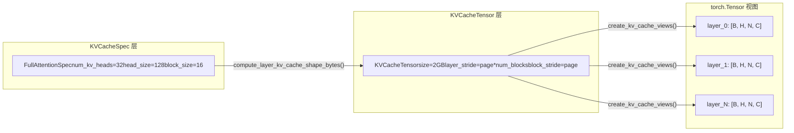

# Chapter 02: Core Abstractions & Data Structures: Request, Sequence & KV Cache

上一章我们建立了 vLLM v1 的分层心智模型，知道请求从 API Server 出发，穿过 EngineCore，最终抵达 Worker 执行。但一个 HTTP 请求体里的 JSON 字符串，是如何变成引擎内部可以调度、可以追踪、可以中断的对象的？这就是 Request 类要回答的问题。

Request 解决了「谁要计算」的问题，而 `KVCacheSpec` 解决的是「在哪里计算」的问题。在 PagedAttention 的世界里，每个模型层的 KV cache 都需要被精确地描述：它有多少个 head、每个 head 多大、一个 block 能存多少 token、是否需要量化。这些信息被编码在 `KVCacheSpec` 的继承体系中。

## Intuitive Architectural Model：KVCacheSpec 是显存的「户型图」

> **〔Design Inference & Architectural Trade-offs〕**
> 如果把 GPU 显存想象成一块待开发的土地，`KVCacheSpec` 就是每栋楼（每个 cache group）的户型图：它规定了每层楼（每个 block）有多少个房间（head slot）、每个房间多大（head_size）、能住多少人（block_size 个 token）。而 `KVCacheConfig` 则是整个小区的规划方案——总共多少栋楼、每栋楼占多少地、哪些楼共用同一个地基（block table）。

没有这套规格体系，KV cache 的分配就只能靠硬编码的假设，无法支持从标准 MHA 到 MLA、从全注意力到滑动窗口、从 FP16 到 FP8 量化的多样化模型需求。

## 数据结构：KVCacheSpec 的继承树与关键字段

`KVCacheSpec` 是所有规格的基类，它是一个 `@dataclass(frozen=True)` [FACT:vllm/v1/kv_cache_interface.py:150-152](https://github.com/vllm-project/vllm/blob/7ba3df63cbe2e3e7aca19074bed2958311f46400/vllm/v1/kv_cache_interface.py#L150-L152)。frozen 意味着规格对象一旦创建就不可变——这保证了多个组件（调度器、Worker、KV Cache Manager）看到的是同一份规格，不会因为某处修改而导致不一致。

基类定义了三个必须由子类实现的抽象属性：`num_heads`、`tokens_per_state`、`state_content_size_bytes` [FACT:vllm/v1/kv_cache_interface.py:182-183](https://github.com/vllm-project/vllm/blob/7ba3df63cbe2e3e7aca19074bed2958311f46400/vllm/v1/kv_cache_interface.py#L182-L183)。这三个属性共同决定了 `page_size_bytes`——即一个 block 占用的字节数。

`AttentionSpec` 是最核心的子类，它引入了 `num_kv_heads`、`head_size`、`dtype`、`kv_quant_mode` 等字段 [FACT:vllm/v1/kv_cache_interface.py:485-498](https://github.com/vllm-project/vllm/blob/7ba3df63cbe2e3e7aca19074bed2958311f46400/vllm/v1/kv_cache_interface.py#L485-L498)。其中 `tokens_per_state` 字段的设计尤为精妙：默认值为 1，表示一个 state 对应一个 token；但可以设为大于 1 的整数（如 DeepSeek-V4 的稀疏 MLA 将多个 token 压缩为一个 state），或小于 1 的分数（如 Whisper 的 block pooling 用 `Fraction(1, block_pool_size)` 表示一个 token 对应多个 state）[FACT:vllm/v1/kv_cache_interface.py:501-501](https://github.com/vllm-project/vllm/blob/7ba3df63cbe2e3e7aca19074bed2958311f46400/vllm/v1/kv_cache_interface.py#L501-L501)。

`FullAttentionSpec` 在 `AttentionSpec` 基础上增加了 `sliding_window` 和 `attention_chunk_size` [FACT:vllm/v1/kv_cache_interface.py:566-566](https://github.com/vllm-project/vllm/blob/7ba3df63cbe2e3e7aca19074bed2958311f46400/vllm/v1/kv_cache_interface.py#L566-L566)。注意它的文档字符串解释了一个重要的设计决策：当混合分配器被禁用时，滑动窗口注意力层在 KV Cache Manager 中被当作全注意力处理（为所有 token 分配 block），但在模型运行时仍按滑动窗口计算 [FACT:vllm/v1/kv_cache_interface.py:540-545](https://github.com/vllm-project/vllm/blob/7ba3df63cbe2e3e7aca19074bed2958311f46400/vllm/v1/kv_cache_interface.py#L540-L545)。这是一种**保守分配、精确计算**的策略。

`MLAAttentionSpec` 是 DeepSeek 系列模型的关键规格。它将 `head_size_v` 默认设为 0 [FACT:vllm/v1/kv_cache_interface.py:670](https://github.com/vllm-project/vllm/blob/7ba3df63cbe2e3e7aca19074bed2958311f46400/vllm/v1/kv_cache_interface.py#L670)，因为 MLA 只存储一个 latent vector，没有独立的 V。`alignment` 字段用于页对齐填充 [FACT:vllm/v1/kv_cache_interface.py:646-652](https://github.com/vllm-project/vllm/blob/7ba3df63cbe2e3e7aca19074bed2958311f46400/vllm/v1/kv_cache_interface.py#L646-L652)，这对 FlashMLA 等需要特定对齐的后端至关重要。

`MambaSpec` 则完全不走 attention 的路线。它用 `shapes` 和 `dtypes` 元组描述状态张量的形状 [FACT:vllm/v1/kv_cache_interface.py:1027-1028](https://github.com/vllm-project/vllm/blob/7ba3df63cbe2e3e7aca19074bed2958311f46400/vllm/v1/kv_cache_interface.py#L1027-L1028)，`state_content_size_bytes` 是所有状态张量大小的总和 [FACT:vllm/v1/kv_cache_interface.py:1048-1052](https://github.com/vllm-project/vllm/blob/7ba3df63cbe2e3e7aca19074bed2958311f46400/vllm/v1/kv_cache_interface.py#L1048-L1052)。Mamba 的 `max_memory_usage_bytes` 根据 `mamba_cache_mode` 有三种不同的计算方式 [FACT:vllm/v1/kv_cache_interface.py:1073-1084](https://github.com/vllm-project/vllm/blob/7ba3df63cbe2e3e7aca19074bed2958311f46400/vllm/v1/kv_cache_interface.py#L1073-L1084)，这反映了 Mamba 状态管理的复杂性——它不像 attention 那样线性增长，而是有固定的状态大小。

## 场景驱动：从规格到显存布局的转换

当引擎启动时，它需要将所有层的 `KVCacheSpec` 转换为实际的显存布局。这个过程由 `KVCacheTensor` 和 `create_kv_cache_views` 完成。

`KVCacheTensor` 描述了一组同形状层在 KV cache 分配中的位置 [FACT:vllm/v1/kv_cache_interface.py:1406-1427](https://github.com/vllm-project/vllm/blob/7ba3df63cbe2e3e7aca19074bed2958311f46400/vllm/v1/kv_cache_interface.py#L1406-L1427)。它的核心字段是 `layer_stride` 和 `block_stride`：前者是相邻层之间的字节距离，后者是相邻 block 之间的字节距离。文档字符串详细解释了两种布局模式：层外层布局（layer-outermost）给每层一个连续区域，块外层布局（block-outermost）让每个 block 包含所有层的 page [FACT:vllm/v1/kv_cache_interface.py:1416-1416](https://github.com/vllm-project/vllm/blob/7ba3df63cbe2e3e7aca19074bed2958311f46400/vllm/v1/kv_cache_interface.py#L1416-L1416)。

`create_kv_cache_views` 函数是这个过程的核心 [FACT:vllm/v1/kv_cache_interface.py:353-417](https://github.com/vllm-project/vllm/blob/7ba3df63cbe2e3e7aca19074bed2958311f46400/vllm/v1/kv_cache_interface.py#L353-L417)。它接收一个扁平的 int8 buffer，通过 `torch.as_strided` 为每一层创建一个 4D 视图 `[B, H, N, C]`。关键参数是 `strides`，它由 `compute_layout_strides` 计算得出 [FACT:vllm/v1/kv_cache_interface.py:314-350](https://github.com/vllm-project/vllm/blob/7ba3df63cbe2e3e7aca19074bed2958311f46400/vllm/v1/kv_cache_interface.py#L314-L350)。这个函数按照 `layout.stride_order` 指定的维度顺序，从最内层维度开始反向计算每个维度的字节步长。

这里有一个值得注意的边界检查：当 kernel_block_size 小于 spec.block_size 时（即一个 manager block 被拆分为多个 kernel block），代码会验证 block_stride 是否等于 dense_page_size [FACT:vllm/v1/kv_cache_interface.py:381-382](https://github.com/vllm-project/vllm/blob/7ba3df63cbe2e3e7aca19074bed2958311f46400/vllm/v1/kv_cache_interface.py#L381-L382)。如果不等于，说明布局中存在 padding，无法均匀拆分，此时会抛出带有明确修复建议的 ValueError。

## 设计思考：注册表模式与可扩展性

`KVCacheSpecRegistry` 是 vLLM 可扩展性的关键设计 [FACT:vllm/v1/kv_cache_spec_registry.py:39-40](https://github.com/vllm-project/vllm/blob/7ba3df63cbe2e3e7aca19074bed2958311f46400/vllm/v1/kv_cache_spec_registry.py#L39-L40)。它维护了两个全局字典：`_REGISTRY_KVCACHESPEC_LIST` 存储 spec 类到元数据的映射，`_REGISTRY_ROLE_MANAGERS` 存储角色到管理器的映射 [FACT:vllm/v1/kv_cache_spec_registry.py:35-36](https://github.com/vllm-project/vllm/blob/7ba3df63cbe2e3e7aca19074bed2958311f46400/vllm/v1/kv_cache_spec_registry.py#L35-L36)。

`get_manager_class` 方法展示了注册表的核心查找逻辑：它沿着 spec 类的 MRO（方法解析顺序）向上遍历，找到第一个已注册的基类 [FACT:vllm/v1/kv_cache_spec_registry.py:129-130](https://github.com/vllm-project/vllm/blob/7ba3df63cbe2e3e7aca19074bed2958311f46400/vllm/v1/kv_cache_spec_registry.py#L129-L130)。这意味着一个自定义的 `CustomFullAttentionSpec` 如果没有单独注册，会自动继承 `FullAttentionSpec` 的管理器。这种**基于继承的查找**使得新增 spec 类型时只需注册差异部分。

`check_kv_cache_spec_registry` 方法在启动时验证所有层的 spec 都已注册 [FACT:vllm/v1/kv_cache_spec_registry.py:165-174](https://github.com/vllm-project/vllm/blob/7ba3df63cbe2e3e7aca19074bed2958311f46400/vllm/v1/kv_cache_spec_registry.py#L165-L174)。注意它使用 `raise ValueError` 而非 `assert`，注释明确说明这是为了在生产环境中也生效 [FACT:vllm/v1/kv_cache_spec_registry.py:165-174](https://github.com/vllm-project/vllm/blob/7ba3df63cbe2e3e7aca19074bed2958311f46400/vllm/v1/kv_cache_spec_registry.py#L165-L174)。这是一个重要的工程决策：Python 的 `-O` 标志会移除 assert，但生产环境中的配置错误必须在启动时就暴露，而不是在运行时才崩溃。

> **〔Design Inference & Architectural Trade-offs〕**
> 注册表的延迟初始化设计（`_ensure_registered`）解决了一个循环依赖问题：`kv_cache_interface.py` 需要引用注册表来检查 spec 类型，而注册表需要导入 `single_type_kv_cache_manager` 来获取管理器类，后者又依赖 `kv_cache_interface`。通过将实际注册推迟到第一次查询时执行，打破了这个循环。

本章剖析了 vLLM v1 的两个核心数据结构。`Request` 是请求在引擎内部的生命周期载体，它通过双 token 列表、异步调度计数器和 block hash 机制，支撑了连续批处理和前缀缓存两大核心功能。`KVCacheSpec` 及其继承体系则定义了 KV cache 的显存布局规格，从标准的 `FullAttentionSpec` 到 `MLAAttentionSpec`、`MambaSpec`，覆盖了多样化的模型架构需求。注册表模式使得新增 spec 类型无需修改核心代码，保证了系统的可扩展性。

至此，我们已经看清了 Request 如何从 EngineCoreRequest 转换而来，以及它如何通过状态计数器、block hash 等机制支撑调度决策。但一个外部请求究竟如何穿越 API Server、chat template 与多模态处理，最终变成 EngineCoreRequest？下一章将进入请求入口层，完整追踪这条从 HTTP/CLI 到 EngineCore 的链路。