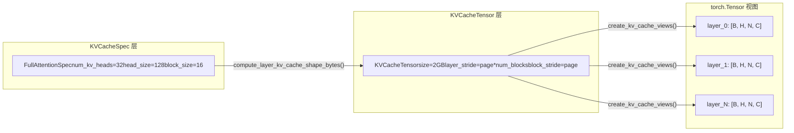

# Chapter 2: Core Abstractions: Request, Sequence, and KV Cache Data Structures

In the previous chapter, we established a layered mental model of vLLM v1, knowing that a request starts from the API Server, passes through EngineCore, and finally reaches the Worker for execution. But how does a JSON string in an HTTP request body become an object inside the engine that can be scheduled, tracked, and interrupted? This is the question the Request class must answer.

# The specification system of KV Cache: from KVCacheSpec to the registry

Request solves the problem of "who wants to compute," while`KVCacheSpec`solves the problem of "where to compute." In the world of PagedAttention, the KV cache of each model layer needs to be precisely described: how many heads it has, how large each head is, how many tokens a block can store, and whether quantization is needed. This information is encoded in`KVCacheSpec`'s inheritance system.

## Intuitive model: KVCacheSpec is the "floor plan" of GPU memory

> **[Design Inference & Architectural Trade-offs]**
> If GPU memory is imagined as a piece of land to be developed,`KVCacheSpec`is the floor plan of each building (each cache group): it specifies how many rooms (head slots) each floor (each block) has, how large each room is (head_size), and how many people it can accommodate (block_size tokens). And`KVCacheConfig`is the overall planning scheme for the entire community—how many buildings in total, how much land each building occupies, and which buildings share the same foundation (block table).

Without this specification system, KV cache allocation could only rely on hardcoded assumptions and could not support the diverse model requirements from standard MHA to MLA, from full attention to sliding window, and from FP16 to FP8 quantization.

## Data structure: the inheritance tree and key fields of KVCacheSpec

`KVCacheSpec`is the base class of all specs, and it is a`@dataclass(frozen=True)` [FACT:vllm/v1/kv_cache_interface.py:150-152]. frozen means that once a spec object is created, it is immutable—this ensures that multiple components (scheduler, Worker, KV Cache Manager) see the same spec and that inconsistency is not caused by modification somewhere.

The base class defines three abstract properties that must be implemented by subclasses:`num_heads`、`tokens_per_state`、`state_content_size_bytes` [FACT:vllm/v1/kv_cache_interface.py:182-183]. Together, these three properties determine`page_size_bytes`—that is, the number of bytes occupied by one block.

`AttentionSpec`is the most core subclass, and it introduces`num_kv_heads`、`head_size`、`dtype`、`kv_quant_mode`and other fields[FACT:vllm/v1/kv_cache_interface.py:485-498]. Among them, the`tokens_per_state`field is especially ingenious in design: the default value is 1, meaning one state corresponds to one token; but it can be set to an integer greater than 1 (such as DeepSeek-V4's sparse MLA compressing multiple tokens into one state), or to a fraction less than 1 (such as Whisper's block pooling using`Fraction(1, block_pool_size)`to indicate that one token corresponds to multiple states)[FACT:vllm/v1/kv_cache_interface.py:501-501]。

`FullAttentionSpec`On the basis of`AttentionSpec`,`sliding_window`and`attention_chunk_size` [FACT:vllm/v1/kv_cache_interface.py:566-566]are added. Note that its docstring explains an important design decision: when the hybrid allocator is disabled, sliding window attention layers are treated as full attention in the KV Cache Manager (allocating blocks for all tokens), but at model runtime they are still computed as sliding window[FACT:vllm/v1/kv_cache_interface.py:540-545]. This is a**conservative allocation, precise computation**strategy.

`MLAAttentionSpec`is a key spec for the DeepSeek series of models. It sets`head_size_v`to 0 by default[FACT:vllm/v1/kv_cache_interface.py:670], because MLA stores only one latent vector and has no independent V.`alignment`The field is used for page alignment padding[FACT:vllm/v1/kv_cache_interface.py:646-652], which is crucial for backends such as FlashMLA that require specific alignment.

`MambaSpec`does not follow the attention route at all. It uses`shapes`and`dtypes`tuples to describe the shape of the state tensor[FACT:vllm/v1/kv_cache_interface.py:1027-1028]，`state_content_size_bytes`is the sum of all state tensor sizes[FACT:vllm/v1/kv_cache_interface.py:1048-1052]. Mamba's`max_memory_usage_bytes`has three different calculation methods depending on`mamba_cache_mode`[FACT:vllm/v1/kv_cache_interface.py:1073-1084], which reflects the complexity of Mamba state management—it does not grow linearly like attention, but has a fixed state size.

## Scenario-driven: conversion from specs to memory layout

When the engine starts, it needs to convert the`KVCacheSpec`of all layers into the actual memory layout. This process is completed by`KVCacheTensor`and`create_kv_cache_views`.

`KVCacheTensor`describes the position of a group of same-shaped layers in KV cache allocation[FACT:vllm/v1/kv_cache_interface.py:1406-1427]. Its core fields are`layer_stride`and`block_stride`: the former is the byte distance between adjacent layers, and the latter is the byte distance between adjacent blocks. The docstring explains in detail two layout modes: layer-outermost layout gives each layer a contiguous region, and block-outermost layout makes each block contain the pages of all layers[FACT:vllm/v1/kv_cache_interface.py:1416-1416]。

`create_kv_cache_views`The function is the core of this process[FACT:vllm/v1/kv_cache_interface.py:353-417]. It receives a flat int8 buffer and, through`torch.as_strided`, creates a 4D view for each layer`[B, H, N, C]`. The key parameter is`strides`, which is calculated by`compute_layout_strides`[FACT:vllm/v1/kv_cache_interface.py:314-350]. This function follows the dimension order specified by`layout.stride_order`and computes the byte stride of each dimension in reverse starting from the innermost dimension.

There is a noteworthy boundary check here: when kernel_block_size is smaller than spec.block_size (that is, one manager block is split into multiple kernel blocks), the code verifies whether block_stride is equal to dense_page_size[FACT:vllm/v1/kv_cache_interface.py:381-382]. If not, it indicates that there is padding in the layout and it cannot be evenly split, and a ValueError with a clear fix suggestion is thrown.

## Design thinking: registry pattern and extensibility

`KVCacheSpecRegistry`is a key design for vLLM extensibility[FACT:vllm/v1/kv_cache_spec_registry.py:39-40]. It maintains two global dictionaries:`_REGISTRY_KVCACHESPEC_LIST`stores the mapping from spec classes to metadata,`_REGISTRY_ROLE_MANAGERS`stores the mapping from roles to managers[FACT:vllm/v1/kv_cache_spec_registry.py:35-36]。

`get_manager_class`The method demonstrates the core lookup logic of the registry: it traverses upward along the spec class's MRO (method resolution order) and finds the first registered base class[FACT:vllm/v1/kv_cache_spec_registry.py:129-130]. This means that a custom`CustomFullAttentionSpec`, if not registered separately, will automatically inherit the manager of`FullAttentionSpec`. This**inheritance-based lookup**makes it possible to register only the differing parts when adding a new spec type.

`check_kv_cache_spec_registry`The method verifies at startup that the specs of all layers are registered[FACT:vllm/v1/kv_cache_spec_registry.py:165-174]. Note that it uses`raise ValueError`instead of`assert`, and the comment explicitly states that this is to also take effect in production environments[FACT:vllm/v1/kv_cache_spec_registry.py:165-174]. This is an important engineering decision: Python's`-O`flag removes asserts, but configuration errors in production environments must be exposed at startup rather than crashing only at runtime.

> **[Design Inference & Architectural Trade-offs]**
> The registry's lazy initialization design (`_ensure_registered`) solves a circular dependency problem:`kv_cache_interface.py`needs to reference the registry to check spec types, while the registry needs to import`single_type_kv_cache_manager`to obtain the manager class, which in turn depends on`kv_cache_interface`. By deferring the actual registration until the first query, this cycle is broken.

# Chapter Summary

This chapter analyzed two core data structures of vLLM v1.`Request`is the lifecycle carrier of a request inside the engine. Through its dual token lists, asynchronous scheduling counters, and block hash mechanism, it supports the two core features of continuous batching and prefix caching.`KVCacheSpec`and its inheritance hierarchy define the memory layout specification for the KV cache, ranging from the standard`FullAttentionSpec`to`MLAAttentionSpec`、`MambaSpec`, covering diverse model architecture requirements. The registry pattern allows new spec types to be added without modifying core code, ensuring system extensibility.

At this point, we have seen how a Request is transformed from an EngineCoreRequest, and how it supports scheduling decisions through state counters, block hashes, and other mechanisms. But how exactly does an external request traverse the API Server, chat template, and multimodal processing to ultimately become an EngineCoreRequest? The next chapter will enter the request entry layer and fully trace this path from HTTP/CLI to EngineCore.
