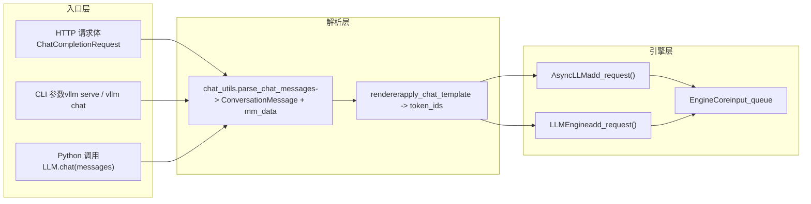

# Chapter 3: Request Entry: The Complete Path from HTTP/CLI to EngineCore

In the previous chapter, we analyzed the two core data structures inside the engine, Request and KVCacheSpec, and understood how logical sequences are decoupled from physical memory blocks. But how exactly does an HTTP request body or a Python string traverse the API Server, chat template, and multimodal processing to ultimately become an EngineCoreRequest? This chapter will fully trace this path and reveal how the three entry paths—synchronous CLI, asynchronous API, and offline LLM class—converge onto the same engine core.

# 3.1 The Convergence Point of Three Entry Paths: AsyncLLMEngine and LLMEngine

Before diving into request parsing, we must first understand the topology of the three entry paths. vLLM provides three usage modes:`vllm serve`the OpenAI-compatible HTTP service started by, the command-line`vllm`tool, and directly instantiating the`LLM`class in Python for offline inference. They appear independent but actually share the same engine core.

Let's first look at the alias mechanism of the asynchronous API path.

[FACT:vllm/engine/async_llm_engine.py:7-7]

This file is so short it barely looks like a module—it does only one thing: aliasing`AsyncLLMEngine`to point to`vllm.v1.engine.async_llm.AsyncLLM`. This is a typical trace of architectural migration. In the vLLM v0 era,`AsyncLLMEngine`was a large and complex class. After the v1 architecture rewrite, the new`AsyncLLM`took on the same responsibilities. To avoid breaking existing user code, vLLM retained the old module path as a compatibility layer.

> **[Design Inference & Architectural Trade-offs]**
> This pattern of "old path aliasing to new implementation" appears repeatedly in vLLM (such as`api_server.py`'s deprecation warning), indicating that the project adopted a gradual strategy in the v0 to v1 migration: new code uses new paths, old code does not error but receives warnings, giving users sufficient migration window.

Now let's look at the entry point of the offline path.

[FACT:vllm/entrypoints/llm.py:344-346]

`LLM.__init__`ultimately calls`LLMEngine.from_engine_args`, passing in`UsageContext.LLM_CLASS`. This`UsageContext`enum is the key to distinguishing entry paths—it lets the engine know whether it is running in offline batch mode or online serving mode, thereby adjusting logging, metrics, and resource management strategies.

[FACT:vllm/entrypoints/llm.py:357-359]

Note the assignment of`self.renderer = self.llm_engine.renderer`and`self.input_processor = self.llm_engine.input_processor`here. The offline`LLM`class does not implement chat template rendering itself, but reuses the engine's internal`renderer`. This means the chat template parsing logic is the same code on both offline and online paths, only the invocation timing differs.

The convergence relationship of the three paths can be represented by the following data flow diagram.

This diagram reveals a key design: regardless of whether the request comes from HTTP, CLI, or Python,`chat_utils`is the sole entry point for multimodal and chat template processing. It unifies heterogeneous input formats into a`ConversationMessage`list plus`MultiModalDataDict`, then hands them to the renderer to generate token sequences.

# 3.2 chat_utils: From Heterogeneous Messages to Unified Conversation Structure

`chat_utils.py`is the most complex module in the entire request entry layer. Its 2264 lines of code handle OpenAI-compatible formats, custom extensions, multimodal embeddings, tool calls, and all other input forms. Its core responsibility can be summarized in one sentence: normalize any message list passed by the user into a`ConversationMessage`list that the chat template can understand, while extracting multimodal data into a separate`MultiModalDataDict`.

## Intuitive Model: Translator and Baggage Sorter

Think of`chat_utils`as an airport translator and baggage sorter. Passengers (users) come from different countries (OpenAI format, custom format, Harmony format), speaking different languages. The translator first translates everyone's words into a unified working language (`ConversationMessage`), while sorting the passenger's checked baggage (images, audio, video) onto independent conveyor belts (`MultiModalDataDict`), attaching tags (UUID), and finally loading both the person and the baggage onto the same airplane (engine).

Without this layer, the engine would have to understand the details of every input format, the extraction logic for multimodal data would be scattered across various entry points, and adding any new format would require modifying the engine core.

## Data structures: dual-class collaboration between trackers and parsers

`chat_utils`The core of  is the collaboration between two groups of classes:`BaseMultiModalItemTracker`and its subclasses are responsible for "tracking" multimodal items,`BaseMultiModalContentParser`and its subclasses are responsible for "parsing" content parts.

First, let's look at the field layout of the tracker.

[FACT:vllm/entrypoints/chat_utils.py:598-601]

`_items_by_modality`is a`defaultdict[str, list[_T]]`, storing pending items grouped by modality (image, audio, video, etc.).`_modality_order`specifically records, for the`vision_chunk`modality, the original modality of each chunk (image or video), because the unified vision chunk model maps both to`vision_chunk`, but subsequent processing needs to know the original type.

[FACT:vllm/entrypoints/chat_utils.py:613-615]

`use_unified_vision_chunk_modality`is a`cached_property`, reading the`use_unified_vision_chunk`flag from the HuggingFace configuration. Using`cached_property`instead of a regular attribute is because this check is triggered on every`add`call, and caching avoids repeated`getattr`overhead.

The tracker's`add`method is the core entry point.

[FACT:vllm/entrypoints/chat_utils.py:656-684]

`add`The  method first calls`_validate_add`for validation, then stores items under different keys depending on whether the unified vision chunk modality is used. Note the special handling of`prompt_embeds`: it directly appends to`_items_by_modality["prompt_embeds"]`and returns`None`, because precomputed embeddings do not go through the HF processor and have no placeholder string.

`_validate_add`The validation logic in  is worth a closer look.

[FACT:vllm/entrypoints/chat_utils.py:686-721]

There is a subtle branch here: when`enable_mm_embeds=True`and the per-prompt limit for that modality is 0 and the original modality ends with`_embeds`, skip the count validation. This is to allow embedding inputs to bypass the count limit of the original modality—embeddings are precomputed and do not consume the processing resources of the original modality.

## Scenario-driven: how a chat request with an image is parsed

Suppose the user sends a chat request containing an image URL and text.`parse_chat_messages`is the entry point for the synchronous path.

[FACT:vllm/entrypoints/chat_utils.py:2161-2197]

`parse_chat_messages`creates`MultiModalItemTracker`, iterates over each message and calls`_parse_chat_message_content`, and finally calls`_postprocess_messages`to process tool call parameters, then materializes multimodal data through`mm_tracker.resolve_items()`.

`_parse_chat_message_content`is responsible for parsing a single message.

[FACT:vllm/entrypoints/chat_utils.py:2007-2029]

It first normalizes content:`None`becomes an empty list, and a string becomes a single text part. Then it calls`_parse_chat_message_content_parts`, where the`wrap_dicts`parameter is determined by`content_format == "openai"`—this determines whether the output is a list of structured dictionaries or a concatenated string.

`_parse_chat_message_content_parts`iterates over each part.

[FACT:vllm/entrypoints/chat_utils.py:1814-1853]

Each part is processed by`_parse_chat_message_content_part`. If`wrap_dicts=False`, it ultimately concatenates text and placeholders into a single string; if`wrap_dicts=True`, it returns a list of structured dictionaries.

`_parse_chat_message_content_part`is the core of dispatch.

[FACT:vllm/entrypoints/chat_utils.py:1875-1884]

For pure text parts, it first performs a placeholder-preservation check, then decides the return format based on`wrap_dicts`. For structured parts, it calls`_parse_chat_message_content_mm_part`to extract the type and content.

[FACT:vllm/entrypoints/chat_utils.py:1690-1723]

`_parse_chat_message_content_mm_part`looks up the corresponding parsing function through`MM_PARSER_MAP`. Note the condition of`uuid is None`—if the user provides a UUID, it means the media data may not be in the request body (it has been uploaded through other means), so it goes to the direct URL field branch below.

[FACT:vllm/entrypoints/chat_utils.py:1731-1733]

When`part_type is None`or`uuid is not None`, the code tries to directly extract the URL field from the part. This "lenient parsing" is to be compatible with clients that do not strictly follow the OpenAI format.

Returning to`_parse_chat_message_content_part`, parts of media types are dispatched to the corresponding`mm_parser`methods.

[FACT:vllm/entrypoints/chat_utils.py:1923-1968]

Each media type calls the corresponding`parse_*`method, and these methods internally call`tracker.add`to add the item to the tracker and return a placeholder string. Finally, based on`interleave_strings`, it decides whether to return the placeholder or`None`。

[FACT:vllm/entrypoints/chat_utils.py:1984-1999]

`prompt_embeds`is handled specially: regardless of`interleave_strings`, it returns`PROMPT_EMBEDS_PLACEHOLDER_TOKEN`. The comment explains the reason—prompt_embeds are concatenated at token offsets, and position matters; if it went through`missing_placeholders`'s pre-padding logic, the order would be disrupted.

## Differences in the asynchronous path

The asynchronous path uses`AsyncMultiModalItemTracker`and`AsyncMultiModalContentParser`. The core difference is in`resolve_items`。

[FACT:vllm/entrypoints/chat_utils.py:906-952]

The asynchronous version uses`asyncio.gather`to concurrently await all modality items. The comment explicitly points out: each tracked item is already an independent awaitable, and the asynchronous connector offloads blocking decoding work to a thread pool, so serially awaiting one modality and then the next would unnecessarily increase latency.`return_exceptions=True`lets all tasks complete or fail before throwing uniformly, avoiding giving up on network requests still in progress just because the first one fails.

## Design reflection: why trackers and parsers are separated

> **[Design Inference & Architectural Trade-offs]**
> The separation of tracker and parser is a design worth pondering. The tracker is responsible for "state management"—recording how many items each modality has, validating count limits, and maintaining the original modality order of vision_chunk. The parser is responsible for "content extraction"—fetching images from URLs, decoding embeddings from base64, and handling audio format conversion. This separation allows the synchronous and asynchronous paths to share tracking logic (`BaseMultiModalItemTracker`is an abstract base class), diverging only at the parser layer. If merged into a single class, the differences between synchronous and asynchronous would permeate the tracking logic, leading to code duplication and more complex state management.

# 3.3 From messages to tokens: the handoff between renderer and EngineCore

`chat_utils`The`ConversationMessage`list and`MultiModalDataDict`produced by  still need to go through chat template rendering before they can become token sequences. This step is completed by the renderer, after which the request truly enters the engine.

## Scenario-driven: chat template rendering and request submission

`parse_chat_messages`After returning, the caller (such as`OpenAIServingChat`) will pass`conversation`and`mm_data`to the renderer. The renderer applies the chat template, renders the`ConversationMessage`list into text, and then tokenizes it into a token ID sequence. Multimodal placeholders (such as`<##IMAGE##>`) are replaced with model-specific placeholder tokens after tokenization.

After rendering is complete, the request is encapsulated as`EngineCoreRequest`and delivered to EngineCore's input queue via`AsyncLLM.add_request()`or`LLMEngine.add_request()`.

[FACT:vllm/entrypoints/llm.py:420-484]

Offline`LLM.generate`The method demonstrates this chain: it first validates`runner_type`, obtains default sampling parameters, then calls`_run_completion`。`_run_completion`Internally, it calls the renderer to render the prompt, then delivers the request via`llm_engine`.

[FACT:vllm/entrypoints/llm.py:615-708]

`LLM.chat`The method demonstrates the chat path: it receives the`messages`list, calls`_run_chat`, which internally calls`parse_chat_messages`and the renderer.

## Design consideration: Why is the renderer inside the engine

> **[Design Inference & Architectural Trade-offs]**
> `LLM.__init__`In`self.renderer = self.llm_engine.renderer`This line reveals an important design decision: the renderer belongs to the engine rather than the entry layer. This means that chat template loading, caching, and warmup (`self.renderer.warmup(ChatParams(...))`) are all completed during engine initialization, and the entry layer is merely the caller. The benefit of this approach is that offline`LLM`and online`AsyncLLM`share the same renderer implementation and cache, avoiding repeated loading of the tokenizer and chat template. At the same time, renderer warmup can be completed at engine startup, avoiding cold-start latency for the first request.

## Error recovery and production pitfalls

`_postprocess_messages`The tool call parameter handling in

[FACT:vllm/entrypoints/chat_utils.py:2118-2158]

is a typical production environment trap.`tool_calls`When an assistant message contains`arguments`, the field may be a JSON string, a dictionary, or invalid JSON. The code attempts to parse the JSON string; if it fails, it logs a warning and forcibly converts it to an empty object. The comment explains the reason: malformed`arguments`exists in the conversation history, and if the request is failed here, every subsequent turn will fail, and the conversation will be unable to recover. This is a deliberate fault-tolerance design—better to let the model see empty tool parameters than to let the entire conversation get stuck.

Another trap is injection protection for reserved placeholders.

[FACT:vllm/entrypoints/chat_utils.py:1856-1872]

When`enable_prompt_embeds`is enabled,`PROMPT_EMBEDS_PLACEHOLDER_TOKEN`is registered as an indivisible special token. If the user text happens to contain this literal sequence, the tokenizer will encode it as the same token ID, and the renderer will mistakenly think this is a splice point, allowing the caller to move or inject the splice position through plain text content.`_reject_reserved_placeholder_in_text`rejects this kind of input during text part parsing, closing this security hole.

[FACT:vllm/entrypoints/chat_utils.py:1889-1892]

Note that this check is called in both the`isinstance(part, str)`branch and the structured text branch, ensuring that all text paths are protected.

# Chapter summary

This chapter traced the first segment of the path by which a request enters the system from the outside. The three entry paths—HTTP API, CLI, and offline`LLM`class—all ultimately converge on`chat_utils`'s multimodal parsing layer.`BaseMultiModalItemTracker`is responsible for state management,`BaseMultiModalContentParser`is responsible for content extraction, and the separation of the two allows the synchronous and asynchronous paths to share tracing logic.`parse_chat_messages`normalizes heterogeneous messages into a`ConversationMessage`list and`MultiModalDataDict`, then hands them to the engine-internal renderer to complete chat template rendering and tokenization. Finally, the request is encapsulated as`EngineCoreRequest`and delivered to EngineCore's input queue.

# Chapter review and self-test

Q1: In`_parse_chat_message_content_mm_part`, if`uuid is None`this condition is removed (that is, changed to`if isinstance(part_type, str) and part_type in MM_PARSER_MAP:`), in what scenarios would this cause problems?

**Reference analysis**：`uuid is None`The condition exists to handle the scenario where "the user provides a UUID but the media data is not in the request body." When the user provides a UUID, the media data may already have been uploaded by other means (such as being pre-uploaded to the media cache). In this case, the part in the request body may contain only the UUID and not the actual URL or data. If this condition is removed, the code will try to parse via`MM_PARSER_MAP[part_type](part)`, but the part may not have the corresponding data field (such as`image_url`being empty), resulting in parsed`None`content. More seriously, the subsequent`parse_image(None, uuid)`will call`_connector.fetch_image(None)`, which may trigger unnecessary network requests or exceptions.`uuid is not None`The branch instead takes the direct field extraction path, correctly handling the "UUID present but no data" case. See[FACT:vllm/entrypoints/chat_utils.py:1713-1723]and[FACT:vllm/entrypoints/chat_utils.py:1731-1733]。

Q2: `AsyncMultiModalItemTracker.resolve_items`uses`asyncio.gather(..., return_exceptions=True)`instead of the default`return_exceptions=False`. If changed to`False`, in what concurrency scenario would this cause a resource leak?

**Reference analysis**：`return_exceptions=False`When`asyncio.gather`returns immediately when the first exception is thrown, but other tasks still in progress will not be canceled—they will continue running in the background. These tasks may hold network connections, thread pool work items, or file handles. If these tasks eventually fail, the exceptions will be silently discarded (because gather has already returned), causing resource leaks and errors that are difficult to troubleshoot.`return_exceptions=True`Let all tasks either complete or fail before performing a unified check, ensuring no task is abandoned. The comment explicitly states this: "Gathering with return_exceptions=True lets every task finish (or itself fail) before we raise, instead of abandoning still-in-flight fetches (real network/thread-pool work) the moment the first one fails." See[FACT:vllm/entrypoints/chat_utils.py:924-931]。

Q3: `_postprocess_messages`In, when`arguments`is invalid JSON, the code chooses to force it to an empty object rather than throw an exception. If changed to throw an exception, in what production scenarios would it lead to an unrecoverable conversation state?

**Reference Analysis**：`arguments`The field exists in the conversation history (the assistant message's`tool_calls`). If in a certain round of conversation the model generates a malformed`arguments`, this error will be saved in the conversation history. If`_postprocess_messages`throws an exception when parsing the history, then every subsequent round of requests will fail because of this error in the history—even if the current round's input is completely correct. The user will be unable to continue this conversation and can only abandon the entire session and start over. Forcing it to an empty object allows the conversation to continue, and after the model sees the empty tool arguments, it will regenerate the correct call. The comment explains this: "A malformed arguments string lives in conversation history, so failing the request here would fail every subsequent turn too and leave the conversation unrecoverable." See[FACT:vllm/entrypoints/chat_utils.py:2124-2139]。

The next chapter will enter the scheduler to see how EngineCore orchestrates these requests using continuous batching and memory-aware strategies.

At this point, the request has completed the normalized transformation from external input to EngineCoreRequest and has reached the entrance of the engine core. But after the request enters, it is not executed immediately—the engine needs to decide which requests to process at each step and how to allocate limited GPU memory resources. The next chapter will delve into EngineCore's scheduling loop, analyzing how the Scheduler balances throughput and latency in continuous batching, and how chunked prefill, prefix caching, and KV block allocation work together.
