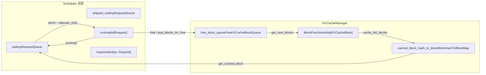
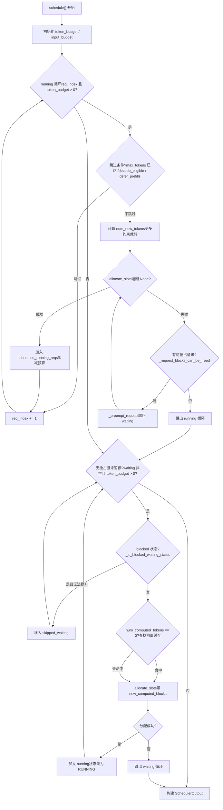

# Chapter 4: Scheduler: Continuous Batching and Memory-Aware Request Orchestration

After requests enter EngineCore's input queue, they are not executed immediately. Which requests to process at each step, how many token budgets to allocate to each request, and who to sacrifice first when GPU memory is insufficient—these decisions are all concentrated in the`Scheduler.schedule()`method. This chapter starts from the scheduler's data structures and traces how a single`schedule()`call organizes the waiting queue, running list, and KV cache pool into an executable batch.

# 4.1 Scheduler Data Structures: Three Queues and One Memory Pool

The core question the scheduler must answer is:**Under limited token budget and KV block budget, which requests should advance by how many tokens at this step?**To understand it, we must first see clearly what state it holds.

The scheduler maintains three types of request containers.`self.requests`is a global dictionary,`req_id -> Request`, the single source of truth for all active requests[FACT:vllm/v1/core/sched/scheduler.py:208-209]。`self.waiting`and`self.skipped_waiting`are two priority queues; the former holds requests normally waiting to be scheduled, while the latter holds requests that temporarily cannot be scheduled due to asynchronous dependencies or constraints (such as waiting for remote KV or waiting for structured output grammar compilation)[FACT:vllm/v1/core/sched/scheduler.py:208-209]。`self.running`is an ordinary list, storing requests that have already entered the running state and hold KV blocks[FACT:vllm/v1/core/sched/scheduler.py:208-209]。

There is a design here that is easy to overlook:`max_num_running_reqs`and`max_num_active_reqs`are two different upper limits. The former comes from`max_num_seqs`, determining the number of slots for the model runner; the latter comes from`max_num_active_seqs`, only limiting the number of requests that can enter RUNNING, and by default equal to the former[FACT:vllm/v1/core/sched/scheduler.py:123-131]. This separation allows reducing the actual concurrent decode batch size without shrinking CUDA graph capture capacity.

The memory side is uniformly managed by`KVCacheManager`, which internally holds`BlockPool`。`BlockPool`The core of is`self.blocks`(a list of all`KVCacheBlock`) and`free_block_queue`(a doubly linked list of free blocks arranged in eviction order)[FACT:vllm/v1/core/block_pool.py:171-177]. Note the existence of`null_block`: it is the first block popped from the head of the free queue,`is_null=True`, reference counting does not participate in regular maintenance, and it is specifically used as a placeholder[FACT:vllm/v1/core/block_pool.py:183-187]. When a certain token position of a request does not need a real KV block (for example, a position skipped by the sliding window), this null block is filled into the block table.

The index structure for prefix caching is`BlockHashToBlockMap`, which maps`BlockHashWithGroupId`to a`KVCacheBlock`or a`{block_id: KVCacheBlock}`dictionary[FACT:vllm/v1/core/block_pool.py:56-59]. Why use a union type? The comment gives the answer: most hashes correspond to only one block, and using a dictionary would cause unnecessary GC overhead; only when the same hash is shared by multiple blocks does it upgrade to a dictionary[FACT:vllm/v1/core/block_pool.py:56-59]. This is a typical trade-off of type complexity for runtime overhead.

`KVCacheBlocks`is the interface object between the scheduler and the KV cache manager, hiding the internal data structures. Its`blocks`field is`tuple[Sequence[KVCacheBlock], ...]`, the outer dimension is the KV cache group, and the inner dimension is the block sequence[FACT:vllm/v1/core/kv_cache_manager.py:41-54]. The comment explicitly explains why blocks are not used as the outer dimension: that would assume all groups have the same number of blocks, whereas in the future different groups may be configured with different block sizes[FACT:vllm/v1/core/kv_cache_manager.py:43-48]。



This diagram anchors the data flow between the scheduler and the memory pool: requests in the waiting queue enter running through`allocate_slots`, running requests return to waiting when preempted, freed blocks return to the free queue, and the prefix caching hash table is the entry point for waiting requests to hit the cache.

# 4.2 schedule() main flow: running first, waiting supplement, preemption as fallback

`schedule()`is the core method of the entire scheduler, and it returns a`SchedulerOutput`, describing what to execute in this step. The comment at the beginning of the method points out the design philosophy: there is no distinction between the "decode phase" and the "prefill phase" in the scheduler; each request only has`num_computed_tokens`and`num_tokens_with_spec`, and the scheduler's task is to let the former catch up with the latter[FACT:vllm/v1/core/sched/scheduler.py:559-568]. This unified perspective is the foundation for chunked prefill, prefix caching, and speculative decoding to coexist.

## 4.2.1 Budget initialization and threshold calculation

Before entering the main loop, the scheduler first sets two budgets:`token_budget`initialized to`max_num_scheduled_tokens`，`input_budget`initialized to`max_num_batched_tokens` [FACT:vllm/v1/core/sched/scheduler.py:577-580]. The two are usually equal, but when the model may append tokens within a batch (such as speculative decoding),`max_num_scheduled_tokens`will be less than`max_num_batched_tokens`, and the difference is the space reserved for draft tokens.

`long_prefill_token_threshold`The handling of is worth looking at separately. Its purpose is to prevent a long prefill from starving other requests, but if there is only one request currently, no one will be starved, so the threshold is set to zero[FACT:vllm/v1/core/sched/scheduler.py:606-616]. When`adaptive_long_prefill_threshold`is enabled, the threshold is also raised to`input_budget // num_eligible_reqs`, ensuring that a single request's budget is not squeezed below its fair share[FACT:vllm/v1/core/sched/scheduler.py:617-622]。

## 4.2.2 Scheduling loop for running requests

The main loop traverses from the head of`self.running`,`req_index`is the cursor[FACT:vllm/v1/core/sched/scheduler.py:624-627]. For each request, a series of skip checks are performed first:

- Under asynchronous scheduling, if the request's output placeholder indicates that it has reached`max_tokens`, skip to avoid running an extra step[FACT:vllm/v1/core/sched/scheduler.py:631-645]。
- In the V2 + PP + asynchronous scenario, if the current step has not yet reached`next_decode_eligible_step`, skip to match the sampling token broadcast rhythm on the worker side[FACT:vllm/v1/core/sched/scheduler.py:647-651]。
- When DP prefill balancing is enabled, prefill chunks on non-rhythm-aligned steps are postponed[FACT:vllm/v1/core/sched/scheduler.py:653-657]。

After passing the skip checks, calculate how many tokens this request can advance in this step:

```
num_new_tokens = request.num_tokens_with_spec
               + request.num_output_placeholders
               - request.num_computed_tokens
```

Then it is constrained in turn by`long_prefill_token_threshold`、`token_budget`、`input_budget - draft_slots`and`max_model_len`. If the request carries encoder input, it also needs to be adjusted by[FACT:vllm/v1/core/sched/scheduler.py:670-688]`_try_schedule_encoder_inputs`Next is the most critical step: allocating KV blocks.[FACT:vllm/v1/core/sched/scheduler.py:700-712]。

is wrapped in a`allocate_slots`loop`while True`. If it returns[FACT:vllm/v1/core/sched/scheduler.py:742-747], it means there is not enough memory, and the scheduler begins preemption: select a victim according to the policy (the PRIORITY policy selects the lowest-priority one, and the FCFS policy selects the one at the end of the running list)`None`, call[FACT:vllm/v1/core/sched/scheduler.py:761-767]to kick it back to the waiting queue, and then retry allocation`_preempt_request`. If the victim is the current request itself, it means there is no object left to preempt, so break out of the loop, and the current request cannot be scheduled either[FACT:vllm/v1/core/sched/scheduler.py:801-806]There is a subtle detail in the preemption logic: under the PRIORITY policy, if the preempted request is already in[FACT:vllm/v1/core/sched/scheduler.py:807-813]。

(that is, resources have already been allocated for it in this step), its token budget, blocks, speculative tokens, and encoder budget all need to be returned`scheduled_running_reqs`. This ensures the consistency of the budget ledger.[FACT:vllm/v1/core/sched/scheduler.py:779-797]After successful allocation, the request is added to

, recording the block and token counts, and deducting the budget`scheduled_running_reqs`. Tokens related to speculative decoding are trimmed and recorded here[FACT:vllm/v1/core/sched/scheduler.py:815-823]4.2.3 Admission of waiting requests[FACT:vllm/v1/core/sched/scheduler.py:825-841]。

## After the running loop ends, if no preemption occurred in this step and the scheduler is not paused, start processing the waiting queue

. Before admission, check two upper limits first:[FACT:vllm/v1/core/sched/scheduler.py:868-872]and`max_num_active_reqs`Scheduling waiting requests has one more prefix cache lookup step than running requests. When`input_budget` [FACT:vllm/v1/core/sched/scheduler.py:873-879]。

, call`request.num_computed_tokens == 0`to look up local cache hits`_get_local_prefix_cache_hit`. If a KV connector is configured, remote cache hits are also queried[FACT:vllm/v1/core/sched/scheduler.py:932-939]Here there is a delicate logic for handling conflicts between local and remote hits. A local hit may not be block-aligned ([FACT:vllm/v1/core/sched/scheduler.py:942-954]。

), and if the remote hit strictly exceeds the local complete hit, discard the local sub-block tail and let the remote load overwrite it, avoiding copy-on-write`partial_tail`. Otherwise, keep the local tail and do not load external[FACT:vllm/v1/core/sched/scheduler.py:977-988]After successful admission, the request is popped from the waiting queue, its state is set to RUNNING, and it is added to the running list[FACT:vllm/v1/core/sched/scheduler.py:989-995]。

. If it is still in prefill after this step ([FACT:vllm/v1/core/sched/scheduler.py:1263-1319]), add it to the`num_computed_tokens + num_new_tokens < request.num_tokens`set`_inflight_prefills`Copy[FACT:vllm/v1/core/sched/scheduler.py:1326-1328]。



's two major loops and the preemption branch. Note the preemption retry path after`schedule()`fails in the running loop, and the blocked-state requests in the waiting loop being moved into`allocate_slots` 失败后的抢占重试路径，以及 waiting 循环中 blocked 状态请求被移入 `skipped_waiting`bypass.

# 4.3 The Core of Memory Awareness: allocate_slots and Preemption

`allocate_slots`is the gate between the scheduler and GPU memory. Its parameter list is itself a memory ledger:`num_new_tokens`is the number of tokens to be newly computed,`num_new_computed_tokens`is the number of tokens newly hit in the prefix cache,`num_external_computed_tokens`is the number of external hits provided by the connector,`num_lookahead_tokens`is the slots reserved for speculative decoding.[FACT:vllm/v1/core/kv_cache_manager.py:371-383]。

The comment at the beginning of the method precisely describes the block layout with an ASCII diagram.[FACT:vllm/v1/core/kv_cache_manager.py:417-438]：

```
|  |  |   |   |  |
                                          |        |
                        |                       |
```

`comp`is already-computed tokens,`new_comp`is prefix cache hits,`ext_comp`is external hits,`new`is newly computed in this step,`lookahead`is speculative reservation. Allocation is divided into three stages: first release unneeded blocks and check whether there are enough free blocks, then process prefix tokens, and finally allocate blocks for newly computed tokens.[FACT:vllm/v1/core/kv_cache_manager.py:458-461]。

## 4.3.1 Watermark and Admission Control

`allocate_slots`There are two admission gates in .`full_sequence_must_fit`: when enabled, it first checks whether the entire request sequence (not just the first chunk) can fit, and if not, directly returns`None` [FACT:vllm/v1/core/kv_cache_manager.py:515-531]. This prevents excessive admission under chunked prefill from causing KV cache thrashing.

The second is the watermark.`watermark_blocks`It only takes effect when the request state is WAITING or PREEMPTED and some request has already been scheduled.[FACT:vllm/v1/core/kv_cache_manager.py:506-513]It requires that at least a certain proportion of free blocks be retained after allocation, avoiding frequent eviction and preemption.`reserved_blocks`It is used for asynchronous KV loading scenarios to ensure that the reserved blocks for in-flight prefill are not consumed by new requests.[FACT:vllm/v1/core/kv_cache_manager.py:564-570]。

## 4.3.2 The Cost and Recovery of Preemption

> **[Design Inference & Architectural Trade-offs]**
> `_preempt_request`does something that seems brute-force but is necessary: it resets the request's`num_computed_tokens`to 0.[FACT:vllm/v1/core/sched/scheduler.py:1560-1561]. This means that a preempted request must re-prefill from scratch the next time it is scheduled. Why is it designed this way? Because vLLM's KV blocks are private to each request, all blocks must be released upon preemption, and after release there is no guarantee that the same blocks can be obtained upon reallocation, so it can only recompute from scratch. The existence of the prefix cache partially offsets this cost: if the prefix of the preempted request has already been cached, it can hit the cache when rescheduled, and does not need to be truly recomputed.

Preemption also handles the "stale output" problem under asynchronous scheduling.`num_stale_output_tokens`is set to`num_in_flight_tokens`, marking all in-flight outputs as stale.[FACT:vllm/v1/core/sched/scheduler.py:1571-1574]. These tokens will still be delivered (discarding them would perturb the speculative decoding acceptance rate), but they will not modify the reset counters.`drop_stale_output`The flag determines whether to discard or deliver.[FACT:vllm/v1/core/sched/scheduler.py:1539-1547]。

## 4.3.3 Delayed Release: The Read-After-Write Risk of Asynchronous Connectors

When a KV connector is used and there are multiple in-flight batches,`defer_block_free`is set to`True` [FACT:vllm/v1/core/sched/scheduler.py:175-181]. The reason is that a step may still be writing the KV blocks of an already released request, while a consumer connector may reallocate and fill those blocks through a load that is not ordered with that write.

Delayed release is implemented through`deferred_frees`a double-ended queue, where each entry is`(fence_seq, blocks)` [FACT:vllm/v1/core/sched/scheduler.py:388-390]。`_free_request_blocks`checks`_request_blocks_can_be_freed`. If the request's last scheduling step has not yet been processed, the blocks are placed into the delayed queue.[FACT:vllm/v1/core/sched/scheduler.py:2679-2688]。`_drain_deferred_frees`is advanced in`update_from_output`and then called to release blocks whose fence has been satisfied.`processed_step_seq`4.4 Prefix Cache Hit Determination and Block Lifecycle[FACT:vllm/v1/core/sched/scheduler.py:2701-2706]。

# The lookup entry point for the prefix cache is

. It first checks whether the cache is enabled and whether the request is marked to skip reading.`KVCacheManager.get_computed_blocks`. Then it calls[FACT:vllm/v1/core/kv_cache_manager.py:286-287], passing in`coordinator.find_longest_cache_hit`and`request.block_hashes`Why`max_cache_hit_length = request.num_tokens - 1` [FACT:vllm/v1/core/kv_cache_manager.py:295-300]。

? The comment explains: when all tokens hit the cache, the last token must still be recomputed to obtain logits.`num_tokens - 1`. This is an easily overlooked boundary: even if the prefix is fully hit, at least one token must still be computed.[FACT:vllm/v1/core/kv_cache_manager.py:289-294]The lifecycle of a block is managed by

.`BlockPool`pops a block from the head of the free queue. If caching is enabled, it first calls`get_new_blocks`to clear its hash metadata, and then increments the reference count.`_maybe_evict_cached_block`Then, depending on whether the block has a hash, it is placed back at the head or tail of the queue: blocks without a hash are reused LIFO (better GPU locality), and blocks with a hash are reused FIFO (LRU eviction behavior).[FACT:vllm/v1/core/block_pool.py:683-702]。`free_blocks`is the moment when a block is written into the prefix cache hash table. It traverses newly full blocks, skips null blocks and masked blocks, computes a hash for each block, and inserts it into[FACT:vllm/v1/core/block_pool.py:785-805]。

`cache_full_blocks`. If a block already has a hash (the scenario where a partial block is upgraded to a full block), first remove the old hash and then insert the new hash.`cached_block_hash_to_block` [FACT:vllm/v1/core/block_pool.py:272-300]The method handles reference counting on cache hits: if the block is in the free queue ([FACT:vllm/v1/core/block_pool.py:285-293]。

`touch`), first remove it from the queue, and then increment the reference count.`ref_cnt == 0`. This ensures that a hit block will not be evicted.[FACT:vllm/v1/core/block_pool.py:754-770]Design Considerations

# [Design Inference and Architectural Trade-offs]

> **[Design Inference & Architectural Trade-offs]**
> **Partial retention requires recording the physical location of each request's blocks at preemption time, and attempting to restore the mapping upon rescheduling. But the block pool is globally shared, and other requests may already have occupied those blocks. The complexity and memory overhead of maintaining such a mapping exceed the cost of recomputation, especially when the prefix cache can hit most of the prefix.**[Design Inference and Architectural Trade-offs]

> **[Design Inference & Architectural Trade-offs]**
> **The watermark is a safeguard against frequent preemption, but it comes at the cost of sacrificing memory utilization. Disabling it by default means vLLM prioritizes throughput over stability, and users need to enable it themselves according to workload characteristics.**[Design Inference and Architectural Trade-offs]

> **[Design Inference & Architectural Trade-offs]**
> **`skipped_waiting` 队列的存在意义。**Without this queue, blocked requests would remain at the head of the waiting queue, preventing subsequent requests from being scheduled (under FCFS policy). By separating it out, the scheduler can skip blocked requests and continue processing those behind them, while preserving the state of blocked requests for later promotion.

# Chapter Summary

The core of the scheduler is the`schedule()`two loops in the method: the running loop prioritizes advancing already-running requests, while the waiting loop admits new requests when budget allows. When VRAM is insufficient, space is freed by preempting the lowest-priority request in the running list. The preempted request's`num_computed_tokens`is reset to 0, but prefix caching can offset part of the recomputation cost.`allocate_slots`is the VRAM gate, through`full_sequence_must_fit`, watermark, and`reserved_blocks`three-tier admission control to prevent over-allocation. Prefix caching enables cross-request sharing through block hash indexing, with hit determination capped at`num_tokens - 1`to ensure at least one token is computed to obtain logits.

# Chapter Review and Self-Test

Q1: In`schedule()`'s running loop, if`allocate_slots`returns`None`and`_request_blocks_can_be_freed`returns`False`for the victim, the code will`break`break out of the loop. If this check is removed and`_preempt_request`is called directly, in what scenario would this cause state inconsistency?

**Reference Analysis**：`_request_blocks_can_be_freed`checks`request.last_sched_seq <= self.processed_step_seq` [FACT:vllm/v1/core/sched/scheduler.py:2672-2677]. When`defer_block_free`is enabled, if the victim's last scheduling step has not yet been processed, its blocks may still be written by in-flight GPU steps. Direct preemption would call`_free_request_blocks`, and the latter, when`_request_blocks_can_be_freed`is`False`, would place the blocks into`deferred_frees`rather than immediately freeing[FACT:vllm/v1/core/sched/scheduler.py:2679-2688]. But the semantics of preemption is "immediately free blocks for the current request," and delayed freeing cannot satisfy this requirement, so`allocate_slots`would fail again, forming an infinite loop. More seriously, if the victim's blocks are delayed-freed and then allocated to the current request while the GPU is still writing to the victim's blocks, a data race would occur.

Q2: `get_computed_blocks`in`max_cache_hit_length = request.num_tokens - 1`. If changed to`request.num_tokens`, under what circumstances would this cause incorrect output?

**Reference Analysis**: When all tokens of a request hit the cache,`num_computed_tokens`would equal`num_tokens`. At this point the scheduler considers that no new tokens need to be computed, but sampling logits requires the hidden state of the last position, and the hidden state comes from the forward pass. If no token is computed, there are no logits to sample from, and the request would stall or produce incorrect output. The comment explicitly states this[FACT:vllm/v1/core/kv_cache_manager.py:289-294]. Additionally,`allocate_slots`requires`num_computed_tokens`to be block-size aligned; recomputing the last token may trigger recomputation of the entire block, which is a known limitation of the current implementation.

Q3: `_preempt_request`resets`num_computed_tokens`to 0, but preserves`request.num_tokens`(prompt + generated tokens). If a preempted request is rescheduled and the prefix cache misses, how many tokens does it need to recompute? If it hits, how much can be saved?

**Reference Analysis**：`num_computed_tokens = 0`means that upon rescheduling, it starts from the first token[FACT:vllm/v1/core/sched/scheduler.py:1561]。`request.num_tokens`remains unchanged, containing the original prompt and generated output tokens. If the prefix cache misses, all`num_tokens`tokens need to be recomputed via prefill. If it hits,`get_computed_blocks`returns the hit blocks, and`num_computed_tokens`starts from the hit position[FACT:vllm/v1/core/kv_cache_manager.py:296-300]. Note that the preempted request's output tokens are also in`num_tokens`, and their prefix hashes were cached at generation time (if enabled), so upon rescheduling, the prefixes of these output tokens may also hit. But`max_cache_hit_length = num_tokens - 1`means the last token must always be recomputed.

The scheduler's output`SchedulerOutput`clarifies the execution content of this step: block IDs for new requests, number of cached tokens for cached requests, speculative tokens, encoder inputs, etc. The next chapter will trace how this output is consumed by the ModelRunner, from`SchedulerOutput`all the way to the GPU forward pass.
