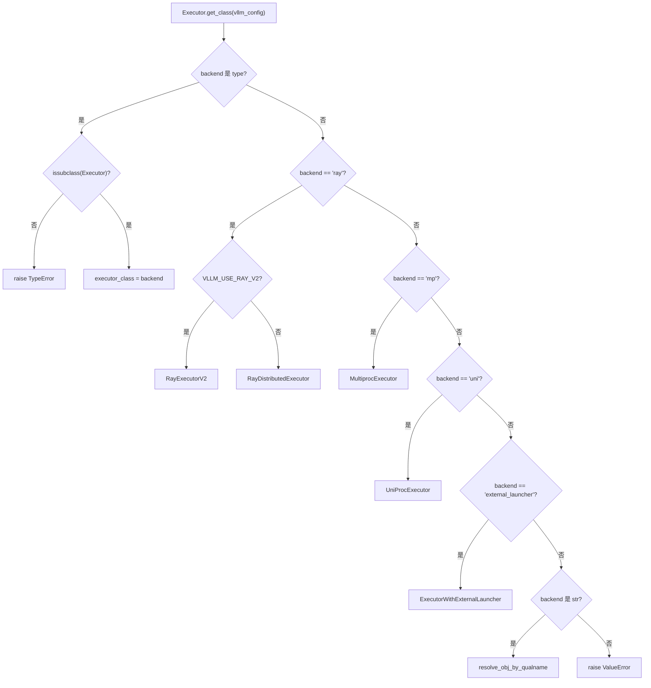
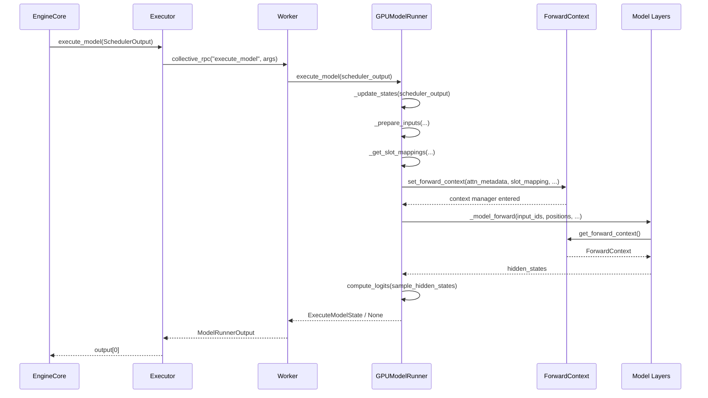

# Chapter 5: Model Execution Backbone: From SchedulerOutput to GPU Forward Pass

In the previous chapter, we saw how the Scheduler, in each step's scheduling loop, determines which requests enter the running queue, which are preempted, and which wait due to insufficient VRAM, ultimately producing a SchedulerOutput—which describes what to compute in this step: which requests, how many tokens each, and which KV blocks to use. But this list is only a logical intent; the GPU needs physical tensors. This chapter traces how SchedulerOutput is distributed by the Executor to Workers, then translated by GPUModelRunner into GPU-executable inputs such as input_ids, positions, slot_mapping, and block table, and finally injects the cross-layer shared batch description into each model layer through forward_context, completing the leap from scheduling decisions to forward propagation.

# 5.1 Executor: Delivering Scheduling Results to Every Card

## Intuitive Model

`Executor`is the "herald" between EngineCore and GPU Workers. Without it, EngineCore would have to know by itself how many cards are in the cluster, which process each card is in, and how to`SchedulerOutput`Serializing the past—scheduling logic would become entangled with the distributed topology.`Executor`Extract this responsibility: EngineCore only needs to call`execute_model(scheduler_output)`, and the rest—"whom to send to, how to send, how many results to collect"—is decided by the Executor.

## Class hierarchy and fields

`Executor`is an abstract base class whose class-level fields directly encode backend capabilities[FACT:vllm/v1/executor/abstract.py:48-49]：

```python
uses_ray: bool = False  # whether the executor uses Ray for orchestration.
supports_pp: bool = False  # whether the executor supports PP
```

These two flags are not decorative—upper-layer code reads them to decide whether to enable certain optimization paths.`__init__`In , the following are initialized:`sleeping_tags`、`kv_output_aggregator`、`ec_output_aggregator`three state fields[FACT:vllm/v1/executor/abstract.py:119-120], used respectively for sleep-mode tag tracking, KV connector output aggregation, and encoder connector output aggregation.

## Backend selection:`get_class`branch routing in

`get_class`is a static factory that returns the concrete Executor class based on the`distributed_executor_backend`configuration[FACT:vllm/v1/executor/abstract.py:51-96]. Its branching structure is worth examining closely:

- If the configuration itself is a`type`, validate whether it is a`Executor`subclass and then use it directly[FACT:vllm/v1/executor/abstract.py:52-61]；
- `"ray"`Under the branch there are further secondary branches:`VLLM_USE_RAY_V2_EXECUTOR_BACKEND`when true, use`RayExecutorV2`, otherwise use`RayDistributedExecutor` [FACT:vllm/v1/executor/abstract.py:64-72]；
- `"mp"`maps to`MultiprocExecutor`，`"uni"`maps to`UniProcExecutor` [FACT:vllm/v1/executor/abstract.py:73-80]；
- Custom backends in string form are dynamically resolved through`resolve_obj_by_qualname`[FACT:vllm/v1/executor/abstract.py:85-90]。



## Step-by-Step: the call flow of one`execute_model`

Set the scenario: EngineCore completes one scheduling step and obtains`SchedulerOutput`, then calls`executor.execute_model(scheduler_output)`。

`Executor.execute_model`The implementation is extremely minimal[FACT:vllm/v1/executor/abstract.py:237-238]：

```python
def execute_model(
    self, scheduler_output: SchedulerOutput, non_block: bool = False
) -> ModelRunnerOutput | None | Future[ModelRunnerOutput | None]:
    output = self.collective_rpc(
        "execute_model", args=(scheduler_output,), non_block=non_block
    )
    return output[0]
```

> **[Design Inference & Architectural Trade-offs]**
> The key lies in`collective_rpc`—it broadcasts the method name and arguments to all Workers, collects each Worker's list of return values, and then`output[0]`takes only the first one. Why only the first? Because under tensor parallelism, all Workers execute the same logical forward pass, and the outputs are semantically equivalent; the sampling result is determined by the last PP stage or rank 0, so taking`output[0]`avoids duplicate aggregation.`collective_rpc`The documentation for explicitly recommends "pass only control messages; establish data-plane communication separately"[FACT:vllm/v1/executor/abstract.py:220-221], and this is exactly`SchedulerOutput`'s role—it is a control message, while the actual token data flows inside the Workers through GPU tensors.

`sample_tokens`follows the same pattern[FACT:vllm/v1/executor/abstract.py:257-258], but the return type does not include`None`—sampling necessarily produces a result. The division of labor between these two methods corresponds to vLLM v1's "execution-sampling separation" design:`execute_model`may return`None`(indicating that the forward pass has been submitted but sampling is deferred), in which case the state is temporarily stored in`ExecuteModelState`.

## Design considerations

`collective_rpc`is declared as`@abstractmethod` [FACT:vllm/v1/executor/abstract.py:186-192], meaning different backends must implement "how to send the RPC to the Worker" themselves.`MultiprocExecutor`uses shared-memory queues,`RayDistributedExecutor`uses Ray actor calls, and`UniProcExecutor`directly calls locally. This abstraction means upper-layer code does not need to care about distributed details at all.

An easily overlooked detail:`supported_tasks`is marked as`@cached_property` [FACT:vllm/v1/executor/abstract.py:306-309], and the comment explicitly says "avoid unnecessary RPC calls." Because`get_supported_tasks`requires cross-process communication, while the task list does not change during the model lifecycle, caching is a correct and necessary optimization.

# 5.2 GPUModelRunner: from SchedulerOutput to input tensors

## Intuitive model

`GPUModelRunner`is a "translator": it translates the logical description in`SchedulerOutput`(request ID, token count, block ID) into physical tensors that the GPU can directly consume. Without it, the model layer would have to handle questions like "which KV slot contains the 7th token of the 3rd request"—a disastrous leak of concerns.

## Core state and memory layout

`GPUModelRunner`inherits from three Mixins[FACT:vllm/v1/worker/gpu_model_runner.py:479-480]：`LoRAModelRunnerMixin`、`KVConnectorModelRunnerMixin`、`ECConnectorModelRunnerMixin`, which respectively provide LoRA adaptation, KV connector, and encoder connector capabilities.

`__init__`caches all configuration objects[FACT:vllm/v1/worker/gpu_model_runner.py:488-498], and initializes several key flags:

- `check_ep_fault`: only when data parallelism > 1 and the model is MoE, query whether the EP all2all manager supports fault tolerance[FACT:vllm/v1/worker/gpu_model_runner.py:507-509]；
- `is_pooling_model`: determined by`runner_type == "pooling"`[FACT:vllm/v1/worker/gpu_model_runner.py:515]；
- `enable_prompt_embeds`: whether prompt embedding input is enabled[FACT:vllm/v1/worker/gpu_model_runner.py:516]。

`ExecuteModelState`is a`NamedTuple`, carrying the temporary state between`execute_model()`and`sample_tokens()`. Its field design reveals the essence of execution-sampling separation:[FACT:vllm/v1/worker/gpu_model_runner.py:463-476]is the forward-pass product,`logits`、`hidden_states`、`sample_hidden_states`is the metadata still needed during the sampling stage. The comment explicitly says this is "temporary cached state passed after execute_model() returns None"`spec_decode_metadata`、`slot_mappings`How to synchronize cached state[FACT:vllm/v1/worker/gpu_model_runner.py:464-464]。

## Step-by-Step：`_update_states`Set the scenario: the scheduler decides that this step processes request A (new request), B (continuation of the previous decode step), and C (resumed after preemption), while request D has already completed.

Step 1: clean up completed requests.

**iterates over**, pops the state from the`finished_req_ids`dictionary, and removes`self.requests`from`input_batch`. Note the edge case pointed out by the comment:[FACT:vllm/v1/worker/gpu_model_runner.py:1202-1217]and`finished_req_ids`may overlap—when a request is aborted and then resubmitted with the same ID, they are treated as two different requests`scheduled_req_ids`Step 2: zero out newly allocated KV blocks.[FACT:vllm/v1/worker/gpu_model_runner.py:1211-1215]。

**If**is non-empty, call`new_block_ids_to_zero`to zero the GPU memory, preventing stale NaNs from contaminating attention or SSM computation`_zero_block_ids`. This is the safety prerequisite for PagedAttention block reuse.[FACT:vllm/v1/worker/gpu_model_runner.py:1219-1222]Step 3: compute the set of unscheduled requests.

**This is the most error-prone step**Copy[FACT:vllm/v1/worker/gpu_model_runner.py:1238-1247]：

```python
scheduled_req_ids = scheduler_output.num_scheduled_tokens.keys()
cached_req_ids = self.input_batch.req_id_to_index.keys()
resumed_req_ids = scheduler_output.scheduled_cached_reqs.resumed_req_ids
unscheduled_req_ids = cached_req_ids - (scheduled_req_ids - resumed_req_ids)
```

rather than directly`scheduled_req_ids - resumed_req_ids`: usually`scheduled_req_ids`and`cached_req_ids`are disjoint, but in forced preemption scenarios triggered by`resumed_req_ids`, resumed requests need to be removed from the persistent batch first and then re-added`reset_prefix_cache`Step 4: handle new requests.[FACT:vllm/v1/worker/gpu_model_runner.py:1241-1246]。

**For each**, construct`scheduled_new_reqs`. If the sampling type is`CachedRequestState` [FACT:vllm/v1/worker/gpu_model_runner.py:1295-1308], create a seeded`RANDOM_SEED`. If the model uses M-RoPE, call`torch.Generator` [FACT:vllm/v1/worker/gpu_model_runner.py:1277-1284]to precompute positions`_init_mrope_positions`Step 5: update running requests.[FACT:vllm/v1/worker/gpu_model_runner.py:1319-1321]。

**For each**, update`scheduled_cached_reqs`, handling block ID appends or replacements`num_computed_tokens` [FACT:vllm/v1/worker/gpu_model_runner.py:1402]. If the request is not in the persistent batch ([FACT:vllm/v1/worker/gpu_model_runner.py:1437-1448]), add it to`req_index is None`Step 6: compaction and reordering.`reqs_to_add` [FACT:vllm/v1/worker/gpu_model_runner.py:1450-1465]。

**第六步：压缩与重排。** `condense()`Fill the holes left by removal requests[FACT:vllm/v1/worker/gpu_model_runner.py:1511-1512]，`_may_reorder_batch`Let the attention backend rearrange on demand[FACT:vllm/v1/worker/gpu_model_runner.py:1513-1514]，`refresh_metadata()`Refresh batch metadata[FACT:vllm/v1/worker/gpu_model_runner.py:1515-1516]。

## Input tensor preparation:`_prepare_input_ids`asynchronous fast path

`_prepare_input_ids`handles a subtle issue: under asynchronous scheduling, the sampled token from the previous step is still on the GPU, and this step's`input_ids`needs to fill them in[FACT:vllm/v1/worker/gpu_model_runner.py:1767-1772]。

Normal path (`prev_sampled_token_ids is None`) directly copies CPU tensors to GPU[FACT:vllm/v1/worker/gpu_model_runner.py:1788-1794]. The asynchronous path iterates over requests, computing the index of each request's last token in the flattened`input_ids`.[FACT:vllm/v1/worker/gpu_model_runner.py:1809-1836]The comment gives a concrete example:`cu_num_tokens = [2, 5, 8]`、`draft_tokens = [1, 2, 2]`when`sample_flattened_indices = [0, 2, 5]`，`spec_flattened_indices = [1, 3, 4, 6, 7]` [FACT:vllm/v1/worker/gpu_model_runner.py:1820-1822]。

there is a key optimization[FACT:vllm/v1/worker/gpu_model_runner.py:1859-1868]：

```python
if common_indices_match and max_flattened_index == (num_common_tokens - 1):
    self.input_ids.gpu[:num_common_tokens].copy_(
        self.input_batch.prev_sampled_token_ids[:num_common_tokens, 0],
        non_blocking=True,
    )
    return
```

When the batch is unchanged and there is no rearrangement, the indices are`0..N-1`the same permutation, so a single slice copy can be used directly, avoiding scatter overhead. This is a direct manifestation of the persistent batch optimization.

## `slot_mapping`and block table

`_get_slot_mappings`returns two formats[FACT:vllm/v1/worker/gpu_model_runner.py:4078-4078]: indexed by KV cache group`dict[int, torch.Tensor]`for attention metadata use, and indexed by layer name`dict[str, torch.Tensor]`for`ForwardContext`use. For encoder-only KV cache groups, slot mapping is an all-zero tensor[FACT:vllm/v1/worker/gpu_model_runner.py:4096-4115]; otherwise slice from`block_table.slot_mapping.gpu`.[FACT:vllm/v1/worker/gpu_model_runner.py:4107-4109]Unused tail padding`-1`, the comment explains this is`reshape_and_cache`required in full CUDA graph mode[FACT:vllm/v1/worker/gpu_model_runner.py:4118-4122]。

`_get_block_table`obtains device tensors for each KV cache group[FACT:vllm/v1/worker/gpu_model_runner.py:2319-2335], and uses`NULL_BLOCK_ID`to fill CUDAGraph padding rows—block 0 is reserved for padding[FACT:vllm/v1/worker/gpu_model_runner.py:2332-2334]。

# 5.3 forward_context: batch description shared across layers

## Intuitive model

`forward_context`is a "unified notice board" posted at the front of the classroom: every model layer can look up and see the seating arrangement (attention metadata) and rules (slot mapping) for this exam, without having to ask individually. Without it, every attention layer would have to receive this information from parameters—and the model layer's`forward`signature is fixed, so parameters cannot be passed separately for each layer.

## Data structure

`ForwardContext`is a`@dataclass` [FACT:vllm/forward_context.py:141-202], core fields:

- `no_compile_layers`: copied from`static_forward_context`, marks layers that do not participate in compilation[FACT:vllm/forward_context.py:132-137]；
- `attn_metadata`: mapping from layer name to attention metadata; in DBO mode it is a list of length 2 (one per microbatch)[FACT:vllm/forward_context.py:144-152]；
- `slot_mapping`: mapping from layer name to slot mapping tensor[FACT:vllm/forward_context.py:145]；
- `cudagraph_runtime_mode`: runtime CUDA graph mode, default`NONE` [FACT:vllm/forward_context.py:155-157]；
- `batch_descriptor`: batch descriptor, used for CUDA graph dispatch[FACT:vllm/forward_context.py:158]；
- `is_padding`: boolean mask on the token axis,`True`indicates padding rows[FACT:vllm/forward_context.py:162-165]。

`BatchDescriptor`is another`@dataclass(frozen=True)` [FACT:vllm/forward_context.py:30-57], and the field design follows the "minimize description items" principle:`num_tokens`、`num_reqs`(can be None in PIECEWISE mode),`uniform`(all requests have the same number of tokens),`has_lora`、`num_active_loras`. The comment explains`num_active_loras`the reason for its existence: when`cudagraph_specialize_lora_count`is enabled, each LoRA count value captures an independent CUDA graph, because the grid size of kernels such as`fused_moe_lora`depends on this value[FACT:vllm/forward_context.py:60-64]。

## Global singleton and context management

`_forward_context`is a module-level global variable[FACT:vllm/forward_context.py:199-201], through`override_forward_context`the context manager saves the old value on entry and restores it on exit[FACT:vllm/forward_context.py:263-274]。`set_forward_context`is a higher-level wrapper[FACT:vllm/forward_context.py:277-394], which additionally handles DP metadata construction, automatic batch descriptor creation, and platform-specific kwargs injection.

## Step-by-Step: from`execute_model`to model forward

Scenario:`GPUModelRunner.execute_model`all input tensors are ready, and the model is about to be called.

In`execute_model`,`set_forward_context`is called[FACT:vllm/v1/worker/gpu_model_runner.py:4408-4420]：

```python
with (
    set_forward_context(
        attn_metadata,
        self.vllm_config,
        num_tokens=num_tokens_padded,
        num_tokens_across_dp=num_tokens_across_dp,
        cudagraph_runtime_mode=cudagraph_mode,
        batch_descriptor=batch_desc,
        ubatch_slices=ubatch_slices_padded,
        slot_mapping=slot_mappings,
        skip_compiled=has_encoder_input,
        is_padding=is_padding,
    ),
    ...
):
    model_output = self._model_forward(...)
```

`set_forward_context`internally first constructs`DPMetadata`(if DP or sequence-parallel MoE is enabled)[FACT:vllm/forward_context.py:299-328], then calls`create_forward_context`to construct`ForwardContext`instance[FACT:vllm/forward_context.py:347-358], and finally sets the global variable through`override_forward_context`[FACT:vllm/forward_context.py:361-362]。

Model layers read`get_forward_context()`through[FACT:vllm/forward_context.py:208-214]. If not set, the assertion fails and prompts to use`set_forward_context`。



## Design considerations

> **[Design Inference & Architectural Trade-offs]**
> Why use a global variable instead of explicit parameter passing? Because the model layer's`forward`signature is fixed by the HuggingFace convention, and additional parameters cannot be injected for each layer. A global variable + context manager is the only solution that can achieve cross-layer injection without modifying model code. The cost is implicit dependency—`get_forward_context()`the caller must ensure it is within the scope of`set_forward_context`.

`is_padding`The design of the[FACT:vllm/forward_context.py:162-165]field is noteworthy: the comment says "consumers can use it to skip work on padding tokens." This is an optimization in the CUDA graph scenario—padding rows participate in graph capture but should not produce actual computation.

`all_moe_layers`and`moe_layer_index`are a clever pair of workarounds[FACT:vllm/forward_context.py:170-195]. The comment explains the problem in detail:`vllm.moe_forward`custom operators hardcode the layer name string into the graph, causing torch.compile cold start time to be too long. The solution is to store the layer name list in`ForwardContext`, and the custom operator pops strings in order and increments a counter. The comment also admits that this relies on the assumption that "custom operators execute in order and torch.compile will not reorder"[FACT:vllm/forward_context.py:182-184]。

# Design considerations and production pitfalls

**State consistency under asynchronous scheduling.** `_update_states`Under asynchronous speculative decoding,`output_token_ids`adopts an "optimistic assumption" strategy: assume all draft tokens from the previous step are accepted, first expand[FACT:vllm/v1/worker/gpu_model_runner.py:1376-1384], then register a deferred correction function[FACT:vllm/v1/worker/gpu_model_runner.py:1509-1510]. The correction function is called after the model forward starts`num_computed_tokens` [FACT:vllm/v1/worker/gpu_model_runner.py:1547-1558], reads the actual accepted count from the GPU, and rolls back

**`_may_reorder_batch`. The brilliance of this design is that the correction happens after "the batch has started," without blocking the forward pass, preserving the continuity of the asynchronous pipeline.**Trigger condition for`kv_cache_groups`. This method first checks[FACT:vllm/v1/worker/gpu_model_runner.py:1131-1132]whether`is_attention_free`The Mamba model is also attention-free, but it uses a KV cache to store internal state[FACT:vllm/v1/worker/gpu_model_runner.py:1116-1139]. Only models that truly have no KV cache group skip the reordering.

**`_prepare_input_ids`indexing calculation pitfalls.**When the batch contains both decode requests from the previous step and new requests,`num_common_tokens < total_without_spec`, you need to first copy the CPU tensor before scattering[FACT:vllm/v1/worker/gpu_model_runner.py:1849-1854]. If`num_common_tokens == 0`, it means no request overlaps with the previous step, so return directly[FACT:vllm/v1/worker/gpu_model_runner.py:1855-1858]. Distinguishing these two branches is critical—missing either one will cause`input_ids`some parts to remain uninitialized.

**`AsyncGPUModelRunnerOutput`stream synchronization.**The output copy is performed on a separate CUDA stream[FACT:vllm/v1/worker/gpu_model_runner.py:308-328], using`blocking=True`'s Event to avoid busy-polling the CUDA driver lock[FACT:vllm/v1/worker/gpu_model_runner.py:296-298]。`get_output()`, first synchronize then release the device tensor reference[FACT:vllm/v1/worker/gpu_model_runner.py:336-340], the order cannot be reversed—otherwise the tensor may be reclaimed before the copy completes.

# Chapter Summary

This chapter traced`SchedulerOutput`'s complete path from EngineCore to GPU forward pass.`Executor`Through`collective_rpc`, the scheduling results are broadcast to all Workers,`GPUModelRunner`'s`_update_states`synchronizes cache state,`_prepare_inputs`constructs input tensors,`_get_slot_mappings`generates KV slot mappings, and finally`set_forward_context`injects the batch description into the global context for consumption by each model layer. The asynchronous scheduling path maintains pipeline continuity through optimistic assumptions + deferred correction, while`ForwardContext`'s global singleton design resolves the contradiction between fixed model-layer signatures and cross-layer metadata injection.

# Chapter Review Questions

Q1: `_update_states`In`unscheduled_req_ids = cached_req_ids - (scheduled_req_ids - resumed_req_ids)`the expression`resumed_req_ids`, if`cached_req_ids - scheduled_req_ids`is removed from the subtraction, becoming

**, in what scenario would this cause state inconsistency?**Reference Analysis[FACT:vllm/v1/worker/gpu_model_runner.py:1241-1246]，`cached_req_ids`: The comment explicitly states that`resumed_req_ids`and`reset_prefix_cache`are usually disjoint, but in forced preemption scenarios triggered by`cached_req_ids`, a request may appear in both`resumed_req_ids`and`scheduled_req_ids - resumed_req_ids`. In this case,`unscheduled_req_ids`will exclude this request from the "scheduled" set, causing it to fall into`resumed_req_ids`, thereby first being removed from the persistent batch, then re-added through the normal resumed path. If`req_state.block_ids = new_block_ids` [FACT:vllm/v1/worker/gpu_model_runner.py:1448]is removed, the request would be considered "scheduled" and retained in the batch, but its block ID has already been replaced (

Q2: `_prepare_input_ids`), causing the old row in the block table to mismatch the new block ID, and the attention computation would read the wrong KV positions.[FACT:vllm/v1/worker/gpu_model_runner.py:1859-1868]'s fast path`common_indices_match and max_flattened_index == (num_common_tokens - 1)`uses`common_indices_match`as the condition. If the request order in the batch changes (e.g., the attention backend reorders the batch), but

**is still True, what happens?**：`common_indices_match`Reference Analysis`prev_index == flattened_index`In the loop, through[FACT:vllm/v1/worker/gpu_model_runner.py:1835]。`prev_index`accumulates`prev_positions`from`flattened_index`, mapping the current batch position to the previous step's batch position;`prev_index`is the flat index of the last token of that request in the current batch. If the batch is reordered,`flattened_index`and`common_indices_match`'s correspondence changes,`prev_index == flattened_index`will become False, and the fast path will not trigger. But if the reordering happens to make`prev_sampled_token_ids[:num_common_tokens, 0]`hold for all requests (e.g., swapping two requests with the same token count), the fast path will incorrectly use`max_flattened_index == num_common_tokens - 1`for direct slice copying—this would fill request A's sampled token into request B's position.`0..N-1`This additional condition is precisely to prevent this degenerate case: it requires the flat indices to be exactly a permutation of

Q3: `ForwardContext`, excluding any non-trivial reordering.`_forward_context`uses a module-level global variable`execute_model`rather than a thread-local variable. Under asynchronous scheduling where`sample_tokens`and`sample_tokens`are separated, if`get_forward_context()`is called before the forward pass completes,

**what will be returned? What problem would this cause?**：`set_forward_context`Reference Analysis[FACT:vllm/forward_context.py:278-288]is a context manager`with`, which on exit of the`override_forward_context`block restores the old value through`finally`'s[FACT:vllm/forward_context.py:263-274]. In`execute_model`,`set_forward_context`'s`with`block only wraps the`_model_forward`call[FACT:vllm/v1/worker/gpu_model_runner.py:4408-4433], and the context is restored after the forward pass returns. If`sample_tokens`is called after the forward pass completes,`get_forward_context()`will fail an assertion[FACT:vllm/forward_context.py:208-214], because`_forward_context`has already been reset to`None`(or the outer value). This is exactly why`ExecuteModelState`exists[FACT:vllm/v1/worker/gpu_model_runner.py:463-476]: the state needed for sampling (`logits`、`hidden_states`、`slot_mappings`) is explicitly stored in a NamedTuple, rather than relying on`ForwardContext`'s implicit passing. If one mistakenly assumes that`ForwardContext`is still available in`sample_tokens`, it would trigger an assertion error or read incorrect metadata.

At this point, we have completed the full path from SchedulerOutput to GPU forward propagation: Executor dispatch, Worker execution, GPUModelRunner translating the logical manifest into physical tensors, and injecting the batch description into each layer through forward_context. However, the most time-consuming part of model forward propagation—the attention computation—has not yet been unfolded. The next chapter will dive into the attention backend, examining how the block table and slot mapping in attn_metadata are consumed by the PagedAttention kernel, and how different backends such as FlashAttention, FlashInfer, and Triton are selected and scheduled through a unified interface.
