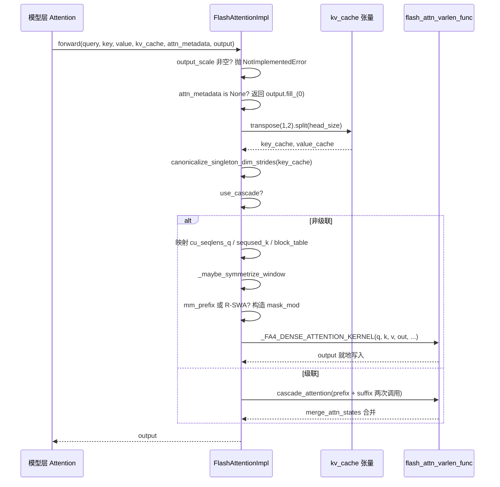

# Chapter 6: Attention Backend and PagedAttention Kernel Implementation

In the previous chapter, we saw how GPUModelRunner translates scheduling results into physical tensors such as input_ids, slot_mapping, and block_table, and injects them into each layer through forward_context. But the real heavyweight that consumes GPU time—attention computation—is still up in the air. Who exactly consumes those tensors in attn_metadata? Why can implementations like FlashAttention, FlashInfer, and Triton be swapped under the same set of model code? The answer lies in the AttentionBackend abstraction layer. It decouples "how attention is computed" from "how the model calls it": the model layer only holds an AttentionImpl reference and calls the unified forward(query, key, value, kv_cache, attn_metadata, output); the specific backend is responsible for translating block_table, slot_mapping, seq_lens into parameters that its own kernel can consume. This chapter uses FlashAttentionBackend as the main thread because it simultaneously covers the richest branches, including PagedAttention's gather semantics, CUDA Graph compatibility, cascade attention, and DCP distributed context. Once you understand it thoroughly, other backends are just variants of parameter mapping. The design motivation for this "backend registration + unified interface" is straightforward: attention kernels evolve extremely quickly (FA2→FA3→FA4, FlashInfer iterations, in-house Triton), and if the model layer directly depended on a specific kernel, every kernel upgrade would require changing the model code. The abstraction layer isolates change behind a single factory method, get_impl_cls().

# Backend Selection: Capability Declaration and Metadata Construction

## Intuitive Model

Think of`AttentionBackend`as a job posting: it does not do the work itself, it only declares "which dtypes, which head_sizes, which KV cache quantization formats, and which attention types I can handle." The scheduler takes the model configuration and matches it; if matching fails, it moves on to the next candidate. Without this layer of declaration, the system would only discover at runtime that "this head_size is not supported by the kernel" and crash immediately.

## Capability Matrix: Fields Are Contracts

`FlashAttentionBackend`The class attributes of are its capability boundary.`supported_dtypes`restricts fp16/bf16[FACT:vllm/v1/attention/backends/flash_attn.py:287-287]；`supported_kv_cache_dtypes`additionally allows the fp8 family[FACT:vllm/v1/attention/backends/flash_attn.py:298-299]. But "declaring support" does not equal "unconditional support"—`supports_kv_cache_dtype`for quantized KV, it further delegates to`flash_attn_supports_kv_cache_dtype`to make device-related judgments[FACT:vllm/v1/attention/backends/flash_attn.py:431-438]。

Even more fine-grained is`supports_combination`: it receives a whole set of combined parameters such as head_size, dtype, block_size, use_mla, has_sink, and returns`None`to indicate availability, or returns a string to indicate the reason for rejection[FACT:vllm/v1/attention/backends/flash_attn.py:454-507]. For example, sink is rejected on compute capability < 9.0[FACT:vllm/v1/attention/backends/flash_attn.py:467-468], and on SM90, FP8 KV with mm_prefix must go through Triton[FACT:vllm/v1/attention/backends/flash_attn.py:472-472]. This "return a reason string" design allows upper layers to produce diagnosable errors rather than silently falling back.

The choice of block_size is likewise capability-driven. By default it returns`MultipleOf(16)`, but SM90 FP8-KV forces 64[FACT:vllm/v1/attention/backends/flash_attn.py:297-324], and FA4's head_size=256 kernel forces`FA4_HD256_PAGE_SIZE` [FACT:vllm/v1/attention/backends/flash_attn.py:326-352]. This explains why the KV cache block size is not arbitrary—it is inversely constrained by the kernel's TMA tile size.

## Metadata Structure: Field Layout of FlashAttentionMetadata

`FlashAttentionMetadata`is a dataclass, and its fields fall into four groups[FACT:vllm/v1/attention/backends/flash_attn.py:511-566]：

The first group is the basic batch description:`num_actual_tokens`(the real number of tokens after removing padding),`max_query_len`、`query_start_loc`(prefix sums, used by varlen kernels to locate the start and end of each sequence),`seq_lens`、`block_table`、`slot_mapping` [FACT:vllm/v1/attention/backends/flash_attn.py:520-526]. Note the ASCII diagram in the source comments[FACT:vllm/v1/attention/backends/flash_attn.py:512-518], which precisely distinguishes`context_len`(historical KV),`query_len`(newly added in this step),`seq_len`(the sum of the two)—this is the key to understanding varlen kernel parameters.

The second group is cascade attention fields:`use_cascade`、`common_prefix_len`、`cu_prefix_query_lens`, etc.[FACT:vllm/v1/attention/backends/flash_attn.py:528-533]。

The third group is DCP (Decode Context Parallel) fields:`max_dcp_context_kv_len`、`dcp_context_kv_lens`, as well as counters distinguishing the number of decode/prefill requests[FACT:vllm/v1/attention/backends/flash_attn.py:535-544]。

The fourth group is optional scheduling and special masks:`scheduler_metadata`(used by FA3 AOT scheduling),`causal`(can be bool or a tensor, supporting per-sequence causality),`mm_prefix_query_range_tensor`(multimodal bidirectional ranges), R-SWA related fields[FACT:vllm/v1/attention/backends/flash_attn.py:546-566]。

> **[Design Inference & Architectural Trade-offs]**
> `causal`The field type is`bool | torch.Tensor`rather than pure bool, in order to support scenarios where "some sequences in the same batch are causal and some are non-causal" (such as PrefixLM). When it is a tensor, FA4's`dynamic_causal`parameter takes over, while FA2/FA3 directly throw NotImplementedError[FACT:vllm/v1/attention/backends/flash_attn.py:1429-1433]。

## Step-by-Step of build()

Scenario: a mixed batch, 3 decode sequences + 2 prefill sequences, no cascade, no DCP.

Step one, from`common_attn_metadata`unpack the basic tensors[FACT:vllm/v1/attention/backends/flash_attn.py:824-832]. Step two, decide whether to enable AOT scheduling:`aot_schedule = self.aot_schedule and not fast_build and not envs.VLLM_BATCH_INVARIANT` [FACT:vllm/v1/attention/backends/flash_attn.py:836-838]。`self.aot_schedule`In`__init__`determined by`get_flash_attn_version() == 3`— only FA3 supports precomputed scheduling metadata. Step three, lazily populate on first build[FACT:vllm/v1/attention/backends/flash_attn.py:709-709]: iterate over all`aot_sliding_window`layers to collect sliding window configurations; if the configuration is unique, adopt it; if there is more than one, disable AOT`FlashAttentionImpl`Step four, compute[FACT:vllm/v1/attention/backends/flash_attn.py:848-851]。

. Default is 0 (let FA3 use heuristics); only set it when full CUDA graph is enabled and the token count falls within the capture range`max_num_splits`. The comment explains why:`self.max_num_splits` [FACT:vllm/v1/attention/backends/flash_attn.py:856-866]will allocate`num_splits > 1`intermediate buffers, which is expensive in GPU memory, and is only worth it in CUDA graph scenarios`[num_splits, num_heads, num_tokens, head_size]`Step five, take the non-cascaded non-DCP branch, call[FACT:vllm/v1/attention/backends/flash_attn.py:862-865]。

to generate FA3's scheduling metadata`_get_scheduler_metadata`. Step six,[FACT:vllm/v1/attention/backends/flash_attn.py:976-986]handles the CUDA graph scenario: copy the new metadata into the preallocated buffer, and zero out the remaining part`_store_scheduler_metadata`. The zeroing step is critical — the comment explicitly points out that otherwise some thread blocks will read invalid metadata and overwrite the output buffer[FACT:vllm/v1/attention/backends/flash_attn.py:671-684]Step seven, construct[FACT:vllm/v1/attention/backends/flash_attn.py:671-672]。

and return`FlashAttentionMetadata`Copy[FACT:vllm/v1/attention/backends/flash_attn.py:992-1015]。

```mermaid
flowchart TD
    start["build(common_prefix_len, common_attn_metadata)"] --> unpack["解包 query_start_loc / seq_lens / block_table / slot_mapping"]
    unpack --> aot{"aot_schedule 且非 fast_build 且非 BATCH_INVARIANT?"}
    aot -->|是| sw_check{"aot_sliding_window 已初始化?"}
    aot -->|否| maxsplit
    sw_check -->|否, 首次| collect["_get_sliding_window_configs 收集层滑窗"]
    collect --> sw_unique{"配置数量 == 1?"}
    sw_unique -->|是| set_sw["设置 aot_sliding_window"]
    sw_unique -->|否, >1| disable_aot["self.aot_schedule = False"]
    set_sw --> maxsplit
    disable_aot --> maxsplit
    sw_check -->|是| maxsplit["计算 max_num_splits"]
    maxsplit --> cg_check{"use_full_cuda_graph 且 tokens |是| set_splits["max_num_splits = self.max_num_splits"]
    cg_check -->|否| zero_splits["max_num_splits = 0"]
    set_splits --> branch
    zero_splits --> branch
    branch{"dcp_world_size > 1?"}
    branch -->|是| dcp_path["计算 dcp_context_kv_lens, 可能 skip"]
    branch -->|否| cascade_check{"common_prefix_len > 0?"}
    cascade_check -->|是| cascade_path["构造 prefix/suffix 双份 scheduler_metadata"]
    cascade_check -->|否| normal_path["_get_scheduler_metadata 单份"]
    dcp_path --> store
    cascade_path --> store
    normal_path --> store
    store["_store_scheduler_metadata: CUDA graph 时拷入预分配缓冲并清零尾部"] --> build_meta["构造 FlashAttentionMetadata"]
    build_meta --> mm_check{"mm_req_doc_ranges 非空?"}
    mm_check -->|是| fill_mm["fill_mm_prefix_query_ranges + 拷贝到 GPU"]
    mm_check -->|否| rswa_check
    fill_mm --> rswa_check{"rswa_window 非空?"}
    rswa_check -->|是| copy_rswa["拷贝 prefix_lens 到持久缓冲"]
    rswa_check -->|否| done
    copy_rswa --> done["返回 attn_metadata"]
```

---

# Intuitive model

## is the backend's "final assembly workshop": it takes the Q/K/V computed by the model layers, the KV cache tensors, and the metadata built in the previous step, adjusts the physical layout of the KV cache into the shape expected by the kernel, and then dispatches to the specific kernel. Without this step, the kernel would read the wrong memory layout and produce silent errors in the output — harder to debug than a crash.

`forward()`KV cache memory layout transformation

## vLLM's KV cache physical shape is

— K and V are concatenated in the last dimension`[num_blocks, num_kv_heads, block_size, 2 * head_size]`. But the FlashAttention kernel expects K and V to be separate, with layout[FACT:vllm/v1/attention/backends/flash_attn.py:1246-1247]The transformation happens at the beginning of`[num_blocks, block_size, num_kv_heads, head_size]`。

:`forward()`turns`kv_cache.transpose(1, 2).split(self.head_size, dim=-1)` [FACT:vllm/v1/attention/backends/flash_attn.py:1310-1310]。`transpose(1,2)`into`[blocks, heads, block_size, 2D]`splitting K and V along the last dimension. Note that`[blocks, block_size, heads, 2D]`，`split`only changes strides without moving data, so subsequent kernels must support non-contiguous access.`transpose`Immediately after that is

. The comment clarifies the motivation: when`canonicalize_singleton_dim_strides` [FACT:vllm/v1/attention/backends/flash_attn.py:1310-1310](common in TP scenarios), the stride of size-1 dimensions is degenerate, while FA3/FA4 on H100+ use TMA, which requires strides to be at least 16-byte aligned`num_kv_heads=1`. This is a typical "logically equivalent, physically invalid" trap.[FACT:vllm/v1/attention/backends/flash_attn.py:1310-1310]Parameter flow in the non-cascaded path

## After entering the

branch, parameters are mapped one by one`if not attn_metadata.use_cascade`takes[FACT:vllm/v1/attention/backends/flash_attn.py:1326-1342]：`cu_seqlens_q = query_start_loc`，`seqused_k = seq_lens`，`block_table = attn_metadata.block_table`。`descale_shape`, used for scale broadcasting in FP8 quantization — the comment states that flash-attn expects the descale shape to be`(batch_size, num_kv_heads)`, using`(num_sequences, num_kv_heads)`to avoid copying`.expand()`Then comes the symmetrization of the sliding window.[FACT:vllm/v1/attention/backends/flash_attn.py:1258-1258]。

The logic of`_maybe_symmetrize_window`: causal sliding window`(w, 0)`in non-causal scenarios must become`(w, w)`, allowing bidirectional queries to look in both directions[FACT:vllm/v1/attention/backends/flash_attn.py:587-589]. The comment also emphasizes that "a layer's own window takes precedence over the group's window," because a single KV cache group may simultaneously contain windowed layers and global layers (e.g., when Gemma-3 disables the hybrid KV cache manager)[FACT:vllm/v1/attention/backends/flash_attn.py:1362-1365]。

## Mask branch: mm_prefix and R-SWA

When`mm_prefix_query_ranges`is non-empty and the FA4 + static causal conditions are met, the code constructs CuTE-DSL's`mask_mod` [FACT:vllm/v1/attention/backends/flash_attn.py:1374-1407]. The key actions are`causal = False`and`sliding_window_size = None` [FACT:vllm/v1/attention/backends/flash_attn.py:1406-1407]. The comment explains why: the semantics of mm_prefix is`(causal ∧ window) ∨ bidirectional-range`, not a subset of causal; after FA #155, setting mask_mod no longer automatically clears causal/local, and the caller must explicitly disable them, otherwise the built-in causal path will short-circuit mask_mod[FACT:vllm/v1/attention/backends/flash_attn.py:1402-1405]。

`_make_mm_prefix_mask_mod`uses`functools.cache`to cache[FACT:vllm/v1/attention/backends/flash_attn.py:1793-1802]. The comment gives a hardcore reason: FA4's`hash_callable`will mix the closure unit's`repr()`into the compilation key, and nested`_load_q_range`have different addresses on each call, causing a full JIT recompilation on every forward[FACT:vllm/v1/attention/backends/flash_attn.py:1793-1802]. This is a typical example of a production environment performance trap.

There is a coordinate conversion detail inside the mask: FA4 passes local`q_idx`(0-based within the current prefill chunk), while`kv_idx`is an absolute position. The code uses`q_abs = q_idx + seqlen_k - seqlen_q`to recover the absolute position[FACT:vllm/v1/attention/backends/flash_attn.py:1859-1865]。`__vec_size__ = 1`The setting of`_load_q_range`also has its rationale:[FACT:vllm/v1/attention/backends/flash_attn.py:1897-1897]。

reads lane 0, and a single call cannot span query rows`causal & (in_prefix | in_window)` [FACT:vllm/v1/attention/backends/flash_attn.py:1945-1948]R-SWA's mask_mod is similar, but its semantics is`use_fast_sampling = True`, and[FACT:vllm/v1/attention/backends/flash_attn.py:1950-1950]。

## lets FA4 skip KV blocks that are fully masked, without loading their data

Special handling for FA4 hd256`self.fa4_hd256`When`num_pages = cdiv(max_seqlen_k, FA4_HD256_PAGE_SIZE)`，`max_seqlen_k`is true, the code enforces page alignment:`block_table`rounds up to the page boundary,`num_splits = 1` [FACT:vllm/v1/attention/backends/flash_attn.py:1442-1448]truncates to the exact number of pages,

. The comment states that the hd256 kernel requires page-aligned length, an exact-width block table, and does not support SplitKV.`_FA4_DENSE_ATTENTION_KERNEL(...)`Finally calls[FACT:vllm/v1/attention/backends/flash_attn.py:1450-1475]。

## , passing q, k, v, out, cu_seqlens_q, seqused_k, block_table, softcap, mask_mod, aux_tensors, etc. all together

`forward()`KV cache write: do_kv_cache_update`do_kv_cache_update`only reads the KV cache; writes are done by`reshape_and_cache_flash`. It calls`slot_mapping`, using[FACT:vllm/v1/attention/backends/flash_attn.py:1532-1541]to scatter the newly computed K/V into the cache`key`/`value`. The comment points out:`slot_mapping`No, but manual slicing is not needed, because the op uses`slot_mapping`'s shape to determine the actual token count[FACT:vllm/v1/attention/backends/flash_attn.py:1527-1531]. No stride normalization is done here, because no TMA kernel is involved[FACT:vllm/v1/attention/backends/flash_attn.py:1520-1521]。



---

# Design thinking: why it is written this way

> **[Design Inference & Architectural Trade-offs]**
> **Separation of capability declaration and implementation**。`supports_combination`returns a reason string instead of a bool. This is so that upper layers can record "why FA was not used" when falling back to other backends, greatly reducing online troubleshooting costs. Compared with silent fallback, this design makes the basis for the decision explicit.

**CUDA Graph compatibility is an invisible constraint on metadata design**。`_store_scheduler_metadata`'s "copy in + zero the tail" pattern[FACT:vllm/v1/attention/backends/flash_attn.py:671-684]repeatedly appears in the R-SWA persistent buffer[FACT:vllm/v1/attention/backends/flash_attn.py:787-798]and the mm_prefix staging area[FACT:vllm/v1/attention/backends/flash_attn.py:800-813]. The common pattern is: preallocate the maximum-size persistent buffer in`__init__`, and only copy without allocating in`build()`. The reason is stated in the comments - no allocation operations are allowed during CUDA graph capture[FACT:vllm/v1/attention/backends/flash_attn.py:1044-1046]。

**Mutual exclusion between DCP and fused draft decode**。`supports_draft_decode_metadata_update = self.dcp_world_size == 1` [FACT:vllm/v1/attention/backends/flash_attn.py:742-742]. The comments explain: fused draft decode reuses the captured metadata object across draft steps, but DCP's build-time host-side decisions (such as`skip_dcp_context_attention()`) change the metadata shape, and these Python fields are not refreshed in place between graph replays[FACT:vllm/v1/attention/backends/flash_attn.py:736-741]. This is a typical trade-off of "choosing correctness when performance optimization conflicts with correctness."

**Heuristic thresholds for cascade attention**。`use_cascade_attention`uses a series of threshold filters: common_prefix_len < 256 is rejected directly[FACT:vllm/v1/attention/backends/flash_attn.py:1967-1967], alibi/sliding_window/local_attention are not supported[FACT:vllm/v1/attention/backends/flash_attn.py:1978-1979], request count < 8 is rejected[FACT:vllm/v1/attention/backends/flash_attn.py:1982-1984], and the DCP scenario is disabled[FACT:vllm/v1/attention/backends/flash_attn.py:1985-1987]. After passing, a rough performance model is still used to compare the CTA count and wave count of cascade and FlashDecoding[FACT:vllm/v1/attention/backends/flash_attn.py:2011-2029]. The comments admit that this model is "very rough"[FACT:vllm/v1/attention/backends/flash_attn.py:2009-2010]。

**Production pitfalls**：`forward()`contains a prominent comment warning that under piece-wise CUDA graph this method executes in eager mode,`view`/`slice`and methods that appear to have no GPU operations are actually very slow, so changes must be benchmarked[FACT:vllm/v1/attention/backends/flash_attn.py:1277-1284]. This explains why the code heavily uses`[:num_actual_tokens]`slicing rather than more "elegant" forms - every place is the result of a performance trade-off.

---

# Chapter summary

This chapter follows`FlashAttentionBackend`through the complete lifecycle of the attention backend: capability declaration (`supports_*`series) -> metadata construction (`build()`translates`CommonAttentionMetadata`into`FlashAttentionMetadata`) -> kernel invocation (`forward()`transforms the KV cache layout, constructs masks, and dispatches to the FA kernel). The core mechanisms include: the KV cache`transpose+split`layout transformation, normalization of degenerate strides, the persistent buffer pattern under CUDA graph, CuTE-DSL mask construction for mm_prefix/R-SWA, and heuristic decisions for cascade attention.

Key design principles: separation of capability declaration and implementation, CUDA graph compatibility driving metadata preallocation, and prioritizing correctness when performance optimization conflicts with correctness (DCP disables fused draft decode).

The next chapter turns to sampling and output:`logits`how

# becomes tokens through the processor chain (temperature, top-p, penalties), how structured output constrains decoding, and how streaming return cooperates with the scheduler.

Chapter review questions`_store_scheduler_metadata`Q1: If the`self.scheduler_metadata[n:] = 0`zeroing operation in

**is removed, in what scenarios would it cause incorrect output? Why do the comments particularly emphasize this point?**：`_store_scheduler_metadata`Reference analysis[FACT:vllm/v1/attention/backends/flash_attn.py:671-684]In the CUDA graph scenario, new metadata is copied into the first n positions of the preallocated buffer[FACT:vllm/v1/attention/backends/flash_attn.py:671-672]. If the tail is not zeroed, the scheduling metadata left over from the previous build will be read by the current kernel. The comments explicitly point out that "some thread blocks may use the invalid scheduler metadata and overwrite the output buffer"

Q2: `_make_mm_prefix_mask_mod`. Trigger scenario: the batch size shrinks from large to small (for example, from 8 sequences to 3). The first 3 positions of the buffer contain new data, but positions 4-8 still contain data from the old batch. FA3's scheduling metadata includes tile allocation information. When the kernel reads according to batch_size, if the batch_size calculation is off or the kernel scans with a fixed stride, it will read dirty data and corrupt the output. This is the classic trap of CUDA graph buffer reuse: the buffer lifetime spans multiple replays, so it must be explicitly cleaned.`functools.cache`uses

**caching, and the comments say otherwise it would "force a full JIT recompile every forward." If this cache decorator is removed, how much performance degradation would occur? Why is FA4's compilation key affected by closure addresses?**Reference analysis`hash_callable`: The comments explain that FA4's`repr()`mixes the closure cell's[FACT:vllm/v1/attention/backends/flash_attn.py:1793-1802]。`_make_mm_prefix_mask_mod`into the compilation key`_load_q_range`defines a nested function`repr()`Contains memory addresses, and the address differs each time → the compilation key differs each time → FA4 considers that re-JIT compilation is needed. After caching, it is the same.`(sliding_window, sliding_window_left)`The parameter reuses the same function object, so the compilation key is stable. The degree of performance degradation depends on the FA4 compilation time, but it can be determined that "every forward triggers a full compilation," and in the decode loop it compiles once at every step, so latency degrades from milliseconds to seconds. This is a typical case of a "seemingly harmless Python closure" causing JIT cache invalidation.

Q3: `supports_draft_decode_metadata_update = self.dcp_world_size == 1`This line of code disables fused draft decode in the DCP scenario. Suppose you forcibly change it to`True`, what specific errors would occur under the combination of speculative decoding + DCP?

**Reference analysis**: The comment explains that fused draft decode reuses the captured metadata object across draft steps, while DCP's build-time host-side decisions (such as`skip_dcp_context_attention()`) change the metadata shape/control path, for example`max_dcp_context_kv_len` [FACT:vllm/v1/attention/backends/flash_attn.py:736-741]. These Python fields are not refreshed in place between CUDA graph replays. Specific error: the sequence length grows between draft steps,`skip_dcp_context_attention`'s determination may change from True to False (or vice versa), but the reused metadata object still retains the old value. If the old value is`max_dcp_context_kv_len = 0`, the kernel takes the "no DCP context" path[FACT:vllm/v1/attention/backends/flash_attn.py:1565-1589], skipping cross-rank context attention, causing the output to lack context information—a silent error, not a crash. This is exactly the embodiment of "choosing correctness when performance optimization conflicts with correctness."

At this point, the complete chain from the abstract interface to the kernel implementation of the attention backend has been connected: the model layer calls uniformly through AttentionImpl, the backend is responsible for translating metadata such as block_table and slot_mapping into concrete kernel parameters, and FlashAttentionBackend's PagedAttention implementation demonstrates the gather semantics under paged KV Cache and the CUDA Graph compatibility strategy. But the attention computation produces only hidden states, and what the model ultimately needs to output is the next token. How do these hidden states become logits, and how do the logits go through sampling and post-processing to finally be returned to the client as streaming text? The next chapter will trace this last mile.
