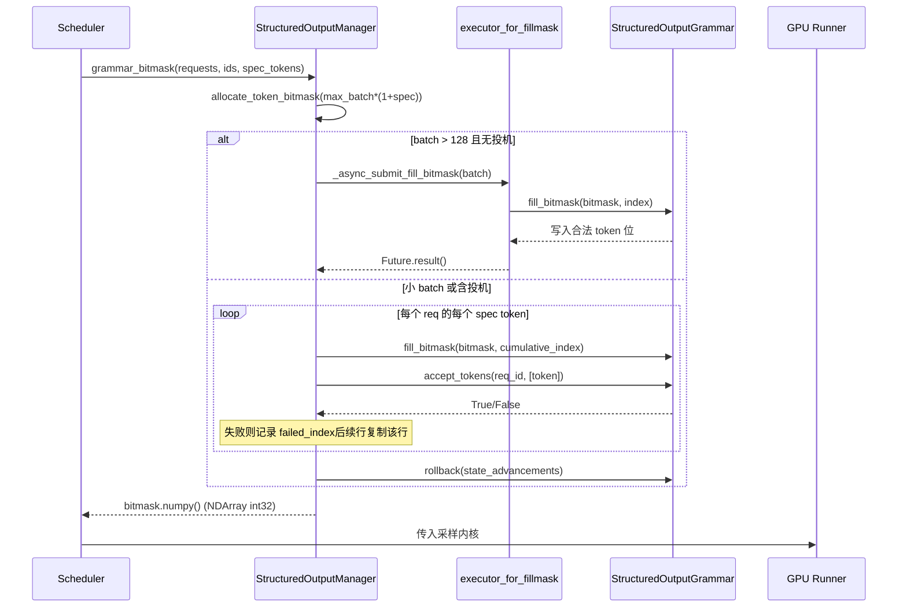

# Chapter 7: Sampling and Output: Logits Processing, Structured Output, and Streaming Return

In the previous chapter, we traced how the attention backend translates the block table into kernel parameters and completes gather-style attention computation on non-contiguous memory. But attention produces only hidden states—what the model truly needs to deliver to the user is the text of the next token. This chapter traces this last mile: after hidden states are projected into logits by lm_head, how do they pass through a carefully ordered processor chain (temperature, penalties, top-k/top-p, structured constraints), get sampled into token ids, and then be restored to text by the detokenizer and pushed in streaming fashion. If any step in this chain is out of order or leaks state, output quality will silently degrade.

# Sampler: The order of the processor chain is correctness

**Intuitive model**: The Sampler is like an assembly line, and logits are the rough workpiece to be processed. Each station (processor) on the line modifies the workpiece, and the order of the stations directly determines the finished product—cutting first and then grinding is not the same as grinding first and then cutting. Without this chain, the model could only output the raw probability distribution, and what the user gets would be "bare sampling" with no ability to control temperature, suppress repetition, or constrain format.

## Data structures and memory layout

The Sampler itself is`nn.Module`, but its core state is extremely thin: it only holds the`topk_topp_sampler`submodule,`logprobs_mode`and the`use_fp64_gumbel`flag[FACT:vllm/v1/sample/sampler.py:61-64]. The real batch-level state is all encapsulated in`SamplingMetadata`and passed in through the forward parameters. This design of "stateless Sampler + external metadata" is deliberate: the Sampler instance is created only once during the engine lifecycle, while the batch composition of each decode step is changing, so externalizing the state is the only way to let the Sampler be safely replayed after being captured by CUDA Graph.

The key constant is`_SAMPLING_EPS = 1e-5` [FACT:vllm/v1/sample/sampler.py:18]. It simultaneously serves two semantics: a temperature below this value is treated as greedy, and`apply_temperature`provides the fallback to prevent division by zero.

## Step-by-Step Walkthrough

Scenario: a batch mixes greedy requests and random sampling requests, and some requests also enable logprobs.

**Step one, snapshot the original logprobs.**Before applying any penalty or temperature, if the request needs logprobs, first follow`logprobs_mode`to determine the snapshot content[FACT:vllm/v1/sample/sampler.py:84-93]. Note that the comment explicitly points out the difference from V0: V1 uses**raw logits**(before penalties and temperature) to compute top-k logprobs.[FACT:vllm/v1/sample/sampler.py:72-77]. This is the semantic contract—the logprob the user sees should reflect the model's true distribution, not a distribution distorted by penalties.

**Step two, unify to float32.** [FACT:vllm/v1/sample/sampler.py:95-96]Regardless of whether the input is bf16 or fp16, upcast to float32. The reason is that subsequent log_softmax, top-k, and cumulative probabilities accumulate errors under low precision, especially when the vocab reaches 150,000.

**Step three, the non-argmax-invariant processor chain.** `apply_logits_processors`Apply in sequence: allowed token whitelist mask, bad words exclusion,`non_argmax_invariant`processors, penalty terms[FACT:vllm/v1/sample/sampler.py:391-404]. The classification here is the core design—`non_argmax_invariant`refers to those**that change the greedy result**processors (such as min_tokens, logit_bias), which must take effect before greedy sampling; while`argmax_invariant`processors (such as min_p) do not change the argmax and can be deferred until after temperature.

**Step four, sampling.** `sample`The method first determines whether it is fully random[FACT:vllm/v1/sample/sampler.py:256-271]: if`all_greedy`, directly return argmax; otherwise first compute the greedy result for later use, then apply temperature, argmax-invariant processors, top-k/top-p[FACT:vllm/v1/sample/sampler.py:275-291]. Finally use`torch.where`to select between the greedy and random results according to the temperature threshold[FACT:vllm/v1/sample/sampler.py:305-306], and reuse the`greedy_sampled`tensor as the output buffer to avoid extra allocation.

**Step five, collect logprobs and package the output.**According to`num_logprobs`, there are three cases: None returns only the logprobs of the specified token; -1 returns the full unsorted logprobs; otherwise top-k[FACT:vllm/v1/sample/sampler.py:120-131]. Finally, the token id is converted to int32 to compress the size, and expanded to`[num_requests, 1]`a two-dimensional tensor[FACT:vllm/v1/sample/sampler.py:138-148]。

```mermaid
flowchart TD
    in_logits["logits (bf16/fp16)"] --> snap{"需要 logprobs?"}
    snap -->|是| raw["compute_logprobs / cloneraw_logprobs 快照"]
    snap -->|否| f32
    raw --> f32["logits.to(float32)"]
    f32 --> proc["apply_logits_processors"]
    proc --> mask{"allowed_token_ids_mask?"}
    mask -->|是| fill["masked_fill_(-inf)"]
    mask -->|否| bad
    fill --> bad{"bad_words_token_ids?"}
    bad -->|是| apply_bad["apply_bad_words"]
    bad -->|否| noninv
    apply_bad --> noninv["non_argmax_invariant 处理器"]
    noninv --> pen["apply_penalties"]
    pen --> sample["sample()"]
    sample --> allg{"all_greedy?"}
    allg -->|是| greedy["greedy_sample (argmax)"]
    allg -->|否| temp["apply_temperature"]
    temp --> arginv["argmax_invariant 处理器"]
    arginv --> topp["topk_topp_sampler"]
    topp --> where["torch.where(temp  out
    where --> out["SamplerOutputsampled_token_ids"]
```

## Design reflections and pitfalls

**Why must penalty terms come before temperature?**Temperature is a scaling of the distribution, while penalties are additions or subtractions to specific tokens. If scaling is done first and then penalties are applied, the absolute magnitude of the penalty will be amplified or reduced by the temperature, causing the same set of penalty parameters to behave inconsistently at different temperatures. V1 fixes penalties before temperature, ensuring the stability of parameter semantics.

**`mark_unbacked`compilation trap.**In`gather_logprobs`,`batched_count_greater_than`is compiled, and when the batch dimension changes from 1 to ≥2, it triggers dynamo's 0/1 specialization recompilation[FACT:vllm/v1/sample/sampler.py:345-348]。`mark_unbacked`marks that dimension as fully symbolic to avoid this recompilation. In production, if you see a sudden one-time stall after the first decode request, it is very likely this kind of recompilation.

**`gpu_sync_allowed`synchronization boundary.** `batched_count_greater_than`may internally trigger GPU synchronization, and vLLM uses`gpu_sync_allowed(first_only=True)`context to explicitly declare "synchronization is allowed here, but only for the first time"[FACT:vllm/v1/sample/sampler.py:345-348]. If synchronization unexpectedly occurs inside a CUDA Graph capture region, it will cause capture failure—this is a key clue for troubleshooting graph capture issues.

# Structured output: dual-track state machine of bitmask and grammar

**Intuitive model**: structured output is like putting a pair of "grammar glasses" on the sampler—at each step it can only see tokens that conform to the JSON schema or grammar. Without it, the model may generate syntactically invalid JSON, and the downstream parser crashes directly. The essence of vLLM's implementation is that the grammar state machine advances on the CPU side, while constraints are passed to the GPU-side sampler in the form of a bitmask.

## Data structures and memory layout

`StructuredOutputManager`is an engine-level singleton, holding`backend`(one of xgrammar/guidance/outlines/lm-format-enforcer),`reasoner_cls`and two thread pools[FACT:vllm/v1/structured_output/__init__.py:39-98]。

The bitmask is the core data structure:`_grammar_bitmask`is an int32 tensor of shape`[max_batch_size * (1 + max_num_spec_tokens), vocab_size/32]`[FACT:vllm/v1/structured_output/__init__.py:327-336]. Each bit corresponds to whether a token is legal.`_full_mask = torch.tensor(-1, dtype=torch.int32)`represents "all 1s"—all tokens are legal[FACT:vllm/v1/structured_output/__init__.py:59]。

The two thread pools have clear division of labor:`executor`is responsible for grammar compilation (CPU-intensive, with the number of workers being half the number of CPUs)[FACT:vllm/v1/structured_output/__init__.py:71-78]；`executor_for_fillmask`is responsible for parallel filling of large-batch bitmasks, enabled only when the batch exceeds 128[FACT:vllm/v1/structured_output/__init__.py:62-69]。

## Step-by-Step Walkthrough

**Grammar initialization.**When a request enters for the first time,`grammar_init`is called[FACT:vllm/v1/structured_output/__init__.py:115-176]. If the backend is not initialized, select an implementation according to the configuration[FACT:vllm/v1/structured_output/__init__.py:130-165]. Then submit the compilation task: by default it uses asynchronous`executor.submit`, but in`external_launcher`mode it must be synchronous[FACT:vllm/v1/structured_output/__init__.py:167-176]。

**Bitmask generation.**At each decode step,`grammar_bitmask`generates masks for all structured requests in the batch[FACT:vllm/v1/structured_output/__init__.py:314-442]. Large batches use the parallel path: submitted to the thread pool in groups of 16[FACT:vllm/v1/structured_output/__init__.py:346-373]. Small batches use the serial path, advancing the grammar state token by token[FACT:vllm/v1/structured_output/__init__.py:374-433]。

**Mask alignment under speculative decoding.**This is the most ingenious part. When there are draft tokens, each request needs`1 + max_num_spec_tokens`rows of masks. The serial path processes token by token: if a draft token is rejected by the grammar, record`failed_index`, and subsequent rows directly copy that row's mask[FACT:vllm/v1/structured_output/__init__.py:396-418]. This ensures that "after a draft is rejected, the constraint state of subsequent positions rolls back to the rejection point."

**State rollback.**During bitmask filling, the grammar state has been advanced by`state_advancements`steps, but the draft token has not yet been truly accepted, so it must`grammar.rollback(state_advancements)`roll back[FACT:vllm/v1/structured_output/__init__.py:422-430]. True acceptance happens at`accept_tokens` [FACT:vllm/v1/structured_output/__init__.py:444-466]。



## Design reflections and pitfalls

**Why must external_launcher compile synchronously?**The comment gives the precise reason: asynchronous compilation causes`WAITING_FOR_STRUCTURED_OUTPUT_GRAMMAR → WAITING`state transitions to occur at different times on different TP ranks, breaking the determinism assumption that external_launcher relies on[FACT:vllm/v1/structured_output/__init__.py:47-56]This is a typical case of the conflict between distributed determinism and asynchronous optimization.

**The constraint starting point under the reasoning model.** `_get_constraint_start`Determines from which token to begin applying grammar constraints.[FACT:vllm/v1/structured_output/__init__.py:220-292]For models with a chain of thought, the reasoning phase should not be subject to JSON constraints; it only starts after reasoning ends.`enable_in_reasoning`When True, directly returns 0 (constrain throughout).[FACT:vllm/v1/structured_output/__init__.py:235-236]If the reasoner supports`find_reasoning_end_offset`use it to precisely locate[FACT:vllm/v1/structured_output/__init__.py:261-267]otherwise fall back to token-by-token backtracking search[FACT:vllm/v1/structured_output/__init__.py:287-291]。

**`validate_tokens`prefix semantics.**During speculative decoding, draft tokens may violate the grammar,`validate_tokens`returns the "longest legal prefix"[FACT:vllm/v1/structured_output/__init__.py:294-312]Note that it first strips speculative padding (-1), then computes the constraint starting point, and finally performs grammar validation only on tokens within the constrained interval.

# Detokenizer: The boundary game between incremental decoding and stop strings

**Intuitive model**The detokenizer is like a scribe copying character by character, translating token ids into human-readable text. The difficulty lies in: tokens and characters are not one-to-one (a token may correspond to only half a UTF-8 character), and a stop string may span multiple tokens. Without incremental decoding, the entire sequence must be decoded from scratch at each step, and the O(n²) overhead would cripple throughput.

## Data structures and memory layout

`IncrementalDetokenizer`The base class only holds`token_ids`list[FACT:vllm/v1/engine/detokenizer.py:32-33]。`BaseIncrementalDetokenizer`adds stop-related fields:`stop`list,`min_tokens`、`include_stop_str_in_output`、`stop_buffer_length`and`_last_output_text_offset` [FACT:vllm/v1/engine/detokenizer.py:70-94]。

`stop_buffer_length`is key: when the stop string is not included in the output, it equals the longest stop string length minus one[FACT:vllm/v1/engine/detokenizer.py:87-90]This "rollback buffer" ensures that streaming output does not prematurely emit characters that might be a prefix of a stop string.

Two implementation paths:`FastIncrementalDetokenizer`Use the tokenizers library's`DecodeStream` [FACT:vllm/v1/engine/detokenizer.py:166-246]；`SlowIncrementalDetokenizer`Use the Python-side`detokenize_incrementally` [FACT:vllm/v1/engine/detokenizer.py:249-305]The choice is based on tokenizers version ≥ 0.22.0 and matching tokenizer type[FACT:vllm/v1/engine/detokenizer.py:32-33][FACT:vllm/v1/engine/detokenizer.py:61-63]。

## Step-by-Step Walkthrough

**incremental decoding.** `update`Receives new token ids and the`stop_terminated`flag[FACT:vllm/v1/engine/detokenizer.py:96-142]If stop terminates and does not include the stop string, the last token is excluded from decoding[FACT:vllm/v1/engine/detokenizer.py:107-111]Then calls token by token`decode_next`accumulates text[FACT:vllm/v1/engine/detokenizer.py:117-122]。

**stop string detection.** `check_stop_strings`Searches only within the range of newly added characters[FACT:vllm/v1/engine/detokenizer.py:308-360]The search starting point is`1 - new_char_count - stop_string_len` [FACT:vllm/v1/engine/detokenizer.py:338]this offset ensures that stop strings spanning token boundaries can also be captured. When multiple stop strings match simultaneously, choose**the one that completes earliest**[FACT:vllm/v1/engine/detokenizer.py:342-347]。

**streaming output slicing.** `get_next_output_text`Based on`delta`the parameter determines whether to return the full amount or the increment[FACT:vllm/v1/engine/detokenizer.py:148-163]When incomplete, retains`stop_buffer_length`characters without emitting[FACT:vllm/v1/engine/detokenizer.py:145-146]uses`_last_output_text_offset`to record the sent position[FACT:vllm/v1/engine/detokenizer.py:148-163]。

**exception recovery.** `FastIncrementalDetokenizer._protected_step`Handles two types of exceptions: OverflowError/TypeError logs and returns None[FACT:vllm/v1/engine/detokenizer.py:225-229]for "Invalid prefix" errors,**rebuilds DecodeStream**and retries[FACT:vllm/v1/engine/detokenizer.py:222-246]The latter addresses the edge case where the tokenizer produces non-monotonic UTF-8 output.

## Design considerations and pitfalls

**The trade-off of stop_buffer_length.**The longer the buffer, the greater the streaming latency (the time before users see text is delayed), but the less likely it is to miss a stop string spanning tokens. Taking "the longest stop string length minus one" is an exact lower bound: the prefix of any stop string is at most this long.

**min_tokens and stop_check_offset.**When the number of output tokens has not reached`min_tokens``stop_check_offset`is continuously pushed to the end of the text[FACT:vllm/v1/engine/detokenizer.py:120-122]meaning this text will not undergo stop detection. This prevents the model from hitting a stop string right at the beginning and producing empty output.

**The added_token_ids cache of the Fast path.**When`spaces_between_special_tokens`is False, spaces between special tokens need to be suppressed[FACT:vllm/v1/engine/detokenizer.py:192-207]The code caches`added_token_ids`on the tokenizer object[FACT:vllm/v1/engine/detokenizer.py:195-200]avoiding rebuilding the dictionary on every decode.

# Design considerations

The three modules share one design philosophy:**separate state advancement from constraint checking, letting the GPU side perform only stateless tensor operations**The Sampler is stateless; the state is in`SamplingMetadata`the grammar state machine advances on the CPU side, and the GPU only consumes the bitmask; the detokenizer's`_last_output_text_offset`is the only streaming cursor. This separation allows every GPU-side component to be captured by CUDA Graph.

Another main thread is**order is semantics**The order of the Sampler's processor chain, the constraint starting point of structured output, and the stop detection offset of the detokenizer—an error in any one of these orders will not crash, but will silently produce incorrect results—this is precisely what makes this kind of code hardest to debug.

# Chapter summary

- The Sampler's processor chain is strictly ordered: raw logprobs snapshot → float32 → whitelist/bad words → non-argmax-invariant → penalties → temperature → argmax-invariant → top-k/top-p.
- Structured output uses a bitmask to pass CPU-side grammar state to the GPU; under speculative decoding, consistency is ensured through`failed_index`copying and`rollback`.
- The Detokenizer uses`stop_buffer_length`fallback buffering to balance streaming latency and cross-token stop string detection; the Fast path relies on tokenizers ≥ 0.22.0's`DecodeStream`。

# Chapter Review and Self-Test

Q1: If the`apply_logits_processors`penalty term (`apply_penalties`) is moved to execute after temperature, what specific deviation occurs in a high-temperature sampling scenario with temperature=2.0? Why?

**Reference Analysis**: Temperature scales the entire logits vector (`logits.div_(temp)`）[FACT:vllm/v1/sample/sampler.py:241-242]. The penalty term (such as repetition penalty) is a multiplicative/additive adjustment to specific tokens. If scaling is done first and then penalization, the absolute magnitude of the penalty is amplified by 2x due to temperature, causing the same set of`repetition_penalty`parameters to suppress far more strongly at high temperature than at low temperature, and the parameter semantics drift with temperature. V1 fixes the penalty before temperature[FACT:vllm/v1/sample/sampler.py:403-404], ensuring the penalty magnitude is decoupled from temperature. In addition, the penalty belongs to the`non_argmax_invariant`category (it affects greedy results), while the greedy path already returns before temperature[FACT:vllm/v1/sample/sampler.py:261-271]; if moved after temperature, greedy requests would completely bypass the penalty, resulting in inconsistent behavior.

Q2: In`grammar_bitmask`'s serial path, if the line`grammar.rollback(state_advancements)` [FACT:vllm/v1/structured_output/__init__.py:422-430]is deleted, what happens under the combination of speculative decoding + structured output? Please analyze in conjunction with the call timing of`accept_tokens`.

**Reference Analysis**: When filling the bitmask, the code calls`grammar.accept_tokens`for each draft token to advance the grammar state to generate the mask for the next position[FACT:vllm/v1/structured_output/__init__.py:396-418], but this is only a "tentative advance" — the draft token has not yet been verified and accepted by the target model. If`rollback`is deleted, the grammar state will permanently remain at the position where "all drafts are accepted." When the target model actually rejects some draft tokens, the truly accepted token sequence does not match the grammar state:`accept_tokens` [FACT:vllm/v1/structured_output/__init__.py:444-466]will validate based on the wrong grammar state, causing legal tokens to be rejected or illegal tokens to be allowed. The result is silent corruption of JSON output: no crash, but downstream parsing fails.

Q3: `check_stop_strings`'s search starting point is`1 - new_char_count - stop_string_len` [FACT:vllm/v1/engine/detokenizer.py:338]. If changed to a full search starting from 0, is it functionally correct? What performance problems would it cause in long-sequence streaming scenarios?

**Reference Analysis**: Functionally correct — searching from 0 can find all matches, including those spanning token boundaries. But performance-wise, performing`output_text`on the entire`find`at each step degrades complexity from O(new_char_count) to O(total_length), which is O(n²) for long sequences. More seriously, searching from 0 may match**stop string substrings in historical text**already sent to the user, causing repeated stop triggering or incorrect truncation. The original design's offset`1 - new_char_count - stop_string_len`precisely covers the minimal necessary window of "newly added characters + possibly cross-boundary stop string prefixes," ensuring no missed detection while avoiding false matches in history.

At this point, the full inference pipeline on a single machine has been connected: from attention computation to sampling output, every step directly affects the quality of the final delivered text. But when model size exceeds single-card capacity, this pipeline must span multiple devices working together. In the next chapter we leave the single machine and enter distributed parallelism: how TP, PP, and EP partition the model, and how communication primitives synchronize these sampling results across ranks.
