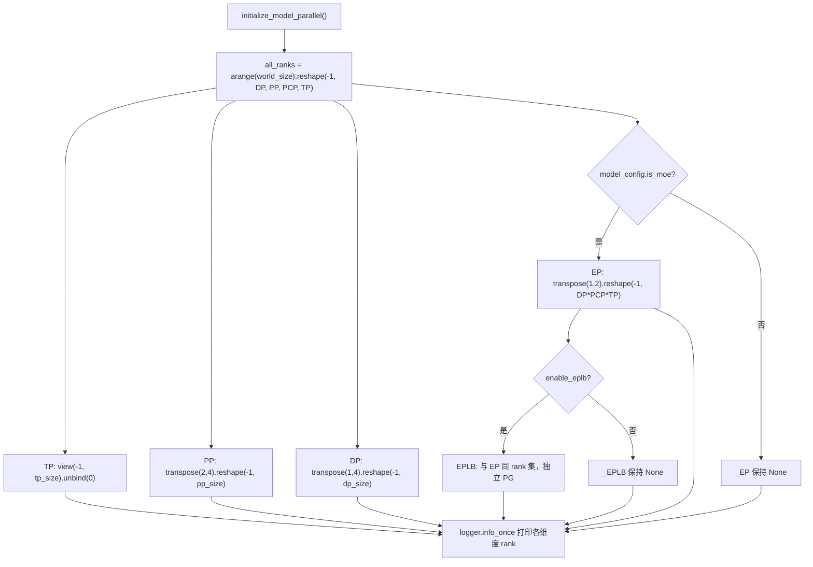
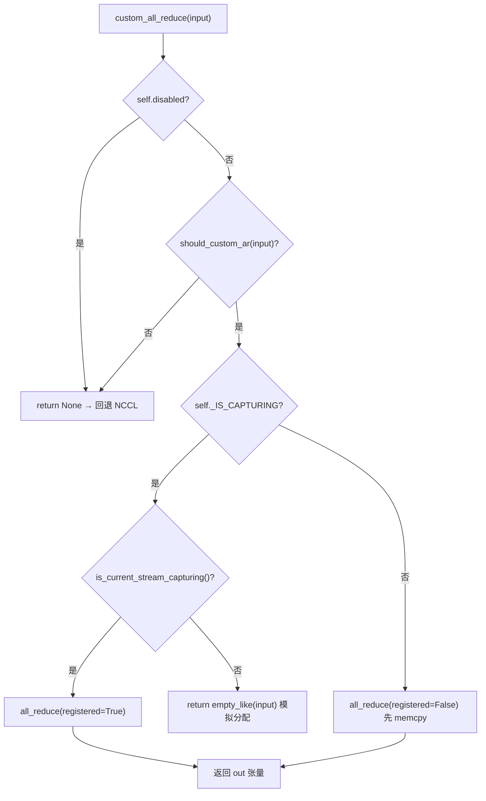

# Chapter 8: Distributed Parallelism: TP, PP, EP, and Communication Primitives

In the previous chapter we completed the last mile of a single inference lifecycle, from logits sampling to streaming output. But when the model is too large to fit on a single card, this pipeline must be split across multiple devices for coordinated execution. The first-order question in distributed inference is not "how to partition the model," but "after partitioning, who talks to whom and in what way." vLLM assigns these two questions to the process group topology in parallel_state.py and the communicator implementation in custom_all_reduce.py, respectively. This chapter follows the chain of "group creation → partitioning → communication → load rebalancing" to unpack the parallel strategies and underlying communication primitives of TP, PP, and EP layer by layer.

# 8.1 Process Group Topology: How a Rank Grid Is Carved into TP/PP/DP/EP

## Intuitive Model

Think of 8 GPUs as a long table with 8 seats. Tensor Parallelism (TP) requires "people at the same table to raise their glasses simultaneously," Pipeline Parallelism (PP) requires "adjacent seats to pass dishes in relay," Data Parallelism (DP) requires "different tables eat separately but reconcile at the end," and Expert Parallelism (EP) requires "tokens to be triaged by department." Without a unified seating arrangement, each module would`new_group`, a communication misalignment occurs: "I thought you were in the TP group, but you're actually in the DP group" — once any rank is absent from a collective communication, NCCL will hang indefinitely rather than raise an error.

## Data Structures and Memory Layout

`GroupCoordinator`is the carrier for all of this. Its field design directly corresponds to "a single process's multiple identities across multiple parallel dimensions":

- `rank`is the global rank,`ranks`is the list of global ranks of members in this group,`world_size`is the group size[FACT:vllm/distributed/parallel_state.py:434-436]。
- `local_rank`is used to bind the device,`rank_in_group`is the intra-group index — the source code uses a table to precisely distinguish the two: in a 4-GPU group spanning two nodes, rank 2's`local_rank`is 0 (it is the first GPU on node 1), but`rank_in_group`is 2[FACT:vllm/distributed/parallel_state.py:437-445]。
- `cpu_group`and`device_group`exist as a pair: the former uses gloo for metadata/object communication, the latter uses NCCL for tensor communication[FACT:vllm/distributed/parallel_state.py:446-447]。

There is a key design here:**Why does every group need to maintain a CPU group?**Because`broadcast_object`、`send_object`operations like this transmit Python objects (serialized bytes); using NCCL would both waste VRAM and potentially pollute the current CUDA device.`barrier()`The comments state this very plainly: NCCL's barrier internally is a broadcast, which secretly creates GPU tensors and can easily mess up the current device, so a CPU group must be used[FACT:vllm/distributed/parallel_state.py:1355-1362]。

## Step-by-Step：`initialize_model_parallel`How to slice the grid

Consider a concrete scenario: 8 GPUs, TP=2, PP=4, DP=1. The core is to reshape the one-dimensional rank sequence into a multi-dimensional grid, then slice along each dimension.

Step one, construct the rank grid. The layout order is explicitly defined as`ExternalDP x DP x PP x PCP x TP` [FACT:vllm/distributed/parallel_state.py:2045-2060]：

```python
all_ranks = torch.arange(world_size).reshape(
    -1, data_parallel_size, pipeline_model_parallel_size,
    prefill_context_model_parallel_size, tensor_model_parallel_size,
)
```

Step two, slice the TP group: view the grid as`(-1, tp_size)`then unbind, obtaining`[g0,g1],[g2,g3],...` [FACT:vllm/distributed/parallel_state.py:2065-2077]. Note that the TP group additionally passes`use_message_queue_broadcaster=True`, because the TP group needs shared-memory broadcast to distribute metadata.

Step three, slice the PP group:`all_ranks.transpose(2, 4)`Move the PP dimension to the last dimension before slicing, obtaining`[g0,g2,g4,g6],[g1,g3,g5,g7]` [FACT:vllm/distributed/parallel_state.py:2175-2188]. This is exactly the example given in the docstring[FACT:vllm/distributed/parallel_state.py:1997-1997]。

Step four, slice the DP group:`transpose(1, 4)`then slice[FACT:vllm/distributed/parallel_state.py:2195-2202]。

Step five, slice the EP group — there is an easily overlooked detail here: the EP group is only created under MoE models; dense models skip it entirely[FACT:vllm/distributed/parallel_state.py:2210-2241]. The EP group's rank set is the product of`DP x PCP x TP`, meaning EP reuses the physical GPUs of DP and TP rather than being an independent dimension.



## Design Considerations and Pitfalls

**Why does EPLB need an independent process group?**The comments provide the answer: to isolate EPLB communication from the collective communication of MoE forward passes, preventing "execution-time torch.distributed" and "EPLB's torch.distributed" from deadlocking each other[FACT:vllm/distributed/parallel_state.py:2243-2246]. This is a classic trade-off of "trading an independent communication domain for determinism" — the cost is the VRAM overhead of one extra PG, and what you get in return is that forward passes won't get stuck during weight transfers.

**Synchronization Constraints of the DP Group**is the most commonly encountered pitfall in production: all ranks within the same DP group must call`generate`simultaneously, otherwise deadlock[FACT:vllm/distributed/parallel_state.py:2048-2051]. This is because the DP group performs all-reduce on gradients/sampling results, and any absent rank will cause the collective communication to block forever.

**Destruction Order**Also has its subtleties.`destroy()`First destroy the device communicator, then destroy the device_group and cpu_group[FACT:vllm/distributed/parallel_state.py:1380-1393]. The comments explain why: the device communicator may hold collective communication workspaces that depend on these PGs (such as the FlashInfer PCIe IPC barrier), so it must be released first[FACT:vllm/distributed/parallel_state.py:1377-1377]。

# 8.2 Communication Primitives: How Custom all-reduce Bypasses NCCL

## Intuitive Model

NCCL's all-reduce is a "general-purpose truck" — it can carry any cargo and take any road, but its startup overhead and protocol overhead are fixed. When you need to repeatedly perform small-tensor all-reduce on an 8-GPU NVLink fully-connected machine (every attention/MLP layer in TP needs it), the "toll" of the general-purpose truck becomes non-negligible. Custom all-reduce is a "dedicated handcart": it is only enabled on the same machine, with full NVLink interconnect, and suitable tensor sizes, using a single`cudaMemcpy`to replace NCCL's handshake and protocol overhead.

## Data Structures and Memory Layout

`CustomAllreduce`The initialization of  is a combination of "capability probing + resource pre-allocation". Key fields:

- `_SUPPORTED_WORLD_SIZES = [2, 4, 6, 8, 16]`: only supports these group sizes[FACT:vllm/distributed/device_communicators/custom_all_reduce.py:113-129]。
- `meta_ptrs`: synchronization metadata + intermediate result buffer, size`ops.meta_size() + max_size` [FACT:vllm/distributed/device_communicators/custom_all_reduce.py:291-294]。
- `buffer_ptrs`: pre-registered IPC buffer; in eager mode, input tensors are first copied in before computation[FACT:vllm/distributed/device_communicators/custom_all_reduce.py:298-305]。
- `rank_data`: an 8MB uint8 tensor storing the IPC buffer pointer tuples of all ranks[FACT:vllm/distributed/device_communicators/custom_all_reduce.py:309-315]。

**Why do buffers need to be pre-registered?**Because CUDA Graph capture requires all addresses to be fixed at capture time.`register_graph_buffers`At the end of capture, broadcast all used buffer addresses to all ranks and register them[FACT:vllm/distributed/device_communicators/custom_all_reduce.py:474-491]。

## Step-by-Step: The Decision Flow of a Single all-reduce

Consider the scenario: a certain MLP layer's output within the TP group needs all-reduce, and the input is a 4MB bf16 tensor.

Step one,`custom_all_reduce`check whether it is disabled, whether it satisfies`should_custom_ar` [FACT:vllm/distributed/device_communicators/custom_all_reduce.py:529-533]。

Step two,`should_custom_ar`Filter item by item: reject if world_size > 8; dtype must be fp32/fp16/bf16; byte count must be a multiple of 16; must be weakly contiguous; only continue if world_size==2 or fully interconnected[FACT:vllm/distributed/device_communicators/custom_all_reduce.py:493-508]。

Step three, branch based on whether in CUDA Graph capture: during capture use`registered=True`(address already fixed), otherwise`registered=False`(need to memcpy to pre-registered buffer first)[FACT:vllm/distributed/device_communicators/custom_all_reduce.py:529-545]。

Step four, actually call`ops.all_reduce`, passing in`buffer_ptrs[rank]`and`max_size` [FACT:vllm/distributed/device_communicators/custom_all_reduce.py:519-527]。



## Design thinking and pitfalls

**The degradation path for multi-node scenarios**is the most elegant part of this code.`same_node`When is false,`mnnvl_only`set to true[FACT:vllm/distributed/device_communicators/custom_all_reduce.py:198-199], then check MNNVL (Multi-Node NVLink) capability. If not every GPU in the group supports MNNVL, directly disable custom collective communication[FACT:vllm/distributed/device_communicators/custom_all_reduce.py:228-233]。`_group_can_attempt_mnnvl`Use a single CPU all-reduce (MIN operation) to ensure all ranks follow the same control flow[FACT:vllm/distributed/device_communicators/custom_all_reduce.py:59-73]—this is the key safeguard in heterogeneous clusters to avoid "some ranks entering the MNNVL path while others go through NCCL" causing hangs.

**The cost of P2P checks**：`_can_p2p`will iterate over all peers doing`gpu_p2p_access_check`, the comment says the first computation is expensive but will be cached[FACT:vllm/distributed/device_communicators/custom_all_reduce.py:278-278]. In production, if startup is found to be slow, you can set`VLLM_SKIP_P2P_CHECK`to skip, directly trusting the driver's P2P report[FACT:vllm/distributed/device_communicators/custom_all_reduce.py:86-100]。

**Three-tier backend selection for reduce-scatter**is worth looking at separately:`_select_reduce_scatter_backend`returns by priority`mnnvl_multimem` > `mnnvl_lamport` > `legacy` [FACT:vllm/distributed/device_communicators/custom_all_reduce.py:601-636]. The multimem path requires world_size to be in`(2,4,8)`and device capability to be (10,0) or (10,3) (Blackwell-class)[FACT:vllm/distributed/device_communicators/custom_all_reduce.py:103-104]. Note that`VLLM_BATCH_INVARIANT`will disable the multimem path[FACT:vllm/distributed/device_communicators/custom_all_reduce.py:628]—because multimem's reduction order is nondeterministic, which would break batch invariance.

# 8.3 EPLB: Scheduling logic for expert load rebalancing

## Intuitive model

In a MoE model, 256 logical experts are distributed across 32 GPUs, 8 per GPU. But under real traffic, some "hot experts" (e.g., those handling common syntactic structures) get routed a large number of tokens, causing the GPU holding them to become a bottleneck while other GPUs sit idle. EPLB (Expert Parallel Load Balancer) is essentially "adding replicas for hot experts": copying the weights of hot experts to idle GPUs so tokens can be diverted there. Without it, MoE's actual throughput would be locked to the slowest GPU.

## Data structures and memory layout

`EplbModelState`uses three mapping tables to describe the "logical expert ↔ physical expert" relationship:

- `physical_to_logical_map`: shape`(num_moe_layers, num_physical_experts)`, each physical slot stores the logical expert id it carries[FACT:vllm/distributed/eplb/eplb_state.py:105-120]。
- `logical_to_physical_map`: shape`(num_moe_layers, num_logical_experts, max_replicas+1)`, sparse matrix, -1 means no mapping[FACT:vllm/distributed/eplb/eplb_state.py:123-146]。
- `logical_replica_count`: how many replicas each logical expert has[FACT:vllm/distributed/eplb/eplb_state.py:147-161]。

`expert_load_window`is a sliding window, shape`(window_size, num_moe_layers, num_physical_experts)` [FACT:vllm/distributed/eplb/eplb_state.py:180-187]. The comment specifically notes: now it records the load of all physical experts rather than only local experts, to ensure consistent statistics across different dispatch methods (naive all-to-all, DeepEP); under naive all-to-all, each DP rank contributes the same token set, so the load gets multiplied by dp_size[FACT:vllm/distributed/eplb/eplb_state.py:180-187]。

## Step-by-Step: The complete chain of one rebalancing

Scenario:`expert_rearrangement_step`reaches the threshold, triggering`rearrange()`。

Step one, map physical load back to logical experts. Use`scatter_add_`to aggregate by`physical_to_logical_map`, invalid slots (<0) are filled into the`invalid_idx`bucket and discarded at the end[FACT:vllm/distributed/eplb/eplb_state.py:794-816]。

Step two, cross-rank all-reduce to get global logical load.`_allreduce_list`concatenates the loads of multiple models then does one all-reduce and splits them back, avoiding multiple communications[FACT:vllm/distributed/eplb/eplb_state.py:1045-1068]。

Step three, call the policy to compute the new mapping.`policy.rebalance_experts`runs on host, so both the load window and the current mapping must be copied back to CPU[FACT:vllm/distributed/eplb/eplb_state.py:859-867]。

Step four, ROCm-specific "skip rebalancing" check: if the new mapping improves rank load imbalance by less than 5%, skip this rebalancing[FACT:vllm/distributed/eplb/eplb_state.py:869-923]. This is a pragmatic optimization—rebalancing itself has communication cost, so if the benefit isn't enough, don't do it.

Step five, perform weight transfer and commit the new mapping[FACT:vllm/distributed/eplb/eplb_state.py:925-942]。

```mermaid
sequenceDiagram
    participant Main as 主线程 step()
    participant Policy as DefaultEplbPolicy
    participant Comm as EplbCommunicator
    participant Async as async_worker 线程
    Main->>Main: expert_rearrangement_step >= interval
    Main->>Main: scatter_add_ 物理负载→逻辑负载
    Main->>Main: _allreduce_list 跨 rank 聚合
    Main->>Policy: rebalance_experts(load, replicas, groups, nodes, gpus, map)
    Policy-->>Main: new_physical_to_logical_map
    alt 同步模式
        Main->>Comm: rearrange_expert_weights_inplace()
        Comm-->>Main: 权重搬运完成
        Main->>Main: _commit_eplb_maps()
    else 异步模式
        Main->>Main: eplb_stats = EplbStats(...); rebalanced = True
        Main->>Async: rearrange_event.record()
        Async->>Comm: 后台搬运权重到 expert_buffer
        Async-->>Main: pending_result 就绪
        Main->>Main: _move_to_workspace() 提交
    end
```

## Design thinking and pitfalls

**Synchronization primitives for async mode**is the most subtle part of this code.`rebalanced`The flag relies on the GIL to synchronize between the main thread and the async worker[FACT:vllm/distributed/eplb/eplb_state.py:194-203]. But the comment warns:`rebalanced`must remain consistent across all ranks, otherwise`_all_ranks_result_ready`the all-reduce inside will hang[FACT:vllm/distributed/eplb/eplb_state.py:664-665]。`_all_ranks_result_ready`Prefer using the CPU group for all-reduce, because the CPU group is more reliable[FACT:vllm/distributed/eplb/eplb_state.py:1024-1043]。

**The sliding window's "early recording" optimization**：`_should_record_current_step`only enables recording when the distance to the next rebalancing is no more than`window_size`steps[FACT:vllm/distributed/eplb/eplb_state.py:689-709]. The comment explains: the data of the`step_interval - window_size`steps before each rebalancing cycle will be overwritten by the sliding window, so recording it is wasted effort and wastes GPU compute[FACT:vllm/distributed/eplb/eplb_state.py:1196-1199]。`should_record_tensor`is the same scalar tensor shared by all layers, one`fill_`updates all layers[FACT:vllm/distributed/eplb/eplb_state.py:272-278]。

**Capacity reservation for elastic EP**：`enable_elastic_ep`when,`physical_expert_capacity`reserve by`elastic_ep_max_dp_size`, the mapping table fills extra slots with -1[FACT:vllm/distributed/eplb/eplb_state.py:375-386]. This way, scaling up doesn't require reallocating GPU memory, just filling the -1 slots with real experts.`reconfigure_physical_expert_slots`is responsible for refreshing the view during scale-up/scale-down[FACT:vllm/distributed/eplb/eplb_state.py:1135-1160]。

**`_commit_eplb_maps`'s pin memory handling**: when`PIN_MEMORY`is enabled and the source is on CPU, first copy to pinned memory then`non_blocking=True`asynchronously copy to GPU[FACT:vllm/distributed/eplb/eplb_state.py:1392-1400]. This is to avoid H2D copies blocking the main thread—the mapping table is updated every layer every round, and synchronous copies would become a bottleneck.

# Design thinking

The three pieces of code share one design philosophy:**Trade capability detection for deterministic degradation**。`GroupCoordinator`When`world_size == 1`directly bypass all collective communication[FACT:vllm/distributed/parallel_state.py:736-738]；`CustomAllreduce`return when any condition is not met`None`let the caller fall back to NCCL[FACT:vllm/distributed/device_communicators/custom_all_reduce.py:532-533]; EPLB skips rearrangement when the improvement is less than 5%[FACT:vllm/distributed/eplb/eplb_state.py:916]. This "fail fast + graceful degradation" pattern allows the same code to run across the full spectrum of hardware from a single GPU to multi-machine MNNVL, without needing to write branches for every configuration.

Another commonality is**control-flow consistency takes priority over performance**。`_group_can_attempt_mnnvl`use CPU all-reduce to force all ranks onto the same branch[FACT:vllm/distributed/device_communicators/custom_all_reduce.py:59-73]，`_all_ranks_result_ready`similarly[FACT:vllm/distributed/eplb/eplb_state.py:1024-1043]. In distributed systems, "some ranks take the fast path while others take the slow path" is far more dangerous than "all ranks take the slow path" - the former hangs, while the latter is merely slow.

# Chapter Summary

- `GroupCoordinator`Reshape the one-dimensional rank sequence into a`ExternalDP x DP x PP x PCP x TP`grid, and partition TP/PP/DP/EP/EPLB process groups along each dimension; each group simultaneously maintains two PGs: CPU (gloo) and device (NCCL).
- `CustomAllreduce`Use capability detection (same machine, NVLink full interconnect, tensor size, dtype, 16-byte alignment) to decide whether to take over all-reduce, and degrade to MNNVL or NCCL in multi-machine scenarios.
- EPLB uses three mapping tables to describe the logical/physical expert relationships, counts load through a sliding window, computes a new mapping via a strategy, and moves weights through a communicator, supporting both synchronous and asynchronous modes.
- The shared design principles of the three: capability detection + deterministic degradation + control-flow consistency first.

# Chapter Review Questions

Q1: `GroupCoordinator.destroy()`Destroy the device communicator first, then destroy the process group[FACT:vllm/distributed/parallel_state.py:1380-1393]. If the order is reversed, destroying the PG first and then the communicator, in what scenario would it crash?

**Reference Analysis**: The comments explicitly point out that the device communicator may hold collective communication workspaces that depend on these PGs, such as the FlashInfer PCIe IPC barrier[FACT:vllm/distributed/parallel_state.py:1377-1377]. If the PG is destroyed first, and the communicator's`destroy()`internals still need to use these PGs for a barrier or cleanup communication, it will access an already-destroyed ProcessGroup, triggering a use-after-free or an NCCL internal assertion failure. The correct order is "dependents die first": the communicator depends on the PG, so the communicator is destroyed first.

Q2: `should_custom_ar`Requires`inp_size % 16 == 0` [FACT:vllm/distributed/device_communicators/custom_all_reduce.py:493-508]. If this check is removed, what happens to a 15-byte bf16 tensor (for example, 7.5 elements, which is actually impossible, but suppose it is the boundary case of 8 elements = 16 bytes)? Why does the custom kernel need this alignment?

**Reference Analysis**: The custom all-reduce kernel internally uses vectorized loads (such as 128-bit load), requiring the address and size to be 16-byte aligned in order to use`float4`wide load instructions such as these. Misalignment causes the kernel to read out of bounds or trigger a misaligned address exception. More subtly,`buffer_ptrs`the pre-registered buffer is allocated according to`max_size`. If the input size is not a multiple of 16, after copying into the buffer there may be residual data at the tail that gets reduced together, producing silent errors. So this check is both a correctness safeguard and a performance prerequisite.

Q3: In EPLB asynchronous mode,`rebalanced`the flag relies on GIL synchronization[FACT:vllm/distributed/eplb/eplb_state.py:194-203], and the comments warn that all ranks must remain consistent, otherwise all-reduce hangs[FACT:vllm/distributed/eplb/eplb_state.py:664-665]. Suppose a certain rank, due to network jitter, has its async worker set`rebalanced`to False early, while other ranks are still True,`_all_ranks_result_ready`what happens?

**Reference Analysis**：`_all_ranks_result_ready`Perform`has_result`an all-reduce sum, then check whether it equals the group size[FACT:vllm/distributed/eplb/eplb_state.py:1030-1032]. If a certain rank's`rebalanced`becomes False early, its`pending_result`may already have been consumed,`has_result`is 0, causing the sum result to be less than the group size, and the other ranks will keep waiting. Worse, if this rank has already exited the`while ms.rebalanced`loop, it will no longer participate in subsequent all-reduces, and the other ranks' all-reduce will block forever - this is what the comments call "hang at collective communication calls". The safeguard is`_all_ranks_result_ready`to use the CPU group rather than the device group, and`drain_async`to explicitly drain all pending results before rearrangement.[FACT:vllm/distributed/eplb/eplb_state.py:985-1022]。

At this point, we have clarified the group formation, partitioning, and load rebalancing mechanisms for inter-GPU communication. However, the communication challenges of distributed inference go beyond a single instance—when prefill and decode are split across different instances, the KV Cache needs to be transferred across nodes. In the next chapter, we will leave "inter-GPU communication" and enter "inter-instance communication": how KV Cache is transferred between prefill and decode instances in disaggregated deployment, and how the KV Connector abstraction unifies transfer backends such as NIXL and Mooncake.
