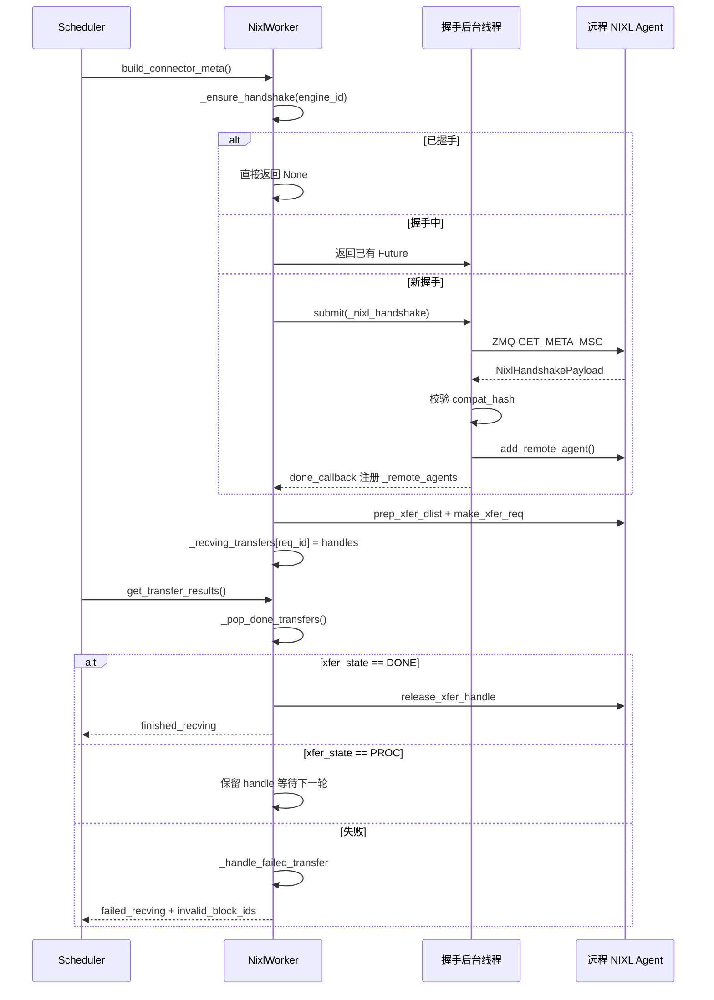

# Chapter 9: KV Cache Transfer and Disaggregated Deployment (PD Disaggregation)

In the previous chapter, we focused our view inside a single inference instance: how TP/PP/DP/EP process groups are formed, how tensors are partitioned across GPUs, and how EPLB performs expert rebalancing at the MoE layer. But all these mechanisms are built on the same premise—prefill and decode run in the same instance, and the KV Cache stays in local GPU memory from beginning to end. Disaggregated deployment (Prefill-Decode Disaggregation, or PD disaggregation) breaks this premise. It splits prefill and decode into two independent vLLM instances: the prefill instance only performs the forward computation for the prompt, produces the KV Cache, and hands it to the decode instance; the decode instance takes this KV Cache and continues autoregressive generation. The benefit is that resources can be configured independently according to the characteristics of each phase—prefill is compute-intensive and suits large TP and large batches; decode is memory-access-intensive and suits small batches and low-latency scheduling. The two no longer drag each other down. The cost is that the KV Cache must be transferred across instances. This is the protagonist of this chapter—the KV Connector. The file header comment of vllm/distributed/kv_transfer/kv_connector/v1/base.py already lists the core primitives of the entire abstraction: the Scheduler side is responsible for binding metadata, querying remote cache hits, and deciding whether to asynchronously release blocks; the Worker side is responsible for the actual KV loading and saving. The design goal of this interface is to completely decouple the upper-layer scheduling logic from the underlying transfer backends (NIXL, Mooncake, MoRIIO). From an engineering perspective, the biggest risk of PD disaggregation is not slow transfer, but state inconsistency: the prefill instance believes the KV has been sent, but the decode instance does not receive it; or the decode instance releases the block early while prefill is still writing to it. What this chapter aims to clarify is exactly how this connector system uses handshake protocols, leases, heartbeats, and failure recovery mechanisms to cover these boundary cases.

# 1. KVConnectorBase_V1: Dual-role abstraction and metadata contract

## Intuitive model

The KV Connector is like a courier system between two branch stores. The Prefill store has calculated the semi-finished product (KV Cache), packages it, and ships it to the Decode store for further processing. But a courier system cannot have only the action of "shipping"—it needs a waybill (metadata) explaining what is being sent and where it is going; it needs a receipt mechanism to confirm that the other party has received it; and it also needs a set of timeout rules to prevent packages from being stuck on the road forever and occupying shelf space.

Without this abstraction, every transfer backend (NIXL, Mooncake) would have to implement its own scheduling logic, and vLLM's Scheduler would have to write a set of adaptation code for each backend. The value of KVConnectorBase_V1 is to fix this contract in place.

## Dual roles: Scheduler side and Worker side

[FACT:vllm/distributed/kv_transfer/kv_connector/v1/base.py:137-142]defines the two roles of the connector:

```python
class KVConnectorRole(enum.Enum):
    # Connector running in the scheduler process
    SCHEDULER = 0
    # Connector running in the worker process
    WORKER = 1
```

This division is not arbitrary. The Scheduler process is responsible for global scheduling decisions—which requests need transfer and when blocks can be released; the Worker process is responsible for the actual data movement. The two communicate through`KVConnectorMetadata`communication.

[FACT:vllm/distributed/kv_transfer/kv_connector/v1/base.py:153-158]defines the base class for metadata in the Scheduler-to-Worker direction:

```python
class KVConnectorMetadata(ABC):  # noqa: B024
    """Abstract Metadata used to communicate
    Scheduler KVConnector -> Worker KVConnector.
    """
    pass
```

In the reverse Worker-to-Scheduler direction,[FACT:vllm/distributed/kv_transfer/kv_connector/v1/base.py:161-176]defines`KVConnectorWorkerMetadata`, which requires implementing the`aggregate`method—because in one engine step, multiple workers may each return metadata, which needs to be aggregated before being handed to the Scheduler.

## Core data structure: KVConnectorTransferResults

[FACT:vllm/distributed/kv_transfer/kv_connector/v1/base.py:87-96]defines the snapshot structure of transfer results:

```python
@dataclass
class KVConnectorTransferResults:
    finished_sending: set[str] = field(default_factory=set)
    finished_recving: set[str] = field(default_factory=set)
    failed_recving: set[str] = field(default_factory=set)
```

Note the key design in the comments:**Failed receives also appear in`finished_recving`in**. This is to allow the Scheduler to release requests from the "waiting for transfer" state—even if the transfer fails, the request must not be stuck forever. Failure information is passed separately through`failed_recving`, and the Scheduler decides whether to retry or degrade based on it.

## Lifecycle hooks: from request to release

The entire connector lifecycle revolves around several key hooks. On the Scheduler side:

- `get_num_new_matched_tokens` [FACT:vllm/distributed/kv_transfer/kv_connector/v1/base.py:485-518]: Queries how many tokens the remote cache can hit. The comment specifically emphasizes "should only consider the actually available maximum prefix"—if some tokens cannot be obtained due to connection issues or eviction, they must not be counted.
- `update_state_after_alloc` [FACT:vllm/distributed/kv_transfer/kv_connector/v1/base.py:520-544]: Updates state after block allocation. There is an easy pitfall in the comment—whether to load should be determined by`num_external_tokens`, not by`blocks`whether it is empty, because non-selected sub-connectors of MultiConnector also receive real blocks.
- `request_finished` [FACT:vllm/distributed/kv_transfer/kv_connector/v1/base.py:579-598]: Called when the request completes, returning`True`indicates that the connector takes over the responsibility for asynchronous release of the block.

Worker side:

- `start_load_kv` / `wait_for_layer_load`: Loads layer by layer, supporting pipelining.
- `save_kv_layer` / `wait_for_save`: Saves layer by layer.
- `get_transfer_results` [FACT:vllm/distributed/kv_transfer/kv_connector/v1/base.py:396-397]: Returns the completion status of asynchronous transfers.

[FACT:vllm/distributed/kv_transfer/kv_connector/v1/base.py:192-201]There is also an easily overlooked but critical design—`requires_kv_delivery`property:

```python
@property
def requires_kv_delivery(self) -> bool:
    """Whether this connector hands off KV that must be reliably delivered.
    ...
    """
    return self._kv_transfer_config.is_kv_producer
```

The comment explains the motivation: if a request is preempted before the KV handoff is complete, it should be recomputed rather than allowed to complete and hand off blocks that have already been released by preemption. Only the producer role requires reliable delivery; a lost best-effort cache is just a future cache miss.

## Handshake metadata

[FACT:vllm/distributed/kv_transfer/kv_connector/v1/base.py:145-150]defines the base class for handshake metadata:

```python
class KVConnectorHandshakeMetadata(ABC):  # noqa: B024
    """Metadata used for out of band connector handshake between
    P/D workers. This needs to serializable.
    """
    pass
```

"out of band" means the handshake does not go through the normal request path, but communicates directly between P/D workers. This lays the groundwork for NIXL's ZMQ handshake protocol.

---

# II. NIXL Connector: Handshake, Registration, and Descriptor Construction

## Intuitive model

NIXL (NVIDIA Inference Xfer Library) is a low-level transfer library provided by NVIDIA, supporting multiple backends such as UCX and GDS. The role of NixlBaseConnectorWorker is like the sorting center of a courier company—it first needs to establish a dedicated line with the other sorting center (handshake), register its own shelf layout (register KV Cache memory regions), and only then can it efficiently pick up and deliver goods by address.

Without this mechanism, every transfer would require renegotiating addresses and reestablishing connections, and the latency would be unacceptably high.

## Memory layout: Region and Descriptor

NIXL's core concepts are**region**(memory region) and**descriptor**(descriptor). Each KV Cache layer is registered in NIXL as one or more regions, and each region has a base address, block length, and block stride.

[FACT:vllm/distributed/kv_transfer/kv_connector/v1/nixl/base_worker.py:740-751]lists the core fields related to regions:

```python
# Number of NIXL regions. Currently one region per cache
# (so 1 per layer for MLA, otherwise 2 per layer)
self.num_regions = 0
self.region_mem_types: list[str] = []
self.region_group_ids: list[int] = []
self._uses_region_group_mapping = False
self.region_names: list[str] = []
self.region_num_blocks: list[int] = []
self._mixed_mem_types = False
```

[FACT:vllm/distributed/kv_transfer/kv_connector/v1/nixl/base_worker.py:897-900]further explains the source of the block stride:

```python
# Per-region block stride in bytes. Taken from the registered tensor's
# stride(0) so it stays correct under layouts that interleave layers
# within a block (BLHNC/BHLNC), where stride > block_len.
self.block_stride_per_layer = list[int]()
```

The key insight here is:**block_stride is not equal to block_len**. Under interleaved layouts such as BLHNC/BHLNC, the actual span of a block may be larger than its valid data length. If block_len is used directly as the stride, the wrong address will be read.

## Handshake protocol: ZMQ + compatibility hash

The handshake is the most complex part of the NIXL connector.[FACT:vllm/distributed/kv_transfer/kv_connector/v1/nixl/base_worker.py:974-1128]The`_nixl_handshake`method of

fully demonstrates this process.[FACT:vllm/distributed/kv_transfer/kv_connector/v1/nixl/base_worker.py:988-998]The first step is to set the CUDA device context.

```python
# the first time we connect to a remote agent.
# be careful, the handshake happens in a background thread.
# it does not have an active cuda context until any cuda runtime
# call is made. when UCX fails to find a valid cuda context, it will
# disable any cuda ipc communication, essentially disabling any NVLink
# communication.
if not self.use_host_buffer:
    current_platform.set_device(self.device_id)
```

explains the reason:

Copy[FACT:vllm/distributed/kv_transfer/kv_connector/v1/nixl/base_worker.py:1029-1036]：

```python
msg = msgspec.msgpack.encode(
    (GET_META_MSG, remote_pp_rank, remote_rank)
)
# Set receive timeout to 5 seconds to avoid hanging on dead server
sock.setsockopt(zmq.RCVTIMEO, 5000)  # milliseconds
start_time = time.perf_counter()
sock.send(msg)
reply_parts = sock.recv_multipart()
```

The second step is to send a metadata query via ZMQ.[FACT:vllm/distributed/kv_transfer/kv_connector/v1/nixl/base_worker.py:1042-1045]Copy

The 5-second timeout prevents waiting indefinitely after the peer dies. At the same time, the code uses RTT to estimate the clock offset[FACT:vllm/distributed/kv_transfer/kv_connector/v1/nixl/base_worker.py:1063-1080]：

```python
assert self.compat_hash is not None
if (
    self.enforce_compat_hash
    and handshake_payload.compatibility_hash != self.compat_hash
):
    raise RuntimeError(
        f"NIXL compatibility hash mismatch. "
        ...
    )
```

The third step is compatibility verification.[FACT:vllm/distributed/kv_transfer/kv_connector/v1/nixl/base_worker.py:1372-1376]Copy

```python
self.compat_hash = compute_nixl_compatibility_hash(
    self.vllm_config,
    self.backend_name,
    transfer_mode=self._TRANSFER_MODE,
)
```

:`transfer_mode`Copy[FACT:vllm/distributed/kv_transfer/kv_connector/v1/nixl/base_worker.py:163-166]Note that

## also participates in the hash—

The comment in[FACT:vllm/distributed/kv_transfer/kv_connector/v1/nixl/base_worker.py:824-835]：

```python
self._handshake_initiation_executor = ThreadPoolExecutor(
    # NIXL is not guaranteed to be thread-safe, limit 1 worker.
    max_workers=1,
    thread_name_prefix="vllm-nixl-handshake-initiator",
)
self._ready_requests = queue.Queue[tuple[ReqId, ReqMeta]]()
self._handshake_futures: dict[
    EngineId, Future[tuple[dict[tuple[int, int], str], float]]
] = {}
# Protects _handshake_futures and _remote_agents.
self._handshake_lock = threading.RLock()
```

`max_workers=1`Asynchronous handshake scheduling`_handshake_lock`The handshake is asynchronous and executed through a thread pool.`_handshake_futures`Copy`_remote_agents`is because NIXL does not guarantee thread safety.

`_ensure_handshake` [FACT:vllm/distributed/kv_transfer/kv_connector/v1/nixl/base_worker.py:1257-1317]protects

## and

the two dictionaries.[FACT:vllm/distributed/kv_transfer/kv_connector/v1/nixl/base_worker.py:172-310]implements idempotent handshake initiation: if the handshake has already succeeded, return None directly; if a handshake is in progress, return the existing Future; otherwise, submit a new task and register a callback.`_compute_desc_ids`Descriptor construction: from block ID to NIXL descriptor

After the handshake is complete, descriptors need to be constructed for each request.[FACT:vllm/distributed/kv_transfer/kv_connector/v1/nixl/base_worker.py:226-262]The

```python
# NOTE (NickLucche) With HMA, every kv group has the same number of layers
# and layers from different groups share the same kv tensor.
# eg block_ids=[[1, 2], [3]]->blocks [1, 2] need to be
# read across all regions, same for [3], but group0-group1 blocks will
# always differ (different areas). Therefore we can just flatten the
# block_ids and compute the descs ids for all groups at once.
```

is the core.[FACT:vllm/distributed/kv_transfer/kv_connector/v1/nixl/base_worker.py:285-304]：

```python
elif _is_ssm_spec(spec_type):
    # NOTE (NickLucche) SSM and Attention block regions can
    # be exchanged arbitrarily by manager.  Therefore, descs
    # are laid out as:
    #   [descs_fa (all regions) | descs_ssm (all regions)].
    # num_fa_descs offset must be computed per-engine since
    # P and D can have different num_blocks (and thus
    # different FA desc counts).
```

## . The comment explains the handling in the HMA scenario:

Copy[FACT:vllm/distributed/kv_transfer/kv_connector/v1/nixl/base_worker.py:2130-2178]For hybrid SSM models, the descriptor layout is more complex`add_remote_agent`Copy

When D.world_size > P.world_size, multiple D workers read different KV head shards from the same P worker. The documentation gives a concrete example: D TP=4, P TP=2, tp_ratio=2. D-Worker0 reads the first half of KV heads from P-Worker0, and D-Worker1 reads the second half.

For MLA models, the KV Cache is replicated across TP workers, so rank_offset is always 0.

## Lease and heartbeat: preventing blocks from being released prematurely

This is one of the most ingenious designs of the NIXL connector. After the Prefill instance sends KV, it cannot immediately release the block—because the decode instance may still be reading. But if it never releases, GPU memory will leak.

The solution is a lease.[FACT:vllm/distributed/kv_transfer/kv_connector/v1/nixl/base_worker.py:528-528]：

```python
kv_lease_duration: int = vllm_config.kv_transfer_config.get_from_extra_config(
    "kv_lease_duration", 30
)
# NOTE (NickLucche): For now we use a hardcoded value for a simpler interface.
self._lease_extension = kv_lease_duration * 2 // 3
```

The default lease is 30 seconds, extended by 20 seconds (2/3) on each heartbeat.

Heartbeat handling is in[FACT:vllm/distributed/kv_transfer/kv_connector/v1/nixl/base_worker.py:3014-3034]：

```python
def _handle_heartbeat(self, payload: str) -> None:
    new_expiry = time.perf_counter() + self._lease_extension
    for req_id in payload.split(","):
        if req_id in self._reqs_to_send:
            old = self._reqs_to_send[req_id]
            self._reqs_to_send[req_id] = max(old, new_expiry)
```

Note`max(old, new_expiry)`—heartbeats can only extend the lease, not shorten it.

Reclamation after lease expiration is in[FACT:vllm/distributed/kv_transfer/kv_connector/v1/nixl/base_worker.py:2986-3012]：

```python
def _reap_expired_send_leases(self, done_sending: set[str]) -> None:
    """Reclaim expired send-side KV leases into ``done_sending``.

    ``_reqs_to_send`` is not ordered by expiry: heartbeats update the
    deadline in place, and mixed TTLs share the map, so a live head
    entry can sit in front of already-expired ones. Scan every entry
    rather than stopping at the first still-live request.
    """
```

The comment points out an easy mistake: you cannot stop scanning just because you encounter the first non-expired request, because heartbeats update the expiration time in place, causing the map to not be sorted by expiration time.

## Transfer state machine and failure recovery

The lifecycle of a transfer is managed through`_pop_done_transfers` [FACT:vllm/distributed/kv_transfer/kv_connector/v1/nixl/base_worker.py:3036-3086]:

```python
for handle in handles:
    try:
        xfer_state = self.nixl_wrapper.check_xfer_state(handle)
        if xfer_state == "DONE":
            res = self.nixl_wrapper.get_xfer_telemetry(handle)
            self.xfer_stats.record_transfer(res)
            self.nixl_wrapper.release_xfer_handle(handle)
        elif xfer_state == "PROC":
            in_progress.append(handle)
        else:
            self._log_failure(
                failure_type="transfer_failed",
                req_id=req_id,
                xfer_state=xfer_state,
            )
```

NIXL transfers have three states:`DONE`(completed),`PROC`(in progress), and others (failed).

Failure handling is in[FACT:vllm/distributed/kv_transfer/kv_connector/v1/nixl/base_worker.py:3103-3127]：

```python
def _handle_failed_transfer(
    self,
    req_id: str,
    handle: int | None,
    failed_req_ids: set[str] | None = None,
    record_failed_transfer: bool = True,
) -> bool:
    if record_failed_transfer:
        self.xfer_stats.record_failed_transfer()
    if failed_req_ids is not None:
        failed_req_ids.add(req_id)
    return handle is None or self._try_release_xfer_handle(req_id, handle)
```

`_try_release_xfer_handle` [FACT:vllm/distributed/kv_transfer/kv_connector/v1/nixl/base_worker.py:3088-3101]The comment in is critical:

```python
except Exception as e:
    # A status error does not guarantee that the backend stopped DMA.
    self._log_failure(
        failure_type="transfer_release_failed",
        msg="Retaining handle and blocks until release succeeds",
        ...
    )
    return False
```

**A state error does not guarantee that the backend has stopped DMA**. If release fails, the handle and block must be retained until release succeeds. This is a typical "rather leak than misuse" design.

## Block handling for failed requests

When reception fails,[FACT:vllm/distributed/kv_transfer/kv_connector/v1/nixl/base_worker.py:2876-2891]shows the handling logic:

```python
for req_id in done_recving:
    meta = self._recving_metadata.pop(req_id, None)
    assert meta is not None, f"{req_id} not found in recving_metadata list"

    # Skip KV sync and post-processing for failed requests
    if req_id in failed_recv_reqs:
        self._pending_recv_notifs.pop(req_id, None)
        # TODO (NickLucche) handle failed transfer for HMA.
        if not self._is_hma_required:
            self._invalid_block_ids.put(set(meta.local_block_ids[0]))
        logger.warning(
            "Skipping KV post-processing for failed request %s",
            req_id,
        )
        continue
```

The failed block ID is placed into the`_invalid_block_ids`queue, and the Scheduler retrieves it through`get_block_ids_with_load_errors` [FACT:vllm/distributed/kv_transfer/kv_connector/v1/nixl/base_worker.py:3491-3504]to decide whether to retry.

## TTL eviction of remote engines

Long-running instances will continuously encounter new remote engines, and if not cleaned up, memory will grow indefinitely.[FACT:vllm/distributed/kv_transfer/kv_connector/v1/nixl/base_worker.py:3506-3532]The`_evict_stale_engines`of implements TTL eviction:

```python
def _evict_stale_engines(self) -> None:
    """Scan for and evict remote engines that have exceeded their TTL.

    Called from the main thread in when a new remote engine appears.
    We can only go OOM as we discover and register a new remote, therefore we make
    sure we clean up stale engine data structures before then.
    """
    if self._engine_ttl  self._engine_ttl and eid not in busy:
            self._cleanup_remote_engine(eid)
```

The key constraint is the`busy`set—engines with in-progress transfers cannot be evicted.[FACT:vllm/distributed/kv_transfer/kv_connector/v1/nixl/base_worker.py:3534-3546]The comment in explains the reason:

```python
"""Remote engines a transfer is still reading from.

The timestamp is stamped when a read is issued and not refreshed while
it runs, so a transfer that outlives the TTL leaves its engine looking
idle. A peer that has lost its NIC holds one indefinitely.
"""
```

If the peer's NIC is broken, the transfer may hang forever, the timestamp will not refresh, and the engine will appear idle.`busy`The set explicitly protects against this situation.

## Timing of handshake and transfer

The sequence diagram below shows the core interaction from request to transfer completion:



---

# III. Design thinking: why it is designed this way

## Why should the handshake be asynchronous?

The handshake involves a network round trip and may take tens of milliseconds. If executed synchronously, it would block the Scheduler's main loop and affect the scheduling of all requests. Asynchronous handshaking allows the Scheduler to process other requests first, and notify via callback after the handshake completes.

But asynchrony also brings complexity:`_handshake_futures`The dictionary needs lock protection, the callback must handle both success and failure cases, and duplicate handshakes must be prevented.

## Why use leases instead of reference counting?

Reference counting requires the decode instance to explicitly notify prefill that "I have finished reading." But if the decode instance crashes, the notification will never arrive, and the prefill's block will leak forever.

Leases are a more robust solution: even if decode crashes, prefill automatically reclaims after the lease expires. The heartbeat mechanism ensures lease renewal under normal conditions.

## Why retain the handle on failure?

[FACT:vllm/distributed/kv_transfer/kv_connector/v1/nixl/base_worker.py:3088-3101]The comment in makes it very clear: a state error does not guarantee that DMA has stopped. If the handle is released at this point, DMA may still be writing data to the released memory, causing data corruption or a crash. It is better to leak temporarily than to take this risk.

## Why should TTL eviction check busy?

[FACT:vllm/distributed/kv_transfer/kv_connector/v1/nixl/base_worker.py:3534-3546]The comment in reveals a hidden bug scenario: the timestamp is set when the read is initiated and is not refreshed during the read. If the transfer time exceeds the TTL, the engine appears idle, but it is actually still being read. If it is evicted at this point, the in-progress transfer will fail.

## Pitfalls in production environments

1. **CUDA context issue**: The handshake is executed in a background thread, and must be explicitly`set_device`, otherwise UCX will silently disable NVLink.

2. **Compatibility hash mismatch**: The vLLM version, model, dtype, KV layout, and attention backend of the P/D instances must be completely consistent. When inconsistent, the handshake will fail, and the error message will indicate how to disable the check (but this is not recommended).

3. **Lease expiration**: If the decode instance is under heavy load, heartbeats may be delayed, causing the lease to expire. A "Releasing expired KV blocks" warning will appear in the logs. You can increase`kv_lease_duration`。

4. **TP mismatch**: Heterogeneous TP requires a block-contiguous layout (such as LBHNC). If a non-contiguous layout is used, heterogeneous TP will fail.

5. **NIXL UAR exhaustion**：[FACT:vllm/distributed/kv_transfer/kv_connector/v1/nixl/base_worker.py:631-636]comment warning: Each UCX thread allocates UAR (doorbell pages) through DevX. Excessive NIXL UAR usage will exhaust NIC UAR space, causing NVSHMEM (used by DeepEP kernels) to fail during RDMA initialization.

---

# Chapter Summary

This chapter explored the core mechanisms of the KV Connector system:

1. **KVConnectorBase_V1**It defines the dual-role abstraction for the Scheduler side and Worker side, exchanging metadata and reporting transfer results through`KVConnectorMetadata`and`KVConnectorTransferResults`.

2. **NIXL Connector**is the most mature implementation. It establishes connections between P/D instances through a ZMQ handshake protocol, uses compatibility hashing to prevent configuration mismatches, and uses an asynchronous thread pool to avoid blocking the main loop.

3. **Lease and Heartbeat**mechanisms solve the timing issue of block release: after prefill sends KV, it does not release immediately but waits for decode's heartbeat renewal or lease expiration.

4. **Failure Recovery**follows the principle of "better to leak than to misuse": when release fails, retain the handle, and report the failed block ID to the Scheduler to decide on retry.

5. **TTL Eviction**prevents unbounded growth of remote engine state during long-running operation, but must protect engines with in-progress transfers.

In the next chapter, we will turn to another direction for eliminating overhead: compilation acceleration and CUDA Graph. After PD separation solves the resource utilization problem, the launch overhead of a single forward pass becomes the new bottleneck—how to use CUDA Graph to compress hundreds or thousands of kernel launches into a single replay.

# Chapter Review Questions

Q1: If the exception handling in`_try_release_xfer_handle`is removed and`release_xfer_handle`is called directly, in what scenarios would this cause data corruption? Why?

**Reference Analysis**：`_try_release_xfer_handle` [FACT:vllm/distributed/kv_transfer/kv_connector/v1/nixl/base_worker.py:3088-3101]The comment in explicitly states: "A status error does not guarantee that the backend stopped DMA." If the exception handling is removed, when`release_xfer_handle`throws an exception, the caller will assume the release succeeded and continue releasing the block. But in reality, the NIXL backend's DMA may still be in progress, writing data to this memory. Once the block is reallocated to another request, the DMA writes will pollute the new request's KV Cache, causing garbled output or NaN. Worse, if the block is released back to the memory pool and reused by other tensors, the DMA may write to an invalid address and cause a crash. The correct approach is to retain the handle and block, and retry the release in the next round of`_pop_done_transfers`.

Q2: `_reap_expired_send_leases`The comment in says "must not stop scanning just because the first unexpired request is encountered." If it were changed to break upon encountering an unexpired request, in what scenarios would block leakage be triggered?

**Reference Analysis**：`_reqs_to_send`is a plain dict, not a priority queue sorted by expiration time. Heartbeat handling`_handle_heartbeat` [FACT:vllm/distributed/kv_transfer/kv_connector/v1/nixl/base_worker.py:3014-3034]updates the expiration time in place:`self._reqs_to_send[req_id] = max(old, new_expiry)`. This means a request that joined earlier may have a very late expiration time due to continuously receiving heartbeats, while requests behind it may have already expired. If it breaks upon encountering the first unexpired request, the expired requests behind it will never be reclaimed, and their blocks will permanently occupy GPU memory. In scenarios with long-running operation and mixed request patterns (some requests are frequently renewed by heartbeats, while some requests' decode instances have already crashed), this will accumulate into severe memory leakage.

Q3: `_evict_stale_engines`uses`_engines_with_inflight_transfers`to protect engines with in-progress transfers. If this protection is removed, in what network failure scenarios would this cause transfer failures?

**Reference Analysis**：`_engines_with_inflight_transfers` [FACT:vllm/distributed/kv_transfer/kv_connector/v1/nixl/base_worker.py:3534-3546]The comment in explains a critical scenario: "The timestamp is stamped when a read is issued and not refreshed while it runs, so a transfer that outlives the TTL leaves its engine looking idle. A peer that has lost its NIC holds one indefinitely." Suppose the peer's NIC fails, and a NIXL read operation hangs beyond the TTL (default 3600 seconds).`_engine_last_active`The timestamp is stamped when the read is issued and is not refreshed during the read, so the engine appears idle. If at this point`_evict_stale_engines`evicts this engine, it will call`_cleanup_remote_engine`to release`dst_xfer_side_handles`and remove the remote agent. But the ongoing DMA is still using these resources, and releasing them will cause transfer failure or even a crash.`busy`The set explicitly protects against this situation, ensuring that engines with in-progress transfers are not evicted.

At this point, we have seen clearly how the KV Connector establishes a reliable data channel between prefill and decode instances, and how it uses leases, heartbeats, and failure recovery mechanisms to preserve state consistency. But cross-instance transfer is only half the story of PD disaggregation—after the KV Cache reaches the decode instance, the inference engine still needs to efficiently execute each forward computation step within a single instance. And Python scheduling and kernel launch overhead are precisely the next bottleneck constraining single-step latency. The next chapter turns to compilation acceleration and CUDA Graph, examining how vLLM uses torch.compile and the piecewise backend to eliminate these overheads, and how it enables CUDA Graph and dynamic batch shapes to coexist harmoniously.
