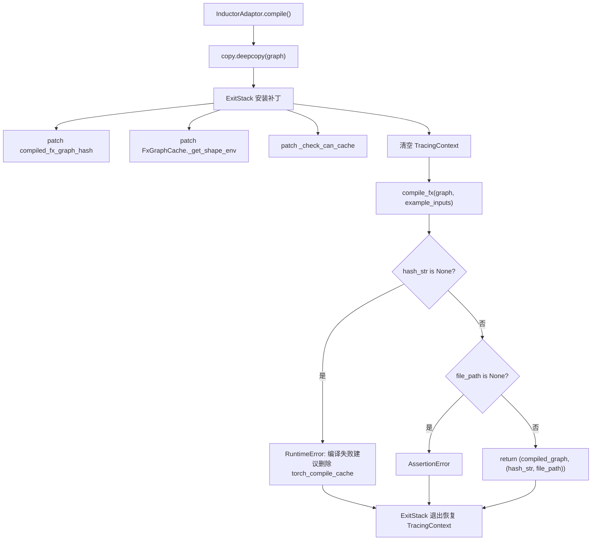
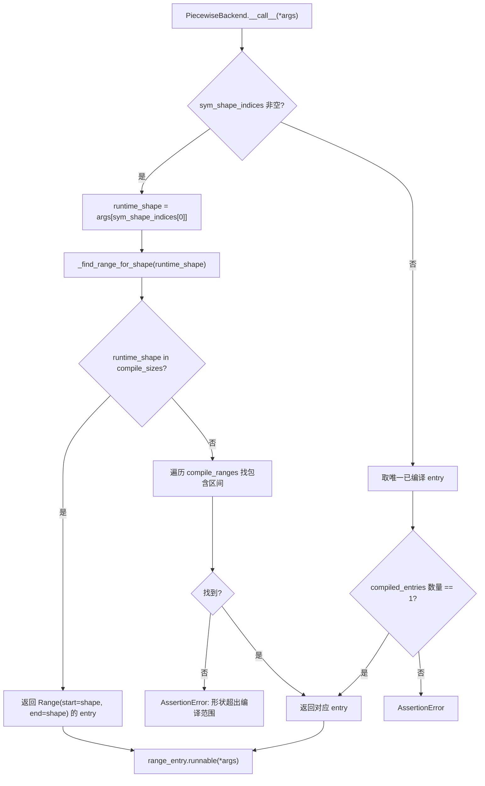

# Chapter 10: Compilation Acceleration and CUDA Graph: Eliminating Launch and Scheduling Overhead

In the previous chapter, we saw how the KV Connector efficiently moves KV cache between Prefill and Decode engines via connectors such as NIXL and Mooncake, enabling the disaggregated architecture to reduce TTFT while improving resource utilization. But no matter how fast the transfer, autoregressive decoding still has two fixed costs that cannot be eliminated by algorithms: the scheduling overhead of the Python interpreter and the launch overhead of GPU kernels. When the model forward pass is split into hundreds of operators, each requiring a Python function call and a CUDA kernel launch, the CPU-side overhead is enough to leave the GPU idle between computations. This chapter analyzes how vLLM uses torch.compile to fuse operators into a static graph, then uses CUDA Graph to record the entire kernel launch sequence into a single replay, thereby driving these two types of overhead close to zero.

# Compilation Cache and Compiler Adaptation Layer: Enabling Cross-Process Reuse of Compilation Results

## Intuitive Model

The benefit of compilation acceleration is "compile once, run many times," but the cost is that the first compilation may take several minutes. Without caching, every service restart would require recompilation, and cold start time would be unacceptable.`CompilerInterface`This layer addresses exactly the problem of "how compilation artifacts are serialized, how they are identified by hash, and how they are precisely hit on the next startup." Without it, the disaster the system faces is not a crash, but degradation to "first run" on every restart—in an auto-scaling production environment, this means newly scaled instances cannot provide low-latency service for several minutes.

## Data Structures and Interface Contracts

`CompilerInterface`defines the abstract contract of the compiler adapter, with four core methods:`initialize_cache`is responsible for redirecting the compiler's own cache directory under vLLM's cache directory[FACT:vllm/compilation/compiler_interface.py:36-51]；`compute_hash`collects compiler-related configuration information to generate a hash[FACT:vllm/compilation/compiler_interface.py:53-62]；`compile`executes compilation and returns a callable object and a handle[FACT:vllm/compilation/compiler_interface.py:64-95]；`load`restores compilation artifacts from the handle[FACT:vllm/compilation/compiler_interface.py:97-103]。

The key design here is`compile`returns a two-tuple`(callable, handle)`。`callable`is the compilation result directly callable within the current process;`handle`is the credential "used to restore on the next startup," and the documentation explicitly requires it to be a "plain Python object, preferably a string or a file path"[FACT:vllm/compilation/compiler_interface.py:81-81]. This separation allows the cache-hit path and the first-compilation path to follow completely different code—on a hit, there is no need for`compile`, only`load`。

`compile_range`The parameter carries the semantics of dynamic shapes. The comment states that it "could be concrete size (if compile_sizes is provided), e.g. [4, 4] or a range [5, 8]," and that "Right now we only support one variable in ranges for all inputs, which is the batchsize (number of tokens) during inference"[FACT:vllm/compilation/compiler_interface.py:74-74]. This is the core constraint of vLLM's compilation strategy: all dynamic shapes are reduced to a single variable—the number of tokens.

## Scenario-Driven: The Complete Flow of a Compilation Request

Suppose the service starts for the first time,`InductorAdaptor.compile`is called. It first increments the compilation counter[FACT:vllm/compilation/compiler_interface.py:477-489], then enters a carefully constructed patch stack.

The first step is to deep-copy the graph. The comment states that "inductor can inplace modify the graph, so we need to copy it"[FACT:vllm/compilation/compiler_interface.py:500-502], which is a defensive design—if compilation fails, the original graph can still be used for retry.

The second step is to install a series of monkey-patches.`hijacked_compile_fx_inner`wraps Inductor's internal compilation function, and after compilation completes, grabs the hash from`inductor_compiled_graph._fx_graph_cache_key`[FACT:vllm/compilation/compiler_interface.py:512-536]。`hijack_compiled_fx_graph_hash`intercepts the hash computation function itself[FACT:vllm/compilation/compiler_interface.py:538-542]. Why "hijack" the hash? Because vLLM needs to compile separately outside the Dynamo tracing context, while Inductor's hash computation depends on that context.

The third step is`_check_can_cache`patch, it directly returns without performing any checks[FACT:vllm/compilation/compiler_interface.py:544-551]. The comment explains the motivation: "Inductor refuses to cache the graph outside of Dynamo tracing context, and also disables caching for graphs with high-order ops. For vLLM, in either case, we want to cache the graph"[FACT:vllm/compilation/compiler_interface.py:544-551]。

The fourth step is cleaning up the tracing context. This is the most subtle part: vLLM calls`PiecewiseCompileInterpreter`from within`compile_fx`, at which point Dynamo's`FakeTensorMode`is inconsistent with the subgraph input's`FakeTensorMode`,`detect_fake_mode()`will cause an assertion failure[FACT:vllm/compilation/compiler_interface.py:615-622]. The code saves`TracingContext`then sets it to null, and registers a callback to restore it on exit[FACT:vllm/compilation/compiler_interface.py:623-630]。

## Design considerations: AlwaysHitShapeEnv and cache consistency

`AlwaysHitShapeEnv`This class deserves a separate analysis. Its docstring plainly states the motivation: vLLM only runs Dynamo bytecode compilation once, but needs to run Inductor compilation multiple times with different shapes plus one generic shape; shape-specific compilation happens outside the Dynamo context, where no shape environment is available to Inductor, causing Inductor code cache lookup failures[FACT:vllm/compilation/compiler_interface.py:114-131]。

The solution is to provide an "always hit" fake shape environment:`evaluate_guards_expression`always returns`True` [FACT:vllm/compilation/compiler_interface.py:144-145]，`get_pruned_guards`returns an empty list[FACT:vllm/compilation/compiler_interface.py:144-145]，`produce_guards_expression`returns an empty string[FACT:vllm/compilation/compiler_interface.py:147-159]. The comment candidly admits these methods are "obtained by trial-and-error until it works"[FACT:vllm/compilation/compiler_interface.py:137-142]—this is a fragile point coupled with PyTorch's internal implementation, and also the most error-prone area when upgrading PyTorch.

The composition of the cache hash is equally critical.`get_inductor_factors`collects three categories of factors: system state`CacheBase.get_system()`, PyTorch state`torch_key()`, and Inductor and functorch configurations[FACT:vllm/compilation/compiler_interface.py:165-185]. Note that functorch configuration is collected within the`patch(_get_vllm_functorch_config())`context[FACT:vllm/compilation/compiler_interface.py:188-189], which ensures "compile-time configuration and cache key are always consistent"—the comment explicitly states this is to keep`set_functorch_config()`and`get_inductor_factors()`consistent[FACT:vllm/compilation/compiler_interface.py:147-159]. If these two are inconsistent, there will be a mismatch where "configuration A was used at compile time but the cache key was computed according to configuration B," causing a cache hit that loads the wrong artifact.

Production pitfalls:`_patch_standalone_compile_atomic_save`is a backport for torch < 2.10.0[FACT:vllm/compilation/compiler_interface.py:205-243]. It changes`CompiledArtifact.save()`to use`write_atomic`to write in binary format, with the comment stating the purpose is "preventing corrupt cache files when multiple processes compile concurrently"[FACT:vllm/compilation/compiler_interface.py:208-210]. In scenarios where multiple replicas cold-start simultaneously, multiple processes will concurrently write to the same cache file; non-atomic writes produce truncated files, and subsequent processes reading corrupted artifacts will behave unpredictably.

# PiecewiseBackend: shape-bucketed compilation and runtime dispatch

## Intuitive model

`PiecewiseBackend`is the scheduling hub between compilation and execution. It compiles "one FX subgraph" into "callable objects for multiple shape buckets," and at runtime selects the most appropriate one based on the actual token count. Without it, either all shapes go through the same generic compilation (suboptimal performance), or each shape is compiled separately (compilation time explodes).

## Data structures: RangeEntry and compilation ranges

The core data structure is`RangeEntry`, which binds the`compile_range`、`compiled`flag and`runnable`together[FACT:vllm/compilation/piecewise_backend.py:80-83]。`PiecewiseBackend`maintains a`range_entries: dict[Range, RangeEntry]` [FACT:vllm/compilation/piecewise_backend.py:166-171]。

The construction of compilation ranges is done in two steps. First, handle`compile_sizes`(exact sizes), generating a single-point interval of`Range(start=size, end=size)`for each size[FACT:vllm/compilation/piecewise_backend.py:166-171]. Note that for the string`"cudagraph_capture_sizes"`it directly throws`NotImplementedError`, and states "should be handled in`post_init_cudagraph_sizes`" [FACT:vllm/compilation/piecewise_backend.py:166-171]—this is an explicit declaration of responsibility boundaries. Then handle`compile_ranges`(intervals), generating one entry per interval[FACT:vllm/compilation/piecewise_backend.py:173-173]。

`PiecewiseBackend`supports two mutually exclusive modes, and the constructor enforces this with an XOR assertion[FACT:vllm/compilation/piecewise_backend.py:117-119]: compilation mode (has graph, no compiled_runnables) goes through`compile_all_ranges()` [FACT:vllm/compilation/piecewise_backend.py:193-194]; precompiled mode (no graph, has compiled_runnables) goes through`load_all_ranges()` [FACT:vllm/compilation/piecewise_backend.py:193-194]. This design allows cold start and warm start to share the same class, with only the data source differing.

## Scenario-driven: from compilation to runtime dispatch

**Compilation phase**：`compile_all_ranges`iterates over all range entries, calling`_log_compile_start`for each uncompiled entry[FACT:vllm/compilation/piecewise_backend.py:252-256]records tracing events`create_concrete_args`. The key branch is in parameter construction: if it is a single-point size, call[FACT:vllm/compilation/piecewise_backend.py:258-261]to generate a FakeTensor of the specific shape`get_fake_args_from_graph`; otherwise call[FACT:vllm/compilation/piecewise_backend.py:262-263]。

`create_concrete_args`to directly reuse the placeholder metadata from the graph`ShapeEnv`The implementation reveals the details of symbolic shape concretization. It constructs a`FakeTensorMode` [FACT:vllm/compilation/piecewise_backend.py:54]with`SymInt`, then iterates over placeholder nodes. For inputs of type`concretize`, use`size` [FACT:vllm/compilation/piecewise_backend.py:47-52]to replace all free symbols with`Tensor`; for type`compute_required_storage_length`, it must simultaneously concretize shape, stride, and storage_offset, and use`as_strided`to compute the required storage length, then reconstruct the tensor via[FACT:vllm/compilation/piecewise_backend.py:64-73]. Why can't we just change the shape? Because stride and storage_offset may also contain symbols, and the three must be self-consistent, otherwise`as_strided`will go out of bounds.

**Runtime dispatch**：`__call__`is a hot path. If`sym_shape_indices`exists, retrieve the runtime shape from`args`, then call[FACT:vllm/compilation/piecewise_backend.py:357-362]to look up. The lookup logic has priority: first check whether an exact`_find_range_for_shape`is hit; if so, return that single-point range`compile_sizes`; otherwise iterate over[FACT:vllm/compilation/piecewise_backend.py:342-355]to find the range containing that shape`compile_ranges`Copy[FACT:vllm/compilation/piecewise_backend.py:342-355]。

## [Design inference and architectural trade-offs]

> **[Design Inference & Architectural Trade-offs]**
> `to_bytes`method is responsible for serializing compilation artifacts for AOT caching. There is an elegant`reducer_override`here: when pickle encounters`CachingAutotuner`, it first calls`obj.prepare_for_pickle()`and then serializes[FACT:vllm/compilation/piecewise_backend.py:209-218]. Why is this hook needed?`CachingAutotuner`internally holds Triton compilation artifacts and runtime state; direct pickling may fail or produce non-reusable objects;`prepare_for_pickle`obviously converts the object into a serializable, pure form.

During serialization,`bundled_autograd_cache` [FACT:vllm/compilation/piecewise_backend.py:222]is also temporarily enabled, which echoes the logic in`_get_vllm_functorch_config`—when`VLLM_USE_MEGA_AOT_ARTIFACT`is not enabled, this config is`False` [FACT:vllm/compilation/compiler_interface.py:160-161], while during serialization it is forced to`True`, ensuring the artifacts are packaged.

`load_all_ranges`is the warm-start path; it asserts that every range can find a corresponding key in`compiled_runnables`, otherwise it throws an error containing the list of available keys[FACT:vllm/compilation/piecewise_backend.py:329-339]. This error message is designed very practically—it directly lists the available keys, making it easy to troubleshoot cache version mismatches.

# CUDA Graph wrapper: capture, replay, and nested dispatch

## Intuitive model

CUDA Graph records "a sequence of kernel launches" into a static graph, and thereafter each replay requires only one API call.`CUDAGraphWrapper`is the executor of recording and replay. Its core challenge is: vLLM's batch size is dynamic, while CUDA Graph requires fixed input addresses. The solution is "capture by batch descriptor tiers"—record one graph per shape tier, and at runtime look up and replay by descriptor.

## Data structures: CUDAGraphEntry and dispatch contract

`CUDAGraphEntry`holds three key fields:`batch_descriptor`as the dispatch key[FACT:vllm/compilation/cuda_graph.py:128-135]、`cudagraph`is the captured graph object[FACT:vllm/compilation/cuda_graph.py:128-135]、`output`is the output at capture time (stored as a weak reference to save memory)[FACT:vllm/compilation/cuda_graph.py:128-135]。`input_addresses`is used only in debug mode to verify that input addresses match during replay[FACT:vllm/compilation/cuda_graph.py:128-135]。

`CUDAGraphWrapper`The class documentation of precisely describes the dispatch contract: at initialization, allocate a runtime mode (FULL or PIECEWISE)[FACT:vllm/compilation/cuda_graph.py:158-158]; at runtime, receive runtime_mode and batch_descriptor from the forward context and "blindly trust them"[FACT:vllm/compilation/cuda_graph.py:158-158]; if runtime_mode is NONE or does not match, directly call[FACT:vllm/compilation/cuda_graph.py:158-158]; otherwise perform capture or replay[FACT:vllm/compilation/cuda_graph.py:158-158]。

The documentation also specifically declares a boundary: "CUDAGraphWrapper does not store persistent buffers or copy any runtime inputs into that buffers for replay"[FACT:vllm/compilation/cuda_graph.py:164-164]. This means input buffer management is the caller's responsibility—the wrapper is only responsible for the graph itself.

## Scenario-driven: one capture and one replay

**Capture path**: when`__call__`is triggered and runtime_mode matches, first check whether the forward context is available. If not available (such as the forward pass of a vision encoder), directly call the underlying function[FACT:vllm/compilation/cuda_graph.py:232-233]. This is a key branch in multimodal scenarios—the ViT forward pass does not go through CUDA Graph.

Next, retrieve`batch_descriptor`and`cudagraph_runtime_mode` [FACT:vllm/compilation/cuda_graph.py:242-244]. If mode is NONE or does not match, directly call[FACT:vllm/compilation/cuda_graph.py:246-256]. This "pass through on mismatch" design allows nested wrappers to coexist: the FULL wrapper on the outside and the PIECEWISE wrapper on the inside, with only one activated at runtime.

If the entry's`cudagraph`is None, enter capture. First call`validate_cudagraph_capturing_enabled()`to validate legality[FACT:vllm/compilation/cuda_graph.py:279], then record the input address[FACT:vllm/compilation/cuda_graph.py:281-284], create`torch.cuda.CUDAGraph()` [FACT:vllm/compilation/cuda_graph.py:285]。

There are several key operations in the capture context. If`gc_disable`is enabled, patch out`gc.collect`and`torch.accelerator.empty_cache` [FACT:vllm/compilation/cuda_graph.py:288-303]. The comment explains the reason: in piecewise mode, each layer must capture a graph, and repeated GC would make capture extremely slow, so "only run gc for the first graph, and disable gc for the rest"[FACT:vllm/compilation/cuda_graph.py:289-294]. Next, set the graph pool id[FACT:vllm/compilation/cuda_graph.py:305-308], and synchronize the offloader's copy stream[FACT:vllm/compilation/cuda_graph.py:310-312]。

The actual capture is executed in the`torch.cuda.graph(cudagraph, pool=..., stream=...)`context`self.runnable(*args, **kwargs)` [FACT:vllm/compilation/cuda_graph.py:315-321]. After capture, call`get_offloader().join_after_forward()`to avoid unjoined stream errors[FACT:vllm/compilation/cuda_graph.py:322-326]. If`weak_ref_output`is enabled, convert output to a weak reference to save memory[FACT:vllm/compilation/cuda_graph.py:327-334]. Finally, the entry saves the weak-reference output and the graph object[FACT:vllm/compilation/cuda_graph.py:338-339], but**returns the original output rather than the weak reference**—the comment emphasizes that this is to let PyTorch correctly manage memory during capture[FACT:vllm/compilation/cuda_graph.py:343-346]。

**Replay path**: if the entry already has a graph, verify that input addresses match in debug mode[FACT:vllm/compilation/cuda_graph.py:348-357], then synchronize the offloader[FACT:vllm/compilation/cuda_graph.py:359-361], call`entry.cudagraph.replay()`and return`entry.output` [FACT:vllm/compilation/cuda_graph.py:362-363]。

## Design consideration: Why should the output be a weak reference while the return should be a strong reference

This is`CUDAGraphWrapper`One of the most counterintuitive points in`output`is managed by PyTorch's cudagraph pool during capture[FACT:vllm/compilation/cuda_graph.py:320]. If the entry strongly references the output, the GPU memory occupied by this graph can never be released; but if it is converted to a weak reference during capture, PyTorch may reclaim the memory before capture completes, causing capture to fail. Therefore, the code uses a weak reference inside the capture block[FACT:vllm/compilation/cuda_graph.py:334], stores a weak reference in the entry[FACT:vllm/compilation/cuda_graph.py:338], but the function return value is a strong reference[FACT:vllm/compilation/cuda_graph.py:346]. This "triple reference state" is a precise balance between memory safety and GPU memory efficiency.

Another noteworthy design is`_all_instances`this`WeakSet` [FACT:vllm/compilation/cuda_graph.py:173-176]. It allows`clear_all_graphs`to clear all wrapper graphs at once[FACT:vllm/compilation/cuda_graph.py:173-176], used for emergency reclamation when GPU memory is tight. Using`WeakSet`instead of a normal set is to avoid preventing wrappers from being GC'd - otherwise the wrappers themselves would leak.

Production pitfalls:`__getattr__`'s implementation throws an error with context for nonexistent attributes in debug mode[FACT:vllm/compilation/cuda_graph.py:211-217]. This seems trivial, but when troubleshooting "why a certain method call failed," being able to see the string description of the runnable wrapped by the wrapper is much more useful than bare`AttributeError`.

# Design consideration: Decoupling compilation from CUDA Graph

The design document clearly records the motivation for this refactor. Early piecewise compilation was intended to support piecewise CUDA Graph capture, excluding operators that do not support CUDA Graph (mainly attention)[FACT:docs/design/cuda_graphs.md:25]. Later, full CUDA Graph support was added, but "this tight coupling between compilation and cudagraph capture led to an all-or-nothing experience with little flexibility"[FACT:docs/design/cuda_graphs.md:25]。

The refactored goals are fourfold: explicitly distinguish prefill/mixed and uniform-decode batches and capture them separately[FACT:docs/design/cuda_graphs.md:25-25]; decouple CUDA Graph capture logic from compilation, so that "capturing piecewise and full cudagraphs using the same compiled graph"[FACT:docs/design/cuda_graphs.md:25-25]; dispatch at runtime based on batch composition[FACT:docs/design/cuda_graphs.md:25-25]; centralize control to reduce complexity[FACT:docs/design/cuda_graphs.md:25-25]。

`BatchDescriptor`is the core structure of the dispatch key, containing`num_tokens`、`num_reqs`、`uniform`、`has_lora`four fields[FACT:docs/design/cuda_graphs.md:86-93]。`uniform`The flag is especially critical - many attention backends only support full CUDA Graph when the batch is uniform[FACT:docs/design/cuda_graphs.md:95-95]. The document also anticipates that this structure may be extended, for example by adding`uniform_query_len`to support multiple uniform decode lengths[FACT:docs/design/cuda_graphs.md:95-95]。

The dispatch priority is`FULL > PIECEWISE > None`, and if the dispatch key does not exist, it falls back to NONE mode for eager execution[FACT:docs/design/cuda_graphs.md:112-115]. This "degrade rather than error" strategy ensures that any batch combination can execute, just with different performance.

`AttentionCGSupport`The enum quantifies the backend's CUDA Graph capability, with values`ALWAYS=3 > UNIFORM_BATCH=2 > UNIFORM_SINGLE_TOKEN_DECODE=1 > NEVER=0` [FACT:docs/design/cuda_graphs.md:153-162]. Hybrid attention models (such as mamba mixer) take the minimum capability across all backends and downgrade the CUDA Graph mode accordingly[FACT:docs/design/cuda_graphs.md:173-175]. This design decouples "capability declaration" from "mode selection" - adding a new backend only requires declaring capabilities, and the downgrade strategy takes effect automatically.

# Chapter summary

# Chapter review and self-test

Q1: If the`_check_can_cache`patch ([FACT:vllm/compilation/compiler_interface.py:544-551]) is removed and Inductor is allowed to decide whether to cache on its own, in what scenarios would the compilation cache become invalid? Why does the comment say "Inductor refuses to cache the graph outside of Dynamo tracing context"?

**Reference analysis**：`_check_can_cache`returns directly without any checks, and the comment explains that Inductor refuses to cache in two cases: one is outside the Dynamo tracing context, and the other is when the graph contains higher-order operators[FACT:vllm/compilation/compiler_interface.py:544-551]. vLLM's compilation flow is precisely outside the Dynamo context (`compile_fx`is called by`PiecewiseCompileInterpreter`, and the code explicitly clears`TracingContext` [FACT:vllm/compilation/compiler_interface.py:623-625]). If the patch is removed, Inductor will determine that it is "not cacheable," recompiling on every startup, degrading cold start time from seconds to minutes. More subtly, because vLLM relies on`hijacked_compile_fx_inner`to capture`hash_str`, if the cache path is skipped,`hash_str`may be None, triggering[FACT:vllm/compilation/compiler_interface.py:640-652]'s RuntimeError. This explains why the comment emphasizes "vLLM today assumes and requires the monkey-patched functions to get hit"[FACT:vllm/compilation/compiler_interface.py:596-598]。

Q2: `CUDAGraphWrapper`converts output to a weak reference and stores it in the entry during capture ([FACT:vllm/compilation/cuda_graph.py:338]), but returns a strong reference ([FACT:vllm/compilation/cuda_graph.py:346]). If the return value were also changed to a weak reference, in what scenarios would it crash?

**Reference analysis**: During capture`output`is managed by PyTorch's cudagraph pool[FACT:vllm/compilation/cuda_graph.py:320]. If the return value is a weak reference, the object obtained by the caller may be immediately reclaimed by GC after the capture block exits—because at that point no strong reference holds it. During capture, PyTorch needs the output to stay alive in order to correctly establish the memory pool mapping; once it is reclaimed, during subsequent replay`entry.output`the weak reference pointed to has become invalid,`replay()`and the object returned afterward may have already been overwritten or freed. The comment explicitly says "we need to return the output, rather than the weak ref of the output, so that pytorch can correctly manage the memory during cuda graph capture"[FACT:vllm/compilation/cuda_graph.py:343-345]. This design is a precise balance of "strong reference during capture, weak reference during storage."

Q3: In`PiecewiseBackend._find_range_for_shape`（[FACT:vllm/compilation/piecewise_backend.py:342-355]), exact-size lookup takes precedence over interval lookup. Suppose`compile_sizes=[8]`、`compile_ranges=[Range(1,16)]`, at runtime shape=8, which entry will be hit? If the priority were reversed, what consequences would there be?

**Reference analysis**: The current logic first checks`runtime_shape in self.compile_sizes`, and if it hits, returns`Range(start=8, end=8)`'s single-point entry[FACT:vllm/compilation/piecewise_backend.py:342-355]. This entry is compiled with`create_concrete_args`, the shape is fully concretized, and the Triton kernel can perform the greatest degree of specialization (such as`set_inductor_config`where a single-point size enables`max_autotune` [FACT:vllm/compilation/compiler_interface.py:747-754]). If the priority were reversed, shape=8 would hit the entry for interval`Range(1,16)`—that is a generic version compiled with symbolic shapes, with suboptimal performance. More seriously,`compile_sizes`usually comes from`cudagraph_capture_sizes`, and these sizes are exactly the tiers that CUDA Graph wants to capture; if at runtime it dispatches to the generic entry, the graph captured by CUDA Graph will be inconsistent with the dispatched runnable, which may cause a shape mismatch during replay. Therefore, exact-first is not only a performance choice, but also a correctness requirement.

The next chapter will turn to quantization and custom kernels, looking at how vLLM intervenes in precision control starting from the weight loading stage, and uses highly specialized operators to truly convert quantization gains into throughput improvements.

This chapter analyzed the two-layer mechanism of vLLM compilation acceleration. The first layer is CompilerInterface and PiecewiseBackend: the former defines the compiler adaptation contract and cache hashing strategy, using AlwaysHitShapeEnv to bypass the problem of a missing Dynamo context; the latter compiles a single FX subgraph into multiple shape tiers and dispatches at runtime according to the number of tokens. The second layer is CUDAGraphWrapper: it captures CUDA Graphs by tier according to BatchDescriptor, and implements nested dispatch through runtime mode matching, allowing FULL and PIECEWISE modes to coexist on the same compiled graph. The decoupling of the two is the core of this refactor—the compilation artifact can be reused by both CUDA Graph modes, and CUDA Graph can also work independently of compilation. However, compilation and graph capture solve scheduling overhead, while the model's own weight precision and operator efficiency remain another main optimization line. The next chapter will turn to quantization and custom kernels, looking at how vLLM parses quantization configurations, completes format conversion such as FP8/INT4/AWQ/GPTQ during weight loading, and further squeezes hardware performance with the help of _custom_ops and Triton kernels.
