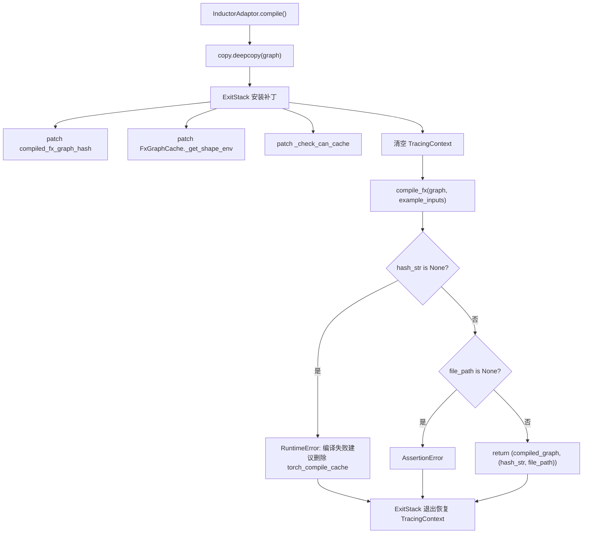
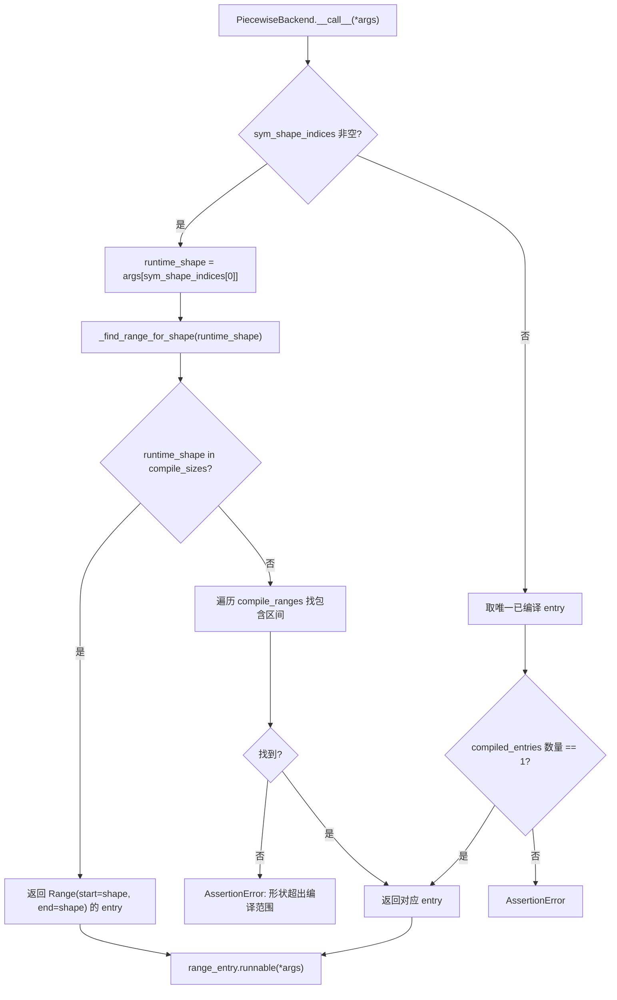

# Chapter 10: Model Quantization: AWQ, GPTQ, FP8 & Optimized GEMM Kernels

上一章我们看到，KV Connector 通过 NIXL、Mooncake 等连接器在 Prefill 与 Decode 引擎之间高效搬运 KV cache，让分离式架构在降低 TTFT 的同时提升了资源利用率。但即便传输再快，自回归解码中仍有两项无法靠算法消除的固定成本：Python 解释器的调度开销与 GPU 内核的启动开销。当模型前向被拆成数百个算子，每个算子都要经历一次 Python 函数调用和一次 CUDA 内核启动时，CPU 侧的开销足以让 GPU 在两次计算之间空转。本章剖析 vLLM 如何用 torch.compile 把算子融合成静态图，再用 CUDA Graph 把整段内核启动序列录制成一次重放，从而把这两类开销压到接近零。

## Intuitive Architectural Model

编译加速的收益是"一次编译、多次运行"，但代价是首次编译耗时可能长达数分钟。如果没有缓存，每次服务重启都要重新编译，冷启动时间无法接受。`CompilerInterface` 这一层要解决的正是"编译产物如何序列化、如何用哈希标识、如何在下次启动时精确命中"的问题。若没有它，系统面临的灾难不是崩溃，而是每次重启都退化成"首次运行"——在自动扩缩容的生产环境中，这意味着扩容出来的实例在数分钟内无法提供低延迟服务。

## 数据结构与接口契约

`CompilerInterface` 定义了编译器适配器的抽象契约，核心是四个方法：`initialize_cache` 负责把编译器自身的缓存目录重定向到 vLLM 的缓存目录下 [FACT:vllm/compilation/compiler_interface.py:36-51]；`compute_hash` 收集编译器相关的配置信息生成哈希 [FACT:vllm/compilation/compiler_interface.py:53-62]；`compile` 执行编译并返回可调用对象与句柄 [FACT:vllm/compilation/compiler_interface.py:64-95]；`load` 从句柄恢复编译产物 [FACT:vllm/compilation/compiler_interface.py:97-103]。

这里的关键设计是 `compile` 返回一个二元组 `(callable, handle)`。`callable` 是本次进程内可直接调用的编译结果；`handle` 是"下次启动时用来恢复"的凭证，文档明确要求它应当是"plain Python object, preferably a string or a file path" [FACT:vllm/compilation/compiler_interface.py:81-81]。这个分离让缓存命中路径与首次编译路径可以走完全不同的代码——命中时根本不需要 `compile`，只需要 `load`。

`compile_range` 参数承载了动态形状的语义。注释说明它"could be concrete size (if compile_sizes is provided), e.g. [4, 4] or a range [5, 8]"，且"Right now we only support one variable in ranges for all inputs, which is the batchsize (number of tokens) during inference" [FACT:vllm/compilation/compiler_interface.py:74-74]。这是 vLLM 编译策略的核心约束：所有动态形状被归约为单一变量——token 数。

## 场景驱动：一次编译请求的完整流转

假设服务首次启动，`InductorAdaptor.compile` 被调用。它首先递增编译计数器 [FACT:vllm/compilation/compiler_interface.py:477-489]，然后进入一个精心构造的补丁栈。

第一步是深拷贝图。注释指出"inductor can inplace modify the graph, so we need to copy it" [FACT:vllm/compilation/compiler_interface.py:500-502]，这是防御性设计——编译失败后原图仍可用于重试。

第二步是安装一系列 monkey-patch。`hijacked_compile_fx_inner` 包装了 Inductor 的内部编译函数，在编译完成后从 `inductor_compiled_graph._fx_graph_cache_key` 抓取哈希 [FACT:vllm/compilation/compiler_interface.py:512-536]。`hijack_compiled_fx_graph_hash` 则拦截哈希计算函数本身 [FACT:vllm/compilation/compiler_interface.py:538-542]。为什么要"劫持"哈希？因为 vLLM 需要在 Dynamo 追踪上下文之外单独编译，而 Inductor 的哈希计算依赖该上下文。

第三步是 `_check_can_cache` 补丁，它直接返回、不做任何检查 [FACT:vllm/compilation/compiler_interface.py:544-551]。注释解释了动机："Inductor refuses to cache the graph outside of Dynamo tracing context, and also disables caching for graphs with high-order ops. For vLLM, in either case, we want to cache the graph" [FACT:vllm/compilation/compiler_interface.py:544-551]。

第四步是清理追踪上下文。这是最微妙的一处：vLLM 从 `PiecewiseCompileInterpreter` 内部调用 `compile_fx`，此时 Dynamo 的 `FakeTensorMode` 与子图输入的 `FakeTensorMode` 不一致，`detect_fake_mode()` 会断言失败 [FACT:vllm/compilation/compiler_interface.py:615-622]。代码保存 `TracingContext` 后将其置空，并注册回调在退出时恢复 [FACT:vllm/compilation/compiler_interface.py:623-630]。

## 设计思考：AlwaysHitShapeEnv 与缓存一致性

`AlwaysHitShapeEnv` 这个类值得单独剖析。它的文档字符串直白地说明了动机：vLLM 只运行一次 Dynamo 字节码编译，但要用不同形状加一个通用形状多次运行 Inductor 编译；针对特定形状的编译发生在 Dynamo 上下文之外，此时没有 shape environment 提供给 Inductor，会导致 Inductor 代码缓存查找失败 [FACT:vllm/compilation/compiler_interface.py:114-131]。

解决方案是提供一个"永远命中"的假 shape environment：`evaluate_guards_expression` 恒返回 `True` [FACT:vllm/compilation/compiler_interface.py:144-145]，`get_pruned_guards` 返回空列表 [FACT:vllm/compilation/compiler_interface.py:144-145]，`produce_guards_expression` 返回空字符串 [FACT:vllm/compilation/compiler_interface.py:147-159]。注释坦承这些方法是"obtained by trial-and-error until it works" [FACT:vllm/compilation/compiler_interface.py:137-142]——这是与 PyTorch 内部实现耦合的脆弱点，也是升级 PyTorch 时最易出问题的地方。

缓存哈希的构成同样关键。`get_inductor_factors` 收集三类因子：系统状态 `CacheBase.get_system()`、PyTorch 状态 `torch_key()`、以及 Inductor 与 functorch 的配置 [FACT:vllm/compilation/compiler_interface.py:165-185]。注意 functorch 配置是在 `patch(_get_vllm_functorch_config())` 上下文中采集的 [FACT:vllm/compilation/compiler_interface.py:188-189]，这保证了"编译时配置与缓存键始终一致"——注释明确说这是为了让 `set_functorch_config()` 和 `get_inductor_factors()` 保持一致 [FACT:vllm/compilation/compiler_interface.py:147-159]。如果这两处不一致，就会出现"编译时用了配置 A、缓存键按配置 B 计算"的错配，导致缓存命中却加载了错误的产物。

生产踩坑：`_patch_standalone_compile_atomic_save` 是针对 torch < 2.10.0 的 backport [FACT:vllm/compilation/compiler_interface.py:205-243]。它把 `CompiledArtifact.save()` 改为用 `write_atomic` 写二进制格式，注释说明目的是"preventing corrupt cache files when multiple processes compile concurrently" [FACT:vllm/compilation/compiler_interface.py:208-210]。在多副本同时冷启动的场景下，多个进程会并发写同一个缓存文件，非原子写会产生半截文件，后续进程读到损坏产物后行为不可预测。

## Intuitive Architectural Model

`PiecewiseBackend` 是编译与执行之间的调度中枢。它把"一个 FX 子图"编译成"多个形状档位的可调用对象"，并在运行时根据实际 token 数选择最合适的那一个。若没有它，要么所有形状都走同一个通用编译（性能次优），要么每个形状都单独编译（编译时间爆炸）。

## 数据结构：RangeEntry 与编译范围

核心数据结构是 `RangeEntry`，它把 `compile_range`、`compiled` 标志和 `runnable` 绑定在一起 [FACT:vllm/compilation/piecewise_backend.py:80-83]。`PiecewiseBackend` 维护一个 `range_entries: dict[Range, RangeEntry]` [FACT:vllm/compilation/piecewise_backend.py:166-171]。

编译范围的构造分两步。首先处理 `compile_sizes`（精确尺寸），每个尺寸生成一个 `Range(start=size, end=size)` 的单点区间 [FACT:vllm/compilation/piecewise_backend.py:166-171]。注意这里对字符串 `"cudagraph_capture_sizes"` 直接抛 `NotImplementedError`，并说明"should be handled in `post_init_cudagraph_sizes`" [FACT:vllm/compilation/piecewise_backend.py:166-171]——这是一个显式的职责边界声明。然后处理 `compile_ranges`（区间），每个区间生成一个 entry [FACT:vllm/compilation/piecewise_backend.py:173-173]。

`PiecewiseBackend` 支持两种互斥模式，构造函数用异或断言强制这一点 [FACT:vllm/compilation/piecewise_backend.py:117-119]：编译模式（有 graph，无 compiled_runnables）走 `compile_all_ranges()` [FACT:vllm/compilation/piecewise_backend.py:193-194]；预编译模式（无 graph，有 compiled_runnables）走 `load_all_ranges()` [FACT:vllm/compilation/piecewise_backend.py:193-194]。这个设计让冷启动与热启动共享同一个类，只是数据来源不同。

## 场景驱动：从编译到运行时派发

**编译阶段**：`compile_all_ranges` 遍历所有 range entry，对每个未编译的 entry 调用 `_log_compile_start` 记录追踪事件 [FACT:vllm/compilation/piecewise_backend.py:252-256]。关键分支在参数构造：如果是单点尺寸，调用 `create_concrete_args` 生成具体形状的 FakeTensor [FACT:vllm/compilation/piecewise_backend.py:258-261]；否则调用 `get_fake_args_from_graph` 直接复用图中的 placeholder 元数据 [FACT:vllm/compilation/piecewise_backend.py:262-263]。

`create_concrete_args` 的实现揭示了符号形状具体化的细节。它构造一个带 `ShapeEnv` 的 `FakeTensorMode` [FACT:vllm/compilation/piecewise_backend.py:54]，然后遍历 placeholder 节点。对 `SymInt` 类型的输入，用 `concretize` 把所有自由符号替换为 `size` [FACT:vllm/compilation/piecewise_backend.py:47-52]；对 `Tensor` 类型，则要同时具体化 shape、stride、storage_offset，并用 `compute_required_storage_length` 算出所需存储长度，再通过 `as_strided` 重建张量 [FACT:vllm/compilation/piecewise_backend.py:64-73]。为什么不能只改 shape？因为 stride 和 storage_offset 也可能含符号，且三者必须自洽，否则 `as_strided` 会越界。

**运行时派发**：`__call__` 是热路径。如果存在 `sym_shape_indices`，从 `args` 中取出运行时形状 [FACT:vllm/compilation/piecewise_backend.py:357-362]，然后调用 `_find_range_for_shape` 查找。查找逻辑有优先级：先看是否命中精确的 `compile_sizes`，命中则返回该单点区间 [FACT:vllm/compilation/piecewise_backend.py:342-355]；否则遍历 `compile_ranges` 找包含该形状的区间 [FACT:vllm/compilation/piecewise_backend.py:342-355]。

## 设计思考：序列化与 CachingAutotuner 的特殊处理

> **〔Design Inference & Architectural Trade-offs〕**
> `to_bytes` 方法负责把编译产物序列化，用于 AOT 缓存。这里有一个精妙的 `reducer_override`：当 pickle 遇到 `CachingAutotuner` 时，先调用 `obj.prepare_for_pickle()` 再序列化 [FACT:vllm/compilation/piecewise_backend.py:209-218]。为什么需要这个钩子？ `CachingAutotuner` 内部持有 Triton 编译产物和运行时状态，直接 pickle 可能失败或产生不可复用的对象；`prepare_for_pickle` 显然是把对象转换成可序列化的纯净形态。

序列化时还临时开启 `bundled_autograd_cache` [FACT:vllm/compilation/piecewise_backend.py:222]，这与 `_get_vllm_functorch_config` 中的逻辑呼应——当 `VLLM_USE_MEGA_AOT_ARTIFACT` 未启用时该配置为 `False` [FACT:vllm/compilation/compiler_interface.py:160-161]，序列化时则强制为 `True`，确保产物被打包。

`load_all_ranges` 是热启动路径，它断言每个 range 都能在 `compiled_runnables` 中找到对应 key，否则抛出包含可用 key 列表的错误 [FACT:vllm/compilation/piecewise_backend.py:329-339]。这个错误信息设计得很实用——直接列出可用 key，便于排查缓存版本不匹配。

## Intuitive Architectural Model

CUDA Graph 把"一串内核启动"录制成一张静态图，之后每次重放只需一次 API 调用。`CUDAGraphWrapper` 就是录制与重放的执行者。它面临的核心难题是：vLLM 的批大小是动态的，而 CUDA Graph 要求输入地址固定。解决方案是"按 batch descriptor 分档捕获"——每个形状档位录一张图，运行时按 descriptor 查表重放。

## 数据结构：CUDAGraphEntry 与派发契约

`CUDAGraphEntry` 持有三个关键字段：`batch_descriptor` 作为派发键 [FACT:vllm/compilation/cuda_graph.py:128-135]、`cudagraph` 是捕获的图对象 [FACT:vllm/compilation/cuda_graph.py:128-135]、`output` 是捕获时的输出（用弱引用保存以省内存）[FACT:vllm/compilation/cuda_graph.py:128-135]。`input_addresses` 仅在调试模式下用于校验重放时输入地址一致 [FACT:vllm/compilation/cuda_graph.py:128-135]。

`CUDAGraphWrapper` 的类文档精确描述了派发契约：初始化时分配一个 runtime mode（FULL 或 PIECEWISE）[FACT:vllm/compilation/cuda_graph.py:158-158]；运行时从 forward context 接收 runtime_mode 和 batch_descriptor 并"blindly trust them" [FACT:vllm/compilation/cuda_graph.py:158-158]；若 runtime_mode 为 NONE 或不匹配则直接调用 [FACT:vllm/compilation/cuda_graph.py:158-158]；否则执行捕获或重放 [FACT:vllm/compilation/cuda_graph.py:158-158]。

文档还特别声明了一个边界："CUDAGraphWrapper does not store persistent buffers or copy any runtime inputs into that buffers for replay" [FACT:vllm/compilation/cuda_graph.py:164-164]。这意味着输入缓冲区的管理是调用方的责任——wrapper 只负责图本身。

## 场景驱动：一次捕获与一次重放

**捕获路径**：当 `__call__` 被触发且 runtime_mode 匹配时，先检查 forward context 是否可用。若不可用（如视觉编码器的前向），直接调用底层函数 [FACT:vllm/compilation/cuda_graph.py:232-233]。这是多模态场景的关键分支——ViT 前向不走 CUDA Graph。

接着取 `batch_descriptor` 和 `cudagraph_runtime_mode` [FACT:vllm/compilation/cuda_graph.py:242-244]。若 mode 为 NONE 或不匹配，直接调用 [FACT:vllm/compilation/cuda_graph.py:246-256]。这个"不匹配就直通"的设计让嵌套 wrapper 得以共存：FULL wrapper 在外层、PIECEWISE wrapper 在内层，运行时只有一个会被激活。

若 entry 的 `cudagraph` 为 None，进入捕获。先调用 `validate_cudagraph_capturing_enabled()` 校验合法性 [FACT:vllm/compilation/cuda_graph.py:279]，然后记录输入地址 [FACT:vllm/compilation/cuda_graph.py:281-284]，创建 `torch.cuda.CUDAGraph()` [FACT:vllm/compilation/cuda_graph.py:285]。

捕获上下文中有几处关键操作。若 `gc_disable` 开启，则 patch 掉 `gc.collect` 和 `torch.accelerator.empty_cache` [FACT:vllm/compilation/cuda_graph.py:288-303]。注释解释了原因：piecewise 模式下每层都要捕获一张图，反复 GC 会让捕获极慢，所以"only run gc for the first graph, and disable gc for the rest" [FACT:vllm/compilation/cuda_graph.py:289-294]。接着设置 graph pool id [FACT:vllm/compilation/cuda_graph.py:305-308]，并同步 offloader 的拷贝流 [FACT:vllm/compilation/cuda_graph.py:310-312]。

真正的捕获在 `torch.cuda.graph(cudagraph, pool=..., stream=...)` 上下文中执行 `self.runnable(*args, **kwargs)` [FACT:vllm/compilation/cuda_graph.py:315-321]。捕获后调用 `get_offloader().join_after_forward()` 避免未 join 的流错误 [FACT:vllm/compilation/cuda_graph.py:322-326]。若 `weak_ref_output` 开启，把 output 转为弱引用以省内存 [FACT:vllm/compilation/cuda_graph.py:327-334]。最后 entry 保存弱引用 output 和图对象 [FACT:vllm/compilation/cuda_graph.py:338-339]，但**返回的是原始 output 而非弱引用**——注释强调这是为了让 PyTorch 在捕获期间正确管理内存 [FACT:vllm/compilation/cuda_graph.py:343-346]。

**重放路径**：若 entry 已有图，调试模式下校验输入地址一致 [FACT:vllm/compilation/cuda_graph.py:348-357]，然后同步 offloader [FACT:vllm/compilation/cuda_graph.py:359-361]，调用 `entry.cudagraph.replay()` 并返回 `entry.output` [FACT:vllm/compilation/cuda_graph.py:362-363]。

## 设计思考：为什么输出要弱引用，而返回要强引用

这是 `CUDAGraphWrapper` 中最反直觉的一处。捕获时 `output` 由 PyTorch 的 cudagraph pool 管理 [FACT:vllm/compilation/cuda_graph.py:320]。如果 entry 强引用 output，那么这张图占用的显存永远无法释放；但如果在捕获期间就把它转成弱引用，PyTorch 可能在捕获完成前就回收内存，导致捕获失败。所以代码在捕获块内用弱引用 [FACT:vllm/compilation/cuda_graph.py:334]，在 entry 中存弱引用 [FACT:vllm/compilation/cuda_graph.py:338]，但函数返回值是强引用 [FACT:vllm/compilation/cuda_graph.py:346]。这个"三重引用状态"是内存安全与显存效率的精确平衡。

另一个值得注意的设计是 `_all_instances` 这个 `WeakSet` [FACT:vllm/compilation/cuda_graph.py:173-176]。它让 `clear_all_graphs` 能一次性清空所有 wrapper 的图 [FACT:vllm/compilation/cuda_graph.py:173-176]，用于显存紧张时的紧急回收。用 `WeakSet` 而非普通集合，是为了不阻止 wrapper 被 GC——否则 wrapper 本身会泄漏。

生产踩坑：`__getattr__` 的实现会在调试模式下对不存在的属性抛出带上下文的错误 [FACT:vllm/compilation/cuda_graph.py:211-217]。这看似小事，但在排查"为什么某个方法调用失败"时，能看到 wrapper 包装的 runnable 字符串描述，比裸 `AttributeError` 有用得多。

设计文档明确记录了这次重构的动机。早期 piecewise 编译是为了支持 piecewise CUDA Graph 捕获，把不支持 CUDA Graph 的算子（主要是 attention）排除在外 [FACT:docs/design/cuda_graphs.md:25]。后来加入 full CUDA Graph 支持，但"this tight coupling between compilation and cudagraph capture led to an all-or-nothing experience with little flexibility" [FACT:docs/design/cuda_graphs.md:25]。

重构后的目标有四条：显式区分 prefill/mixed 与 uniform-decode 批次并分别捕获 [FACT:docs/design/cuda_graphs.md:25-25]；把 CUDA Graph 捕获逻辑与编译解耦，使"capturing piecewise and full cudagraphs using the same compiled graph" [FACT:docs/design/cuda_graphs.md:25-25]；运行时按批次组成派发 [FACT:docs/design/cuda_graphs.md:25-25]；集中控制以降低复杂度 [FACT:docs/design/cuda_graphs.md:25-25]。

`BatchDescriptor` 是派发键的核心结构，包含 `num_tokens`、`num_reqs`、`uniform`、`has_lora` 四个字段 [FACT:docs/design/cuda_graphs.md:86-93]。`uniform` 标志尤为关键——许多 attention 后端只在批次 uniform 时支持 full CUDA Graph [FACT:docs/design/cuda_graphs.md:95-95]。文档还预告了这个结构可能扩展，比如加入 `uniform_query_len` 支持多种 uniform decode 长度 [FACT:docs/design/cuda_graphs.md:95-95]。

派发优先级是 `FULL > PIECEWISE > None`，若派发键不存在则回退到 NONE 模式做 eager 执行 [FACT:docs/design/cuda_graphs.md:112-115]。这个"降级而非报错"的策略保证了任何批次组合都能执行，只是性能不同。

`AttentionCGSupport` 枚举量化了后端的 CUDA Graph 能力，取值 `ALWAYS=3 > UNIFORM_BATCH=2 > UNIFORM_SINGLE_TOKEN_DECODE=1 > NEVER=0` [FACT:docs/design/cuda_graphs.md:153-162]。混合 attention 模型（如 mamba mixer）取所有后端能力的最小值，并据此降级 CUDA Graph 模式 [FACT:docs/design/cuda_graphs.md:173-175]。这个设计让"能力声明"与"模式选择"解耦——新增后端只需声明能力，降级策略自动生效。

Q1: 若把 `_check_can_cache` 补丁（[FACT:vllm/compilation/compiler_interface.py:544-551]）去掉，让 Inductor 自己决定是否缓存，在什么场景下会导致编译缓存失效？为什么注释说"Inductor refuses to cache the graph outside of Dynamo tracing context"？

**参考解析**：`_check_can_cache` 直接返回、不做任何检查，注释说明 Inductor 在两种情况下拒绝缓存：一是在 Dynamo 追踪上下文之外，二是图含高阶算子 [FACT:vllm/compilation/compiler_interface.py:544-551]。vLLM 的编译流程恰恰在 Dynamo 上下文之外（`compile_fx` 被 `PiecewiseCompileInterpreter` 调用，且代码显式清空了 `TracingContext` [FACT:vllm/compilation/compiler_interface.py:623-625]）。若去掉补丁，Inductor 会判定"不可缓存"，每次启动都重新编译，冷启动时间从秒级退化到分钟级。更隐蔽的是，由于 vLLM 依赖 `hijacked_compile_fx_inner` 抓取 `hash_str`，若缓存路径被跳过，`hash_str` 可能为 None，触发 [FACT:vllm/compilation/compiler_interface.py:640-652] 的 RuntimeError。这解释了为什么注释强调"vLLM today assumes and requires the monkey-patched functions to get hit" [FACT:vllm/compilation/compiler_interface.py:596-598]。

Q2: `CUDAGraphWrapper` 在捕获时把 output 转为弱引用存入 entry（[FACT:vllm/compilation/cuda_graph.py:338]），但返回强引用（[FACT:vllm/compilation/cuda_graph.py:346]）。若把返回值也改成弱引用，会在什么场景下崩溃？

**参考解析**：捕获期间 `output` 由 PyTorch 的 cudagraph pool 管理 [FACT:vllm/compilation/cuda_graph.py:320]。若返回值是弱引用，调用方拿到的对象可能在捕获块退出后立即被 GC 回收——因为此时没有任何强引用持有它。PyTorch 在捕获期间需要 output 保持存活以正确建立内存池的映射关系；一旦被回收，后续重放时 `entry.output` 指向的弱引用已失效，`replay()` 后返回的对象可能已被覆盖或释放。注释明确说"we need to return the output, rather than the weak ref of the output, so that pytorch can correctly manage the memory during cuda graph capture" [FACT:vllm/compilation/cuda_graph.py:343-345]。这个设计是"捕获期强引用、存储期弱引用"的精确平衡。

Q3: 在 `PiecewiseBackend._find_range_for_shape`（[FACT:vllm/compilation/piecewise_backend.py:342-355]）中，精确尺寸查找优先于区间查找。假设 `compile_sizes=[8]`、`compile_ranges=[Range(1,16)]`，运行时 shape=8，会命中哪个 entry？若把优先级反过来，会有什么后果？

**参考解析**：当前逻辑先检查 `runtime_shape in self.compile_sizes`，命中则返回 `Range(start=8, end=8)` 的单点 entry [FACT:vllm/compilation/piecewise_backend.py:342-355]。这个 entry 是用 `create_concrete_args` 编译的，形状完全具体化，Triton 内核可做最大程度特化（如 `set_inductor_config` 中单点尺寸会开启 `max_autotune` [FACT:vllm/compilation/compiler_interface.py:747-754]）。若优先级反过来，shape=8 会命中区间 `Range(1,16)` 的 entry——那是用符号形状编译的通用版本，性能次优。更严重的是，`compile_sizes` 通常来自 `cudagraph_capture_sizes`，这些尺寸正是 CUDA Graph 要捕获的档位；若运行时派发到通用 entry，CUDA Graph 捕获的图与派发的 runnable 不一致，可能导致重放时形状不匹配。所以精确优先不仅是性能选择，更是正确性要求。

下一章将转向量化与自定义内核，看 vLLM 如何从权重加载阶段就介入精度控制，并用高度特化的算子把量化收益真正兑现为吞吐提升。

本章剖析了 vLLM 编译加速的两层机制。第一层是 CompilerInterface 与 PiecewiseBackend：前者定义了编译器适配契约与缓存哈希策略，用 AlwaysHitShapeEnv 绕过 Dynamo 上下文缺失的问题；后者把单个 FX 子图编译成多个形状档位，运行时按 token 数派发。第二层是 CUDAGraphWrapper：它按 BatchDescriptor 分档捕获 CUDA Graph，通过 runtime mode 匹配实现嵌套派发，让 FULL 与 PIECEWISE 两种模式在同一编译图上共存。两者的解耦是本次重构的核心——编译产物可被两种 CUDA Graph 模式复用，CUDA Graph 也可脱离编译独立工作。不过，编译与图捕获解决的是调度开销，模型本身的权重精度与算子效率仍是另一条优化主线。下一章将转向量化与自定义内核，看 vLLM 如何解析量化配置、在权重加载时完成 FP8/INT4/AWQ/GPTQ 等格式转换，并借助 _custom_ops 与 Triton 内核进一步压榨硬件性能。