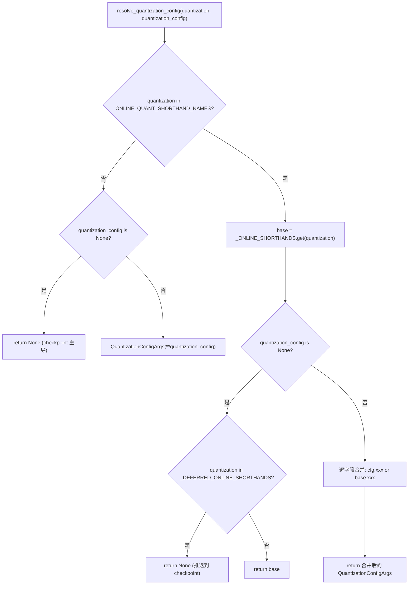
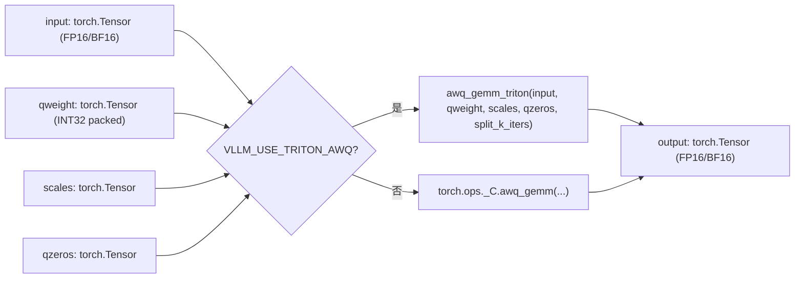
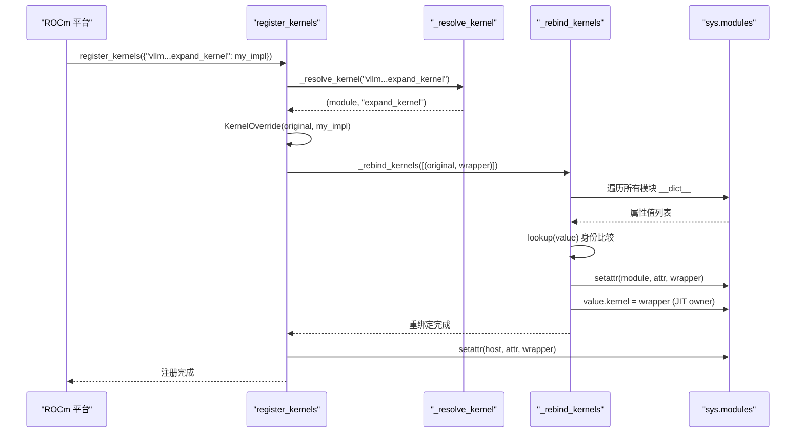

# Chapter 11: Quantization and Custom Kernels: From Weight Loading to High-Performance Operators

In the previous chapter, we saw that torch.compile and CUDA Graph push Python scheduling and kernel launch overhead to the extreme. But no matter how fast scheduling is, if the weights themselves are FP16 and matrix multiplication uses a generic GEMM, hardware compute power is still dragged down by memory bandwidth and inefficient operators. Quantization and custom kernels are another orthogonal main optimization line: the former lowers precision at the weight loading stage, while the latter truly converts quantization gains into throughput. This chapter starts from the parsing entry point of quantization configuration and goes all the way to operator registration in _custom_ops and Triton kernel scheduling.

# 11.1 Quantization Configuration: From CLI String to QuantKey

## Intuitive model

The role of the quantization configuration module is like a restaurant's menu translator. The user says at the front desk, "I want fp8_per_tensor" (CLI string), while the kitchen needs the precise recipe number (`QuantKey`). The translator must handle three kinds of input: pure CLI shorthand, quantization metadata carried by the checkpoint, and the combined scenario where both are overlaid. Without this layer of translation, the kitchen would receive a bunch of ambiguous strings and be unable to decide which kernel to call.

## Data structures and memory layout

The core data structures are`QuantSpec`and`QuantizationConfigArgs`. The former describes the weight and activation quantization keys of a single layer type (linear or MoE), while the latter is the user-visible top-level configuration.

[FACT:vllm/config/quantization.py:73-99]

```python
@config
class QuantSpec:
    weight: QuantKeyField = None
    activation: QuantKeyField = None

    def __str__(self) -> str:
        def quant_key_str(quant_key: QuantKey | None) -> str:
            if quant_key is None:
                return "None"
            return next(
                (
                    name
                    for name, known_quant_key in QUANT_KEY_NAMES.items()
                    if known_quant_key == quant_key
                ),
                str(quant_key),
            )
        return quant_key_str(self.weight)
```

`weight`and`activation`are both optional`QuantKey`。`None`The semantics of is "fall back to the method class's own default value"—typically inherited from the checkpoint, and in online quantization scenarios it means no quantization.[FACT:vllm/config/quantization.py:74-74]。`QuantKey`itself is a complex type containing`NamedTuple`and`ClassVar[GroupShape]`declarations, and pydantic cannot directly introspect it, so the author used`GetPydanticSchema`to inject a custom validator`_coerce_quant_key`, normalizing strings or`QuantKey`uniformly.[FACT:vllm/config/quantization.py:60-69]。

`QuantizationConfigArgs`The field layout of is worth noting[FACT:vllm/config/quantization.py:102-126]：

- `linear` / `moe`: they act on the`LinearBase`and`FusedMoEFactory`layers respectively;
- `ignore`: a list of layer names to skip quantization for; online quantization also supports fnmatch wildcards;
- `targets`: per-layer online quantization overrides; keys can be exact layer names,`re:`-prefixed regexes, or fnmatch patterns; values are mutually exclusive with`linear`/`moe`.

`targets`and`linear`/`moe`are enforced to be mutually exclusive by`model_validator`[FACT:vllm/config/quantization.py:172-179]. This constraint is not formalism:`targets`follows the per-layer override path,`linear`/`moe`follows the global default path, and having both at the same time makes "which spec a given layer actually uses" undecidable.

## Step-by-Step: one resolution of`--quantization fp8_per_tensor`

Scenario: the user passes`--quantization fp8_per_tensor`on the command line, and at the same time specifies activation quantization for MoE layers via`--quantization-config`.

Step one,`resolve_quantization_config`is called with the CLI string and the config dict[FACT:vllm/config/quantization.py:233-235]. It first checks whether`quantization`is in`ONLINE_QUANT_SHORTHAND_NAMES`—this tuple contains all shorthand names plus a`"online"` [FACT:vllm/config/quantization.py:216-222]。

Step two,`fp8_per_tensor`hits the shorthand table,`base`is resolved to`_ONLINE_SHORTHANDS["fp8_per_tensor"]`, i.e. both linear and moe use`kFp8StaticTensorSym` [FACT:vllm/config/quantization.py:188-190]。

Step three,`quantization_config`is non-empty and is constructed as a`QuantizationConfigArgs`object. Then it enters the merge logic[FACT:vllm/config/quantization.py:267-268]: each field is decided by`quantization_config.xxx or base.xxx`—fields explicitly set by the user take precedence, and unset fields inherit the shorthand defaults. Using`or`here instead of`if is not None`is intentional:`QuantSpec`and an empty list are both falsy, so semantically "unset" and "empty" are equivalent.

Step four, if`quantization`is not in the shorthand table (for example it is the checkpoint's own`awq`), and`quantization_config`is`None`, the function directly returns`None` [FACT:vllm/config/quantization.py:256-257]. This means "do not layer on online quantization", and the checkpoint's quantization method remains dominant.

There is an easily overlooked branch:`_DEFERRED_ONLINE_SHORTHANDS`contains`mxfp4`and`mxfp8` [FACT:vllm/config/quantization.py:233-235]. These two names are both CLI shorthands and checkpoint quantization method names. When the user passes only`--quantization mxfp4`without`quantization_config`, the function returns`None`rather than`base` [FACT:vllm/config/quantization.py:267-268], deferring the decision to the checkpoint metadata—only when the checkpoint has no quantization information does it fall back to the online shorthand.



## Design considerations and pitfalls

`_coerce_spec`The validator handles a subtle scenario: when`linear`or`moe`receives a string, it first looks up`_ONLINE_SHORTHANDS`, and if it hits, it takes the spec of the corresponding field; if it misses, it treats it as a single`QuantKey`name[FACT:vllm/config/quantization.py:130-139]. This means`linear="fp8_per_tensor"`and`linear="fp8_per_tensor_static"`follow two different paths—the former is a full config shorthand, the latter is a single quantization key. If that field in the shorthand is`None`(for example`int8_per_channel_weight_only`has no`linear`field), it throws an explicit`ValueError`rather than silently returning`None` [FACT:vllm/config/quantization.py:130-139]。

A common trap in production:`targets`regex keys are precompiled and validated in`_validate_targets`, but fnmatch pattern keys are not validated. If the user writes an fnmatch pattern that will never match any layer, no error is raised; that layer simply remains unquantized—when troubleshooting, you need to check whether the layer names actually match.[FACT:vllm/config/quantization.py:166-167]: operator registration and fake implementations

# 11.2 `_custom_ops`Intuitive model

## is the adaptation layer between vLLM and the underlying CUDA/C++ operators, like a customs checkpoint. PyTorch's

`_custom_ops.py`namespace registers compiled C++ operators, but calling them directly has three problems: different platforms (CUDA/ROCm/CPU/XPU) have different operator sets,`torch.ops._C`needs fake implementations to infer output shapes, and some operators need Python-side argument preprocessing.`torch.compile`encapsulates these problems uniformly.`_custom_ops`Data structures and registration mechanism

## When the module loads, it first calls

, giving the platform layer a chance to import its own operator library. Then it defines`current_platform.import_kernels()` [FACT:vllm/_custom_ops.py:25-26]—under`register_fake`it is an empty decorator, and at runtime it imports from`TYPE_CHECKING``torch.library`The core purpose of the fake implementation is to let[FACT:vllm/_custom_ops.py:25-26]。

know the operator's output shape and dtype during tracing, without actually executing it. Take`torch.compile`as an example:`scaled_fp4_quant`Copy

[FACT:vllm/_custom_ops.py:90-100]

```python
if hasattr(torch.ops, "_C") and hasattr(torch.ops._C, "scaled_fp4_quant"):

    @register_fake("_C::scaled_fp4_quant")
    def _scaled_fp4_quant_fake(
        input: torch.Tensor,
        input_scale: torch.Tensor,
        is_sf_swizzled_layout: bool,
    ) -> tuple[torch.Tensor, torch.Tensor]:
        n = input.shape[-1]
        m = input.numel() // n
        return create_fp4_output_tensors(m, n, input.device, is_sf_swizzled_layout)
```

guard: the fake implementation is defined only when the platform actually registers`hasattr`. This ensures that importing the module on CPU or older GPUs will not crash due to missing operators.`_C::scaled_fp4_quant`shows the memory layout details of FP4 quantized output

`create_fp4_output_tensors`. When[FACT:vllm/_custom_ops.py:69-87], the scale tensor needs to be arranged in the 128x4 tile layout required by Tensor Cores: the number of rows is rounded up to a multiple of 128, the number of columns (`is_sf_swizzled_layout=True`) is rounded up to a multiple of 4, and every 4 float8_e4m3 values are packed into one int32`n // 16`. The comment explicitly states that the NVFP4 quantization kernel will explicitly zero all padded scale entries, so a separate zero-initialization kernel is not needed[FACT:vllm/_custom_ops.py:55-64]Step-by-Step: the call flow of one AWQ GEMM[FACT:vllm/_custom_ops.py:60-61]。

## Scenario: the model has loaded an AWQ-quantized weight, and during forward propagation it needs to perform matrix multiplication between activations and the quantized weight.

Step one, call

. The function first checks the environment variable`awq_gemm` [FACT:vllm/_custom_ops.py:587-592]. If true, it lazily imports`VLLM_USE_TRITON_AWQ`and calls it—this is a pure Triton implementation path, used for platforms that do not support CUDA operators or for debugging scenarios.`awq_gemm_triton`Step two, the default path calls

, passing input, qweight, scales, qzeros, and`torch.ops._C.awq_gemm`Step three, if`split_k_iters` [FACT:vllm/_custom_ops.py:598-598]。

第三步，如果 `torch.ops._C.awq_gemm`exists, the fake implementation is registered[FACT:vllm/_custom_ops.py:601-616]. The shape returned by fake is`(split_k_iters, num_in_feats, qweight.size(1) * 8)`then`.sum(0)`—this precisely simulates the intermediate result shape of split-K and the final shape after reduction.`qweight.size(1) * 8`From AWQ's packing method: each int32 stores 8 4-bit weights.

Step four,`awq_dequantize`follows a similar path[FACT:vllm/_custom_ops.py:553-559], but the fake implementation's shape derivation differs:`out_c = qout_c * 8`, because after dequantization the number of columns expands by 8x[FACT:vllm/_custom_ops.py:587-592]。

The repack functions in the Marlin series demonstrate another pattern.`gptq_marlin_repack`The fake implementation of computes`pack_factor = 32 // num_bits`, and the output shape is`(size_k // 16, size_n * 16 // pack_factor)` [FACT:vllm/_custom_ops.py:1103-1119]. Here`16`is the Marlin tile size,`size_k // 16`indicates that the K dimension is split by tile. The MoE version of`gptq_marlin_moe_repack`loops over each expert at the Python layer and calls the single-expert repack[FACT:vllm/_custom_ops.py:1154-1172], and asserts`size_k % 16 == 0`—this is a hard constraint of the Marlin format.



## Design considerations and pitfalls

The fake implementation must exactly match the output shape of the real operator, otherwise the graph traced by`torch.compile`will have shape mismatches at runtime.`create_fp4_output_tensors`The comments in particularly emphasize "Must match the C++ scaled_fp4_quant_func allocation exactly when padded_n is None"[FACT:vllm/_custom_ops.py:69-74]. This is an error-prone point: if the C++ side changes the allocation logic and the fake is not synchronized, the compiled graph will crash during CUDA Graph replay.

Another pitfall is`torch.library.custom_op`'s aliasing rules.`safeFusedQuantizeNv`The comments in point out that torch 2.12+ does not allow the output of a custom operator to alias any input, so the author changed the returned tensor to an in-place parameter[FACT:vllm/_custom_ops.py:4650-4655]. This practice of "changing the API form to bypass framework limitations" is very common in operator adaptation layers, and when troubleshooting, you need to pay attention to whether the`mutates_args`declaration is consistent with the actual behavior.

`CPUDNNLGEMMHandler`demonstrates another resource management pattern: the handler pointer is stored in an int64 tensor,`__del__`and on calls`release_dnnl_matmul_handler`to release[FACT:vllm/_custom_ops.py:3708-3717]. Storing the pointer in a tensor is to prevent it from being optimized away by Python's integer inlining—this is a classic technique in low-level bindings.

# 11.3 Triton kernel dispatch:`KernelOverride`and cross-module rebinding

## Intuitive model

The role of the Triton kernel dispatcher is like a company's job stand-in system. When a platform (such as ROCm) needs to replace a Triton kernel in the vLLM core with its own implementation, it cannot directly modify the core code—that would pollute upstream.`dispatcher`allows the platform to register a stand-in, and then quietly replaces all references pointing to the original kernel with the stand-in. Without this mechanism, every platform would have to maintain a fork, causing constant conflicts when merging upstream changes.

## Data structures and memory layout

The core data structure is the`_registry`dictionary and the`KernelOverride`class[FACT:vllm/triton_utils/dispatcher.py:29-36]。

`KernelOverride`'s key fields[FACT:vllm/triton_utils/dispatcher.py:50-61]：

- `_impl`: platform implementation function;
- `arg_names`: a tuple mirroring the original kernel's parameter names, used for keyword binding at launch time;
- `constexprs`: constexpr declarations inherited from the original kernel;
- `func`: points to the implementation function, for warmup introspection;
- `_forward_by_name`: a boolean flag that determines whether to forward parameters by keyword or by position at launch time.

`_forward_by_name`The computation logic of is: compare`inspect.signature(impl).parameters`with the original kernel's`arg_names`to see whether they are exactly equal[FACT:vllm/triton_utils/dispatcher.py:50-61]. If equal, it means the implementation's parameter names match the kernel, and it is safe to forward by keyword; otherwise, it must forward by position in the original kernel's parameter order.

## Step-by-Step: one`register_kernels`rebinding

Scenario: the ROCm platform calls`register_kernels({"vllm.v1.sample.rejection_sampler.expand_kernel": my_expand_impl})`。

during initialization. Step one,`register_kernels`iterates over overrides, and for each name calls`_resolve_kernel` [FACT:vllm/triton_utils/dispatcher.py:162-166]。`_resolve_kernel`to split the name by the last`.`into a module name and an attribute name[FACT:vllm/triton_utils/dispatcher.py:83-94]. If the first letter of the last segment of the module name is uppercase, it means the kernel belongs to some class (JIT warmup owner), and you need to first import the parent module and then`getattr`to get the class, returning`(类, 属性名)`; otherwise, import the module itself and return`(模块, 属性名)`。

. Step two, after obtaining the original kernel object, construct the`KernelOverride`wrapper and record it in`_registry` [FACT:vllm/triton_utils/dispatcher.py:167-169]。

. Step three,`_rebind_kernels`performs a full-module scan[FACT:vllm/triton_utils/dispatcher.py:97-144]. It iterates over`sys.modules`of all modules in`__dict__`, and performs an identity comparison on each attribute value—note that it is`is`rather than`==`, because some attribute values (such as the`PlaceholderModule`sentinel) trigger imports or exceptions during hash/eq[FACT:vllm/triton_utils/dispatcher.py:116-123]。

. Step four, for attributes that match the original kernel, directly`setattr`replace them with the wrapper[FACT:vllm/triton_utils/dispatcher.py:125-135]. For the JIT warmup owner (the object whose instance attribute`kernel`points to the original kernel), replace`value.kernel`and clear the cached`_kernel_arg_names`, so that launch binding is re-derived from the wrapper[FACT:vllm/triton_utils/dispatcher.py:138-139]。

. Step five,`_rebind_kernels`only after completion, also replace the attribute at the definition site with the wrapper[FACT:vllm/triton_utils/dispatcher.py:170-174]. The comments explain the importance of the order: if the definition site is replaced first, the original kernel can no longer be found during the scan[FACT:vllm/triton_utils/dispatcher.py:170-171]。



## Design considerations and pitfalls

`KernelOverride.__getitem__`returns`self._launch`, making`kernel[grid](**kwargs)`, a standard Triton launch syntax, transparent to the wrapper[FACT:vllm/triton_utils/dispatcher.py:63-74]。`_launch`'s forwarding logic has three cases[FACT:vllm/triton_utils/dispatcher.py:63-74]: when there are positional arguments, pass them through directly;`_forward_by_name`when true, forward by keyword; otherwise, check whether kwargs contains parameter names unknown to the original kernel, and if so, raise`RuntimeError`; if not, extract values in the original kernel's parameter order and forward by position.

This`RuntimeError`is an important defense: if the parameter names implemented by the platform are inconsistent with the kernel, and the caller passes parameters that the implementation does not recognize, silently ignoring them will lead to error results that are difficult to troubleshoot. Explicit error reporting exposes the problem at the registration stage.

A production environment pitfall:`_rebind_kernels`The scan is O(number of modules × number of attributes × number of kernels). For large models,`sys.modules`there may be thousands of modules, each with hundreds of attributes. Although it is executed only once during initialization, if many kernels are registered, startup time will increase significantly.`lookup`The function uses linear scanning rather than hash lookup, and the comment explains the reason—some attribute values are unhashable[FACT:vllm/triton_utils/dispatcher.py:116-123]. This is a typical "correctness over performance" trade-off.

Another pitfall:`_resolve_kernel`It determines whether something is a class attribute by "the first letter of the last segment of the module name being uppercase"[FACT:vllm/triton_utils/dispatcher.py:83-94]. If a module name happens to start with an uppercase letter (which does not conform to Python naming conventions but is syntactically legal), it will be misjudged as a class. This is a convention-over-configuration design that relies on vLLM's internal naming conventions.

# Design considerations

The two layers of mechanisms, quantization configuration and operator registration, together form vLLM's "accuracy-performance" adjustment surface.`QuantizationConfigArgs`The design reflects the separation of "user intent" and "method default value":`None`It is not "no quantization," but "let the method class decide for itself." This delayed decision allows the same configuration to adapt to both checkpoint quantization and online quantization scenarios.

`_custom_ops`The fake implementation pattern of`torch.compile`is standard in the ecosystem, but vLLM's uniqueness lies in`hasattr`the widespread use of guards. This allows the same module to be imported on CUDA, ROCm, CPU, and XPU without crashing, at the cost that each operator requires three pieces of code: Python wrapper, fake implementation, and platform guard.

The cross-module rebinding of the Triton dispatcher is a radical approach. It does not rely on Python's import hooks or`__getattr__`, but directly scans and replaces all references. The advantage of this approach is that it is thorough—no matter how many places the kernel is`from mod import kernel`copied to, it can be replaced; the disadvantage is that it is fragile—any new way of holding a kernel reference (such as closure capture) may escape the scan.

# Chapter summary

# Chapter review questions and self-test

Q1: In`resolve_quantization_config`, if the`_DEFERRED_ONLINE_SHORTHANDS`branch is removed (that is, when`quantization in _DEFERRED_ONLINE_SHORTHANDS`returns`base`instead of`None`), what happens when loading a model whose checkpoint includes`quant_method: "mxfp4"`and the user only passes`--quantization mxfp4`?

**Reference analysis**：`_DEFERRED_ONLINE_SHORTHANDS`The design intent is to let the checkpoint quantization method take precedence[FACT:vllm/config/quantization.py:233-235]. If this branch is removed,`mxfp4`will hit`_ONLINE_SHORTHANDS`and return`base`(that is,`QuantSpec(weight=kMxfp4Static)`）[FACT:vllm/config/quantization.py:198-210]. At this point, the online quantization configuration will override the checkpoint's quantization method, while the checkpoint weights are stored in`mxfp4`format—if the online configuration's`kMxfp4Static`is not completely consistent with the checkpoint's actual format (for example, the scale layout is different), weight loading will fail or produce incorrect results. A more subtle case is: the checkpoint's`mxfp4`may use a different group size or scale dtype, and the online configuration's default values do not match, causing inference accuracy to degrade without reporting an error.

Q2: `KernelOverride._launch`In`_forward_by_name`, if`False`is`RuntimeError`and the kwargs passed by the caller contain a parameter name that the original kernel does not recognize, the code will throw

**. If this check is removed and unknown parameters are silently ignored, in what scenarios would this lead to problems that are difficult to troubleshoot?**：`_forward_by_name`Reference analysis`False`When[FACT:vllm/triton_utils/dispatcher.py:50-61]is`RuntimeError`, it means that the parameter names implemented by the platform are inconsistent with the original kernel, and forwarding must be positional[FACT:vllm/triton_utils/dispatcher.py:63-74]。

Q3: `_rebind_kernels`. If the caller passes a parameter that the original kernel does not recognize (for example, an optional parameter newly added upstream), silently ignoring it will cause the value of that parameter to be lost. In the Triton kernel scenario, this usually means that a certain constexpr or grid dimension is not passed, and the kernel may launch with default values—the result may be incorrect computation rather than a crash. Since incorrect results from Triton kernels often manifest as numerical deviations rather than exceptions, troubleshooting is extremely difficult. Explicit`kernel`exposes the problem at the first launch`value.__dict__.pop("_kernel_arg_names", None)`After replacing the

**attribute of the JIT warmup owner,**will be executed. If this line is removed, under what circumstances would it cause a launch binding error?`_kernel_arg_names`Reference analysis[FACT:vllm/triton_utils/dispatcher.py:138-139]: The JIT warmup owner caches`kernel`, which is used at launch time to bind kwargs to kernel parameters`arg_names`. After replacing`arg_names`with a wrapper, the wrapper's`_forward_by_name`may differ from the original kernel (if the platform implementation has different parameter names, the wrapper's`False`still mirrors the original kernel, but`KernelOverride._launch`may be`_forward_by_name`). If the cache is not cleared, the warmup mechanism will continue to use the old parameter name list for binding, while the wrapper's launch logic may expect a different binding method. Specifically,`False`extracts values in the order of`self.arg_names`when[FACT:vllm/triton_utils/dispatcher.py:79-80]is`_kernel_arg_names`. If the cached`arg_names`is inconsistent with the wrapper's

, the extracted parameter order will be scrambled, causing the kernel to receive incorrect parameter values.

This chapter dissects the two-layer infrastructure of vLLM quantization and custom kernels. The first layer is quantization configuration parsing: QuantSpec and QuantizationConfigArgs uniformly normalize CLI strings, checkpoint metadata, and per-layer overrides into a QuantKey; resolve_quantization_config handles shorthand expansion and field merging; _DEFERRED_ONLINE_SHORTHANDS resolves name-conflict scenarios. The second layer is operator adaptation: _custom_ops implements cross-platform operator registration through hasattr guards and register_fake, where the fake implementation precisely mirrors the real operator's output shape to support torch.compile; the dispatcher implements platform replacement of Triton kernels through KernelOverride and full-module scanning. Together they support realizing quantization benefits from weight loading to forward computation. Next, we will turn to advanced inference features that improve throughput and reduce latency: how automatic prefix caching reuses KV across requests, how speculative decoding accelerates generation with a draft model, and how LoRA dynamically switches adapters.
