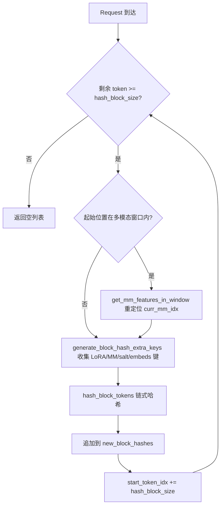
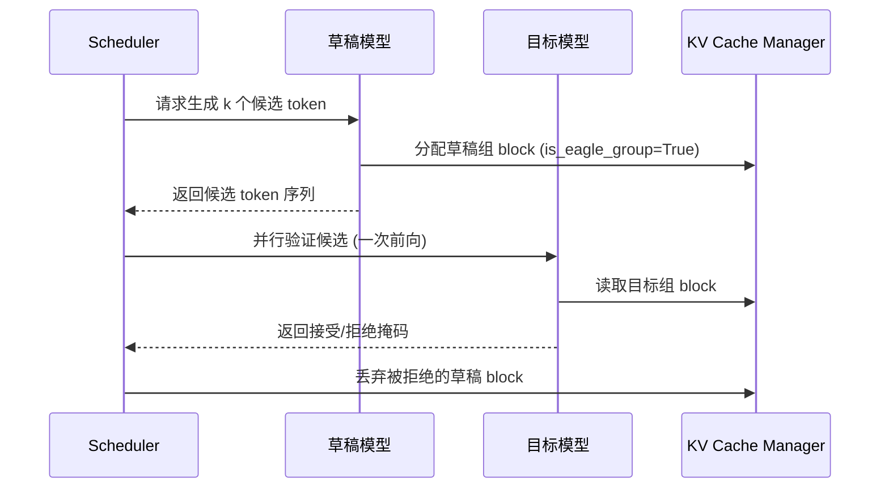

# Chapter 12: Performance Profiling: Throughput Optimization, TTFT/ITL Breakdown


上一章我们深入了 vLLM 的量化体系与自定义算子基础设施，看到量化配置如何被解析并选择对应 kernel，以及 FP8、INT4、AWQ、GPTQ 等方案如何在权重加载时完成转换。同时，我们探明了 _custom_ops 如何注册 CUDA 算子、Triton 内核的调度机制，以及 MoE 融合内核如何减少显存往返。这些底层能力为更高级的推理优化铺平了道路。本章将聚焦 vLLM 的三大高级推理特性：自动前缀缓存（APC）、投机解码与 LoRA。它们看似独立，实则共享同一套底层基础设施——KV block 的哈希、调度器的 slot 分配、以及模型执行时的动态权重注入。理解它们的关键，是理解它们如何在不破坏 PagedAttention 分页语义的前提下，把「复用」这件事做到极致。


## Intuitive Architectural Model

前缀缓存就像图书馆的「公共段落摘抄本」：两个学生写作文，开头都引用同一段古文，老师只需要批改一次这段古文，后面各自不同的部分再分别看。若没有它，每个请求都要从头 prefill 整段 prompt，长文档问答场景下算力被重复消耗数倍。

## 数据结构：从 token 到 block hash 的映射

前缀缓存的核心是「如何判断两个请求的前缀相同」。vLLM 的答案是：把 token 序列按 block 切分，对每个 block 计算一个链式哈希。链式意味着第 N 个 block 的哈希包含了前 N-1 个 block 的哈希，因此一个 block hash 唯一指纹化了「从序列开头到该 block 末尾」的整段前缀。

哈希的载体是 `BlockHash`，它被定义为 `bytes` 的 `NewType`，而非裸 `bytes`，目的是在类型层面防止误用 [FACT:vllm/v1/core/kv_cache_utils.py:59-62](https://github.com/vllm-project/vllm/blob/7ba3df63cbe2e3e7aca19074bed2958311f46400/vllm/v1/core/kv_cache_utils.py#L59-L62)。当需要把 block hash 与 KV cache group id 组合成字典键时，vLLM 没有用元组，而是把 4 字节大端 group id 直接拼接到 hash 字节尾部 [FACT:vllm/v1/core/kv_cache_utils.py:75-76](https://github.com/vllm-project/vllm/blob/7ba3df63cbe2e3e7aca19074bed2958311f46400/vllm/v1/core/kv_cache_utils.py#L75-L76)：

```python
def make_block_hash_with_group_id(block_hash, group_id):
    return BlockHashWithGroupId(block_hash + group_id.to_bytes(4, "big", signed=False))
```

> **〔Design Inference & Architectural Trade-offs〕**
> 这是一个典型的「避免元组分配」优化：在热路径上，每个 block 的查找都要构造键，元组会带来额外的 Python 对象分配与哈希开销，而字节串拼接在 C 层完成，且字节串本身就是可哈希的。取回时用切片 `key[:-4]` 和 `int.from_bytes(key[-4:])` 还原 [FACT:vllm/v1/core/kv_cache_utils.py:87-89](https://github.com/vllm-project/vllm/blob/7ba3df63cbe2e3e7aca19074bed2958311f46400/vllm/v1/core/kv_cache_utils.py#L87-L89)。

哈希函数本身由 `hash_block_tokens` 承担，它把父 block hash、当前 block 的 token id 元组、以及额外键一起喂给哈希函数 [FACT:vllm/v1/core/kv_cache_utils.py:650-680](https://github.com/vllm-project/vllm/blob/7ba3df63cbe2e3e7aca19074bed2958311f46400/vllm/v1/core/kv_cache_utils.py#L650-L680)。注意第一个 block 的父哈希不是 `None`，而是全局的 `NONE_HASH`：

```python
if not parent_block_hash:
    parent_block_hash = NONE_HASH
```

[FACT:vllm/v1/core/kv_cache_utils.py:674-675](https://github.com/vllm-project/vllm/blob/7ba3df63cbe2e3e7aca19074bed2958311f46400/vllm/v1/core/kv_cache_utils.py#L674-L675)。`NONE_HASH` 的种子选择藏着一个安全设计：对 SHA-256 这类密码学哈希，种子是固定的 `"vllm-none-hash"`，使得不同 vLLM 进程对相同内容算出相同哈希，从而跨节点共享前缀缓存；而对 xxhash 这类非密码学哈希，种子是每进程随机的，因为可预测的种子会让攻击者离线预计算碰撞 block [FACT:vllm/v1/core/kv_cache_utils.py:105-126](https://github.com/vllm-project/vllm/blob/7ba3df63cbe2e3e7aca19074bed2958311f46400/vllm/v1/core/kv_cache_utils.py#L105-L126)。`resolve_none_hash_seed` 实现了这个分叉：`PYTHONHASHSEED` 环境变量优先，否则密码学哈希用固定种子、非密码学哈希用 `os.urandom(32)` [FACT:vllm/v1/core/kv_cache_utils.py:132-145](https://github.com/vllm-project/vllm/blob/7ba3df63cbe2e3e7aca19074bed2958311f46400/vllm/v1/core/kv_cache_utils.py#L132-L145)。

## 场景驱动：一次请求的 block hash 计算

假设一个请求带着 128 个 token 进入，block size 为 16。`get_request_block_hasher` 返回的闭包负责增量计算 [FACT:vllm/v1/core/kv_cache_utils.py:802-861](https://github.com/vllm-project/vllm/blob/7ba3df63cbe2e3e7aca19074bed2958311f46400/vllm/v1/core/kv_cache_utils.py#L802-L861)：

第一步，确定从哪里开始算。`start_token_idx = len(request.block_hashes) * hash_block_size` [FACT:vllm/v1/core/kv_cache_utils.py:812-812](https://github.com/vllm-project/vllm/blob/7ba3df63cbe2e3e7aca19074bed2958311f46400/vllm/v1/core/kv_cache_utils.py#L812-L812)，即已算过的 block 数乘以 block 大小。若剩余 token 不足一个 block，直接返回空 [FACT:vllm/v1/core/kv_cache_utils.py:812-812](https://github.com/vllm-project/vllm/blob/7ba3df63cbe2e3e7aca19074bed2958311f46400/vllm/v1/core/kv_cache_utils.py#L812-L812)。

第二步，处理多模态偏移。如果起始位置落在某个多模态输入内部，需要用 `get_mm_features_in_window` 重新定位 `curr_mm_idx` [FACT:vllm/v1/core/kv_cache_utils.py:823-832](https://github.com/vllm-project/vllm/blob/7ba3df63cbe2e3e7aca19074bed2958311f46400/vllm/v1/core/kv_cache_utils.py#L823-L832)。这是因为多模态输入的 placeholder token 本身不携带语义，必须把 mm 特征标识符和它在 block 内的偏移作为额外键掺入哈希。

第三步，循环计算每个 block。`generate_block_hash_extra_keys` 收集所有额外键 [FACT:vllm/v1/core/kv_cache_utils.py:611-647](https://github.com/vllm-project/vllm/blob/7ba3df63cbe2e3e7aca19074bed2958311f46400/vllm/v1/core/kv_cache_utils.py#L611-L647)，包括 LoRA 名、多模态键、cache salt、prompt embeds 哈希。其中 cache salt 只在第一个 block 生效 [FACT:vllm/v1/core/kv_cache_utils.py:633-635](https://github.com/vllm-project/vllm/blob/7ba3df63cbe2e3e7aca19074bed2958311f46400/vllm/v1/core/kv_cache_utils.py#L633-L635)，这是有意为之：salt 的作用是隔离整个缓存命名空间，只需在链的起点注入一次。

第四步，`hash_block_tokens` 把父哈希、token 元组、额外键一起哈希，结果作为下一个 block 的父哈希 [FACT:vllm/v1/core/kv_cache_utils.py:851-857](https://github.com/vllm-project/vllm/blob/7ba3df63cbe2e3e7aca19074bed2958311f46400/vllm/v1/core/kv_cache_utils.py#L851-L857)。链式结构由此形成。

## 多 block size 的粒度转换

当模型有多个 KV cache group 且 block size 不同时，哈希粒度与 group 的 block 粒度可能不一致。`BlockHashListWithBlockSize` 解决这个问题：它不重新计算哈希，而是利用链式哈希的性质——一个 target block 的哈希，就是它内部最后一个 hash block 的哈希 [FACT:vllm/v1/core/kv_cache_utils.py:2781-2851](https://github.com/vllm-project/vllm/blob/7ba3df63cbe2e3e7aca19074bed2958311f46400/vllm/v1/core/kv_cache_utils.py#L2781-L2851)。例如 hash block 为 16、target block 为 32 时，token 0-31 的哈希就是第二个 16-size 哈希（它已经链式覆盖了 0-31）[FACT:vllm/v1/core/kv_cache_utils.py:2794-2806](https://github.com/vllm-project/vllm/blob/7ba3df63cbe2e3e7aca19074bed2958311f46400/vllm/v1/core/kv_cache_utils.py#L2794-L2806)。`_get_value_at` 的实现就是 `self.block_hashes[(idx + 1) * self.scale_factor - 1]` [FACT:vllm/v1/core/kv_cache_utils.py:2848-2851](https://github.com/vllm-project/vllm/blob/7ba3df63cbe2e3e7aca19074bed2958311f46400/vllm/v1/core/kv_cache_utils.py#L2848-L2851)。



## 设计思考与踩坑

**为什么用链式哈希而非独立哈希？** 独立哈希无法区分「相同 block 出现在不同前缀位置」的情况。链式哈希让 block hash 唯一指纹化整段前缀，这正是 `find_longest_cache_hit` 能安全复用 KV 的前提。

**非密码学哈希的跨进程陷阱。** 若使用 xxhash 且未设 `PYTHONHASHSEED`，每个进程的 `NONE_HASH` 不同，导致跨实例前缀缓存完全失效。`init_none_hash` 会打印警告 [FACT:vllm/v1/core/kv_cache_utils.py:161-169](https://github.com/vllm-project/vllm/blob/7ba3df63cbe2e3e7aca19074bed2958311f46400/vllm/v1/core/kv_cache_utils.py#L161-L169)。生产环境若部署多实例共享缓存，必须显式设置 `PYTHONHASHSEED` 或改用 sha256。

**多模态偏移的微妙之处。** `_gen_mm_extra_hash_keys` 把 `(mm_identifier, offset - start_token_idx)` 作为额外键 [FACT:vllm/v1/core/kv_cache_utils.py:552](https://github.com/vllm-project/vllm/blob/7ba3df63cbe2e3e7aca19074bed2958311f46400/vllm/v1/core/kv_cache_utils.py#L552)。偏移是相对 block 起点的，这样同一个 mm 项出现在不同 block 位置时哈希不同，避免误命中。


## Intuitive Architectural Model

投机解码像秘书先替领导起草几版回复，领导只需快速圈定哪版可用。草稿模型（drafter）用极低成本预测多个候选 token，目标模型（target）一次前向并行验证这些候选，接受匹配的部分。若没有它，目标模型只能逐 token 串行生成，GPU 利用率在 decode 阶段极低。

## 数据结构：EAGLE group 的标注

投机解码在 KV cache 管理上的核心问题是：草稿模型的 KV 层与目标模型的 KV 层如何分组？`_annotate_eagle_groups` 用两条规则识别草稿组 [FACT:vllm/v1/core/kv_cache_utils.py:2134-2189](https://github.com/vllm-project/vllm/blob/7ba3df63cbe2e3e7aca19074bed2958311f46400/vllm/v1/core/kv_cache_utils.py#L2134-L2189)：

规则一是 spec 驱动：`non_causal_multi_token_decode` 标志位声明在 `MLAAttentionSpec` 上，由运行非因果多 token decode 的草稿注意力层设置，且能存活过 `merge` 操作 [FACT:vllm/v1/core/kv_cache_utils.py:2175-2177](https://github.com/vllm-project/vllm/blob/7ba3df63cbe2e3e7aca19074bed2958311f46400/vllm/v1/core/kv_cache_utils.py#L2175-L2177)。

规则二是位置回退：MTP 草稿器（如 DeepseekV4/V4.1 DSpark）复用目标模型自己的 decoder 层，spec 上无标记，但它们的草稿注意力层总是在所有目标层之后注册，因此标注持有最后注册层的那个 group [FACT:vllm/v1/core/kv_cache_utils.py:2183-2184](https://github.com/vllm-project/vllm/blob/7ba3df63cbe2e3e7aca19074bed2958311f46400/vllm/v1/core/kv_cache_utils.py#L2183-L2184)。这个规则只在 group 恰好划分了 `kv_cache_spec` 所有层时才生效 [FACT:vllm/v1/core/kv_cache_utils.py:2183-2184](https://github.com/vllm-project/vllm/blob/7ba3df63cbe2e3e7aca19074bed2958311f46400/vllm/v1/core/kv_cache_utils.py#L2183-L2184)。

## 场景驱动：投机解码的 KV 分配

当 `speculative_config` 启用且 `use_eagle_block_drop()` 为真时，`_annotate_eagle_groups` 被调用 [FACT:vllm/v1/core/kv_cache_utils.py:2175-2177](https://github.com/vllm-project/vllm/blob/7ba3df63cbe2e3e7aca19074bed2958311f46400/vllm/v1/core/kv_cache_utils.py#L2175-L2177)。标注结果 `is_eagle_group` 影响后续的 block 分配策略——草稿组的 block 可以在验证后被丢弃。

在 `get_kv_cache_groups` 的主路径中，标注发生在分组之后 [FACT:vllm/v1/core/kv_cache_utils.py:2364-2365](https://github.com/vllm-project/vllm/blob/7ba3df63cbe2e3e7aca19074bed2958311f46400/vllm/v1/core/kv_cache_utils.py#L2364-L2365)。若没有任何 group 被标注为草稿组，`_warn_if_unannotated_eagle_mamba` 会发出警告 [FACT:vllm/v1/core/kv_cache_utils.py:2192-2222](https://github.com/vllm-project/vllm/blob/7ba3df63cbe2e3e7aca19074bed2958311f46400/vllm/v1/core/kv_cache_utils.py#L2192-L2222)。



## 设计思考与踩坑

**为什么草稿组需要单独标注？** 草稿模型生成的 token 在验证后可能被拒绝，对应的 KV 需要丢弃。若草稿 KV 与目标 KV 混在同一 group，丢弃操作会误伤目标 KV。标注让调度器能精确回收。

**位置回退规则的脆弱性。** 规则二依赖「草稿层最后注册」这一约定，注释中明确标注这是 hacky check 并留了 FIXME [FACT:vllm/v1/core/kv_cache_utils.py:2158-2159](https://github.com/vllm-project/vllm/blob/7ba3df63cbe2e3e7aca19074bed2958311f46400/vllm/v1/core/kv_cache_utils.py#L2158-L2159)。当草稿的尾部缓存跨多个 group 时，该规则只标注持有最后一层的 group，需要泛化。

**Mamba 模型的额外约束。** 若启用投机解码但无 group 被识别为草稿组，且存在 Mamba group，会触发警告 [FACT:vllm/v1/core/kv_cache_utils.py:2211-2213](https://github.com/vllm-project/vllm/blob/7ba3df63cbe2e3e7aca19074bed2958311f46400/vllm/v1/core/kv_cache_utils.py#L2211-L2213)。这通常意味着草稿层的 spec 与目标层无法区分，需要检查模型注册顺序。


## Intuitive Architectural Model

LoRA 像给同一台手机换不同的手机壳：手机本体（基座模型）不变，换个壳（适配器）就变成不同风格。若没有它，每个微调任务都要加载一份完整权重，显存无法承受。

## 数据结构：双 LRU 缓存与 slot 数组

`LoRAModelManager` 用两个 LRU 缓存管理适配器生命周期 [FACT:vllm/lora/model_manager.py:115-120](https://github.com/vllm-project/vllm/blob/7ba3df63cbe2e3e7aca19074bed2958311f46400/vllm/lora/model_manager.py#L115-L120)：

```python
self._registered_adapters: AdapterLRUCache[LoRAModel] = AdapterLRUCache(
    self.capacity, self.deactivate_adapter
)
self._active_adapters: AdapterLRUCache[None] = AdapterLRUCache(
    self.lora_slots, self._deactivate_adapter
)
```

`capacity` 是 CPU 侧能缓存的适配器总数（`max_cpu_loras`）[FACT:vllm/lora/model_manager.py:340-342](https://github.com/vllm-project/vllm/blob/7ba3df63cbe2e3e7aca19074bed2958311f46400/vllm/lora/model_manager.py#L340-L342)，`lora_slots` 是 GPU 侧能同时激活的适配器数（`max_loras`）[FACT:vllm/lora/model_manager.py:345-346](https://github.com/vllm-project/vllm/blob/7ba3df63cbe2e3e7aca19074bed2958311f46400/vllm/lora/model_manager.py#L345-L346)。`_registered_adapters` 被移除时会触发 `deactivate_adapter` 回调 [FACT:vllm/lora/model_manager.py:71-74](https://github.com/vllm-project/vllm/blob/7ba3df63cbe2e3e7aca19074bed2958311f46400/vllm/lora/model_manager.py#L71-L74)，确保 CPU 缓存淘汰时 GPU 上的副本也被清理。

`lora_index_to_id` 是一个长度为 `lora_slots` 的数组，把 GPU slot 索引映射到适配器 id [FACT:vllm/lora/model_manager.py:122](https://github.com/vllm-project/vllm/blob/7ba3df63cbe2e3e7aca19074bed2958311f46400/vllm/lora/model_manager.py#L122)。这个数组是 punica wrapper 做批量 LoRA 计算时的核心索引。

## 场景驱动：适配器激活

当请求携带 LoRA 适配器进入时，`activate_adapter` 被调用 [FACT:vllm/lora/model_manager.py:352-409](https://github.com/vllm-project/vllm/blob/7ba3df63cbe2e3e7aca19074bed2958311f46400/vllm/lora/model_manager.py#L352-L409)：

第一步，检查是否已激活，若是则直接返回 [FACT:vllm/lora/model_manager.py:352-354](https://github.com/vllm-project/vllm/blob/7ba3df63cbe2e3e7aca19074bed2958311f46400/vllm/lora/model_manager.py#L352-L354)。

第二步，寻找空闲 slot。遍历 `lora_index_to_id` 找到第一个 `None` [FACT:vllm/lora/model_manager.py:362-362](https://github.com/vllm-project/vllm/blob/7ba3df63cbe2e3e7aca19074bed2958311f46400/vllm/lora/model_manager.py#L362-L362)。若无空闲 slot，抛出 `ValueError("No free lora slots")` [FACT:vllm/lora/model_manager.py:368-368](https://github.com/vllm-project/vllm/blob/7ba3df63cbe2e3e7aca19074bed2958311f46400/vllm/lora/model_manager.py#L368-L368)。

第三步，更新状态并遍历所有已包装模块，调用 `module.set_lora(index, lora_a, lora_b)` 把权重拷贝到 GPU 的 stacked buffer [FACT:vllm/lora/model_manager.py:377-401](https://github.com/vllm-project/vllm/blob/7ba3df63cbe2e3e7aca19074bed2958311f46400/vllm/lora/model_manager.py#L377-L401)。若某模块没有对应 LoRA 权重，调用 `reset_lora(index)` 清零 [FACT:vllm/lora/model_manager.py:378-385](https://github.com/vllm-project/vllm/blob/7ba3df63cbe2e3e7aca19074bed2958311f46400/vllm/lora/model_manager.py#L378-L385)。

第四步，若没有任何权重被应用，打印一次性调试日志 [FACT:vllm/lora/model_manager.py:411-416](https://github.com/vllm-project/vllm/blob/7ba3df63cbe2e3e7aca19074bed2958311f46400/vllm/lora/model_manager.py#L411-L416)。这在流水线并行或专家并行下是预期行为——某些 rank 不持有被适配的层。

## 模块包装：从 nn.Linear 到 BaseLayerWithLoRA

`_create_lora_modules` 遍历模型所有命名模块 [FACT:vllm/lora/model_manager.py:462-606](https://github.com/vllm-project/vllm/blob/7ba3df63cbe2e3e7aca19074bed2958311f46400/vllm/lora/model_manager.py#L462-L606)。关键逻辑：

- 跳过 `PPMissingLayer` [FACT:vllm/lora/model_manager.py:473-474](https://github.com/vllm-project/vllm/blob/7ba3df63cbe2e3e7aca19074bed2958311f46400/vllm/lora/model_manager.py#L473-L474)。
- 根据 `target_modules` 过滤：若未指定则用 `is_supported_lora_module` 判断，否则用 `_match_target_modules` [FACT:vllm/lora/model_manager.py:479-493](https://github.com/vllm-project/vllm/blob/7ba3df63cbe2e3e7aca19074bed2958311f46400/vllm/lora/model_manager.py#L479-L493)。
- 处理别名模块：同一个底层模块可能通过多个路径被访问（如 MoE gate 既在 block 上又在 runner 内）。此时把别名属性重定向到同一个 wrapper，但不重复注册，否则 `activate_adapter` 会对别名调用 `reset_lora` 清掉刚设置的权重 [FACT:vllm/lora/model_manager.py:512-527](https://github.com/vllm-project/vllm/blob/7ba3df63cbe2e3e7aca19074bed2958311f46400/vllm/lora/model_manager.py#L512-L527)。
- 用 `from_layer` 创建 wrapper 并替换原模块 [FACT:vllm/lora/model_manager.py:546-553](https://github.com/vllm-project/vllm/blob/7ba3df63cbe2e3e7aca19074bed2958311f46400/vllm/lora/model_manager.py#L546-L553)。

## 设计思考与踩坑

**slot 布局变化触发映射更新。** `set_adapter_mapping` 不仅比较 mapping 是否变化，还比较 `lora_index_to_id` 的元组快照 [FACT:vllm/lora/model_manager.py:1323-1331](https://github.com/vllm-project/vllm/blob/7ba3df63cbe2e3e7aca19074bed2958311f46400/vllm/lora/model_manager.py#L1323-L1331)。原因注释说得很清楚：一次带外的 `add_lora()` 可能触发 LRU 淘汰并重新分配 slot，而运行中的 batch 及其 mapping 没变 [FACT:vllm/lora/model_manager.py:1323-1331](https://github.com/vllm-project/vllm/blob/7ba3df63cbe2e3e7aca19074bed2958311f46400/vllm/lora/model_manager.py#L1323-L1331)。若只看 mapping，punica metadata 会用过期的 slot 布局。

**MoE 的 EP 切片。** 当启用专家并行时，checkpoint 持有所有全局专家的权重，但每个 rank 只拥有 `local_num_experts` 个。`_stack_moe_lora_weights` 先按 `global_num_experts` reshape，再切片 `[expert_start:expert_end]` [FACT:vllm/lora/model_manager.py:966-977](https://github.com/vllm-project/vllm/blob/7ba3df63cbe2e3e7aca19074bed2958311f46400/vllm/lora/model_manager.py#L966-L977)。非 EP 时切片是 no-op。

**pin_memory 的时机。** 权重打包（如 `pack_moe`）可能使 pin_memory 分配失效，因此 pin_memory 在所有权重合并之后执行 [FACT:vllm/lora/model_manager.py:916-934](https://github.com/vllm-project/vllm/blob/7ba3df63cbe2e3e7aca19074bed2958311f46400/vllm/lora/model_manager.py#L916-L934)。注释明确指出两个原因：MoE 模型 LoRA 权重数量大，过早 pin 开销显著；打包可能使分配失效 [FACT:vllm/lora/model_manager.py:916-921](https://github.com/vllm-project/vllm/blob/7ba3df63cbe2e3e7aca19074bed2958311f46400/vllm/lora/model_manager.py#L916-L921)。


三个特性在 KV cache 管理层交汇。前缀缓存通过 block hash 复用 KV；投机解码通过 `is_eagle_group` 标注区分草稿 KV；LoRA 通过 `_gen_lora_extra_hash_keys` 把适配器名掺入 block hash [FACT:vllm/v1/core/kv_cache_utils.py:568-581](https://github.com/vllm-project/vllm/blob/7ba3df63cbe2e3e7aca19074bed2958311f46400/vllm/v1/core/kv_cache_utils.py#L568-L581)，确保不同适配器的相同 token 序列不会误命中彼此的 KV。

`generate_block_hash_extra_keys` 把 LoRA 键放在额外键列表的最前面 [FACT:vllm/v1/core/kv_cache_utils.py:640-642](https://github.com/vllm-project/vllm/blob/7ba3df63cbe2e3e7aca19074bed2958311f46400/vllm/v1/core/kv_cache_utils.py#L640-L642)，与多模态键、cache salt、prompt embeds 键共同构成完整的哈希输入。这保证了：即使两个请求的 token 完全相同，只要 LoRA 适配器不同，它们的 block hash 就不同，KV 不会串用。


Q1: 若把 `init_none_hash` 中非密码学哈希的随机种子逻辑去掉，改为始终使用固定种子，在什么场景下会引入安全风险？为什么源码注释特别强调 xxhash 需要保密种子？

**参考解析**：源码在 `_NON_CRYPTO_HASH_FUNCTIONS` 中明确把 xxhash 和 xxhash_cbor 列为非碰撞 resistant 的算法 [FACT:vllm/v1/core/kv_cache_utils.py:125-126](https://github.com/vllm-project/vllm/blob/7ba3df63cbe2e3e7aca19074bed2958311f46400/vllm/v1/core/kv_cache_utils.py#L125-L126)。`resolve_none_hash_seed` 对这类算法返回 `os.urandom(32).hex()` [FACT:vllm/v1/core/kv_cache_utils.py:143-144](https://github.com/vllm-project/vllm/blob/7ba3df63cbe2e3e7aca19074bed2958311f46400/vllm/v1/core/kv_cache_utils.py#L143-L144)。若改为固定种子，攻击者可以离线预计算与目标前缀碰撞的 block，构造出哈希相同但内容不同的请求，从而命中并读取他人的 KV cache——这是跨请求的信息泄露。SHA-256 的碰撞 resistant 不依赖种子保密，所以固定种子只影响可复现性不影响安全性 [FACT:vllm/v1/core/kv_cache_utils.py:97-111](https://github.com/vllm-project/vllm/blob/7ba3df63cbe2e3e7aca19074bed2958311f46400/vllm/v1/core/kv_cache_utils.py#L97-L111)。

Q2: `_create_lora_modules` 中处理别名模块时，若去掉「不重复注册」的逻辑，直接对别名也调用 `register_module`，在 `activate_adapter` 时会发生什么？请结合 `reset_lora` 的调用路径分析。

**参考解析**：`activate_adapter` 遍历 `self.modules` 并对每个模块调用 `set_lora` 或 `reset_lora` [FACT:vllm/lora/model_manager.py:377-401](https://github.com/vllm-project/vllm/blob/7ba3df63cbe2e3e7aca19074bed2958311f46400/vllm/lora/model_manager.py#L377-L401)。若别名和规范名都注册，同一个底层 wrapper 会被访问两次。规范名路径下 `_get_lora_layer_weights` 能找到权重并调用 `set_lora` 写入；别名路径下由于名称不匹配，`_get_lora_layer_weights` 返回 None，触发 `reset_lora(index)` [FACT:vllm/lora/model_manager.py:378-385](https://github.com/vllm-project/vllm/blob/7ba3df63cbe2e3e7aca19074bed2958311f46400/vllm/lora/model_manager.py#L378-L385)，把刚写入的权重清零。源码注释明确指出了这个陷阱 [FACT:vllm/lora/model_manager.py:519-523](https://github.com/vllm-project/vllm/blob/7ba3df63cbe2e3e7aca19074bed2958311f46400/vllm/lora/model_manager.py#L519-L523)。正确做法是把别名属性重定向到同一个 wrapper 但不重复注册 [FACT:vllm/lora/model_manager.py:531-537](https://github.com/vllm-project/vllm/blob/7ba3df63cbe2e3e7aca19074bed2958311f46400/vllm/lora/model_manager.py#L531-L537)。

Q3: `BlockHashListWithBlockSize` 依赖「target block 的哈希等于其内部最后一个 hash block 的哈希」这一性质。若哈希函数不是链式的（即每个 block 独立哈希），这个类还能正确工作吗？在什么情况下会产生错误的缓存命中？

**参考解析**：不能。`_get_value_at` 直接返回 `self.block_hashes[(idx + 1) * self.scale_factor - 1]` [FACT:vllm/v1/core/kv_cache_utils.py:2848-2851](https://github.com/vllm-project/vllm/blob/7ba3df63cbe2e3e7aca19074bed2958311f46400/vllm/v1/core/kv_cache_utils.py#L2848-L2851)，这个实现的前提是最后一个 hash block 的哈希已经链式覆盖了它之前的所有 token。若哈希是独立的，这个值只指纹化了最后一个 hash block 的内容，而非整个 target block。两个 target block 可能前半部分不同但最后一个 hash block 相同，导致哈希碰撞，`find_longest_cache_hit` 会错误地复用不匹配的 KV。源码注释明确说明「Each hash_block_size hash is already chained over its entire prefix」[FACT:vllm/v1/core/kv_cache_utils.py:2787-2792](https://github.com/vllm-project/vllm/blob/7ba3df63cbe2e3e7aca19074bed2958311f46400/vllm/v1/core/kv_cache_utils.py#L2787-L2792)。

下一章将转向插件系统与可扩展性，看 vLLM 如何通过平台抽象、IO 处理器与端点扩展支持多样化的部署形态。

本章剖析了 vLLM 三大高级推理特性的底层机制。前缀缓存的核心是链式 block hash：hash_block_tokens 把父哈希、token 元组、额外键一起哈希，NONE_HASH 的种子策略在跨进程共享与碰撞安全之间权衡。投机解码通过 is_eagle_group 标注区分草稿 KV 组。LoRA 通过双 LRU 缓存与 slot 数组管理适配器生命周期，并在 block hash 中掺入适配器名实现缓存隔离。这些特性共同展现了 vLLM 在推理优化上的深度与灵活性。接下来，我们将转向 vLLM 的插件系统与可扩展性，看平台插件如何适配新硬件，IO processor 插件如何介入多模态输入处理，以及端点插件如何注入自定义 API 路由。理解插件注册与发现的加载顺序，将揭示如何在不修改核心代码的前提下扩展 vLLM 的能力。