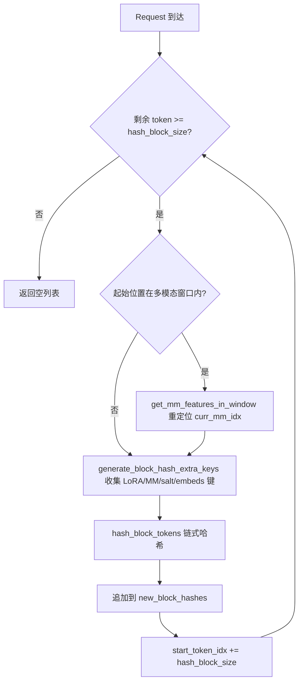
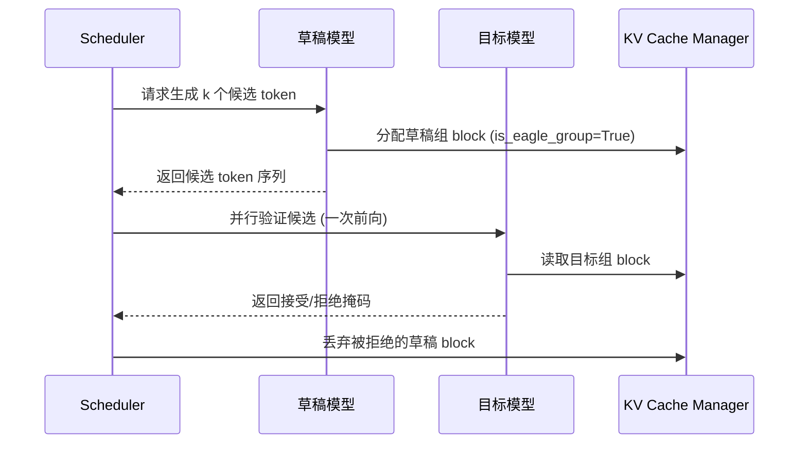

# Chapter 12: Advanced Inference Features: Prefix Caching, Speculative Decoding, and LoRA

In the previous chapter, we went deep into vLLM's quantization system and custom operator infrastructure, seeing how quantization configurations are parsed and corresponding kernels are selected, and how schemes such as FP8, INT4, AWQ, and GPTQ complete conversion during weight loading. At the same time, we explored how _custom_ops registers CUDA operators, the scheduling mechanism of Triton kernels, and how MoE fused kernels reduce memory round trips. These low-level capabilities paved the way for more advanced inference optimization. This chapter will focus on three major advanced inference features of vLLM: automatic prefix caching (APC), speculative decoding, and LoRA. They appear independent, but in fact share the same underlying infrastructure—hashing of KV blocks, slot allocation by the scheduler, and dynamic weight injection during model execution. The key to understanding them is understanding how they push "reuse" to the extreme without breaking the paging semantics of PagedAttention.

# 12.1 Prefix Caching: How Block Hash Fingerprints a Prefix

## Intuitive Model

Prefix caching is like a library's "shared excerpt book for common passages": two students write essays, and both quote the same classical passage at the beginning. The teacher only needs to grade that passage once, and then look separately at the different parts that follow. Without it, every request would need to prefill the entire prompt from scratch, and in long-document question-answering scenarios, compute would be consumed repeatedly several times over.

## Data Structure: Mapping from Tokens to Block Hash

The core of prefix caching is "how to determine that two requests have the same prefix." vLLM's answer is: split the token sequence into blocks, and compute a chained hash for each block. Chained means that the hash of the Nth block includes the hashes of the previous N-1 blocks, so a block hash uniquely fingerprints the entire prefix "from the beginning of the sequence to the end of that block."

The carrier of the hash is`BlockHash`, which is defined as`bytes`of`NewType`, rather than a bare`bytes`, in order to prevent misuse at the type level[FACT:vllm/v1/core/kv_cache_utils.py:59-62]. When a block hash needs to be combined with a KV cache group id into a dictionary key, vLLM does not use a tuple, but instead appends the 4-byte big-endian group id directly to the end of the hash bytes[FACT:vllm/v1/core/kv_cache_utils.py:75-76]：

```python
def make_block_hash_with_group_id(block_hash, group_id):
    return BlockHashWithGroupId(block_hash + group_id.to_bytes(4, "big", signed=False))
```

> **[Design Inference & Architectural Trade-offs]**
> This is a typical "avoid tuple allocation" optimization: on the hot path, every block lookup must construct a key. Tuples introduce extra Python object allocation and hashing overhead, whereas byte-string concatenation is completed at the C layer, and the byte string itself is hashable. On retrieval, slicing is used`key[:-4]`and`int.from_bytes(key[-4:])`to restore[FACT:vllm/v1/core/kv_cache_utils.py:87-89]。

The hash function itself is provided by`hash_block_tokens`, which feeds the parent block hash, the tuple of token ids in the current block, and extra keys together into the hash function[FACT:vllm/v1/core/kv_cache_utils.py:650-680]. Note that the parent hash of the first block is not`None`, but the global`NONE_HASH`：

```python
if not parent_block_hash:
    parent_block_hash = NONE_HASH
```

[FACT:vllm/v1/core/kv_cache_utils.py:674-675]。`NONE_HASH`The choice of seed hides a security design: for cryptographic hashes such as SHA-256, the seed is fixed`"vllm-none-hash"`, so that different vLLM processes compute the same hash for the same content, thereby sharing prefix caches across nodes; while for non-cryptographic hashes such as xxhash, the seed is randomized per process, because a predictable seed would allow attackers to precompute colliding blocks offline[FACT:vllm/v1/core/kv_cache_utils.py:105-126]。`resolve_none_hash_seed`implements this fork:`PYTHONHASHSEED`Environment variables take precedence; otherwise, cryptographic hashes use a fixed seed, and non-cryptographic hashes use`os.urandom(32)` [FACT:vllm/v1/core/kv_cache_utils.py:132-145]。

## Scenario-driven: block hash computation for a single request

Suppose a request enters with 128 tokens, and the block size is 16.`get_request_block_hasher`The returned closure is responsible for incremental computation[FACT:vllm/v1/core/kv_cache_utils.py:802-861]：

The first step is to determine where to start computing.`start_token_idx = len(request.block_hashes) * hash_block_size` [FACT:vllm/v1/core/kv_cache_utils.py:812-812], that is, the number of already-computed blocks multiplied by the block size. If the remaining tokens are fewer than one block, return empty directly[FACT:vllm/v1/core/kv_cache_utils.py:812-812]。

The second step is to handle the multimodal offset. If the starting position falls inside a multimodal input, it is necessary to use`get_mm_features_in_window`to reposition`curr_mm_idx` [FACT:vllm/v1/core/kv_cache_utils.py:823-832]. This is because the placeholder token of the multimodal input itself does not carry semantics, so the mm feature identifier and its offset within the block must be mixed into the hash as additional keys.

The third step is to loop over and compute each block.`generate_block_hash_extra_keys`Collect all additional keys[FACT:vllm/v1/core/kv_cache_utils.py:611-647], including the LoRA name, multimodal key, cache salt, and prompt embeds hash. Among these, the cache salt only takes effect on the first block[FACT:vllm/v1/core/kv_cache_utils.py:633-635], and this is intentional: the purpose of the salt is to isolate the entire cache namespace, so it only needs to be injected once at the starting point of the chain.

The fourth step,`hash_block_tokens`hash the parent hash, token tuple, and additional keys together, and use the result as the parent hash of the next block[FACT:vllm/v1/core/kv_cache_utils.py:851-857]. The chain structure is thus formed.

## Granularity conversion for multiple block sizes

When a model has multiple KV cache groups and the block sizes differ, the hash granularity and the block granularity of a group may be inconsistent.`BlockHashListWithBlockSize`To solve this problem: it does not recompute the hash, but instead leverages the property of chained hashing - the hash of a target block is the hash of the last hash block inside it[FACT:vllm/v1/core/kv_cache_utils.py:2781-2851]. For example, when the hash block is 16 and the target block is 32, the hash of tokens 0-31 is the second 16-size hash (which already covers 0-31 through chaining)[FACT:vllm/v1/core/kv_cache_utils.py:2794-2806]。`_get_value_at`The implementation is`self.block_hashes[(idx + 1) * self.scale_factor - 1]` [FACT:vllm/v1/core/kv_cache_utils.py:2848-2851]。



## Design considerations and pitfalls

**Why use chained hashing instead of independent hashing?**Independent hashing cannot distinguish the case where "the same block appears at different prefix positions." Chained hashing makes the block hash uniquely fingerprint the entire prefix, which is exactly`find_longest_cache_hit`the prerequisite for safely reusing KV.

**The cross-process pitfall of non-cryptographic hashing.**If xxhash is used and`PYTHONHASHSEED`is not set, then each process's`NONE_HASH`is different, causing cross-instance prefix caching to fail completely.`init_none_hash`A warning will be printed[FACT:vllm/v1/core/kv_cache_utils.py:161-169]. In production, if multiple instances are deployed to share a cache,`PYTHONHASHSEED`must be explicitly set or sha256 must be used instead.

**The subtlety of multimodal offsets.** `_gen_mm_extra_hash_keys`Use`(mm_identifier, offset - start_token_idx)`as an additional key[FACT:vllm/v1/core/kv_cache_utils.py:552]. The offset is relative to the start of the block, so when the same mm item appears at different block positions, the hash differs, avoiding false hits.

# 12.2 Speculative decoding: collaboration between drafting and verification

## Intuitive model

Speculative decoding is like a secretary drafting several versions of a reply for the leader first, and the leader only needs to quickly circle which version is usable. The draft model (drafter) predicts multiple candidate tokens at extremely low cost, and the target model (target) verifies these candidates in parallel in a single forward pass, accepting the matching parts. Without it, the target model can only generate token by token serially, and GPU utilization is extremely low during the decode phase.

## Data structure: annotation of EAGLE groups

The core issue of speculative decoding in KV cache management is: how should the KV layers of the draft model and the KV layers of the target model be grouped?`_annotate_eagle_groups`Use two rules to identify draft groups[FACT:vllm/v1/core/kv_cache_utils.py:2134-2189]：

Rule one is spec-driven:`non_causal_multi_token_decode`The flag is declared on`MLAAttentionSpec`, set by the draft attention layer running non-causal multi-token decode, and can survive the`merge`operation[FACT:vllm/v1/core/kv_cache_utils.py:2175-2177]。

Rule two is positional fallback: MTP drafters (such as DeepseekV4/V4.1 DSpark) reuse the target model's own decoder layers, with no marker on the spec, but their draft attention layers are always registered after all target layers, so the group holding the last registered layer is annotated[FACT:vllm/v1/core/kv_cache_utils.py:2183-2184]. This rule only takes effect when the group exactly partitions`kv_cache_spec`all layers[FACT:vllm/v1/core/kv_cache_utils.py:2183-2184]。

## Scenario-driven: KV allocation for speculative decoding

When`speculative_config`is enabled and`use_eagle_block_drop()`is true,`_annotate_eagle_groups`is called[FACT:vllm/v1/core/kv_cache_utils.py:2175-2177]. The annotation result`is_eagle_group`affects the subsequent block allocation strategy - the blocks of the draft group can be discarded after verification.

In the main path of`get_kv_cache_groups`, annotation occurs after grouping[FACT:vllm/v1/core/kv_cache_utils.py:2364-2365]. If no group is annotated as a draft group,`_warn_if_unannotated_eagle_mamba`will issue a warning[FACT:vllm/v1/core/kv_cache_utils.py:2192-2222]。



## Design considerations and pitfalls

**Why do draft groups need separate annotation?**Tokens generated by the draft model may be rejected after verification, and the corresponding KV needs to be discarded. If draft KV and target KV are mixed in the same group, the discard operation will accidentally affect target KV. Annotation allows the scheduler to reclaim precisely.

**The fragility of the positional fallback rule.**Rule two relies on the convention that "the draft layer is registered last," and the comments explicitly mark this as a hacky check and leave a FIXME[FACT:vllm/v1/core/kv_cache_utils.py:2158-2159]. When the draft's tail cache spans multiple groups, this rule only annotates the group holding the last layer, and it needs to be generalized.

**Additional constraints of the Mamba model.**If speculative decoding is enabled but no group is recognized as a draft group, and a Mamba group exists, a warning is triggered[FACT:vllm/v1/core/kv_cache_utils.py:2211-2213]. This usually means the spec of the draft layer cannot be distinguished from the target layer, and the model registration order needs to be checked.

# 12.3 LoRA: Dynamic Adapters Without Reloading the Base

## Intuition Model

LoRA is like swapping different phone cases for the same phone: the phone itself (base model) stays unchanged, but changing the case (adapter) gives it a different style. Without it, every fine-tuning task would require loading a full set of weights, which VRAM cannot afford.

## Data Structure: Dual LRU Cache and Slot Array

`LoRAModelManager`Two LRU caches are used to manage the adapter lifecycle[FACT:vllm/lora/model_manager.py:115-120]：

```python
self._registered_adapters: AdapterLRUCache[LoRAModel] = AdapterLRUCache(
    self.capacity, self.deactivate_adapter
)
self._active_adapters: AdapterLRUCache[None] = AdapterLRUCache(
    self.lora_slots, self._deactivate_adapter
)
```

`capacity`is the total number of adapters that can be cached on the CPU side (`max_cpu_loras`）[FACT:vllm/lora/model_manager.py:340-342]，`lora_slots`is the number of adapters that can be simultaneously active on the GPU side (`max_loras`）[FACT:vllm/lora/model_manager.py:345-346]。`_registered_adapters`When removed, it triggers the`deactivate_adapter`callback[FACT:vllm/lora/model_manager.py:71-74], ensuring that when the CPU cache evicts an entry, the GPU copy is also cleaned up.

`lora_index_to_id`is an array of length`lora_slots`that maps GPU slot indices to adapter ids[FACT:vllm/lora/model_manager.py:122]. This array is the core index used by the punica wrapper for batched LoRA computation.

## Scenario-Driven: Adapter Activation

When a request carrying a LoRA adapter comes in,`activate_adapter`is called[FACT:vllm/lora/model_manager.py:352-409]：

Step one, check if already activated; if so, return directly[FACT:vllm/lora/model_manager.py:352-354]。

Step two, find a free slot. Iterate over`lora_index_to_id`to find the first`None` [FACT:vllm/lora/model_manager.py:362-362]. If no free slot exists, throw`ValueError("No free lora slots")` [FACT:vllm/lora/model_manager.py:368-368]。

Step three, update state and iterate over all wrapped modules, calling`module.set_lora(index, lora_a, lora_b)`to copy weights into the GPU's stacked buffer[FACT:vllm/lora/model_manager.py:377-401]. If a module has no corresponding LoRA weights, call`reset_lora(index)`to zero them out[FACT:vllm/lora/model_manager.py:378-385]。

Step four, if no weights were applied, print a one-time debug log[FACT:vllm/lora/model_manager.py:411-416]. This is expected behavior under pipeline parallelism or expert parallelism—some ranks do not hold the adapted layers.

## Module Wrapping: From nn.Linear to BaseLayerWithLoRA

`_create_lora_modules`Iterate over all named modules of the model[FACT:vllm/lora/model_manager.py:462-606]. Key logic:

- Skip`PPMissingLayer` [FACT:vllm/lora/model_manager.py:473-474]。
- Filter based on`target_modules`: if unspecified, use`is_supported_lora_module`to determine; otherwise use`_match_target_modules` [FACT:vllm/lora/model_manager.py:479-493]。
- Handle alias modules: the same underlying module may be accessed through multiple paths (e.g., a MoE gate exists both on the block and inside the runner). In this case, redirect the alias attribute to the same wrapper, but do not register it again, otherwise`activate_adapter`will call`reset_lora`on the alias and clear the weights just set[FACT:vllm/lora/model_manager.py:512-527]。
- Use`from_layer`to create the wrapper and replace the original module[FACT:vllm/lora/model_manager.py:546-553]。

## Design Considerations and Pitfalls

**Slot layout changes trigger mapping updates.** `set_adapter_mapping`Not only compares whether the mapping has changed, but also compares`lora_index_to_id`the tuple snapshot of[FACT:vllm/lora/model_manager.py:1323-1331]. The reason is clearly stated in the comments: an out-of-band`add_lora()`may trigger LRU eviction and slot reallocation, while the running batch and its mapping remain unchanged[FACT:vllm/lora/model_manager.py:1323-1331]. If only the mapping is checked, punica metadata will use a stale slot layout.

**EP slicing for MoE.**When expert parallelism is enabled, the checkpoint holds the weights of all global experts, but each rank only owns`local_num_experts`of them.`_stack_moe_lora_weights`First reshape by`global_num_experts`, then slice`[expert_start:expert_end]` [FACT:vllm/lora/model_manager.py:966-977]. When not using EP, the slicing is a no-op.

**Timing of pin_memory.**Weight packing (e.g.,`pack_moe`) may invalidate pin_memory allocations, so pin_memory is performed after all weights are merged[FACT:vllm/lora/model_manager.py:916-934]. The comments explicitly state two reasons: MoE models have a large number of LoRA weights, and pinning too early incurs significant overhead; packing may invalidate allocations[FACT:vllm/lora/model_manager.py:916-921]。

# Design Considerations: The Synergy of the Three

The three features converge at the KV cache management layer. Prefix caching reuses KV via block hash; speculative decoding uses`is_eagle_group`annotations to distinguish draft KV; LoRA uses`_gen_lora_extra_hash_keys`to mix the adapter name into the block hash[FACT:vllm/v1/core/kv_cache_utils.py:568-581], ensuring that identical token sequences from different adapters do not mistakenly hit each other's KV.

`generate_block_hash_extra_keys`places the LoRA key at the front of the extra keys list[FACT:vllm/v1/core/kv_cache_utils.py:640-642], together with multimodal keys, cache salt, and prompt embeds keys, forming the complete hash input. This guarantees that even if two requests have identical tokens, as long as their LoRA adapters differ, their block hashes will differ, and KV will not be cross-used.

# Chapter Summary

# Chapter Review Questions

Q1: If the`init_none_hash`non-cryptographic hash random seed logic is removed and a fixed seed is always used, in what scenarios would this introduce security risks? Why does the source code comment specifically emphasize that xxhash requires a secret seed?

**Reference Analysis**: The source code in`_NON_CRYPTO_HASH_FUNCTIONS`explicitly lists xxhash and xxhash_cbor as non-collision-resistant algorithms[FACT:vllm/v1/core/kv_cache_utils.py:125-126]。`resolve_none_hash_seed`and returns`os.urandom(32).hex()` [FACT:vllm/v1/core/kv_cache_utils.py:143-144]for such algorithms. If changed to a fixed seed, an attacker could precompute offline a block that collides with the target prefix, constructing a request with the same hash but different content, thereby hitting and reading another's KV cache—this is cross-request information leakage. SHA-256's collision resistance does not depend on seed secrecy, so a fixed seed only affects reproducibility, not security[FACT:vllm/v1/core/kv_cache_utils.py:97-111]。

Q2: `_create_lora_modules`When handling alias modules in`register_module`, if the "do not register again" logic is removed and`activate_adapter`What happens when? Please combine`reset_lora`analyze the call path of.

**Reference analysis**：`activate_adapter`traverses`self.modules`and calls for each module`set_lora`or`reset_lora` [FACT:vllm/lora/model_manager.py:377-401]. If both the alias and the canonical name are registered, the same underlying wrapper will be accessed twice. Under the canonical name path,`_get_lora_layer_weights`can find the weights and call`set_lora`to write; under the alias path, because the names do not match,`_get_lora_layer_weights`returns None, triggering`reset_lora(index)` [FACT:vllm/lora/model_manager.py:378-385], which clears the just-written weights. The source code comments explicitly point out this pitfall[FACT:vllm/lora/model_manager.py:519-523]. The correct approach is to redirect the alias attribute to the same wrapper but not register it repeatedly[FACT:vllm/lora/model_manager.py:531-537]。

Q3: `BlockHashListWithBlockSize`relies on the property that "the hash of the target block equals the hash of its internal last hash block." If the hash function is not chained (that is, each block is hashed independently), can this class still work correctly? Under what circumstances would incorrect cache hits occur?

**Reference analysis**: No.`_get_value_at`directly returns`self.block_hashes[(idx + 1) * self.scale_factor - 1]` [FACT:vllm/v1/core/kv_cache_utils.py:2848-2851]. The premise of this implementation is that the hash of the last hash block has already chained over all tokens before it. If the hashes are independent, this value only fingerprints the content of the last hash block, not the entire target block. Two target blocks may differ in the earlier part but have the same last hash block, causing a hash collision,`find_longest_cache_hit`will incorrectly reuse mismatched KV. The source code comments explicitly state, "Each hash_block_size hash is already chained over its entire prefix"[FACT:vllm/v1/core/kv_cache_utils.py:2787-2792]。

The next chapter turns to the plugin system and extensibility, looking at how vLLM supports diverse deployment forms through platform abstraction, IO processors, and endpoint extensions.

This chapter analyzed the underlying mechanisms of vLLM's three major advanced inference features. The core of prefix caching is chained block hashing: hash_block_tokens hashes the parent hash, token tuple, and extra keys together, and the NONE_HASH seed strategy balances cross-process sharing and collision safety. Speculative decoding distinguishes draft KV groups through is_eagle_group annotation. LoRA manages the adapter lifecycle through a dual LRU cache and slot array, and mixes the adapter name into the block hash to achieve cache isolation. Together, these features demonstrate the depth and flexibility of vLLM in inference optimization. Next, we will turn to vLLM's plugin system and extensibility, looking at how platform plugins adapt to new hardware, how IO processor plugins intervene in multimodal input processing, and how endpoint plugins inject custom API routes. Understanding the loading order of plugin registration and discovery will reveal how to extend vLLM's capabilities without modifying the core code.
