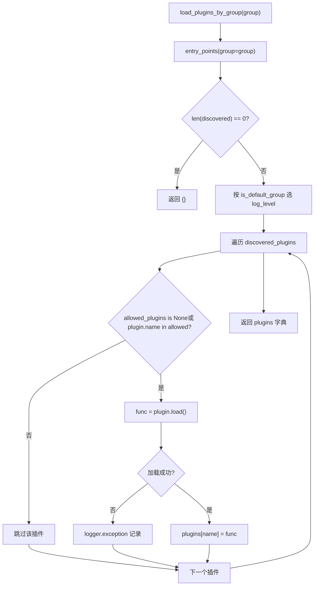
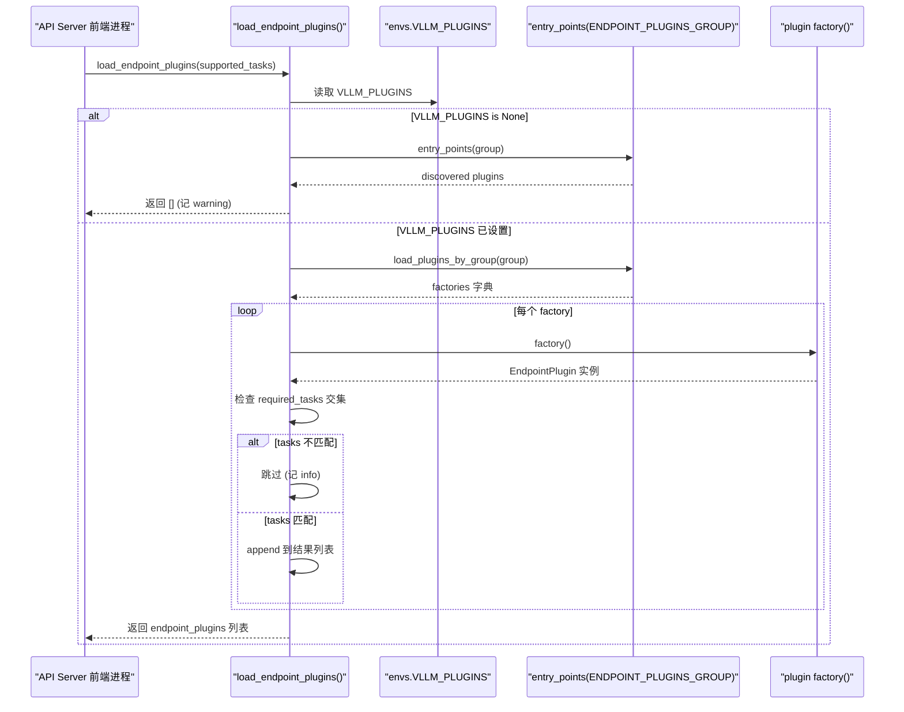

# Chapter 13: Plugin System and Extensibility: Platforms, IO Processors, and Endpoint Extensions

In the previous chapter, we saw that advanced features such as prefix caching, speculative decoding, and LoRA are deeply coupled into the core paths of the scheduler, KV management, and model execution. But for an inference engine to truly move into production, performance alone is not enough - it must answer a more difficult question: when the community wants to integrate a new piece of hardware, a new multimodal input format, or a custom HTTP route, how can this be done without forking the core code? This is precisely the significance of the plugin system. vLLM's architecture is inherently multi-process: the API Server frontend process, the EngineCore process, and the Worker process corresponding to each TP/PP rank. If the plugin mechanism simply "executes a piece of code at import time," then it will either execute repeatedly in every process, causing side effects to accumulate, or execute only in the main process, causing Workers to fail to receive the extension. What this chapter will unpack is how vLLM uses Python's standard entry_points mechanism, combined with the triple constraints of group + process boundary + loading timing, to build a plugin system that can both cover all processes and precisely control the exposed surface. We focus on three main lines: platform plugins (adapting to new hardware), IO processor plugins (intervening in multimodal input processing), and endpoint plugins (injecting custom API routes). The loading strategies of the three are completely different. Understanding this difference means understanding vLLM's philosophical trade-off between "extensibility" and "security boundaries."

# 1. Plugin Discovery and Loading: The Grouping Contract of entry_points

## Intuitive model: the plugin's "broadcast channels"

Think of vLLM's plugin system as a set of broadcast channels. When each plugin package is installed, through`setup.py`'s`entry_points`it "registers" its call sign (plugin name) and response function (plugin value) with a certain channel. vLLM scans these channels at startup and decides which channels are "listened to" in which processes.

Without this mechanism, extending vLLM could only be done by modifying source code—every time the community adds a piece of hardware, a fork must be maintained, ultimately leading to version fragmentation. The value of the grouping mechanism lies in:**The same plugin package can be registered to only a specific channel, thereby being restricted to loading in specific processes**。

## Data structures: five group constants and a global flag

vLLM in`vllm/plugins/__init__.py`The top defines five entry point group constants, each corresponding to a loading strategy:

[FACT:vllm/plugins/__init__.py:16-30]

```python
DEFAULT_PLUGINS_GROUP = "vllm.general_plugins"
IO_PROCESSOR_PLUGINS_GROUP = "vllm.io_processor_plugins"
PLATFORM_PLUGINS_GROUP = "vllm.platform_plugins"
STAT_LOGGER_PLUGINS_GROUP = "vllm.stat_logger_plugins"
ENDPOINT_PLUGINS_GROUP = "vllm.endpoint_plugins"
```

The comments hide key information:`DEFAULT_PLUGINS_GROUP`In**All processes**Load (process0, engine core, worker);`IO_PROCESSOR_PLUGINS_GROUP` **Only in process0**；`PLATFORM_PLUGINS_GROUP`Load in all processes, but the trigger timing is`current_platform`When first accessed;`STAT_LOGGER_PLUGINS_GROUP`Only in process0 and in async mode;`ENDPOINT_PLUGINS_GROUP`Only in the API Server frontend process.

Immediately following is a module-level global variable`plugins_loaded = False` [FACT:vllm/plugins/__init__.py:32-33], which is the guard for idempotent loading—the comment explicitly states "make sure one process only loads plugins once".

## Step-by-Step: A complete`load_plugins_by_group`call flow

Scenario: the user in`setup.py`registered`vllm.general_plugins`under`register_dummy_model`, now vLLM starts, and some process calls`load_general_plugins()`。

**Step 1: Idempotent guard.** `load_general_plugins`First checks`plugins_loaded`, if already`True`directly returns[FACT:vllm/plugins/__init__.py:77-90]. Note a subtlety here: the guard is set**before**loading, meaning that even if subsequent loading throws an exception, it will not retry. This is intentional—plugin loading failure should not cause the process to repeatedly attempt.

**Step 2: Discovery.**Enters`load_plugins_by_group`, through`importlib.metadata.entry_points(group=group)`obtains all installed entry points under that group[FACT:vllm/plugins/__init__.py:36-45]. If empty, logs a debug message and returns an empty dictionary.

**Step 3: Log level classification.**The source code distinguishes log levels for default and non-default groups:`is_default_group`when true uses`logger.debug`, otherwise uses`logger.info` [FACT:vllm/plugins/__init__.py:47-54]. The motivation is practical—`vllm.general_plugins`usually has a large number of model registration plugins attached, and using INFO would flood the screen; while platform/endpoint plugins are few and important, and deserve INFO visibility.

**Step 4: Whitelist filtering.**Reads`envs.VLLM_PLUGINS`, if`None`then loads all, otherwise only loads plugins whose names are in the list[FACT:vllm/plugins/__init__.py:62-70]. Note`plugin.load()`is wrapped in try/except, so a single plugin loading failure only logs an exception and does not affect other plugins[FACT:vllm/plugins/__init__.py:68-72]。

**Step 5: Execution.**Returns to`load_general_plugins`, and directly calls each loaded function`func()` [FACT:vllm/plugins/__init__.py:77-90]. This is why the documentation emphasizes that plugin functions must be**re-entrant**—it may be called multiple times in multiple processes.

The flowchart below depicts the complete decision path of`load_plugins_by_group`:



## Design thinking: why use entry_points instead of a configuration file

> **[Design Inference & Architectural Trade-offs]**
> Choosing`entry_points`instead of a custom configuration file, the core motivation is**to let plugins be distributed together with the Python package**. After the user`pip install vllm-add-dummy-platform`, the plugin automatically appears in the corresponding group, with no need to manually edit vLLM's configuration. This is in the same lineage as the plugin ecosystems of tools such as pytest and flake8. The cost is that plugin discovery depends on package metadata; if the plugin package is not fully installed (for example, only the source directory was copied without going through pip), entry_points cannot be scanned.

---

# II. Platform plugins: the abstraction layer for hardware adaptation

## Intuitive model: the platform is a "hardware dialect translator"

`Platform`The**class is the**sole translator`current_platform.get_attn_backend_cls()`、`current_platform.is_cuda_alike()`for all communication between vLLM and hardware. Model code only calls abstract methods such as`import torch.cuda`, and never directly`if device == "xpu"`. Without this layer of abstraction, every new piece of hardware supported would require adding

## branches in the model code, eventually turning into spaghetti.

`Platform`Data structures: field layout of the Platform base class`vllm/platforms/interface.py`is a pure class (not used as an instance), and the key class attributes are defined at the beginning of[FACT:vllm/platforms/interface.py:135-179]：

```python
class Platform:
    _enum: PlatformEnum
    device_name: str
    device_type: str
    dispatch_key: str = "CPU"
    ray_device_key: str = ""
    device_control_env_var: str = "VLLM_DEVICE_CONTROL_ENV_VAR_PLACEHOLDER"
    ray_noset_device_env_vars: list[str] = []
    simple_compile_backend: str = "inductor"
    dist_backend: str = ""
    supported_quantization: list[str] = []
    additional_env_vars: list[str] = []
    _global_graph_pool: Any | None = None
```

`_enum`is`PlatformEnum`enum value, determining`is_cuda()`、`is_rocm()`and other judgments[FACT:vllm/platforms/interface.py:69-78]。`device_control_env_var`is the platform-independent abstraction of "device visibility environment variables"—CUDA is`CUDA_VISIBLE_DEVICES`, and other platforms each define[FACT:vllm/platforms/interface.py:151-152]。`_global_graph_pool`is the class-level CUDA graph memory pool cache, lazily initialized through`get_global_graph_pool`[FACT:vllm/platforms/interface.py:1210-1215]。

It is worth noting the fallback logic of`__getattr__`: when accessing an attribute that does not exist on Platform, it tries to forward from the[FACT:vllm/platforms/interface.py:1189-1208]namespace. This allows platform code to write`torch.<device_type>`while actually calling`current_platform.memory_allocated()`. But the source code deliberately excludes dunder methods—otherwise pickle checking`torch.cuda.memory_allocated()`would get`__getstate__`and try to call it`None`[FACT:vllm/platforms/interface.py:1182-1185]。

## Step-by-Step: three-namespace conversion of device IDs

The easiest pitfall in platform abstraction is**device ID namespaces**. The source code comments explicitly list three kinds of[FACT:vllm/platforms/interface.py:275-283]：

- **logical**: vLLM's internal local rank, indexing`_assigned_physical_gpu_ids`
- **visible**: the torch/CUDA ordinal after the current process is remapped by`CUDA_VISIBLE_DEVICES`
- **physical**: the global GPU ID used by topology APIs such as NVML, unaffected by environment variables

Scenario: a Worker process is assigned physical GPU`[4, 5]`, environment variable`CUDA_VISIBLE_DEVICES=4,5`, now local rank 0 needs to be converted to`torch.device("cuda:0")`。

**Step 1: logical → physical.** `device_id_to_physical_device_id(0)`First checks`_assigned_physical_gpu_ids`, if already set then directly indexes and returns`4` [FACT:vllm/platforms/interface.py:296-297]. If not set, then splits the comma-separated list from`device_control_env_var`and takes item 0[FACT:vllm/platforms/interface.py:305-311]. Note that the source code deliberately treats**empty string**as unset—this is a legal configuration when Ray starts the engine on a pure CPU placement group[FACT:vllm/platforms/interface.py:296-297]。

**Step 2: physical → visible.** `logical_device_id_to_visible_device_id(0)`After obtaining the physical`4`, split the environment variable into`[4, 5]`, find the index of`4`and return`0`. If the physical ID is not in the visible list, throw[FACT:vllm/platforms/interface.py:316-339]—this is a hard safeguard against cross-process misuse of invisible devices.`RuntimeError`The idempotent design of

`set_assigned_physical_gpu_ids`is also worth noting: setting the same value repeatedly is a no-op, while setting a different value throws`RuntimeError` [FACT:vllm/platforms/interface.py:38-56]. This prevents device mappings from being accidentally overwritten in multithreaded environments.

## Registration and configuration injection of platform plugins

Platform plugins are registered through the`vllm.platform_plugins`group, and the plugin function returns the fully qualified name of the platform class (or`None`to indicate that the current environment is not supported)[FACT:docs/design/plugin_system.md:50-50]. The minimal implementation given in the documentation requires[FACT:docs/design/plugin_system.md:100-100]：

- `_enum`is usually set to`PlatformEnum.OOT`（out-of-tree）
- `device_type`returns the device type string recognized by PyTorch
- `check_and_update_config`is called early during vLLM initialization,**and must be set here`worker_cls`**
- `get_attn_backend_cls`returns the attention backend class name
- `get_device_communicator_cls`returns the communicator class name

`check_and_update_config`is the most critical hook of the platform plugin[FACT:vllm/platforms/interface.py:583-592]. It receives a`VllmConfig`reference and modifies it in place, and can adjust block size, graph mode, etc. The documentation emphasizes that "the most important thing is that worker_cls must be set here"[FACT:docs/design/plugin_system.md:105-105]—because vLLM needs to know which Worker class to use to instantiate the worker process.

## Design consideration: the three-stage strategy for block size alignment

The most complex logic in the platform interface is`update_block_size_for_backend` [FACT:vllm/platforms/interface.py:666-708]. It is divided into three stages to ensure that the block size is compatible with the attention backend:

**Phase 1**: if the user has not explicitly specified`--block-size`, call`_preferred_block_size_for_backends`to select the smallest block size supported by all backends[FACT:vllm/platforms/interface.py:687-697]. This function uses LCM (least common multiple) to enumerate candidate values, because some backends (such as CPU_MLA) only accept exact sizes rather than multiples[FACT:vllm/platforms/interface.py:622-663]。

**Phase 2**: hybrid models (attention + mamba) need to align the block with the mamba page size[FACT:vllm/platforms/interface.py:699-702]。

**Phase 3**: when multiple KV dtypes share a block pool (such as nvfp4 primary + unquantized skip layers), the primary block needs to be enlarged enough to cover the largest padded spec page[FACT:vllm/platforms/interface.py:704-708]。

> **[Design Inference & Architectural Trade-offs]**
> This staged design reflects the reality faced by vLLM: different hardware, different quantization schemes, and different model architectures impose conflicting constraints on block size, which cannot be solved with a single formula. Staging allows each constraint to be handled independently, and finally a solution satisfying all constraints is chosen.

---

# III. IO Processor and endpoint plugins: input processing and API extension

## Intuitive model: IO Processor is a "multimodal translation layer"

The input of a multimodal model (such as LLaVA) is not plain text, but a mixture of text + images. The IO Processor plugin is responsible for converting raw multimodal data into tensors that the model can consume, and then converting the model output back into a human-readable format. It is like a customs translator: incoming foreign languages (images/audio) are translated into the model's native language, and outgoing model native language is translated back into foreign languages.

## Step-by-Step: discovery and instantiation of IO Processor

Scenario: loading a model with an HF config containing a`io_processor_plugin`field.

**Step 1: determine the plugin name.** `get_io_processor`Prefer the explicitly passed`plugin_from_init`, otherwise read`hf_config`from the`io_processor_plugin`field of[FACT:vllm/plugins/io_processors/__init__.py:42-50]. If both are empty, return`None`—indicating that the model does not need an IO processor[FACT:vllm/plugins/io_processors/__init__.py:52-54]。

**Step 2: load all installed plugins.**Call`load_plugins_by_group(IO_PROCESSOR_PLUGINS_GROUP)`to get all plugins under that group[FACT:vllm/plugins/io_processors/__init__.py:59-61]。

**Step 3: build the loadable mapping.**Iterate over each plugin, call its function to get`processor_cls_qualname`, and if it is not`None`, record it in`loadable_plugins` [FACT:vllm/plugins/io_processors/__init__.py:66-76]. Note that each plugin's function call here is also wrapped in try/except, so a single failure does not affect the others.

**Step 4: validate and instantiate.**If the number of loadable plugins is 0, throw`ValueError`indicating "an IOProcessor plugin is required but none is installed"[FACT:vllm/plugins/io_processors/__init__.py:66-76]. If the plugin name required by the model is not in the loadable list, throw`ValueError`and list all available plugin names[FACT:vllm/plugins/io_processors/__init__.py:80-81]. Finally, resolve the class name through`resolve_obj_by_qualname`and instantiate[FACT:vllm/plugins/io_processors/__init__.py:80-81]。

## Endpoint plugins: a default-deny security posture

Endpoint plugins are the most special category in this chapter, because they**are not loaded by default**。`load_endpoint_plugins`The docstring of explicitly explains the reason: endpoint plugins add HTTP routes to the API Server, expanding the network exposure surface, so a stricter "default deny" posture is adopted than`load_plugins_by_group`[FACT:vllm/plugins/__init__.py:93-94]。

The specific rule is: only when the plugin name**explicitly appears in`VLLM_PLUGINS`**, and its`required_tasks`is`None`or has an intersection with the tasks supported by the server, is it loaded[FACT:vllm/plugins/__init__.py:108-108]。

Scenario: the user installed an endpoint plugin but forgot to set`VLLM_PLUGINS`。

**Step 1: check whether VLLM_PLUGINS is unset.**If`envs.VLLM_PLUGINS is None`, first discover the plugins under that group, and if any exist, log a warning indicating "must be explicitly allowlisted"[FACT:vllm/plugins/__init__.py:126-126]. Note that the source code comment specifically points out:`VLLM_PLUGINS=""`is parsed as`[""]`rather than`None`, so it is treated as an "allowlist that matches no plugins" rather than "unset"[FACT:vllm/plugins/__init__.py:108-108]. This boundary distinction is important—an empty string is an explicit "load nothing", while`None`is "not configured".

**Step 2: load and instantiate.**After obtaining the factory function through`load_plugins_by_group`, call`factory()`one by one to instantiate[FACT:vllm/plugins/__init__.py:133-141]. Instantiation failures are logged as exceptions and continue.

**Step 3: task gating.**Check`plugin.required_tasks`, if it is not`None`and intersects with`supported_tasks`No intersection, skip this plugin[FACT:vllm/plugins/__init__.py:144-145]. This allows the same plugin package to register different endpoints for different tasks (e.g., embedding vs generation).

The following sequence diagram depicts the complete interaction of an endpoint plugin from discovery to loading:



## Design consideration: Process boundaries determine loading strategy

The differences in loading strategies for the three types of plugins are essentially a mapping of**process boundaries**:

| Plugin type | Loading process | Default behavior | Motivation |
| --- | --- | --- | --- |
| general | All processes | Load all | Model registration must be visible in every Worker |
| platform | All processes | Load all | Hardware abstraction is depended upon by all processes |
| io_processor | Only process0 | Load all | Input processing only occurs at the frontend |
| stat_logger | Only process0 (async) | Load all | Logs are only collected in the main process |
| endpoint | Only API Server | **Deny by default** | Expands network exposure surface, requires explicit authorization |

> **[Design Inference & Architectural Trade-offs]**
> The "deny by default" approach for endpoint plugins is standard practice in security engineering: any extension that expands the attack surface should be opt-in. Other plugins are loaded by default because they do not directly expose network interfaces, and the community ecosystem needs a low-friction onboarding experience.

## Production pitfall: Silent degradation on plugin load failure

`load_plugins_by_group`For each plugin's`plugin.load()`is wrapped in try/except, and failures only log an exception[FACT:vllm/plugins/__init__.py:68-72]. This means**a broken plugin will not prevent vLLM from starting**, but it also will not give an explicit error—users may be confused about "why my plugin isn't taking effect."

Troubleshooting suggestion: Set the log level to DEBUG and search for`"Failed to load plugin"`. If the plugin is under the`vllm.general_plugins`group, the default log level is DEBUG, and it must be explicitly enabled to see loading details[FACT:vllm/plugins/__init__.py:49-50]。

Another pitfall is the timing of setting the`plugins_loaded`guard[FACT:vllm/plugins/__init__.py:77-90]: it is set before loading`True`. If the first load fails for some reason (such as an entry_points scan exception), subsequent calls will return directly without retrying. This can cause the bizarre phenomenon of "the plugin works sometimes and not others" in test environments.

---

# Chapter summary

vLLM's plugin system is built on Python`entry_points`, using**five group constants**to divide extension types, using**process boundaries**to determine the loading scope, and using**`VLLM_PLUGINS`an allowlist**to control the loading set. Platform plugins use the`Platform`base class to abstract hardware differences, and its three-namespace device ID conversion (logical/visible/physical) is the core of cross-process device management; IO processor plugins are triggered by the HF config's`io_processor_plugin`field and are responsible for translating multimodal inputs; endpoint plugins adopt a "deny by default" posture and are loaded only when explicitly allowlisted and the task matches, in order to control network exposure surface.

The three main lines share the same discovery mechanism, but the differences in loading strategy reflect vLLM's trade-off between "extension convenience" and "security boundaries": plugins that do not expose the network are loaded by default, while plugins that expose the network must be opt-in.

# Chapter review questions

Q1: If the try/except in`load_plugins_by_group`for`plugin.load()`is removed, allowing load failures to be thrown directly, what impact would this have on vLLM's multi-process startup? In what scenarios would this instead be a better design?

> **[Design Inference & Architectural Trade-offs]**
> **Reference analysis**: The current implementation[FACT:vllm/plugins/__init__.py:68-72]silently swallows a single plugin load failure, logging only an exception. If the try/except is removed, the load failure would propagate up to`load_general_plugins`, thereby interrupting process startup. In a multi-process scenario, this would cause: if a plugin fails to load in a Worker process, the entire engine cannot start—this could be a good thing (fail fast, avoiding inconsistent state caused by some processes running while unhealthy), or a bad thing (a bug in an optional plugin drags down the entire service). A better design might introduce a`VLLM_PLUGINS_STRICT`environment variable: lenient by default (current behavior), and in strict mode a load failure throws an exception. This way, production environments can require that "all declared plugins must load successfully," while development environments remain fault-tolerant.

Q2: `load_endpoint_plugins`In`VLLM_PLUGINS=""`, what is the behavioral difference between`VLLM_PLUGINS`and`None`not being set (

> **[Design Inference & Architectural Trade-offs]**
> **[Design inference and architectural trade-offs]**Reference analysis`VLLM_PLUGINS=""`: The source code comments explicitly state that`[""]`is parsed as`None`rather than[FACT:vllm/plugins/__init__.py:108-108], and is therefore treated as an "allowlist that matches no plugins"`VLLM_PLUGINS is None`. When`load_endpoint_plugins`,`[]`directly returns[FACT:vllm/plugins/__init__.py:126-126]and logs a warning`VLLM_PLUGINS=""`; when`load_plugins_by_group`, the code continues to**, but since the empty string matches no plugin name, it ultimately also returns an empty list. The two have the same**result**(neither loads endpoint plugins), but different**：`None`semantics`""`: "the user did not configure it, so we actively deny and warn," versus

Q3: `device_id_to_physical_device_id`"the user explicitly configured an empty allowlist, so we respect their intent and do not warn." This distinction allows operations staff to "silently disable all endpoint plugins" by setting an empty string, without having to endure warning noise on every startup.`device_control_env_var`In[FACT:vllm/platforms/interface.py:302-308], why does the source code treat an empty

**as unset**? If this empty string check were removed, what would happen in Ray's CPU-only placement group scenario?[FACT:vllm/platforms/interface.py:296-297]Reference analysis`!= ""`: The source code comments explain that an empty environment variable is a legal configuration when Ray starts a CPU-only placement group on a GPU node`device_ids = "".split(",")`. If the`[""]`check were removed, the code would enter the`device_ids[device_id]`branch, obtain`int("")`, then`ValueError`. This causes the engine to fail to start under a legal Ray configuration. After keeping the check, an empty environment variable goes to the`else`branch and returns directly`device_id`, i.e., assuming the logical ID equals the physical ID—this is safe in CPU-only scenarios because there is no GPU to map. This case shows that "unset" and "set to empty" environment variables have different semantics in distributed orchestration systems, and the code must handle them explicitly.

---

The next chapter turns to architectural trade-offs, production pitfalls, and future evolution. We will put together the mechanisms dissected in the previous thirteen chapters, examine vLLM's trade-offs among performance, maintainability, and extensibility, and look ahead to the evolution direction of inference engines.

At this point, we have seen clearly how vLLM opens up extensibility while keeping the core code stable through the grouping mechanism of entry_points, process-boundary-aware loading timing, and differentiated strategies for three types of plugins: platforms, IO processors, and endpoints. This plugin system allows new hardware, new input formats, and new API routes to be integrated non-invasively, but extensibility itself also means more dimensions that need to be weighed. The next chapter will conclude the book, systematically sorting out the tensions in vLLM's key design decisions—continuous batching and GPU memory fragmentation, CUDA Graph and dynamic shapes, disaggregated deployment and network overhead—and provide a production environment pitfalls checklist and diagnostic path, while also looking ahead to the evolution trends of the Rust frontend, the IR layer, and heterogeneous hardware directions.
