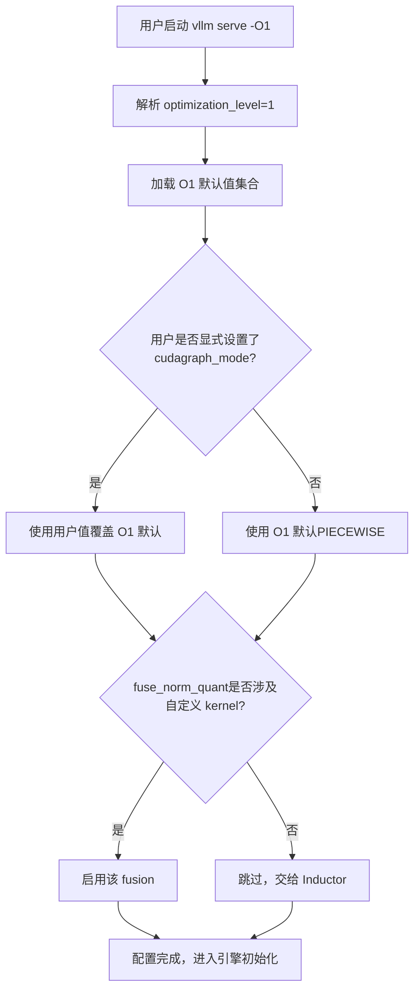
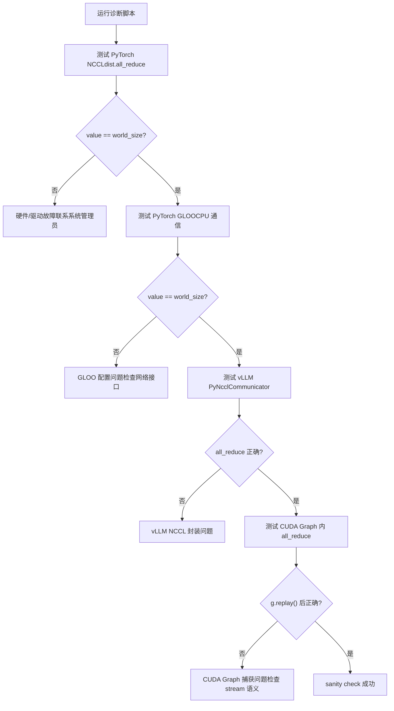

# Chapter 14: Architectural Trade-offs, Production Pitfalls, and Future Evolution

In the previous chapter, we dissected vLLM's plugin-based extension mechanism and saw how platform plugins, IO processor plugins, and endpoint plugins allow the engine to adapt to new hardware, new modalities, and new APIs without modifying the core code. This extensibility allows vLLM to quickly embrace change, but the more extension points there are, the more complex the interaction paths become in production environments. When real problems such as GPU memory fragmentation, NCCL handshake failures, compilation cache invalidation, and network jitter occur simultaneously, the mechanisms introduced in the previous thirteen chapters pull against one another, exposing tensions that were not visible in ideal environments. This chapter does not introduce new core mechanisms, but instead puts these mechanisms together, using the official troubleshooting documentation as an anchor, combining it with the design of the Rust frontend bench tool, examining the trade-offs between performance and operability, and providing an actionable diagnostic path.

# I. Optimization Levels: An Explicit Contract Between Startup Time and Runtime Performance

## Intuitive Model

Optimization levels are like a camera's "scene modes": auto mode (`-O2`) suits most scenarios, but when you need to capture quickly (debug), switching to manual mode (`-O0`) responds immediately at the cost of lower image quality (performance). vLLM turns this trade-off into an explicit four-level contract, rather than hiding it in dozens of boolean flags for users to assemble themselves.

## Field Layout of the Four Levels

vLLM provides`-O0`through`-O3`four levels[FACT:docs/design/optimization_levels.md:5-5]. The core design principle is:**Flags explicitly set by the user take precedence over the optimization level defaults** [FACT:docs/design/optimization_levels.md:5-5]. This means the optimization level is only a set of defaults, not a hard constraint.

`-O0`turns off everything: no autotuning, no compilation, no cudagraph[FACT:docs/design/optimization_levels.md:32-33]. Specifically, it comes down to four switches:`cudagraph_mode=NONE`、`mode=NONE`, all fusion disabled,`enable_flashinfer_autotune=False` [FACT:docs/design/optimization_levels.md:37-40]。

`-O1`is the balance point for development scenarios: enable`PIECEWISE`cudagraph and`VLLM_COMPILE`mode[FACT:docs/design/optimization_levels.md:50-51]. Note that there is a subtle detail here:`fuse_norm_quant`and`fuse_act_quant`are enabled only when one of the operators uses a custom kernel; otherwise Inductor's automatic fusion works better[FACT:docs/design/optimization_levels.md:61]. This is a typical design judgment of "don't compete with the compiler for work."

`-O2`is the default, aimed at production[FACT:docs/design/optimization_levels.md:66-67]. On top of`-O1`it adds`FULL_AND_PIECEWISE`cudagraph and`fuse_allreduce_rms` [FACT:docs/design/optimization_levels.md:72-73]。`-O3`currently equivalent to`-O2`, reserving[FACT:docs/design/optimization_levels.md:80-81]。

## for more aggressive experimental optimizations in the future.

Scenario-Driven Selection Flow`vllm serve model -O1`When a user executes

Copy`check_user`The key to this flow is the[FACT:docs/design/optimization_levels.md:5-5]branch: explicit user settings always take precedence

## . This avoids hard-to-troubleshoot problems such as "the optimization level silently overrode my debug flag."

Design Considerations and Pitfalls**The most common production trap of optimization levels is**excessively long startup time`-O0`. The documentation explicitly recommends: when startup time is too long, use`-O1` [FACT:docs/design/optimization_levels.md:87]or`-O0`. But there is a hidden cost here—

without cudagraph, the CPU launch overhead of each kernel is exposed, and throughput may drop several times in high-concurrency scenarios.**Another trap is**。`-O2`compilation errors`FULL_AND_PIECEWISE`. The`-O2`cudagraph has stronger assumptions about model structure; some custom models fail to compile under`-O1`but work normally under`debug_dump_path`. The documentation recommends using[FACT:docs/design/optimization_levels.md:88]to obtain more debugging information`-O0`. The troubleshooting path should be: first use`-O1`、`-O2`to confirm functional correctness, then gradually upgrade to

> **[Design Inference & Architectural Trade-offs]**
> [Design Inference and Architectural Trade-offs]`--enforce-eager`It is the same methodology: first use the most conservative configuration to confirm correctness, then gradually enable optimizations, isolating problems to the smallest configuration difference.

---

# II. Production Pitfall Checklist: Diagnostic Path from Symptoms to Root Causes

## Intuitive Model

Troubleshooting in production is like emergency triage: you cannot run a full battery of tests on every patient. You must first quickly narrow the scope based on symptoms (OOM, hang, crash), then dig deeper in a targeted way. vLLM's troubleshooting documentation is essentially a triage manual.

## Symptom Classification and Diagnostic Tools

The documentation divides common issues into several major categories. We will walk through them in order of increasing diagnostic difficulty.

**Category 1: Model download/loading hangs.**The symptom is no response for a long time after startup. The root cause is usually slow network or slow shared filesystem.[FACT:docs/usage/troubleshooting.md:11-11]. The diagnostic method is`--load-format dummy`Skip weight loading to isolate whether it is download slowness or loading slowness[FACT:docs/usage/troubleshooting.md:23-23]. This is a classic "binary search isolation" technique.

**Category 2: GPU memory OOM.**The documentation points directly to the conserving_memory configuration doc[FACT:docs/usage/troubleshooting.md:23]. But OOM in production is often not because the model is too large, but because of KV cache fragmentation or concurrency request counts exceeding expectations.

**Category 3: Generation quality changes.**This is an easily overlooked pitfall. v0.8.0 changed the source of default sampling parameters: from vLLM's neutral defaults to the model author's`generation_config.json` [FACT:docs/usage/troubleshooting.md:23-23]. In most cases this improves quality, but for some models the configuration is actually worse[FACT:docs/usage/troubleshooting.md:23-23]. The diagnostic method is to fall back to`--generation-config vllm`compare[FACT:docs/usage/troubleshooting.md:23-23]。

**Category 4: Hang.**This is the hardest category to diagnose. The documentation provides a set of progressive debugging environment variables[FACT:docs/usage/troubleshooting.md:41-41]：

- `VLLM_LOGGING_LEVEL=DEBUG`: enable verbose logging
- `VLLM_LOG_STATS_INTERVAL=1.`: high-frequency output of queue and cache hit status
- `CUDA_LAUNCH_BLOCKING=1`: locate which CUDA kernel is causing the problem
- `NCCL_DEBUG=TRACE`: enable NCCL verbose logging
- `VLLM_TRACE_FUNCTION=1`: record all function calls, but it slows things down by more than 100x[FACT:docs/usage/troubleshooting.md:41]

There is an important operational discipline here: after debugging, you must turn off these environment variables, or directly open a new shell, otherwise the residual debugging configuration will continue to slow down the system[FACT:docs/usage/troubleshooting.md:11-11]。

## The Process Boundary Trap of Breakpoint Debugging

vLLM's multi-process architecture makes conventional`pdb`breakpoints ineffective — if a breakpoint executes in a child process, it will throw`BdbQuit` [FACT:docs/usage/troubleshooting.md:45-54]. Two solutions: use`forked-pdb` [FACT:docs/usage/troubleshooting.md:57-61], or set`VLLM_ENABLE_V1_MULTIPROCESSING=0`to keep the scheduler in the same process[FACT:docs/usage/troubleshooting.md:63-68]。

> **[Design Inference & Architectural Trade-offs]**
> Although the second method is convenient, it changes the execution model — in single-process mode, EngineCore and API Server no longer communicate through queues, and some concurrency bugs may not be reproducible. So it is suitable for locating logic errors, but not for reproducing concurrency issues.

## Diagnosis of Distributed Communication

There is dedicated diagnostic documentation for distributed deployment. The core recommendations are:**Set environment variables at cluster creation time**, because variables propagate to all nodes; setting them in the shell only affects the local node[FACT:docs/serving/distributed_troubleshooting.md:16-16]。

A high-frequency issue is`No available node types can fulfill resource request`, which occurs even when the cluster has enough GPUs[FACT:docs/serving/distributed_troubleshooting.md:16-16]. The root cause is usually that a node has multiple IPs and vLLM chose the wrong one. The solution is to use`VLLM_HOST_IP`to explicitly specify, and use`ray status`to verify[FACT:docs/serving/distributed_troubleshooting.md:16-16]。

## Diagnostic Script for NCCL Initialization Failure

The documentation provides a complete diagnostic script that verifies the communication stack layer by layer[FACT:docs/usage/troubleshooting.md:89-150]. Its design is very layered:

The brilliance of this script lies in its layer-by-layer isolation: first verify the lowest-level PyTorch NCCL, then verify CPU-side GLOO, then verify vLLM's own PyNcclCommunicator wrapper, and finally verify communication within CUDA Graph[FACT:docs/usage/troubleshooting.md:90-146]. Each layer's failure points to a different root cause.

A noteworthy detail in the script:`pynccl.disabled = False`is for backward compatibility with 0.6.4 and below[FACT:docs/usage/troubleshooting.md:121-125]. 0.6.5+ enables it by default, but keeping this line prevents users reading the latest documentation from being confused.

For multi-node testing, the documentation deliberately uses`--rdzv_backend=static`instead of`c10d`, because`c10d`will fail due to DNS resolution failure in multi-node setups[FACT:docs/usage/troubleshooting.md:168-168]. This is a typical "you only know after stepping on the pit" configuration.

## Design Thinking and Pitfalls

**NCCL Initialization Failure**（`ncclCommInitRank`reporting unhandled system error) usually points to two root causes: missing`IPC_LOCK`capability or`/dev/shm`not mounted[FACT:docs/usage/troubleshooting.md:311-311]. Both are classic traps in containerized deployment.

**CUDA PTX Toolchain Mismatch**（`the provided PTX was compiled with an unsupported toolchain`) indicates that the PTX in the wheel was compiled with a higher version of the CUDA toolkit[FACT:docs/usage/troubleshooting.md:325-327]. The solution is to enable CUDA forward compatibility: add under Docker`-e VLLM_ENABLE_CUDA_COMPATIBILITY=1` [FACT:docs/usage/troubleshooting.md:325-327], and on bare metal install the`cuda-compat`package and set`VLLM_CUDA_COMPATIBILITY_PATH` [FACT:docs/usage/troubleshooting.md:325-327]。

**Known NCCL Memory Overhead Issue**：vLLM `>= 0.4.3, <= 0.10.1.1`will set`NCCL_CUMEM_ENABLE=0`to work around an NCCL bug. External processes connecting to vLLM must also set this variable, otherwise they will hang or crash[FACT:docs/usage/troubleshooting.md:375]. After the fix in NCCL 2.22.3, newer versions removed this override to allow performance optimization[FACT:docs/usage/troubleshooting.md:375]. This case shows:**The cross-process environment variable contract is an implicit dependency of distributed systems**, and must be synchronized during upgrades.

---

# III. Rust Frontend: The Zero-Copy Design Philosophy of the bench Tool

## Intuitive Model

If the Python frontend is a "fully featured but heavy" Swiss Army knife, the Rust bench tool is a scalpel "built only for stress testing." Its design goal is not feature coverage, but minimizing the client's own overhead under high concurrency, so that the measured numbers truly reflect server-side performance.

## Data Structures and Memory Layout

The core data structure of the bench tool is`RequestFuncInput` [FACT:rust/src/bench/src/backends/mod.rs:59-89]. It makes heavy use of`Arc<str>`and`Arc<[u32]>`rather than`String`/`Vec`, which is the core of the zero-copy design.

Look at a few key fields:`prompt: Arc<str>` [FACT:rust/src/bench/src/backends/mod.rs:50-52]——Multiple concurrent requests can share the same prompt string, avoiding cloning a copy for each request.`prompt_token_ids: Option<Arc<[u32]>>` [FACT:rust/src/bench/src/backends/mod.rs:77]——Precomputed token IDs are sent directly to the server, skipping server-side tokenization[FACT:rust/src/bench/src/backends/mod.rs:74-76]。

The most ingenious part is`multi_modal_content: Option<Arc<[Arc<str>]>>` [FACT:rust/src/bench/src/backends/mod.rs:81]. The comment explains: multimodal content is treated as pre-serialized JSON fragments, and the chat backend directly concatenates them into the payload byte stream, avoiding any parsing or deep copying of base64 image data[FACT:rust/src/bench/src/backends/mod.rs:78-80]. This is a two-layer`Arc`structure: the outer layer`Arc<[...]>`shares the entire array, and the inner layer`Arc<str>`shares a single fragment.

`chat_messages_json: Option<Arc<str>>`has the highest priority and is concatenated directly into the payload as-is[FACT:rust/src/bench/src/backends/mod.rs:82-85]。

## Zero-allocation deserialization

Parsing SSE streaming responses is another performance-critical point. The comment explicitly states: use typed deserialization to avoid building the complete`serde_json::Value`tree, and extract only the needed fields[FACT:rust/src/bench/src/backends/mod.rs:20-24]。

`CompletionChunk`keep only`choices`and`usage`two fields[FACT:rust/src/bench/src/backends/mod.rs:20-24]，`ChatChunk`Similarly[FACT:rust/src/bench/src/backends/mod.rs:33-37]。`#[serde(default)]`makes the missing`choices`field default to an empty array[FACT:rust/src/bench/src/backends/mod.rs:20-24], which is a common case for streaming responses.

## Scenario-driven request flow

When a stress-test request is sent, how does the data flow? The data flow diagram below shows the transformation from input to output:

`Backend`The enum uses static dispatch to avoid the async trait object problem[FACT:rust/src/bench/src/backends/mod.rs:150-154]。`send_request`through`match`dispatches to the concrete implementation[FACT:rust/src/bench/src/backends/mod.rs:158-168]。`get_backend`returns the corresponding backend according to`BackendKind`[FACT:rust/src/bench/src/backends/mod.rs:172-181]。

One detail:`API_KEY`uses`OnceLock`caching to avoid making an environment variable syscall on every request[FACT:rust/src/bench/src/backends/mod.rs:186-188]。`build_headers`inserts Content-Type, Authorization, extra headers, and request-id in sequence[FACT:rust/src/bench/src/backends/mod.rs:191-215]。

## Design reflections and pitfalls

> **[Design Inference & Architectural Trade-offs]**
> The zero-copy design of the Rust bench tool reflects an important judgment:**the client overhead of a stress-testing tool becomes a source of measurement error**. If every request clones the prompt, parses the full JSON, and deep copies base64 images, then client overhead is mixed into the measured latency, and it cannot truly reflect server performance. Using`Arc`to share immutable data and typed deserialization to skip irrelevant fields essentially reduces client overhead to near zero.

`RequestFuncOutput`The field design of`ttft`（time to first token）、`itl`is also worth noting:`tpot`（time per output token）[FACT:rust/src/bench/src/backends/mod.rs:93-105](inter-token latency array),

---

# . These three metrics correspond to different performance dimensions: TTFT reflects prefill and queueing latency, ITL reflects the stability of decode, and TPOT reflects overall throughput. If stress testing only looks at average latency, it will mask ITL jitter.

Design reflection: the underlying logic of architectural trade-offs

> **[Design Inference & Architectural Trade-offs]**
> **[Design inference and architectural trade-offs]**Continuous batching vs GPU memory fragmentation.

**Continuous batching allows the batch to be reorganized at every step, greatly improving throughput, but the cost is that KV cache allocation and release are extremely frequent. PagedAttention's block table mechanism is precisely designed to handle this high-frequency allocation—fixed-size blocks eliminate external fragmentation, but introduce the indirect addressing overhead of the block table and internal fragmentation (the last block may not be fully filled). This is a typical trade-off of "using an indirection layer to exchange for a lower fragmentation rate," the same idea as virtual memory paging in operating systems.**CUDA Graph vs dynamic shapes.`PIECEWISE`CUDA Graph requires static shapes, but the batch size in continuous batching changes at every step. vLLM's solution is`FULL_AND_PIECEWISE`and[FACT:docs/design/optimization_levels.md:50,72]modes`-O0`——capture the statically capturable parts as graphs and keep the dynamic parts eager.`-O2`Completely disabling cudagraph is for debugging,`-O1`fully enabling it is for production, and the middle

**is a compromise.**Disaggregated deployment vs network overhead.`IPC_LOCK`、`/dev/shm`）[FACT:docs/usage/troubleshooting.md:311-311]KV Connector allows prefill and decode to be separated into different instances, but cross-instance transfer of KV cache introduces network latency. The configuration requirements for GPUDirect RDMA in the documentation (

**) show that this path has hard requirements on the infrastructure. Network jitter can cause KV transfer timeouts, which in turn trigger retries or degradation.**Operability vs performance.`VLLM_TRACE_FUNCTION=1`Optimization levels, debugging environment variables, and diagnostic scripts are all costs paid for operability.[FACT:docs/usage/troubleshooting.md:41]can slow things down by 100x

---

# , but it is the last resort for locating hang issues. A mature engine must provide these "slow but clear" tools.

Chapter summary

This chapter concludes the book, reexamining the mechanisms from the previous thirteen chapters from a production perspective.`-O0`Optimization levels (`-O3`to[FACT:docs/design/optimization_levels.md:5-5]) are an explicit contract between startup time and runtime performance, and user flags always take precedence over level defaults`Arc`. The production pitfalls checklist covers the complete diagnostic path from model loading, GPU memory OOM, generation quality changes, to distributed communication failures. The core methodology is "binary-search isolation" and "layer-by-layer verification." The Rust bench tool uses

Three core trade-off lines run through the entire book: continuous batching vs. GPU memory fragmentation, CUDA Graph vs. dynamic shapes, and disaggregated deployment vs. network overhead. Understanding these tensions is more important than memorizing any single mechanism—because every tuning decision in production is essentially about finding the balance point among these tensions.

# Chapter Review and Self-Assessment

Q1: If you change`-O2`'s`FULL_AND_PIECEWISE`cudagraph to`-O1`'s`PIECEWISE`, in what scenarios would performance regression be triggered? Why?

**Reference Analysis**：`-O2`On the basis of`-O1`, appending`FULL_AND_PIECEWISE`cudagraph mode[FACT:docs/design/optimization_levels.md:72]。`FULL`mode captures the entire forward pass into a single graph, while`PIECEWISE`only captures statically-capturable segments. In production scenarios with stable batch shapes,`FULL`mode eliminates more kernel launch overhead and achieves higher throughput. However, if the model contains dynamic control flow (such as MoE token routing),`FULL`mode may fail to capture or exhibit abnormal behavior after capture, in which case`PIECEWISE`is actually more stable. Performance regression occurs when: frequent batch size changes cause`FULL`graphs to miss, or the model structure triggers`FULL`mode's fallback path. The troubleshooting approach is to first use`-O1`to confirm the baseline, then upgrade to`-O2`for comparison, and use`VLLM_LOG_STATS_INTERVAL=1.`to observe queue status[FACT:docs/usage/troubleshooting.md:41-41]。

Q2: In the diagnostic script, why must PyTorch GLOO be tested before testing vLLM PyNcclCommunicator? If you skip the GLOO test and directly test PyNccl, what would be missed?

**Reference Analysis**: The script's execution order is PyTorch NCCL → PyTorch GLOO → vLLM PyNccl → CUDA Graph[FACT:docs/usage/troubleshooting.md:90-146]. GLOO tests CPU-side communication[FACT:docs/usage/troubleshooting.md:106-112], while vLLM's`PyNcclCommunicator`requires a GLOO group as bootstrap[FACT:docs/usage/troubleshooting.md:120]. If the GLOO test is skipped, when PyNccl initialization fails, you cannot distinguish whether it's a NCCL issue itself or a GLOO bootstrap issue. GLOO depends on network interface configuration (`GLOO_SOCKET_IFNAME`）[FACT:docs/usage/troubleshooting.md:81-81], which is a high-frequency failure point in complex network environments. The value of layer-by-layer testing is isolating faults to the minimal configuration difference.

Q3: The Rust bench tool uses`Arc<str>`to share prompts. If the stress test scenario requires each request to send a different prompt, does this design become invalid? Why?

**Reference Analysis**：`Arc<str>`'s design goal is to let multiple concurrent requests share the same immutable string[FACT:rust/src/bench/src/backends/mod.rs:50-52]. If each request's prompt is different,`Arc`'s sharing advantage indeed disappears—each request needs to construct its own`Arc<str>`. But the design is not invalidated:`Arc<str>`compared to`String`still avoids multiple clones during request flow (e.g., from input queue to backend to payload construction). The real zero-copy optimization lies in`prompt_token_ids: Option<Arc<[u32]>>` [FACT:rust/src/bench/src/backends/mod.rs:77]—even if prompt text differs, the pre-computed token ID array can still be shared through`Arc`within the request lifecycle, avoiding repeated allocation. The stress test tool's design assumption is "same prompt high concurrency" or "pre-computed token IDs"—the former uses`Arc<str>`to share text, the latter uses`Arc<[u32]>`to share token sequences.

---

At this point, the source code analysis of all fourteen chapters comes to a close. We started from a single API call, passed through the scheduler, KV cache manager, attention backend, and distributed communication layer, finally reached the GPU kernel launch point, and then returned to the production operations diagnostic console. Every design decision in vLLM has clear trade-offs behind it. Only by understanding these trade-offs can you make correct engineering judgments when facing new hardware, new models, and new workloads. The evolution of inference engines will not stop—Rust frontend, IR layer, and heterogeneous hardware support are all advancing rapidly—but the underlying trade-off logic is stable, and this is the core capability this book hopes to convey.

At this point, we have completed the full journey from request entry to GPU Kernel, and have also seen the trade-offs and pitfalls in production environments that turn a system from "able to run" into "runs stably." vLLM's evolution will not stop at the current architecture—more efficient attention implementations, smarter scheduling strategies, and more seamless heterogeneous support are all on the way. But no matter how the future changes, understanding the tensions and trade-offs among these mechanisms will always be the key to mastering inference engines.
