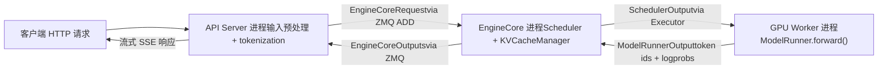
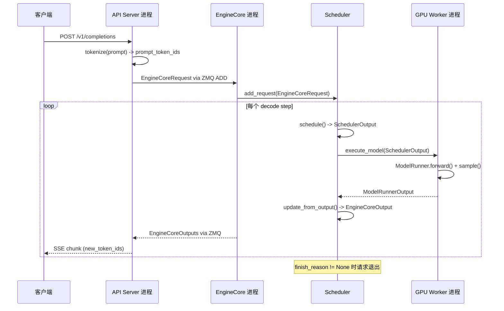

# Capítulo 1: La filosofía de diseño y la visión general de la arquitectura de vLLM

Supongamos que tienes una A100 y quieres usar LLaMA-7B para ofrecer un servicio de inferencia en línea. El enfoque más simple es: llega una solicitud, ejecuta model.generate() una vez, devuelve el resultado. Esta solución colapsará inmediatamente cuando aumente la concurrencia; no porque la capacidad de cómputo de la GPU sea insuficiente, sino por dos cosas: primero, la memoria de video se consume por la fragmentación. La generación autorregresiva necesita almacenar en caché los tensores Key/Value de cada capa (KV Cache). Si cada solicitud preasigna un bloque completo de memoria de video contigua según max_model_len, una solicitud de 4096 tokens ocupará decenas de MB, mientras que la secuencia realmente generada puede tener solo 200 tokens. Peor aún, las solicitudes de diferentes longitudes entran y salen alternadamente, los bloques de memoria de video contigua se fragmentan por completo y, al final, aunque la cantidad total sea suficiente, no se encuentra un espacio contiguo lo suficientemente grande; este es el clásico problema de fragmentación de memoria de video. Segundo, la eficiencia del procesamiento por lotes es baja. El procesamiento por lotes estático tradicional requiere que todas las solicitudes de un batch comiencen y terminen al mismo tiempo. Pero la longitud de salida de las tareas de generación es naturalmente impredecible: una solicitud puede detenerse a los 10 tokens y otra puede necesitar generar 2000. Después de que termina una solicitud corta, el espacio del batch que ocupaba solo puede esperar vacío a que termine la solicitud larga, y la utilización de la GPU cae en picada. Los dos pilares de diseño de vLLM están precisamente dirigidos a estos dos puntos débiles: PagedAttention elimina la fragmentación de memoria de video mediante un mecanismo de paginación, y Continuous Batching elimina el tiempo muerto del procesamiento por lotes mediante planificación a nivel de iteración. Este capítulo no profundiza en los detalles de implementación de estos dos mecanismos (esos son los temas de los capítulos 2 y 4), sino que primero establece un mapa global: cómo es la arquitectura de procesos de vLLM v1, cómo se dividen las responsabilidades de cada capa y por qué componentes debe pasar una solicitud desde que entra al sistema hasta que emite un token. Una vez entendido este mapa, la interpretación del código fuente de cada capítulo posterior tendrá un punto de apoyo.

# Arquitectura de procesos: por qué vLLM no es un programa de un solo proceso

## Modelo intuitivo

Imagina vLLM como un restaurante. La recepción (API Server) se encarga de atender a los clientes y registrar los pedidos; el núcleo de la cocina (EngineCore) decide qué plato preparar primero y en qué fogón; cada fogón (GPU Worker) es operado exclusivamente por un chef. Si una sola persona atendiera y cocinara a la vez, en horas pico inevitablemente habría confusión; por eso vLLM separa estos roles en procesos independientes.

> **[Design Inference & Architectural Trade-offs]**
> El motivo central de esta separación en múltiples procesos es la**separación de responsabilidades**: el análisis HTTP, la tokenización y la carga de datos multimodales son operaciones intensivas en CPU y potencialmente bloqueantes, mientras que la propagación hacia adelante del modelo es intensiva en GPU. Si se colocaran en el mismo proceso, el GIL de Python haría que ambos se perjudicaran mutuamente. Tras separarlos en procesos independientes, el API Server puede seguir recibiendo nuevas solicitudes, EngineCore puede seguir planificando y GPU Worker puede seguir calculando; los tres se desacoplan mediante la cola de mensajes ZMQ.

## Topología de procesos y relación de cantidades

La arquitectura de procesos de vLLM v1 puede resumirse en una fórmula. Para un despliegue con`N`GPUs, grado de paralelismo de tensores`TP`, grado de paralelismo de pipeline`PP`, grado de paralelismo de datos`DP`, número de API Servers`A`:

| Tipo de proceso | Cantidad | Responsabilidad |
| --- | --- | --- |
| API Server | `A`(por defecto igual a`DP`） | Procesamiento de solicitudes HTTP, preprocesamiento de entrada, retorno en streaming de resultados |
| EngineCore | `DP`(por defecto 1) | Planificación, gestión de KV Cache, coordinación de GPU Workers |
| GPU Worker | `N`（= `DP × PP × TP`） | Carga de pesos, ejecución de la propagación hacia adelante, gestión de memoria de video |
| DP Coordinator | `DP > 1`es 1, de lo contrario 0 | Equilibrio de carga entre rangos DP y coordinación de oleadas MoE |

[FACT:docs/design/arch_overview.md:113-113]proporciona la definición autoritativa de esta tabla. Un despliegue típico de 4 GPU en una sola máquina (`vllm serve -tp=4`) genera 1 API Server + 1 EngineCore + 4 GPU Worker = 6 procesos[FACT:docs/design/arch_overview.md:115-115]. Sin embargo, un despliegue de 8 GPU con TP=2/DP=4 se expande a 4 + 4 + 8 + 1 = 17 procesos[FACT:docs/design/arch_overview.md:123-123]。

Aquí hay un detalle que se pasa por alto fácilmente:**El número de API Servers sigue por defecto el tamaño de DP**. Cuando`--data-parallel-size 4`, se inician automáticamente 4 API Servers, cada uno conectado a todos los EngineCore mediante ZMQ en una topología de muchos a muchos[FACT:docs/design/arch_overview.md:73-73]. Esto significa que cualquier API Server puede enrutar solicitudes a cualquier EngineCore, evitando cuellos de botella de punto único.

## Flujo de datos

La siguiente figura muestra la ruta completa de flujo de una solicitud entre procesos. Nótese que cada nodo está etiquetado con nombres de clases y estructuras de datos reales:



La clave de esta figura es:**La comunicación entre API Server y EngineCore es mediante paso de mensajes asíncrono**, no llamadas a funciones. La solicitud se serializa en la estructura`EngineCoreRequest`(un`msgspec.Struct`, véase[FACT:vllm/v1/engine/__init__.py:109-113]), y se envía mediante el tipo de mensaje`ADD`de ZMQ[FACT:vllm/v1/engine/__init__.py:287-299]. Tras procesar, EngineCore empaqueta el resultado en`EngineCoreOutputs`y lo devuelve[FACT:vllm/v1/engine/__init__.py:256-260]。

> **[Design Inference & Architectural Trade-offs]**
> Se eligió ZMQ en lugar de gRPC o memoria compartida porque ZMQ ofrece una latencia extremadamente baja (a nivel de microsegundos) en escenarios de comunicación entre procesos, y soporta de forma nativa topologías de muchos a muchos y semántica de colas de mensajes. Para escenarios de servicio de inferencia sensibles a la latencia del primer token, la sobrecarga de comunicación debe ser lo más pequeña posible.

## Reflexión de diseño: por qué EngineCore es un proceso independiente y no un hilo

Una pregunta natural es: dado que EngineCore y API Server están en la misma máquina, ¿por qué no ponerlos en el mismo proceso y comunicarlos con hilos?

La respuesta está en el modo de trabajo de EngineCore. EngineCore ejecuta un**bucle ocupado**(busy loop), que continuamente planifica solicitudes y distribuye trabajo a los GPU Workers[FACT:docs/design/arch_overview.md:73-73]. Este bucle no puede ser interrumpido—una vez bloqueado por el análisis HTTP o la tokenización, toda la tubería de inferencia experimentaría burbujas. Un proceso independiente garantiza que la franja de tiempo de CPU de EngineCore no sea acaparada por la lógica del frontend.

Además, un proceso independiente también aporta**aislamiento de fallos**: si el API Server se cae por una solicitud malformada, EngineCore y los GPU Workers no se ven afectados y pueden seguir sirviendo solicitudes reenviadas por otros API Servers.

# Modelo mental por capas: límites de responsabilidad desde la entrada hasta la GPU

## Modelo intuitivo

Si la arquitectura de procesos es «quién hace qué y dónde», entonces el modelo por capas es «qué decisiones toma cada capa». La organización del código de vLLM sigue un principio de estratificación claro:**las capas superiores deciden qué hacer, las capas inferiores deciden cómo hacerlo**. La capa de entrada decide qué solicitudes aceptar, la capa central del motor decide a quién procesar primero, la capa de ejecutor decide qué estrategia de paralelismo usar, y la capa de Worker decide cómo producir resultados en el hardware concreto.

## Estructura de cuatro capas

**Capa de entrada (Entrypoints)**ofrece dos modos de interacción: la clase`LLM`para inferencia offline y el comando`vllm serve`para servicio en línea[FACT:docs/design/arch_overview.md:16-16][FACT:docs/design/arch_overview.md:56-56]. La responsabilidad central de esta capa es el preprocesamiento de entrada—tokenización, carga de datos multimodales, análisis de parámetros de muestreo—así como la detokenización de salida y el retorno en streaming. No le concierne la estrategia de planificación ni toca la GPU.

**Capa central del motor (EngineCore)**es el cerebro de todo el sistema. Posee el Scheduler (que decide qué solicitudes procesar en cada paso de decodificación) y el KV Cache Manager (que gestiona la memoria de GPU paginada), y se comunica con los GPU Workers a través de la abstracción Executor[FACT:docs/design/arch_overview.md:79-85]. El diseño clave de esta capa es la**separación entre planificación y ejecución**: el Scheduler solo produce la decisión de «qué tokens ejecutar en este paso» (`SchedulerOutput`), y cómo ejecutarlos concretamente en la GPU es tarea del Worker.

**Capa de ejecutor (Executor)**es el puente entre EngineCore y los Workers. Encapsula las estrategias de ejecución distribuida—para un solo proceso se usa`UniProcExecutor`, para múltiples procesos se usa`MultiprocExecutor`, para clústeres Ray se usa`RayDistributedExecutor`. La interfaz abstracta del Executor permite que EngineCore no necesite saber si el hardware subyacente es una sola GPU o 8 GPU con TP.

**Capa de Worker**un proceso Worker por GPU, que internamente posee el ModelRunner y el objeto de modelo`torch.nn.Module`real[FACT:docs/design/arch_overview.md:171-191]. El ModelRunner se encarga de preparar los tensores de entrada, capturar CUDA Graphs y ejecutar el cálculo forward. Esta capa es el único lugar que opera directamente con la memoria de GPU y los flujos CUDA.

## Objeto de configuración: estado global que atraviesa todas las capas

¿Cómo se transmite información entre las cuatro capas? La respuesta es`VllmConfig`—un dataclass gigante que contiene toda la configuración[FACT:vllm/config/vllm.py:357-357]。

```python
@config(config=ConfigDict(arbitrary_types_allowed=True))
class VllmConfig:
    """Dataclass which contains all vllm-related configuration."""
    model_config: ModelConfig = None
    cache_config: CacheConfig = Field(default_factory=CacheConfig)
    parallel_config: ParallelConfig = Field(default_factory=ParallelConfig)
    scheduler_config: SchedulerConfig = Field(default_factory=SchedulerConfig.default_factory)
    # ... 还有 20+ 个子配置
```

[FACT:vllm/config/vllm.py:363-371]muestra los campos principales. La lógica detrás de esta elección de diseño merece ser desarrollada.

> **[Design Inference & Architectural Trade-offs]**
> La documentación explica claramente por qué se usa un gran objeto de configuración en lugar de pasar parámetros dispersos:**Escalabilidad**. Supongamos que se quiere añadir una nueva característica que solo afecta a ModelRunner, solo se necesita añadir un campo en`VllmConfig`y ModelRunner puede leerlo directamente, sin necesidad de modificar las firmas de los constructores de Engine, Worker y Model[FACT:docs/design/arch_overview.md:203-203]. En un framework de inferencia en rápida evolución, esta capacidad de «añadir campos sin cambiar interfaces» reduce enormemente la fricción de desarrollo.

El costo es que`VllmConfig`se vuelve extremadamente grande—como se puede ver en[FACT:vllm/config/vllm.py:356-3509], esta clase abarca más de 3000 líneas de código, contiene decenas de campos y métodos de validación.`__post_init__`El método[FACT:vllm/config/vllm.py:1405-2317]tiene más de 900 líneas, y se encarga de toda la validación cruzada entre elementos de configuración y la derivación de valores predeterminados.

## Hash y caché de configuración

`VllmConfig`también tiene una capacidad fácil de pasar por alto pero muy importante:`compute_hash()` [FACT:vllm/config/vllm.py:464-580]. Genera un hash corto para todos los elementos de configuración que afectan la estructura del grafo computacional.

```python
def compute_hash(self, include_version: bool = True) -> str:
    factors: list[Any] = []
    vllm_factors: list[Any] = []
    if include_version:
        from vllm import __version__
        vllm_factors.append(__version__)
    if self.model_config:
        vllm_factors.append(self.model_config.compute_hash())
    # ... 逐个追加各子配置的哈希
    hash_str = safe_hash(str(factors).encode(), usedforsecurity=False).hexdigest()[:10]
    return hash_str
```

[FACT:vllm/config/vllm.py:479-580]muestra el flujo completo de cálculo del hash. Nótese la advertencia en los comentarios: «Whenever a new field is added to this config, ensure that it is included in the factors list if it affects the computation graph»[FACT:vllm/config/vllm.py:465-467]。

> **[Design Inference & Architectural Trade-offs]**
> El propósito de este hash es**la clave de caché de torch.compile**. vLLM usa`torch.compile`para compilar el grafo forward del modelo, y el resultado de la compilación se almacena en caché en disco. En el siguiente inicio, si el hash de configuración es el mismo, se puede reutilizar directamente la caché de compilación, omitiendo el costoso proceso de compilación. Si algún elemento de configuración que afecta al grafo computacional no se incluye en el hash, se producirá un error de acierto de caché—se usará un grafo compilado con la configuración antigua para ejecutar la nueva configuración, resultando en errores silenciosos. Por eso los comentarios enfatizan repetidamente que «los campos que afectan al grafo computacional deben incluirse en el hash».

# Recorrido del ciclo de vida de una solicitud: de HTTP a Token

## Configuración del escenario

Supongamos que el cliente envía al servicio iniciado en`vllm serve`una solicitud compatible con OpenAI`/v1/completions`, con el prompt "The capital of France is", solicitando generar 16 tokens. Seguimos este recorrido completo de la solicitud a través del código fuente.

## Paso 1: El API Server recibe y preprocesa

Tras recibir la solicitud HTTP, el proceso del API Server realiza la tokenización y el análisis de parámetros de muestreo, y luego construye`EngineCoreRequest`：

```python
class EngineCoreRequest(
    msgspec.Struct,
    array_like=True,
    omit_defaults=True,
    gc=False,
):
    request_id: str
    prompt_token_ids: list[int] | None
    mm_features: list[MultiModalFeatureSpec] | None
    sampling_params: SamplingParams | None
    pooling_params: PoolingParams | None
    arrival_time: float
    lora_request: LoRARequest | None
    cache_salt: str | None
    data_parallel_rank: int | None
    prompt_embeds: torch.Tensor | None = None
    # ... 更多字段
```

[FACT:vllm/v1/engine/__init__.py:109-124]define la estructura central de la solicitud. Nótese`msgspec.Struct`junto con`array_like=True`y`omit_defaults=True`la combinación[FACT:vllm/v1/engine/__init__.py:109-113]—esto es para**rendimiento de serialización**。`array_like`hacer que msgspec codifique usando un arreglo posicional en lugar de un diccionario,`omit_defaults`omitir los campos con valores predeterminados, y la combinación de ambos reduce enormemente el tamaño del mensaje ZMQ.

> **[Design Inference & Architectural Trade-offs]**
> `gc=False`le indica a msgspec que no genere código de seguimiento de GC para esta estructura[FACT:vllm/v1/engine/__init__.py:109-113]. Para objetos de mensaje creados/destruidos con alta frecuencia, desactivar el seguimiento de GC puede reducir la presión sobre el recolector de basura de Python, lo cual es una optimización necesaria en escenarios que procesan miles de solicitudes por segundo.

## Paso 2: Programación de EngineCore

Tras recibir la solicitud, EngineCore la coloca en la cola de espera mediante el Scheduler. En cada paso de programación, el Scheduler decide si incluir esta solicitud en el lote actual. Si se incluye, el KV Cache Manager le asignará bloques físicos (la operación central de PagedAttention, véase el Capítulo 2).

El resultado de la programación se encapsula como`SchedulerOutput`, y se envía al GPU Worker a través del Executor.

## Paso 3: El GPU Worker ejecuta el forward

El ModelRunner del Worker recibe`SchedulerOutput`, prepara los tensores de entrada (incluyendo block table, slot mapping y otros metadatos de atención), ejecuta el forward del modelo y muestrea el siguiente token.

## Paso 4: Devolución de resultados

El token producido por el Worker se encapsula como`EngineCoreOutput`：

```python
class EngineCoreOutput(
    msgspec.Struct,
    array_like=True,
    omit_defaults=True,
    gc=False,
):
    request_id: str
    new_token_ids: list[int]
    new_logprobs: LogprobsLists | None = None
    finish_reason: FinishReason | None = None
    stop_reason: int | str | None = None
    # ...
```

[FACT:vllm/v1/engine/__init__.py:199-217]define la estructura de salida.`finish_reason`es un`IntEnum`, cuyos valores incluyen`STOP`、`LENGTH`、`ABORT`、`ERROR`、`REPETITION` [FACT:vllm/v1/engine/__init__.py:68-69]. Los comentarios explican por qué se usa`Int`en lugar de`Str`：「Int rather than Str for more compact serialization」[FACT:vllm/v1/engine/__init__.py:56-57]—otra optimización del tamaño de serialización.

Múltiples`EngineCoreOutput`se empaquetan en`EngineCoreOutputs`, y se devuelven al API Server a través de ZMQ[FACT:vllm/v1/engine/__init__.py:256-260]。

## Paso 5: Devolución en streaming del API Server

Tras recibir`EngineCoreOutputs`, el API Server realiza la detokenización de cada`EngineCoreOutput`y luego los envía al cliente en streaming mediante SSE (Server-Sent Events).

## Secuencia temporal completa

El siguiente diagrama de secuencia muestra la interacción completa entre procesos, anotando los nombres reales de funciones y estructuras de datos en cada paso:



Información clave de este diagrama:**Cada decode step produce una devolución de`EngineCoreOutputs`**, en lugar de esperar a que se genere toda la secuencia para devolver. Esto es precisamente la manifestación de Continuous Batching—las secuencias completadas salen inmediatamente, las nuevas solicitudes se incorporan inmediatamente, y la salida se devuelve en streaming al cliente.

# Reflexiones de diseño y problemas en producción

## El patrón de «inicialización posterior» en la validación de configuración

`VllmConfig.__post_init__`es el núcleo de todo el sistema de configuración. No es una simple asignación de campos, sino una**canalización de validación multifase**：

1. Primero analiza el modo del codificador multimodal[FACT:vllm/config/vllm.py:1416-1416]

2. Luego llama a`try_verify_and_update_config()`, dando a los hooks de configuración específicos del modelo la oportunidad de modificar la configuración[FACT:vllm/config/vllm.py:1434-1434]

3. A continuación, valida la coherencia entre la configuración de paralelismo, la configuración de cuantización y la configuración de LoRA[FACT:vllm/config/vllm.py:1442-1444]

4. Finalmente, gestiona las comprobaciones de compatibilidad de características en tiempo de ejecución como la programación asíncrona, CUDA Graph, KV Transfer, etc.[FACT:vllm/config/vllm.py:1544-1635]

> **[Design Inference & Architectural Trade-offs]**
> Este patrón de «inicialización posterior» resuelve una contradicción fundamental:**existen dependencias entre los elementos de configuración, pero el usuario puede establecerlos en cualquier orden**. Por ejemplo,`async_scheduling`si se habilita depende de múltiples condiciones como el tipo de método de speculative_config, si el backend del executor lo soporta, si se usa pipeline parallelism, etc.[FACT:vllm/config/vllm.py:1544-1575]. Si se colocara esta lógica en el`__set__`del campo, se formaría una compleja dependencia circular. Al centralizarla en`__post_init__`y procesarla secuencialmente, la lógica es clara y fácil de depurar.

## Punto problemático: el conflicto entre KV Connector y expandable_segments

[FACT:vllm/config/vllm.py:1219-1260]En`_verify_kv_transfer_compat`se revela una trampa de producción muy oculta.

Cuando se usa KV Connector (como NIXL, Mooncake) para despliegue con separación PD, estos connectors fijan (pin) las páginas de memoria física del KV cache mediante mecanismos como`ibv_reg_mr`**. Pero si al mismo tiempo se establece**, el asignador CUDA VMM de PyTorch puede reasignar la misma dirección virtual a diferentes páginas físicas en tiempo de ejecución`PYTORCH_CUDA_ALLOC_CONF=expandable_segments:True`¿Cuál es la consecuencia? Las regiones de memoria RDMA registradas por el Connector apuntan a páginas físicas que ya no son válidas. La primera transferencia KV entre nodos reportará[FACT:vllm/config/vllm.py:1227-1233]。

o`IBV_WC_REM_ACCESS_ERR`La estrategia de vLLM es`NIXL_ERR_REMOTE_DISCONNECT` [FACT:vllm/config/vllm.py:1232-1233]。

rechazo conservador**: siempre que se detecte**y se haya configurado cualquier KV connector, se lanza directamente una excepción`expandable_segments:True`. La única excepción es cuando se habilita[FACT:vllm/config/vllm.py:1249-1260]—porque el asignador CuMem desactivará`enable_cumem_allocator`alrededor de su propio pool de memoria`expandable_segments` [FACT:vllm/config/vllm.py:1238-1241]。

> **[Design Inference & Architectural Trade-offs]**
> La lección de este caso es:**el registro de memoria RDMA y la reasignación de memoria virtual son semánticamente incompatibles**. Cualquier funcionalidad que implique pin de memoria GPU (transferencia KV, buffers de registro NCCL, etc.) debe asegurar que las páginas físicas subyacentes no sean movidas silenciosamente por el asignador. Al investigar este tipo de problemas, si se observa que una transferencia RDMA falla en la primera comunicación entre nodos, la primera reacción debería ser verificar`PYTORCH_CUDA_ALLOC_CONF`。

## Punto problemático: la cadena de degradación automática de la programación asíncrona

`__post_init__`En`async_scheduling`, la lógica de manejo de[FACT:vllm/config/vllm.py:1544-1635]muestra una**cadena de degradación automática**。

cuidadosamente diseñada. Cuando el usuario no establece explícitamente`async_scheduling`(valor`None`), vLLM intentará habilitarlo automáticamente, pero debe verificar secuencialmente una serie de condiciones de incompatibilidad:

- Si es un modelo de pooling, deshabilitar[FACT:vllm/config/vllm.py:1578-1587]
- Si el método speculative no está en la lista de soportados, deshabilitar[FACT:vllm/config/vllm.py:1588-1601]
- Si`disable_padded_drafter_batch=True`, deshabilitar[FACT:vllm/config/vllm.py:1602-1610]
- Si el backend del executor no lo soporta, deshabilitar[FACT:vllm/config/vllm.py:1611-1617]
- Si es ROCm DeepEP de alto rendimiento DBO, deshabilitar[FACT:vllm/config/vllm.py:1618-1624]
- Si es PP > 1 y usa V1 Model Runner, deshabilitar[FACT:vllm/config/vllm.py:1625-1633]

Solo si todas las comprobaciones pasan, se habilita finalmente[FACT:vllm/config/vllm.py:1639-1640]。

> **[Design Inference & Architectural Trade-offs]**
> La filosofía de diseño de esta cadena de degradación es:**habilitar por defecto la configuración óptima, degradar silenciosamente y registrar advertencias ante incompatibilidades**. Esto es mucho más amigable que requerir que el usuario configure manualmente cada interruptor de compatibilidad. Pero el costo es que—cuando el rendimiento no es el esperado, el usuario necesita revisar los logs para descubrir que la programación asíncrona fue deshabilitada automáticamente. En entornos de producción, si se detecta un rendimiento anómalo, se recomienda verificar si hay una advertencia de "Async scheduling will be disabled" en los logs de inicio.

# Resumen del capítulo

Este capítulo establece el modelo mental global de vLLM v1, con los puntos clave:

1. **Los dos problemas fundamentales que resuelve vLLM**: fragmentación de memoria (gestión de paginación PagedAttention) y tiempo muerto en el procesamiento por lotes (programación a nivel de iteración Continuous Batching).

2. **Arquitectura multiproceso**: tres capas de procesos API Server (entrada) → EngineCore (programación) → GPU Worker (ejecución), comunicándose asíncronamente vía ZMQ. El número de procesos sigue la fórmula`A + DP + N`.

3. **Modelo de cuatro capas**: la capa de entrada se encarga del preprocesamiento, la capa central del motor se encarga de las decisiones de programación, la capa del executor se encarga de la estrategia distribuida, y la capa Worker se encarga del cómputo en GPU.

4. **VllmConfig es el estado global que atraviesa todas las capas**, soporta caché de compilación mediante`compute_hash()`, e implementa validación entre elementos de configuración y derivación de valores por defecto mediante`__post_init__`.

5. **Ciclo de vida de la solicitud**：HTTP → tokenize → `EngineCoreRequest` → Scheduler → Worker forward → `EngineCoreOutput`→ retorno en streaming SSE.

# Reflexión y autoevaluación del capítulo

Q1: Si se cambia el`EngineCoreRequest`de`msgspec.Struct`del valor`array_like=True, omit_defaults=True`al valor por defecto (es decir,`array_like=False, omit_defaults=False`), ¿en qué escenarios causaría problemas de rendimiento? Analice combinando[FACT:vllm/v1/engine/__init__.py:109-113]y[FACT:vllm/v1/engine/__init__.py:256-260].

**Análisis de referencia**：`array_like=True`hace que msgspec codifique structs con arrays posicionales en lugar de diccionarios,`omit_defaults=True`omite los campos cuyo valor es el predeterminado. En la configuración por defecto, cada`EngineCoreRequest`se codifica como una estructura de diccionario que contiene todos los nombres de campos, y su tamaño puede inflarse de 2 a 3 veces. En escenarios de alta concurrencia (miles de solicitudes por segundo), el volumen de mensajes ZMQ entre API Server y EngineCore aumentará significativamente, lo que provocará un aumento en la sobrecarga de CPU por serialización/deserialización y un desperdicio de ancho de banda de red.`EngineCoreOutputs`también utiliza estos dos parámetros[FACT:vllm/v1/engine/__init__.py:256-260], y se genera en cada decode step, con un impacto aún mayor. Además,`gc=False`desactiva el seguimiento de GC, lo que para objetos de alta frecuencia y corta vida útil puede aliviar la presión del GC de Python.

Q2: En`VllmConfig.__post_init__`,`async_scheduling`la lógica de activación automática ([FACT:vllm/config/vllm.py:1576-1635]) adopta la estrategia de «verificar secuencialmente las condiciones de incompatibilidad y activar solo si todas pasan». Si se agrega una nueva característica incompatible con la programación asíncrona, pero el desarrollador olvida añadir la rama correspondiente en esta cadena de verificación, ¿qué problema causaría? Analícelo desde la perspectiva del comportamiento del sistema.

**Análisis de referencia**: Si se olvida añadir la rama de verificación, la programación asíncrona se activará erróneamente. La suposición central de la programación asíncrona es que «la decisión de programación del step actual no depende de la salida del paso anterior», lo que permite a EngineCore programar el siguiente paso antes de que el cálculo de GPU del paso anterior haya terminado. Si la nueva característica viola esta suposición (por ejemplo, alguna lógica de postprocesamiento que necesita leer los logits del paso anterior), la programación asíncrona provocará condiciones de carrera o resultados incorrectos. De forma más sutil, este tipo de bug puede desencadenarse solo bajo ciertas secuencias de concurrencia específicas, lo que dificulta su reproducción. Esta es precisamente la razón por la que[FACT:vllm/config/vllm.py:1549-1552]en la ruta de activación explícita se adopta la estrategia de «hard fail»: cuando el usuario la activa manualmente, se lanza un error directamente en lugar de degradar silenciosamente, forzando al desarrollador a enfrentar el problema de compatibilidad.

Q3: `VllmConfig.compute_hash()`el comentario advierte que «los campos que afectan al grafo de cómputo deben añadirse a la lista factors» ([FACT:vllm/config/vllm.py:465-467]). Suponga que un nuevo campo`attention_sink_tokens`afecta a la lógica de cálculo de attention pero se omite en el hash, ¿qué tipo de fallo se desencadenaría en un entorno de producción? ¿Por qué este tipo de fallo es especialmente peligroso?

**Análisis de referencia**：`compute_hash()`la salida se utiliza como clave de la caché de compilación de torch.compile. Si`attention_sink_tokens`afecta a la estructura del grafo de cómputo pero no se incluye en el hash, entonces cuando el usuario cambia de`attention_sink_tokens=0`a`attention_sink_tokens=4`, el valor del hash no cambia y vLLM reutilizará el grafo compilado anteriormente (sin la lógica de sink token). El resultado es que el modelo produce silenciosamente salidas incorrectas: no hay error, no hay fallo, simplemente el resultado es incorrecto. La razón por la que este tipo de fallo es especialmente peligroso es que: (1) no desencadena ninguna excepción ni advertencia en los logs; (2) la salida sigue siendo texto que «parece razonable», solo que con calidad degradada o comportamiento anómalo; (3) para diagnosticarlo hay que comparar el estado de aciertos de la caché de compilación y las diferencias reales de configuración, lo que hace que el coste de localización sea extremadamente alto. Esta es la razón por la que en los comentarios se insiste repetidamente en que los nuevos campos deben evaluarse para determinar si afectan al grafo de cómputo.

Este capítulo parte de la escena de un fallo en una solicitud de inferencia ingenua y revela las dos contradicciones fundamentales que vLLM debe resolver: la fragmentación de memoria de video y el giro en vacío del procesamiento por lotes, y presenta las dos claves: PagedAttention y Continuous Batching. A continuación, hicimos una vista panorámica de la arquitectura general de vLLM v1, aclarando el modelo de procesos, la estratificación de componentes y el ciclo de vida completo de una solicitud. Con este mapa global, el siguiente capítulo profundizará en las estructuras de datos más centrales de vLLM —Request, Sequence y el mecanismo de gestión de bloques de KV Cache—, revelando cómo PagedAttention implementa a nivel de código el mapeo de memoria de video «lógicamente contiguo, físicamente disperso».
