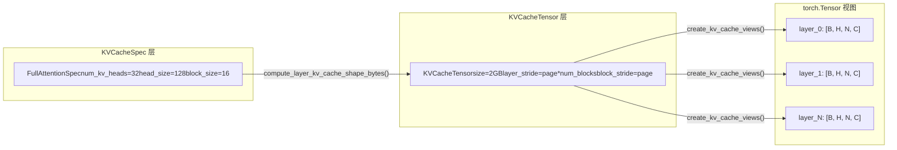

# Capítulo 2: Abstracciones centrales: estructuras de datos Request, Sequence y KV Cache

En el capítulo anterior establecimos el modelo mental por capas de vLLM v1, y sabemos que una solicitud parte del API Server, atraviesa EngineCore y finalmente llega al Worker para su ejecución. Pero, ¿cómo se transforma la cadena JSON del cuerpo de una solicitud HTTP en un objeto que el motor interno puede programar, rastrear e interrumpir? Esta es la pregunta que la clase Request debe responder.

# El sistema de especificaciones de KV Cache: de KVCacheSpec al registro

Request resuelve el problema de «quién debe calcular», mientras que`KVCacheSpec`resuelve el problema de «dónde calcular». En el mundo de PagedAttention, el KV cache de cada capa del modelo necesita describirse con precisión: cuántos heads tiene, cuánto ocupa cada head, cuántos tokens puede almacenar un bloque, si necesita cuantización. Esta información se codifica en`KVCacheSpec`el sistema de herencia de

## Modelo intuitivo: KVCacheSpec es el «plano de distribución» de la memoria de video

> **[Design Inference & Architectural Trade-offs]**
> Si imaginamos la memoria de video de la GPU como un terreno por desarrollar,`KVCacheSpec`es el plano de distribución de cada edificio (cada cache group): especifica cuántas habitaciones (head slot) tiene cada piso (cada bloque), cuánto mide cada habitación (head_size) y cuántas personas puede alojar (block_size tokens). Y`KVCacheConfig`es el plan de planificación de toda la comunidad: cuántos edificios hay en total, cuánto terreno ocupa cada edificio y qué edificios comparten la misma base (block table).

Sin este sistema de especificaciones, la asignación de KV cache solo podría depender de suposiciones codificadas de forma rígida, incapaz de soportar las diversas necesidades de modelos que van desde MHA estándar hasta MLA, desde atención completa hasta ventana deslizante, y desde FP16 hasta cuantización FP8.

## Estructura de datos: el árbol de herencia de KVCacheSpec y sus campos clave

`KVCacheSpec`es la clase base de todas las especificaciones; es una`@dataclass(frozen=True)` [FACT:vllm/v1/kv_cache_interface.py:150-152]. frozen significa que el objeto de especificación es inmutable una vez creado; esto garantiza que múltiples componentes (el planificador, el Worker, el KV Cache Manager) vean la misma especificación y no se produzcan inconsistencias por modificaciones en algún lugar.

La clase base define tres propiedades abstractas que deben ser implementadas por las subclases:`num_heads`、`tokens_per_state`、`state_content_size_bytes` [FACT:vllm/v1/kv_cache_interface.py:182-183]. Estas tres propiedades determinan conjuntamente`page_size_bytes`, es decir, el número de bytes que ocupa un block.

`AttentionSpec`es la subclase más central; introduce`num_kv_heads`、`head_size`、`dtype`、`kv_quant_mode`y otros campos[FACT:vllm/v1/kv_cache_interface.py:485-498]. Entre ellos, el diseño del campo`tokens_per_state`es especialmente ingenioso: su valor predeterminado es 1, lo que significa que un state corresponde a un token; pero puede establecerse como un entero mayor que 1 (como en el MLA disperso de DeepSeek-V4, que comprime múltiples tokens en un state), o como una fracción menor que 1 (como en el block pooling de Whisper, que usa`Fraction(1, block_pool_size)`para indicar que un token corresponde a múltiples states)[FACT:vllm/v1/kv_cache_interface.py:501-501]。

`FullAttentionSpec`sobre la base de`AttentionSpec`añade`sliding_window`y`attention_chunk_size` [FACT:vllm/v1/kv_cache_interface.py:566-566]. Nótese que su docstring explica una decisión de diseño importante: cuando el asignador híbrido está deshabilitado, las capas de atención de ventana deslizante se tratan como atención completa en el KV Cache Manager (se asignan blocks para todos los tokens), pero en tiempo de ejecución del modelo todavía se calculan según la ventana deslizante[FACT:vllm/v1/kv_cache_interface.py:540-545]. Esta es una**asignación conservadora, cálculo preciso**estrategia.

`MLAAttentionSpec`es la especificación clave de la serie de modelos DeepSeek. Establece`head_size_v`por defecto en 0[FACT:vllm/v1/kv_cache_interface.py:670], porque MLA solo almacena un latent vector y no tiene una V independiente.`alignment`El campo se utiliza para el relleno de alineación de página[FACT:vllm/v1/kv_cache_interface.py:646-652], lo cual es crucial para backends como FlashMLA que requieren una alineación específica.

`MambaSpec`en cambio, no sigue en absoluto la ruta de attention. Utiliza`shapes`y`dtypes`tuplas para describir la forma del tensor de estado[FACT:vllm/v1/kv_cache_interface.py:1027-1028]，`state_content_size_bytes`es la suma de los tamaños de todos los tensores de estado[FACT:vllm/v1/kv_cache_interface.py:1048-1052]. El`max_memory_usage_bytes`de Mamba tiene tres formas diferentes de cálculo según`mamba_cache_mode`[FACT:vllm/v1/kv_cache_interface.py:1073-1084], lo que refleja la complejidad de la gestión de estado de Mamba: no crece linealmente como attention, sino que tiene un tamaño de estado fijo.

## Impulsado por escenarios: la conversión de especificaciones a diseño de memoria de video

Cuando el motor se inicia, necesita convertir el`KVCacheSpec`de todas las capas en un diseño real de memoria de video. Este proceso lo realizan`KVCacheTensor`y`create_kv_cache_views`.

`KVCacheTensor`describe la posición de un grupo de capas de la misma forma en la asignación de KV cache[FACT:vllm/v1/kv_cache_interface.py:1406-1427]. Sus campos centrales son`layer_stride`y`block_stride`: el primero es la distancia en bytes entre capas adyacentes, y el segundo es la distancia en bytes entre blocks adyacentes. El docstring explica en detalle dos modos de diseño: el diseño con capas en el exterior (layer-outermost) da a cada capa una región contigua, y el diseño con blocks en el exterior (block-outermost) hace que cada block contenga las páginas de todas las capas[FACT:vllm/v1/kv_cache_interface.py:1416-1416]。

`create_kv_cache_views`La función es el núcleo de este proceso[FACT:vllm/v1/kv_cache_interface.py:353-417]. Recibe un buffer plano de int8 y, mediante`torch.as_strided`, crea una vista 4D para cada capa`[B, H, N, C]`. El parámetro clave es`strides`, que se calcula a partir de`compute_layout_strides`[FACT:vllm/v1/kv_cache_interface.py:314-350]. Esta función calcula los pasos en bytes de cada dimensión en orden inverso, comenzando desde la dimensión más interna, según el orden de dimensiones especificado por`layout.stride_order`.

Aquí hay una verificación de límites que vale la pena señalar: cuando kernel_block_size es menor que spec.block_size (es decir, un manager block se divide en múltiples kernel blocks), el código verifica si block_stride es igual a dense_page_size[FACT:vllm/v1/kv_cache_interface.py:381-382]. Si no son iguales, significa que hay padding en el diseño y no se puede dividir de manera uniforme; en ese caso se lanza un ValueError con una sugerencia de corrección explícita.

## Reflexiones de diseño: el patrón de registro y la extensibilidad

`KVCacheSpecRegistry`es un diseño clave para la extensibilidad de vLLM[FACT:vllm/v1/kv_cache_spec_registry.py:39-40]. Mantiene dos diccionarios globales:`_REGISTRY_KVCACHESPEC_LIST`almacena la asignación de clases spec a metadatos,`_REGISTRY_ROLE_MANAGERS`almacena la asignación de roles a managers[FACT:vllm/v1/kv_cache_spec_registry.py:35-36]。

`get_manager_class`El método muestra la lógica central de búsqueda del registro: recorre hacia arriba el MRO (orden de resolución de métodos) de la clase spec y encuentra la primera clase base registrada[FACT:vllm/v1/kv_cache_spec_registry.py:129-130]. Esto significa que un`CustomFullAttentionSpec`personalizado, si no se registra por separado, heredará automáticamente el manager de`FullAttentionSpec`. Esta**búsqueda basada en herencia**hace que al añadir un nuevo tipo de spec solo sea necesario registrar la parte diferencial.

`check_kv_cache_spec_registry`El método valida en el arranque que los specs de todas las capas estén registrados[FACT:vllm/v1/kv_cache_spec_registry.py:165-174]. Nótese que usa`raise ValueError`en lugar de`assert`, y el comentario indica explícitamente que esto es para que también tenga efecto en entornos de producción[FACT:vllm/v1/kv_cache_spec_registry.py:165-174]. Esta es una decisión de ingeniería importante: el flag`-O`de Python elimina los assert, pero los errores de configuración en producción deben exponerse al arrancar, no provocar un fallo en tiempo de ejecución.

> **[Design Inference & Architectural Trade-offs]**
> El diseño de inicialización diferida del registro (`_ensure_registered`) resuelve un problema de dependencia circular:`kv_cache_interface.py`necesita referenciar el registro para verificar el tipo de spec, y el registro necesita importar`single_type_kv_cache_manager`para obtener la clase gestora, que a su vez depende de`kv_cache_interface`. Al posponer el registro real hasta la primera consulta, se rompe este ciclo.

# Resumen del capítulo

Este capítulo analiza las dos estructuras de datos centrales de vLLM v1.`Request`Es el vehículo del ciclo de vida de la solicitud dentro del motor; mediante la lista doble de tokens, el contador de programación asíncrona y el mecanismo de block hash, sustenta las dos funcionalidades centrales: el procesamiento por lotes continuo y la caché de prefijos.`KVCacheSpec`y su jerarquía de herencia definen las especificaciones de diseño de memoria de la KV cache, desde el estándar`FullAttentionSpec`hasta`MLAAttentionSpec`、`MambaSpec`, cubriendo necesidades diversas de arquitecturas de modelos. El patrón de registro permite añadir nuevos tipos de spec sin modificar el código central, garantizando la extensibilidad del sistema.

Hasta aquí, hemos visto cómo Request se transforma desde EngineCoreRequest y cómo sustenta las decisiones de programación mediante contadores de estado, block hash y otros mecanismos. Pero, ¿cómo atraviesa realmente una solicitud externa el API Server, el chat template y el procesamiento multimodal hasta convertirse finalmente en EngineCoreRequest? El siguiente capítulo entra en la capa de entrada de solicitudes, rastreando por completo esta ruta desde HTTP/CLI hasta EngineCore.
