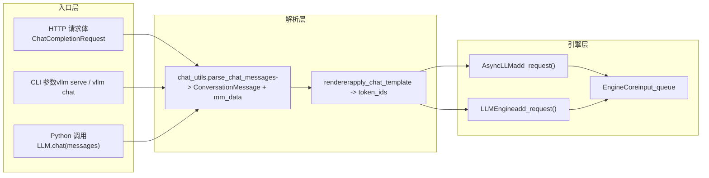

# Capítulo 3: Entrada de solicitudes: la ruta completa desde HTTP/CLI hasta EngineCore

En el capítulo anterior analizamos las dos estructuras de datos centrales del motor: Request y KVCacheSpec, y comprendimos cómo se desacopla la secuencia lógica de los bloques físicos de memoria. Pero, ¿cómo atraviesa realmente un cuerpo de solicitud HTTP o una cadena de Python el API Server, el chat template y el procesamiento multimodal hasta convertirse finalmente en EngineCoreRequest? Este capítulo rastreará por completo esta ruta y revelará cómo las tres vías de entrada —CLI síncrona, API asíncrona y clase LLM offline— convergen en el mismo núcleo del motor.

# 3.1 El punto de convergencia de las tres vías de entrada: AsyncLLMEngine y LLMEngine

Antes de profundizar en el análisis de solicitudes, es necesario ver claramente la topología de las tres vías de entrada. vLLM ofrece tres formas de uso:`vllm serve`el servicio HTTP compatible con OpenAI iniciado mediante, la herramienta de línea de comandos`vllm`, y la instanciación directa en Python de la clase`LLM`para inferencia offline. Parecen independientes, pero en realidad comparten el mismo núcleo del motor.

Veamos primero el mecanismo de alias de la vía de API asíncrona.

[FACT:vllm/engine/async_llm_engine.py:7-7]

Este archivo es tan corto que casi no parece un módulo: solo hace una cosa: apuntar el alias`AsyncLLMEngine`hacia`vllm.v1.engine.async_llm.AsyncLLM`. Esta es una huella típica de migración arquitectónica. En la era de vLLM v0,`AsyncLLMEngine`era una clase enorme y compleja; tras la reescritura de la arquitectura v1, la nueva`AsyncLLM`asumió las mismas responsabilidades. Para no romper el código de usuario existente, vLLM conservó la ruta del módulo antiguo como capa de compatibilidad.

> **[Design Inference & Architectural Trade-offs]**
> Este patrón de «alias de ruta antigua apuntando a nueva implementación» aparece repetidamente en vLLM (como la advertencia de deprecación de`api_server.py`), lo que indica que el proyecto adoptó una estrategia gradual en la migración de v0 a v1: el código nuevo usa rutas nuevas, el código antiguo no falla pero recibe advertencias, dando al usuario suficiente ventana de migración.

Veamos ahora la entrada de la vía offline.

[FACT:vllm/entrypoints/llm.py:344-346]

`LLM.__init__`finalmente llama a`LLMEngine.from_engine_args`, pasando`UsageContext.LLM_CLASS`. Esta enumeración`UsageContext`es clave para distinguir las vías de entrada: permite al motor saber si se ejecuta en modo de procesamiento por lotes offline o en modo de servicio en línea, ajustando así las estrategias de registro, métricas y gestión de recursos.

[FACT:vllm/entrypoints/llm.py:357-359]

Nótese aquí la asignación de`self.renderer = self.llm_engine.renderer`y`self.input_processor = self.llm_engine.input_processor`. La clase offline`LLM`no implementa por sí misma el renderizado del chat template, sino que reutiliza el`renderer`interno del motor. Esto significa que la lógica de análisis del chat template es el mismo código tanto en la vía offline como en la online, solo cambia el momento de invocación.

La relación de convergencia de las tres vías puede representarse con el siguiente diagrama de flujo de datos.

Este diagrama revela un diseño clave: sin importar si la solicitud proviene de HTTP, CLI o Python,`chat_utils`es el único punto de entrada para el procesamiento multimodal y del chat template. Unifica los formatos de entrada heterogéneos en una lista`ConversationMessage`más`MultiModalDataDict`, y luego los entrega al renderer para generar la secuencia de tokens.

# 3.2 chat_utils: de mensajes heterogéneos a estructura de conversación unificada

`chat_utils.py`es el módulo más complejo de toda la capa de entrada de solicitudes; sus 2264 líneas de código manejan el formato compatible con OpenAI, extensiones personalizadas, incrustaciones multimodales, llamadas a herramientas y todas las formas de entrada. Su responsabilidad central puede resumirse en una frase: normalizar cualquier lista de mensajes enviada por el usuario en una lista`ConversationMessage`que el chat template pueda entender, extrayendo simultáneamente los datos multimodales a un`MultiModalDataDict`independiente.

## Modelo intuitivo: traductor y clasificador de equipaje

Imagina`chat_utils`como el traductor y clasificador de equipaje de un aeropuerto. Los pasajeros (usuarios) vienen de diferentes países (formato OpenAI, formato personalizado, formato Harmony) y hablan idiomas distintos. El traductor primero traduce lo que dicen todos a un idioma de trabajo común (`ConversationMessage`), al mismo tiempo, clasificar el equipaje facturado de los pasajeros (imágenes, audio, video) en cintas transportadoras independientes (`MultiModalDataDict`), pegar etiquetas (UUID), y finalmente enviar tanto a las personas como al equipaje al mismo avión (motor).

Sin esta capa, el motor tendría que comprender los detalles de cada formato de entrada, la lógica de extracción de datos multimodales se dispersaría en cada punto de entrada, y cualquier nuevo formato requeriría modificar el núcleo del motor.

## Estructura de datos: colaboración dual entre rastreador y analizador

`chat_utils`El núcleo de consiste en la colaboración de dos grupos de clases:`BaseMultiModalItemTracker`y sus subclases se encargan de «rastrear» los elementos multimodales,`BaseMultiModalContentParser`y sus subclases se encargan de «analizar» las partes de contenido.

Primero veamos la disposición de campos del rastreador.

[FACT:vllm/entrypoints/chat_utils.py:598-601]

`_items_by_modality`es un`defaultdict[str, list[_T]]`, que almacena los elementos pendientes agrupados por modalidad (image, audio, video, etc.).`_modality_order`se dedica específicamente a`vision_chunk`registrar la modalidad original de cada chunk (image o video), porque el modelo unificado de chunk visual mapea ambos a`vision_chunk`, pero el procesamiento posterior necesita conocer el tipo original.

[FACT:vllm/entrypoints/chat_utils.py:613-615]

`use_unified_vision_chunk_modality`es un`cached_property`, que lee el indicador`use_unified_vision_chunk`desde la configuración de HuggingFace. Se usa`cached_property`en lugar de una propiedad normal porque esta verificación se activa en cada llamada a`add`, y el caché evita la sobrecarga repetida de`getattr`.

El método`add`del rastreador es el punto de entrada principal.

[FACT:vllm/entrypoints/chat_utils.py:656-684]

`add`El método primero llama a`_validate_add`para realizar la validación, y luego almacena los elementos bajo diferentes claves según si se usa la modalidad unificada de chunk visual. Nótese el manejo especial de`prompt_embeds`: se añade directamente a`_items_by_modality["prompt_embeds"]`y devuelve`None`, porque los embeddings precalculados no pasan por el HF processor y no tienen cadena de marcador de posición.

`_validate_add`La lógica de validación en

[FACT:vllm/entrypoints/chat_utils.py:686-721]

merece un examen detallado. Aquí hay una rama sutil: cuando`enable_mm_embeds=True`y el límite por prompt de esa modalidad es 0 y la modalidad original termina en`_embeds`, se omite la validación de cantidad. Esto es para permitir que las entradas de embeddings eludan el límite de cantidad de la modalidad original — los embeddings son precalculados y no consumen recursos de procesamiento de la modalidad original.

## Impulsado por escenarios: cómo se analiza una solicitud de chat con imágenes

Supongamos que el usuario envía una solicitud de chat que contiene una URL de imagen y texto.`parse_chat_messages`es el punto de entrada de la ruta síncrona.

[FACT:vllm/entrypoints/chat_utils.py:2161-2197]

`parse_chat_messages`crea`MultiModalItemTracker`, recorre cada mensaje llamando a`_parse_chat_message_content`, y finalmente llama a`_postprocess_messages`para procesar los parámetros de llamada de herramientas, y luego materializa los datos multimodales a través de`mm_tracker.resolve_items()`.

`_parse_chat_message_content`se encarga del análisis de un solo mensaje.

[FACT:vllm/entrypoints/chat_utils.py:2007-2029]

Primero normaliza el content:`None`se convierte en una lista vacía, una cadena se convierte en una sola parte de texto. Luego llama a`_parse_chat_message_content_parts`, donde el parámetro`wrap_dicts`es determinado por`content_format == "openai"`— esto decide si la salida es una lista de diccionarios estructurados o una cadena concatenada.

`_parse_chat_message_content_parts`recorre cada part.

[FACT:vllm/entrypoints/chat_utils.py:1814-1853]

Cada part pasa por el procesamiento de`_parse_chat_message_content_part`. Si`wrap_dicts=False`, finalmente concatena el texto y los marcadores de posición en una sola cadena; si`wrap_dicts=True`, devuelve una lista de diccionarios estructurados.

`_parse_chat_message_content_part`es el núcleo de la distribución.

[FACT:vllm/entrypoints/chat_utils.py:1875-1884]

Para parts de texto puro, primero se realiza la verificación de retención de marcadores de posición, y luego se decide el formato de retorno según`wrap_dicts`. Para parts estructurados, se llama a`_parse_chat_message_content_mm_part`para extraer el tipo y el contenido.

[FACT:vllm/entrypoints/chat_utils.py:1690-1723]

`_parse_chat_message_content_mm_part`busca la función de análisis correspondiente a través de`MM_PARSER_MAP`. Nótese la condición de`uuid is None`— si el usuario proporcionó un UUID, significa que los datos multimedia pueden no estar en el cuerpo de la solicitud (ya se subieron por otros medios), en cuyo caso se toma la rama de campo de URL directa a continuación.

[FACT:vllm/entrypoints/chat_utils.py:1731-1733]

Cuando`part_type is None`o`uuid is not None`, el código intenta extraer el campo URL directamente del part. Este «análisis permisivo» es para compatibilidad con clientes que no siguen estrictamente el formato OpenAI.

Volviendo a`_parse_chat_message_content_part`, los parts de tipo multimedia se distribuyen a los métodos`mm_parser`correspondientes.

[FACT:vllm/entrypoints/chat_utils.py:1923-1968]

Cada tipo de medio llama al método`parse_*`correspondiente, y estos métodos internamente llaman a`tracker.add`para añadir el elemento al rastreador y devuelven una cadena de marcador de posición. Finalmente, según`interleave_strings`se decide devolver el marcador de posición o`None`。

[FACT:vllm/entrypoints/chat_utils.py:1984-1999]

`prompt_embeds`. El procesamiento de es especial: independientemente de`interleave_strings`, siempre devuelve`PROMPT_EMBEDS_PLACEHOLDER_TOKEN`. El comentario explica la razón — prompt_embeds se concatena en el desplazamiento de tokens, la posición es importante, y si se pasa por`missing_placeholders`la lógica de relleno previo desordenaría el orden.

## Diferencias de la ruta asíncrona

La ruta asíncrona usa`AsyncMultiModalItemTracker`y`AsyncMultiModalContentParser`. La diferencia principal está en`resolve_items`。

[FACT:vllm/entrypoints/chat_utils.py:906-952]

. La versión asíncrona usa`asyncio.gather`para esperar concurrentemente todos los elementos multimodales. El comentario señala explícitamente: cada elemento rastreado ya es un awaitable independiente, y el conector asíncrono descarga el trabajo de decodificación bloqueante al pool de hilos, por lo que esperar secuencialmente una modalidad y luego otra aumentaría la latencia innecesariamente.`return_exceptions=True`permite que todas las tareas se completen o fallen antes de lanzar la excepción de forma unificada, evitando que el primer fallo abandone las solicitudes de red aún en curso.

## Reflexión de diseño: por qué separar el rastreador del analizador

> **[Design Inference & Architectural Trade-offs]**
> La separación entre rastreador y analizador es un diseño que merece reflexión. El rastreador se encarga de la «gestión de estado» — registrar cuántos elementos hay por modalidad, validar los límites de cantidad, mantener el orden de modalidad original de vision_chunk. El analizador se encarga de la «extracción de contenido» — obtener imágenes desde URL, decodificar embeddings desde base64, manejar la conversión de formatos de audio. Esta separación permite que las rutas síncrona y asíncrona compartan la lógica de rastreo (`BaseMultiModalItemTracker`es una clase base abstracta), y solo diverjan a nivel del analizador. Si se fusionaran en una sola clase, las diferencias entre síncrono y asíncrono se filtrarían en la lógica de rastreo, causando duplicación de código y complejidad en la gestión de estado.

# 3.3 De mensaje a token: la transición entre renderer y EngineCore

`chat_utils`La lista`ConversationMessage`y`MultiModalDataDict`producidas aún necesitan pasar por el renderizado del chat template para convertirse en una secuencia de tokens. Este paso lo realiza el renderer, y después la solicitud entra realmente en el motor.

## Impulsado por escenarios: renderizado del chat template y envío de la solicitud

`parse_chat_messages`Tras regresar, el llamador (como`OpenAIServingChat`) pasará`conversation`y`mm_data`al renderer. El renderer aplica la plantilla de chat, renderiza la lista`ConversationMessage`a texto y luego la tokeniza en una secuencia de IDs de token. Los marcadores de posición multimodales (como`<##IMAGE##>`) se reemplazan tras la tokenización por tokens de marcador de posición específicos del modelo.

Una vez completado el renderizado, la solicitud se encapsula como`EngineCoreRequest`y se entrega a la cola de entrada de EngineCore mediante`AsyncLLM.add_request()`o`LLMEngine.add_request()`.

[FACT:vllm/entrypoints/llm.py:420-484]

El método`LLM.generate`offline muestra esta cadena: primero valida`runner_type`, obtiene los parámetros de muestreo predeterminados y luego llama a`_run_completion`。`_run_completion`. Internamente se llama al renderer para renderizar el prompt y después se entrega la solicitud mediante`llm_engine`.

[FACT:vllm/entrypoints/llm.py:615-708]

`LLM.chat`El método muestra la ruta de chat: recibe la lista`messages`, llama a`_run_chat`, que internamente llama a`parse_chat_messages`y al renderer.

## Reflexión de diseño: por qué el renderer está dentro del motor

> **[Design Inference & Architectural Trade-offs]**
> `LLM.__init__`En`self.renderer = self.llm_engine.renderer`, esta línea revela una decisión de diseño importante: el renderer pertenece al motor, no a la capa de entrada. Esto significa que la carga, el almacenamiento en caché y el precalentamiento de la plantilla de chat (`self.renderer.warmup(ChatParams(...))`) se completan durante la inicialización del motor, y la capa de entrada es solo el llamador. La ventaja de esto es que`LLM`offline y`AsyncLLM`online comparten la misma implementación y caché del renderer, evitando cargar repetidamente el tokenizer y la plantilla de chat. Además, el precalentamiento del renderer puede completarse al iniciar el motor, evitando la latencia de arranque en frío de la primera solicitud.

## Recuperación de errores y trampas en producción

`_postprocess_messages`El manejo de parámetros de llamadas a herramientas en es un típico obstáculo del entorno de producción.

[FACT:vllm/entrypoints/chat_utils.py:2118-2158]

Cuando un mensaje del assistant contiene`tool_calls`, el campo`arguments`puede ser una cadena JSON, un diccionario o JSON inválido. El código intenta analizar la cadena JSON; si falla, registra una advertencia y la convierte forzosamente en un objeto vacío. El comentario explica el motivo: los`arguments`con formato incorrecto existen en el historial de conversación, y si se hace fallar la solicitud aquí, cada ronda posterior fallará y la conversación no podrá recuperarse. Este es un diseño de tolerancia a fallos bien pensado: es preferible que el modelo vea parámetros de herramienta vacíos antes que bloquear toda la conversación.

Otra trampa es la protección contra inyección de marcadores de posición reservados.

[FACT:vllm/entrypoints/chat_utils.py:1856-1872]

Cuando`enable_prompt_embeds`está activado,`PROMPT_EMBEDS_PLACEHOLDER_TOKEN`se registra como un token especial indivisible. Si el texto del usuario contiene exactamente esta secuencia literal, el tokenizer la codificará como el mismo ID de token, y el renderer creerá erróneamente que este es el punto de concatenación, permitiendo al llamador mover o inyectar la posición de concatenación mediante contenido de texto plano.`_reject_reserved_placeholder_in_text`rechaza este tipo de entrada durante el análisis de la parte de texto, cerrando esta vulnerabilidad de seguridad.

[FACT:vllm/entrypoints/chat_utils.py:1889-1892]

Nótese que esta comprobación se invoca tanto en la rama`isinstance(part, str)`como en la rama de texto estructurado, asegurando que todas las rutas de texto pasen por la protección.

# Resumen del capítulo

Este capítulo ha trazado el primer tramo del recorrido de una solicitud desde el exterior hacia el sistema. Las tres rutas de entrada —API HTTP, CLI y la clase`LLM`offline— convergen finalmente en la capa de análisis multimodal de`chat_utils`.`BaseMultiModalItemTracker`se encarga de la gestión de estado,`BaseMultiModalContentParser`se encarga de la extracción de contenido, y su separación permite que las rutas síncronas y asíncronas compartan la lógica de trazado.`parse_chat_messages`normaliza mensajes heterogéneos en una lista`ConversationMessage`y`MultiModalDataDict`, y luego los entrega al renderer interno del motor para completar el renderizado de la plantilla de chat y la tokenización. Finalmente, la solicitud se encapsula como`EngineCoreRequest`y se entrega a la cola de entrada de EngineCore.

# Reflexión y autoevaluación del capítulo

Q1: En`_parse_chat_message_content_mm_part`, si se elimina la condición`uuid is None`(es decir, se cambia a`if isinstance(part_type, str) and part_type in MM_PARSER_MAP:`), ¿en qué escenarios causaría problemas?

**Análisis de referencia**：`uuid is None`La condición existe para manejar el escenario en que «el usuario proporciona un UUID pero los datos multimedia no están en el cuerpo de la solicitud». Cuando el usuario proporciona un UUID, los datos multimedia pueden haberse subido ya por otros medios (por ejemplo, previamente a la caché de medios), y en ese caso la parte del cuerpo de la solicitud puede contener solo el UUID y no la URL o los datos reales. Si se elimina esta condición, el código intentará analizar mediante`MM_PARSER_MAP[part_type](part)`, pero puede que la parte no tenga el campo de datos correspondiente (por ejemplo,`image_url`vacío), lo que daría como resultado el análisis de contenido`None`. Más grave aún, el`parse_image(None, uuid)`posterior llamará a`_connector.fetch_image(None)`, lo que podría desencadenar solicitudes de red innecesarias o excepciones.`uuid is not None`La rama, en cambio, sigue la ruta de extracción directa de campos y maneja correctamente el caso de «UUID sin datos». Véase[FACT:vllm/entrypoints/chat_utils.py:1713-1723]y[FACT:vllm/entrypoints/chat_utils.py:1731-1733]。

Q2: `AsyncMultiModalItemTracker.resolve_items`usan`asyncio.gather(..., return_exceptions=True)`en lugar del`return_exceptions=False`predeterminado. Si se cambiara a`False`, ¿en qué escenarios de concurrencia causaría fugas de recursos?

**Análisis de referencia**：`return_exceptions=False`Cuando`asyncio.gather`, retorna inmediatamente al lanzarse la primera excepción, pero las demás tareas aún en curso no se cancelan: siguen ejecutándose en segundo plano. Estas tareas pueden retener conexiones de red, elementos de trabajo del grupo de hilos o descriptores de archivos. Si finalmente fallan, las excepciones se descartan silenciosamente (porque gather ya retornó), lo que provoca fugas de recursos y errores difíciles de diagnosticar.`return_exceptions=True`Hacer que todas las tareas se completen o fallen antes de verificar de manera uniforme, asegurando que ninguna tarea sea abandonada. El comentario explica claramente esto: «Gathering with return_exceptions=True lets every task finish (or itself fail) before we raise, instead of abandoning still-in-flight fetches (real network/thread-pool work) the moment the first one fails.» Véase[FACT:vllm/entrypoints/chat_utils.py:924-931]。

Q3: `_postprocess_messages`, cuando`arguments`es JSON inválido, el código opta por forzar la conversión a un objeto vacío en lugar de lanzar una excepción. Si se cambiara para lanzar una excepción, ¿en qué escenarios de producción se provocaría un estado de conversación irrecuperable?

**Análisis de referencia**：`arguments`El campo existe en el historial de conversación (del mensaje del asistente`tool_calls`). Si en alguna ronda de conversación el modelo genera un`arguments`con formato incorrecto, este error se guardará en el historial de conversación. Si`_postprocess_messages`lanza una excepción al analizar el historial, entonces cada ronda de solicitud posterior fallará debido a este error en el historial, incluso si la entrada de la ronda actual es completamente correcta. El usuario no podrá continuar esta conversación y solo podrá abandonar toda la sesión y comenzar de nuevo. Forzar la conversión a un objeto vacío permite que la conversación continúe, y el modelo, al ver los parámetros de herramienta vacíos, regenerará la llamada correcta. El comentario explica esto: «A malformed arguments string lives in conversation history, so failing the request here would fail every subsequent turn too and leave the conversation unrecoverable.» Véase[FACT:vllm/entrypoints/chat_utils.py:2124-2139]。

El próximo capítulo entrará en el planificador para ver cómo EngineCore orquesta estas solicitudes con procesamiento por lotes continuo y estrategias conscientes de la memoria de video.

Hasta aquí, la solicitud ha completado la transformación normalizada desde la entrada externa hasta EngineCoreRequest y ha llegado a la entrada del núcleo del motor. Pero una vez que la solicitud ingresa, no se ejecuta inmediatamente: el motor necesita decidir qué solicitudes procesar en cada paso y cómo asignar los recursos limitados de memoria de video. El próximo capítulo profundizará en el bucle de planificación de EngineCore, analizando cómo el Scheduler equilibra el rendimiento y la latencia en el procesamiento por lotes continuo, y cómo el chunked prefill, el prefix caching y la asignación de bloques KV trabajan juntos.
