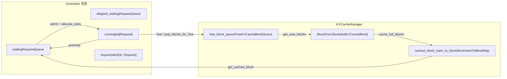
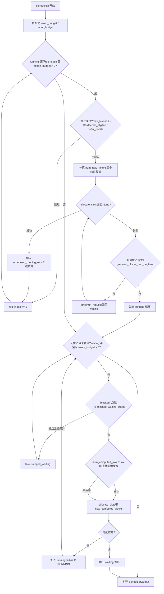

# Capítulo 4: Planificador: procesamiento por lotes continuo y orquestación de solicitudes consciente de la memoria de video

Después de que la solicitud ingresa a la cola de entrada de EngineCore, no se ejecuta inmediatamente. Qué solicitudes procesar en cada paso, cuánto presupuesto de tokens asignar a cada solicitud, a quién sacrificar primero cuando la memoria de video es insuficiente, todas estas decisiones se concentran en el método`Scheduler.schedule()`. Este capítulo comienza con las estructuras de datos del planificador y rastrea cómo una llamada a`schedule()`organiza la cola waiting, la lista running y el pool de KV cache en un lote ejecutable.

# 4.1 Estructuras de datos del planificador: tres colas y un pool de memoria de video

La pregunta central que debe responder el planificador es:**Bajo un presupuesto limitado de tokens y de bloques KV, ¿qué solicitudes deben avanzar cuántos tokens en este paso?**Para entenderlo, primero hay que ver claramente qué estados tiene en sus manos.

El planificador mantiene tres tipos de contenedores de solicitudes.`self.requests`Es un diccionario global,`req_id -> Request`, la única fuente de verdad para todas las solicitudes activas[FACT:vllm/v1/core/sched/scheduler.py:208-209]。`self.waiting`y`self.skipped_waiting`son dos colas de prioridad, la primera contiene solicitudes en espera normal de planificación, la segunda contiene solicitudes que temporalmente no pueden planificarse debido a dependencias asíncronas o restricciones (como esperar KV remoto, esperar la compilación de la gramática de salida estructurada)[FACT:vllm/v1/core/sched/scheduler.py:208-209]。`self.running`Es una lista normal que almacena solicitudes que ya han entrado en estado de ejecución y poseen bloques KV[FACT:vllm/v1/core/sched/scheduler.py:208-209]。

Aquí hay un diseño fácil de pasar por alto:`max_num_running_reqs`y`max_num_active_reqs`son dos límites superiores diferentes. El primero proviene de`max_num_seqs`, determina el número de ranuras del model runner; el segundo proviene de`max_num_active_seqs`, solo limita el número de solicitudes que pueden entrar en RUNNING, por defecto igual al primero[FACT:vllm/v1/core/sched/scheduler.py:123-131]. Esta separación permite reducir el tamaño real del lote de decodificación concurrente sin reducir la capacidad de captura del CUDA graph.

El lado de la memoria de video está gestionado de manera unificada por`KVCacheManager`, que internamente posee`BlockPool`。`BlockPool`El núcleo de`self.blocks`es`KVCacheBlock`(lista de todos`free_block_queue`) y[FACT:vllm/v1/core/block_pool.py:171-177](una lista doblemente enlazada de bloques libres ordenada por orden de expulsión)`null_block`. Nótese la existencia de`is_null=True`: es el primer bloque extraído de la cabeza de la cola de libres,[FACT:vllm/v1/core/block_pool.py:183-187], el conteo de referencias no participa en el mantenimiento regular, se usa específicamente como marcador de posición

. Cuando una posición de token de una solicitud no necesita un bloque KV real (por ejemplo, una posición omitida por la ventana deslizante), en la block table se coloca este null block.`BlockHashToBlockMap`La estructura de índice de la caché de prefijos es`BlockHashWithGroupId`, que mapea`KVCacheBlock`a un`{block_id: KVCacheBlock}`o a un diccionario[FACT:vllm/v1/core/block_pool.py:56-59]. ¿Por qué usar un tipo unión? El comentario da la respuesta: la mayoría de los hashes corresponden a un solo bloque, y usar un diccionario generaría una sobrecarga innecesaria de GC; solo cuando el mismo hash es compartido por múltiples bloques se promueve a diccionario[FACT:vllm/v1/core/block_pool.py:56-59]. Esta es una típica compensación de complejidad de tipos por sobrecarga en tiempo de ejecución.

`KVCacheBlocks`es el objeto de interfaz entre el planificador y el gestor de KV cache, que oculta las estructuras de datos internas. Su`blocks`campo es`tuple[Sequence[KVCacheBlock], ...]`, la dimensión externa es el grupo de KV cache, la interna es la secuencia de bloques[FACT:vllm/v1/core/kv_cache_manager.py:41-54]. El comentario explica claramente por qué no se usa el bloque como dimensión externa: eso asumiría que todos los grupos tienen el mismo número de bloques, mientras que en el futuro podrían configurarse diferentes block sizes para distintos grupos[FACT:vllm/v1/core/kv_cache_manager.py:43-48]。



Este diagrama ancla el flujo de datos entre el planificador y el pool de memoria de video: las solicitudes de la cola waiting entran en running a través de`allocate_slots`, las solicitudes de running vuelven a waiting cuando son expropiadas, los bloques liberados vuelven a la cola libre, y la tabla hash de caché de prefijos es la entrada para que las solicitudes en waiting acierten en la caché.

# 4.2 Flujo principal de schedule(): prioridad a running, complemento de waiting, expropiación como respaldo

`schedule()`es el método central de todo el planificador, devuelve un`SchedulerOutput`, que describe qué se va a ejecutar en este paso. El comentario al inicio del método señala la filosofía de diseño: en el planificador no hay distinción entre "fase de decodificación" y "fase de prefill", cada solicitud solo tiene`num_computed_tokens`y`num_tokens_with_spec`, y la tarea del planificador es hacer que la primera alcance a la segunda[FACT:vllm/v1/core/sched/scheduler.py:559-568]. Esta perspectiva unificada es la base para que chunked prefill, prefix caching y decodificación especulativa puedan coexistir.

## 4.2.1 Inicialización de presupuesto y cálculo de umbrales

Antes de entrar en el bucle principal, el planificador establece dos presupuestos:`token_budget`se inicializa en`max_num_scheduled_tokens`，`input_budget`se inicializa en`max_num_batched_tokens` [FACT:vllm/v1/core/sched/scheduler.py:577-580]. Ambos suelen ser iguales, pero cuando el modelo puede añadir tokens en el lote (como en decodificación especulativa),`max_num_scheduled_tokens`será menor que`max_num_batched_tokens`, y la diferencia es el espacio reservado para draft tokens.

`long_prefill_token_threshold`El manejo de merece una mirada aparte. Su función es evitar que un prefill largo mate de hambre a otras solicitudes, pero si actualmente solo hay una solicitud, nadie puede morir de hambre, así que el umbral se pone a cero[FACT:vllm/v1/core/sched/scheduler.py:606-616]. Cuando`adaptive_long_prefill_threshold`está activado, el umbral también se eleva a`input_budget // num_eligible_reqs`, garantizando que no se reduzca el presupuesto de una sola solicitud por debajo de su cuota justa[FACT:vllm/v1/core/sched/scheduler.py:617-622]。

## 4.2.2 Bucle de planificación de solicitudes running

El bucle principal recorre desde la cabeza de`self.running`,`req_index`es el cursor[FACT:vllm/v1/core/sched/scheduler.py:624-627]. Para cada solicitud, primero se hacen una serie de comprobaciones de omisión:

- Bajo planificación asíncrona, si el marcador de posición de salida de la solicitud indica que ya alcanzó`max_tokens`, se omite para evitar ejecutar un paso de más[FACT:vllm/v1/core/sched/scheduler.py:631-645]。
- En el escenario V2 + PP + asíncrono, si el paso actual aún no ha llegado a`next_decode_eligible_step`, se omite para coincidir con el ritmo de difusión de tokens de muestreo del lado del worker[FACT:vllm/v1/core/sched/scheduler.py:647-651]。
- Cuando el balanceo de prefill de DP está activado, los chunks de prefill en pasos no alineados al ritmo se posponen[FACT:vllm/v1/core/sched/scheduler.py:653-657]。

Tras pasar las comprobaciones de omisión, se calcula cuántos tokens puede avanzar esta solicitud en este paso:

```
num_new_tokens = request.num_tokens_with_spec
               + request.num_output_placeholders
               - request.num_computed_tokens
```

Luego se restringe sucesivamente por`long_prefill_token_threshold`、`token_budget`、`input_budget - draft_slots`y`max_model_len`. Si la solicitud lleva entrada de codificador, también pasa por el ajuste de[FACT:vllm/v1/core/sched/scheduler.py:670-688]`_try_schedule_encoder_inputs`A continuación viene el paso más crítico: asignar KV blocks.[FACT:vllm/v1/core/sched/scheduler.py:700-712]。

se envuelve en un bucle`allocate_slots``while True`. Si devuelve[FACT:vllm/v1/core/sched/scheduler.py:742-747], significa que no hay suficiente memoria de video, y el planificador comienza la expropiación: selecciona víctimas según la política (la estrategia PRIORITY elige la de menor prioridad, la estrategia FCFS elige la del final de la lista running)`None`, llama a[FACT:vllm/v1/core/sched/scheduler.py:761-767]para devolverla a la cola waiting, y luego reintenta la asignación`_preempt_request`. Si la víctima es la propia solicitud actual, significa que ya no hay objetos expropiables, se sale del bucle y la solicitud actual tampoco puede planificarse[FACT:vllm/v1/core/sched/scheduler.py:801-806]Hay un detalle sutil en la lógica de expropiación: bajo la estrategia PRIORITY, si la solicitud expropiada ya está en[FACT:vllm/v1/core/sched/scheduler.py:807-813]。

(es decir, en este paso ya se le asignaron recursos), hay que devolver por completo su presupuesto de tokens, blocks, tokens especulativos y presupuesto de codificador`scheduled_running_reqs`. Esto garantiza la consistencia del libro de presupuestos.[FACT:vllm/v1/core/sched/scheduler.py:779-797]Tras una asignación exitosa, la solicitud se añade a

, se registran los blocks y el número de tokens, y se deduce del presupuesto`scheduled_running_reqs`. Los tokens relacionados con decodificación especulativa se recortan y registran aquí[FACT:vllm/v1/core/sched/scheduler.py:815-823]4.2.3 Admisión de solicitudes waiting[FACT:vllm/v1/core/sched/scheduler.py:825-841]。

## Tras terminar el bucle de running, si en este paso no hubo expropiación y el planificador no está pausado, se empieza a procesar la cola waiting

. Antes de la admisión se comprueban dos límites:[FACT:vllm/v1/core/sched/scheduler.py:868-872]y`max_num_active_reqs`La planificación de solicitudes waiting tiene un paso más que la de running: la búsqueda en la caché de prefijos. Cuando`input_budget` [FACT:vllm/v1/core/sched/scheduler.py:873-879]。

, se llama a`request.num_computed_tokens == 0`para buscar aciertos en la caché local`_get_local_prefix_cache_hit`. Si se ha configurado un KV connector, también se consultan los aciertos en la caché remota[FACT:vllm/v1/core/sched/scheduler.py:932-939]Aquí hay una lógica refinada para manejar conflictos entre aciertos locales y remotos. Un acierto local puede no estar alineado a bloques ([FACT:vllm/v1/core/sched/scheduler.py:942-954]。

), y si un acierto remoto supera estrictamente al acierto local completo, se descarta la cola del subbloque local para que la carga remota la sobrescriba, evitando copy-on-write`partial_tail`. En caso contrario, se conserva la cola local y no se carga nada externo[FACT:vllm/v1/core/sched/scheduler.py:977-988]Tras una admisión exitosa, la solicitud se saca de la cola waiting, su estado se establece en RUNNING y se añade a la lista running[FACT:vllm/v1/core/sched/scheduler.py:989-995]。

. Si después de este paso sigue en prefill ([FACT:vllm/v1/core/sched/scheduler.py:1263-1319]), se añade al conjunto`num_computed_tokens + num_new_tokens < request.num_tokens``_inflight_prefills`Copiar[FACT:vllm/v1/core/sched/scheduler.py:1326-1328]。



y la rama de expropiación. Obsérvese la ruta de reintento de expropiación tras el fallo de`schedule()`en el bucle running, y cómo las solicitudes en estado blocked del bucle waiting se mueven a`allocate_slots` 失败后的抢占重试路径，以及 waiting 循环中 blocked 状态请求被移入 `skipped_waiting`del bypass.

# 4.3 El núcleo consciente de la memoria de video: allocate_slots y la apropiación

`allocate_slots`es la compuerta entre el planificador y la memoria de video. Su lista de parámetros es en sí misma un libro contable de memoria de video:`num_new_tokens`es el número de tokens que se van a calcular nuevos,`num_new_computed_tokens`es el número de tokens que aciertan nuevos en la caché de prefijos,`num_external_computed_tokens`es el número de aciertos externos proporcionados por el connector,`num_lookahead_tokens`son las ranuras reservadas para la decodificación especulativa[FACT:vllm/v1/core/kv_cache_manager.py:371-383]。

El comentario al inicio del método describe con precisión el diseño de bloques mediante un diagrama ASCII[FACT:vllm/v1/core/kv_cache_manager.py:417-438]：

```
|  |  |   |   |  |
                                          |        |
                        |                       |
```

`comp`son los tokens ya calculados,`new_comp`es un acierto en la caché de prefijos,`ext_comp`es un acierto externo,`new`es el cálculo nuevo de este paso,`lookahead`es la reserva especulativa. La asignación se divide en tres fases: primero se liberan los bloques innecesarios y se comprueba si hay suficientes bloques libres, luego se procesan los tokens de prefijo y, por último, se asignan bloques para los tokens de cálculo nuevo[FACT:vllm/v1/core/kv_cache_manager.py:458-461]。

## 4.3.1 Línea de nivel de agua y control de admisión

`allocate_slots`hay dos compuertas de admisión. La primera es`full_sequence_must_fit`: cuando está activada, primero se comprueba si toda la secuencia de solicitud (no solo el primer chunk) cabe; si no cabe, se devuelve directamente`None` [FACT:vllm/v1/core/kv_cache_manager.py:515-531]. Esto evita que, bajo chunked prefill, una admisión excesiva provoque oscilaciones en la KV cache.

La segunda es la línea de nivel de agua.`watermark_blocks`solo entra en vigor cuando el estado de la solicitud es WAITING o PREEMPTED y ya hay solicitudes planificadas[FACT:vllm/v1/core/kv_cache_manager.py:506-513]. Exige que, tras la asignación, se conserve al menos una cierta proporción de bloques libres, evitando expulsiones y apropiaciones frecuentes.`reserved_blocks`se utiliza en escenarios de carga asíncrona de KV, para garantizar que los bloques reservados para prefill en curso no sean consumidos por nuevas solicitudes[FACT:vllm/v1/core/kv_cache_manager.py:564-570]。

## 4.3.2 El coste y la recuperación de la apropiación

> **[Design Inference & Architectural Trade-offs]**
> `_preempt_request`hace algo que parece violento pero necesario: restablecer a 0 el`num_computed_tokens`de la solicitud[FACT:vllm/v1/core/sched/scheduler.py:1560-1561]. Esto significa que una solicitud apropiada debe volver a hacer prefill desde el principio la próxima vez que se planifique. ¿Por qué se diseñó así? Porque los KV block de vLLM son privados de cada solicitud; al apropiarse, es obligatorio liberar todos los bloques, y una vez liberados no se puede garantizar que al reasignarlos se obtengan los mismos bloques, así que solo queda recalcular desde cero. La existencia de la caché de prefijos compensa parcialmente este coste: si el prefijo de la solicitud apropiada ya está en caché, al replanificarla se acierta en la caché y no hace falta recalcular de verdad.

La apropiación también aborda el problema de las "salidas obsoletas" bajo planificación asíncrona.`num_stale_output_tokens`se establece en`num_in_flight_tokens`, marcando todas las salidas en curso como obsoletas[FACT:vllm/v1/core/sched/scheduler.py:1571-1574]. Estos tokens se seguirán entregando (descartarlos perturbaría la tasa de aceptación de la decodificación especulativa), pero no modificarán los contadores tras el restablecimiento.`drop_stale_output`el indicador determina si se descarta o se entrega[FACT:vllm/v1/core/sched/scheduler.py:1539-1547]。

## 4.3.3 Liberación diferida: el riesgo de lectura tras escritura en conectores asíncronos

Cuando se usa un KV connector y hay varios lotes en curso,`defer_block_free`se establece en`True` [FACT:vllm/v1/core/sched/scheduler.py:175-181]. La razón es que un paso puede seguir escribiendo en los KV block de una solicitud ya liberada, mientras que el connector consumidor podría reasignar y rellenar esos bloques mediante una carga no ordenada respecto a esa escritura.

La liberación diferida se implementa mediante`deferred_frees`una cola doble, donde cada entrada es`(fence_seq, blocks)` [FACT:vllm/v1/core/sched/scheduler.py:388-390]。`_free_request_blocks`Comprobar`_request_blocks_can_be_freed`, si el último paso de planificación de la solicitud aún no se ha terminado de procesar, se ponen los bloques en la cola diferida[FACT:vllm/v1/core/sched/scheduler.py:2679-2688]。`_drain_deferred_frees`en`update_from_output`se avanza`processed_step_seq`se llama después, liberando los bloques cuyo fence ya se ha satisfecho[FACT:vllm/v1/core/sched/scheduler.py:2701-2706]。

# 4.4 Determinación de aciertos en la caché de prefijos y ciclo de vida de los bloques

La entrada de búsqueda de la caché de prefijos es`KVCacheManager.get_computed_blocks`. Primero comprueba si la caché está habilitada y si la solicitud no está marcada para omitir la lectura[FACT:vllm/v1/core/kv_cache_manager.py:286-287]. Luego llama a`coordinator.find_longest_cache_hit`, pasando`request.block_hashes`y`max_cache_hit_length = request.num_tokens - 1` [FACT:vllm/v1/core/kv_cache_manager.py:295-300]。

¿Por qué`num_tokens - 1`? El comentario explica: cuando todos los tokens aciertan en la caché, es obligatorio recalcular el último token para obtener los logits[FACT:vllm/v1/core/kv_cache_manager.py:289-294]. Este es un límite fácil de pasar por alto: incluso si el prefijo acierta por completo, hay que calcular al menos un token.

El ciclo de vida de los bloques lo gestiona`BlockPool`.`get_new_blocks`extrae bloques del frente de la cola de libres; si la caché está habilitada, primero llama a`_maybe_evict_cached_block`para borrar sus metadatos de hash y luego incrementa el contador de referencias[FACT:vllm/v1/core/block_pool.py:683-702]。`free_blocks`decide si devolver el bloque al frente o al final de la cola según si tiene hash: los bloques sin hash se reutilizan LIFO (mejor localidad de GPU), los bloques con hash se reutilizan FIFO (comportamiento de expulsión LRU)[FACT:vllm/v1/core/block_pool.py:785-805]。

`cache_full_blocks`es el momento en que un bloque se escribe en la tabla hash de la caché de prefijos. Recorre los bloques recién llenados, omite los bloques null y los bloques enmascarados, calcula el hash de cada bloque y lo inserta en`cached_block_hash_to_block` [FACT:vllm/v1/core/block_pool.py:272-300]. Si el bloque ya tiene hash (escenario en que un bloque parcial se actualiza a bloque lleno), primero se elimina el hash antiguo y luego se inserta el nuevo[FACT:vllm/v1/core/block_pool.py:285-293]。

`touch`el método gestiona el contador de referencias cuando hay un acierto en la caché: si el bloque está en la cola de libres (`ref_cnt == 0`), primero se saca de la cola y luego se incrementa el contador de referencias[FACT:vllm/v1/core/block_pool.py:754-770]. Esto garantiza que los bloques acertados no sean expulsados.

# Reflexiones de diseño

> **[Design Inference & Architectural Trade-offs]**
> **¿Por qué la apropiación elige "recalcular desde cero" en lugar de "conservar parcialmente"?**La conservación parcial requiere registrar la posición física de los bloques de cada solicitud en el momento de la apropiación y tratar de restaurar la asignación al replanificar. Pero el pool de bloques es compartido globalmente y otras solicitudes pueden haber ocupado ya esos bloques. La complejidad y el coste de memoria de mantener esa asignación superan el coste del recálculo, sobre todo cuando la caché de prefijos puede acertar la mayor parte del prefijo.

> **[Design Inference & Architectural Trade-offs]**
> **¿Por qué la línea de nivel de agua es 0 por defecto?**La línea de nivel de agua es un seguro contra apropiaciones frecuentes, pero lo hace a costa de sacrificar la utilización de la memoria de video. Desactivarla por defecto significa que vLLM prioriza el rendimiento sobre la estabilidad, y el usuario debe activarla según las características de la carga.

> **[Design Inference & Architectural Trade-offs]**
> **`skipped_waiting`El significado de la existencia de la cola.**Si no existiera esta cola, las solicitudes bloqueadas ocuparían permanentemente la cabeza de la cola waiting, impidiendo que las solicitudes posteriores sean programadas (bajo la política FCFS). Al separarla, el planificador puede saltarse las solicitudes bloqueadas y continuar procesando las siguientes, mientras conserva el estado de las solicitudes bloqueadas para su posterior promoción.

# Resumen del capítulo

El núcleo del planificador es`schedule()`dos bucles en el método: el bucle running prioriza garantizar el avance de las solicitudes ya en ejecución, mientras que el bucle waiting admite nuevas solicitudes cuando el presupuesto lo permite. Cuando la memoria de video es insuficiente, se libera espacio mediante la preempción de la solicitud de menor prioridad en la lista running; la solicitud expropiada tiene su`num_computed_tokens`restablecido a 0, pero la caché de prefijos puede compensar parte del costo de recálculo.`allocate_slots`es la compuerta de memoria de video, que mediante`full_sequence_must_fit`, la línea de nivel de agua y`reserved_blocks`tres niveles de control de admisión evitan la sobreasignación. La caché de prefijos logra compartir entre solicitudes mediante indexación por hash de bloques, y la determinación de acierto tiene como límite superior`num_tokens - 1`para garantizar que al menos se calcule un token y se obtengan los logits.

# Reflexión y autoevaluación del capítulo

Q1: En el bucle running de`schedule()`, si`allocate_slots`devuelve`None`y`_request_blocks_can_be_freed`devuelve`False`para la víctima, el código`break`sale del bucle. Si se elimina esta comprobación y se llama directamente a`_preempt_request`, ¿en qué escenario se produciría una inconsistencia de estado?

**Análisis de referencia**：`_request_blocks_can_be_freed`comprueba`request.last_sched_seq <= self.processed_step_seq` [FACT:vllm/v1/core/sched/scheduler.py:2672-2677]. Cuando`defer_block_free`está activado, si el último paso de programación de la víctima aún no ha sido procesado, sus bloques pueden seguir siendo escritos por pasos de GPU en vuelo. La preempción directa llamaría a`_free_request_blocks`, pero este último, cuando`_request_blocks_can_be_freed`es`False`, coloca los bloques en`deferred_frees`en lugar de liberarlos inmediatamente[FACT:vllm/v1/core/sched/scheduler.py:2679-2688]. Sin embargo, la semántica de la preempción es "liberar bloques inmediatamente para la solicitud actual", y la liberación diferida no puede satisfacer esta necesidad,`allocate_slots`volvería a fallar, formando un bucle infinito. Más grave aún, si los bloques de la víctima se liberan de forma diferida y luego son asignados a la solicitud actual, mientras la GPU sigue escribiendo en los bloques de la víctima, se produciría una condición de carrera de datos.

Q2: `get_computed_blocks`en`max_cache_hit_length = request.num_tokens - 1`. Si se cambiara a`request.num_tokens`, ¿en qué casos se produciría una salida incorrecta?

**Análisis de referencia**: cuando todos los tokens de la solicitud aciertan en la caché,`num_computed_tokens`sería igual a`num_tokens`. En ese momento el planificador considera que no es necesario calcular ningún token nuevo, pero el muestreo de logits requiere el estado oculto de la última posición, y el estado oculto proviene de la propagación hacia adelante. Si no se calcula ningún token, no hay logits que muestrear, y la solicitud se quedaría atascada o produciría una salida incorrecta. El comentario lo explica claramente[FACT:vllm/v1/core/kv_cache_manager.py:289-294]. Además,`allocate_slots`requiere que`num_computed_tokens`esté alineado al tamaño de bloque; recalcular el último token podría desencadenar el recálculo de todo el bloque, lo cual es una limitación conocida de la implementación actual.

Q3: `_preempt_request`restablece`num_computed_tokens`a 0, pero conserva`request.num_tokens`(prompt + tokens ya generados). Si la solicitud expropiada, al ser reprogramada, no acierta en la caché de prefijos, ¿cuántos tokens necesita recalcular? Si acierta, ¿cuánto se ahorra?

**Análisis de referencia**：`num_computed_tokens = 0`significa que al reprogramar se comienza desde el primer token[FACT:vllm/v1/core/sched/scheduler.py:1561]。`request.num_tokens`permanece sin cambios, incluyendo el prompt original y los tokens de salida ya generados. Si la caché de prefijos no acierta, es necesario recalcular el prefill de todos los`num_tokens`tokens. Si acierta,`get_computed_blocks`devolvería los bloques acertados,`num_computed_tokens`comienza desde la posición de acierto[FACT:vllm/v1/core/kv_cache_manager.py:296-300]. Nótese que los tokens de salida de la solicitud expropiada también están en`num_tokens`, y sus hashes de prefijo ya fueron almacenados en caché al generarse (si está habilitado), por lo que al reprogramar los prefijos de estos tokens de salida también podrían acertar. Pero`max_cache_hit_length = num_tokens - 1`significa que el último token siempre debe recalcularse.

La salida del planificador`SchedulerOutput`especifica el contenido de ejecución de este paso: los IDs de bloque de las nuevas solicitudes, el número de tokens de las solicitudes en caché, los tokens especulativos, las entradas del codificador, etc. El siguiente capítulo rastreará cómo esta salida es consumida por ModelRunner, desde`SchedulerOutput`hasta la propagación hacia adelante en la GPU.
