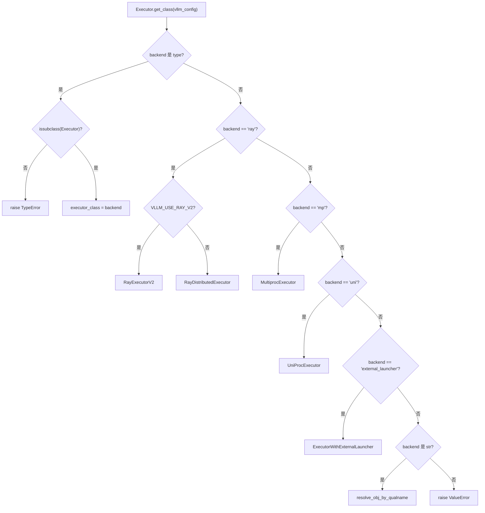
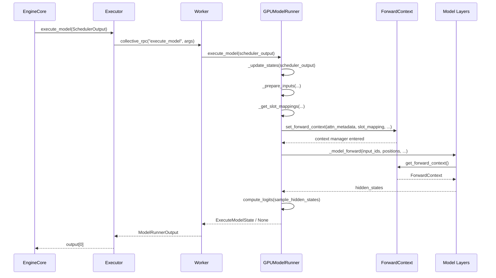

# Capítulo 5: Tronco de ejecución del modelo: de SchedulerOutput a la propagación hacia adelante en la GPU

En el capítulo anterior vimos que el Scheduler, en cada paso del bucle de programación, decide qué solicitudes entran en la cola running, cuáles son expropiadas y cuáles esperan por falta de memoria de video, y finalmente produce un SchedulerOutput, que describe qué debe calcularse en este paso: qué solicitudes, cuántos tokens para cada una y qué bloques KV usar. Pero esta lista es solo una intención lógica; la GPU necesita tensores físicos. Este capítulo rastrea cómo SchedulerOutput es distribuido por el Executor a los Workers, y luego traducido por GPUModelRunner en entradas ejecutables por la GPU como input_ids, positions, slot_mapping y block table, para finalmente, a través de forward_context, inyectar la descripción del lote compartida entre capas en cada capa del modelo, completando el salto desde la decisión de programación hasta la propagación hacia adelante.

# 5.1 Executor: enviar el resultado de la programación a cada tarjeta

## Modelo intuitivo

`Executor`es el "mensajero" entre EngineCore y los GPU Workers. Sin él, EngineCore tendría que saber por sí mismo cuántas tarjetas hay en el clúster, en qué proceso está cada tarjeta y cómo`SchedulerOutput`Serializar el pasado — la lógica de scheduling quedaría entrelazada con la topología distribuida.`Executor`Extrae esta responsabilidad: EngineCore solo se encarga de invocar`execute_model(scheduler_output)`, y el resto — «a quién enviar, cómo enviar, cuántos resultados recibir» — lo decide el Executor.

## Jerarquía de clases y campos

`Executor`Es una clase base abstracta cuyos campos a nivel de clase codifican directamente las capacidades del backend[FACT:vllm/v1/executor/abstract.py:48-49]：

```python
uses_ray: bool = False  # whether the executor uses Ray for orchestration.
supports_pp: bool = False  # whether the executor supports PP
```

Estos dos flags no son decorativos — el código de capas superiores los lee para decidir si habilitar ciertas rutas de optimización.`__init__`En se inicializan`sleeping_tags`、`kv_output_aggregator`、`ec_output_aggregator`tres campos de estado[FACT:vllm/v1/executor/abstract.py:119-120], utilizados respectivamente para el seguimiento de etiquetas del modo sleep, la agregación de salidas del conector KV y la agregación de salidas del conector de encoder.

## Selección de backend:`get_class`Enrutamiento por ramas de

`get_class`Es una fábrica estática que, según la configuración de`distributed_executor_backend`, devuelve la clase Executor concreta[FACT:vllm/v1/executor/abstract.py:51-96]. Su estructura de ramas merece un examen detallado:

- Si la configuración en sí es un`type`, tras validar si es una subclase de`Executor`, se usa directamente[FACT:vllm/v1/executor/abstract.py:52-61]；
- `"ray"`Bajo la rama de hay además subramas de segundo nivel:`VLLM_USE_RAY_V2_EXECUTOR_BACKEND`Cuando es verdadero se usa`RayExecutorV2`, de lo contrario se usa`RayDistributedExecutor` [FACT:vllm/v1/executor/abstract.py:64-72]；
- `"mp"`se mapea a`MultiprocExecutor`，`"uni"`se mapea a`UniProcExecutor` [FACT:vllm/v1/executor/abstract.py:73-80]；
- Los backends personalizados en forma de cadena se resuelven dinámicamente mediante`resolve_obj_by_qualname`[FACT:vllm/v1/executor/abstract.py:85-90]。



## Paso a paso: el flujo de invocación de una`execute_model`

Contextualizando: EngineCore completa un paso de scheduling, obtiene`SchedulerOutput`, e invoca`executor.execute_model(scheduler_output)`。

`Executor.execute_model`La implementación de es minimalista[FACT:vllm/v1/executor/abstract.py:237-238]：

```python
def execute_model(
    self, scheduler_output: SchedulerOutput, non_block: bool = False
) -> ModelRunnerOutput | None | Future[ModelRunnerOutput | None]:
    output = self.collective_rpc(
        "execute_model", args=(scheduler_output,), non_block=non_block
    )
    return output[0]
```

> **[Design Inference & Architectural Trade-offs]**
> La clave está en`collective_rpc`— difunde el nombre del método y los parámetros a todos los Workers, recopila la lista de valores de retorno de cada Worker, y luego`output[0]`solo toma el primero. ¿Por qué solo el primero? Porque bajo paralelismo de tensores, todos los Workers ejecutan el mismo forward lógico y las salidas son semánticamente equivalentes; el resultado de muestreo lo determina el último PP stage o el rank 0, tomar`output[0]`evita la agregación duplicada.`collective_rpc`La documentación de recomienda explícitamente «transmitir solo mensajes de control; la comunicación del plano de datos se establece por separado»[FACT:vllm/v1/executor/abstract.py:220-221], y esta es precisamente la posición de`SchedulerOutput`— es un mensaje de control; los datos reales de tokens fluyen internamente entre los Workers a través de tensores de GPU.

`sample_tokens`Sigue el mismo patrón[FACT:vllm/v1/executor/abstract.py:257-258], pero el tipo de retorno no incluye`None`— el muestreo produce resultados inevitablemente. La división de tareas entre estos dos métodos corresponde al diseño de «separación ejecución-muestreo» de vLLM v1:`execute_model`puede devolver`None`(indicando que el forward ya se envió pero el muestreo se pospone), en cuyo caso el estado se almacena temporalmente en`ExecuteModelState`.

## Reflexiones de diseño

`collective_rpc`Se declara como`@abstractmethod` [FACT:vllm/v1/executor/abstract.py:186-192], lo que significa que cada backend debe implementar por su cuenta «cómo enviar el RPC al Worker».`MultiprocExecutor`usa colas de memoria compartida,`RayDistributedExecutor`usa llamadas a actores de Ray,`UniProcExecutor`realiza llamadas locales directas. Esta abstracción hace que el código de capas superiores no necesite preocuparse en absoluto por los detalles distribuidos.

Un detalle fácil de pasar por alto:`supported_tasks`está marcado como`@cached_property` [FACT:vllm/v1/executor/abstract.py:306-309], y el comentario dice directamente «evitar llamadas RPC innecesarias». Porque`get_supported_tasks`requiere comunicación entre procesos, y la lista de tareas no cambia durante el ciclo de vida del modelo, el caché es una optimización correcta y necesaria.

# 5.2 GPUModelRunner: de SchedulerOutput a tensores de entrada

## Modelo intuitivo

`GPUModelRunner`es un «traductor»: traduce las descripciones lógicas de`SchedulerOutput`(ID de solicitud, número de tokens, ID de bloque) a tensores físicos que la GPU puede consumir directamente. Sin él, la capa del modelo tendría que lidiar por sí misma con preguntas como «¿en qué ranura KV está el séptimo token de la tercera solicitud?» — esto sería una fuga de responsabilidades catastrófica.

## Estado central y diseño de memoria

`GPUModelRunner`Hereda de tres Mixins[FACT:vllm/v1/worker/gpu_model_runner.py:479-480]：`LoRAModelRunnerMixin`、`KVConnectorModelRunnerMixin`、`ECConnectorModelRunnerMixin`, que proporcionan respectivamente capacidades de adaptación LoRA, conector KV y conector de encoder.

`__init__`En se cachean todos los objetos de configuración[FACT:vllm/v1/worker/gpu_model_runner.py:488-498], y se inicializan varios flags clave:

- `check_ep_fault`: solo cuando el paralelismo de datos > 1 y es un modelo MoE, consulta si el gestor EP all2all soporta tolerancia a fallos[FACT:vllm/v1/worker/gpu_model_runner.py:507-509]；
- `is_pooling_model`: determinado por`runner_type == "pooling"`[FACT:vllm/v1/worker/gpu_model_runner.py:515]；
- `enable_prompt_embeds`: si habilitar la entrada de prompt embedding[FACT:vllm/v1/worker/gpu_model_runner.py:516]。

`ExecuteModelState`es un`NamedTuple`, que porta el estado temporal entre`execute_model()`y`sample_tokens()`[FACT:vllm/v1/worker/gpu_model_runner.py:463-476]. El diseño de sus campos revela la esencia de la separación ejecución-muestreo:`logits`、`hidden_states`、`sample_hidden_states`es el producto del forward,`spec_decode_metadata`、`slot_mappings`son los metadatos aún necesarios en la fase de muestreo. El comentario dice explícitamente que este es «el estado de caché temporal que se pasa después de que execute_model() devuelve None»[FACT:vllm/v1/worker/gpu_model_runner.py:464-464]。

## Step-by-Step：`_update_states`Cómo sincronizar el estado de caché

Contextualizando: el scheduler decide que este paso procesa las solicitudes A (nueva solicitud), B (continuación del decode del paso anterior), C (recuperada tras ser expropiada), mientras que la solicitud D ya se completó.

**Primer paso: limpiar las solicitudes completadas.**Recorre`finished_req_ids`, extrae el estado del diccionario`self.requests`, elimina de`input_batch`. Nótese el caso límite señalado por el comentario:[FACT:vllm/v1/worker/gpu_model_runner.py:1202-1217]y`finished_req_ids`pueden solaparse — cuando una solicitud es abortada y luego reenviada con el mismo ID, se consideran dos solicitudes distintas`scheduled_req_ids`[FACT:vllm/v1/worker/gpu_model_runner.py:1211-1215]。

**Segundo paso: poner a cero los bloques KV recién asignados.**Si`new_block_ids_to_zero`no está vacío, se invoca`_zero_block_ids`para poner a cero la memoria de video, evitando que NaN obsoletos contaminen los cálculos de atención o SSM[FACT:vllm/v1/worker/gpu_model_runner.py:1219-1222]. Este es el requisito de seguridad previo para la reutilización de bloques de PagedAttention.

**Tercer paso: calcular el conjunto de solicitudes no programadas.**Este es el paso más propenso a errores[FACT:vllm/v1/worker/gpu_model_runner.py:1238-1247]：

```python
scheduled_req_ids = scheduler_output.num_scheduled_tokens.keys()
cached_req_ids = self.input_batch.req_id_to_index.keys()
resumed_req_ids = scheduler_output.scheduled_cached_reqs.resumed_req_ids
unscheduled_req_ids = cached_req_ids - (scheduled_req_ids - resumed_req_ids)
```

El comentario explica por qué es`scheduled_req_ids - resumed_req_ids`en lugar de directamente`scheduled_req_ids`: normalmente`cached_req_ids`y`resumed_req_ids`no se intersecan, pero en escenarios de expropiación forzada desencadenados por`reset_prefix_cache`, las solicitudes recuperadas deben eliminarse primero del lote persistente y luego reincorporarse[FACT:vllm/v1/worker/gpu_model_runner.py:1241-1246]。

****Cuarto paso: procesar nuevas solicitudes.`scheduled_new_reqs`Para cada`CachedRequestState` [FACT:vllm/v1/worker/gpu_model_runner.py:1295-1308], se construye`RANDOM_SEED`. Si el tipo de muestreo es`torch.Generator` [FACT:vllm/v1/worker/gpu_model_runner.py:1277-1284], se crea un`_init_mrope_positions`con semilla. Si el modelo usa M-RoPE, se invoca[FACT:vllm/v1/worker/gpu_model_runner.py:1319-1321]。

**para precalcular las posiciones**`scheduled_cached_reqs`Quinto paso: actualizar las solicitudes en ejecución.`num_computed_tokens` [FACT:vllm/v1/worker/gpu_model_runner.py:1402]Para cada[FACT:vllm/v1/worker/gpu_model_runner.py:1437-1448], se actualiza`req_index is None`, se maneja la adición o reemplazo de IDs de bloque`reqs_to_add` [FACT:vllm/v1/worker/gpu_model_runner.py:1450-1465]。

**. Si la solicitud no está en el lote persistente (** `condense()`Rellenar los huecos dejados por las solicitudes de eliminación[FACT:vllm/v1/worker/gpu_model_runner.py:1511-1512]，`_may_reorder_batch`Hacer que el backend de atención reordene según sea necesario[FACT:vllm/v1/worker/gpu_model_runner.py:1513-1514]，`refresh_metadata()`Actualizar los metadatos del lote[FACT:vllm/v1/worker/gpu_model_runner.py:1515-1516]。

## Preparación de tensores de entrada:`_prepare_input_ids`Ruta rápida asíncrona de

`_prepare_input_ids`Maneja un problema sutil: bajo programación asíncrona, el token de muestreo del paso anterior aún está en la GPU, y los`input_ids`del paso actual necesitan rellenarlos[FACT:vllm/v1/worker/gpu_model_runner.py:1767-1772]。

Ruta normal (`prev_sampled_token_ids is None`) copia directamente el tensor de CPU a la GPU[FACT:vllm/v1/worker/gpu_model_runner.py:1788-1794]. La ruta asíncrona recorre las solicitudes, calcula el índice del último token de cada solicitud en el`input_ids`aplanado[FACT:vllm/v1/worker/gpu_model_runner.py:1809-1836]. Los comentarios dan un ejemplo concreto:`cu_num_tokens = [2, 5, 8]`、`draft_tokens = [1, 2, 2]`cuando`sample_flattened_indices = [0, 2, 5]`，`spec_flattened_indices = [1, 3, 4, 6, 7]` [FACT:vllm/v1/worker/gpu_model_runner.py:1820-1822]。

Hay una optimización clave[FACT:vllm/v1/worker/gpu_model_runner.py:1859-1868]：

```python
if common_indices_match and max_flattened_index == (num_common_tokens - 1):
    self.input_ids.gpu[:num_common_tokens].copy_(
        self.input_batch.prev_sampled_token_ids[:num_common_tokens, 0],
        non_blocking=True,
    )
    return
```

Cuando el lote no cambia y no hay reordenamiento, los índices son`0..N-1`la misma permutación, se puede usar directamente una copia por segmento único, evitando el costo de scatter. Esta es una manifestación directa de la optimización de lote persistente.

## `slot_mapping`y la block table

`_get_slot_mappings`Devuelve dos formatos[FACT:vllm/v1/worker/gpu_model_runner.py:4078-4078]: indexado por KV cache group`dict[int, torch.Tensor]`para uso de los metadatos de atención, indexado por nombre de capa`dict[str, torch.Tensor]`para`ForwardContext`uso. Para un KV cache group encoder-only, el slot mapping es un tensor todo ceros[FACT:vllm/v1/worker/gpu_model_runner.py:4096-4115]; de lo contrario se obtiene por segmento desde`block_table.slot_mapping.gpu`[FACT:vllm/v1/worker/gpu_model_runner.py:4107-4109]. El relleno final no utilizado`-1`, el comentario explica que esto es`reshape_and_cache`una necesidad en modo CUDA graph completo[FACT:vllm/v1/worker/gpu_model_runner.py:4118-4122]。

`_get_block_table`Obtener el tensor de dispositivo para cada KV cache group[FACT:vllm/v1/worker/gpu_model_runner.py:2319-2335], y usar`NULL_BLOCK_ID`para rellenar las filas de CUDAGraph padding — el bloque 0 se reserva como padding[FACT:vllm/v1/worker/gpu_model_runner.py:2332-2334]。

# 5.3 forward_context: descripción de lote compartida entre capas

## Modelo intuitivo

`forward_context`es el «tablón de anuncios unificado» pegado al frente del aula: cada capa del modelo puede levantar la vista y ver la disposición de asientos (attention metadata) y las reglas (slot mapping) de este examen, sin tener que preguntar cada una por su cuenta. Sin él, cada capa de atención tendría que recibir esta información desde los parámetros — pero la`forward`firma de la capa del modelo es fija y no permite pasar parámetros individualmente por capa.

## Estructura de datos

`ForwardContext`es un`@dataclass` [FACT:vllm/forward_context.py:141-202], campos principales:

- `no_compile_layers`: desde`static_forward_context`copia, marca las capas que no participan en la compilación[FACT:vllm/forward_context.py:132-137]；
- `attn_metadata`: mapeo de nombre de capa a metadatos de atención, en modo DBO es una lista de longitud 2 (uno por microbatch)[FACT:vllm/forward_context.py:144-152]；
- `slot_mapping`: mapeo de nombre de capa a tensor de slot mapping[FACT:vllm/forward_context.py:145]；
- `cudagraph_runtime_mode`: modo CUDA graph en tiempo de ejecución, por defecto`NONE` [FACT:vllm/forward_context.py:155-157]；
- `batch_descriptor`: descriptor de lote, usado para el despacho de CUDA graph[FACT:vllm/forward_context.py:158]；
- `is_padding`: máscara booleana en el eje de tokens,`True`indica filas de padding[FACT:vllm/forward_context.py:162-165]。

`BatchDescriptor`es otro`@dataclass(frozen=True)` [FACT:vllm/forward_context.py:30-57], el diseño de campos sigue el principio de «minimizar los elementos descriptivos»:`num_tokens`、`num_reqs`(puede ser None en modo PIECEWISE),`uniform`(todas las solicitudes tienen el mismo número de tokens),`has_lora`、`num_active_loras`. El comentario explica`num_active_loras`la razón de ser de: cuando`cudagraph_specialize_lora_count`está habilitado, cada valor de cantidad de LoRA captura un CUDA graph independiente, porque`fused_moe_lora`el grid size de kernels como depende de este valor[FACT:vllm/forward_context.py:60-64]。

## Singleton global y gestión de contexto

`_forward_context`es una variable global a nivel de módulo[FACT:vllm/forward_context.py:199-201], a través de`override_forward_context`el gestor de contexto guarda el valor anterior al entrar y lo restaura al salir[FACT:vllm/forward_context.py:263-274]。`set_forward_context`es una envoltura de nivel superior[FACT:vllm/forward_context.py:277-394], que además maneja la construcción de metadatos DP, la creación automática de batch descriptor y la inyección de kwargs específicos de la plataforma.

## Paso a paso: desde`execute_model`hasta el forward del modelo

Escenario:`GPUModelRunner.execute_model`ya tiene preparados todos los tensores de entrada y está a punto de invocar el modelo.

En`execute_model`,`set_forward_context`se invoca[FACT:vllm/v1/worker/gpu_model_runner.py:4408-4420]：

```python
with (
    set_forward_context(
        attn_metadata,
        self.vllm_config,
        num_tokens=num_tokens_padded,
        num_tokens_across_dp=num_tokens_across_dp,
        cudagraph_runtime_mode=cudagraph_mode,
        batch_descriptor=batch_desc,
        ubatch_slices=ubatch_slices_padded,
        slot_mapping=slot_mappings,
        skip_compiled=has_encoder_input,
        is_padding=is_padding,
    ),
    ...
):
    model_output = self._model_forward(...)
```

`set_forward_context`internamente primero construye`DPMetadata`(si DP o MoE con paralelismo de secuencia está habilitado)[FACT:vllm/forward_context.py:299-328], luego invoca`create_forward_context`para construir la instancia`ForwardContext`[FACT:vllm/forward_context.py:347-358], y finalmente mediante`override_forward_context`establece la variable global[FACT:vllm/forward_context.py:361-362]。

La capa del modelo mediante`get_forward_context()`lee[FACT:vllm/forward_context.py:208-214]. Si no está establecido, la aserción falla y sugiere usar`set_forward_context`。



## Reflexión de diseño

> **[Design Inference & Architectural Trade-offs]**
> ¿Por qué usar una variable global en lugar de pasar parámetros explícitamente? Porque la`forward`firma de la capa del modelo está fijada por la convención de HuggingFace y no permite inyectar parámetros adicionales por capa. La variable global + gestor de contexto es la única solución que permite la inyección entre capas sin modificar el código del modelo. El costo es la dependencia implícita —`get_forward_context()`el invocador de debe asegurarse de estar dentro del alcance de`set_forward_context`.

`is_padding`El diseño del campo merece atención[FACT:vllm/forward_context.py:162-165]: el comentario dice «los consumidores pueden usarlo para omitir el trabajo de los padding token». Esta es una optimización en el escenario de CUDA graph — las filas de padding participan en la captura del grafo pero no deben producir cómputo real.

`all_moe_layers`y`moe_layer_index`son un par de workarounds ingeniosos[FACT:vllm/forward_context.py:170-195]. El comentario explica en detalle el problema:`vllm.moe_forward`los operadores personalizados codifican la cadena del nombre de capa directamente en el grafo, lo que provoca tiempos de arranque en frío de torch.compile excesivamente largos. La solución es almacenar la lista de nombres de capa en`ForwardContext`, y los operadores personalizados extraen las cadenas en orden e incrementan un contador. El comentario también admite que esto depende del supuesto de que «los operadores personalizados se ejecutan en orden y torch.compile no reordena»[FACT:vllm/forward_context.py:182-184]。

# Reflexión de diseño y escollos en producción

**Consistencia de estado en programación asíncrona.** `_update_states`bajo decodificación especulativa asíncrona adopta una estrategia de «suposición optimista»: asume que todos los draft token del paso anterior fueron aceptados, primero expande`output_token_ids`, y luego registra una función de corrección diferida[FACT:vllm/v1/worker/gpu_model_runner.py:1376-1384]. La función de corrección se invoca después de que el forward del modelo se inicia[FACT:vllm/v1/worker/gpu_model_runner.py:1509-1510], lee el número real de aceptados desde la GPU y revierte`num_computed_tokens` [FACT:vllm/v1/worker/gpu_model_runner.py:1547-1558]. La sutileza de este diseño es que: la corrección ocurre después de que «el lote ya se ha lanzado», no bloquea el forward y mantiene la continuidad del pipeline asíncrono.

**`_may_reorder_batch`La condición de activación de.**Este método primero verifica`kv_cache_groups`si está vacío[FACT:vllm/v1/worker/gpu_model_runner.py:1131-1132]. El comentario explica por qué no se puede simplemente verificar`is_attention_free`: El modelo Mamba también es attention-free, pero utiliza KV cache para guardar su estado interno[FACT:vllm/v1/worker/gpu_model_runner.py:1116-1139]. Solo los modelos que realmente no tienen KV cache group omiten el reordenamiento.

**`_prepare_input_ids`la trampa del cálculo de índices.**Cuando en el lote hay tanto solicitudes decode del paso anterior como solicitudes nuevas,`num_common_tokens < total_without_spec`, es necesario copiar primero el tensor de CPU y luego hacer scatter[FACT:vllm/v1/worker/gpu_model_runner.py:1849-1854]. Si`num_common_tokens == 0`, significa que ninguna solicitud se superpone con el paso anterior, se retorna directamente[FACT:vllm/v1/worker/gpu_model_runner.py:1855-1858]. La distinción entre estas dos ramas es crucial — omitir cualquiera de ellas provocará que`input_ids`parte quede sin inicializar.

**`AsyncGPUModelRunnerOutput`la sincronización de streams.**La copia de salida se realiza en un stream CUDA independiente[FACT:vllm/v1/worker/gpu_model_runner.py:308-328], usando`blocking=True`el Event de para evitar el busy polling del lock del driver CUDA[FACT:vllm/v1/worker/gpu_model_runner.py:296-298]。`get_output()`en primero synchronize y luego liberar la referencia del tensor de dispositivo[FACT:vllm/v1/worker/gpu_model_runner.py:336-340], el orden no puede invertirse — de lo contrario el tensor podría ser reciclado antes de que la copia se complete.

# Resumen del capítulo

Este capítulo rastreó`SchedulerOutput`la ruta completa desde EngineCore hasta el forward en GPU.`Executor`Mediante`collective_rpc`se difunde el resultado de la programación a todos los Workers,`GPUModelRunner`el`_update_states`sincroniza el estado de caché,`_prepare_inputs`construye los tensores de entrada,`_get_slot_mappings`genera el mapeo de slots de KV, y finalmente`set_forward_context`inyecta la descripción del lote en el contexto global para que las distintas capas del modelo la consuman. La ruta de programación asíncrona mantiene la continuidad del pipeline mediante suposición optimista + corrección diferida, mientras que`ForwardContext`el diseño de singleton global resuelve la contradicción entre la firma fija de las capas del modelo y la inyección de metadatos entre capas.

# Reflexión y autoevaluación del capítulo

Q1: `_update_states`En`unscheduled_req_ids = cached_req_ids - (scheduled_req_ids - resumed_req_ids)`la expresión, si se elimina`resumed_req_ids`de la resta, convirtiéndose en`cached_req_ids - scheduled_req_ids`, ¿en qué escenario provocaría inconsistencia de estado?

**Análisis de referencia**: El comentario indica explícitamente que[FACT:vllm/v1/worker/gpu_model_runner.py:1241-1246]，`cached_req_ids`y`resumed_req_ids`normalmente no se intersecan, pero en escenarios de preempción forzada activados por`reset_prefix_cache`, una solicitud puede aparecer simultáneamente en`cached_req_ids`y`resumed_req_ids`. En ese momento`scheduled_req_ids - resumed_req_ids`excluirá esta solicitud del conjunto «ya programado», haciéndola caer en`unscheduled_req_ids`, para primero eliminarla del lote persistente y luego reincorporarla mediante la ruta normal de resumed. Si se elimina`resumed_req_ids`, la solicitud se considerará «ya programada» y se mantendrá en el lote, pero su block ID ya ha sido reemplazado (`req_state.block_ids = new_block_ids` [FACT:vllm/v1/worker/gpu_model_runner.py:1448]), lo que provoca que la fila antigua en el block table no coincida con el nuevo block ID, y el cálculo de atención leerá posiciones de KV incorrectas.

Q2: `_prepare_input_ids`La ruta rápida de[FACT:vllm/v1/worker/gpu_model_runner.py:1859-1868]usa`common_indices_match and max_flattened_index == (num_common_tokens - 1)`como condición. Si el orden de las solicitudes en el lote cambia (por ejemplo, el backend de atención reordena el lote), pero`common_indices_match`sigue siendo True, ¿qué ocurriría?

**Análisis de referencia**：`common_indices_match`En el bucle, mediante`prev_index == flattened_index`se acumula[FACT:vllm/v1/worker/gpu_model_runner.py:1835]。`prev_index`proveniente de`prev_positions`, mapeando la posición del lote actual a la posición del lote del paso anterior;`flattened_index`es el índice plano del último token de esa solicitud en el lote actual. Si el lote se reordena,`prev_index`y`flattened_index`cambiará su correspondencia,`common_indices_match`se volverá False y la ruta rápida no se activará. Pero si el reordenamiento hace que`prev_index == flattened_index`se cumpla para todas las solicitudes (por ejemplo, al intercambiar dos solicitudes con el mismo número de tokens), la ruta rápida copiará erróneamente usando`prev_sampled_token_ids[:num_common_tokens, 0]`directamente el slice — esto llenaría el token muestreado de la solicitud A en la posición de la solicitud B.`max_flattened_index == num_common_tokens - 1`Esta condición adicional existe precisamente para prevenir este caso degenerado: requiere que los índices planos sean exactamente una permutación de`0..N-1`, excluyendo cualquier reordenamiento no trivial.

Q3: `ForwardContext`Se usa la variable global a nivel de módulo`_forward_context`en lugar de una variable thread-local. Bajo la programación asíncrona donde`execute_model`y`sample_tokens`están separados, si`sample_tokens`se llama antes de que el forward se complete, ¿qué devolvería`get_forward_context()`? ¿Qué problema causaría esto?

**Análisis de referencia**：`set_forward_context`Es un context manager[FACT:vllm/forward_context.py:278-288], que al salir del bloque`with`restaura el valor anterior mediante`override_forward_context`el`finally`de[FACT:vllm/forward_context.py:263-274]. En`execute_model`, el bloque`set_forward_context`de`with`solo envuelve la llamada`_model_forward`, y tras el retorno del forward el contexto se restaura. Si[FACT:vllm/v1/worker/gpu_model_runner.py:4408-4433]se llama después de que el forward se complete,`sample_tokens`fallará la aserción`get_forward_context()`, porque[FACT:vllm/forward_context.py:208-214]ya ha sido restablecido a`_forward_context`(o al valor externo). Esta es precisamente la razón de existir de`None``ExecuteModelState`: el estado necesario para el muestreo ([FACT:vllm/v1/worker/gpu_model_runner.py:463-476]) se guarda explícitamente en un NamedTuple, en lugar de depender de la transmisión implícita de`logits`、`hidden_states`、`slot_mappings`. Si se asume erróneamente que`ForwardContext`sigue disponible en`ForwardContext`, se activará un error de aserción o se leerán metadatos incorrectos.`sample_tokens`Hasta aquí, hemos recorrido la ruta completa desde SchedulerOutput hasta la propagación forward en GPU: Executor distribuye, Worker ejecuta, GPUModelRunner traduce la lista lógica en tensores físicos, e inyecta la descripción del lote en cada capa mediante forward_context. Sin embargo, la parte más costosa en tiempo del forward del modelo — el cálculo de atención — aún no se ha desplegado. El siguiente capítulo profundizará en los backends de atención, viendo cómo el block table y el slot mapping en attn_metadata son consumidos por el kernel de PagedAttention, y cómo distintos backends como FlashAttention, FlashInfer, Triton, etc., son seleccionados y programados a través de una interfaz unificada.

← Capítulo anterior: Capítulo 4
