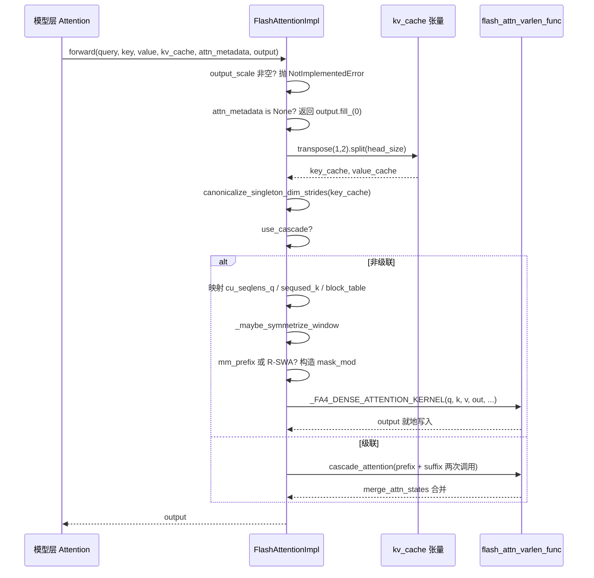

# Proyecto: vllm-project/vllm

En el capítulo anterior vimos cómo GPUModelRunner traduce los resultados de la programación en tensores físicos como input_ids, slot_mapping y block_table, y los inyecta en cada capa mediante forward_context. Pero el verdadero consumidor de tiempo de GPU —el cálculo de atención— aún queda en el aire. ¿Quién consume exactamente esos tensores en attn_metadata? ¿Cómo pueden FlashAttention, FlashInfer y Triton ser intercambiables bajo el mismo código de modelo? La respuesta está en la capa de abstracción AttentionBackend. Esta desacopla "cómo se calcula la atención" de "cómo la invoca el modelo": la capa del modelo solo mantiene una referencia a AttentionImpl y llama a la interfaz unificada forward(query, key, value, kv_cache, attn_metadata, output); mientras que el backend concreto se encarga de traducir block_table, slot_mapping, seq_lens en parámetros que su propio kernel pueda consumir. Este capítulo toma FlashAttentionBackend como hilo principal, porque cubre simultáneamente la semántica de gather de PagedAttention, la compatibilidad con CUDA Graph, la atención en cascada, el contexto distribuido DCP y las ramas más ricas. Si lo entiendes a fondo, los demás backends son solo variantes de mapeo de parámetros. La motivación de diseño de "registro de backend + interfaz unificada" es directa: los kernels de atención evolucionan muy rápido (FA2→FA3→FA4, iteraciones de FlashInfer, Triton propio), y si la capa del modelo dependiera directamente de un kernel concreto, cada actualización del kernel requeriría modificar el código del modelo. La capa de abstracción aísla los cambios detrás de un único método de fábrica: get_impl_cls().

# Selección de backend: declaración de capacidades y construcción de metadatos

## Modelo intuitivo

Piensa en`AttentionBackend`como un anuncio de empleo: no hace el trabajo, solo declara "qué dtypes, qué head_size, qué formatos de cuantización de KV cache y qué tipos de atención puedo manejar". El planificador toma la configuración del modelo para hacer coincidir, y si falla, pasa al siguiente candidato. Sin esta capa de declaración, el sistema descubriría en tiempo de ejecución que "este kernel no soporta este head_size" y colapsaría directamente.

## Matriz de capacidades: los campos son el contrato

`FlashAttentionBackend`Los atributos de clase de son sus límites de capacidad.`supported_dtypes`limita a fp16/bf16[FACT:vllm/v1/attention/backends/flash_attn.py:287-287]；`supported_kv_cache_dtypes`permite adicionalmente la serie fp8[FACT:vllm/v1/attention/backends/flash_attn.py:298-299]. Pero "declarar soporte" no equivale a "soporte incondicional"—`supports_kv_cache_dtype`para KV cuantizado delega además en`flash_attn_supports_kv_cache_dtype`para hacer juicios dependientes del dispositivo[FACT:vllm/v1/attention/backends/flash_attn.py:431-438]。

Más fino aún es`supports_combination`: recibe un conjunto completo de parámetros combinados como head_size, dtype, block_size, use_mla, has_sink, y devuelve`None`para indicar disponibilidad, o una cadena para indicar el motivo del rechazo[FACT:vllm/v1/attention/backends/flash_attn.py:454-507]. Por ejemplo, sink se rechaza en capacidades < 9.0[FACT:vllm/v1/attention/backends/flash_attn.py:467-468], y en SM90 FP8 KV con mm_prefix debe ir por Triton[FACT:vllm/v1/attention/backends/flash_attn.py:472-472]. Este diseño de "devolver cadena de motivo" permite que la capa superior dé errores diagnosticables en lugar de retroceder silenciosamente.

La elección de block_size también está impulsada por las capacidades. Por defecto devuelve`MultipleOf(16)`, pero SM90 FP8-KV fuerza 64[FACT:vllm/v1/attention/backends/flash_attn.py:297-324], y el kernel FA4 con head_size=256 fuerza`FA4_HD256_PAGE_SIZE` [FACT:vllm/v1/attention/backends/flash_attn.py:326-352]. Esto explica por qué el tamaño de bloque del KV cache no se define al azar—está restringido inversamente por el tamaño de tile TMA del kernel.

## Estructura de metadatos: diseño de campos de FlashAttentionMetadata

`FlashAttentionMetadata`es un dataclass, los campos se dividen en cuatro grupos[FACT:vllm/v1/attention/backends/flash_attn.py:511-566]：

El primer grupo es la descripción básica del lote:`num_actual_tokens`(número real de tokens sin padding),`max_query_len`、`query_start_loc`(suma prefija, usada por el kernel varlen para localizar el inicio y fin de cada secuencia),`seq_lens`、`block_table`、`slot_mapping` [FACT:vllm/v1/attention/backends/flash_attn.py:520-526]. Nótese el diagrama ASCII en los comentarios del código fuente[FACT:vllm/v1/attention/backends/flash_attn.py:512-518], que distingue con precisión`context_len`(KV histórico),`query_len`(nuevo en esta iteración),`seq_len`(la suma de ambos)—esta es la clave para entender los parámetros del kernel varlen.

El segundo grupo son los campos de atención en cascada:`use_cascade`、`common_prefix_len`、`cu_prefix_query_lens`etc.[FACT:vllm/v1/attention/backends/flash_attn.py:528-533]。

El tercer grupo son los campos de DCP (Decode Context Parallel):`max_dcp_context_kv_len`、`dcp_context_kv_lens`, y los contadores que distinguen el número de solicitudes decode/prefill[FACT:vllm/v1/attention/backends/flash_attn.py:535-544]。

El cuarto grupo son la programación opcional y máscaras especiales:`scheduler_metadata`(usado por la programación AOT de FA3),`causal`(puede ser bool o tensor, soporta causalidad por secuencia),`mm_prefix_query_range_tensor`(rangos bidireccionales multimodales), campos relacionados con R-SWA[FACT:vllm/v1/attention/backends/flash_attn.py:546-566]。

> **[Design Inference & Architectural Trade-offs]**
> `causal`El tipo del campo es`bool | torch.Tensor`en lugar de bool puro, esto es para soportar escenarios donde "en el mismo lote algunas secuencias son causales y otras no" (como PrefixLM). Cuando es un tensor, el parámetro`dynamic_causal`de FA4 toma el control, y FA2/FA3 lanzarán directamente NotImplementedError[FACT:vllm/v1/attention/backends/flash_attn.py:1429-1433]。

## Paso a paso de build()

Escenario: un lote mixto, 3 secuencias decode + 2 secuencias prefill, sin cascada, sin DCP.

Primer paso, desde`common_attn_metadata`desempaquetar los tensores base[FACT:vllm/v1/attention/backends/flash_attn.py:824-832]. Segundo paso, decidir si habilitar la programación AOT:`aot_schedule = self.aot_schedule and not fast_build and not envs.VLLM_BATCH_INVARIANT` [FACT:vllm/v1/attention/backends/flash_attn.py:836-838]。`self.aot_schedule`en`__init__`es determinado por`get_flash_attn_version() == 3`— solo FA3 admite metadatos de programación precalculados. Tercer paso, rellenar de forma perezosa en el primer build[FACT:vllm/v1/attention/backends/flash_attn.py:709-709]: recorrer todas las`aot_sliding_window`capas para recopilar la configuración de ventana deslizante; si la configuración es única, adoptarla; si hay más de una, desactivar AOT`FlashAttentionImpl`Cuarto paso, calcular[FACT:vllm/v1/attention/backends/flash_attn.py:848-851]。

. Por defecto 0 (para que FA3 use la heurística); solo se establece en`max_num_splits`cuando se habilita full CUDA graph y el número de tokens está dentro del rango de captura`self.max_num_splits` [FACT:vllm/v1/attention/backends/flash_attn.py:856-866]. El comentario explica la razón:`num_splits > 1`asigna`[num_splits, num_heads, num_tokens, head_size]`búferes intermedios, con alto coste de memoria; solo vale la pena en escenarios de CUDA graph[FACT:vllm/v1/attention/backends/flash_attn.py:862-865]。

Quinto paso, tomar la rama no en cascada y no DCP, llamar a`_get_scheduler_metadata`para generar los metadatos de programación de FA3[FACT:vllm/v1/attention/backends/flash_attn.py:976-986]. Sexto paso,`_store_scheduler_metadata`maneja el escenario de CUDA graph: copiar los nuevos metadatos al búfer preasignado y poner a cero la parte restante[FACT:vllm/v1/attention/backends/flash_attn.py:671-684]. Este paso de puesta a cero es crucial — el comentario señala explícitamente que, de lo contrario, algunos thread blocks leerían metadatos inválidos y sobrescribirían el búfer de salida[FACT:vllm/v1/attention/backends/flash_attn.py:671-672]。

Séptimo paso, construir`FlashAttentionMetadata`y devolver[FACT:vllm/v1/attention/backends/flash_attn.py:992-1015]。

```mermaid
flowchart TD
    start["build(common_prefix_len, common_attn_metadata)"] --> unpack["解包 query_start_loc / seq_lens / block_table / slot_mapping"]
    unpack --> aot{"aot_schedule 且非 fast_build 且非 BATCH_INVARIANT?"}
    aot -->|是| sw_check{"aot_sliding_window 已初始化?"}
    aot -->|否| maxsplit
    sw_check -->|否, 首次| collect["_get_sliding_window_configs 收集层滑窗"]
    collect --> sw_unique{"配置数量 == 1?"}
    sw_unique -->|是| set_sw["设置 aot_sliding_window"]
    sw_unique -->|否, >1| disable_aot["self.aot_schedule = False"]
    set_sw --> maxsplit
    disable_aot --> maxsplit
    sw_check -->|是| maxsplit["计算 max_num_splits"]
    maxsplit --> cg_check{"use_full_cuda_graph 且 tokens |是| set_splits["max_num_splits = self.max_num_splits"]
    cg_check -->|否| zero_splits["max_num_splits = 0"]
    set_splits --> branch
    zero_splits --> branch
    branch{"dcp_world_size > 1?"}
    branch -->|是| dcp_path["计算 dcp_context_kv_lens, 可能 skip"]
    branch -->|否| cascade_check{"common_prefix_len > 0?"}
    cascade_check -->|是| cascade_path["构造 prefix/suffix 双份 scheduler_metadata"]
    cascade_check -->|否| normal_path["_get_scheduler_metadata 单份"]
    dcp_path --> store
    cascade_path --> store
    normal_path --> store
    store["_store_scheduler_metadata: CUDA graph 时拷入预分配缓冲并清零尾部"] --> build_meta["构造 FlashAttentionMetadata"]
    build_meta --> mm_check{"mm_req_doc_ranges 非空?"}
    mm_check -->|是| fill_mm["fill_mm_prefix_query_ranges + 拷贝到 GPU"]
    mm_check -->|否| rswa_check
    fill_mm --> rswa_check{"rswa_window 非空?"}
    rswa_check -->|是| copy_rswa["拷贝 prefix_lens 到持久缓冲"]
    rswa_check -->|否| done
    copy_rswa --> done["返回 attn_metadata"]
```

---

# forward(): la cadena completa desde los metadatos hasta la invocación del kernel

## Modelo intuitivo

`forward()`es el "taller de ensamblaje final" del backend: recibe las Q/K/V calculadas por las capas del modelo, los tensores de KV cache y los metadatos construidos en el paso anterior, ajusta el diseño físico del KV cache a la forma esperada por el kernel y luego lo despacha al kernel concreto. Sin este paso, el kernel leería un diseño de memoria incorrecto y produciría errores silenciosos en la salida — más difíciles de depurar que un crash.

## Transformación del diseño de memoria del KV cache

La forma física del KV cache de vLLM es`[num_blocks, num_kv_heads, block_size, 2 * head_size]`— K y V concatenados en la última dimensión[FACT:vllm/v1/attention/backends/flash_attn.py:1246-1247]. Pero los kernels de FlashAttention esperan K y V separados, y con diseño`[num_blocks, block_size, num_kv_heads, head_size]`。

La transformación ocurre al inicio de`forward()`:`kv_cache.transpose(1, 2).split(self.head_size, dim=-1)` [FACT:vllm/v1/attention/backends/flash_attn.py:1310-1310]。`transpose(1,2)`convierte`[blocks, heads, block_size, 2D]`en`[blocks, block_size, heads, 2D]`，`split`cortando K y V a lo largo de la última dimensión. Nótese que`transpose`solo cambia el stride sin mover datos, por lo que los kernels posteriores deben admitir acceso no contiguo.

Inmediatamente después viene`canonicalize_singleton_dim_strides` [FACT:vllm/v1/attention/backends/flash_attn.py:1310-1310]. El comentario señala el motivo: cuando`num_kv_heads=1`(común en escenarios TP), el stride de las dimensiones de tamaño 1 es degenerado, y FA3/FA4 en H100+ usan TMA, que exige que el stride esté alineado a al menos 16 bytes[FACT:vllm/v1/attention/backends/flash_attn.py:1310-1310]. Esta es una trampa típica de "lógicamente equivalente, físicamente inválido".

## Flujo de parámetros en la ruta no en cascada

Tras entrar en la rama`if not attn_metadata.use_cascade`, los parámetros se mapean uno a uno[FACT:vllm/v1/attention/backends/flash_attn.py:1326-1342]：`cu_seqlens_q = query_start_loc`，`seqused_k = seq_lens`，`block_table = attn_metadata.block_table`。`descale_shape`toma`(batch_size, num_kv_heads)`, usado para la difusión de escala de cuantización FP8 — el comentario indica que flash-attn espera que la forma de descale sea`(num_sequences, num_kv_heads)`, usando`.expand()`para evitar copias[FACT:vllm/v1/attention/backends/flash_attn.py:1258-1258]。

Luego viene el tratamiento de simetrización de la ventana deslizante.`_maybe_symmetrize_window`lógica: la ventana deslizante causal`(w, 0)`en escenarios no causales debe convertirse en`(w, w)`, para que la query bidireccional pueda mirar en ambas direcciones[FACT:vllm/v1/attention/backends/flash_attn.py:587-589]. El comentario también enfatiza que "la window de la propia capa tiene prioridad sobre la window del group", porque un KV cache group puede albergar simultáneamente capas con ventana y capas globales (como cuando Gemma-3 desactiva hybrid KV cache manager)[FACT:vllm/v1/attention/backends/flash_attn.py:1362-1365]。

## Rama de máscara: mm_prefix y R-SWA

Cuando`mm_prefix_query_ranges`no está vacío y se cumplen las condiciones de FA4 + causal estático, el código construye el`mask_mod` [FACT:vllm/v1/attention/backends/flash_attn.py:1374-1407]de CuTE-DSL. Las acciones clave son`causal = False`y`sliding_window_size = None` [FACT:vllm/v1/attention/backends/flash_attn.py:1406-1407]. El comentario explica la razón: la semántica de mm_prefix es`(causal ∧ window) ∨ bidirectional-range`, no un subconjunto de causal; tras FA #155, establecer mask_mod ya no limpia automáticamente causal/local, y el llamador debe desactivarlo explícitamente, de lo contrario la ruta causal integrada cortocircuitaría mask_mod[FACT:vllm/v1/attention/backends/flash_attn.py:1402-1405]。

`_make_mm_prefix_mask_mod`usa`functools.cache`caché[FACT:vllm/v1/attention/backends/flash_attn.py:1793-1802]. El comentario da una razón contundente: el`hash_callable`de FA4 mezcla el`repr()`de la unidad de cierre en la clave de compilación; el`_load_q_range`anidado tiene una dirección diferente en cada llamada, lo que provoca una recompilación JIT completa en cada forward[FACT:vllm/v1/attention/backends/flash_attn.py:1793-1802]. Este es un ejemplo típico de trampa de rendimiento en entornos de producción.

Dentro de la máscara hay un detalle de conversión de coordenadas: FA4 pasa el`q_idx`local (0-based dentro del chunk de prefill actual), mientras que`kv_idx`es la posición absoluta. El código usa`q_abs = q_idx + seqlen_k - seqlen_q`para restaurar la posición absoluta[FACT:vllm/v1/attention/backends/flash_attn.py:1859-1865]。`__vec_size__ = 1`también tiene su razón de ser:`_load_q_range`lee el lane 0; una llamada no puede abarcar filas de query[FACT:vllm/v1/attention/backends/flash_attn.py:1897-1897]。

El mask_mod de R-SWA es similar, pero la semántica es`causal & (in_prefix | in_window)` [FACT:vllm/v1/attention/backends/flash_attn.py:1945-1948], y`use_fast_sampling = True`hace que FA4 omita los bloques KV completamente enmascarados, sin cargar sus datos[FACT:vllm/v1/attention/backends/flash_attn.py:1950-1950]。

## Tratamiento especial de FA4 hd256

Cuando`self.fa4_hd256`es verdadero, el código fuerza la alineación de página:`num_pages = cdiv(max_seqlen_k, FA4_HD256_PAGE_SIZE)`，`max_seqlen_k`redondea hacia arriba al límite de página,`block_table`trunca al número exacto de páginas,`num_splits = 1` [FACT:vllm/v1/attention/backends/flash_attn.py:1442-1448]. El comentario indica que el kernel hd256 requiere longitud alineada a página, block table de ancho exacto y no admite SplitKV.

Finalmente se llama a`_FA4_DENSE_ATTENTION_KERNEL(...)`, pasando q, k, v, out, cu_seqlens_q, seqused_k, block_table, softcap, mask_mod, aux_tensors, etc.[FACT:vllm/v1/attention/backends/flash_attn.py:1450-1475]。

## Escritura en KV cache: do_kv_cache_update

`forward()`solo lee el KV cache; la escritura la realiza`do_kv_cache_update`. Este llama a`reshape_and_cache_flash`, usando`slot_mapping`para escribir de forma dispersa las K/V recién calculadas en el cache[FACT:vllm/v1/attention/backends/flash_attn.py:1532-1541]. El comentario señala:`key`/`value`está padded mientras que`slot_mapping`No, pero no se requiere segmentación manual, porque el op usa`slot_mapping`la shape de[FACT:vllm/v1/attention/backends/flash_attn.py:1527-1531]para determinar el número real de tokens. Aquí no se realiza normalización de stride, porque no participa ningún kernel TMA[FACT:vllm/v1/attention/backends/flash_attn.py:1520-1521]。



---

# Reflexión de diseño: por qué se escribió así

> **[Design Inference & Architectural Trade-offs]**
> **Separación entre declaración de capacidades e implementación**。`supports_combination`Devuelve una cadena de razón en lugar de un bool; esto permite que la capa superior, al retroceder a otros backends, pueda registrar "por qué no se usó FA", reduciendo enormemente el costo de diagnóstico en producción. En comparación con un retroceso silencioso, este diseño hace explícita la base de la decisión.

**La compatibilidad con CUDA Graph es una restricción invisible del diseño de metadatos**。`_store_scheduler_metadata`El patrón de "copiar dentro + poner a cero la cola" de[FACT:vllm/v1/attention/backends/flash_attn.py:671-684]aparece repetidamente en el búfer persistente de R-SWA[FACT:vllm/v1/attention/backends/flash_attn.py:787-798]y en la zona temporal de mm_prefix[FACT:vllm/v1/attention/backends/flash_attn.py:800-813]. El patrón común es: preasignar en`__init__`un búfer persistente del tamaño máximo,`build()`y en[FACT:vllm/v1/attention/backends/flash_attn.py:1044-1046]。

**solo copiar, sin asignar. La razón se señala en los comentarios: durante la captura de CUDA graph no puede haber operaciones de asignación**。`supports_draft_decode_metadata_update = self.dcp_world_size == 1` [FACT:vllm/v1/attention/backends/flash_attn.py:742-742]Exclusión mutua entre DCP y fused draft decode`skip_dcp_context_attention()`. El comentario explica: fused draft decode reutiliza entre pasos de draft los objetos de metadatos capturados, pero las decisiones del lado del host en tiempo de build de DCP (como[FACT:vllm/v1/attention/backends/flash_attn.py:736-741]) cambian la forma de los metadatos, y estos campos de Python no se actualizan in situ entre replays del graph

**. Esta es una compensación típica de "cuando el rendimiento y la corrección entran en conflicto, elegir la corrección".**。`use_cascade_attention`Umbral heurístico de la atención en cascada[FACT:vllm/v1/attention/backends/flash_attn.py:1967-1967]Se filtran con una serie de umbrales: common_prefix_len < 256 se rechaza directamente[FACT:vllm/v1/attention/backends/flash_attn.py:1978-1979], alibi/sliding_window/local_attention no son compatibles[FACT:vllm/v1/attention/backends/flash_attn.py:1982-1984], número de solicitudes < 8 se rechaza[FACT:vllm/v1/attention/backends/flash_attn.py:1985-1987], escenario DCP deshabilitado[FACT:vllm/v1/attention/backends/flash_attn.py:2011-2029]. Tras pasar, todavía hay que usar un modelo de rendimiento aproximado para comparar el número de CTA y el número de waves entre cascade y FlashDecoding[FACT:vllm/v1/attention/backends/flash_attn.py:2009-2010]。

**. El comentario admite que este modelo es "very rough"**：`forward()`Puntos problemáticos en producción`view`/`slice`Hay un comentario destacado que advierte que, bajo piece-wise CUDA graph, este método se ejecuta en modo eager,[FACT:vllm/v1/attention/backends/flash_attn.py:1277-1284]y que métodos aparentemente sin operaciones de GPU como`[:num_actual_tokens]`son en realidad muy lentos; cualquier cambio debe ser benchmarkeado

---

# . Esto explica por qué en el código se usa ampliamente

el slicing en lugar de formas más "elegantes": cada punto es el resultado de una compensación de rendimiento.`FlashAttentionBackend`Resumen del capítulo`supports_*`Este capítulo recorre`build()`el ciclo de vida completo del backend de atención: declaración de capacidades (`CommonAttentionMetadata`serie) → construcción de metadatos (`FlashAttentionMetadata`traduce`forward()`a`transpose+split`) → invocación del kernel (

transforma el layout del KV cache, construye máscaras, despacha al kernel FA). Los mecanismos centrales incluyen: la transformación de layout

del KV cache, la normalización de strides degenerados, el patrón de búfer persistente bajo CUDA graph, la construcción de máscaras CuTE-DSL para mm_prefix/R-SWA, y la decisión heurística de la atención en cascada.`logits`Principio de diseño clave: separación entre declaración de capacidades e implementación, preasignación de metadatos impulsada por la compatibilidad con CUDA graph, y prioridad a la corrección cuando el rendimiento y la corrección entran en conflicto (DCP deshabilita fused draft decode).

# El siguiente capítulo pasa a muestreo y salida:

cómo`_store_scheduler_metadata`se convierte en tokens a través de la cadena de procesadores (temperatura, top-p, penalizaciones), cómo la salida estructurada restringe la decodificación, y cómo el retorno en streaming colabora con el planificador.`self.scheduler_metadata[n:] = 0`Reflexión y autoevaluación de este capítulo

**Q1: Si se elimina la operación de puesta a cero de**：`_store_scheduler_metadata`en[FACT:vllm/v1/attention/backends/flash_attn.py:671-684], ¿en qué escenarios provocaría una salida incorrecta? ¿Por qué el comentario enfatiza especialmente este punto?[FACT:vllm/v1/attention/backends/flash_attn.py:671-672]Análisis de referencia

Q2: `_make_mm_prefix_mask_mod`En escenarios de CUDA graph, copia los nuevos metadatos en las primeras n posiciones del búfer preasignado`functools.cache`. Si no se pone a cero la cola, los metadatos de planificación residuales de la build anterior serán leídos por el kernel actual. El comentario señala explícitamente que "some thread blocks may use the invalid scheduler metadata and overwrite the output buffer"

**. Escenario de activación: el tamaño del lote pasa de grande a pequeño (por ejemplo, de 8 secuencias a 3), las primeras 3 posiciones del búfer son datos nuevos, pero las posiciones 4-8 siguen siendo datos del lote anterior. Los metadatos de planificación de FA3 contienen información de asignación de tiles; cuando el kernel lee según batch_size, si el cálculo de batch_size tiene desviaciones o el kernel escanea con un stride fijo, leerá datos sucios y corromperá la salida. Esta es la trampa clásica de la reutilización de búferes en CUDA graph: el ciclo de vida del búfer abarca múltiples replays y debe limpiarse explícitamente.**Se usa`hash_callable`como caché; el comentario dice que de lo contrario "force a full JIT recompile every forward". Si se elimina este decorador de caché, ¿cuánto se degradaría el rendimiento? ¿Por qué la clave de compilación de FA4 se ve afectada por la dirección del closure?`repr()`Análisis de referencia[FACT:vllm/v1/attention/backends/flash_attn.py:1793-1802]。`_make_mm_prefix_mask_mod`: el comentario explica que`_load_q_range`de FA4 mezcla`repr()`Contiene direcciones de memoria, que cambian en cada ejecución → la clave de compilación cambia cada vez → FA4 considera que necesita recompilación JIT. Tras el almacenamiento en caché, permanece igual.`(sliding_window, sliding_window_left)`Los parámetros reutilizan el mismo objeto de función, por lo que la clave de compilación es estable. El grado de degradación del rendimiento depende del tiempo de compilación de FA4, pero se puede afirmar que "cada forward desencadena una compilación completa", compilando una vez en cada paso del bucle de decode, y la latencia se degradará de milisegundos a segundos. Este es un caso típico de invalidación de la caché JIT provocada por un "cierre de Python aparentemente inofensivo".

Q3: `supports_draft_decode_metadata_update = self.dcp_world_size == 1`Esta línea de código deshabilita el fused draft decode en escenarios DCP. Supongamos que la fuerzas a cambiar a`True`, ¿qué error concreto aparecería bajo la combinación de decodificación especulativa + DCP?

**Análisis de referencia**: el comentario explica que el fused draft decode reutiliza entre pasos de draft el objeto de metadatos capturado, mientras que las decisiones del lado del host en tiempo de construcción de DCP (como`skip_dcp_context_attention()`) cambian la forma de los metadatos o la ruta de control, por ejemplo`max_dcp_context_kv_len` [FACT:vllm/v1/attention/backends/flash_attn.py:736-741]. Estos campos de Python no se actualizan in situ entre reproducciones de CUDA graph. Error concreto: la longitud de secuencia crece entre pasos de draft,`skip_dcp_context_attention`la determinación de puede cambiar de True a False (o viceversa), pero el objeto de metadatos reutilizado conserva los valores antiguos. Si el valor antiguo es`max_dcp_context_kv_len = 0`, el kernel tomará la ruta "sin contexto DCP"[FACT:vllm/v1/attention/backends/flash_attn.py:1565-1589], omitiendo la atención de contexto entre ranks, lo que provoca que la salida pierda información de contexto: un error silencioso, sin fallo. Esto refleja precisamente "elegir la corrección cuando el rendimiento optimizado entra en conflicto con la corrección".

Hasta aquí, la cadena completa desde la interfaz abstracta hasta la implementación del kernel del backend de atención ya está conectada: la capa del modelo llama de forma unificada a través de AttentionImpl, el backend se encarga de traducir metadatos como block_table y slot_mapping a parámetros concretos del kernel, y la implementación de PagedAttention de FlashAttentionBackend muestra la semántica de gather bajo KV Cache paginado y la estrategia de compatibilidad con CUDA Graph. Pero el cálculo de atención solo produce estados ocultos; lo que el modelo finalmente debe emitir es el siguiente token. ¿Cómo se convierten estos estados ocultos en logits, y cómo pasan los logits por muestreo y postprocesamiento hasta devolverse finalmente al cliente como texto en streaming? El siguiente capítulo seguirá este último tramo.
