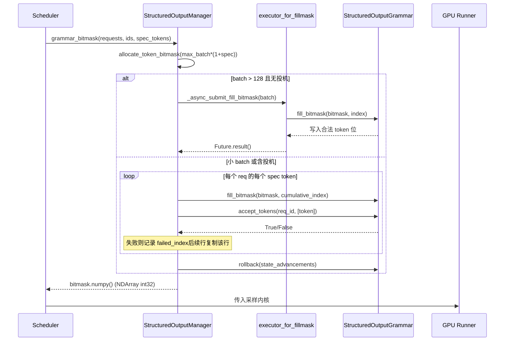

# Capítulo 7: Muestreo y salida: procesamiento de Logits, salida estructurada y retorno en streaming

En el capítulo anterior seguimos cómo el backend de atención traduce el block table a parámetros del kernel y completa el cálculo de atención tipo gather sobre memoria no contigua. Pero la atención solo produce estados ocultos: lo que el modelo realmente debe entregar al usuario es el texto del siguiente token. Este capítulo sigue ese último tramo: una vez que los estados ocultos se proyectan a logits mediante lm_head, cómo atraviesan una cadena de procesadores cuidadosamente ordenada (temperatura, penalizaciones, top-k/top-p, restricciones estructuradas), se muestrean a token id y luego, mediante el detokenizer, se restauran a texto y se envían en streaming. Cualquier paso desordenado o fuga de estado en esta cadena degradará silenciosamente la calidad de la salida.

# Sampler: el orden de la cadena de procesadores es la corrección

**Modelo intuitivo**: el Sampler es como una línea de ensamblaje, y los logits son la pieza en bruto por procesar. Cada estación de la línea (processor) modifica la pieza, y el orden de las estaciones determina directamente el producto final: primero cortar y luego pulir no da lo mismo que primero pulir y luego cortar. Sin esta cadena, el modelo solo podría emitir la distribución de probabilidad original, y el usuario obtendría un "muestreo desnudo" sin control de temperatura, sin supresión de repeticiones y sin restricciones de formato.

## Estructuras de datos y diseño de memoria

El propio Sampler es`nn.Module`, pero su estado central es extremadamente delgado: solo contiene el submódulo`topk_topp_sampler`, la bandera`logprobs_mode`y`use_fp64_gumbel`.[FACT:vllm/v1/sample/sampler.py:61-64]. Todo el estado real a nivel de lote está encapsulado en`SamplingMetadata`, y se pasa mediante los parámetros de forward. Este diseño de "Sampler sin estado + metadatos externos" es deliberado: la instancia de Sampler se crea una sola vez durante el ciclo de vida del motor, mientras que la composición del lote cambia en cada decode step; externalizar el estado es lo que permite que el Sampler se reproduzca de forma segura tras ser capturado por CUDA Graph.

La constante clave es`_SAMPLING_EPS = 1e-5` [FACT:vllm/v1/sample/sampler.py:18]. Cumple simultáneamente dos semánticas: una temperatura inferior a este valor se considera greedy, y`apply_temperature`sirve como respaldo para evitar la división por cero.

## Step-by-Step Walkthrough

Escenario concreto: en un batch se mezclan solicitudes greedy con solicitudes de muestreo aleatorio, y algunas además tienen logprobs activados.

**Primer paso, tomar una instantánea de los logprobs originales.**Antes de aplicar cualquier penalización o temperatura, si la solicitud necesita logprobs, primero se decide el contenido de la instantánea según`logprobs_mode`.[FACT:vllm/v1/sample/sampler.py:84-93]. Nótese que el comentario señala explícitamente la diferencia con V0: V1 usa**logits originales**(antes de penalizaciones y temperatura) para calcular los top-k logprobs.[FACT:vllm/v1/sample/sampler.py:72-77]. Este es el contrato semántico: el logprob que ve el usuario debe reflejar la distribución real del modelo, no una distribución distorsionada por penalizaciones.

**Segundo paso, unificar a float32.** [FACT:vllm/v1/sample/sampler.py:95-96]Independientemente de si la entrada es bf16 o fp16, se convierte a float32. La razón es que el log_softmax, top-k y la probabilidad acumulada posteriores acumulan errores en baja precisión, especialmente cuando el vocab alcanza los 150 mil.

**Tercer paso, cadena de procesadores que no alteran el argmax.** `apply_logits_processors`Se aplican secuencialmente: máscara de lista blanca de allowed token, exclusión de bad words,`non_argmax_invariant`procesadores, términos de penalización[FACT:vllm/v1/sample/sampler.py:391-404]. La clasificación aquí es el diseño central——`non_argmax_invariant`se refiere a aquellos**que cambian el resultado greedy**procesadores (como min_tokens, logit_bias), que deben aplicarse antes del muestreo greedy; mientras que los`argmax_invariant`procesadores (como min_p) no cambian el argmax y pueden posponerse hasta después de la temperatura.

**Cuarto paso, muestreo.** `sample`El método primero determina si es completamente aleatorio[FACT:vllm/v1/sample/sampler.py:256-271]: si`all_greedy`, retorna directamente argmax; de lo contrario, primero calcula el resultado greedy como respaldo, luego aplica temperatura, procesadores que no alteran el argmax, top-k/top-p[FACT:vllm/v1/sample/sampler.py:275-291]. Finalmente usa`torch.where`para seleccionar entre el resultado greedy y el aleatorio según el umbral de temperatura[FACT:vllm/v1/sample/sampler.py:305-306], y reutiliza el tensor`greedy_sampled`como búfer de salida, evitando asignaciones adicionales.

**Quinto paso, recolectar logprobs y encapsular la salida.**Según`num_logprobs`hay tres casos: None solo retorna los logprobs del token especificado; -1 retorna todos los logprobs sin ordenar; de lo contrario top-k[FACT:vllm/v1/sample/sampler.py:120-131]. Finalmente, el token id se convierte a int32 para comprimir el tamaño, y se expande a un tensor bidimensional`[num_requests, 1]`de[FACT:vllm/v1/sample/sampler.py:138-148]。

```mermaid
flowchart TD
    in_logits["logits (bf16/fp16)"] --> snap{"需要 logprobs?"}
    snap -->|是| raw["compute_logprobs / cloneraw_logprobs 快照"]
    snap -->|否| f32
    raw --> f32["logits.to(float32)"]
    f32 --> proc["apply_logits_processors"]
    proc --> mask{"allowed_token_ids_mask?"}
    mask -->|是| fill["masked_fill_(-inf)"]
    mask -->|否| bad
    fill --> bad{"bad_words_token_ids?"}
    bad -->|是| apply_bad["apply_bad_words"]
    bad -->|否| noninv
    apply_bad --> noninv["non_argmax_invariant 处理器"]
    noninv --> pen["apply_penalties"]
    pen --> sample["sample()"]
    sample --> allg{"all_greedy?"}
    allg -->|是| greedy["greedy_sample (argmax)"]
    allg -->|否| temp["apply_temperature"]
    temp --> arginv["argmax_invariant 处理器"]
    arginv --> topp["topk_topp_sampler"]
    topp --> where["torch.where(temp  out
    where --> out["SamplerOutputsampled_token_ids"]
```

## Reflexiones de diseño y errores comunes

**¿Por qué los términos de penalización deben ir antes de la temperatura?**La temperatura es un escalado de la distribución, la penalización es una suma o resta de puntos a tokens específicos. Si se escala primero y luego se penaliza, la magnitud absoluta de la penalización se amplifica o reduce por la temperatura, causando que el mismo conjunto de parámetros de penalización se comporte de manera inconsistente a diferentes temperaturas. V1 fija la penalización antes de la temperatura, garantizando la estabilidad semántica de los parámetros.

**`mark_unbacked`La trampa de compilación de**En`gather_logprobs`,`batched_count_greater_than`se compila, y cuando la dimensión batch cambia de 1 a ≥2 se dispara una recompilación por especialización 0/1 de dynamo[FACT:vllm/v1/sample/sampler.py:345-348]。`mark_unbacked`marca esa dimensión como completamente simbólica, evitando esta recompilación. En producción, si se observa un bloqueo repentino tras la primera solicitud de decode, muy probablemente sea este tipo de recompilación.

**`gpu_sync_allowed`El límite de sincronización de** `batched_count_greater_than`internamente puede disparar una sincronización de GPU, vLLM usa el contexto`gpu_sync_allowed(first_only=True)`para declarar explícitamente "aquí se permite sincronización, pero solo la primera vez"[FACT:vllm/v1/sample/sampler.py:345-348]. Si se sincroniza inesperadamente dentro de una región de captura de CUDA Graph, causará que la captura falle——esta es la pista clave para diagnosticar problemas de captura de grafos.

# Salida estructurada: máquina de estados de doble vía con máscara de bits y gramática

**Modelo intuitivo**: la salida estructurada es como ponerle al muestreador un par de "gafas gramaticales"——en cada paso solo puede ver los tokens que cumplen con el JSON schema o la gramática. Sin ellas, el modelo podría generar JSON con errores de sintaxis y el parser downstream colapsaría directamente. La esencia de la implementación de vLLM es: la máquina de estados gramatical avanza en el lado de CPU, mientras que las restricciones se pasan al muestreo del lado de GPU en forma de máscara de bits.

## Estructuras de datos y diseño de memoria

`StructuredOutputManager`es un singleton a nivel de motor, que posee`backend`(uno de xgrammar/guidance/outlines/lm-format-enforcer),`reasoner_cls`y dos pools de hilos[FACT:vllm/v1/structured_output/__init__.py:39-98]。

La máscara de bits es la estructura de datos central:`_grammar_bitmask`es un tensor int32 de forma`[max_batch_size * (1 + max_num_spec_tokens), vocab_size/32]`. Cada bit corresponde a si un token es válido.[FACT:vllm/v1/structured_output/__init__.py:327-336]representa "todo 1"——todos los tokens válidos`_full_mask = torch.tensor(-1, dtype=torch.int32)`Los dos pools de hilos tienen una división clara:[FACT:vllm/v1/structured_output/__init__.py:59]。

se encarga de la compilación de gramática (intensivo en CPU, número de workers es la mitad de los núcleos de CPU)`executor`se encarga del llenado paralelo de máscaras de bits para batches grandes, solo se habilita cuando el batch supera 128[FACT:vllm/v1/structured_output/__init__.py:71-78]；`executor_for_fillmask`Inicialización de gramática.[FACT:vllm/v1/structured_output/__init__.py:62-69]。

## Step-by-Step Walkthrough

**Cuando una solicitud entra por primera vez,**es invocado`grammar_init`. Si el backend no está inicializado, se selecciona la implementación según la configuración[FACT:vllm/v1/structured_output/__init__.py:115-176]. Luego se envía la tarea de compilación: por defecto va por la vía asíncrona[FACT:vllm/v1/structured_output/__init__.py:130-165], pero en el modo`executor.submit`debe ser síncrona`external_launcher`Generación de máscara de bits.[FACT:vllm/v1/structured_output/__init__.py:167-176]。

**En cada decode step,**genera máscaras para todas las solicitudes estructuradas del batch`grammar_bitmask`. Los batches grandes van por la ruta paralela: se envían al pool de hilos en grupos de 16[FACT:vllm/v1/structured_output/__init__.py:314-442]. Los batches pequeños van por la ruta serial, avanzando el estado gramatical token por token[FACT:vllm/v1/structured_output/__init__.py:346-373]Alineación de máscaras bajo decodificación especulativa.[FACT:vllm/v1/structured_output/__init__.py:374-433]。

**Esta es la parte más ingeniosa. Cuando hay draft tokens, cada solicitud necesita**filas de máscara. La ruta serial procesa token por token: si un draft token es rechazado por la gramática, se registra`1 + max_num_spec_tokens`, y las filas posteriores copian directamente la máscara de esa fila`failed_index`. Esto garantiza que "tras el rechazo de un draft, el estado de restricción de las posiciones posteriores retrocede al punto de rechazo".[FACT:vllm/v1/structured_output/__init__.py:396-418]Reversión de estado.

**Durante el llenado de la máscara de bits, el estado gramatical avanzó**pasos, pero los draft tokens aún no han sido realmente aceptados, por lo que se debe`state_advancements`retroceder`grammar.rollback(state_advancements)`. La aceptación real ocurre en[FACT:vllm/v1/structured_output/__init__.py:422-430]copia`accept_tokens` [FACT:vllm/v1/structured_output/__init__.py:444-466]。



## ¿Por qué external_launcher debe compilar de forma síncrona?

**El comentario da la razón precisa: la compilación asíncrona haría que las transiciones de estado de**ocurrieran en momentos diferentes en distintos TP ranks, rompiendo la suposición de determinismo de la que depende external_launcher`WAITING_FOR_STRUCTURED_OUTPUT_GRAMMAR → WAITING` 状态转换在不同 TP rank 上发生于不同时刻，破坏 external_launcher 依赖的确定性假设 [FACT:vllm/v1/structured_output/__init__.py:47-56]. Este es un caso típico del conflicto entre determinismo distribuido y optimización asíncrona.

**Punto de inicio de la restricción bajo el modelo de razonamiento.** `_get_constraint_start`Determina desde qué token comenzar a aplicar la restricción gramatical[FACT:vllm/v1/structured_output/__init__.py:220-292]. Para modelos con cadena de pensamiento, la fase de reasoning no debe estar sujeta a restricciones JSON; solo se activa tras finalizar el reasoning.`enable_in_reasoning`Cuando es True, devuelve directamente 0 (restricción durante todo el proceso)[FACT:vllm/v1/structured_output/__init__.py:235-236]. Si el reasoner soporta`find_reasoning_end_offset`, úsalo para localizar con precisión[FACT:vllm/v1/structured_output/__init__.py:261-267]; de lo contrario, recurre a la búsqueda de retroceso token por token[FACT:vllm/v1/structured_output/__init__.py:287-291]。

**`validate_tokens`la semántica de prefijo de**En decodificación especulativa, los draft tokens pueden violar la gramática,`validate_tokens`devuelve el "prefijo legal más largo"[FACT:vllm/v1/structured_output/__init__.py:294-312]. Nótese que primero elimina el relleno especulativo (-1), luego calcula el punto de inicio de la restricción y, finalmente, solo realiza la validación gramatical sobre los tokens dentro del intervalo restringido.

# Detokenizer: el juego de fronteras entre decodificación incremental y stop string

**Modelo intuitivo**: el detokenizer es como un escriba que transcribe carácter por carácter, traduciendo token ids a texto legible por humanos. La dificultad radica en que: los tokens y los caracteres no tienen correspondencia uno a uno (un token puede corresponder solo a medio carácter UTF-8), y el stop string puede abarcar múltiples tokens. Sin decodificación incremental, cada paso requeriría decodificar toda la secuencia desde el principio, y el costo O(n²) degradaría el throughput.

## Estructuras de datos y diseño de memoria

`IncrementalDetokenizer`La clase base solo contiene`token_ids`lista[FACT:vllm/v1/engine/detokenizer.py:32-33]。`BaseIncrementalDetokenizer`añade campos relacionados con stop:`stop`lista,`min_tokens`、`include_stop_str_in_output`、`stop_buffer_length`y`_last_output_text_offset` [FACT:vllm/v1/engine/detokenizer.py:70-94]。

`stop_buffer_length`son clave: cuando el stop string no está incluido en la salida, equivale a la longitud del stop string más largo menos uno[FACT:vllm/v1/engine/detokenizer.py:87-90]. Este "búfer de retroceso" asegura que la salida en streaming no emita prematuramente caracteres que podrían ser prefijo de un stop string.

Dos rutas de implementación:`FastIncrementalDetokenizer`Usa la librería tokenizers`DecodeStream` [FACT:vllm/v1/engine/detokenizer.py:166-246]；`SlowIncrementalDetokenizer`Usa el lado de Python`detokenize_incrementally` [FACT:vllm/v1/engine/detokenizer.py:249-305]. El criterio de selección es que la versión de tokenizers sea ≥ 0.22.0 y el tipo de tokenizer coincida[FACT:vllm/v1/engine/detokenizer.py:32-33][FACT:vllm/v1/engine/detokenizer.py:61-63]。

## Step-by-Step Walkthrough

**decodificación incremental.** `update`Recibe nuevos token ids y`stop_terminated`flag[FACT:vllm/v1/engine/detokenizer.py:96-142]. Si stop termina y no incluye el stop string, el último token queda excluido de la decodificación[FACT:vllm/v1/engine/detokenizer.py:107-111]. Luego, token por token, llama a`decode_next`acumula texto[FACT:vllm/v1/engine/detokenizer.py:117-122]。

**detección de stop string.** `check_stop_strings`Solo busca dentro del rango de caracteres nuevos[FACT:vllm/v1/engine/detokenizer.py:308-360]. El punto de inicio de búsqueda es`1 - new_char_count - stop_string_len` [FACT:vllm/v1/engine/detokenizer.py:338], este desplazamiento asegura que los stop strings que cruzan fronteras de tokens también sean capturados. Cuando múltiples stop strings coinciden simultáneamente, se elige**el que se complete primero**[FACT:vllm/v1/engine/detokenizer.py:342-347]。

**segmentación de salida en streaming.** `get_next_output_text`Según el parámetro`delta`decide si devolver todo o solo el incremento[FACT:vllm/v1/engine/detokenizer.py:148-163]. Si no está completo, retiene`stop_buffer_length`caracteres sin emitir[FACT:vllm/v1/engine/detokenizer.py:145-146], usa`_last_output_text_offset`para registrar la posición ya enviada[FACT:vllm/v1/engine/detokenizer.py:148-163]。

**recuperación de excepciones.** `FastIncrementalDetokenizer._protected_step`Maneja dos tipos de excepciones: OverflowError/TypeError registra en log y devuelve None[FACT:vllm/v1/engine/detokenizer.py:225-229]; el error "Invalid prefix" entonces**reconstruye DecodeStream**y reintenta[FACT:vllm/v1/engine/detokenizer.py:222-246]. Este último aborda el caso límite en que el tokenizer produce salida UTF-8 no monótona.

## Reflexiones de diseño y trampas

**El equilibrio de stop_buffer_length.**Cuanto más largo el búfer, mayor la latencia del streaming (el tiempo hasta que el usuario ve el texto se pospone), pero menos probable es pasar por alto stop strings que cruzan tokens. Tomar "la longitud del stop string más largo menos uno" es la cota inferior exacta: cualquier prefijo de un stop string tiene como máximo esa longitud.

**min_tokens y stop_check_offset.**Cuando el número de tokens de salida no alcanza`min_tokens`,`stop_check_offset`se empuja continuamente hasta el final del texto[FACT:vllm/v1/engine/detokenizer.py:120-122], lo que significa que este fragmento de texto no será sometido a detección de stop. Esto evita que el modelo choque con un stop string al inicio y produzca una salida vacía.

**Caché de added_token_ids en la ruta Fast.**Cuando`spaces_between_special_tokens`es False, es necesario suprimir los espacios entre tokens especiales[FACT:vllm/v1/engine/detokenizer.py:192-207]. El código almacena en caché`added_token_ids`en el objeto tokenizer[FACT:vllm/v1/engine/detokenizer.py:195-200], evitando reconstruir el diccionario en cada decode.

# Reflexiones de diseño

Los tres módulos comparten una filosofía de diseño:**separar el avance de estado de la verificación de restricciones, dejando que el lado de la GPU solo realice operaciones tensoriales sin estado**. El Sampler no tiene estado; el estado está en`SamplingMetadata`; la máquina de estados gramatical avanza en el lado de la CPU, y la GPU solo consume la máscara de bits; el`_last_output_text_offset`del detokenizer es el único cursor de streaming. Esta separación permite que cada componente del lado de la GPU sea capturado por CUDA Graph.

Otra línea principal es**el orden es semántica**. El orden de la cadena de procesadores del Sampler, el punto de inicio de la restricción de la salida estructurada, el desplazamiento de detección de stop del detokenizer: cualquier error de orden no provocará un crash, solo producirá silenciosamente resultados erróneos; esto es precisamente lo más difícil de depurar en este tipo de código.

# Resumen del capítulo

- La cadena de procesadores del Sampler se ordena estrictamente: instantánea de logprobs originales → float32 → lista blanca/bad words → non-argmax-invariant → penalizaciones → temperatura → argmax-invariant → top-k/top-p.
- La salida estructurada usa máscaras de bits para pasar el estado sintáctico del lado de la CPU a la GPU; bajo decodificación especulativa, mediante`failed_index`copia y`rollback`se garantiza la consistencia del estado.
- El Detokenizer usa`stop_buffer_length`un búfer de retroceso para equilibrar la latencia del streaming con la detección de stop strings entre tokens; la ruta Fast depende de tokenizers ≥ 0.22.0 de`DecodeStream`。

# Reflexiones y autoevaluación de este capítulo

Q1: Si se mueve el`apply_logits_processors`término de penalización en (`apply_penalties`) para ejecutarse después de la temperatura, ¿qué desviación concreta aparecería en un escenario de muestreo de alta temperatura con temperature=2.0? ¿Por qué?

**Análisis de referencia**: la temperatura es un escalado de todo el vector de logits (`logits.div_(temp)`）[FACT:vllm/v1/sample/sampler.py:241-242]. El término de penalización (como repetition penalty) es un ajuste multiplicativo/aditivo sobre tokens específicos. Si primero se escala y luego se penaliza, la magnitud absoluta de la penalización se amplifica 2 veces por la temperatura, provocando que el mismo conjunto de`repetition_penalty`parámetros tenga un efecto de supresión mucho más fuerte en alta temperatura que en baja, y la semántica del parámetro deriva con la temperatura. V1 fija la penalización antes de la temperatura[FACT:vllm/v1/sample/sampler.py:403-404], garantizando que la magnitud de la penalización se desacople de la temperatura. Además, la penalización pertenece a la`non_argmax_invariant`categoría (afecta el resultado greedy), y la ruta greedy ya retorna antes de la temperatura[FACT:vllm/v1/sample/sampler.py:261-271]; si se moviera después de la temperatura, las solicitudes greedy omitirían por completo la penalización, generando un comportamiento inconsistente.

Q2: En la`grammar_bitmask`ruta serial de`grammar.rollback(state_advancements)` [FACT:vllm/v1/structured_output/__init__.py:422-430], si se elimina la línea`accept_tokens`, ¿qué ocurriría bajo la combinación de decodificación especulativa + salida estructurada? Analícelo junto con el momento de invocación de

**Análisis de referencia**: al rellenar la máscara de bits, el código llama para cada draft token a`grammar.accept_tokens`para avanzar el estado sintáctico y generar la máscara de la siguiente posición[FACT:vllm/v1/structured_output/__init__.py:396-418], pero esto es solo un "avance tentativo": el draft token aún no ha sido validado y aceptado por el modelo objetivo. Si se elimina`rollback`, el estado sintáctico quedará permanentemente en la posición de "todos los drafts aceptados". Cuando el modelo objetivo rechaza realmente parte de los draft tokens, la secuencia de tokens realmente aceptada no coincide con el estado sintáctico:`accept_tokens` [FACT:vllm/v1/structured_output/__init__.py:444-466]se validará con base en un estado sintáctico erróneo, provocando que tokens legales sean rechazados o tokens ilegales sean permitidos. El resultado es una corrupción silenciosa de la salida JSON: no hay crash, pero el parseo downstream falla.

Q3: `check_stop_strings`El punto de inicio de búsqueda de`1 - new_char_count - stop_string_len` [FACT:vllm/v1/engine/detokenizer.py:338]es

**. Si se cambiara a una búsqueda completa desde 0, ¿sería funcionalmente correcto? ¿Qué problemas de rendimiento traería en escenarios de streaming con secuencias largas?**Análisis de referencia`output_text`: funcionalmente es correcto: buscar desde 0 encuentra todas las coincidencias, incluidas las que cruzan límites de tokens. Pero en rendimiento, en cada paso se hace`find`sobre todo el**, y la complejidad degenera de O(new_char_count) a O(total_length), que en secuencias largas es O(n²). Más grave aún, buscar desde 0 puede coincidir con**texto histórico ya enviado al usuario`1 - new_char_count - stop_string_len`, específicamente con una subcadena de stop string, provocando disparos repetidos de stop o truncamientos erróneos. El offset

del diseño original cubre exactamente la ventana mínima necesaria de "caracteres nuevos + posible prefijo de stop string que cruza el límite", garantizando que no se omita ninguna detección y evitando falsas coincidencias con el historial.
