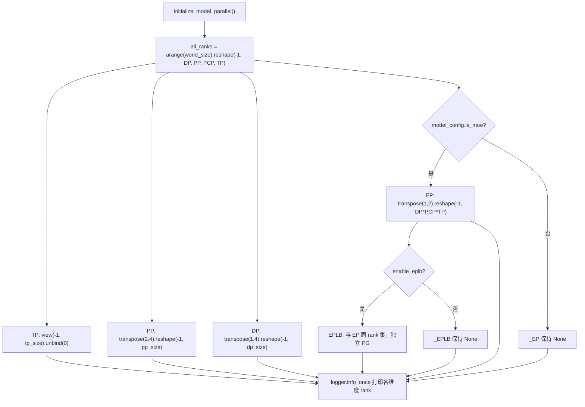
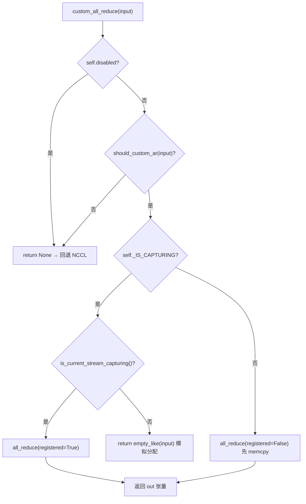

# Capítulo siguiente: Capítulo 8 →

Estado de verificación: líneas FACT ancladas a ubicaciones reales

# En el capítulo anterior recorrimos el último tramo del ciclo de vida de una inferencia única, desde el muestreo de logits hasta la salida en streaming. Pero cuando el modelo es demasiado grande para caber en una sola tarjeta, este pipeline debe dividirse entre múltiples dispositivos para ejecutarse de forma coordinada. La cuestión primordial de la inferencia distribuida no es "cómo particionar el modelo", sino "una vez particionado, quién habla con quién y de qué manera". vLLM delega estas dos cuestiones respectivamente a la topología de grupos de procesos de parallel_state.py y a la implementación del comunicador de custom_all_reduce.py. Este capítulo sigue la cadena "crear grupos → particionar → comunicar → reequilibrar carga" para desglosar capa por capa las estrategias de paralelismo de TP, PP y EP y las primitivas de comunicación subyacentes.

## 8.1 Topología de grupos de procesos: cómo se divide una malla de ranks en TP/PP/DP/EP

Modelo intuitivo`new_group`, aparecerá un desajuste de comunicación del tipo "creía que estabas en el grupo TP, pero en realidad estás en el grupo DP" — una vez que falta un rank en la comunicación colectiva, NCCL se colgará directamente en lugar de reportar un error.

## Estructura de datos y diseño de memoria

`GroupCoordinator`es el portador de todo esto. El diseño de sus campos corresponde directamente a la "múltiple identidad de un proceso en múltiples dimensiones paralelas":

- `rank`es el rank global,`ranks`es la lista de ranks globales de los miembros del grupo,`world_size`es el tamaño del grupo[FACT:vllm/distributed/parallel_state.py:434-436]。
- `local_rank`se usa para vincular el dispositivo,`rank_in_group`es el índice dentro del grupo — el código fuente usa una tabla para distinguir con precisión ambos: en un grupo de 4 GPUs que abarca dos nodos, el rank 2 tiene`local_rank`es 0 (es la primera GPU en el nodo 1), pero`rank_in_group`es 2[FACT:vllm/distributed/parallel_state.py:437-445]。
- `cpu_group`y`device_group`existen en pares: el primero usa gloo para comunicación de metadatos/objetos, el segundo usa NCCL para comunicación de tensores[FACT:vllm/distributed/parallel_state.py:446-447]。

Aquí hay un diseño clave:**¿Por qué cada grupo debe mantener un grupo de CPU?**Porque`broadcast_object`、`send_object`este tipo de operaciones transmiten objetos de Python (bytes serializados), usar NCCL desperdicia memoria de GPU y puede contaminar el dispositivo CUDA actual.`barrier()`Los comentarios de lo dicen de forma muy directa: el barrier de NCCL internamente es un broadcast, que crea tensores de GPU a escondidas, fácilmente desordena el dispositivo actual, por lo que es obligatorio usar el grupo de CPU[FACT:vllm/distributed/parallel_state.py:1355-1362]。

## Step-by-Step：`initialize_model_parallel`Cómo dividir la malla

Tomemos un escenario concreto: 8 GPUs, TP=2, PP=4, DP=1. Lo esencial es reestructurar la secuencia unidimensional de ranks en una malla multidimensional, y luego dividir a lo largo de cada dimensión.

Primer paso, construir la malla de ranks. El orden de diseño se define explícitamente como`ExternalDP x DP x PP x PCP x TP` [FACT:vllm/distributed/parallel_state.py:2045-2060]：

```python
all_ranks = torch.arange(world_size).reshape(
    -1, data_parallel_size, pipeline_model_parallel_size,
    prefill_context_model_parallel_size, tensor_model_parallel_size,
)
```

Segundo paso, dividir el grupo TP: ver la malla como`(-1, tp_size)`luego unbind, obteniendo`[g0,g1],[g2,g3],...` [FACT:vllm/distributed/parallel_state.py:2065-2077]. Nota que el grupo TP pasa adicionalmente`use_message_queue_broadcaster=True`, porque el grupo TP necesita compartir memoria broadcast para distribuir metadatos.

Tercer paso, dividir el grupo PP:`all_ranks.transpose(2, 4)`mover la dimensión PP a la última dimensión y luego dividir, obteniendo`[g0,g2,g4,g6],[g1,g3,g5,g7]` [FACT:vllm/distributed/parallel_state.py:2175-2188]. Este es exactamente el ejemplo dado en el docstring[FACT:vllm/distributed/parallel_state.py:1997-1997]。

Cuarto paso, dividir el grupo DP:`transpose(1, 4)`luego dividir[FACT:vllm/distributed/parallel_state.py:2195-2202]。

Quinto paso, dividir el grupo EP — aquí hay un detalle fácil de pasar por alto: el grupo EP solo se crea bajo modelos MoE, los modelos dense lo omiten directamente[FACT:vllm/distributed/parallel_state.py:2210-2241]. El conjunto de ranks del grupo EP es`DP x PCP x TP`el producto de , lo que significa que EP reutiliza las GPUs físicas de DP y TP, en lugar de ser una dimensión independiente.



## Reflexiones de diseño y trampas

**¿Por qué EPLB necesita un grupo de procesos independiente?**Los comentarios dan la respuesta: aislar la comunicación de EPLB de la comunicación colectiva del forward de MoE, para prevenir que "el torch.distributed en tiempo de ejecución" y "el torch.distributed de EPLB" se bloqueen mutuamente[FACT:vllm/distributed/parallel_state.py:2243-2246]. Esta es una compensación típica de "intercambiar un dominio de comunicación independiente por determinismo" — el costo de memoria de un PG adicional, a cambio de no bloquear el forward durante la transferencia de pesos.

**Restricción de sincronización del grupo DP**es la trampa más común en entornos de producción: todos los ranks dentro del mismo grupo DP deben llamar simultáneamente a`generate`, de lo contrario hay deadlock[FACT:vllm/distributed/parallel_state.py:2048-2051]. Porque dentro del grupo DP se hace all-reduce de gradientes/resultados de muestreo, cualquier rank ausente bloqueará permanentemente la comunicación colectiva.

**Orden de destrucción**también tiene sus matices.`destroy()`Primero destruir el device communicator, luego destruir device_group y cpu_group[FACT:vllm/distributed/parallel_state.py:1380-1393]. Los comentarios explican la razón: el device communicator puede mantener áreas de trabajo de comunicación colectiva que dependen de estos PG (como el barrier IPC PCIe de FlashInfer), deben liberarse primero[FACT:vllm/distributed/parallel_state.py:1377-1377]。

# 8.2 Primitivas de comunicación: cómo el all-reduce personalizado evita NCCL

## Modelo intuitivo

El all-reduce de NCCL es un "camión de carga general", puede llevar cualquier carga, ir por cualquier camino, pero el costo de arranque y el costo de protocolo son fijos. Cuando necesitas hacer repetidamente all-reduce de tensores pequeños en una máquina de 8 GPUs totalmente interconectadas por NVLink (cada capa de attention/MLP de TP lo necesita), el "peaje" del camión de carga general se vuelve innegable. El all-reduce personalizado es un "carrito especializado": solo se habilita en escenarios intra-nodo, con NVLink totalmente interconectado y tamaño de tensor adecuado, usando una vez`cudaMemcpy`para reemplazar el handshake y el costo de protocolo de NCCL.

## Estructura de datos y diseño de memoria

`CustomAllreduce`La inicialización de es una combinación de "sondeo de capacidades + preasignación de recursos". Campos clave:

- `_SUPPORTED_WORLD_SIZES = [2, 4, 6, 8, 16]`: solo soporta estos tamaños de grupo[FACT:vllm/distributed/device_communicators/custom_all_reduce.py:113-129]。
- `meta_ptrs`: metadatos de sincronización + búfer de resultados intermedios, tamaño`ops.meta_size() + max_size` [FACT:vllm/distributed/device_communicators/custom_all_reduce.py:291-294]。
- `buffer_ptrs`: búfer IPC pre-registrado, en modo eager el tensor de entrada se copia primero y luego se calcula[FACT:vllm/distributed/device_communicators/custom_all_reduce.py:298-305]。
- `rank_data`: tensor uint8 de 8MB, almacena las tuplas de punteros de búfer IPC de todos los ranks[FACT:vllm/distributed/device_communicators/custom_all_reduce.py:309-315]。

**¿Por qué pre-registrar los búferes?**Porque la captura de CUDA Graph requiere que todas las direcciones estén fijas en el momento de la captura.`register_graph_buffers`Al final de la captura, difunde todas las direcciones de búfer utilizadas a todos los ranks y las registra[FACT:vllm/distributed/device_communicators/custom_all_reduce.py:474-491]。

## Paso a paso: el flujo de decisión de un all-reduce

Escenario: la salida de una capa MLP dentro del grupo TP necesita all-reduce, la entrada es un tensor bf16 de 4MB.

Primer paso,`custom_all_reduce`verificar si está deshabilitado, si cumple`should_custom_ar` [FACT:vllm/distributed/device_communicators/custom_all_reduce.py:529-533]。

Segundo paso,`should_custom_ar`Filtrado elemento por elemento: se rechaza si world_size > 8; dtype debe ser fp32/fp16/bf16; el número de bytes debe ser múltiplo de 16; debe ser débilmente contiguo; solo se continúa si world_size==2 o si hay interconexión total[FACT:vllm/distributed/device_communicators/custom_all_reduce.py:493-508]。

Tercer paso, derivar según si se está en captura de CUDA Graph: durante la captura se usa`registered=True`(dirección ya fijada), de lo contrario`registered=False`(es necesario hacer memcpy primero a un búfer pre-registrado)[FACT:vllm/distributed/device_communicators/custom_all_reduce.py:529-545]。

Cuarto paso, llamar realmente a`ops.all_reduce`, pasando`buffer_ptrs[rank]`y`max_size` [FACT:vllm/distributed/device_communicators/custom_all_reduce.py:519-527]。



## Reflexiones de diseño y trampas encontradas

**La ruta de degradación en escenarios multi-nodo**es la parte más ingeniosa de este código.`same_node`Cuando es falso,`mnnvl_only`se pone a verdadero[FACT:vllm/distributed/device_communicators/custom_all_reduce.py:198-199], luego se verifica la capacidad MNNVL (Multi-Node NVLink). Si no todas las tarjetas del grupo soportan MNNVL, se deshabilita directamente la comunicación colectiva personalizada[FACT:vllm/distributed/device_communicators/custom_all_reduce.py:228-233]。`_group_can_attempt_mnnvl`Se usa un all-reduce de CPU (operación MIN) para asegurar que todos los ranks sigan el mismo flujo de control[FACT:vllm/distributed/device_communicators/custom_all_reduce.py:59-73]—esta es la protección clave en clústeres heterogéneos para evitar que "algunos ranks entren en la ruta MNNVL y otros vayan por NCCL" y provoquen un cuelgue.

**El coste de la comprobación P2P**：`_can_p2p`recorre todos los peers haciendo`gpu_p2p_access_check`, el comentario dice que el primer cálculo es caro pero se cachea[FACT:vllm/distributed/device_communicators/custom_all_reduce.py:278-278]. En producción, si se detecta un arranque lento, se puede configurar`VLLM_SKIP_P2P_CHECK`para omitirlo y confiar directamente en el informe P2P del driver[FACT:vllm/distributed/device_communicators/custom_all_reduce.py:86-100]。

**Selección de backend en tres niveles para reduce-scatter**merece una mirada aparte:`_select_reduce_scatter_backend`devuelve por prioridad`mnnvl_multimem` > `mnnvl_lamport` > `legacy` [FACT:vllm/distributed/device_communicators/custom_all_reduce.py:601-636]. La ruta multimem requiere que world_size esté en`(2,4,8)`y que la capacidad del dispositivo sea (10,0) o (10,3) (nivel Blackwell)[FACT:vllm/distributed/device_communicators/custom_all_reduce.py:103-104]. Nótese que`VLLM_BATCH_INVARIANT`deshabilita la ruta multimem[FACT:vllm/distributed/device_communicators/custom_all_reduce.py:628]—porque el orden de reducción de multimem es no determinista y rompería la invariancia de lote.

# 8.3 EPLB: lógica de planificación del reequilibrio de carga de expertos

## Modelo intuitivo

En un modelo MoE, 256 expertos lógicos se reparten entre 32 tarjetas, 8 por tarjeta. Pero bajo tráfico real, algunos "expertos populares" (por ejemplo, los que procesan estructuras gramaticales comunes) reciben una gran cantidad de tokens enrutados, lo que convierte a la tarjeta que los aloja en cuello de botella mientras las demás quedan ociosas. EPLB (Expert Parallel Load Balancer) consiste precisamente en "añadir réplicas a los expertos populares": copiar los pesos de los expertos populares a tarjetas ociosas para que los tokens se distribuyan hacia allí. Sin él, el throughput real de MoE quedaría limitado por la tarjeta más lenta.

## Estructuras de datos y disposición de memoria

`EplbModelState`utiliza tres tablas de mapeo para describir la relación "experto lógico ↔ experto físico":

- `physical_to_logical_map`: forma`(num_moe_layers, num_physical_experts)`, cada ranura física almacena el id del experto lógico que aloja[FACT:vllm/distributed/eplb/eplb_state.py:105-120]。
- `logical_to_physical_map`: forma`(num_moe_layers, num_logical_experts, max_replicas+1)`, matriz dispersa, -1 indica que no hay mapeo[FACT:vllm/distributed/eplb/eplb_state.py:123-146]。
- `logical_replica_count`: cuántas réplicas tiene cada experto lógico[FACT:vllm/distributed/eplb/eplb_state.py:147-161]。

`expert_load_window`es una ventana deslizante, forma`(window_size, num_moe_layers, num_physical_experts)` [FACT:vllm/distributed/eplb/eplb_state.py:180-187]. El comentario señala especialmente que ahora se registra la carga de todos los expertos físicos y no solo la de los expertos locales, para garantizar que las estadísticas sean consistentes entre distintos métodos de dispatch (naive all-to-all, DeepEP); bajo naive all-to-all, cada rank de DP aporta el mismo conjunto de tokens, por lo que la carga se multiplica por dp_size[FACT:vllm/distributed/eplb/eplb_state.py:180-187]。

## Paso a paso: la cadena completa de una reorganización

Escenario de ejemplo:`expert_rearrangement_step`alcanza el umbral, se dispara`rearrange()`。

Primer paso, mapear la carga física de vuelta a los expertos lógicos. Se usa`scatter_add_`para agregar según`physical_to_logical_map`, las ranuras inválidas (<0) se rellenan en el bucket`invalid_idx`y finalmente se descartan[FACT:vllm/distributed/eplb/eplb_state.py:794-816]。

Segundo paso, all-reduce entre ranks para obtener la carga lógica global.`_allreduce_list`se concatenan las cargas de varios modelos, se hace un solo all-reduce y luego se separan, evitando múltiples comunicaciones[FACT:vllm/distributed/eplb/eplb_state.py:1045-1068]。

Tercer paso, llamar a la estrategia para calcular el nuevo mapeo.`policy.rebalance_experts`se ejecuta en el host, así que tanto la ventana de carga como el mapeo actual deben copiarse de vuelta a la CPU[FACT:vllm/distributed/eplb/eplb_state.py:859-867]。

Cuarto paso, juicio de "omitir reorganización" específico de ROCm: si la mejora en el desequilibrio de carga entre ranks que aporta el nuevo mapeo es inferior al 5%, se omite esta reorganización[FACT:vllm/distributed/eplb/eplb_state.py:869-923]. Es una optimización pragmática: la reorganización en sí tiene coste de comunicación, y si el beneficio no es suficiente, no se hace.

Quinto paso, ejecutar el traslado de pesos y confirmar el nuevo mapeo[FACT:vllm/distributed/eplb/eplb_state.py:925-942]。

```mermaid
sequenceDiagram
    participant Main as 主线程 step()
    participant Policy as DefaultEplbPolicy
    participant Comm as EplbCommunicator
    participant Async as async_worker 线程
    Main->>Main: expert_rearrangement_step >= interval
    Main->>Main: scatter_add_ 物理负载→逻辑负载
    Main->>Main: _allreduce_list 跨 rank 聚合
    Main->>Policy: rebalance_experts(load, replicas, groups, nodes, gpus, map)
    Policy-->>Main: new_physical_to_logical_map
    alt 同步模式
        Main->>Comm: rearrange_expert_weights_inplace()
        Comm-->>Main: 权重搬运完成
        Main->>Main: _commit_eplb_maps()
    else 异步模式
        Main->>Main: eplb_stats = EplbStats(...); rebalanced = True
        Main->>Async: rearrange_event.record()
        Async->>Comm: 后台搬运权重到 expert_buffer
        Async-->>Main: pending_result 就绪
        Main->>Main: _move_to_workspace() 提交
    end
```

## Reflexiones de diseño y trampas encontradas

**La primitiva de sincronización en modo asíncrono**es el punto más delicado de este código.`rebalanced`El flag depende del GIL para sincronizarse entre el hilo principal y el worker async[FACT:vllm/distributed/eplb/eplb_state.py:194-203]. Pero el comentario advierte:`rebalanced`debe mantenerse consistente en todos los ranks, de lo contrario el all-reduce dentro de`_all_ranks_result_ready`se colgará[FACT:vllm/distributed/eplb/eplb_state.py:664-665]。`_all_ranks_result_ready`Se prioriza usar el grupo de CPU para el all-reduce, porque el grupo de CPU es más fiable[FACT:vllm/distributed/eplb/eplb_state.py:1024-1043]。

**La optimización de "grabación anticipada" de la ventana deslizante**：`_should_record_current_step`solo activa la grabación cuando faltan como máximo`window_size`pasos para la siguiente reorganización[FACT:vllm/distributed/eplb/eplb_state.py:689-709]. El comentario explica: los datos de los`step_interval - window_size`pasos previos a cada ciclo de reorganización serán sobrescritos por la ventana deslizante, así que grabarlos es inútil y desperdicia cómputo de GPU[FACT:vllm/distributed/eplb/eplb_state.py:1196-1199]。`should_record_tensor`es el mismo tensor escalar compartido por todas las capas, una sola`fill_`actualiza todas las capas[FACT:vllm/distributed/eplb/eplb_state.py:272-278]。

**Reserva de capacidad para EP elástico**：`enable_elastic_ep`cuando,`physical_expert_capacity`se reserva según`elastic_ep_max_dp_size`, la tabla de mapeo rellena las ranuras sobrantes con -1[FACT:vllm/distributed/eplb/eplb_state.py:375-386]. Así, al escalar no hace falta reasignar memoria de vídeo, solo rellenar las ranuras con -1 con expertos reales.`reconfigure_physical_expert_slots`se encarga de refrescar la vista al escalar hacia arriba/abajo[FACT:vllm/distributed/eplb/eplb_state.py:1135-1160]。

**`_commit_eplb_maps`El manejo de pin memory en**: cuando`PIN_MEMORY`está activado y el origen está en CPU, primero se copia a memoria pinned y luego`non_blocking=True`se copia asíncronamente a la GPU[FACT:vllm/distributed/eplb/eplb_state.py:1392-1400]. Esto evita que la copia H2D bloquee el hilo principal: la tabla de mapeo se actualiza en cada capa y en cada ronda, y una copia síncrona se convertiría en cuello de botella.

# Reflexiones de diseño

Tres bloques de código comparten una filosofía de diseño:**intercambiar detección de capacidades por degradación determinista**。`GroupCoordinator`en`world_size == 1`se hace bypass directamente de toda comunicación colectiva[FACT:vllm/distributed/parallel_state.py:736-738]；`CustomAllreduce`si alguna condición no se cumple, se devuelve`None`permitiendo que el llamador recurra a NCCL[FACT:vllm/distributed/device_communicators/custom_all_reduce.py:532-533]; EPLB omite la redistribución cuando la mejora es inferior al 5%[FACT:vllm/distributed/eplb/eplb_state.py:916]. Este patrón de "fallo rápido + degradación elegante" permite que el mismo código se ejecute en todo el espectro de hardware, desde una sola GPU hasta MNNVL multi-nodo, sin necesidad de escribir ramas para cada configuración.

Otra característica común es**la consistencia del flujo de control por encima del rendimiento**。`_group_can_attempt_mnnvl`se usa all-reduce de CPU para forzar que todos los ranks sigan la misma rama[FACT:vllm/distributed/device_communicators/custom_all_reduce.py:59-73]，`_all_ranks_result_ready`de manera similar[FACT:vllm/distributed/eplb/eplb_state.py:1024-1043]. En sistemas distribuidos, "algunos ranks toman la ruta rápida y otros la ruta lenta" es mucho más peligroso que "todos los ranks toman la ruta lenta": lo primero provoca un cuelgue, lo segundo solo es lento.

# Resumen del capítulo

- `GroupCoordinator`se remodela la secuencia unidimensional de ranks en una`ExternalDP x DP x PP x PCP x TP`cuadrícula, dividiendo a lo largo de cada dimensión los grupos de procesos TP/PP/DP/EP/EPLB; cada grupo mantiene simultáneamente dos PG: CPU (gloo) y device (NCCL).
- `CustomAllreduce`mediante detección de capacidades (misma máquina, NVLink totalmente interconectado, tamaño del tensor, dtype, alineación a 16 bytes) se decide si se asume el all-reduce, degradando a MNNVL o NCCL en escenarios multi-nodo.
- EPLB utiliza tres tablas de mapeo para describir la relación entre expertos lógicos/físicos, mediante ventanas deslizantes se estadística la carga, la estrategia calcula el nuevo mapeo, el comunicador transporta los pesos, y soporta modos síncrono y asíncrono.
- El principio de diseño común a los tres: detección de capacidades + degradación determinista + consistencia del flujo de control como prioridad.

# Reflexiones y autoevaluación del capítulo

Q1: `GroupCoordinator.destroy()`primero se destruye el device communicator y luego el process group[FACT:vllm/distributed/parallel_state.py:1380-1393]. Si se invierte el orden, destruyendo primero el PG y luego el communicator, ¿en qué escenario se produciría un crash?

**Análisis de referencia**: los comentarios indican explícitamente que el device communicator puede mantener áreas de trabajo de comunicación colectiva que dependen de estos PG, por ejemplo la barrera IPC PCIe de FlashInfer[FACT:vllm/distributed/parallel_state.py:1377-1377]. Si se destruye primero el PG, el`destroy()`interno del communicator, si aún necesita usar estos PG para una barrera o limpieza de comunicación, accedería a un ProcessGroup ya destruido, provocando use-after-free o un fallo de aserción interno de NCCL. El orden correcto es "el dependiente muere primero": el communicator depende del PG, por lo que el communicator se destruye primero.

Q2: `should_custom_ar`se requiere`inp_size % 16 == 0` [FACT:vllm/distributed/device_communicators/custom_all_reduce.py:493-508]. Si se elimina esta comprobación, ¿qué pasaría con un tensor bf16 de 15 bytes (por ejemplo, 7.5 elementos, lo cual es imposible en la práctica, pero supongamos 8 elementos = caso límite de 16 bytes)? ¿Por qué el kernel personalizado necesita esta alineación?

**Análisis de referencia**: el kernel personalizado de all-reduce utiliza internamente cargas vectorizadas (como load de 128 bits), lo que requiere que la dirección y el tamaño estén alineados a 16 bytes para poder usar`float4`instrucciones de carga ancha como esta. La falta de alineación provocaría que el kernel leyera fuera de límites o disparara una excepción de dirección desalineada. Más sutil aún,`buffer_ptrs`el búfer pre-registrado se asigna según`max_size`si el tamaño de entrada no es múltiplo de 16, tras copiarlo al búfer podría quedar datos residuales en la cola que se reducirían junto con el resto, produciendo errores silenciosos. Por lo tanto, esta comprobación es tanto una protección de corrección como un requisito previo de rendimiento.

Q3: En el modo asíncrono de EPLB,`rebalanced`el flag depende de la sincronización del GIL[FACT:vllm/distributed/eplb/eplb_state.py:194-203], y los comentarios advierten que todos los ranks deben mantenerse consistentes, de lo contrario el all-reduce se cuelga[FACT:vllm/distributed/eplb/eplb_state.py:664-665]. Supongamos que un rank, debido a fluctuaciones de red, el async worker pone`rebalanced`en False antes de tiempo, mientras que los demás ranks siguen en True,`_all_ranks_result_ready`¿qué ocurriría?

**Análisis de referencia**：`_all_ranks_result_ready`se hace all-reduce de suma sobre`has_result`y luego se comprueba si es igual al tamaño del grupo[FACT:vllm/distributed/eplb/eplb_state.py:1030-1032]. Si el`rebalanced`de un rank cambia a False antes de tiempo, su`pending_result`puede haber sido consumido,`has_result`es 0, lo que hace que el resultado de la suma sea menor que el tamaño del grupo, y los demás ranks esperarán indefinidamente. Peor aún, si ese rank ya ha salido del`while ms.rebalanced`bucle, no volverá a participar en los all-reduce posteriores, y los all-reduce de los demás ranks se bloquearán permanentemente: esto es lo que los comentarios llaman "hang at collective communication calls". La medida de protección es`_all_ranks_result_ready`usar el grupo de CPU en lugar del grupo de device, y`drain_async`vaciar explícitamente todos los pending result antes de la redistribución[FACT:vllm/distributed/eplb/eplb_state.py:985-1022]。

Hasta aquí, hemos aclarado los mecanismos de creación de grupos, partición y reequilibrio de carga para la comunicación entre tarjetas. Pero el desafío de comunicación en la inferencia distribuida no se limita al interior de una sola instancia: cuando prefill y decode se separan en instancias distintas, el KV Cache necesita transferirse entre nodos. En el próximo capítulo dejaremos la "comunicación entre tarjetas" para entrar en la "comunicación entre instancias": cómo se transfiere el KV Cache entre instancias de prefill y decode en un despliegue desagregado, y cómo la abstracción KV Connector unifica backends de transferencia como NIXL, Mooncake, etc.
