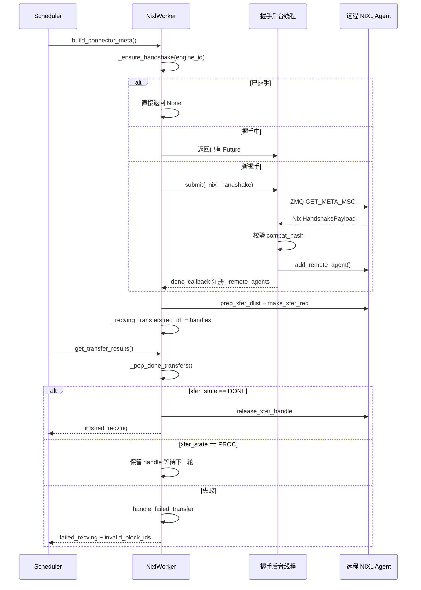

# Capítulo 9: Transferencia de KV Cache y despliegue desagregado (separación PD)

En el capítulo anterior fijamos la perspectiva dentro de una única instancia de inferencia: cómo se forman los grupos de procesos TP/PP/DP/EP, cómo se particionan los tensores entre tarjetas y cómo EPLB reequilibra expertos en la capa MoE. Pero todos estos mecanismos se basan en una misma premisa: prefill y decode se ejecutan en la misma instancia, y el KV Cache permanece en la memoria local de la GPU de principio a fin. El despliegue desagregado (Prefill-Decode Disaggregation, abreviado como separación PD) rompe esta premisa. Divide prefill y decode en dos instancias vLLM independientes: la instancia de prefill solo realiza el cálculo forward del prompt, produce el KV Cache y lo entrega a la instancia de decode; la instancia de decode toma este KV Cache y continúa la generación autorregresiva. La ventaja de esto es que los recursos pueden configurarse de forma independiente según las características de cada fase: prefill es intensivo en cómputo, adecuado para TP grande y batch grande; decode es intensivo en acceso a memoria, adecuado para batch pequeño y programación de baja latencia. Ambos dejan de obstaculizarse mutuamente. El costo es que el KV Cache debe transferirse entre instancias. Este es el protagonista de este capítulo: KV Connector. El comentario de cabecera del archivo vllm/distributed/kv_transfer/kv_connector/v1/base.py ya enumera las primitivas centrales de toda la abstracción: el lado del Scheduler se encarga de vincular metadatos, consultar aciertos de caché remota y decidir si liberar bloques de forma asíncrona; el lado del Worker se encarga de la carga y guardado real del KV. El objetivo de diseño de esta interfaz es desacoplar por completo la lógica de programación de la capa superior de los backends de transferencia subyacentes (NIXL, Mooncake, MoRIIO). Desde una perspectiva de ingeniería, el mayor riesgo de la separación PD no es la lentitud de la transferencia, sino la inconsistencia de estado: la instancia de prefill cree que el KV ya se envió, pero la instancia de decode no lo recibió; o la instancia de decode libera el bloque antes de tiempo mientras prefill todavía está escribiendo en él. Lo que este capítulo busca esclarecer es precisamente cómo este sistema de conectores utiliza protocolos de handshake, leases, heartbeats y mecanismos de recuperación ante fallos para cubrir estos casos límite.

# I. KVConnectorBase_V1: abstracción de doble rol y contrato de metadatos

## Modelo intuitivo

KV Connector es como un sistema de mensajería entre dos sucursales. La tienda de Prefill calcula el producto semiterminado (KV Cache), lo empaqueta y lo envía a la tienda de Decode para continuar el procesamiento. Pero un sistema de mensajería no puede tener solo la acción de "enviar": necesita una guía de envío (metadata) que indique qué se envía y a dónde; necesita un mecanismo de acuse de recibo que confirme que el destinatario lo recibió; y también necesita un conjunto de reglas de timeout para evitar que un paquete quede atascado en el camino ocupando espacio en el estante.

Sin esta abstracción, cada backend de transferencia (NIXL, Mooncake) tendría que implementar su propia lógica de programación, y el Scheduler de vLLM tendría que escribir código de adaptación para cada backend. El valor de KVConnectorBase_V1 es fijar este contrato.

## Doble rol: lado del Scheduler y lado del Worker

[FACT:vllm/distributed/kv_transfer/kv_connector/v1/base.py:137-142]Se definen los dos roles del conector:

```python
class KVConnectorRole(enum.Enum):
    # Connector running in the scheduler process
    SCHEDULER = 0
    # Connector running in the worker process
    WORKER = 1
```

Esta división no es arbitraria. El proceso del Scheduler se encarga de las decisiones globales de programación: qué solicitudes necesitan transferirse, cuándo se puede liberar un bloque; el proceso del Worker se encarga del traslado real de datos. Ambos se comunican mediante`KVConnectorMetadata`comunicación.

[FACT:vllm/distributed/kv_transfer/kv_connector/v1/base.py:153-158]Se define la clase base de metadatos en la dirección del Scheduler al Worker:

```python
class KVConnectorMetadata(ABC):  # noqa: B024
    """Abstract Metadata used to communicate
    Scheduler KVConnector -> Worker KVConnector.
    """
    pass
```

En la dirección inversa, del Worker al Scheduler,[FACT:vllm/distributed/kv_transfer/kv_connector/v1/base.py:161-176]se define`KVConnectorWorkerMetadata`, que requiere implementar el`aggregate`método, porque en un engine step puede haber múltiples workers devolviendo metadatos cada uno, y es necesario agregarlos antes de entregarlos al Scheduler.

## Estructura de datos central: KVConnectorTransferResults

[FACT:vllm/distributed/kv_transfer/kv_connector/v1/base.py:87-96]Se define la estructura de instantánea de los resultados de transferencia:

```python
@dataclass
class KVConnectorTransferResults:
    finished_sending: set[str] = field(default_factory=set)
    finished_recving: set[str] = field(default_factory=set)
    failed_recving: set[str] = field(default_factory=set)
```

Nótese el diseño clave en los comentarios:**Las recepciones fallidas también aparecerán en`finished_recving`dentro de**. Esto es para que el Scheduler pueda liberar la solicitud del estado de "esperando transferencia" — incluso si la transferencia falla, la solicitud no puede quedarse atascada para siempre. La información de fallo se transmite por separado mediante`failed_recving`, y el Scheduler decide en función de ello si reintentar o degradar.

## Hooks del ciclo de vida: de la solicitud a la liberación

Todo el ciclo de vida del conector gira en torno a varios hooks clave. Del lado del Scheduler:

- `get_num_new_matched_tokens` [FACT:vllm/distributed/kv_transfer/kv_connector/v1/base.py:485-518]: consulta cuántos tokens puede acertar la caché remota. El comentario enfatiza especialmente que "solo debe considerarse el prefijo máximo realmente disponible"; si algunos tokens no se pueden obtener por problemas de conexión o desalojo, no deben contarse.
- `update_state_after_alloc` [FACT:vllm/distributed/kv_transfer/kv_connector/v1/base.py:520-544]: actualiza el estado tras la asignación de bloques. En el comentario hay una trampa fácil de pisar — para determinar si se debe cargar hay que mirar`num_external_tokens`, y no si`blocks`está vacío, porque los subconectores no seleccionados de MultiConnector también reciben bloques reales.
- `request_finished` [FACT:vllm/distributed/kv_transfer/kv_connector/v1/base.py:579-598]: se llama cuando la solicitud se completa, devuelve`True`para indicar que el conector asume la responsabilidad de la liberación asíncrona del bloque.

Del lado del Worker:

- `start_load_kv` / `wait_for_layer_load`: carga capa por capa, soporta pipeline.
- `save_kv_layer` / `wait_for_save`: guarda capa por capa.
- `get_transfer_results` [FACT:vllm/distributed/kv_transfer/kv_connector/v1/base.py:396-397]: devuelve el estado de finalización de la transferencia asíncrona.

[FACT:vllm/distributed/kv_transfer/kv_connector/v1/base.py:192-201]También hay un diseño fácil de pasar por alto pero crucial —`requires_kv_delivery`atributo:

```python
@property
def requires_kv_delivery(self) -> bool:
    """Whether this connector hands off KV that must be reliably delivered.
    ...
    """
    return self._kv_transfer_config.is_kv_producer
```

El comentario explica la motivación: si una solicitud es expropiada antes de que se complete el traspaso de KV, debe recalcularse en lugar de dejarla completarse y traspasar bloques que ya fueron liberados por la expropiación. Solo el rol de producer necesita entrega confiable; si la caché best-effort se pierde, solo será un cache miss futuro.

## Metadatos de handshake

[FACT:vllm/distributed/kv_transfer/kv_connector/v1/base.py:145-150]define la clase base de los metadatos de handshake:

```python
class KVConnectorHandshakeMetadata(ABC):  # noqa: B024
    """Metadata used for out of band connector handshake between
    P/D workers. This needs to serializable.
    """
    pass
```

"out of band" significa que el handshake no sigue la ruta normal de la solicitud, sino que se comunica directamente entre los workers P/D. Esto prepara el terreno para el protocolo de handshake ZMQ de NIXL.

---

# II. Conector NIXL: handshake, registro y construcción de descriptores

## Modelo intuitivo

NIXL (NVIDIA Inference Xfer Library) es la biblioteca de transporte de bajo nivel proporcionada por NVIDIA, que soporta múltiples backends como UCX, GDS, etc. El rol de NixlBaseConnectorWorker es como el centro de clasificación de una empresa de mensajería — primero necesita establecer una línea dedicada con el centro de clasificación de la otra parte (handshake), registrar la disposición de sus estanterías (registrar las regiones de memoria de KV Cache), y solo entonces puede recoger y enviar mercancías eficientemente por dirección.

Sin este mecanismo, cada transferencia tendría que renegociar direcciones y restablecer conexiones, y la latencia sería inaceptablemente alta.

## Diseño de memoria: Region y Descriptor

Los conceptos centrales de NIXL son**region**(región de memoria) y**descriptor**(descriptor). Cada capa de KV Cache se registra en NIXL como una o más regions, y cada region tiene dirección base, longitud de bloque y stride de bloque.

[FACT:vllm/distributed/kv_transfer/kv_connector/v1/nixl/base_worker.py:740-751]enumera los campos centrales relacionados con region:

```python
# Number of NIXL regions. Currently one region per cache
# (so 1 per layer for MLA, otherwise 2 per layer)
self.num_regions = 0
self.region_mem_types: list[str] = []
self.region_group_ids: list[int] = []
self._uses_region_group_mapping = False
self.region_names: list[str] = []
self.region_num_blocks: list[int] = []
self._mixed_mem_types = False
```

[FACT:vllm/distributed/kv_transfer/kv_connector/v1/nixl/base_worker.py:897-900]explica además el origen del stride de bloque:

```python
# Per-region block stride in bytes. Taken from the registered tensor's
# stride(0) so it stays correct under layouts that interleave layers
# within a block (BLHNC/BHLNC), where stride > block_len.
self.block_stride_per_layer = list[int]()
```

La idea clave aquí es:**block_stride no es igual a block_len**. En diseños con intercalado entre capas como BLHNC/BHLNC, el span real de un bloque puede ser mayor que la longitud de sus datos válidos. Si se usa directamente block_len como stride, se leerán direcciones incorrectas.

## Protocolo de handshake: ZMQ + hash de compatibilidad

El handshake es la parte más compleja del conector NIXL.[FACT:vllm/distributed/kv_transfer/kv_connector/v1/nixl/base_worker.py:974-1128]El método`_nixl_handshake`de

muestra este proceso por completo.[FACT:vllm/distributed/kv_transfer/kv_connector/v1/nixl/base_worker.py:988-998]El primer paso es establecer el contexto del dispositivo CUDA.

```python
# the first time we connect to a remote agent.
# be careful, the handshake happens in a background thread.
# it does not have an active cuda context until any cuda runtime
# call is made. when UCX fails to find a valid cuda context, it will
# disable any cuda ipc communication, essentially disabling any NVLink
# communication.
if not self.use_host_buffer:
    current_platform.set_device(self.device_id)
```

explica la razón:

Copiar[FACT:vllm/distributed/kv_transfer/kv_connector/v1/nixl/base_worker.py:1029-1036]：

```python
msg = msgspec.msgpack.encode(
    (GET_META_MSG, remote_pp_rank, remote_rank)
)
# Set receive timeout to 5 seconds to avoid hanging on dead server
sock.setsockopt(zmq.RCVTIMEO, 5000)  # milliseconds
start_time = time.perf_counter()
sock.send(msg)
reply_parts = sock.recv_multipart()
```

El segundo paso es enviar la consulta de metadatos mediante ZMQ.[FACT:vllm/distributed/kv_transfer/kv_connector/v1/nixl/base_worker.py:1042-1045]Copiar

El timeout de 5 segundos es para evitar esperar indefinidamente si el par muere. Al mismo tiempo, el código usa RTT para estimar el desfase de reloj[FACT:vllm/distributed/kv_transfer/kv_connector/v1/nixl/base_worker.py:1063-1080]：

```python
assert self.compat_hash is not None
if (
    self.enforce_compat_hash
    and handshake_payload.compatibility_hash != self.compat_hash
):
    raise RuntimeError(
        f"NIXL compatibility hash mismatch. "
        ...
    )
```

El tercer paso es la verificación de compatibilidad.[FACT:vllm/distributed/kv_transfer/kv_connector/v1/nixl/base_worker.py:1372-1376]Copiar

```python
self.compat_hash = compute_nixl_compatibility_hash(
    self.vllm_config,
    self.backend_name,
    transfer_mode=self._TRANSFER_MODE,
)
```

:`transfer_mode`Copiar[FACT:vllm/distributed/kv_transfer/kv_connector/v1/nixl/base_worker.py:163-166]Nótese que

## también participa en el hash —

el comentario de[FACT:vllm/distributed/kv_transfer/kv_connector/v1/nixl/base_worker.py:824-835]：

```python
self._handshake_initiation_executor = ThreadPoolExecutor(
    # NIXL is not guaranteed to be thread-safe, limit 1 worker.
    max_workers=1,
    thread_name_prefix="vllm-nixl-handshake-initiator",
)
self._ready_requests = queue.Queue[tuple[ReqId, ReqMeta]]()
self._handshake_futures: dict[
    EngineId, Future[tuple[dict[tuple[int, int], str], float]]
] = {}
# Protects _handshake_futures and _remote_agents.
self._handshake_lock = threading.RLock()
```

`max_workers=1`Programación asíncrona del handshake`_handshake_lock`El handshake es asíncrono y se ejecuta mediante un pool de hilos.`_handshake_futures`Copiar`_remote_agents`es porque NIXL no garantiza la seguridad de hilos.

`_ensure_handshake` [FACT:vllm/distributed/kv_transfer/kv_connector/v1/nixl/base_worker.py:1257-1317]protege los dos diccionarios

## y

.[FACT:vllm/distributed/kv_transfer/kv_connector/v1/nixl/base_worker.py:172-310]implementa el inicio idempotente del handshake: si ya se completó con éxito, devuelve None directamente; si está en proceso de handshake, devuelve el Future existente; de lo contrario, envía una nueva tarea y registra el callback.`_compute_desc_ids`Construcción de descriptores: de block ID a descriptor NIXL

Una vez completado el handshake, se deben construir descriptores para cada solicitud.[FACT:vllm/distributed/kv_transfer/kv_connector/v1/nixl/base_worker.py:226-262]El

```python
# NOTE (NickLucche) With HMA, every kv group has the same number of layers
# and layers from different groups share the same kv tensor.
# eg block_ids=[[1, 2], [3]]->blocks [1, 2] need to be
# read across all regions, same for [3], but group0-group1 blocks will
# always differ (different areas). Therefore we can just flatten the
# block_ids and compute the descs ids for all groups at once.
```

es el núcleo.[FACT:vllm/distributed/kv_transfer/kv_connector/v1/nixl/base_worker.py:285-304]：

```python
elif _is_ssm_spec(spec_type):
    # NOTE (NickLucche) SSM and Attention block regions can
    # be exchanged arbitrarily by manager.  Therefore, descs
    # are laid out as:
    #   [descs_fa (all regions) | descs_ssm (all regions)].
    # num_fa_descs offset must be computed per-engine since
    # P and D can have different num_blocks (and thus
    # different FA desc counts).
```

## . El comentario explica el manejo en escenarios HMA:

Copiar[FACT:vllm/distributed/kv_transfer/kv_connector/v1/nixl/base_worker.py:2130-2178]Para modelos SSM híbridos, el diseño de descriptores es más complejo`add_remote_agent`Copiar

Cuando D.world_size > P.world_size, múltiples workers D leen diferentes fragmentos de KV head desde el mismo worker P. La documentación proporciona un ejemplo concreto: D TP=4, P TP=2, tp_ratio=2. D-Worker0 lee la primera mitad de los KV head de P-Worker0, D-Worker1 lee la segunda mitad.

Para modelos MLA, el KV Cache se replica entre los workers TP, por lo que rank_offset siempre es 0.

## Lease y heartbeat: evitar la liberación prematura de bloques

Este es uno de los diseños más ingeniosos del conector NIXL. Después de que la instancia Prefill envía el KV, no puede liberar el bloque inmediatamente, porque la instancia decode podría seguir leyendo. Pero si nunca se libera, la memoria de video se filtrará.

La solución es el lease.[FACT:vllm/distributed/kv_transfer/kv_connector/v1/nixl/base_worker.py:528-528]：

```python
kv_lease_duration: int = vllm_config.kv_transfer_config.get_from_extra_config(
    "kv_lease_duration", 30
)
# NOTE (NickLucche): For now we use a hardcoded value for a simpler interface.
self._lease_extension = kv_lease_duration * 2 // 3
```

El lease predeterminado es de 30 segundos, y cada heartbeat lo extiende 20 segundos (2/3).

El manejo del heartbeat está en[FACT:vllm/distributed/kv_transfer/kv_connector/v1/nixl/base_worker.py:3014-3034]：

```python
def _handle_heartbeat(self, payload: str) -> None:
    new_expiry = time.perf_counter() + self._lease_extension
    for req_id in payload.split(","):
        if req_id in self._reqs_to_send:
            old = self._reqs_to_send[req_id]
            self._reqs_to_send[req_id] = max(old, new_expiry)
```

Nota`max(old, new_expiry)`——el heartbeat solo puede extender el lease, no acortarlo.

La recuperación después de que expire el lease está en[FACT:vllm/distributed/kv_transfer/kv_connector/v1/nixl/base_worker.py:2986-3012]：

```python
def _reap_expired_send_leases(self, done_sending: set[str]) -> None:
    """Reclaim expired send-side KV leases into ``done_sending``.

    ``_reqs_to_send`` is not ordered by expiry: heartbeats update the
    deadline in place, and mixed TTLs share the map, so a live head
    entry can sit in front of already-expired ones. Scan every entry
    rather than stopping at the first still-live request.
    """
```

El comentario señala un error fácil de cometer: no se puede detener el escaneo solo porque se encontró la primera solicitud no expirada, porque el heartbeat actualiza el tiempo de expiración in situ, lo que hace que el map no esté ordenado por tiempo de expiración.

## Máquina de estados de transferencia y recuperación de fallos

El ciclo de vida de la transferencia se gestiona mediante`_pop_done_transfers` [FACT:vllm/distributed/kv_transfer/kv_connector/v1/nixl/base_worker.py:3036-3086]:

```python
for handle in handles:
    try:
        xfer_state = self.nixl_wrapper.check_xfer_state(handle)
        if xfer_state == "DONE":
            res = self.nixl_wrapper.get_xfer_telemetry(handle)
            self.xfer_stats.record_transfer(res)
            self.nixl_wrapper.release_xfer_handle(handle)
        elif xfer_state == "PROC":
            in_progress.append(handle)
        else:
            self._log_failure(
                failure_type="transfer_failed",
                req_id=req_id,
                xfer_state=xfer_state,
            )
```

La transferencia NIXL tiene tres estados:`DONE`(completado),`PROC`(en progreso), otros (fallo).

El manejo de fallos está en[FACT:vllm/distributed/kv_transfer/kv_connector/v1/nixl/base_worker.py:3103-3127]：

```python
def _handle_failed_transfer(
    self,
    req_id: str,
    handle: int | None,
    failed_req_ids: set[str] | None = None,
    record_failed_transfer: bool = True,
) -> bool:
    if record_failed_transfer:
        self.xfer_stats.record_failed_transfer()
    if failed_req_ids is not None:
        failed_req_ids.add(req_id)
    return handle is None or self._try_release_xfer_handle(req_id, handle)
```

`_try_release_xfer_handle` [FACT:vllm/distributed/kv_transfer/kv_connector/v1/nixl/base_worker.py:3088-3101]El comentario de es crucial:

```python
except Exception as e:
    # A status error does not guarantee that the backend stopped DMA.
    self._log_failure(
        failure_type="transfer_release_failed",
        msg="Retaining handle and blocks until release succeeds",
        ...
    )
    return False
```

**Un estado de error no garantiza que el backend haya detenido el DMA**. Si la liberación falla, se deben conservar el handle y el bloque hasta que la liberación tenga éxito. Este es un diseño típico de "prefiero filtrar que usar incorrectamente".

## Manejo de bloques de solicitudes fallidas

Cuando la recepción falla,[FACT:vllm/distributed/kv_transfer/kv_connector/v1/nixl/base_worker.py:2876-2891]muestra la lógica de manejo:

```python
for req_id in done_recving:
    meta = self._recving_metadata.pop(req_id, None)
    assert meta is not None, f"{req_id} not found in recving_metadata list"

    # Skip KV sync and post-processing for failed requests
    if req_id in failed_recv_reqs:
        self._pending_recv_notifs.pop(req_id, None)
        # TODO (NickLucche) handle failed transfer for HMA.
        if not self._is_hma_required:
            self._invalid_block_ids.put(set(meta.local_block_ids[0]))
        logger.warning(
            "Skipping KV post-processing for failed request %s",
            req_id,
        )
        continue
```

El ID del bloque fallido se coloca en la cola`_invalid_block_ids`, y el Scheduler lo extrae mediante`get_block_ids_with_load_errors` [FACT:vllm/distributed/kv_transfer/kv_connector/v1/nixl/base_worker.py:3491-3504]para decidir si reintentar.

## Expulsión por TTL de motores remotos

Las instancias de larga duración encontrarán continuamente nuevos motores remotos; si no se limpian, la memoria crecerá indefinidamente.[FACT:vllm/distributed/kv_transfer/kv_connector/v1/nixl/base_worker.py:3506-3532]El de`_evict_stale_engines`implementa la expulsión por TTL:

```python
def _evict_stale_engines(self) -> None:
    """Scan for and evict remote engines that have exceeded their TTL.

    Called from the main thread in when a new remote engine appears.
    We can only go OOM as we discover and register a new remote, therefore we make
    sure we clean up stale engine data structures before then.
    """
    if self._engine_ttl  self._engine_ttl and eid not in busy:
            self._cleanup_remote_engine(eid)
```

La restricción clave es el conjunto`busy`——los motores con transferencias en progreso no pueden ser expulsados.[FACT:vllm/distributed/kv_transfer/kv_connector/v1/nixl/base_worker.py:3534-3546]El comentario de explica la razón:

```python
"""Remote engines a transfer is still reading from.

The timestamp is stamped when a read is issued and not refreshed while
it runs, so a transfer that outlives the TTL leaves its engine looking
idle. A peer that has lost its NIC holds one indefinitely.
"""
```

Si la tarjeta de red del par se avería, la transferencia podría quedar colgada para siempre, la marca de tiempo no se actualizaría y el motor parecería estar inactivo.`busy`El conjunto protege explícitamente esta situación.

## Secuencia temporal del handshake y la transferencia

El siguiente diagrama de secuencia muestra la interacción central desde la solicitud hasta la finalización de la transferencia:



---

# III. Reflexiones de diseño: por qué se diseñó así

## ¿Por qué el handshake debe ser asíncrono?

El handshake implica un viaje de ida y vuelta por la red, que puede tardar decenas de milisegundos. Si se ejecuta de forma síncrona, bloquearía el bucle principal del Scheduler, afectando la programación de todas las solicitudes. El handshake asíncrono permite que el Scheduler procese primero otras solicitudes y notifique mediante callback cuando el handshake se complete.

Pero la asincronía también trae complejidad:`_handshake_futures`el diccionario necesita protección con lock, en el callback hay que manejar tanto el éxito como el fallo, y además hay que evitar handshakes duplicados.

## ¿Por qué usar lease en lugar de conteo de referencias?

El conteo de referencias requiere que la instancia decode notifique explícitamente a prefill "ya terminé de leer". Pero si la instancia decode se cae, la notificación nunca llegará y el bloque de prefill se filtrará para siempre.

El lease es una solución más robusta: incluso si decode se cae, prefill recupera automáticamente el bloque cuando el lease expira. El mecanismo de heartbeat garantiza la renovación del lease en condiciones normales.

## ¿Por qué conservar el handle en caso de fallo?

[FACT:vllm/distributed/kv_transfer/kv_connector/v1/nixl/base_worker.py:3088-3101]El comentario de lo dice claramente: un estado de error no garantiza que el DMA se haya detenido. Si en ese momento se libera el handle, el DMA podría seguir escribiendo datos en memoria ya liberada, causando corrupción de datos o un crash. Prefiero filtrar temporalmente que asumir ese riesgo.

## ¿Por qué la expulsión por TTL debe verificar busy?

[FACT:vllm/distributed/kv_transfer/kv_connector/v1/nixl/base_worker.py:3534-3546]El comentario de revela un escenario de bug oculto: la marca de tiempo se registra al iniciar la lectura y no se actualiza durante la lectura. Si el tiempo de transferencia supera el TTL, el motor parecerá inactivo, pero en realidad sigue siendo leído. Si se expulsa en ese momento, la transferencia en curso fallará.

## Puntos problemáticos en entornos de producción

1. **Problema de contexto CUDA**: el handshake se ejecuta en un hilo en segundo plano, se debe hacer explícitamente`set_device`, de lo contrario UCX deshabilitará NVLink silenciosamente.

2. **Incompatibilidad de hash de compatibilidad**: la versión de vLLM, el modelo, el dtype, el KV layout y el attention backend de las instancias P/D deben ser completamente consistentes. Cuando no lo son, el handshake fallará y el mensaje de error indicará cómo deshabilitar la verificación (pero no se recomienda).

3. **Expiración del lease**: si la instancia decode tiene una carga muy alta, el heartbeat podría retrasarse, provocando que el lease expire. En los logs aparecerá la advertencia "Releasing expired KV blocks". Se puede aumentar`kv_lease_duration`。

4. **Desajuste de TP**: el TP heterogéneo requiere un layout block-contiguous (como LBHNC). Si se usa un layout no contiguo, el TP heterogéneo fallará.

5. **Agotamiento de NIXL UAR**：[FACT:vllm/distributed/kv_transfer/kv_connector/v1/nixl/base_worker.py:631-636]advertencia en los comentarios de: cada hilo UCX asigna UAR (doorbell pages) a través de DevX; un uso excesivo de NIXL UAR agotará el espacio UAR de la NIC, provocando que NVSHMEM (usado por el kernel de DeepEP) falle durante la inicialización de RDMA.

---

# Resumen del capítulo

Este capítulo profundizó en los mecanismos centrales del sistema KV Connector:

1. **KVConnectorBase_V1**definió la abstracción de doble rol del lado Scheduler y del lado Worker, mediante`KVConnectorMetadata`y`KVConnectorTransferResults`para implementar el intercambio de metadatos y la retroalimentación de resultados de transferencia.

2. **Conector NIXL**es la implementación más madura; establece conexiones entre instancias P/D mediante un protocolo de handshake ZMQ, usa hash de compatibilidad para evitar desajustes de configuración y emplea un pool de hilos asíncronos para evitar bloquear el bucle principal.

3. **Lease y heartbeat**el mecanismo resolvió el problema de temporización en la liberación de blocks: prefill no libera inmediatamente después de enviar KV, sino que espera la renovación por heartbeat o la expiración del lease de decode.

4. **Recuperación ante fallos**sigue el principio de "prefiero una fuga que un uso incorrecto": cuando la liberación falla, se conserva el handle; los block ID fallidos se reportan al Scheduler para decidir el reintento.

5. **Expulsión por TTL**evita el crecimiento ilimitado del estado de motores remotos durante ejecuciones prolongadas, pero debe proteger a los motores con transferencias en curso.

En el próximo capítulo pasaremos a otra dirección para eliminar sobrecarga: aceleración de compilación y CUDA Graph. Una vez que la separación PD resolvió el problema de utilización de recursos, el costo de arranque de un solo forward se convierte en el nuevo cuello de botella: cómo usar CUDA Graph para comprimir cientos o miles de lanzamientos de kernels en una sola reproducción.

# Reflexión y autoevaluación de este capítulo

Q1: Si se elimina el manejo de excepciones en`_try_release_xfer_handle`y se llama directamente a`release_xfer_handle`¿en qué escenarios provocaría corrupción de datos? ¿Por qué?

**Análisis de referencia**：`_try_release_xfer_handle` [FACT:vllm/distributed/kv_transfer/kv_connector/v1/nixl/base_worker.py:3088-3101]Los comentarios de indican claramente: "A status error does not guarantee that the backend stopped DMA." Si se elimina el manejo de excepciones, cuando`release_xfer_handle`lance una excepción, el llamador creerá que la liberación fue exitosa y continuará liberando el block. Pero en realidad el DMA del backend NIXL puede seguir en curso, escribiendo datos en esa memoria. Una vez que el block se reasigne a otra solicitud, la escritura DMA contaminará el KV Cache de la nueva solicitud, provocando salida corrupta o NaN. Peor aún, si el block se libera de vuelta al pool de memoria de video y es reutilizado por otro tensor, el DMA podría escribir en una dirección inválida y causar un crash. Lo correcto es conservar el handle y el block, y reintentar la liberación en la siguiente ronda de`_pop_done_transfers`Los comentarios de dicen que "no se puede detener el escaneo solo porque se encuentre la primera solicitud no expirada". Si se cambiara a hacer break al encontrar una no expirada, ¿en qué escenarios se provocaría una fuga de blocks?

Q2: `_reap_expired_send_leases`Análisis de referencia

**es un dict normal, no una cola de prioridad ordenada por tiempo de expiración. El manejo de heartbeat**：`_reqs_to_send`actualiza el tiempo de expiración in situ:`_handle_heartbeat` [FACT:vllm/distributed/kv_transfer/kv_connector/v1/nixl/base_worker.py:3014-3034]. Esto significa que una solicitud que se unió antes puede tener un tiempo de expiración muy tardío debido a heartbeats continuos, mientras que las solicitudes detrás de ella pueden haber expirado. Si se hace break al encontrar la primera no expirada, las solicitudes ya expiradas posteriores nunca se recuperarán y sus blocks ocuparán memoria de video indefinidamente. En escenarios de ejecución prolongada con patrones de solicitud mixtos (algunas solicitudes renovadas frecuentemente por heartbeat, mientras que las instancias decode de otras ya se cayeron), esto se acumulará hasta convertirse en una fuga grave de memoria de video.`self._reqs_to_send[req_id] = max(old, new_expiry)`usa

Q3: `_evict_stale_engines`para proteger motores con transferencias en curso. Si se elimina esta protección, ¿en qué escenario de fallo de red provocaría fallos de transferencia?`_engines_with_inflight_transfers`Análisis de referencia

**Los comentarios de explican un escenario clave: "The timestamp is stamped when a read is issued and not refreshed while it runs, so a transfer that outlives the TTL leaves its engine looking idle. A peer that has lost its NIC holds one indefinitely." Supongamos que la NIC del par falla y una operación de lectura NIXL queda suspendida más allá del TTL (por defecto 3600 segundos).**：`_engines_with_inflight_transfers` [FACT:vllm/distributed/kv_transfer/kv_connector/v1/nixl/base_worker.py:3534-3546]La marca de tiempo se registra cuando se emite la lectura y no se actualiza durante la lectura, por lo que el motor parece estar inactivo. Si en ese momento`_engine_last_active`expulsa este motor, llamará a`_evict_stale_engines`para liberar`_cleanup_remote_engine`y eliminar el remote agent. Pero el DMA en curso todavía está usando estos recursos; tras la liberación, provocará fallos de transferencia o incluso crashes.`dst_xfer_side_handles`El conjunto protege explícitamente esta situación, asegurando que los motores con transferencias en curso no sean expulsados.`busy` 集合显式保护了这种情况，确保有进行中传输的引擎不会被驱逐。

Hasta aquí, hemos visto cómo KV Connector establece un canal de datos confiable entre las instancias de prefill y decode, y cómo utiliza mecanismos de arrendamiento, latido y recuperación ante fallos para mantener la consistencia del estado. Pero la transferencia entre instancias es solo la mitad de la historia de la separación PD: una vez que KV Cache llega a la instancia de decode, el motor de inferencia aún debe ejecutar eficientemente cada paso de cómputo hacia adelante dentro de una sola instancia. Y la sobrecarga de programación de Python y el lanzamiento de kernels es precisamente el siguiente cuello de botella que limita la latencia de un solo paso. El próximo capítulo se centrará en la aceleración por compilación y CUDA Graph, para ver cómo vLLM utiliza torch.compile y el backend piecewise para eliminar estas sobrecargas, y cómo hace que CUDA Graph y las formas de procesamiento por lotes dinámico coexistan de manera coordinada.
