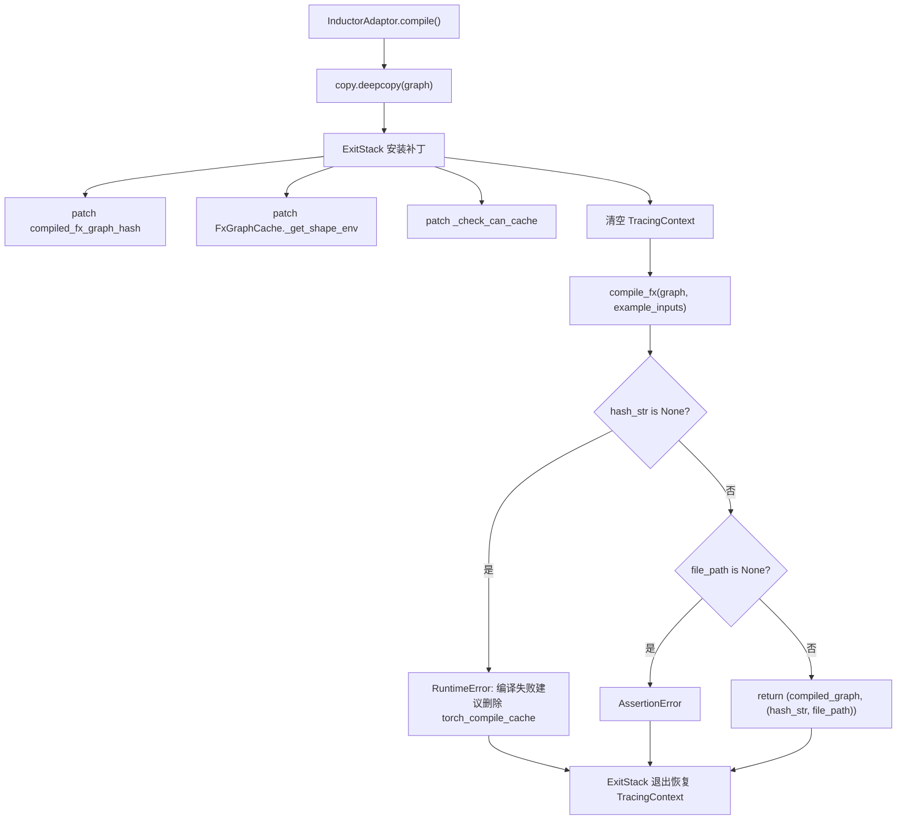
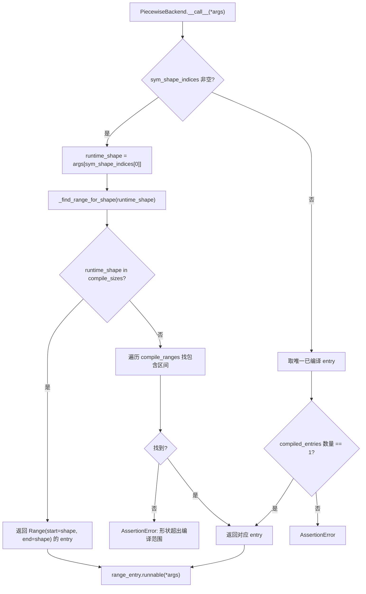

# Capítulo 10: Aceleración por compilación y CUDA Graph: eliminar la sobrecarga de inicio y programación

En el capítulo anterior vimos que KV Connector, a través de conectores como NIXL y Mooncake, transfiere eficientemente el KV cache entre los motores de Prefill y Decode, permitiendo que la arquitectura desagregada reduzca el TTFT mientras mejora la utilización de recursos. Pero incluso si la transferencia es más rápida, en la decodificación autorregresiva todavía hay dos costos fijos que no pueden eliminarse mediante algoritmos: la sobrecarga de programación del intérprete de Python y la sobrecarga de lanzamiento de kernels de GPU. Cuando el forward del modelo se divide en cientos de operadores, y cada operador debe pasar por una llamada a función de Python y un lanzamiento de kernel CUDA, la sobrecarga del lado de la CPU es suficiente para que la GPU quede inactiva entre dos cómputos. Este capítulo analiza cómo vLLM utiliza torch.compile para fusionar operadores en un grafo estático, y luego usa CUDA Graph para grabar toda la secuencia de lanzamiento de kernels como una sola reproducción, reduciendo así estos dos tipos de sobrecarga a casi cero.

# Caché de compilación y capa de adaptación del compilador: permitir la reutilización de resultados de compilación entre procesos

## Modelo intuitivo

El beneficio de la aceleración por compilación es "compilar una vez, ejecutar muchas veces", pero el costo es que la primera compilación puede tardar varios minutos. Sin caché, cada reinicio del servicio requeriría recompilar, y el tiempo de arranque en frío sería inaceptable.`CompilerInterface`Esta capa debe resolver precisamente el problema de "cómo serializar el producto de compilación, cómo identificarlo con un hash y cómo acertarlo con precisión en el próximo inicio". Sin ella, el desastre al que se enfrenta el sistema no es un fallo, sino que cada reinicio degenera en una "primera ejecución"; en un entorno de producción con escalado automático, esto significa que las instancias escaladas no podrán proporcionar servicios de baja latencia durante varios minutos.

## Estructuras de datos y contrato de interfaz

`CompilerInterface`Se define el contrato abstracto del adaptador del compilador, cuyo núcleo son cuatro métodos:`initialize_cache`Se encarga de redirigir el directorio de caché del propio compilador al directorio de caché de vLLM[FACT:vllm/compilation/compiler_interface.py:36-51]；`compute_hash`Recopila la información de configuración relacionada con el compilador para generar un hash[FACT:vllm/compilation/compiler_interface.py:53-62]；`compile`Ejecuta la compilación y devuelve el objeto invocable y el handle[FACT:vllm/compilation/compiler_interface.py:64-95]；`load`Restaura el producto de compilación a partir del handle[FACT:vllm/compilation/compiler_interface.py:97-103]。

La decisión de diseño clave aquí es`compile`Devuelve una tupla de dos elementos`(callable, handle)`。`callable`Es el resultado de compilación directamente invocable dentro de este proceso;`handle`Es la credencial "utilizada para restaurar en el próximo inicio", y la documentación exige explícitamente que debe ser un "plain Python object, preferably a string or a file path"[FACT:vllm/compilation/compiler_interface.py:81-81]. Esta separación permite que la ruta de acierto de caché y la ruta de primera compilación sigan códigos completamente diferentes; en caso de acierto, no se necesita en absoluto`compile`, solo se requiere`load`。

`compile_range`El parámetro transporta la semántica de formas dinámicas. Los comentarios indican que "could be concrete size (if compile_sizes is provided), e.g. [4, 4] or a range [5, 8]", y que "Right now we only support one variable in ranges for all inputs, which is the batchsize (number of tokens) during inference"[FACT:vllm/compilation/compiler_interface.py:74-74]. Esta es la restricción central de la estrategia de compilación de vLLM: todas las formas dinámicas se reducen a una única variable: el número de tokens.

## Impulsado por escenarios: el flujo completo de una solicitud de compilación

Supongamos que el servicio se inicia por primera vez,`InductorAdaptor.compile`Es invocado. Primero incrementa el contador de compilación[FACT:vllm/compilation/compiler_interface.py:477-489], y luego entra en una pila de parches cuidadosamente construida.

El primer paso es una copia profunda del grafo. Los comentarios señalan que "inductor can inplace modify the graph, so we need to copy it"[FACT:vllm/compilation/compiler_interface.py:500-502], esto es un diseño defensivo: tras un fallo de compilación, el grafo original aún puede usarse para reintentar.

El segundo paso es instalar una serie de monkey-patches.`hijacked_compile_fx_inner`Envuelve la función de compilación interna de Inductor, y tras completar la compilación extrae el hash de`inductor_compiled_graph._fx_graph_cache_key`Extrae el hash[FACT:vllm/compilation/compiler_interface.py:512-536]。`hijack_compiled_fx_graph_hash`Intercepta la propia función de cálculo de hash[FACT:vllm/compilation/compiler_interface.py:538-542]. ¿Por qué "secuestrar" el hash? Porque vLLM necesita compilar por separado fuera del contexto de rastreo de Dynamo, y el cálculo de hash de Inductor depende de dicho contexto.

El tercer paso es`_check_can_cache`parche, que retorna directamente sin realizar ninguna verificación[FACT:vllm/compilation/compiler_interface.py:544-551]. El comentario explica la motivación: "Inductor refuses to cache the graph outside of Dynamo tracing context, and also disables caching for graphs with high-order ops. For vLLM, in either case, we want to cache the graph"[FACT:vllm/compilation/compiler_interface.py:544-551]。

El cuarto paso es limpiar el contexto de trazado. Este es el punto más sutil: vLLM llama a`PiecewiseCompileInterpreter`desde dentro de`compile_fx`, en este momento el`FakeTensorMode`de Dynamo y el`FakeTensorMode`de la entrada del subgrafo no son consistentes,`detect_fake_mode()`provocará un fallo de aserción[FACT:vllm/compilation/compiler_interface.py:615-622]. El código guarda`TracingContext`y luego lo deja vacío, y registra un callback para restaurarlo al salir[FACT:vllm/compilation/compiler_interface.py:623-630]。

## Reflexión de diseño: AlwaysHitShapeEnv y consistencia de caché

`AlwaysHitShapeEnv`Esta clase merece un análisis aparte. Su docstring expone directamente la motivación: vLLM solo ejecuta una vez la compilación de bytecode de Dynamo, pero necesita ejecutar múltiples veces la compilación de Inductor con diferentes formas más una forma genérica; la compilación para formas específicas ocurre fuera del contexto de Dynamo, donde no hay un shape environment disponible para Inductor, lo que provoca fallos en la búsqueda de la caché de código de Inductor[FACT:vllm/compilation/compiler_interface.py:114-131]。

La solución es proporcionar un shape environment falso que "siempre acierta":`evaluate_guards_expression`siempre retorna`True` [FACT:vllm/compilation/compiler_interface.py:144-145]，`get_pruned_guards`retorna una lista vacía[FACT:vllm/compilation/compiler_interface.py:144-145]，`produce_guards_expression`retorna una cadena vacía[FACT:vllm/compilation/compiler_interface.py:147-159]. El comentario admite que estos métodos fueron "obtained by trial-and-error until it works"[FACT:vllm/compilation/compiler_interface.py:137-142]——este es un punto frágil acoplado a la implementación interna de PyTorch, y también el lugar más propenso a problemas al actualizar PyTorch.

La composición del hash de caché también es clave.`get_inductor_factors`recopila tres tipos de factores: estado del sistema`CacheBase.get_system()`, estado de PyTorch`torch_key()`, y la configuración de Inductor y functorch[FACT:vllm/compilation/compiler_interface.py:165-185]. Nótese que la configuración de functorch se recopila dentro del contexto de`patch(_get_vllm_functorch_config())`, lo que garantiza que "la configuración en tiempo de compilación y la clave de caché siempre sean consistentes"——el comentario dice explícitamente que esto es para mantener[FACT:vllm/compilation/compiler_interface.py:188-189]y`set_functorch_config()`consistentes`get_inductor_factors()`. Si estos dos lugares no son consistentes, ocurrirá un desajuste de "se usó la configuración A en tiempo de compilación, pero la clave de caché se calculó según la configuración B", lo que provocará que se cargue un artefacto incorrecto aunque haya un acierto de caché.[FACT:vllm/compilation/compiler_interface.py:147-159]Problemas en producción:

es un backport para torch < 2.10.0`_patch_standalone_compile_atomic_save`. Cambia[FACT:vllm/compilation/compiler_interface.py:205-243]para usar`CompiledArtifact.save()`escritura en formato binario, el comentario indica que el propósito es "preventing corrupt cache files when multiple processes compile concurrently"`write_atomic`. En escenarios de arranque en frío simultáneo de múltiples réplicas, múltiples procesos escribirán concurrentemente el mismo archivo de caché; una escritura no atómica producirá archivos truncados, y los procesos posteriores leerán artefactos corruptos con comportamiento impredecible.[FACT:vllm/compilation/compiler_interface.py:208-210]PiecewiseBackend: compilación por niveles de forma y despacho en tiempo de ejecución

# Modelo intuitivo

## es el centro de coordinación entre compilación y ejecución. Compila "un subgrafo FX" en "múltiples objetos invocables por nivel de forma", y en tiempo de ejecución selecciona el más adecuado según el número real de tokens. Sin él, o todas las formas usarían la misma compilación genérica (rendimiento subóptimo), o cada forma se compilaría por separado (explosión del tiempo de compilación).

`PiecewiseBackend`Estructura de datos: RangeEntry y rango de compilación

## La estructura de datos central es

, que vincula la bandera`RangeEntry`y`compile_range`、`compiled`juntos`runnable`mantiene un[FACT:vllm/compilation/piecewise_backend.py:80-83]。`PiecewiseBackend`La construcción del rango de compilación se divide en dos pasos. Primero se procesa`range_entries: dict[Range, RangeEntry]` [FACT:vllm/compilation/piecewise_backend.py:166-171]。

(tamaños exactos), cada tamaño genera un intervalo de punto único`compile_sizes`de`Range(start=size, end=size)`. Nótese que aquí para la cadena[FACT:vllm/compilation/piecewise_backend.py:166-171]se lanza directamente`"cudagraph_capture_sizes"`, y se explica que "should be handled in`NotImplementedError`——esta es una declaración explícita de límite de responsabilidad. Luego se procesa`post_init_cudagraph_sizes`" [FACT:vllm/compilation/piecewise_backend.py:166-171](intervalos), cada intervalo genera una entry`compile_ranges`admite dos modos mutuamente excluyentes, y el constructor fuerza esto con una aserción XOR[FACT:vllm/compilation/piecewise_backend.py:173-173]。

`PiecewiseBackend`: el modo de compilación (con graph, sin compiled_runnables) usa[FACT:vllm/compilation/piecewise_backend.py:117-119]; el modo precompilado (sin graph, con compiled_runnables) usa`compile_all_ranges()` [FACT:vllm/compilation/piecewise_backend.py:193-194]. Este diseño permite que el arranque en frío y el arranque en caliente compartan la misma clase, solo con diferente origen de datos.`load_all_ranges()` [FACT:vllm/compilation/piecewise_backend.py:193-194]Orientado a escenarios: del despacho en compilación al tiempo de ejecución

## Fase de compilación

**recorre todas las range entry, y para cada entry no compilada llama a**：`compile_all_ranges`registra el evento de trazado`_log_compile_start`. La rama clave está en la construcción de parámetros: si es un tamaño de punto único, se llama a[FACT:vllm/compilation/piecewise_backend.py:252-256]para generar un FakeTensor de forma concreta`create_concrete_args`; de lo contrario, se llama a[FACT:vllm/compilation/piecewise_backend.py:258-261]para reutilizar directamente los metadatos del placeholder en el grafo`get_fake_args_from_graph`La implementación de[FACT:vllm/compilation/piecewise_backend.py:262-263]。

`create_concrete_args`revela los detalles de la concretización de formas simbólicas. Construye un`ShapeEnv`con`FakeTensorMode` [FACT:vllm/compilation/piecewise_backend.py:54], y luego recorre los nodos placeholder. Para entradas de tipo`SymInt`, usa`concretize`para reemplazar todos los símbolos libres con`size` [FACT:vllm/compilation/piecewise_backend.py:47-52]; para el tipo`Tensor`, debe concretizar simultáneamente shape, stride, storage_offset, y usar`compute_required_storage_length`para calcular la longitud de almacenamiento requerida, y luego reconstruir el tensor mediante`as_strided` 重建张量 [FACT:vllm/compilation/piecewise_backend.py:64-73]. ¿Por qué no se puede cambiar solo la shape? Porque stride y storage_offset también pueden contener signos, y los tres deben ser coherentes entre sí; de lo contrario,`as_strided`provocará un acceso fuera de límites.

**Despacho en tiempo de ejecución**：`__call__`es una ruta crítica. Si existe`sym_shape_indices`, se extrae la forma en tiempo de ejecución`args`desde[FACT:vllm/compilation/piecewise_backend.py:357-362], y luego se llama a`_find_range_for_shape`para buscar. La lógica de búsqueda tiene prioridad: primero se comprueba si coincide con un`compile_sizes`exacto; si coincide, se devuelve ese intervalo de punto único[FACT:vllm/compilation/piecewise_backend.py:342-355]; de lo contrario, se recorre`compile_ranges`para encontrar el intervalo que contiene esa forma[FACT:vllm/compilation/piecewise_backend.py:342-355]。

## Reflexión de diseño: serialización y manejo especial de CachingAutotuner

> **[Design Inference & Architectural Trade-offs]**
> `to_bytes`El método se encarga de serializar los artefactos compilados para la caché AOT. Aquí hay un ingenioso`reducer_override`: cuando pickle se encuentra con`CachingAutotuner`, primero llama a`obj.prepare_for_pickle()`y luego serializa[FACT:vllm/compilation/piecewise_backend.py:209-218]. ¿Por qué se necesita este hook?`CachingAutotuner`contiene internamente artefactos de compilación de Triton y estado de ejecución; un pickle directo podría fallar o producir objetos no reutilizables;`prepare_for_pickle`evidentemente convierte el objeto en una forma pura serializable.

Durante la serialización también se habilita temporalmente`bundled_autograd_cache` [FACT:vllm/compilation/piecewise_backend.py:222], lo cual resuena con la lógica en`_get_vllm_functorch_config`—cuando`VLLM_USE_MEGA_AOT_ARTIFACT`no está habilitado, esa configuración es`False` [FACT:vllm/compilation/compiler_interface.py:160-161], y al serializar se fuerza a`True`, asegurando que los artefactos se empaqueten.

`load_all_ranges`es la ruta de arranque en caliente; afirma que cada range puede encontrarse en`compiled_runnables`con su key correspondiente; de lo contrario, lanza un error que incluye la lista de keys disponibles[FACT:vllm/compilation/piecewise_backend.py:329-339]. Este mensaje de error está diseñado de forma muy práctica: enumera directamente las keys disponibles, lo que facilita diagnosticar desajustes de versión de caché.

# Wrapper de CUDA Graph: captura, reproducción y despacho anidado

## Modelo intuitivo

CUDA Graph graba "una secuencia de lanzamientos de kernels" como un grafo estático; después, cada reproducción solo requiere una llamada a la API.`CUDAGraphWrapper`es el ejecutor de la grabación y la reproducción. Su dificultad central es: el tamaño de batch de vLLM es dinámico, mientras que CUDA Graph exige direcciones de entrada fijas. La solución es "capturar por niveles según batch descriptor": se graba un grafo por cada nivel de forma, y en tiempo de ejecución se consulta la tabla por descriptor para reproducir.

## Estructura de datos: CUDAGraphEntry y contrato de despacho

`CUDAGraphEntry`contiene tres campos clave:`batch_descriptor`como clave de despacho[FACT:vllm/compilation/cuda_graph.py:128-135]、`cudagraph`es el objeto de grafo capturado[FACT:vllm/compilation/cuda_graph.py:128-135]、`output`es la salida en el momento de la captura (se guarda con referencia débil para ahorrar memoria)[FACT:vllm/compilation/cuda_graph.py:128-135]。`input_addresses`solo se usa en modo de depuración para validar que las direcciones de entrada coincidan al reproducir[FACT:vllm/compilation/cuda_graph.py:128-135]。

`CUDAGraphWrapper`La documentación de clase de describe con precisión el contrato de despacho: al inicializar se asigna un runtime mode (FULL o PIECEWISE)[FACT:vllm/compilation/cuda_graph.py:158-158]; en tiempo de ejecución recibe runtime_mode y batch_descriptor desde el forward context y "blindly trust them"[FACT:vllm/compilation/cuda_graph.py:158-158]; si runtime_mode es NONE o no coincide, llama directamente a[FACT:vllm/compilation/cuda_graph.py:158-158]; de lo contrario, ejecuta captura o reproducción[FACT:vllm/compilation/cuda_graph.py:158-158]。

La documentación también declara explícitamente un límite: "CUDAGraphWrapper does not store persistent buffers or copy any runtime inputs into that buffers for replay"[FACT:vllm/compilation/cuda_graph.py:164-164]. Esto significa que la gestión de los búferes de entrada es responsabilidad del llamador: el wrapper solo se encarga del grafo en sí.

## Guiado por escenarios: una captura y una reproducción

**Ruta de captura**: cuando`__call__`se activa y runtime_mode coincide, primero se comprueba si el forward context está disponible. Si no lo está (como en el forward del codificador visual), se llama directamente a la función subyacente[FACT:vllm/compilation/cuda_graph.py:232-233]. Esta es la rama clave del escenario multimodal: el forward de ViT no pasa por CUDA Graph.

Luego se toman`batch_descriptor`y`cudagraph_runtime_mode` [FACT:vllm/compilation/cuda_graph.py:242-244]. Si mode es NONE o no coincide, se llama directamente a[FACT:vllm/compilation/cuda_graph.py:246-256]. Este diseño de "si no coincide, pasa directo" permite que los wrappers anidados coexistan: el wrapper FULL en la capa externa y el wrapper PIECEWISE en la capa interna; en tiempo de ejecución solo uno se activará.

Si el`cudagraph`de la entry es None, se entra en captura. Primero se llama a`validate_cudagraph_capturing_enabled()`para validar la legalidad[FACT:vllm/compilation/cuda_graph.py:279], luego se registran las direcciones de entrada[FACT:vllm/compilation/cuda_graph.py:281-284], se crea`torch.cuda.CUDAGraph()` [FACT:vllm/compilation/cuda_graph.py:285]。

En el contexto de captura hay varias operaciones clave. Si`gc_disable`está habilitado, se hace patch de`gc.collect`y`torch.accelerator.empty_cache` [FACT:vllm/compilation/cuda_graph.py:288-303]. El comentario explica el motivo: en modo piecewise cada capa debe capturar un grafo, y ejecutar GC repetidamente haría la captura extremadamente lenta, así que "only run gc for the first graph, and disable gc for the rest"[FACT:vllm/compilation/cuda_graph.py:289-294]. Luego se establece el graph pool id[FACT:vllm/compilation/cuda_graph.py:305-308], y se sincroniza el stream de copia del offloader[FACT:vllm/compilation/cuda_graph.py:310-312]。

La captura real se ejecuta dentro del contexto`torch.cuda.graph(cudagraph, pool=..., stream=...)``self.runnable(*args, **kwargs)` [FACT:vllm/compilation/cuda_graph.py:315-321]. Después de capturar, se llama a`get_offloader().join_after_forward()`para evitar errores de streams no unidos[FACT:vllm/compilation/cuda_graph.py:322-326]. Si`weak_ref_output`está habilitado, se convierte la output a referencia débil para ahorrar memoria[FACT:vllm/compilation/cuda_graph.py:327-334]. Finalmente, la entry guarda la output como referencia débil y el objeto de grafo[FACT:vllm/compilation/cuda_graph.py:338-339], pero**lo que se devuelve es la output original, no la referencia débil**—el comentario enfatiza que esto es para que PyTorch gestione correctamente la memoria durante la captura[FACT:vllm/compilation/cuda_graph.py:343-346]。

**Ruta de reproducción**: si la entry ya tiene un grafo, en modo de depuración se valida que las direcciones de entrada coincidan[FACT:vllm/compilation/cuda_graph.py:348-357], luego se sincroniza el offloader[FACT:vllm/compilation/cuda_graph.py:359-361], se llama a`entry.cudagraph.replay()`y se devuelve`entry.output` [FACT:vllm/compilation/cuda_graph.py:362-363]。

## Reflexión de diseño: por qué la salida debe ser una referencia débil, mientras que el retorno debe ser una referencia fuerte

Esto es`CUDAGraphWrapper`lo más contraintuitivo en`output`está gestionado por el cudagraph pool de PyTorch[FACT:vllm/compilation/cuda_graph.py:320]. Si la entrada hace una referencia fuerte a output, entonces la memoria de video ocupada por este grafo nunca podrá liberarse; pero si se convierte a referencia débil durante la captura, PyTorch podría reclamar la memoria antes de que finalice la captura, provocando que la captura falle. Por eso el código usa una referencia débil dentro del bloque de captura[FACT:vllm/compilation/cuda_graph.py:334], almacena una referencia débil en la entrada[FACT:vllm/compilation/cuda_graph.py:338], pero el valor de retorno de la función es una referencia fuerte[FACT:vllm/compilation/cuda_graph.py:346]. Este "estado de triple referencia" es un equilibrio preciso entre seguridad de memoria y eficiencia de memoria de video.

Otro diseño digno de mención es`_all_instances`este`WeakSet` [FACT:vllm/compilation/cuda_graph.py:173-176]. Permite que`clear_all_graphs`pueda vaciar de una sola vez los grafos de todos los wrappers[FACT:vllm/compilation/cuda_graph.py:173-176], para reclamación de emergencia cuando la memoria de video está ajustada. Se usa`WeakSet`en lugar de un conjunto normal para no impedir que el wrapper sea recolectado por GC; de lo contrario, el propio wrapper se filtraría.

Errores en producción:`__getattr__`la implementación de lanza errores con contexto para atributos inexistentes en modo de depuración[FACT:vllm/compilation/cuda_graph.py:211-217]. Esto parece trivial, pero al investigar "por qué falla cierta llamada a un método", poder ver la descripción de cadena del runnable envuelto por el wrapper es mucho más útil que un`AttributeError`desnudo.

# Reflexión de diseño: desacoplamiento entre compilación y CUDA Graph

El documento de diseño registra explícitamente la motivación de esta refactorización. La compilación piecewise temprana era para soportar la captura piecewise de CUDA Graph, excluyendo los operadores que no soportan CUDA Graph (principalmente attention)[FACT:docs/design/cuda_graphs.md:25]. Posteriormente se añadió soporte para full CUDA Graph, pero "this tight coupling between compilation and cudagraph capture led to an all-or-nothing experience with little flexibility"[FACT:docs/design/cuda_graphs.md:25]。

Tras la refactorización, los objetivos son cuatro: distinguir explícitamente entre lotes prefill/mixed y uniform-decode y capturarlos por separado[FACT:docs/design/cuda_graphs.md:25-25]; desacoplar la lógica de captura de CUDA Graph de la compilación, de modo que "capturing piecewise and full cudagraphs using the same compiled graph"[FACT:docs/design/cuda_graphs.md:25-25]; despachar en tiempo de ejecución según la composición del lote[FACT:docs/design/cuda_graphs.md:25-25]; y control centralizado para reducir la complejidad[FACT:docs/design/cuda_graphs.md:25-25]。

`BatchDescriptor`es la estructura central de la clave de despacho, que contiene`num_tokens`、`num_reqs`、`uniform`、`has_lora`cuatro campos[FACT:docs/design/cuda_graphs.md:86-93]。`uniform`El flag es especialmente crítico: muchos backends de attention solo soportan full CUDA Graph cuando el lote es uniforme[FACT:docs/design/cuda_graphs.md:95-95]. El documento también anticipa que esta estructura podría extenderse, por ejemplo añadiendo`uniform_query_len`para soportar múltiples longitudes de uniform decode[FACT:docs/design/cuda_graphs.md:95-95]。

La prioridad de despacho es`FULL > PIECEWISE > None`, y si la clave de despacho no existe, se recurre al modo NONE para ejecución eager[FACT:docs/design/cuda_graphs.md:112-115]. Esta estrategia de "degradar en lugar de reportar error" garantiza que cualquier combinación de lotes pueda ejecutarse, solo que con rendimiento diferente.

`AttentionCGSupport`El enum cuantifica la capacidad de CUDA Graph del backend, con valores`ALWAYS=3 > UNIFORM_BATCH=2 > UNIFORM_SINGLE_TOKEN_DECODE=1 > NEVER=0` [FACT:docs/design/cuda_graphs.md:153-162]. Los modelos de attention híbrida (como mamba mixer) toman el mínimo de las capacidades de todos los backends y degradan el modo CUDA Graph en consecuencia[FACT:docs/design/cuda_graphs.md:173-175]. Este diseño desacopla la "declaración de capacidad" de la "selección de modo": añadir un nuevo backend solo requiere declarar su capacidad, y la estrategia de degradación se aplica automáticamente.

# Resumen del capítulo

# Reflexión y autoevaluación del capítulo

Q1: Si se elimina el`_check_can_cache`parche ([FACT:vllm/compilation/compiler_interface.py:544-551]) y se deja que Inductor decida por sí mismo si cachear, ¿en qué escenarios se invalidaría la caché de compilación? ¿Por qué el comentario dice "Inductor refuses to cache the graph outside of Dynamo tracing context"?

**Análisis de referencia**：`_check_can_cache`retorna directamente sin hacer ninguna comprobación; el comentario explica que Inductor rechaza cachear en dos casos: fuera del contexto de trazado de Dynamo, y cuando el grafo contiene operadores de orden superior[FACT:vllm/compilation/compiler_interface.py:544-551]. El flujo de compilación de vLLM está precisamente fuera del contexto de Dynamo (`compile_fx`es llamado por`PiecewiseCompileInterpreter`, y el código limpia explícitamente`TracingContext` [FACT:vllm/compilation/compiler_interface.py:623-625]). Si se elimina el parche, Inductor determinará que "no es cacheable" y recompilará en cada arranque, degradando el tiempo de arranque en frío de segundos a minutos. Más sutil aún: como vLLM depende de`hijacked_compile_fx_inner`para capturar`hash_str`, si se omite la ruta de caché,`hash_str`podría ser None, disparando el RuntimeError de[FACT:vllm/compilation/compiler_interface.py:640-652]. Esto explica por qué el comentario enfatiza que "vLLM today assumes and requires the monkey-patched functions to get hit"[FACT:vllm/compilation/compiler_interface.py:596-598]。

Q2: `CUDAGraphWrapper`convierte output en una referencia débil y la almacena en la entrada durante la captura ([FACT:vllm/compilation/cuda_graph.py:338]), pero devuelve una referencia fuerte ([FACT:vllm/compilation/cuda_graph.py:346]). Si el valor de retorno también se cambiara a referencia débil, ¿en qué escenarios se produciría un crash?

**Análisis de referencia**: durante la captura`output`está gestionado por el cudagraph pool de PyTorch[FACT:vllm/compilation/cuda_graph.py:320]. Si el valor de retorno es una referencia débil, el objeto que recibe el llamador puede ser recolectado por el GC inmediatamente después de salir del bloque de captura, porque en ese momento ninguna referencia fuerte lo mantiene vivo. PyTorch necesita que output permanezca vivo durante la captura para establecer correctamente la relación de mapeo del grupo de memoria; una vez recolectado, en la reproducción posterior`entry.output`la referencia débil apuntada ya no es válida,`replay()`el objeto devuelto después puede haber sido sobrescrito o liberado. El comentario dice explícitamente "we need to return the output, rather than the weak ref of the output, so that pytorch can correctly manage the memory during cuda graph capture"[FACT:vllm/compilation/cuda_graph.py:343-345]. Este diseño es un equilibrio preciso de "referencia fuerte durante la captura, referencia débil durante el almacenamiento".

Q3: En`PiecewiseBackend._find_range_for_shape`（[FACT:vllm/compilation/piecewise_backend.py:342-355]), la búsqueda por tamaño exacto tiene prioridad sobre la búsqueda por intervalo. Supongamos`compile_sizes=[8]`、`compile_ranges=[Range(1,16)]`, en tiempo de ejecución shape=8, ¿qué entry se activará? Si se invierte la prioridad, ¿qué consecuencias habría?

**Análisis de referencia**: La lógica actual primero verifica`runtime_shape in self.compile_sizes`, si hay coincidencia devuelve`Range(start=8, end=8)`el entry de punto único[FACT:vllm/compilation/piecewise_backend.py:342-355]. Este entry fue compilado con`create_concrete_args`, la forma está completamente concretizada, el kernel de Triton puede realizar la máxima especialización (como`set_inductor_config`en el que el tamaño de punto único activa`max_autotune` [FACT:vllm/compilation/compiler_interface.py:747-754]). Si se invierte la prioridad, shape=8 activará el entry del intervalo`Range(1,16)`— esa es la versión genérica compilada con formas simbólicas, con rendimiento subóptimo. Más grave aún,`compile_sizes`generalmente proviene de`cudagraph_capture_sizes`, estos tamaños son precisamente los niveles que CUDA Graph necesita capturar; si en tiempo de ejecución se despacha al entry genérico, el grafo capturado por CUDA Graph y el runnable despachado serán inconsistentes, lo que puede causar desajustes de forma durante la reproducción. Por lo tanto, la prioridad de lo exacto no es solo una elección de rendimiento, sino un requisito de corrección.

El siguiente capítulo se centrará en cuantización y kernels personalizados, para ver cómo vLLM interviene en el control de precisión desde la etapa de carga de pesos, y utiliza operadores altamente especializados para convertir realmente los beneficios de la cuantización en mejoras de throughput.

Este capítulo analizó los dos niveles del mecanismo de aceleración por compilación de vLLM. El primer nivel es CompilerInterface y PiecewiseBackend: el primero define el contrato de adaptación del compilador y la estrategia de hash de caché, usando AlwaysHitShapeEnv para eludir el problema de la falta de contexto de Dynamo; el segundo compila un único subgrafo FX en múltiples niveles de forma, despachando en tiempo de ejecución según el número de tokens. El segundo nivel es CUDAGraphWrapper: captura CUDA Graph por niveles según BatchDescriptor, logrando despacho anidado mediante coincidencia de runtime mode, permitiendo que los modos FULL y PIECEWISE coexistan en el mismo grafo compilado. El desacoplamiento de ambos es el núcleo de esta refactorización: los artefactos de compilación pueden ser reutilizados por ambos modos de CUDA Graph, y CUDA Graph también puede funcionar independientemente de la compilación. Sin embargo, la compilación y la captura de grafos resuelven la sobrecarga de programación; la precisión de los pesos del modelo y la eficiencia de los operadores siguen siendo otra línea principal de optimización. El siguiente capítulo se centrará en cuantización y kernels personalizados, para ver cómo vLLM analiza la configuración de cuantización, completa la conversión de formatos como FP8/INT4/AWQ/GPTQ durante la carga de pesos, y aprovecha _custom_ops y los kernels de Triton para exprimir aún más el rendimiento del hardware.
