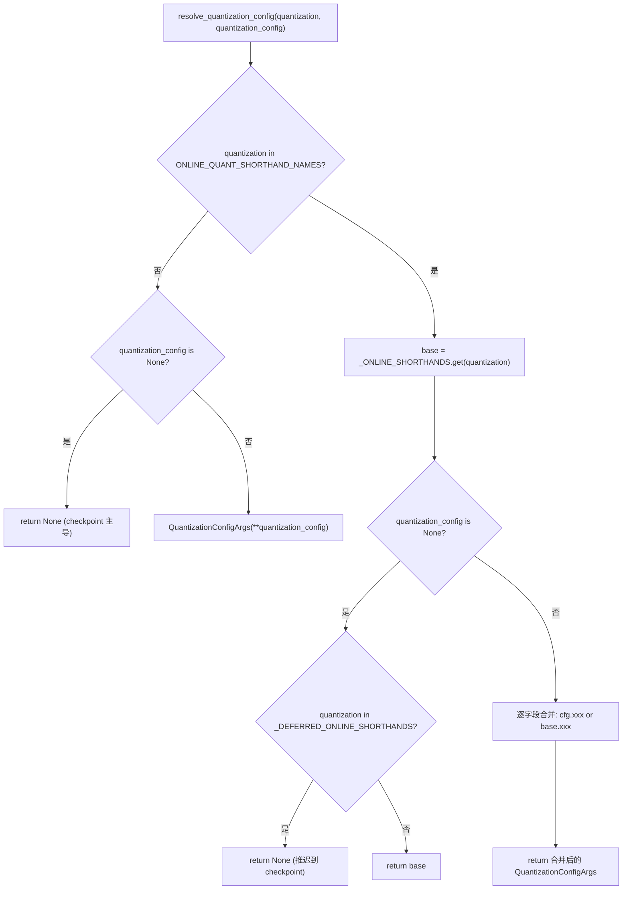
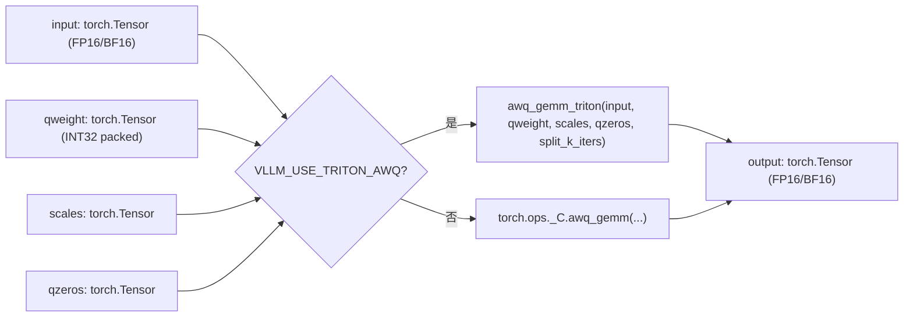
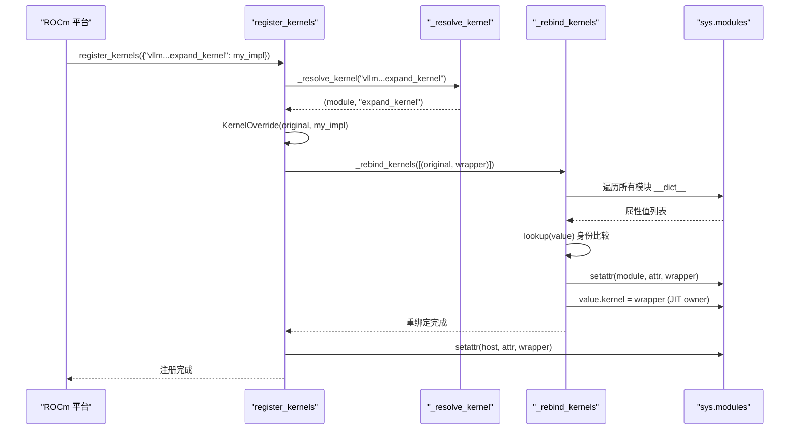

# Capítulo 11: Cuantización y kernels personalizados: desde la carga de pesos hasta operadores de alto rendimiento

En el capítulo anterior vimos cómo torch.compile y CUDA Graph llevan al extremo la reducción de la sobrecarga de programación de Python y de lanzamiento de kernels. Pero por muy rápido que sea el despacho, si los pesos en sí son FP16 y la multiplicación de matrices usa GEMM genérico, el poder de cómputo del hardware sigue limitado por el ancho de banda de memoria y operadores ineficientes. La cuantización y los kernels personalizados son otra línea principal de optimización ortogonal: la primera reduce la precisión ya en la etapa de carga de pesos, y los segundos convierten realmente los beneficios de la cuantización en throughput. Este capítulo parte desde el punto de entrada de análisis de la configuración de cuantización y llega hasta el registro de operadores de _custom_ops y la programación de kernels de Triton.

# 11.1 Configuración de cuantización: de la cadena CLI a QuantKey

## Modelo intuitivo

El rol del módulo de configuración de cuantización es como el traductor del menú de un restaurante. El usuario dice en recepción "quiero fp8_per_tensor" (cadena CLI), pero la cocina necesita el número exacto de receta (`QuantKey`). El traductor debe manejar tres tipos de entrada: abreviatura pura de CLI, metadatos de cuantización propios del checkpoint, y escenarios combinados de ambos. Sin esta capa de traducción, la cocina recibiría un montón de cadenas ambiguas y no podría decidir qué kernel invocar.

## Estructuras de datos y diseño de memoria

Las estructuras de datos centrales son`QuantSpec`y`QuantizationConfigArgs`. La primera describe las claves de cuantización de pesos y activaciones de un tipo de capa (linear o MoE), la segunda es la configuración de nivel superior visible al usuario.

[FACT:vllm/config/quantization.py:73-99]

```python
@config
class QuantSpec:
    weight: QuantKeyField = None
    activation: QuantKeyField = None

    def __str__(self) -> str:
        def quant_key_str(quant_key: QuantKey | None) -> str:
            if quant_key is None:
                return "None"
            return next(
                (
                    name
                    for name, known_quant_key in QUANT_KEY_NAMES.items()
                    if known_quant_key == quant_key
                ),
                str(quant_key),
            )
        return quant_key_str(self.weight)
```

`weight`y`activation`son ambos opcionales`QuantKey`。`None`la semántica es "revertir al valor predeterminado de la propia clase del método" — normalmente heredado del checkpoint; en escenarios de cuantización en línea, significa no cuantizar[FACT:vllm/config/quantization.py:74-74]。`QuantKey`en sí es un tipo complejo que contiene declaraciones de`NamedTuple`y`ClassVar[GroupShape]`, pydantic no puede introspectarlo directamente, por lo que el autor inyectó un validador personalizado mediante`GetPydanticSchema``_coerce_quant_key`, que normaliza de forma unificada cadenas o`QuantKey`[FACT:vllm/config/quantization.py:60-69]。

`QuantizationConfigArgs`el diseño de campos merece atención[FACT:vllm/config/quantization.py:102-126]：

- `linear` / `moe`: actúan respectivamente sobre las capas`LinearBase`y`FusedMoEFactory`;
- `ignore`: lista de nombres de capas a omitir en la cuantización; la cuantización en línea también admite comodines fnmatch;
- `targets`: sobrescritura de cuantización en línea capa por capa; la clave puede ser un nombre de capa exacto, una expresión regular con prefijo`re:`, o un patrón fnmatch; el valor es mutuamente excluyente con`linear`/`moe`.

`targets`y`linear`/`moe`son mutuamente excluyentes, forzado por`model_validator`[FACT:vllm/config/quantization.py:172-179]. Esta restricción no es formalismo:`targets`sigue la ruta de sobrescritura capa por capa,`linear`/`moe`sigue la ruta predeterminada global; si ambas coexisten, "qué spec usa realmente cierta capa" se vuelve indeterminable.

## Paso a paso: una resolución de`--quantization fp8_per_tensor`

Escenario: el usuario pasa por línea de comandos`--quantization fp8_per_tensor`, y al mismo tiempo especifica mediante`--quantization-config`la cuantización de activaciones de la capa MoE.

Primer paso,`resolve_quantization_config`es invocado con los argumentos: cadena de CLI y diccionario de configuración[FACT:vllm/config/quantization.py:233-235]. Primero comprueba si`quantization`está en`ONLINE_QUANT_SHORTHAND_NAMES`— esta tupla contiene todos los nombres abreviados más un`"online"` [FACT:vllm/config/quantization.py:216-222]。

Segundo paso,`fp8_per_tensor`coincide con la tabla de abreviaturas,`base`se resuelve como`_ONLINE_SHORTHANDS["fp8_per_tensor"]`, es decir, tanto linear como moe usan`kFp8StaticTensorSym` [FACT:vllm/config/quantization.py:188-190]。

Tercer paso,`quantization_config`no está vacío, se construye como objeto`QuantizationConfigArgs`. Luego entra en la lógica de fusión[FACT:vllm/config/quantization.py:267-268]: cada campo se decide con`quantization_config.xxx or base.xxx`— los campos establecidos explícitamente por el usuario tienen prioridad; los no establecidos heredan el valor predeterminado de la abreviatura. Aquí se usa`or`en lugar de`if is not None`de forma intencional:`QuantSpec`y la lista vacía son falsy; semánticamente, "no establecido" y "vacío" son equivalentes.

Cuarto paso, si`quantization`no está en la tabla de abreviaturas (por ejemplo, es un`awq`propio del checkpoint), y`quantization_config`es`None`, la función devuelve directamente`None` [FACT:vllm/config/quantization.py:256-257]. Esto significa "no superponer cuantización en línea"; el método de cuantización del checkpoint sigue siendo dominante.

Hay una rama fácil de pasar por alto:`_DEFERRED_ONLINE_SHORTHANDS`contiene`mxfp4`y`mxfp8` [FACT:vllm/config/quantization.py:233-235]. Estos dos nombres son tanto abreviaturas de CLI como nombres de métodos de cuantización de checkpoint. Cuando el usuario solo pasa`--quantization mxfp4`y no`quantization_config`, la función devuelve`None`en lugar de`base` [FACT:vllm/config/quantization.py:267-268], posponiendo la decisión a los metadatos del checkpoint — solo cuando el checkpoint no tiene información de cuantización se recurre a la abreviatura en línea.



## Consideraciones de diseño y trampas

`_coerce_spec`el validador maneja un escenario sutil: cuando`linear`o`moe`reciben una cadena, primero consulta`_ONLINE_SHORTHANDS`; si coincide, extrae el spec del campo correspondiente; si no coincide, lo trata como un único nombre de`QuantKey`[FACT:vllm/config/quantization.py:130-139]. Esto significa que`linear="fp8_per_tensor"`y`linear="fp8_per_tensor_static"`siguen dos rutas diferentes — la primera es una abreviatura de configuración completa, la segunda es una única clave de cuantización. Si en la abreviatura ese campo es`None`(por ejemplo,`int8_per_channel_weight_only`no tiene campo`linear`), se lanza un`ValueError`explícito en lugar de devolver silenciosamente`None` [FACT:vllm/config/quantization.py:130-139]。

Una trampa común en producción:`targets`las claves de expresión regular se precompilan y validan en`_validate_targets`[FACT:vllm/config/quantization.py:166-167], pero las claves de patrón fnmatch no se validan. Si el usuario escribe un patrón fnmatch que nunca coincide con ninguna capa, no se produce error; simplemente esa capa permanece sin cuantizar — al diagnosticar, hay que comprobar si el nombre de capa realmente coincide.

# 11.2 `_custom_ops`: registro de operadores e implementación fake

## Modelo intuitivo

`_custom_ops.py`es la capa de adaptación entre vLLM y los operadores subyacentes de CUDA/C++, como una aduana. En el espacio de nombres`torch.ops._C`de PyTorch se registran operadores C++ compilados, pero llamarlos directamente tiene tres problemas: el conjunto de operadores difiere entre plataformas (CUDA/ROCm/CPU/XPU),`torch.compile`necesita implementaciones fake para inferir formas de salida, y algunos operadores requieren preprocesamiento de parámetros en el lado de Python.`_custom_ops`encapsula estos problemas de forma unificada.

## Estructuras de datos y mecanismo de registro

Al cargar el módulo, primero se llama a`current_platform.import_kernels()` [FACT:vllm/_custom_ops.py:25-26], dando a la capa de plataforma la oportunidad de importar su propia biblioteca de operadores. Luego se define`register_fake`— bajo`TYPE_CHECKING`es un decorador vacío; en tiempo de ejecución se importa desde`torch.library`[FACT:vllm/_custom_ops.py:25-26]。

La función principal de la implementación fake es hacer que`torch.compile`conozca la forma de salida y el dtype del operador durante la fase de trazado, sin ejecutarlo realmente. Tomando`scaled_fp4_quant`como ejemplo:

[FACT:vllm/_custom_ops.py:90-100]

```python
if hasattr(torch.ops, "_C") and hasattr(torch.ops._C, "scaled_fp4_quant"):

    @register_fake("_C::scaled_fp4_quant")
    def _scaled_fp4_quant_fake(
        input: torch.Tensor,
        input_scale: torch.Tensor,
        is_sf_swizzled_layout: bool,
    ) -> tuple[torch.Tensor, torch.Tensor]:
        n = input.shape[-1]
        m = input.numel() // n
        return create_fp4_output_tensors(m, n, input.device, is_sf_swizzled_layout)
```

Nótese la guarda`hasattr`: la implementación fake solo se define cuando la plataforma realmente ha registrado`_C::scaled_fp4_quant`. Esto garantiza que importar el módulo en CPU o GPU antiguas no falle por falta de operadores.

`create_fp4_output_tensors`muestra los detalles del diseño de memoria de la salida de cuantización FP4[FACT:vllm/_custom_ops.py:69-87]. Cuando`is_sf_swizzled_layout=True`, el tensor de escala debe organizarse en tiles de 128x4 según lo exigen los Tensor Core: el número de filas se redondea hacia arriba a múltiplos de 128, el número de columnas (`n // 16`) se redondea hacia arriba a múltiplos de 4, y cada 4 float8_e4m3 se empaquetan en un int32[FACT:vllm/_custom_ops.py:55-64]. El comentario señala explícitamente que el kernel de cuantización NVFP4 pone a cero explícitamente todas las entradas de escala de padding, por lo que no se necesita un kernel de inicialización a cero por separado[FACT:vllm/_custom_ops.py:60-61]。

## Paso a paso: flujo de llamada de un AWQ GEMM

Escenario: el modelo ha cargado pesos cuantizados AWQ; en la propagación hacia adelante se debe hacer una multiplicación matricial entre activaciones y pesos cuantizados.

Primer paso, llamar a`awq_gemm` [FACT:vllm/_custom_ops.py:587-592]. La función primero comprueba la variable de entorno`VLLM_USE_TRITON_AWQ`. Si es verdadera, importa de forma diferida`awq_gemm_triton`y llama — esta es una ruta de implementación puramente Triton, para plataformas que no admiten operadores CUDA o escenarios de depuración.

Segundo paso, la ruta predeterminada llama a`torch.ops._C.awq_gemm`, pasando input, qweight, scales, qzeros y`split_k_iters` [FACT:vllm/_custom_ops.py:598-598]。

Tercer paso, si`torch.ops._C.awq_gemm`Existe, la implementación fake está registrada[FACT:vllm/_custom_ops.py:601-616]. La forma que devuelve fake es`(split_k_iters, num_in_feats, qweight.size(1) * 8)`luego`.sum(0)`——esto simula con precisión la forma del resultado intermedio de split-K y la forma final tras la reducción.`qweight.size(1) * 8`Proviene del empaquetado de AWQ: cada int32 almacena 8 pesos de 4 bits.

Cuarto paso,`awq_dequantize`sigue una ruta similar[FACT:vllm/_custom_ops.py:553-559], pero la derivación de formas de la implementación fake es diferente:`out_c = qout_c * 8`, porque tras la desquantización el número de columnas se expande 8 veces[FACT:vllm/_custom_ops.py:587-592]。

La función repack de la serie Marlin muestra otro patrón.`gptq_marlin_repack`La implementación fake de calcula`pack_factor = 32 // num_bits`, la forma de salida es`(size_k // 16, size_n * 16 // pack_factor)` [FACT:vllm/_custom_ops.py:1103-1119]. Aquí`16`es el Marlin tile size,`size_k // 16`indica que la dimensión K se divide por tiles. La versión MoE de`gptq_marlin_moe_repack`itera en la capa de Python sobre cada expert llamando al repack de un solo expert[FACT:vllm/_custom_ops.py:1154-1172], y afirma`size_k % 16 == 0`——esta es una restricción dura del formato Marlin.



## Reflexiones de diseño y trampas

La implementación fake debe coincidir exactamente con la forma de salida del operador real, de lo contrario`torch.compile`el grafo trazado tendrá formas que no coincidirán en tiempo de ejecución.`create_fp4_output_tensors`El comentario de enfatiza especialmente "Must match the C++ scaled_fp4_quant_func allocation exactly when padded_n is None"[FACT:vllm/_custom_ops.py:69-74]. Este es un punto propenso a errores: si el lado de C++ cambia la lógica de asignación y el fake no se sincroniza, el grafo compilado fallará al reproducirse en CUDA Graph.

Otra trampa es`torch.library.custom_op`la regla de alias de .`safeFusedQuantizeNv`El comentario de señala que torch 2.12+ no permite que la salida de un operador personalizado haga alias con ninguna entrada, por lo que el autor cambió el tensor de retorno a un parámetro in-place[FACT:vllm/_custom_ops.py:4650-4655]. Esta práctica de "cambiar la forma de la API para sortear limitaciones del framework" es común en la capa de adaptación de operadores; al depurar hay que prestar atención a si`mutates_args`la declaración es consistente con el comportamiento real.

`CPUDNNLGEMMHandler`Muestra otro patrón de gestión de recursos: el puntero del handler se guarda en un tensor int64,`__del__`al llamar`release_dnnl_matmul_handler`libera[FACT:vllm/_custom_ops.py:3708-3717]. Guardar el puntero en un tensor es para evitar que la optimización de inline de enteros de Python lo elimine——esta es una técnica clásica de binding de bajo nivel.

# 11.3 Programación de kernels Triton:`KernelOverride`y re-binding entre módulos

## Modelo intuitivo

El rol del programador de kernels Triton es como un sistema de reemplazo de puestos en una empresa. Cuando una plataforma (por ejemplo ROCm) necesita reemplazar con su propia implementación un kernel Triton del núcleo de vLLM, no puede modificar directamente el código del núcleo——eso contaminaría el upstream.`dispatcher`Permite que una plataforma registre un sustituto y luego cambia silenciosamente todas las referencias al kernel original por el sustituto. Sin este mecanismo, cada plataforma tendría que mantener un fork, con conflictos constantes al fusionar cambios del upstream.

## Estructuras de datos y diseño de memoria

La estructura de datos central es`_registry`el diccionario y`KernelOverride`la clase[FACT:vllm/triton_utils/dispatcher.py:29-36]。

`KernelOverride`campos clave de[FACT:vllm/triton_utils/dispatcher.py:50-61]：

- `_impl`: función de implementación de la plataforma;
- `arg_names`: tupla con los nombres de parámetros que refleja el kernel original, usada para el binding por palabra clave en el launch;
- `constexprs`: declaraciones constexpr heredadas del kernel original;
- `func`: apunta a la función de implementación, para introspección en warmup;
- `_forward_by_name`: flag booleano que decide si al hacer launch se reenvían los parámetros por palabra clave o por posición.

`_forward_by_name`La lógica de cálculo de es: comparar`inspect.signature(impl).parameters`con el del kernel original`arg_names`si son exactamente iguales[FACT:vllm/triton_utils/dispatcher.py:50-61]. Si son iguales, significa que los nombres de parámetros de la implementación coinciden con los del kernel y se puede reenviar de forma segura por palabra clave; de lo contrario, hay que reenviar por posición según el orden de parámetros del kernel original.

## Paso a paso: un`register_kernels`re-binding de

Escenario: la plataforma ROCm llama en la inicialización a`register_kernels({"vllm.v1.sample.rejection_sampler.expand_kernel": my_expand_impl})`。

Primer paso,`register_kernels`recorre los overrides y para cada nombre llama a`_resolve_kernel` [FACT:vllm/triton_utils/dispatcher.py:162-166]。`_resolve_kernel`divide el nombre por el último`.`en nombre de módulo y nombre de atributo[FACT:vllm/triton_utils/dispatcher.py:83-94]. Si la primera letra del último segmento del nombre del módulo es mayúscula, significa que el kernel pertenece a alguna clase (JIT warmup owner); hay que importar primero el módulo padre y luego`getattr`obtener la clase, devolver`(类, 属性名)`; de lo contrario, importar el módulo mismo y devolver`(模块, 属性名)`。

Segundo paso, tras obtener el objeto del kernel original, construir`KernelOverride`el wrapper y registrarlo en`_registry` [FACT:vllm/triton_utils/dispatcher.py:167-169]。

Tercer paso,`_rebind_kernels`ejecuta un escaneo de todos los módulos[FACT:vllm/triton_utils/dispatcher.py:97-144]. Recorre`sys.modules`de todos los módulos en`__dict__`, y para cada valor de atributo hace comparación de identidad——ojo,`is`y no`==`, porque algunos valores de atributo (como`PlaceholderModule`el centinela) al hacer hash/eq pueden disparar importaciones o excepciones[FACT:vllm/triton_utils/dispatcher.py:116-123]。

Cuarto paso, para los atributos que coinciden con el kernel original, directamente`setattr`reemplazar por el wrapper[FACT:vllm/triton_utils/dispatcher.py:125-135]. Para el JIT warmup owner (objetos cuya propiedad de instancia`kernel`apunta al kernel original), reemplazar`value.kernel`y limpiar el caché de`_kernel_arg_names`, para que el binding del launch se derive de nuevo desde el wrapper[FACT:vllm/triton_utils/dispatcher.py:138-139]。

Quinto paso,`_rebind_kernels`tras completarse, recién entonces reemplazar también el atributo en el sitio de definición por el wrapper[FACT:vllm/triton_utils/dispatcher.py:170-174]. El comentario explica la importancia del orden: si se reemplaza primero el sitio de definición, al escanear ya no se encontrará el kernel original[FACT:vllm/triton_utils/dispatcher.py:170-171]。



## Reflexiones de diseño y trampas

`KernelOverride.__getitem__`devuelve`self._launch`, lo que hace que`kernel[grid](**kwargs)`esta sintaxis estándar de launch de Triton sea transparente para el wrapper[FACT:vllm/triton_utils/dispatcher.py:63-74]。`_launch`La lógica de reenvío de tiene tres casos[FACT:vllm/triton_utils/dispatcher.py:63-74]: si hay argumentos posicionales, se pasan directamente;`_forward_by_name`si es verdadero, se reenvía por palabra clave; de lo contrario, se comprueba si en kwargs hay nombres de parámetros que el kernel original no reconoce; si los hay, se lanza`RuntimeError`, y si no, se extraen los valores en el orden de parámetros del kernel original y se reenvían por posición.

Este`RuntimeError`Es una defensa importante: si los nombres de parámetros implementados por la plataforma no coinciden con los del kernel, y quien llama pasa parámetros que la implementación no reconoce, ignorarlos silenciosamente provocaría resultados erróneos difíciles de diagnosticar. Un error explícito expone el problema ya en la fase de registro.

Una trampa en producción:`_rebind_kernels`El escaneo de es de O(número de módulos × número de atributos × número de kernels). Para modelos grandes,`sys.modules`puede haber miles de módulos, cada uno con cientos de atributos. Aunque solo se ejecuta una vez durante la inicialización, si hay muchos kernels registrados, el tiempo de arranque aumentará notablemente.`lookup`La función usa un escaneo lineal en lugar de búsqueda por hash, y el comentario explica por qué: algunos valores de atributos no son hashables[FACT:vllm/triton_utils/dispatcher.py:116-123]. Es un compromiso típico de "corrección antes que rendimiento".

Otra trampa:`_resolve_kernel`Determina si es un atributo de clase mediante "la primera letra de la última sección del nombre del módulo en mayúscula"[FACT:vllm/triton_utils/dispatcher.py:83-94]. Si el nombre de un módulo comienza con mayúscula (lo cual no sigue las convenciones de nomenclatura de Python pero es sintácticamente válido), se clasificará erróneamente como clase. Es un diseño de convención sobre configuración que depende de las normas de nomenclatura internas de vLLM.

# Reflexiones de diseño

Los dos mecanismos, la configuración de cuantización y el registro de operadores, constituyen conjuntamente la superficie de ajuste "precisión-rendimiento" de vLLM.`QuantizationConfigArgs`El diseño de refleja la separación entre "intención del usuario" y "valores predeterminados del método":`None`No significa "no cuantizar", sino "dejar que la clase del método decida por sí misma". Esta decisión diferida permite que una misma configuración se adapte tanto a la cuantización de checkpoint como a la cuantización en línea.

`_custom_ops`El patrón de implementación fake de es el`torch.compile`estándar del ecosistema, pero lo distintivo de vLLM es el`hasattr`uso generalizado de guardas. Esto permite que un mismo módulo se importe en CUDA, ROCm, CPU y XPU sin fallar, a costa de que cada operador requiere tres piezas de código: envoltorio de Python, implementación fake y guarda de plataforma.

El reenlace entre módulos del dispatcher de Triton es una solución agresiva. No depende de los hooks de importación de Python ni de`__getattr__`, sino que escanea y reemplaza directamente todas las referencias. La ventaja de este enfoque es que es exhaustivo: sin importar en cuántos lugares se`from mod import kernel`copie el kernel, puede ser reemplazado; la desventaja es que es frágil: cualquier nueva forma de mantener una referencia al kernel (como la captura por closure) podría escapar del escaneo.

# Resumen del capítulo

# Reflexiones y autoevaluación del capítulo

Q1: En`resolve_quantization_config`, si se elimina la`_DEFERRED_ONLINE_SHORTHANDS`rama (es decir, cuando`quantization in _DEFERRED_ONLINE_SHORTHANDS`se devuelve`base`en lugar de`None`), ¿qué ocurre al cargar un modelo cuyo checkpoint incluye`quant_method: "mxfp4"`y el usuario solo pasa`--quantization mxfp4`?

**Análisis de referencia**：`_DEFERRED_ONLINE_SHORTHANDS`La intención de diseño de es dar prioridad al método de cuantización del checkpoint[FACT:vllm/config/quantization.py:233-235]. Si se elimina esta rama,`mxfp4`coincidirá con`_ONLINE_SHORTHANDS`y devolverá`base`(es decir,`QuantSpec(weight=kMxfp4Static)`）[FACT:vllm/config/quantization.py:198-210]. En ese momento, la configuración de cuantización en línea sobrescribiría el método de cuantización del checkpoint, pero los pesos del checkpoint están almacenados en formato`mxfp4`—si el`kMxfp4Static`de la configuración en línea no coincide exactamente con el formato real del checkpoint (por ejemplo, un diseño de scale diferente), la carga de pesos fallará o producirá resultados erróneos. Un caso más sutil: el`mxfp4`del checkpoint podría usar un group size o scale dtype diferentes, y los valores predeterminados de la configuración en línea no coincidirían, degradando la precisión de inferencia sin reportar error.

Q2: `KernelOverride._launch`En, si`_forward_by_name`es`False`y los kwargs pasados por quien llama incluyen un nombre de parámetro que el kernel original no reconoce, el código lanzará`RuntimeError`. Si se elimina esta comprobación y se cambia a ignorar silenciosamente los parámetros desconocidos, ¿en qué escenarios provocaría problemas difíciles de diagnosticar?

**Análisis de referencia**：`_forward_by_name`Que sea`False`significa que los nombres de parámetros de la implementación de la plataforma no coinciden con los del kernel original, y deben reenviarse por posición[FACT:vllm/triton_utils/dispatcher.py:50-61]. Si quien llama pasa un parámetro que el kernel original no reconoce (por ejemplo, un parámetro opcional añadido aguas arriba), ignorarlo silenciosamente provocaría la pérdida del valor de ese parámetro. En el caso de kernels Triton, esto normalmente significa que algún constexpr o dimensión de grid no se pasa, y el kernel podría lanzarse con valores predeterminados: el resultado podría ser un cálculo erróneo en lugar de un fallo. Dado que los resultados erróneos de kernels Triton suelen manifestarse como desviaciones numéricas en lugar de excepciones, el diagnóstico es extremadamente difícil. Un`RuntimeError`explícito expone el problema en el primer launch[FACT:vllm/triton_utils/dispatcher.py:63-74]。

Q3: `_rebind_kernels`Tras reemplazar la propiedad`kernel`del propietario del JIT warmup, se ejecuta`value.__dict__.pop("_kernel_arg_names", None)`. Si se elimina esta línea, ¿en qué casos provocaría errores de vinculación en el launch?

**Análisis de referencia**: el propietario del JIT warmup almacena en caché`_kernel_arg_names`, usado en el launch para vincular los kwargs a los parámetros del kernel[FACT:vllm/triton_utils/dispatcher.py:138-139]. Tras reemplazar`kernel`por el wrapper, el`arg_names`del wrapper podría diferir del kernel original (si los nombres de parámetros de la implementación de la plataforma son diferentes, el`arg_names`del wrapper sigue reflejando el kernel original, pero`_forward_by_name`podría ser`False`). Si no se limpia la caché, el mecanismo de warmup seguiría usando la lista antigua de nombres de parámetros para la vinculación, mientras que la lógica de launch del wrapper podría esperar una forma de vinculación diferente. En concreto,`KernelOverride._launch`cuando`_forward_by_name`es`False`, extrae valores en el orden de`self.arg_names`, y si el[FACT:vllm/triton_utils/dispatcher.py:79-80]en caché no coincide con el`_kernel_arg_names`del wrapper, el orden de los parámetros extraídos se desordena, haciendo que el kernel reciba valores de parámetros incorrectos.`arg_names`El próximo capítulo abordará características avanzadas de inferencia: cómo el prefix caching reutiliza KV blocks, cómo el speculative decoding acelera modelos grandes con modelos pequeños, y cómo LoRA permite cambiar adaptadores dinámicamente sin modificar los pesos base.

下一章将转向高级推理特性，看前缀缓存如何复用 KV block、投机解码如何用小模型加速大模型、以及 LoRA 如何在不改基座权重的前提下动态切换适配器。

Este capítulo analiza las dos capas de infraestructura de cuantización y kernels personalizados de vLLM. La primera capa es el análisis de la configuración de cuantización: QuantSpec y QuantizationConfigArgs normalizan de forma unificada las cadenas de CLI, los metadatos del checkpoint y las sobrescrituras por capa en una QuantKey; resolve_quantization_config gestiona la expansión de abreviaturas y la fusión de campos, y _DEFERRED_ONLINE_SHORTHANDS resuelve escenarios de conflicto de nombres. La segunda capa es la adaptación de operadores: _custom_ops implementa el registro de operadores multiplataforma mediante guardas hasattr y register_fake; la implementación fake replica con precisión las formas de salida de los operadores reales para soportar torch.compile; el dispatcher implementa el reemplazo de plataforma de kernels Triton mediante KernelOverride y un escaneo de todo el módulo. Ambas capas sostienen conjuntamente la materialización de las ganancias de cuantización desde la carga de pesos hasta el cálculo forward. A continuación, pasaremos a las características avanzadas de inferencia que mejoran el throughput y reducen la latencia: cómo el caché de prefijos automático reutiliza los KV entre solicitudes, cómo la decodificación especulativa acelera la generación con un modelo borrador y cómo LoRA cambia dinámicamente de adaptador.
