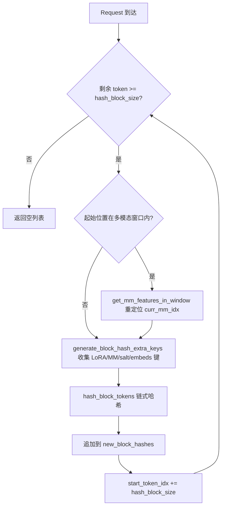
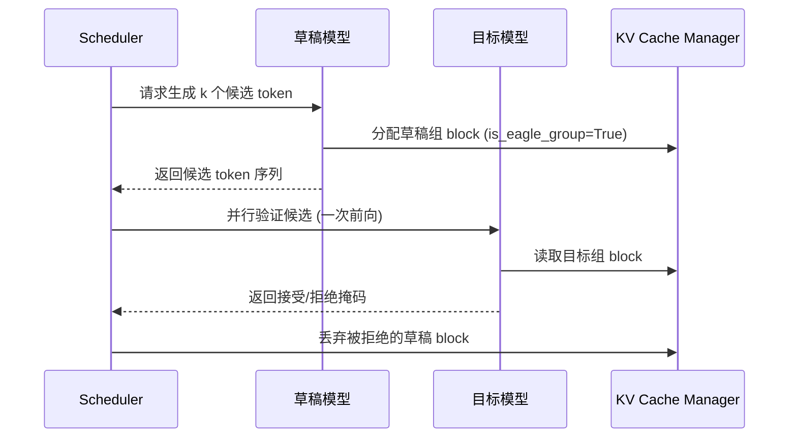

# Capítulo 12: Características avanzadas de inferencia: caché de prefijos, decodificación especulativa y LoRA

En el capítulo anterior profundizamos en el sistema de cuantización y la infraestructura de operadores personalizados de vLLM, vimos cómo se analiza la configuración de cuantización y se selecciona el kernel correspondiente, y cómo esquemas como FP8, INT4, AWQ y GPTQ completan la conversión durante la carga de pesos. Además, averiguamos cómo _custom_ops registra operadores CUDA, el mecanismo de programación de kernels Triton y cómo los kernels fusionados de MoE reducen los viajes de ida y vuelta a memoria. Estas capacidades de bajo nivel allanaron el camino para optimizaciones de inferencia más avanzadas. Este capítulo se centrará en tres características avanzadas de inferencia de vLLM: el caché de prefijos automático (APC), la decodificación especulativa y LoRA. Aunque parecen independientes, en realidad comparten el mismo conjunto de infraestructura subyacente: el hash de los bloques KV, la asignación de slots del planificador y la inyección dinámica de pesos durante la ejecución del modelo. La clave para entenderlas es comprender cómo llevan la «reutilización» al extremo sin romper la semántica de paginación de PagedAttention.

# 12.1 Caché de prefijos: cómo el block hash toma la huella digital de un prefijo

## Modelo intuitivo

El caché de prefijos es como el «cuaderno de extractos de párrafos comunes» de una biblioteca: dos estudiantes escriben una redacción y ambos comienzan citando el mismo pasaje clásico; el profesor solo necesita corregir ese pasaje una vez, y luego revisar por separado las partes diferentes de cada uno. Sin él, cada solicitud tendría que hacer prefill de todo el prompt desde el principio, y en escenarios de preguntas y respuestas sobre documentos largos la potencia de cálculo se consumiría repetidamente varias veces.

## Estructura de datos: del token al mapeo de block hash

El núcleo del caché de prefijos es «cómo determinar que los prefijos de dos solicitudes son iguales». La respuesta de vLLM es: dividir la secuencia de tokens en bloques y calcular un hash encadenado para cada bloque. Encadenado significa que el hash del N-ésimo bloque contiene el hash de los N-1 bloques anteriores, por lo que un block hash toma la huella digital única de todo el prefijo «desde el inicio de la secuencia hasta el final de ese bloque».

El portador del hash es`BlockHash`, que se define como`bytes`de`NewType`, y no como un`bytes`desnudo, con el objetivo de evitar a nivel de tipos el uso indebido de[FACT:vllm/v1/core/kv_cache_utils.py:59-62]. Cuando es necesario combinar el block hash con el KV cache group id para formar una clave de diccionario, vLLM no usa una tupla, sino que concatena directamente el group id de 4 bytes en big-endian al final de los bytes del hash[FACT:vllm/v1/core/kv_cache_utils.py:75-76]：

```python
def make_block_hash_with_group_id(block_hash, group_id):
    return BlockHashWithGroupId(block_hash + group_id.to_bytes(4, "big", signed=False))
```

> **[Design Inference & Architectural Trade-offs]**
> Esta es una optimización típica para «evitar la asignación de tuplas»: en la ruta caliente, cada búsqueda de bloque debe construir una clave; las tuplas aportan asignación adicional de objetos Python y sobrecarga de hash, mientras que la concatenación de cadenas de bytes se realiza en la capa C y la propia cadena de bytes ya es hashable. Al recuperar, se usa el slicing`key[:-4]`y`int.from_bytes(key[-4:])`para restaurar[FACT:vllm/v1/core/kv_cache_utils.py:87-89]。

La función de hash en sí corre a cargo de`hash_block_tokens`, que alimenta a la función de hash el hash del bloque padre, la tupla de token ids del bloque actual y las claves adicionales juntos[FACT:vllm/v1/core/kv_cache_utils.py:650-680]. Nótese que el hash padre del primer bloque no es`None`, sino el global`NONE_HASH`：

```python
if not parent_block_hash:
    parent_block_hash = NONE_HASH
```

[FACT:vllm/v1/core/kv_cache_utils.py:674-675]。`NONE_HASH`La elección de la semilla de`"vllm-none-hash"`esconde un diseño de seguridad: para hashes criptográficos como SHA-256, la semilla es fija[FACT:vllm/v1/core/kv_cache_utils.py:105-126]。`resolve_none_hash_seed`, lo que hace que distintos procesos de vLLM calculen el mismo hash para el mismo contenido y así compartan el caché de prefijos entre nodos; en cambio, para hashes no criptográficos como xxhash, la semilla es aleatoria por proceso, porque una semilla predecible permitiría a un atacante precalcular offline bloques en colisión`PYTHONHASHSEED`implementa esta bifurcación:`os.urandom(32)` [FACT:vllm/v1/core/kv_cache_utils.py:132-145]。

## la variable de entorno tiene prioridad; en caso contrario, los hashes criptográficos usan una semilla fija y los no criptográficos usan

Supongamos que una solicitud entra con 128 tokens y el block size es 16.`get_request_block_hasher`El cierre devuelto se encarga del cálculo incremental[FACT:vllm/v1/core/kv_cache_utils.py:802-861]：

Primer paso, determinar desde dónde empezar a calcular.`start_token_idx = len(request.block_hashes) * hash_block_size` [FACT:vllm/v1/core/kv_cache_utils.py:812-812], es decir, el número de bloques ya calculados multiplicado por el tamaño de bloque. Si los tokens restantes no alcanzan un bloque, se devuelve vacío directamente[FACT:vllm/v1/core/kv_cache_utils.py:812-812]。

Segundo paso, manejar el desplazamiento multimodal. Si la posición inicial cae dentro de alguna entrada multimodal, se necesita usar`get_mm_features_in_window`para reposicionar`curr_mm_idx` [FACT:vllm/v1/core/kv_cache_utils.py:823-832]. Esto se debe a que el token placeholder de la entrada multimodal en sí no lleva semántica; es necesario incorporar el identificador de característica mm y su desplazamiento dentro del bloque como claves adicionales en el hash.

Tercer paso, calcular cada bloque en bucle.`generate_block_hash_extra_keys`Recopilar todas las claves adicionales[FACT:vllm/v1/core/kv_cache_utils.py:611-647], incluyendo nombre de LoRA, clave multimodal, cache salt, hash de prompt embeds. De estos, cache salt solo tiene efecto en el primer bloque[FACT:vllm/v1/core/kv_cache_utils.py:633-635], esto es intencional: la función de salt es aislar todo el espacio de nombres de caché, solo necesita inyectarse una vez en el punto de inicio de la cadena.

Cuarto paso,`hash_block_tokens`hashear juntos el hash padre, la tupla de tokens y las claves adicionales, y el resultado se usa como hash padre del siguiente bloque[FACT:vllm/v1/core/kv_cache_utils.py:851-857]. La estructura en cadena se forma así.

## Conversión de granularidad con múltiples block sizes

Cuando el modelo tiene múltiples grupos de KV cache y los block sizes son diferentes, la granularidad del hash y la granularidad de bloque del grupo pueden no coincidir.`BlockHashListWithBlockSize`Resolver este problema: no recalcula el hash, sino que aprovecha la propiedad del hash en cadena — el hash de un target block es el hash de su último hash block interno[FACT:vllm/v1/core/kv_cache_utils.py:2781-2851]. Por ejemplo, cuando el hash block es 16 y el target block es 32, el hash de los tokens 0-31 es el segundo hash de tamaño 16 (que ya cubre en cadena 0-31)[FACT:vllm/v1/core/kv_cache_utils.py:2794-2806]。`_get_value_at`La implementación es`self.block_hashes[(idx + 1) * self.scale_factor - 1]` [FACT:vllm/v1/core/kv_cache_utils.py:2848-2851]。



## Reflexiones de diseño y trampas encontradas

**¿Por qué usar hash en cadena en lugar de hash independiente?**El hash independiente no puede distinguir el caso de «el mismo bloque aparece en diferentes posiciones de prefijo». El hash en cadena hace que el block hash identifique de forma única todo el prefijo, lo cual es precisamente`find_longest_cache_hit`la premisa para poder reutilizar KV de forma segura.

**Trampa entre procesos del hash no criptográfico.**Si se usa xxhash y no se configura`PYTHONHASHSEED`, el`NONE_HASH`de cada proceso es diferente, lo que provoca que el caché de prefijos entre instancias falle por completo.`init_none_hash`Se imprimirá una advertencia[FACT:vllm/v1/core/kv_cache_utils.py:161-169]. En producción, si se despliegan múltiples instancias compartiendo caché, se debe configurar explícitamente`PYTHONHASHSEED`o cambiar a sha256.

**La sutileza del desplazamiento multimodal.** `_gen_mm_extra_hash_keys`Usar`(mm_identifier, offset - start_token_idx)`como clave adicional[FACT:vllm/v1/core/kv_cache_utils.py:552]. El desplazamiento es relativo al inicio del bloque, de modo que el mismo ítem mm al aparecer en diferentes posiciones de bloque produce hashes distintos, evitando falsos aciertos.

# 12.2 Decodificación especulativa: la colaboración entre borrador y verificación

## Modelo intuitivo

La decodificación especulativa es como si una secretaria redactara primero varias versiones de respuesta para el jefe, y el jefe solo tuviera que marcar rápidamente cuál sirve. El modelo borrador (drafter) predice múltiples tokens candidatos con un costo extremadamente bajo, y el modelo objetivo (target) verifica en paralelo estos candidatos en un solo forward, aceptando la parte que coincide. Sin esto, el modelo objetivo solo podría generar token por token de forma serial, y la utilización de GPU en la fase de decode sería extremadamente baja.

## Estructura de datos: anotación del EAGLE group

El problema central de la decodificación especulativa en la gestión de KV cache es: ¿cómo se agrupan las capas KV del modelo borrador con las capas KV del modelo objetivo?`_annotate_eagle_groups`Se usan dos reglas para identificar el grupo borrador[FACT:vllm/v1/core/kv_cache_utils.py:2134-2189]：

Regla uno, impulsada por spec:`non_causal_multi_token_decode`El flag se declara en`MLAAttentionSpec`, lo establece la capa de atención borrador que ejecuta decode multi-token no causal, y puede sobrevivir a la operación`merge`de[FACT:vllm/v1/core/kv_cache_utils.py:2175-2177]。

Regla dos, retroceso por posición: los borradores MTP (como DeepseekV4/V4.1 DSpark) reutilizan las propias capas decoder del modelo objetivo, no tienen marca en spec, pero sus capas de atención borrador siempre se registran después de todas las capas objetivo, por lo que se anota el grupo que contiene la última capa registrada[FACT:vllm/v1/core/kv_cache_utils.py:2183-2184]. Esta regla solo tiene efecto cuando el grupo divide exactamente`kv_cache_spec`todas las capas[FACT:vllm/v1/core/kv_cache_utils.py:2183-2184]。

## Impulsado por escenario: asignación de KV en decodificación especulativa

Cuando`speculative_config`está habilitado y`use_eagle_block_drop()`es verdadero,`_annotate_eagle_groups`se invoca[FACT:vllm/v1/core/kv_cache_utils.py:2175-2177]. El resultado de la anotación`is_eagle_group`afecta la estrategia posterior de asignación de bloques — los bloques del grupo borrador pueden descartarse tras la verificación.

En la ruta principal de`get_kv_cache_groups`, la anotación ocurre después de la agrupación[FACT:vllm/v1/core/kv_cache_utils.py:2364-2365]. Si ningún grupo es anotado como grupo borrador,`_warn_if_unannotated_eagle_mamba`emitirá una advertencia[FACT:vllm/v1/core/kv_cache_utils.py:2192-2222]。



## Reflexiones de diseño y trampas encontradas

**¿Por qué el grupo borrador necesita anotación separada?**Los tokens generados por el modelo borrador pueden ser rechazados tras la verificación, y el KV correspondiente debe descartarse. Si el KV borrador y el KV objetivo se mezclan en el mismo grupo, la operación de descarte afectaría por error al KV objetivo. La anotación permite al planificador recuperarlos con precisión.

**Fragilidad de la regla de retroceso por posición.**La regla dos depende de la convención de que «la capa borrador se registra al final»; en los comentarios se marca explícitamente como hacky check y se deja un FIXME[FACT:vllm/v1/core/kv_cache_utils.py:2158-2159]. Cuando el caché de cola del borrador abarca múltiples grupos, esta regla solo anota el grupo que contiene la última capa, y necesita generalizarse.

**Restricciones adicionales de los modelos Mamba.**Si se habilita la decodificación especulativa pero ningún grupo se identifica como grupo borrador, y existe un grupo Mamba, se activa una advertencia[FACT:vllm/v1/core/kv_cache_utils.py:2211-2213]. Esto normalmente significa que la spec de la capa borrador no se puede distinguir de la capa objetivo, y es necesario verificar el orden de registro del modelo.

# 12.3 LoRA: adaptadores dinámicos sin recargar la base

## Modelo intuitivo

LoRA es como cambiarle la funda a un mismo teléfono: el cuerpo del teléfono (modelo base) no cambia, y al cambiar la funda (adaptador) se convierte en un estilo diferente. Sin esto, cada tarea de ajuste fino tendría que cargar una copia completa de los pesos, y la memoria de video no podría soportarlo.

## Estructura de datos: caché LRU doble y arreglo de slots

`LoRAModelManager`Se usan dos cachés LRU para gestionar el ciclo de vida de los adaptadores[FACT:vllm/lora/model_manager.py:115-120]：

```python
self._registered_adapters: AdapterLRUCache[LoRAModel] = AdapterLRUCache(
    self.capacity, self.deactivate_adapter
)
self._active_adapters: AdapterLRUCache[None] = AdapterLRUCache(
    self.lora_slots, self._deactivate_adapter
)
```

`capacity`Es el número total de adaptadores que se pueden almacenar en caché del lado de CPU (`max_cpu_loras`）[FACT:vllm/lora/model_manager.py:340-342]，`lora_slots`Es el número de adaptadores que se pueden activar simultáneamente del lado de GPU (`max_loras`）[FACT:vllm/lora/model_manager.py:345-346]。`_registered_adapters`Cuando se elimina, se activa`deactivate_adapter`callback[FACT:vllm/lora/model_manager.py:71-74], lo que asegura que al desalojar la caché de CPU también se limpien las copias en GPU.

`lora_index_to_id`Es un arreglo de longitud`lora_slots`que mapea índices de slot de GPU a id de adaptador[FACT:vllm/lora/model_manager.py:122]. Este arreglo es el índice central cuando el punica wrapper realiza cálculos LoRA por lotes.

## Guiado por escenarios: activación de adaptadores

Cuando una solicitud llega con un adaptador LoRA,`activate_adapter`se invoca[FACT:vllm/lora/model_manager.py:352-409]：

Primer paso, verificar si ya está activado; si lo está, retornar directamente[FACT:vllm/lora/model_manager.py:352-354]。

Segundo paso, buscar un slot libre. Recorrer`lora_index_to_id`para encontrar el primer`None` [FACT:vllm/lora/model_manager.py:362-362]. Si no hay slot libre, lanzar`ValueError("No free lora slots")` [FACT:vllm/lora/model_manager.py:368-368]。

Tercer paso, actualizar el estado y recorrer todos los módulos envueltos, invocando`module.set_lora(index, lora_a, lora_b)`para copiar los pesos al stacked buffer de GPU[FACT:vllm/lora/model_manager.py:377-401]. Si algún módulo no tiene pesos LoRA correspondientes, invocar`reset_lora(index)`para poner a cero[FACT:vllm/lora/model_manager.py:378-385]。

Cuarto paso, si no se aplicó ningún peso, imprimir un log de depuración único[FACT:vllm/lora/model_manager.py:411-416]. Esto es el comportamiento esperado bajo paralelismo de pipeline o paralelismo de expertos: algunos ranks no poseen las capas adaptadas.

## Envoltura de módulos: de nn.Linear a BaseLayerWithLoRA

`_create_lora_modules`Recorrer todos los módulos nombrados del modelo[FACT:vllm/lora/model_manager.py:462-606]. Lógica clave:

- Omitir`PPMissingLayer` [FACT:vllm/lora/model_manager.py:473-474]。
- Filtrar según`target_modules`: si no se especifica, usar`is_supported_lora_module`para determinar; de lo contrario usar`_match_target_modules` [FACT:vllm/lora/model_manager.py:479-493]。
- Manejar módulos alias: un mismo módulo subyacente puede ser accedido por múltiples rutas (por ejemplo, el gate de MoE está tanto en el block como dentro del runner). En este caso, redirigir el atributo alias al mismo wrapper, pero no registrarlo de nuevo, de lo contrario`activate_adapter`invocará sobre el alias`reset_lora`y borrará los pesos recién establecidos[FACT:vllm/lora/model_manager.py:512-527]。
- Usar`from_layer`para crear el wrapper y reemplazar el módulo original[FACT:vllm/lora/model_manager.py:546-553]。

## Reflexiones de diseño y trampas

**Los cambios en el diseño de slots activan la actualización del mapeo.** `set_adapter_mapping`No solo compara si el mapping cambió, sino que también compara`lora_index_to_id`la instantánea de tupla de[FACT:vllm/lora/model_manager.py:1323-1331]. La razón está claramente explicada en los comentarios: un`add_lora()`fuera de banda puede activar el desalojo LRU y reasignar slots, mientras que el batch en ejecución y su mapping no cambiaron[FACT:vllm/lora/model_manager.py:1323-1331]. Si solo se mira el mapping, los metadatos de punica usarán un diseño de slots obsoleto.

**Segmentación EP de MoE.**Cuando se habilita el paralelismo de expertos, el checkpoint posee los pesos de todos los expertos globales, pero cada rank solo posee`local_num_experts`.`_stack_moe_lora_weights`Primero según`global_num_experts`reshape, luego segmentar`[expert_start:expert_end]` [FACT:vllm/lora/model_manager.py:966-977]. Cuando no es EP, la segmentación es no-op.

**Momento de pin_memory.**El empaquetado de pesos (como`pack_moe`) puede invalidar la asignación de pin_memory, por lo que pin_memory se ejecuta después de fusionar todos los pesos[FACT:vllm/lora/model_manager.py:916-934]. Los comentarios señalan explícitamente dos razones: los modelos MoE tienen una gran cantidad de pesos LoRA, y hacer pin demasiado pronto tiene un costo notable; el empaquetado puede invalidar la asignación[FACT:vllm/lora/model_manager.py:916-921]。

# Reflexión de diseño: el punto de sinergia de los tres

Las tres características convergen en la capa de gestión de KV cache. La caché de prefijos reutiliza KV mediante block hash; la decodificación especulativa mediante`is_eagle_group`anotaciones para distinguir KV borrador; LoRA mediante`_gen_lora_extra_hash_keys`incorpora el nombre del adaptador al block hash[FACT:vllm/v1/core/kv_cache_utils.py:568-581], asegurando que secuencias de tokens idénticas con adaptadores diferentes no colisionen erróneamente entre sus KV.

`generate_block_hash_extra_keys`Coloca la clave LoRA al principio de la lista de claves adicionales[FACT:vllm/v1/core/kv_cache_utils.py:640-642], junto con las claves multimodales, cache salt y prompt embeds, formando la entrada hash completa. Esto garantiza que: incluso si dos solicitudes tienen tokens completamente idénticos, siempre que sus adaptadores LoRA sean diferentes, sus block hash serán diferentes y los KV no se mezclarán.

# Resumen del capítulo

# Reflexiones y autoevaluación del capítulo

Q1: Si se elimina la lógica de semilla aleatoria del hash no criptográfico en`init_none_hash`y se cambia a usar siempre una semilla fija, ¿en qué escenarios se introduciría un riesgo de seguridad? ¿Por qué los comentarios del código fuente enfatizan especialmente que xxhash requiere una semilla secreta?

**Análisis de referencia**: El código fuente en`_NON_CRYPTO_HASH_FUNCTIONS`enumera explícitamente xxhash y xxhash_cbor como algoritmos no resistentes a colisiones[FACT:vllm/v1/core/kv_cache_utils.py:125-126]。`resolve_none_hash_seed`para este tipo de algoritmos retorna`os.urandom(32).hex()` [FACT:vllm/v1/core/kv_cache_utils.py:143-144]. Si se cambiara a una semilla fija, un atacante podría precalcular offline bloques que colisionen con el prefijo objetivo, construyendo solicitudes con el mismo hash pero contenido diferente, logrando así acceder y leer el KV cache de otros: esto es una filtración de información entre solicitudes. La resistencia a colisiones de SHA-256 no depende del secreto de la semilla, por lo que una semilla fija solo afecta la reproducibilidad, no la seguridad[FACT:vllm/v1/core/kv_cache_utils.py:97-111]。

Q2: `_create_lora_modules`al manejar módulos alias en`register_module`, si se elimina la lógica de "no registrar de nuevo" y se invoca directamente también sobre el alias`activate_adapter`¿qué ocurre? Por favor, analízalo en combinación con`reset_lora`la ruta de llamada de

**Análisis de referencia**：`activate_adapter`recorre`self.modules`y para cada módulo llama a`set_lora`o`reset_lora` [FACT:vllm/lora/model_manager.py:377-401]. Si tanto el alias como el nombre canónico están registrados, se accederá dos veces al mismo wrapper subyacente. En la ruta del nombre canónico,`_get_lora_layer_weights`puede encontrar los pesos y llamar a`set_lora`para escribir; en la ruta del alias, debido a que los nombres no coinciden,`_get_lora_layer_weights`devuelve None, lo que activa`reset_lora(index)` [FACT:vllm/lora/model_manager.py:378-385], poniendo a cero los pesos recién escritos. Los comentarios del código fuente señalan explícitamente esta trampa[FACT:vllm/lora/model_manager.py:519-523]. La forma correcta es redirigir el atributo alias al mismo wrapper pero sin registrarlo de nuevo[FACT:vllm/lora/model_manager.py:531-537]。

Q3: `BlockHashListWithBlockSize`depende de la propiedad de que «el hash del target block es igual al hash de su último hash block interno». Si la función hash no es encadenada (es decir, cada block se hashea de forma independiente), ¿puede esta clase seguir funcionando correctamente? ¿En qué casos se producirían aciertos de caché incorrectos?

**Análisis de referencia**: No.`_get_value_at`devuelve directamente`self.block_hashes[(idx + 1) * self.scale_factor - 1]` [FACT:vllm/v1/core/kv_cache_utils.py:2848-2851], la premisa de esta implementación es que el hash del último hash block ya cubre de forma encadenada todos los tokens anteriores a él. Si el hash es independiente, este valor solo fingerprinta el contenido del último hash block, no todo el target block. Dos target blocks pueden diferir en la primera parte pero tener el mismo último hash block, lo que provoca una colisión de hash,`find_longest_cache_hit`reutilizará erróneamente un KV que no coincide. Los comentarios del código fuente indican explícitamente «Each hash_block_size hash is already chained over its entire prefix»[FACT:vllm/v1/core/kv_cache_utils.py:2787-2792]。

El siguiente capítulo se centrará en el sistema de plugins y la extensibilidad, para ver cómo vLLM admite formas de despliegue diversas mediante la abstracción de plataformas, los procesadores de IO y la extensión de endpoints.

Este capítulo analiza los mecanismos subyacentes de las tres características avanzadas de inferencia de vLLM. El núcleo de la caché de prefijos es el hash de bloques encadenado: hash_block_tokens hashea juntos el hash padre, la tupla de tokens y las claves adicionales, y la estrategia de semilla de NONE_HASH equilibra el uso compartido entre procesos y la seguridad frente a colisiones. La decodificación especulativa distingue los grupos de KV de borrador mediante la anotación is_eagle_group. LoRA gestiona el ciclo de vida de los adaptadores mediante una caché LRU doble y un arreglo de slots, y mezcla el nombre del adaptador en el hash de bloques para lograr el aislamiento de caché. Estas características muestran en conjunto la profundidad y flexibilidad de vLLM en la optimización de inferencia. A continuación, nos centraremos en el sistema de plugins y la extensibilidad de vLLM, para ver cómo los plugins de plataforma se adaptan a nuevo hardware, cómo los plugins de IO processor intervienen en el procesamiento de entradas multimodales y cómo los plugins de endpoints inyectan rutas de API personalizadas. Comprender el orden de carga del registro y descubrimiento de plugins revelará cómo ampliar las capacidades de vLLM sin modificar el código central.
