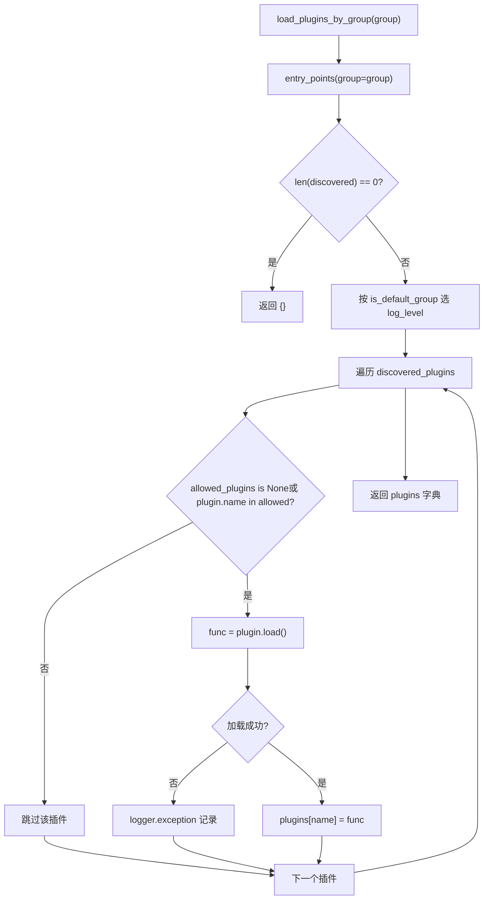
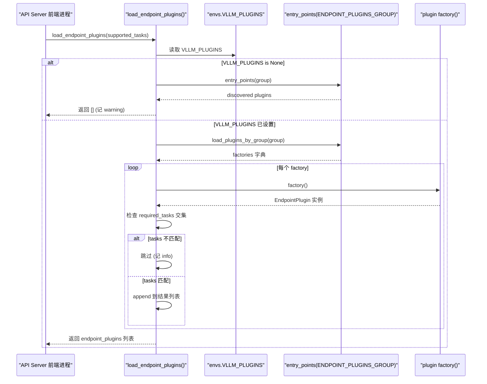

# Capítulo 13: Sistema de plugins y extensibilidad: plataformas, procesadores de IO y extensión de endpoints

En el capítulo anterior vimos que características avanzadas como la caché de prefijos, la decodificación especulativa y LoRA están profundamente acopladas en las rutas centrales del planificador, la gestión de KV y la ejecución del modelo. Pero para que un motor de inferencia llegue realmente a producción, no basta con el rendimiento: debe responder a una pregunta más espinosa: cuando la comunidad quiere integrar nuevo hardware, un nuevo formato de entrada multimodal o una ruta HTTP personalizada, ¿cómo hacerlo sin forkear el código central? Este es precisamente el sentido de la existencia del sistema de plugins. La arquitectura de vLLM es naturalmente multiproceso: el proceso frontend del API Server, el proceso EngineCore y el proceso Worker correspondiente a cada rango TP/PP. Si el mecanismo de plugins simplemente «ejecutara un fragmento de código al importar», entonces o bien se ejecutaría repetidamente en cada proceso provocando una acumulación de efectos secundarios, o bien se ejecutaría solo en el proceso principal y los Workers no obtendrían la extensión. Lo que este capítulo va a desglosar es cómo vLLM utiliza el mecanismo estándar de entry_points de Python, junto con la triple restricción de grupo + límite de proceso + momento de carga, para construir un sistema de plugins que cubra todos los procesos y a la vez controle con precisión la superficie expuesta. Nos centramos en tres líneas principales: plugins de plataforma (adaptación a nuevo hardware), plugins de IO processor (intervención en el procesamiento de entradas multimodales) y plugins de endpoints (inyección de rutas de API personalizadas). Las estrategias de carga de los tres son completamente distintas; comprender esta diferencia es comprender la filosofía de equilibrio de vLLM entre «capacidad de extensión» y «límite de seguridad».

# I. Descubrimiento y carga de plugins: el contrato de agrupación de entry_points

## Modelo intuitivo: los «canales de difusión» de los plugins

Imagina el sistema de plugins de vLLM como un conjunto de canales de difusión. Cada paquete de plugin, al instalarse, mediante`setup.py`de`entry_points`«registra» en algún canal su indicativo (plugin name) y su función de respuesta (plugin value). vLLM escanea estos canales al arrancar y decide qué canales se «escuchan» en qué procesos.

Sin este mecanismo, extender vLLM solo sería posible modificando el código fuente: cada vez que la comunidad añadiera hardware, habría que mantener un fork, lo que acabaría fragmentando las versiones. El valor del mecanismo de agrupación radica en:**Un mismo paquete de plugin puede registrarse solo en un canal específico, quedando limitado a cargarse en un proceso determinado**。

## Estructura de datos: cinco constantes de grupo y una bandera global

vLLM define en`vllm/plugins/__init__.py`la parte superior cinco constantes de entry point group, cada una correspondiente a una estrategia de carga:

[FACT:vllm/plugins/__init__.py:16-30]

```python
DEFAULT_PLUGINS_GROUP = "vllm.general_plugins"
IO_PROCESSOR_PLUGINS_GROUP = "vllm.io_processor_plugins"
PLATFORM_PLUGINS_GROUP = "vllm.platform_plugins"
STAT_LOGGER_PLUGINS_GROUP = "vllm.stat_logger_plugins"
ENDPOINT_PLUGINS_GROUP = "vllm.endpoint_plugins"
```

En los comentarios se esconde información clave:`DEFAULT_PLUGINS_GROUP`en**todos los procesos**cargar (process0, engine core, worker);`IO_PROCESSOR_PLUGINS_GROUP` **solo en process0**；`PLATFORM_PLUGINS_GROUP`se carga en todos los procesos, pero el momento de activación es`current_platform`la primera vez que se accede;`STAT_LOGGER_PLUGINS_GROUP`solo en process0 y en modo asíncrono;`ENDPOINT_PLUGINS_GROUP`solo en el proceso frontend del API Server.

Inmediatamente después hay una variable global a nivel de módulo`plugins_loaded = False` [FACT:vllm/plugins/__init__.py:32-33]que actúa como guarda para la carga idempotente — el comentario dice explícitamente "make sure one process only loads plugins once".

## Paso a paso: una`load_plugins_by_group`secuencia completa de llamadas

Supongamos el escenario: el usuario registró en`setup.py``vllm.general_plugins`bajo`register_dummy_model`y ahora vLLM arranca, algún proceso llama a`load_general_plugins()`。

**Primer paso: guarda de idempotencia.** `load_general_plugins`Primero comprueba`plugins_loaded`si ya es`True`devuelve directamente[FACT:vllm/plugins/__init__.py:77-90]. Aquí hay una sutileza: la guarda se activa**antes**de cargar, lo que significa que aunque la carga posterior lance una excepción, no se reintentará. Esto es intencional — un fallo en la carga de un plugin no debería provocar que el proceso lo intente repetidamente.

**Segundo paso: descubrimiento.**Entra en`load_plugins_by_group`y mediante`importlib.metadata.entry_points(group=group)`obtiene todos los entry points instalados bajo ese grupo[FACT:vllm/plugins/__init__.py:36-45]. Si está vacío, registra un log de debug y devuelve un diccionario vacío.

**Tercer paso: niveles de log.**El código fuente distingue el nivel de log entre grupos por defecto y no por defecto:`is_default_group`cuando es verdadero usa`logger.debug`, de lo contrario usa`logger.info` [FACT:vllm/plugins/__init__.py:47-54]. La motivación es práctica —`vllm.general_plugins`normalmente agrupa una gran cantidad de plugins de registro de modelos, y usar INFO saturaría los logs; en cambio, los plugins de plataforma/endpoint son pocos e importantes, y merecen ser visibles con INFO.

**Cuarto paso: filtrado por lista blanca.**Lee`envs.VLLM_PLUGINS`, si es`None`carga todos, de lo contrario solo carga los plugins cuyos nombres estén en la lista[FACT:vllm/plugins/__init__.py:62-70]. Nótese que`plugin.load()`está envuelto en try/except, de modo que el fallo de carga de un solo plugin solo registra un log de exception y no afecta a los demás plugins[FACT:vllm/plugins/__init__.py:68-72]。

**Quinto paso: ejecución.**Vuelve a`load_general_plugins`y para cada función cargada llama directamente a`func()` [FACT:vllm/plugins/__init__.py:77-90]. Por eso la documentación insiste en que las funciones de plugin deben ser**reentrantes (re-entrant)**— pueden ser llamadas múltiples veces en múltiples procesos.

El siguiente diagrama de flujo describe la`load_plugins_by_group`ruta de decisión completa de



## Reflexión de diseño: por qué usar entry_points en lugar de un archivo de configuración

> **[Design Inference & Architectural Trade-offs]**
> Elegir`entry_points`en lugar de un archivo de configuración personalizado tiene como motivación central**distribuir los plugins junto con el paquete de Python**. Después de que el usuario`pip install vllm-add-dummy-platform`, el plugin aparece automáticamente en el grupo correspondiente, sin necesidad de editar manualmente la configuración de vLLM. Esto sigue la misma línea que el ecosistema de plugins de herramientas como pytest o flake8. El coste es que el descubrimiento de plugins depende de los metadatos del paquete; si el paquete del plugin no se instala completamente (por ejemplo, si solo se copió el directorio de código fuente sin pasar por pip), entry_points no lo detectará.

---

# II. Plugins de plataforma: la capa de abstracción para la adaptación de hardware

## Modelo intuitivo: la plataforma es el "traductor de dialectos de hardware"

`Platform`La clase**es el único traductor**de toda la conversación entre vLLM y el hardware. El código del modelo solo llama a`current_platform.get_attn_backend_cls()`、`current_platform.is_cuda_alike()`métodos abstractos como`import torch.cuda`, nunca directamente a`if device == "xpu"`. Sin esta capa de abstracción, cada vez que se soportara un nuevo hardware habría que añadir ramas de

## en el código del modelo, lo que acabaría convirtiéndose en espagueti.

`Platform`Estructura de datos: disposición de campos de la clase base Platform`vllm/platforms/interface.py`es una clase pura (no se usa instanciada), y sus atributos de clase clave se definen al inicio de[FACT:vllm/platforms/interface.py:135-179]：

```python
class Platform:
    _enum: PlatformEnum
    device_name: str
    device_type: str
    dispatch_key: str = "CPU"
    ray_device_key: str = ""
    device_control_env_var: str = "VLLM_DEVICE_CONTROL_ENV_VAR_PLACEHOLDER"
    ray_noset_device_env_vars: list[str] = []
    simple_compile_backend: str = "inductor"
    dist_backend: str = ""
    supported_quantization: list[str] = []
    additional_env_vars: list[str] = []
    _global_graph_pool: Any | None = None
```

`_enum`es el valor de enumeración de`PlatformEnum`que determina`is_cuda()`、`is_rocm()`y otras comprobaciones[FACT:vllm/platforms/interface.py:69-78]。`device_control_env_var`es la abstracción de "variable de entorno de visibilidad de dispositivo" independiente de la plataforma — CUDA es`CUDA_VISIBLE_DEVICES`, y otras plataformas definen cada una su[FACT:vllm/platforms/interface.py:151-152]。`_global_graph_pool`es la caché de memoria de CUDA graph a nivel de clase, inicializada de forma perezosa mediante`get_global_graph_pool`[FACT:vllm/platforms/interface.py:1210-1215]。

Cabe destacar la lógica de respaldo de`__getattr__`[FACT:vllm/platforms/interface.py:1189-1208]: cuando se accede a un atributo que no existe en Platform, intenta reenviarlo desde el espacio de nombres`torch.<device_type>`. Esto permite que el código de plataforma escriba`current_platform.memory_allocated()`mientras en realidad llama a`torch.cuda.memory_allocated()`. Pero el código fuente excluye deliberadamente los métodos dunder — de lo contrario, al comprobar pickle`__getstate__`obtendría`None`e intentaría llamarlo[FACT:vllm/platforms/interface.py:1182-1185]。

## Paso a paso: la conversión de device ID entre tres espacios de nombres

Lo más propenso a errores en la abstracción de plataforma es el**espacio de nombres de device ID**. Los comentarios del código fuente enumeran explícitamente tres[FACT:vllm/platforms/interface.py:275-283]：

- **logical**: el local rank interno de vLLM, que indexa`_assigned_physical_gpu_ids`
- **visible**: el número de torch/CUDA tras el remapeo de`CUDA_VISIBLE_DEVICES`en el proceso actual
- **physical**: el GPU ID global usado por APIs de topología como NVML, no afectado por variables de entorno

Supongamos el escenario: a un proceso Worker se le asigna la GPU física`[4, 5]`, la variable de entorno`CUDA_VISIBLE_DEVICES=4,5`, y ahora hay que convertir el local rank 0 a`torch.device("cuda:0")`。

**Primer paso: logical → physical.** `device_id_to_physical_device_id(0)`Primero consulta`_assigned_physical_gpu_ids`, si ya está establecido lo indexa y devuelve directamente`4` [FACT:vllm/platforms/interface.py:296-297]. Si no está establecido, divide la lista separada por comas de`device_control_env_var`y toma el elemento 0[FACT:vllm/platforms/interface.py:305-311]. Nótese que el código fuente trata deliberadamente la**cadena vacía**como no establecida — esta es una configuración válida cuando Ray arranca el motor sobre un placement group puramente de CPU[FACT:vllm/platforms/interface.py:296-297]。

**Segundo paso: physical → visible.** `logical_device_id_to_visible_device_id(0)`Una vez obtenido physical`4`, se descompone la variable de entorno en`[4, 5]`, se busca`4`el índice de`0`y se devuelve[FACT:vllm/platforms/interface.py:316-339]. Si el physical ID no está en la lista visible, se lanza`RuntimeError`——esta es una protección estricta para evitar el uso indebido de dispositivos no visibles entre procesos.

`set_assigned_physical_gpu_ids`El diseño idempotente de`RuntimeError` [FACT:vllm/platforms/interface.py:38-56]también merece atención: establecer el mismo valor repetidamente es una no-op, mientras que establecer un valor diferente lanza

## . Esto evita que el mapeo de dispositivos sea sobrescrito accidentalmente en entornos multihilo.

Registro de plugins de plataforma e inyección de configuración`vllm.platform_plugins`Los plugins de plataforma se registran mediante el grupo`None`, y la función del plugin devuelve el nombre completamente cualificado de la clase de plataforma (o[FACT:docs/design/plugin_system.md:50-50]para indicar que el entorno actual no es compatible)[FACT:docs/design/plugin_system.md:100-100]：

- `_enum`. La implementación mínima proporcionada por la documentación requiere que`PlatformEnum.OOT`（out-of-tree）
- `device_type`normalmente se establezca en
- `check_and_update_config`y devuelva la cadena de tipo de dispositivo que PyTorch reconoce**se invoca temprano durante la inicialización de vLLM,`worker_cls`**
- `get_attn_backend_cls`y se debe establecer aquí
- `get_device_communicator_cls`devuelve el nombre de la clase del backend de atención

`check_and_update_config`devuelve el nombre de la clase del comunicador[FACT:vllm/platforms/interface.py:583-592]es el hook más crítico del plugin de plataforma`VllmConfig`. Recibe una referencia a[FACT:docs/design/plugin_system.md:105-105]y la modifica in situ, pudiendo ajustar block size, graph mode, etc. La documentación enfatiza que "lo más importante es que worker_cls debe establecerse aquí"

## ——porque vLLM necesita saber qué clase Worker usar para instanciar el proceso de trabajo.

Reflexión de diseño: estrategia de tres fases para la alineación del block size`update_block_size_for_backend` [FACT:vllm/platforms/interface.py:666-708]La lógica más compleja en la interfaz de plataforma es

**Phase 1**. Se divide en tres fases para garantizar que el block size sea compatible con el backend de atención:`--block-size`: si el usuario no especifica explícitamente`_preferred_block_size_for_backends`, se llama a[FACT:vllm/platforms/interface.py:687-697]para seleccionar el block size mínimo compatible con todos los backends[FACT:vllm/platforms/interface.py:622-663]。

**Phase 2**. Esta función enumera valores candidatos usando LCM (mínimo común múltiplo), porque algunos backends (como CPU_MLA) solo aceptan tamaños exactos y no múltiplos[FACT:vllm/platforms/interface.py:699-702]。

**Phase 3**: los modelos híbridos (attention + mamba) necesitan alinear el block con el mamba page size[FACT:vllm/platforms/interface.py:704-708]。

> **[Design Inference & Architectural Trade-offs]**
> 〔Inferencia de diseño y compensaciones arquitectónicas〕

---

# Este diseño por fases refleja la realidad que enfrenta vLLM: las restricciones sobre el block size de diferentes hardware, esquemas de cuantización y arquitecturas de modelos entran en conflicto entre sí, y no pueden resolverse con una única fórmula. Dividirlo en fases permite que cada restricción se maneje de forma independiente y, finalmente, se tome la solución que satisface todas las restricciones.

## III. IO Processor y plugins de endpoint: procesamiento de entrada y extensión de API

Modelo intuitivo: IO Processor es una "capa de traducción multimodal"

## La entrada de un modelo multimodal (como LLaVA) no es texto puro, sino una mezcla de texto + imágenes. El plugin IO Processor se encarga de convertir los datos multimodales originales en tensores que el modelo puede consumir, y luego convertir la salida del modelo de vuelta a un formato legible por humanos. Es como un traductor de aduanas: el idioma extranjero que entra (imagen/audio) se traduce al idioma nativo del modelo, y el idioma nativo del modelo que sale se traduce de vuelta al idioma extranjero.

Paso a paso: descubrimiento e instanciación de IO Processor`io_processor_plugin`Escenario: cargar un modelo con un HF config que tiene el campo

**.** `get_io_processor`Primer paso: determinar el nombre del plugin.`plugin_from_init`Se prioriza el`hf_config`pasado explícitamente; de lo contrario, se lee`io_processor_plugin`desde el campo[FACT:vllm/plugins/io_processors/__init__.py:42-50]de`None`. Si ambos están vacíos, se devuelve[FACT:vllm/plugins/io_processors/__init__.py:52-54]。

**——lo que indica que el modelo no necesita IO processor**Segundo paso: cargar todos los plugins instalados.`load_plugins_by_group(IO_PROCESSOR_PLUGINS_GROUP)`Se llama a[FACT:vllm/plugins/io_processors/__init__.py:59-61]。

**para obtener todos los plugins de ese grupo**Tercer paso: construir el mapeo cargable.`processor_cls_qualname`Se recorre cada plugin, se llama a su función para obtener`None`, y si no es`loadable_plugins` [FACT:vllm/plugins/io_processors/__init__.py:66-76]se registra en

**. Nótese que la llamada a la función de cada plugin también está envuelta en try/except, de modo que un fallo individual no afecta a los demás.**Cuarto paso: validación e instanciación.`ValueError`Si el número de plugins cargables es 0, se lanza[FACT:vllm/plugins/io_processors/__init__.py:66-76]indicando "se requiere un plugin IOProcessor pero no hay ninguno instalado"`ValueError`. Si el nombre del plugin requerido por el modelo no está en la lista de cargables, se lanza[FACT:vllm/plugins/io_processors/__init__.py:80-81]y se listan todos los nombres de plugins disponibles`resolve_obj_by_qualname`. Finalmente, mediante[FACT:vllm/plugins/io_processors/__init__.py:80-81]。

## se resuelve el nombre de la clase y se instancia

Plugins de endpoint: postura de seguridad de denegación por defecto**Los plugins de endpoint son la categoría más especial de este capítulo, porque**。`load_endpoint_plugins`no se cargan por defecto`load_plugins_by_group`. La cadena de documentación de[FACT:vllm/plugins/__init__.py:93-94]。

explica claramente la razón: los plugins de endpoint añaden rutas HTTP al API Server, ampliando la superficie de exposición de red, por lo que adoptan una postura de "denegación por defecto" más estricta que**La regla concreta es: solo cuando el nombre del plugin`VLLM_PLUGINS`aparece explícitamente en**, y su`required_tasks`es`None`o tiene intersección con las tasks soportadas por el servidor, se carga[FACT:vllm/plugins/__init__.py:108-108]。

Escenario: el usuario instaló un plugin de endpoint pero olvidó establecer`VLLM_PLUGINS`。

**Primer paso: comprobar si VLLM_PLUGINS no está establecido.**Si`envs.VLLM_PLUGINS is None`, primero se descubren los plugins de ese grupo y, si los hay, se registra un warning indicando "debe estar explícitamente en la allowlist"[FACT:vllm/plugins/__init__.py:126-126]. Nótese que los comentarios del código fuente señalan especialmente:`VLLM_PLUGINS=""`se interpreta como`[""]`en lugar de`None`, por lo que se considera una "allowlist que no coincide con ningún plugin", en vez de "no establecido"[FACT:vllm/plugins/__init__.py:108-108]. Esta distinción de límites es importante——una cadena vacía es un "no cargar nada" explícito, mientras que`None`es "no configurado".

**Segundo paso: cargar e instanciar.**Tras obtener la función de fábrica mediante`load_plugins_by_group`, se llama una por una a`factory()`para instanciar[FACT:vllm/plugins/__init__.py:133-141]. Si la instanciación falla, se registra la excepción y se continúa.

**Tercer paso: control por task.**Se comprueba`plugin.required_tasks`, y si no es`None`y tiene intersección con`supported_tasks`Sin intersección, se omite este plugin[FACT:vllm/plugins/__init__.py:144-145]. Esto permite que el mismo paquete de plugin registre diferentes endpoints para distintas tareas (como embedding vs generation).

El siguiente diagrama de secuencia describe la interacción completa del plugin de endpoint desde el descubrimiento hasta la carga:



## Reflexión de diseño: el límite de proceso determina la estrategia de carga

La diferencia en las estrategias de carga de los tres tipos de plugins es, en esencia, un mapeo del**límite de proceso**:

| Tipo de plugin | Proceso de carga | Comportamiento predeterminado | Motivación |
| --- | --- | --- | --- |
| general | Todos los procesos | Carga completa | El registro del modelo debe ser visible en cada Worker |
| platform | Todos los procesos | Carga completa | La abstracción de hardware es dependida por todos los procesos |
| io_processor | Solo process0 | Carga completa | El procesamiento de entrada solo ocurre en el frontend |
| stat_logger | Solo process0 (asíncrono) | Carga completa | Los logs solo se recopilan en el proceso principal |
| endpoint | Solo API Server | **Rechazo predeterminado** | Amplía la superficie de exposición de red, requiere autorización explícita |

> **[Design Inference & Architectural Trade-offs]**
> El "rechazo predeterminado" de los plugins de endpoint es una práctica estándar de ingeniería de seguridad: cualquier extensión que amplíe la superficie de ataque debe ser opt-in. Mientras que otros plugins se cargan por defecto porque no exponen directamente interfaces de red y el ecosistema de la comunidad necesita una experiencia de integración de baja fricción.

## Trampa en producción: degradación silenciosa por fallo de carga de plugins

`load_plugins_by_group`Para cada plugin,`plugin.load()`se envuelve con try/except, y en caso de fallo solo se registra la exception[FACT:vllm/plugins/__init__.py:68-72]. Esto significa que**un plugin corrupto no impedirá que vLLM se inicie**, pero tampoco dará un error explícito—el usuario puede confundirse preguntándose "¿por qué mi plugin no funciona?".

Sugerencia de diagnóstico: ajusta el nivel de log a DEBUG, busca`"Failed to load plugin"`. Si el plugin está bajo el grupo`vllm.general_plugins`, el nivel de log predeterminado es DEBUG, y se necesita habilitarlo explícitamente para ver los detalles de carga[FACT:vllm/plugins/__init__.py:49-50]。

Otra trampa es el momento de activación del guardián`plugins_loaded`[FACT:vllm/plugins/__init__.py:77-90]: se establece antes de la carga`True`. Si la primera carga falla por alguna razón (como una excepción en el escaneo de entry_points), las llamadas posteriores retornarán directamente sin reintentar. Esto puede causar el extraño fenómeno de "el plugin funciona a veces sí y a veces no" en entornos de prueba.

---

# Resumen del capítulo

El sistema de plugins de vLLM se construye sobre Python`entry_points`, mediante**cinco constantes de grupo**se dividen los tipos de extensión, mediante**el límite de proceso**se determina el alcance de carga, mediante**`VLLM_PLUGINS`la lista blanca**se controla el conjunto de carga. Los plugins de plataforma usan la clase base`Platform`para abstraer las diferencias de hardware, y su conversión de tres espacios de nombres de device ID (logical/visible/physical) es el núcleo de la gestión de dispositivos entre procesos; los plugins de IO processor se activan mediante el campo`io_processor_plugin`del HF config, y se encargan de la traducción de entradas multimodales; los plugins de endpoint adoptan una postura de "rechazo predeterminado", y solo se cargan cuando hay un allowlist explícito y el task coincide, para controlar la superficie de exposición de red.

Las tres líneas principales comparten el mismo mecanismo de descubrimiento, pero las diferencias en las estrategias de carga reflejan el equilibrio de vLLM entre la "conveniencia de extensión" y el "límite de seguridad": los plugins que no exponen red se cargan por defecto, los plugins que exponen red deben ser opt-in.

# Reflexiones y autoevaluación de este capítulo

Q1: Si se elimina el try/except de`load_plugins_by_group`en`plugin.load()`, dejando que el fallo de carga se lance directamente, ¿qué impacto tendría en el inicio multiproceso de vLLM? ¿En qué escenarios sería en cambio un mejor diseño?

> **[Design Inference & Architectural Trade-offs]**
> **Análisis de referencia**: La implementación actual[FACT:vllm/plugins/__init__.py:68-72]hace que el fallo de carga de un solo plugin se trague silenciosamente, registrando solo un log de exception. Si se elimina el try/except, el fallo de carga se propagaría hacia arriba hasta`load_general_plugins`, interrumpiendo así el inicio del proceso. En escenarios multiproceso, esto causaría: si la carga de plugins de un proceso Worker falla, todo el motor no puede iniciarse—esto podría ser bueno (fallo rápido, evitando que algunos procesos funcionen con problemas causando inconsistencia de estado), o malo (un bug en un plugin opcional derriba todo el servicio). Un mejor diseño podría introducir una variable de entorno`VLLM_PLUGINS_STRICT`: permisivo por defecto (comportamiento actual), y en modo estricto el fallo de carga lanza una excepción. Así, el entorno de producción puede exigir que "todos los plugins declarados deben cargarse exitosamente", mientras que el entorno de desarrollo mantiene la tolerancia a fallos.

Q2: `load_endpoint_plugins`En`VLLM_PLUGINS=""`, ¿cuál es la diferencia de comportamiento entre`VLLM_PLUGINS`y`None`no establecido (

> **[Design Inference & Architectural Trade-offs]**
> **〔Inferencia de diseño y compensaciones arquitectónicas〕**Análisis de referencia`VLLM_PLUGINS=""`: Los comentarios del código fuente señalan explícitamente que`[""]`se interpreta como`None`en lugar de[FACT:vllm/plugins/__init__.py:108-108], por lo tanto se considera un "allowlist que no coincide con ningún plugin"`VLLM_PLUGINS is None`. Cuando`load_endpoint_plugins`,`[]`retorna directamente[FACT:vllm/plugins/__init__.py:126-126]y registra un warning`VLLM_PLUGINS=""`; mientras que cuando`load_plugins_by_group`, el código continúa hasta**, pero como la cadena vacía no coincide con ningún nombre de plugin, finalmente también retorna una lista vacía. Ambos tienen el**mismo resultado**(no se carga ningún plugin de endpoint), pero**：`None`semántica diferente`""`:

Q3: `device_id_to_physical_device_id`significa "el usuario no configuró, nosotros rechazamos activamente y advertimos",`device_control_env_var`significa "el usuario configuró explícitamente un allowlist vacío, respetamos su intención y no advertimos". Esta distinción permite a los operadores "deshabilitar silenciosamente todos los plugins de endpoint" estableciendo una cadena vacía, sin tener que soportar el ruido de warnings en cada inicio.[FACT:vllm/platforms/interface.py:302-308]En

**, ¿por qué el código fuente trata un**vacío como no establecido[FACT:vllm/platforms/interface.py:296-297]? Si se elimina esta verificación de cadena vacía, ¿qué sucedería en el escenario de CPU-only placement group de Ray?`!= ""`Análisis de referencia`device_ids = "".split(",")`: Los comentarios del código fuente explican que una variable de entorno vacía es una configuración legítima cuando Ray inicia un CPU-only placement group en un nodo GPU`[""]`. Si se elimina la verificación`device_ids[device_id]`, el código entraría en la rama`int("")`, obteniendo`ValueError`. Esto provoca que el motor falle al iniciarse con una configuración de Ray válida. Tras mantener la comprobación, una variable de entorno vacía toma la`else`rama y devuelve directamente`device_id`, es decir, se asume que el logical ID es igual al physical ID——lo cual es seguro en escenarios CPU-only, ya que no hay GPU que mapear. Este caso demuestra que "no establecido" y "establecido como vacío" tienen semánticas distintas en sistemas de orquestación distribuida, y el código debe manejarlo explícitamente.

---

El siguiente capítulo girará hacia los compromisos arquitectónicos, los escollos en producción y la evolución futura; reuniremos los mecanismos desglosados en los trece capítulos anteriores, examinaremos las concesiones de vLLM entre rendimiento, mantenibilidad y extensibilidad, y vislumbraremos la dirección de evolución de los motores de inferencia.

Hasta aquí, hemos visto con claridad cómo vLLM, mediante el mecanismo de agrupación de entry_points, el momento de carga consciente de los límites de proceso y las estrategias diferenciadas para los tres tipos de plugins (plataforma, IO processor y endpoint), abre la superficie de extensión mientras mantiene estable el código central. Este sistema de plugins permite que nuevo hardware, nuevos formatos de entrada y nuevas rutas de API se integren de forma no invasiva, pero la extensibilidad en sí misma también implica más dimensiones que deben sopesarse. El siguiente capítulo cerrará el libro, sistematizando las tensiones en las decisiones clave de diseño de vLLM——procesamiento por lotes continuo frente a fragmentación de memoria de video, CUDA Graph frente a formas dinámicas, despliegue separado frente a sobrecarga de red——y ofrecerá una lista de escollos en entornos de producción y una ruta de diagnóstico, además de vislumbrar las tendencias de evolución hacia el frontend en Rust, la capa IR y el hardware heterogéneo.
