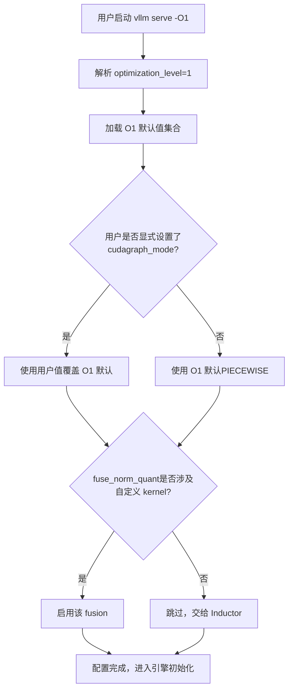
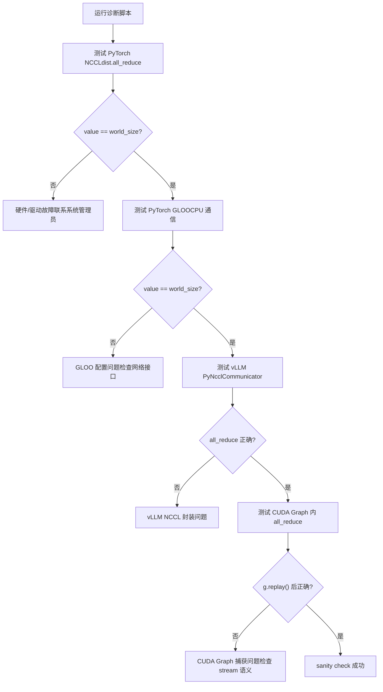
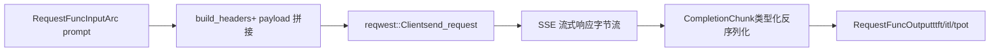

# Capítulo 14: Compromisos arquitectónicos, escollos en producción y evolución futura

En el capítulo anterior desglosamos el mecanismo de extensión por plugins de vLLM y vimos cómo los plugins de plataforma, los plugins de IO processor y los plugins de endpoint permiten que el motor se adapte a nuevo hardware, nuevas modalidades y nuevas API sin modificar el código central. Esta extensibilidad permite que vLLM abrace rápidamente los cambios, pero cuantos más puntos de extensión haya, más complejas serán las rutas de interacción en entornos de producción. Cuando problemas reales como la fragmentación de la memoria de video, el fallo del handshake de NCCL, la invalidación de la caché de compilación y la fluctuación de red aparecen simultáneamente, los mecanismos presentados en los trece capítulos anteriores se tensionan entre sí y exponen tensiones que no se manifestaban en entornos ideales. Este capítulo no introduce nuevos mecanismos centrales, sino que reúne estos mecanismos, tomando como ancla la documentación oficial de troubleshooting, combinándolos con el diseño de la herramienta bench del frontend en Rust, para examinar las concesiones entre rendimiento y operabilidad, y ofrecer una ruta de diagnóstico accionable.

# I. Niveles de optimización: un contrato explícito entre tiempo de arranque y rendimiento en ejecución

## Modelo intuitivo

Los niveles de optimización son como los "modos de escena" de una cámara: el modo automático (`-O2`) sirve para la mayoría de escenarios, pero cuando necesitas una captura rápida (depuración), cambiar al modo manual (`-O0`) responde de inmediato, a costa de una caída en la calidad de imagen (rendimiento). vLLM convierte este compromiso en un contrato explícito de cuatro niveles, en lugar de esconderlo entre decenas de flags booleanos para que el usuario los combine por su cuenta.

## Distribución de campos de los cuatro niveles

vLLM ofrece`-O0`hasta`-O3`cuatro niveles[FACT:docs/design/optimization_levels.md:5-5]. El principio de diseño central es:**los flags establecidos explícitamente por el usuario tienen prioridad sobre los valores predeterminados del nivel de optimización** [FACT:docs/design/optimization_levels.md:5-5]. Esto significa que el nivel de optimización es solo un conjunto de valores predeterminados, no una restricción rígida.

`-O0`desactiva todo: sin autotuning, sin compilación, sin cudagraph[FACT:docs/design/optimization_levels.md:32-33]. En concreto, se reduce a cuatro interruptores:`cudagraph_mode=NONE`、`mode=NONE`, todas las fusiones desactivadas,`enable_flashinfer_autotune=False` [FACT:docs/design/optimization_levels.md:37-40]。

`-O1`es el punto de equilibrio para escenarios de desarrollo: habilita`PIECEWISE`cudagraph y el modo`VLLM_COMPILE`. Nótese un detalle sutil:[FACT:docs/design/optimization_levels.md:50-51]y`fuse_norm_quant`solo se habilitan cuando uno de los operadores usa un kernel personalizado; de lo contrario, la fusión automática de Inductor funciona mejor`fuse_act_quant`. Esta es una decisión de diseño típica de "no quitarle trabajo al compilador".[FACT:docs/design/optimization_levels.md:61]es el valor predeterminado, orientado a producción

`-O2`. Sobre la base de[FACT:docs/design/optimization_levels.md:66-67]añade`-O1`cudagraph y`FULL_AND_PIECEWISE`actualmente equivale a`fuse_allreduce_rms` [FACT:docs/design/optimization_levels.md:72-73]。`-O3`, reservando`-O2`para optimizaciones experimentales más agresivas en el futuro[FACT:docs/design/optimization_levels.md:80-81]。

## Flujo de selección guiado por escenarios

Cuando un usuario ejecuta`vllm serve model -O1`, ¿qué ocurre internamente? El siguiente diagrama de flujo muestra cómo interactúan los niveles de optimización con los flags del usuario:

La clave de este flujo está en la rama`check_user`: lo que el usuario establece explícitamente siempre tiene prioridad[FACT:docs/design/optimization_levels.md:5-5]. Esto evita problemas difíciles de diagnosticar como "el nivel de optimización sobrescribió silenciosamente mi flag de depuración".

## Reflexiones de diseño y escollos

La trampa de producción más común de los niveles de optimización es**un tiempo de arranque demasiado largo**. La documentación recomienda explícitamente: cuando el tiempo de arranque sea demasiado largo, usar`-O0`o`-O1` [FACT:docs/design/optimization_levels.md:87]. Pero aquí hay un coste oculto——`-O0`sin cudagraph, el coste de lanzamiento por CPU de cada kernel queda al descubierto, y en escenarios de alta concurrencia el throughput puede caer varias veces.

Otra trampa es**el error de compilación**。`-O2`: el`FULL_AND_PIECEWISE`cudagraph de`-O2`tiene suposiciones más fuertes sobre la estructura del modelo; ciertos modelos personalizados fallan al compilar con`-O1`pero funcionan con`debug_dump_path`. La documentación recomienda usar[FACT:docs/design/optimization_levels.md:88]para obtener más información de depuración`-O0`. La ruta de diagnóstico debería ser: primero usar`-O1`、`-O2`para confirmar que la funcionalidad es correcta, luego subir gradualmente a

> **[Design Inference & Architectural Trade-offs]**
> 〔Inferencia de diseño y compromisos arquitectónicos〕`--enforce-eager`Es la misma metodología: primero confirmar la corrección con la configuración más conservadora, luego habilitar optimizaciones gradualmente, aislando el problema a la mínima diferencia de configuración.

---

# II. Lista de trampas en producción: ruta de diagnóstico desde el síntoma hasta la causa raíz

## Modelo intuitivo

La resolución de fallos en producción es como el triaje en urgencias: no puedes hacer un chequeo completo a todos los pacientes, primero debes reducir el alcance rápidamente según los síntomas (OOM, hang, crash) y luego profundizar de forma dirigida. La documentación de troubleshooting de vLLM es esencialmente un manual de triaje.

## Clasificación de síntomas y herramientas de diagnóstico

La documentación divide los problemas comunes en varias categorías principales; las revisaremos en orden de dificultad de diagnóstico progresiva.

**Primera categoría: descarga/carga del modelo colgada.**El síntoma es una larga falta de respuesta tras el arranque. La causa raíz suele ser una red lenta o un sistema de archivos compartido lento.[FACT:docs/usage/troubleshooting.md:11-11]El medio de diagnóstico es`--load-format dummy`omitir la carga de pesos, aislando si lo lento es la descarga o la carga.[FACT:docs/usage/troubleshooting.md:23-23]Esta es una técnica típica de "aislamiento por bisección".

**Segunda categoría: OOM de memoria de video.**La documentación apunta directamente al documento de configuración conserving_memory.[FACT:docs/usage/troubleshooting.md:23]Pero el OOM en producción a menudo no se debe a que el modelo sea demasiado grande, sino a la fragmentación del KV cache o a un número de solicitudes concurrentes superior al esperado.

**Tercera categoría: cambios en la calidad de generación.**Esta es una trampa fácil de pasar por alto. v0.8.0 cambió el origen de los parámetros de muestreo por defecto: de los valores neutros por defecto de vLLM a los del autor del modelo.`generation_config.json` [FACT:docs/usage/troubleshooting.md:23-23]En la mayoría de los casos esto mejora la calidad, pero la configuración de algunos modelos resulta peor.[FACT:docs/usage/troubleshooting.md:23-23]El método de diagnóstico es revertir a`--generation-config vllm`comparar[FACT:docs/usage/troubleshooting.md:23-23]。

**Cuarta categoría: cuelgue (hang).**Esta es la categoría más difícil de diagnosticar. La documentación ofrece un conjunto de variables de entorno de depuración progresivas[FACT:docs/usage/troubleshooting.md:41-41]：

- `VLLM_LOGGING_LEVEL=DEBUG`: activar logs detallados
- `VLLM_LOG_STATS_INTERVAL=1.`: salida de alta frecuencia del estado de la cola y de los aciertos de caché
- `CUDA_LAUNCH_BLOCKING=1`: localizar qué kernel de CUDA está fallando
- `NCCL_DEBUG=TRACE`: activar logs detallados de NCCL
- `VLLM_TRACE_FUNCTION=1`: registrar todas las llamadas a funciones, pero ralentiza más de 100 veces[FACT:docs/usage/troubleshooting.md:41]

Aquí hay una disciplina operativa importante: tras depurar hay que desactivar estas variables de entorno, o abrir directamente un shell nuevo, de lo contrario la configuración de depuración residual seguirá ralentizando el sistema.[FACT:docs/usage/troubleshooting.md:11-11]。

## La trampa de los límites de proceso en la depuración con breakpoints

La arquitectura multiproceso de vLLM hace que los breakpoints convencionales`pdb`dejen de funcionar: si el breakpoint se ejecuta en un subproceso, lanzará`BdbQuit` [FACT:docs/usage/troubleshooting.md:45-54]. Dos soluciones: usar`forked-pdb` [FACT:docs/usage/troubleshooting.md:57-61], o establecer`VLLM_ENABLE_V1_MULTIPROCESSING=0`para mantener el planificador en el mismo proceso[FACT:docs/usage/troubleshooting.md:63-68]。

> **[Design Inference & Architectural Trade-offs]**
> El segundo método, aunque cómodo, cambia el modelo de ejecución: en modo monoproceso, EngineCore y API Server ya no se comunican mediante colas, y ciertos bugs de concurrencia pueden no reproducirse. Por eso sirve para localizar errores lógicos, pero no para reproducir problemas de concurrencia.

## Diagnóstico de comunicación distribuida

El despliegue distribuido tiene documentación de diagnóstico específica. La recomendación central es:**establecer las variables de entorno al crear el clúster**, porque las variables se propagan a todos los nodos; mientras que establecerlas en el shell solo afecta al nodo local.[FACT:docs/serving/distributed_troubleshooting.md:16-16]。

Un problema frecuente es`No available node types can fulfill resource request`, que aparece incluso cuando el clúster tiene suficientes GPU.[FACT:docs/serving/distributed_troubleshooting.md:16-16]La causa raíz suele ser que el nodo tiene múltiples IP y vLLM eligió la incorrecta. La solución es usar`VLLM_HOST_IP`para especificarla explícitamente, y`ray status`para verificar[FACT:docs/serving/distributed_troubleshooting.md:16-16]。

## Script de diagnóstico para fallos de inicialización de NCCL

La documentación proporciona un script de diagnóstico completo que verifica la pila de comunicación capa por capa.[FACT:docs/usage/troubleshooting.md:89-150]Su diseño es muy jerárquico:

Lo ingenioso de este script es que aísla capa por capa: primero verifica el PyTorch NCCL de más bajo nivel, luego el GLOO del lado de CPU, después el propio envoltorio PyNcclCommunicator de vLLM, y finalmente la comunicación dentro de CUDA Graph.[FACT:docs/usage/troubleshooting.md:90-146]. Cada fallo de capa apunta a una causa raíz diferente.

Un detalle digno de mención en el script:`pynccl.disabled = False`es por compatibilidad hacia atrás con la versión 0.6.4 y anteriores.[FACT:docs/usage/troubleshooting.md:121-125]. En 0.6.5+ está habilitado por defecto, pero se conserva esta línea para que los usuarios que lean la documentación más reciente no se confundan.

En las pruebas multinodo, la documentación usa deliberadamente`--rdzv_backend=static`en lugar de`c10d`, porque`c10d`en multinodo fallará por un fallo de resolución DNS.[FACT:docs/usage/troubleshooting.md:168-168]. Esta es una configuración típica de "solo lo sabes tras haber pisado el pozo".

## Reflexiones de diseño y trampas

**Fallo de inicialización de NCCL**（`ncclCommInitRank`(reporta unhandled system error) normalmente apunta a dos causas raíz: falta de`IPC_LOCK`capability o`/dev/shm`no montado[FACT:docs/usage/troubleshooting.md:311-311]. Ambas son trampas clásicas del despliegue en contenedores.

**Desajuste de la cadena de herramientas CUDA PTX**（`the provided PTX was compiled with an unsupported toolchain`) indica que el PTX dentro del wheel fue compilado con una versión superior del CUDA toolkit.[FACT:docs/usage/troubleshooting.md:325-327]. La solución es habilitar la compatibilidad hacia adelante de CUDA: en Docker añadir`-e VLLM_ENABLE_CUDA_COMPATIBILITY=1` [FACT:docs/usage/troubleshooting.md:325-327], en bare metal instalar el`cuda-compat`paquete y establecer`VLLM_CUDA_COMPATIBILITY_PATH` [FACT:docs/usage/troubleshooting.md:325-327]。

**Problema conocido de sobrecarga de memoria de NCCL**：vLLM `>= 0.4.3, <= 0.10.1.1`establece`NCCL_CUMEM_ENABLE=0`para evitar un bug de NCCL; los procesos externos que se conectan a vLLM también deben establecer esta variable, de lo contrario se colgarán o fallarán.[FACT:docs/usage/troubleshooting.md:375]. Tras la corrección en NCCL 2.22.3, las versiones nuevas eliminaron esta sobrescritura para permitir optimizaciones de rendimiento.[FACT:docs/usage/troubleshooting.md:375]. Este caso demuestra que:**el contrato de variables de entorno entre procesos es una dependencia implícita de los sistemas distribuidos**, y debe sincronizarse al actualizar.

---

# III. Frontend en Rust: la filosofía de diseño de cero copias de la herramienta bench

## Modelo intuitivo

Si el frontend en Python es una navaja suiza "completa pero pesada", la herramienta bench en Rust es un bisturí "hecho solo para pruebas de carga". Su objetivo de diseño no es la cobertura funcional, sino minimizar la sobrecarga del propio cliente bajo alta concurrencia, para que las cifras medidas reflejen de verdad el rendimiento del servidor.

## Estructuras de datos y diseño de memoria

La estructura de datos central de la herramienta bench es`RequestFuncInput` [FACT:rust/src/bench/src/backends/mod.rs:59-89]. Utiliza ampliamente`Arc<str>`y`Arc<[u32]>`en lugar de`String`/`Vec`, que es el núcleo del diseño de copia cero.

Veamos algunos campos clave:`prompt: Arc<str>` [FACT:rust/src/bench/src/backends/mod.rs:50-52]——múltiples solicitudes concurrentes pueden compartir la misma cadena de prompt, evitando clonar una copia por cada solicitud.`prompt_token_ids: Option<Arc<[u32]>>` [FACT:rust/src/bench/src/backends/mod.rs:77]——los token ID precalculados se envían directamente al servidor, omitiendo la tokenización del lado del servidor[FACT:rust/src/bench/src/backends/mod.rs:74-76]。

Lo más ingenioso es`multi_modal_content: Option<Arc<[Arc<str>]>>` [FACT:rust/src/bench/src/backends/mod.rs:81]. El comentario explica: el contenido multimodal se trata como fragmentos JSON preserializados, y el backend de chat los concatena directamente en el flujo de bytes del payload, evitando cualquier análisis o copia profunda de datos de imagen base64[FACT:rust/src/bench/src/backends/mod.rs:78-80]. Esta es una estructura de doble capa`Arc`: la capa externa`Arc<[...]>`comparte todo el arreglo, la capa interna`Arc<str>`comparte un solo fragmento.

`chat_messages_json: Option<Arc<str>>`tiene la prioridad más alta, se concatena directamente tal cual en el payload[FACT:rust/src/bench/src/backends/mod.rs:82-85]。

## Deserialización sin asignaciones

El análisis de respuestas en streaming SSE es otro punto clave de rendimiento. El comentario señala explícitamente: usar deserialización tipada para evitar construir un árbol completo de`serde_json::Value`, extrayendo solo los campos necesarios[FACT:rust/src/bench/src/backends/mod.rs:20-24]。

`CompletionChunk`conservando solo`choices`y`usage`dos campos[FACT:rust/src/bench/src/backends/mod.rs:20-24]，`ChatChunk`De manera similar[FACT:rust/src/bench/src/backends/mod.rs:33-37]。`#[serde(default)]`hace que el campo faltante`choices`por defecto sea un arreglo vacío[FACT:rust/src/bench/src/backends/mod.rs:20-24], que es el caso común en respuestas en streaming.

## Flujo de solicitudes orientado a escenarios

Cuando se emite una solicitud de prueba de carga, ¿cómo fluyen los datos? El siguiente diagrama de flujo de datos muestra la transformación desde la entrada hasta la salida:

`Backend`La enumeración usa despacho estático para evitar el problema de los objetos trait async[FACT:rust/src/bench/src/backends/mod.rs:150-154]。`send_request`A través de`match`se despacha a la implementación concreta[FACT:rust/src/bench/src/backends/mod.rs:158-168]。`get_backend`Según`BackendKind`devuelve el backend correspondiente[FACT:rust/src/bench/src/backends/mod.rs:172-181]。

Un detalle:`API_KEY`usa`OnceLock`caché, evitando hacer una llamada al sistema de variables de entorno por cada solicitud[FACT:rust/src/bench/src/backends/mod.rs:186-188]。`build_headers`inserta secuencialmente Content-Type, Authorization, extra headers, request-id[FACT:rust/src/bench/src/backends/mod.rs:191-215]。

## Reflexiones de diseño y errores comunes

> **[Design Inference & Architectural Trade-offs]**
> El diseño de copia cero de la herramienta bench en Rust refleja un juicio importante:**la sobrecarga del cliente de la herramienta de prueba de carga se convierte en una fuente de error de medición**. Si cada solicitud clona el prompt, analiza el JSON completo y copia profundamente la imagen base64, entonces la latencia medida incluye la sobrecarga del cliente y no puede reflejar fielmente el rendimiento del servidor. Usar`Arc`para compartir datos inmutables y deserialización tipada para omitir campos irrelevantes es, en esencia, reducir la sobrecarga del cliente a casi cero.

`RequestFuncOutput`El diseño de campos de`ttft`（time to first token）、`itl`también merece atención:`tpot`（time per output token）[FACT:rust/src/bench/src/backends/mod.rs:93-105](arreglo de latencia entre tokens),

---

# . Estos tres indicadores corresponden a diferentes dimensiones de rendimiento: TTFT refleja el prefill y la latencia de cola, ITL refleja la estabilidad del decode, TPOT refleja el rendimiento general. Si en la prueba de carga solo se mira la latencia promedio, se oculta la fluctuación de ITL.

Reflexión de diseño: la lógica subyacente de las compensaciones arquitectónicas

> **[Design Inference & Architectural Trade-offs]**
> **〔Inferencias de diseño y compensaciones arquitectónicas〕**Procesamiento por lotes continuo vs fragmentación de memoria de video.

**El procesamiento por lotes continuo permite que el lote se reorganice en cada paso, mejorando enormemente el rendimiento, pero a costa de una asignación y liberación extremadamente frecuentes de la caché KV. El mecanismo de tabla de bloques de PagedAttention está diseñado precisamente para hacer frente a esta asignación de alta frecuencia: los bloques de tamaño fijo eliminan la fragmentación externa, pero introducen la sobrecarga de direccionamiento indirecto de la tabla de bloques y la fragmentación interna (el último bloque puede no estar lleno). Esta es una compensación típica de "intercambiar tasa de fragmentación por una capa de indirección", la misma idea que la paginación de memoria virtual de los sistemas operativos.**CUDA Graph vs formas dinámicas.`PIECEWISE`CUDA Graph requiere formas estáticas, pero el tamaño de lote del procesamiento por lotes continuo cambia en cada paso. La solución de vLLM es`FULL_AND_PIECEWISE`y[FACT:docs/design/optimization_levels.md:50,72]modo`-O0`——capturar como grafo la parte que puede volverse estática, manteniendo la parte dinámica en modo eager.`-O2`Desactivar completamente cudagraph es para depuración,`-O1`activarlo todo es para producción, el

**intermedio es el compromiso.**Despliegue separado vs sobrecarga de red.`IPC_LOCK`、`/dev/shm`）[FACT:docs/usage/troubleshooting.md:311-311]KV Connector permite separar prefill y decode en diferentes instancias, pero la transferencia de caché KV entre instancias introduce latencia de red. Los requisitos de configuración de GPUDirect RDMA en la documentación (

**indican que esta ruta tiene requisitos estrictos de infraestructura. La fluctuación de red provoca tiempos de espera en la transferencia de KV, lo que a su vez desencadena reintentos o degradación.**Operabilidad vs rendimiento.`VLLM_TRACE_FUNCTION=1`Los niveles de optimización, las variables de entorno de depuración y los scripts de diagnóstico son costos pagados por la operabilidad.[FACT:docs/usage/troubleshooting.md:41]puede ralentizar 100 veces

---

# , pero es el último recurso para localizar problemas de cuelgue. Un motor maduro debe proporcionar estas herramientas "lentas pero que permiten ver con claridad".

Resumen de este capítulo

Este capítulo cierra el libro, reexaminando los mecanismos de los trece capítulos anteriores desde la perspectiva de producción.`-O0`Los niveles de optimización (`-O3`a[FACT:docs/design/optimization_levels.md:5-5]) son un contrato explícito entre el tiempo de arranque y el rendimiento en ejecución; los flags del usuario siempre tienen prioridad sobre los valores predeterminados del nivel`Arc`. La lista de errores comunes en producción cubre la ruta completa de diagnóstico desde la carga del modelo, OOM de memoria de video, cambios en la calidad de generación hasta fallos de comunicación distribuida, con una metodología central de "aislamiento por bisección" y "verificación capa por capa". La herramienta bench en Rust usa

Tres líneas centrales de compensación recorren todo el libro: procesamiento por lotes continuo frente a fragmentación de memoria de video, CUDA Graph frente a formas dinámicas, y despliegue desagregado frente a sobrecarga de red. Comprender estas tensiones es más importante que memorizar cualquier mecanismo individual, porque cada ajuste en un entorno de producción consiste, en esencia, en encontrar un punto de equilibrio entre estas tensiones.

# Reflexiones y autoevaluación de este capítulo

Q1: Si se cambia el`-O2`de`FULL_AND_PIECEWISE`cudagraph a`-O1`de`PIECEWISE`, ¿en qué escenarios se provocaría una regresión de rendimiento? ¿Por qué?

**Análisis de referencia**：`-O2`Sobre la base de`-O1`se añade`FULL_AND_PIECEWISE`modo cudagraph[FACT:docs/design/optimization_levels.md:72]。`FULL`El modo captura toda la propagación hacia adelante en un solo grafo, mientras que`PIECEWISE`solo captura los fragmentos que pueden volverse estáticos. En escenarios de producción con formas de lote estables,`FULL`el modo puede eliminar más sobrecarga de lanzamiento de kernels y ofrecer mayor rendimiento. Pero si el modelo contiene flujo de control dinámico (como el enrutamiento de tokens de MoE),`FULL`el modo puede no capturarlo o comportarse de forma anómala tras la captura; en ese caso,`PIECEWISE`resulta más estable. La regresión de rendimiento aparecería cuando: cambios frecuentes en el tamaño del lote impiden que el grafo de`FULL`acierte, o cuando la estructura del modelo activa la ruta de fallback del modo`FULL`. El método de diagnóstico consiste en confirmar primero la línea base con`-O1`, luego subir a`-O2`para comparar, y usar`VLLM_LOG_STATS_INTERVAL=1.`para observar el estado de la cola[FACT:docs/usage/troubleshooting.md:41-41]。

Q2: En el script de diagnóstico, ¿por qué antes de probar vLLM PyNcclCommunicator hay que probar primero PyTorch GLOO? Si se omite la prueba de GLOO y se prueba directamente PyNccl, ¿qué se pasa por alto?

**Análisis de referencia**: el orden de ejecución del script es PyTorch NCCL → PyTorch GLOO → vLLM PyNccl → CUDA Graph[FACT:docs/usage/troubleshooting.md:90-146]. GLOO prueba la comunicación del lado de CPU[FACT:docs/usage/troubleshooting.md:106-112], mientras que`PyNcclCommunicator`de vLLM necesita un grupo GLOO como bootstrap[FACT:docs/usage/troubleshooting.md:120]. Si se omite la prueba de GLOO, cuando falle la inicialización de PyNccl no se podrá distinguir si el problema es de NCCL en sí o del bootstrap de GLOO. GLOO depende de la configuración de la interfaz de red (`GLOO_SOCKET_IFNAME`）[FACT:docs/usage/troubleshooting.md:81-81], y en entornos de red complejos este es un punto de fallo de alta frecuencia. El valor de probar capa por capa radica en aislar el fallo hasta la mínima diferencia de configuración.

Q3: La herramienta de bench en Rust usa`Arc<str>`para compartir el prompt. Si el escenario de pruebas de carga requiere enviar un prompt diferente en cada solicitud, ¿este diseño deja de ser válido? ¿Por qué?

**Análisis de referencia**：`Arc<str>`El objetivo de diseño de[FACT:rust/src/bench/src/backends/mod.rs:50-52]es permitir que múltiples solicitudes concurrentes compartan la misma cadena inmutable`Arc`. Si el prompt de cada solicitud es diferente,`Arc<str>`la ventaja de compartición de`Arc<str>`efectivamente desaparece: cada solicitud necesita construir su propio`String`. Pero el diseño no deja de ser válido:`prompt_token_ids: Option<Arc<[u32]>>` [FACT:rust/src/bench/src/backends/mod.rs:77]en comparación con`Arc`todavía evita múltiples clonaciones durante el flujo de la solicitud (por ejemplo, al pasar de la cola de entrada al backend y luego a la construcción del payload). La verdadera optimización de copia cero está en`Arc<str>`: incluso si el texto del prompt es diferente, el arreglo precalculado de token IDs aún puede compartirse mediante`Arc<[u32]>`durante el ciclo de vida de la solicitud, evitando asignaciones repetidas. La suposición de diseño de la herramienta de pruebas de carga es "mismo prompt con alta concurrencia" o "token IDs precalculados"; la primera usa

---

para compartir texto, la segunda usa

para compartir la secuencia de tokens.
