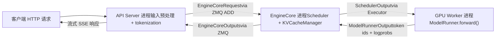
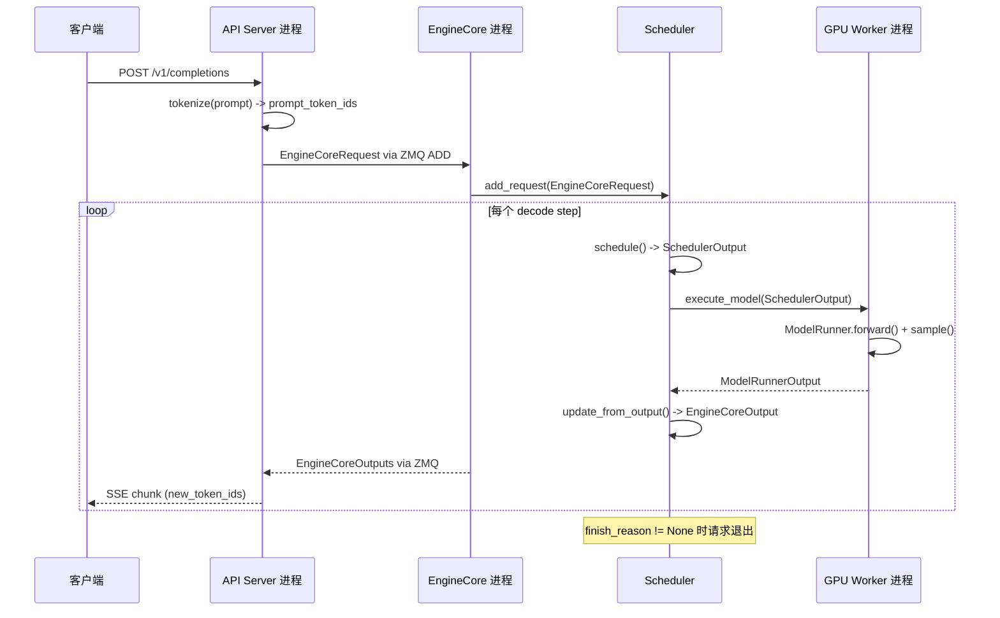

# Chapitre 1 : La philosophie de conception de vLLM et vue d'ensemble de son architecture globale

Supposons que vous disposiez d'une A100 et que vous souhaitiez fournir un service d'inférence en ligne avec LLaMA-7B. L'approche la plus naïve consiste à : recevoir une requête, exécuter un model.generate(), puis renvoyer le résultat. Cette solution s'effondre immédiatement dès que la concurrence augmente — non pas parce que la puissance de calcul du GPU est insuffisante, mais à cause de deux problèmes : premièrement, la mémoire GPU est fragmentée. La génération autorégressive nécessite de mettre en cache les tenseurs Key/Value de chaque couche (KV Cache). Si chaque requête préalloue un bloc contigu de mémoire GPU selon max_model_len, une requête de 4096 tokens occuperait plusieurs dizaines de Mo, alors que la séquence réellement générée pourrait ne faire que 200 tokens. Pire encore, des requêtes de longueurs différentes entrent et sortent alternativement, découpant les blocs de mémoire contigus en morceaux épars, si bien qu'au final, alors que la quantité totale est suffisante, on ne trouve plus d'espace contigu suffisamment grand — c'est le problème classique de la fragmentation de la mémoire GPU. Deuxièmement, l'efficacité du traitement par lots est faible. Le traitement par lots statique traditionnel exige que toutes les requêtes d'un batch commencent et se terminent en même temps. Or la longueur de sortie d'une tâche de génération est par nature imprévisible : une requête peut s'arrêter après 10 tokens, une autre peut en générer 2000. Une fois qu'une requête courte est terminée, l'emplacement de batch qu'elle occupait ne peut qu'attendre passivement qu'une requête longue se termine, et le taux d'utilisation du GPU chute en chute libre. Les deux pierres angulaires de la conception de vLLM répondent précisément à ces deux points douloureux : PagedAttention élimine la fragmentation de la mémoire GPU grâce à un mécanisme de pagination, et Continuous Batching élimine le temps mort du traitement par lots grâce à un ordonnancement au niveau de l'itération. Ce chapitre n'approfondit pas les détails d'implémentation de ces deux mécanismes (ce sont les thèmes des chapitres 2 et 4), mais établit d'abord une carte globale : à quoi ressemble l'architecture de processus de vLLM v1, comment les responsabilités de chaque couche sont réparties, et par quels composants passe une requête depuis son entrée dans le système jusqu'à la production d'un token. Une fois cette carte comprise, l'analyse du code source de chaque chapitre suivant aura un point d'ancrage.

# Architecture de processus : pourquoi vLLM n'est pas un programme monoprocessus

## Modèle intuitif

Imaginez vLLM comme un restaurant. L'accueil (API Server) reçoit les clients et prend les commandes ; le cœur de la cuisine (EngineCore) décide quel plat préparer en premier et sur quel feu ; chaque feu (GPU Worker) est opéré exclusivement par un chef. Si une seule personne devait à la fois accueillir et cuisiner, elle serait débordée aux heures de pointe — c'est pourquoi vLLM sépare ces rôles en processus indépendants.

> **[Design Inference & Architectural Trade-offs]**
> La motivation centrale de cette séparation en plusieurs processus est la**séparation des préoccupations**: l'analyse HTTP, la tokenization et le chargement de données multimodales sont des opérations gourmandes en CPU et potentiellement bloquantes, tandis que la propagation avant du modèle est gourmande en GPU. Si elles étaient placées dans le même processus, le GIL de Python ferait que les deux se pénaliseraient mutuellement. Après séparation en processus indépendants, l'API Server peut continuer à recevoir de nouvelles requêtes, EngineCore peut continuer à ordonnancer, et le GPU Worker peut continuer à calculer, les trois étant découplés via la file de messages ZMQ.

## Topologie des processus et relations de quantité

L'architecture de processus de vLLM v1 peut se résumer par une formule. Pour un déploiement avec`N`GPU, degré de parallélisme tensoriel`TP`, degré de parallélisme de pipeline`PP`, degré de parallélisme de données`DP`, nombre d'API Servers`A`:

| Type de processus | Quantité | Responsabilité |
| --- | --- | --- |
| API Server | `A`(par défaut égal à`DP`） | Traitement des requêtes HTTP, prétraitement des entrées, retour en streaming des résultats |
| EngineCore | `DP`(par défaut 1) | Ordonnancement, gestion du KV Cache, coordination des GPU Workers |
| GPU Worker | `N`（= `DP × PP × TP`） | Chargement des poids, exécution de la propagation avant, gestion de la mémoire GPU |
| DP Coordinator | `DP > 1`vaut 1 lorsque , sinon 0 | Équilibrage de charge entre rangs DP et coordination des vagues MoE |

[FACT:docs/design/arch_overview.md:113-113]fournit la définition faisant autorité de ce tableau. Un déploiement typique à 4 GPU sur une seule machine (`vllm serve -tp=4`) génère 1 API Server + 1 EngineCore + 4 GPU Worker = 6 processus[FACT:docs/design/arch_overview.md:115-115]. En revanche, un déploiement à 8 GPU avec TP=2/DP=4 gonfle à 4 + 4 + 8 + 1 = 17 processus[FACT:docs/design/arch_overview.md:123-123]。

Voici un détail facile à négliger :**Le nombre d'API Servers suit par défaut la taille du DP**. Lorsque`--data-parallel-size 4`, 4 API Servers sont automatiquement lancés, chacun se connectant à tous les EngineCore via ZMQ dans une topologie plusieurs-à-plusieurs[FACT:docs/design/arch_overview.md:73-73]. Cela signifie que n'importe quel API Server peut router une requête vers n'importe quel EngineCore, évitant ainsi un goulot d'étranglement unique.

## Flux de données

La figure ci-dessous montre le chemin complet de circulation d'une requête entre les processus. Notez que chaque nœud est annoté avec les noms de classes et structures de données réels :



Le point clé de cette figure est :**La communication entre API Server et EngineCore se fait par messagerie asynchrone**, et non par appel de fonction. La requête est sérialisée en une`EngineCoreRequest`structure (un`msgspec.Struct`, voir[FACT:vllm/v1/engine/__init__.py:109-113]), envoyée via le type de message`ADD`de ZMQ[FACT:vllm/v1/engine/__init__.py:287-299]. Après traitement, EngineCore empaquette le résultat en`EngineCoreOutputs`et le renvoie[FACT:vllm/v1/engine/__init__.py:256-260]。

> **[Design Inference & Architectural Trade-offs]**
> Le choix de ZMQ plutôt que gRPC ou la mémoire partagée s'explique par la latence extrêmement faible de ZMQ dans les scénarios de communication inter-processus (de l'ordre de la microseconde), ainsi que son support natif des topologies plusieurs-à-plusieurs et de la sémantique de file de messages. Pour un service d'inférence sensible à la latence du premier token, la surcharge de communication doit être aussi réduite que possible.

## Réflexion de conception : pourquoi EngineCore est un processus indépendant plutôt qu'un thread

Une question naturelle se pose : puisque EngineCore et API Server sont sur la même machine, pourquoi ne pas les placer dans le même processus avec une communication par threads ?

La réponse réside dans le mode de fonctionnement d'EngineCore. EngineCore exécute une**boucle active**(busy loop), planifiant et distribuant continuellement les requêtes aux GPU Workers[FACT:docs/design/arch_overview.md:73-73]. Cette boucle ne peut pas être interrompue — dès qu'elle est bloquée par le parsing HTTP ou la tokenization, toute la pipeline d'inférence subit des bulles. Un processus indépendant garantit que le temps CPU d'EngineCore ne sera pas préempté par la logique frontale.

De plus, un processus indépendant apporte également**l'isolation des pannes**: si l'API Server plante à cause d'une requête malformée, EngineCore et les GPU Workers ne sont pas affectés et peuvent continuer à servir les requêtes transférées par d'autres API Servers.

# Modèle mental en couches : frontières de responsabilité de l'entrée jusqu'au GPU

## Modèle intuitif

Si l'architecture des processus répond à « qui fait quoi et où », le modèle en couches répond à « quelle décision incombe à chaque couche ». L'organisation du code de vLLM suit un principe de stratification clair :**La couche supérieure décide quoi faire, la couche inférieure décide comment le faire**. La couche d'entrée décide quelles requêtes accepter, la couche cœur du moteur décide qui traiter en premier, la couche exécuteur décide quelle stratégie de parallélisme utiliser, et la couche Worker décide comment produire le résultat sur le matériel concret.

## Structure à quatre couches

**Couche d'entrée (Entrypoints)**propose deux modes d'interaction : la classe`LLM`pour l'inférence hors ligne et la commande`vllm serve`pour le service en ligne[FACT:docs/design/arch_overview.md:16-16][FACT:docs/design/arch_overview.md:56-56]. La responsabilité principale de cette couche est le prétraitement des entrées — tokenization, chargement de données multimodales, parsing des paramètres d'échantillonnage — ainsi que la détokenization des sorties et le retour en streaming. Elle ne se soucie pas des stratégies de planification et ne touche pas au GPU.

**Couche cœur du moteur (EngineCore)**est le cerveau de tout le système. Elle détient le Scheduler (qui détermine quelles requêtes traiter à chaque decode step) et le KV Cache Manager (qui gère la mémoire paginée), et communique avec les GPU Workers via l'abstraction Executor[FACT:docs/design/arch_overview.md:79-85]. La conception clé de cette couche est**la séparation entre planification et exécution**: le Scheduler ne produit que la décision « quels tokens exécuter à cette étape » (`SchedulerOutput`), la manière concrète de les exécuter sur GPU étant du ressort du Worker.

**Couche exécuteur (Executor)**est le pont entre EngineCore et les Workers. Elle encapsule les stratégies d'exécution distribuée —`UniProcExecutor`pour un processus unique,`MultiprocExecutor`pour plusieurs processus,`RayDistributedExecutor`pour un cluster Ray. L'interface abstraite de l'Executor permet à EngineCore de ne pas savoir si le sous-jacent est un seul GPU ou un TP à 8 GPU.

**Couche Worker**un processus Worker par GPU, contenant en interne un ModelRunner et l'objet modèle`torch.nn.Module`réel[FACT:docs/design/arch_overview.md:171-191]. Le ModelRunner est responsable de la préparation des tenseurs d'entrée, de la capture des CUDA Graphs et de l'exécution du calcul forward. Cette couche est le seul endroit qui manipule directement la mémoire GPU et les flux CUDA.

## Objet de configuration : état global traversant toutes les couches

Par quoi les quatre couches transmettent-elles l'information ? La réponse est`VllmConfig`— un dataclass géant contenant toute la configuration[FACT:vllm/config/vllm.py:357-357]。

```python
@config(config=ConfigDict(arbitrary_types_allowed=True))
class VllmConfig:
    """Dataclass which contains all vllm-related configuration."""
    model_config: ModelConfig = None
    cache_config: CacheConfig = Field(default_factory=CacheConfig)
    parallel_config: ParallelConfig = Field(default_factory=ParallelConfig)
    scheduler_config: SchedulerConfig = Field(default_factory=SchedulerConfig.default_factory)
    # ... 还有 20+ 个子配置
```

[FACT:vllm/config/vllm.py:363-371]présente les champs principaux. La logique derrière ce choix de conception mérite d'être développée.

> **[Design Inference & Architectural Trade-offs]**
> La documentation explique clairement pourquoi un grand objet de configuration est utilisé plutôt que des paramètres dispersés :**Extensibilité**. Supposons que l'on veuille ajouter une nouvelle fonctionnalité qui n'affecte que ModelRunner, il suffit d'ajouter un champ dans`VllmConfig`, ModelRunner le lit directement, sans modifier les signatures des constructeurs de Engine, Worker, Model[FACT:docs/design/arch_overview.md:203-203]. Dans un framework d'inférence en évolution rapide, cette capacité d'« ajouter des champs sans modifier les interfaces » réduit considérablement la friction de développement.

Le prix à payer est que`VllmConfig`devient extrêmement volumineux — comme on peut le voir à partir de[FACT:vllm/config/vllm.py:356-3509], cette classe dépasse 3000 lignes de code, contenant des dizaines de champs et de méthodes de validation.`__post_init__`La méthode[FACT:vllm/config/vllm.py:1405-2317]fait plus de 900 lignes, assumant toute la validation croisée entre les éléments de configuration et la dérivation des valeurs par défaut.

## Hachage et mise en cache de la configuration

`VllmConfig`Il existe également une capacité facilement négligée mais très importante :`compute_hash()` [FACT:vllm/config/vllm.py:464-580]. Il génère un hash court pour tous les éléments de configuration qui affectent la structure du graphe de calcul.

```python
def compute_hash(self, include_version: bool = True) -> str:
    factors: list[Any] = []
    vllm_factors: list[Any] = []
    if include_version:
        from vllm import __version__
        vllm_factors.append(__version__)
    if self.model_config:
        vllm_factors.append(self.model_config.compute_hash())
    # ... 逐个追加各子配置的哈希
    hash_str = safe_hash(str(factors).encode(), usedforsecurity=False).hexdigest()[:10]
    return hash_str
```

[FACT:vllm/config/vllm.py:479-580]montre le processus complet de calcul du hash. Notez l'avertissement dans les commentaires : « Whenever a new field is added to this config, ensure that it is included in the factors list if it affects the computation graph »[FACT:vllm/config/vllm.py:465-467]。

> **[Design Inference & Architectural Trade-offs]**
> L'utilité de ce hash est**clé de cache torch.compile**. vLLM utilise`torch.compile`pour compiler le graphe forward du modèle, et le résultat de la compilation est mis en cache sur disque. Au prochain démarrage, si le hash de configuration est identique, le cache de compilation peut être directement réutilisé, évitant ainsi le processus de compilation coûteux en temps. Si un élément de configuration affectant le graphe de calcul n'est pas inclus dans le hash, cela entraîne une erreur de correspondance de cache — utiliser un graphe compilé avec l'ancienne configuration pour exécuter la nouvelle configuration, résultant en une erreur silencieuse. C'est pourquoi les commentaires insistent à plusieurs reprises sur le fait que « les champs affectant le graphe de calcul doivent être inclus dans le hash ».

# Parcours du cycle de vie d'une requête : du HTTP au Token

## Mise en situation

Supposons qu'un client envoie à`vllm serve`un service lancé avec une requête`/v1/completions`compatible OpenAI, avec le prompt « The capital of France is », demandant la génération de 16 tokens. Nous suivons le parcours complet de cette requête à travers le code source.

## Étape 1 : Réception et prétraitement par l'API Server

Après réception de la requête HTTP, le processus API Server effectue la tokenisation et l'analyse des paramètres d'échantillonnage, puis construit`EngineCoreRequest`：

```python
class EngineCoreRequest(
    msgspec.Struct,
    array_like=True,
    omit_defaults=True,
    gc=False,
):
    request_id: str
    prompt_token_ids: list[int] | None
    mm_features: list[MultiModalFeatureSpec] | None
    sampling_params: SamplingParams | None
    pooling_params: PoolingParams | None
    arrival_time: float
    lora_request: LoRARequest | None
    cache_salt: str | None
    data_parallel_rank: int | None
    prompt_embeds: torch.Tensor | None = None
    # ... 更多字段
```

[FACT:vllm/v1/engine/__init__.py:109-124]définit la structure centrale de la requête. Notez`msgspec.Struct`combiné avec`array_like=True`et`omit_defaults=True`la combinaison[FACT:vllm/v1/engine/__init__.py:109-113]— c'est pour**la performance de sérialisation**。`array_like`permettre à msgspec d'encoder avec un tableau positionnel plutôt qu'un dictionnaire,`omit_defaults`ignorer les champs avec valeurs par défaut, la combinaison des deux réduisant considérablement la taille des messages ZMQ.

> **[Design Inference & Architectural Trade-offs]**
> `gc=False`indique à msgspec de ne pas générer de code de suivi GC pour cette structure[FACT:vllm/v1/engine/__init__.py:109-113]. Pour les objets de message créés/détruits à haute fréquence, désactiver le suivi GC réduit la pression sur le ramasse-miettes Python, ce qui est une optimisation nécessaire dans un scénario traitant des milliers de requêtes par seconde.

## Étape 2 : Ordonnancement par EngineCore

Après réception de la requête par EngineCore, le Scheduler la place dans la file d'attente. À chaque étape d'ordonnancement, le Scheduler décide si cette requête est incluse dans le lot courant. Si elle est incluse, le KV Cache Manager lui alloue des blocs physiques (opération centrale de PagedAttention, voir chapitre 2).

Le résultat de l'ordonnancement est encapsulé dans`SchedulerOutput`, envoyé au GPU Worker via l'Executor.

## Étape 3 : Exécution du forward par le GPU Worker

Le ModelRunner du Worker reçoit`SchedulerOutput`, prépare les tenseurs d'entrée (y compris block table, slot mapping et autres attention metadata), exécute le forward du modèle, et échantillonne le token suivant.

## Étape 4 : Retour des résultats

Le token produit par le Worker est encapsulé dans`EngineCoreOutput`：

```python
class EngineCoreOutput(
    msgspec.Struct,
    array_like=True,
    omit_defaults=True,
    gc=False,
):
    request_id: str
    new_token_ids: list[int]
    new_logprobs: LogprobsLists | None = None
    finish_reason: FinishReason | None = None
    stop_reason: int | str | None = None
    # ...
```

[FACT:vllm/v1/engine/__init__.py:199-217]définit la structure de sortie.`finish_reason`est un`IntEnum`, les valeurs possibles incluent`STOP`、`LENGTH`、`ABORT`、`ERROR`、`REPETITION` [FACT:vllm/v1/engine/__init__.py:68-69]. Les commentaires expliquent pourquoi utiliser`Int`plutôt que`Str`：「Int rather than Str for more compact serialization」[FACT:vllm/v1/engine/__init__.py:56-57]— encore une optimisation de la taille de sérialisation.

Plusieurs`EngineCoreOutput`sont empaquetés dans`EngineCoreOutputs`, renvoyés à l'API Server via ZMQ[FACT:vllm/v1/engine/__init__.py:256-260]。

## Étape 5 : Retour en streaming par l'API Server

Après réception de`EngineCoreOutputs`par l'API Server, chaque`EngineCoreOutput`est dé-tokenisé, puis poussé en streaming vers le client via SSE (Server-Sent Events).

## Séquence complète

Le diagramme de séquence ci-dessous montre l'interaction complète inter-processus, annoté avec les vrais noms de fonctions et structures de données à chaque étape :



Informations clés de ce diagramme :**Chaque decode step produit un`EngineCoreOutputs`retour**, plutôt que d'attendre la génération complète de la séquence entière avant de retourner. C'est précisément la manifestation du Continuous Batching — les séquences terminées sortent immédiatement, les nouvelles requêtes sont immédiatement ajoutées, et la sortie est retournée en streaming au client.

# Réflexions de conception et pièges en production

## Le modèle d'« initialisation différée » pour la validation de configuration

`VllmConfig.__post_init__`est le cœur de tout le système de configuration. Ce n'est pas une simple affectation de champ, mais une**pipeline de validation multi-étapes**：

1. D'abord, analyser le mode de l'encodeur multimodal[FACT:vllm/config/vllm.py:1416-1416]

2. Ensuite, appeler`try_verify_and_update_config()`, pour donner aux hooks de configuration spécifiques au modèle l'opportunité de modifier la configuration[FACT:vllm/config/vllm.py:1434-1434]

3. Puis, valider la cohérence entre la configuration parallèle, la configuration de quantification et la configuration LoRA[FACT:vllm/config/vllm.py:1442-1444]

4. Enfin, traiter les vérifications de compatibilité des fonctionnalités d'exécution telles que la planification asynchrone, CUDA Graph, KV Transfer, etc.[FACT:vllm/config/vllm.py:1544-1635]

> **[Design Inference & Architectural Trade-offs]**
> Ce modèle d'« initialisation postérieure » résout une contradiction fondamentale :**il existe des relations de dépendance entre les éléments de configuration, mais l'utilisateur peut les définir dans un ordre arbitraire**. Par exemple,`async_scheduling`l'activation dépend du type de méthode de speculative_config, du support du backend de l'executor, de l'utilisation du pipeline parallelism, etc., parmi de multiples conditions[FACT:vllm/config/vllm.py:1544-1575]. Si l'on plaçait cette logique dans le`__set__`du champ, cela créerait des dépendances circulaires complexes. En la centralisant dans`__post_init__`et en la traitant séquentiellement, la logique est claire et facile à déboguer.

## Piège : conflit entre KV Connector et expandable_segments

[FACT:vllm/config/vllm.py:1219-1260]Dans`_verify_kv_transfer_compat`, le

révèle un piège de production très subtil.`ibv_reg_mr`Lors de l'utilisation de KV Connector (comme NIXL, Mooncake) pour un déploiement à séparation PD, ces connecteurs, via des mécanismes tels que**, épinglent (pin) les pages de mémoire physique du KV cache**. Mais si l'on définit simultanément`PYTORCH_CUDA_ALLOC_CONF=expandable_segments:True`, l'allocateur CUDA VMM de PyTorch peut, à l'exécution, remapper la même adresse virtuelle vers différentes pages physiques[FACT:vllm/config/vllm.py:1227-1233]。

Quelle est la conséquence ? La zone mémoire RDMA enregistrée par le connecteur pointe vers des pages physiques déjà invalidées. Le premier transfert KV inter-nœuds signalera`IBV_WC_REM_ACCESS_ERR`ou`NIXL_ERR_REMOTE_DISCONNECT` [FACT:vllm/config/vllm.py:1232-1233]。

La stratégie de vLLM est un**refus conservateur**: dès que`expandable_segments:True`est détecté et qu'un KV connector est configuré, une exception est levée directement[FACT:vllm/config/vllm.py:1249-1260]. La seule exemption est l'activation de`enable_cumem_allocator`— car l'allocateur CuMem désactivera`expandable_segments` [FACT:vllm/config/vllm.py:1238-1241]。

> **[Design Inference & Architectural Trade-offs]**
> 〔Inférence de conception et compromis architecturaux〕**La leçon de ce cas est :**l'enregistrement de mémoire RDMA et le remappage de mémoire virtuelle sont sémantiquement incompatibles`PYTORCH_CUDA_ALLOC_CONF`。

## . Toute fonctionnalité impliquant l'épinglage de mémoire GPU (transfert KV, buffers d'enregistrement NCCL, etc.) doit garantir que les pages physiques sous-jacentes ne seront pas déplacées silencieusement par l'allocateur. Lors du diagnostic de ce type de problème, si l'on constate qu'un transfert RDMA échoue lors de la première communication inter-nœuds, la première réaction devrait être de vérifier

`__post_init__`Piège : chaîne de dégradation automatique de la planification asynchrone`async_scheduling`Dans[FACT:vllm/config/vllm.py:1544-1635], la logique de traitement concernant**démontre une**。

chaîne de dégradation automatique`async_scheduling`soigneusement conçue`None`Lorsque l'utilisateur n'a pas explicitement défini

- (valeur[FACT:vllm/config/vllm.py:1578-1587]
- ), vLLM tentera de l'activer automatiquement, mais doit vérifier successivement une série de conditions d'incompatibilité :[FACT:vllm/config/vllm.py:1588-1601]
- S'il s'agit d'un modèle pooling, désactiver`disable_padded_drafter_batch=True`Si la méthode speculative n'est pas dans la liste supportée, désactiver[FACT:vllm/config/vllm.py:1602-1610]
- Si[FACT:vllm/config/vllm.py:1611-1617]
- , désactiver[FACT:vllm/config/vllm.py:1618-1624]
- Si le backend de l'executor ne supporte pas, désactiver[FACT:vllm/config/vllm.py:1625-1633]

S'il s'agit de ROCm DeepEP haut débit DBO, désactiver[FACT:vllm/config/vllm.py:1639-1640]。

> **[Design Inference & Architectural Trade-offs]**
> Ce n'est que si toutes les vérifications passent que l'activation est finalement effectuée**〔Inférence de conception et compromis architecturaux〕**La philosophie de conception de cette chaîne de dégradation est :

# activer par défaut la configuration optimale, et en cas d'incompatibilité, dégrader silencieusement en enregistrant un avertissement

. C'est bien plus convivial que d'exiger de l'utilisateur qu'il configure manuellement chaque commutateur de compatibilité. Mais le coût est le suivant — lorsque les performances sont inférieures aux attentes, l'utilisateur doit consulter les logs pour découvrir que la planification asynchrone a été automatiquement désactivée. En production, si l'on constate une anomalie de débit, il est recommandé de vérifier dans les logs de démarrage la présence de l'avertissement « Async scheduling will be disabled ».

1. **Résumé de ce chapitre**Ce chapitre établit le modèle mental global de vLLM v1, les points clés étant :

2. **Les deux problèmes fondamentaux résolus par vLLM**: la fragmentation de la mémoire GPU (gestion paginée PagedAttention) et le temps mort du traitement par lots (planification au niveau de l'itération Continuous Batching).`A + DP + N`Architecture multi-processus

3. **: API Server (entrée) → EngineCore (planification) → GPU Worker (exécution), trois couches de processus communiquant de manière asynchrone via ZMQ. Le nombre de processus suit la formule**Modèle en quatre couches

4. **: la couche d'entrée est responsable du prétraitement, la couche cœur du moteur est responsable des décisions de planification, la couche executor est responsable de la stratégie distribuée, la couche Worker est responsable du calcul GPU.**VllmConfig est l'état global qui traverse toutes les couches`compute_hash()`, supportant le cache de compilation via`__post_init__`, et réalisant la validation inter-configurations et la dérivation des valeurs par défaut via

5. **Cycle de vie d'une requête**：HTTP → tokenize → `EngineCoreRequest` → Scheduler → Worker forward → `EngineCoreOutput`→ retour en streaming SSE.

# Réflexions et auto-évaluation de ce chapitre

Q1 : Si l'on change le`EngineCoreRequest`de`msgspec.Struct`, passant de`array_like=True, omit_defaults=True`à la valeur par défaut (c'est-à-dire`array_like=False, omit_defaults=False`), dans quels scénarios cela entraînerait-il des problèmes de performance ? Veuillez analyser en combinant[FACT:vllm/v1/engine/__init__.py:109-113]et[FACT:vllm/v1/engine/__init__.py:256-260].

**Analyse de référence**：`array_like=True`fait que msgspec encode les structures avec des tableaux positionnels plutôt qu'avec des dictionnaires,`omit_defaults=True`saute les champs dont la valeur est la valeur par défaut. Dans la configuration par défaut, chaque`EngineCoreRequest`sera encodé en une structure de dictionnaire contenant tous les noms de champs, et sa taille peut gonfler de 2 à 3 fois. Dans des scénarios à forte concurrence (des milliers de requêtes par seconde), le volume de messages ZMQ entre l'API Server et EngineCore augmentera considérablement, entraînant une hausse de la charge CPU liée à la sérialisation/désérialisation et un gaspillage de bande passante réseau.`EngineCoreOutputs`utilise également ces deux paramètres[FACT:vllm/v1/engine/__init__.py:256-260], et il est généré à chaque decode step, avec un impact plus important. En outre`gc=False`désactive le suivi GC, ce qui peut réduire la pression sur le GC Python pour les objets à courte durée de vie et à haute fréquence.

Q2 : Dans`VllmConfig.__post_init__`,`async_scheduling`la logique d'activation automatique ([FACT:vllm/config/vllm.py:1576-1635]) adopte la stratégie « vérifier séquentiellement les conditions d'incompatibilité, et n'activer que si toutes passent ». Si une nouvelle fonctionnalité incompatible avec la planification asynchrone est ajoutée, mais que le développeur oublie d'ajouter la branche correspondante dans cette chaîne de vérification, quel problème cela causera-t-il ? Analysez du point de vue du comportement du système.

**Analyse de référence**: Si l'on oublie d'ajouter la branche de vérification, la planification asynchrone sera activée à tort. L'hypothèse centrale de la planification asynchrone est que « la décision de planification du step actuel ne dépend pas de la sortie du step précédent », ce qui permet à EngineCore de planifier le step suivant alors que le calcul GPU du step précédent n'est pas encore terminé. Si la nouvelle fonctionnalité viole cette hypothèse (par exemple, une logique de post-traitement qui doit lire les logits du step précédent), la planification asynchrone entraînera des conditions de course ou des résultats erronés. Plus insidieux encore, ce type de bug peut ne se déclencher que dans des séquences de concurrence spécifiques, et être difficile à reproduire. C'est précisément pourquoi[FACT:vllm/config/vllm.py:1549-1552]le chemin d'activation explicite adopte une stratégie de « hard fail » — lorsque l'utilisateur l'active volontairement, une erreur est directement signalée plutôt qu'une dégradation silencieuse, forçant le développeur à faire face aux problèmes de compatibilité.

Q3: `VllmConfig.compute_hash()`le commentaire avertit que « les champs affectant le graphe de calcul doivent être ajoutés à la liste factors » ([FACT:vllm/config/vllm.py:465-467]). Supposons qu'un nouveau champ`attention_sink_tokens`affecte la logique de calcul de l'attention mais soit omis dans le hachage ; quel type de défaillance cela déclencherait-il en environnement de production ? Pourquoi ce type de défaillance est-il particulièrement dangereux ?

**Analyse de référence**：`compute_hash()`la sortie est utilisée comme clé du cache de compilation torch.compile. Si`attention_sink_tokens`affecte la structure du graphe de calcul mais n'est pas inclus dans le hachage, alors lorsque l'utilisateur passe de`attention_sink_tokens=0`à`attention_sink_tokens=4`, la valeur de hachage reste inchangée et vLLM réutilisera le graphe précédemment compilé (sans la logique sink token). Le résultat est que le modèle produit silencieusement des sorties erronées — sans erreur, sans plantage, simplement des résultats incorrects. Ce type de défaillance est particulièrement dangereux car : (1) il ne déclenche aucune exception ni avertissement dans les logs ; (2) la sortie reste un texte « apparemment raisonnable », avec seulement une baisse de qualité ou un comportement anormal ; (3) le diagnostic nécessite de comparer les correspondances du cache de compilation et les différences de configuration réelles, avec un coût de localisation extrêmement élevé. C'est pourquoi les commentaires insistent à plusieurs reprises sur le fait que les nouveaux champs doivent être évalués quant à leur impact sur le graphe de calcul.

Ce chapitre part d'une scène de plantage lors d'une requête d'inférence naïve, révélant deux contradictions fondamentales que vLLM doit résoudre : la fragmentation de la mémoire vidéo et la rotation à vide du traitement par lots, et présente les deux clés que sont PagedAttention et Continuous Batching. Nous avons ensuite survolé l'architecture globale de vLLM v1, clarifié le modèle de processus, la stratification des composants et le cycle de vie complet d'une requête. Avec cette carte globale en main, le chapitre suivant approfondira la structure de données la plus centrale de vLLM — Request, Sequence et le mécanisme de gestion des blocs du KV Cache — révélant comment PagedAttention implémente au niveau du code une cartographie de mémoire vidéo « logiquement contiguë, physiquement discrète ».
