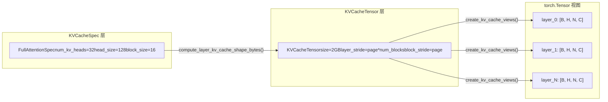

# Chapitre 2 : Abstractions centrales : Request, Sequence et structures de données du KV Cache

Dans le chapitre précédent, nous avons établi le modèle mental stratifié de vLLM v1, en sachant qu'une requête part de l'API Server, traverse EngineCore et atteint finalement le Worker pour exécution. Mais comment une chaîne JSON dans un corps de requête HTTP devient-elle un objet interne au moteur pouvant être planifié, suivi et interrompu ? C'est la question à laquelle la classe Request doit répondre.

# Le système de spécifications du KV Cache : de KVCacheSpec au registre

Request résout la question « qui doit calculer », tandis que`KVCacheSpec`résout la question « où calculer ». Dans le monde de PagedAttention, le KV cache de chaque couche du modèle doit être décrit avec précision : combien de heads, quelle taille par head, combien de tokens un bloc peut stocker, et si une quantification est nécessaire. Ces informations sont encodées dans`KVCacheSpec`la hiérarchie d'héritage.

## Modèle intuitif : KVCacheSpec est le « plan d'étage » de la mémoire vidéo

> **[Design Inference & Architectural Trade-offs]**
> Si l'on imagine la mémoire GPU comme un terrain à aménager,`KVCacheSpec`est le plan d'étage de chaque bâtiment (chaque cache group) : il définit combien de pièces (head slot) par étage (chaque bloc), la taille de chaque pièce (head_size), et combien de personnes peuvent y loger (block_size tokens). Et`KVCacheConfig`C'est le plan d'aménagement de tout le quartier — combien de bâtiments au total, quelle surface occupe chaque bâtiment, quels bâtiments partagent la même fondation (block table).

Sans ce système de spécifications, l'allocation du KV cache ne pourrait reposer que sur des hypothèses codées en dur, incapable de prendre en charge la diversité des besoins des modèles, du MHA standard au MLA, de l'attention complète à la fenêtre glissante, de la quantification FP16 à FP8.

## Structure de données : arbre d'héritage et champs clés de KVCacheSpec

`KVCacheSpec`est la classe de base de toutes les spécifications, c'est un`@dataclass(frozen=True)` [FACT:vllm/v1/kv_cache_interface.py:150-152]. frozen signifie que l'objet de spécification est immuable une fois créé — cela garantit que plusieurs composants (planificateur, Worker, KV Cache Manager) voient la même spécification, sans incohérence due à une modification quelque part.

La classe de base définit trois propriétés abstraites qui doivent être implémentées par les sous-classes :`num_heads`、`tokens_per_state`、`state_content_size_bytes` [FACT:vllm/v1/kv_cache_interface.py:182-183]. Ces trois propriétés déterminent ensemble`page_size_bytes`— c'est-à-dire le nombre d'octets occupés par un block.

`AttentionSpec`est la sous-classe la plus centrale, elle introduit`num_kv_heads`、`head_size`、`dtype`、`kv_quant_mode`et d'autres champs[FACT:vllm/v1/kv_cache_interface.py:485-498]. Parmi eux,`tokens_per_state`la conception du champ est particulièrement ingénieuse : la valeur par défaut est 1, ce qui signifie qu'un state correspond à un token ; mais elle peut être définie comme un entier supérieur à 1 (comme le MLA sparse de DeepSeek-V4 qui compresse plusieurs tokens en un seul state), ou comme une fraction inférieure à 1 (comme le block pooling de Whisper qui utilise`Fraction(1, block_pool_size)`pour indiquer qu'un token correspond à plusieurs states)[FACT:vllm/v1/kv_cache_interface.py:501-501]。

`FullAttentionSpec`ajoute, sur la base de`AttentionSpec`,`sliding_window`et`attention_chunk_size` [FACT:vllm/v1/kv_cache_interface.py:566-566]. Notez que sa docstring explique une décision de conception importante : lorsque l'allocateur hybride est désactivé, les couches d'attention à fenêtre glissante sont traitées comme une attention complète dans le KV Cache Manager (allocation de blocks pour tous les tokens), mais le calcul reste effectué selon la fenêtre glissante lors de l'exécution du modèle[FACT:vllm/v1/kv_cache_interface.py:540-545]. C'est une**allocation conservatrice, calcul précis**comme stratégie.

`MLAAttentionSpec`est la spécification clé de la série de modèles DeepSeek. Elle définit`head_size_v`par défaut à 0[FACT:vllm/v1/kv_cache_interface.py:670], car MLA ne stocke qu'un seul latent vector, sans V indépendant.`alignment`Le champ est utilisé pour le remplissage d'alignement de page[FACT:vllm/v1/kv_cache_interface.py:646-652], ce qui est crucial pour les backends comme FlashMLA qui nécessitent un alignement spécifique.

`MambaSpec`quant à lui ne suit pas du tout la voie de l'attention. Il utilise`shapes`et`dtypes`des tuples pour décrire la forme du tenseur d'état[FACT:vllm/v1/kv_cache_interface.py:1027-1028]，`state_content_size_bytes`est la somme de toutes les tailles de tenseurs d'état[FACT:vllm/v1/kv_cache_interface.py:1048-1052]. Le`max_memory_usage_bytes`de Mamba est calculé selon`mamba_cache_mode`de trois manières différentes[FACT:vllm/v1/kv_cache_interface.py:1073-1084], ce qui reflète la complexité de la gestion d'état de Mamba — il ne croît pas linéairement comme l'attention, mais a une taille d'état fixe.

## Piloté par scénario : conversion des spécifications vers la disposition de la mémoire vidéo

Lorsque le moteur démarre, il doit convertir le`KVCacheSpec`de toutes les couches en une disposition réelle de la mémoire vidéo. Ce processus est réalisé par`KVCacheTensor`et`create_kv_cache_views`.

`KVCacheTensor`décrit la position d'un groupe de couches de même forme dans l'allocation du KV cache[FACT:vllm/v1/kv_cache_interface.py:1406-1427]. Ses champs principaux sont`layer_stride`et`block_stride`: le premier est la distance en octets entre couches adjacentes, le second est la distance en octets entre blocks adjacents. La docstring explique en détail deux modes de disposition : la disposition couche-externe (layer-outermost) donne une zone contiguë à chaque couche, la disposition block-externe (block-outermost) fait que chaque block contient les pages de toutes les couches[FACT:vllm/v1/kv_cache_interface.py:1416-1416]。

`create_kv_cache_views`est au cœur de ce processus[FACT:vllm/v1/kv_cache_interface.py:353-417]. Elle reçoit un buffer int8 plat, et crée via`torch.as_strided`une vue 4D pour chaque couche`[B, H, N, C]`. Le paramètre clé est`strides`, calculé par`compute_layout_strides`[FACT:vllm/v1/kv_cache_interface.py:314-350]. Cette fonction calcule en sens inverse, en partant de la dimension la plus interne, le pas en octets de chaque dimension selon l'ordre des dimensions spécifié par`layout.stride_order`.

Il y a ici une vérification de limite notable : lorsque kernel_block_size est inférieur à spec.block_size (c'est-à-dire qu'un manager block est divisé en plusieurs kernel blocks), le code vérifie si block_stride est égal à dense_page_size[FACT:vllm/v1/kv_cache_interface.py:381-382]. Si ce n'est pas le cas, cela signifie qu'il y a du padding dans la disposition et qu'une division uniforme est impossible ; une ValueError avec une suggestion de correction explicite est alors levée.

## Réflexion de conception : modèle de registre et extensibilité

`KVCacheSpecRegistry`est une conception clé de l'extensibilité de vLLM[FACT:vllm/v1/kv_cache_spec_registry.py:39-40]. Il maintient deux dictionnaires globaux :`_REGISTRY_KVCACHESPEC_LIST`stocke la correspondance des classes de spec vers les métadonnées,`_REGISTRY_ROLE_MANAGERS`stocke la correspondance des rôles vers les managers[FACT:vllm/v1/kv_cache_spec_registry.py:35-36]。

`get_manager_class`La méthode illustre la logique de recherche centrale du registre : elle parcourt vers le haut le MRO (Method Resolution Order) de la classe de spec, et trouve la première classe de base déjà enregistrée[FACT:vllm/v1/kv_cache_spec_registry.py:129-130]. Cela signifie qu'un`CustomFullAttentionSpec`personnalisé, s'il n'est pas enregistré séparément, héritera automatiquement du manager de`FullAttentionSpec`. Cette**recherche basée sur l'héritage**permet, lors de l'ajout d'un nouveau type de spec, de n'enregistrer que la partie différentielle.

`check_kv_cache_spec_registry`La méthode valide au démarrage que les specs de toutes les couches sont enregistrées[FACT:vllm/v1/kv_cache_spec_registry.py:165-174]. Notez qu'elle utilise`raise ValueError`plutôt que`assert`, le commentaire précise explicitement que c'est pour que cela prenne effet également en environnement de production[FACT:vllm/v1/kv_cache_spec_registry.py:165-174]. C'est une décision d'ingénierie importante : le flag`-O`de Python supprime les assert, mais une erreur de configuration en production doit être exposée dès le démarrage, et non provoquer un crash à l'exécution.

> **[Design Inference & Architectural Trade-offs]**
> La conception d'initialisation différée du registre (`_ensure_registered`) résout un problème de dépendance circulaire :`kv_cache_interface.py`a besoin de référencer le registre pour vérifier le type de spec, tandis que le registre a besoin d'importer`single_type_kv_cache_manager`pour obtenir la classe de gestionnaire, qui dépend à son tour de`kv_cache_interface`. En différant l'enregistrement réel jusqu'à la première requête, ce cycle est brisé.

# Résumé de ce chapitre

Ce chapitre a analysé les deux structures de données centrales de vLLM v1.`Request`est le porteur du cycle de vie d'une requête à l'intérieur du moteur ; grâce à la double liste de tokens, au compteur de planification asynchrone et au mécanisme de block hash, il prend en charge les deux fonctionnalités clés que sont le traitement par lots continu et le cache de préfixes.`KVCacheSpec`et sa hiérarchie d'héritage définissent les spécifications de disposition de la mémoire GPU du KV cache, depuis le standard`FullAttentionSpec`jusqu'à`MLAAttentionSpec`、`MambaSpec`, couvrant les besoins variés des architectures de modèles. Le modèle de registre permet d'ajouter de nouveaux types de spec sans modifier le code principal, garantissant ainsi l'extensibilité du système.

À ce stade, nous avons vu clairement comment Request est converti depuis EngineCoreRequest, et comment il prend en charge les décisions de planification via les compteurs d'état, le block hash, etc. Mais comment une requête externe traverse-t-elle réellement l'API Server, le chat template et le traitement multimodal pour finalement devenir un EngineCoreRequest ? Le chapitre suivant abordera la couche d'entrée des requêtes, en traçant complètement ce chemin depuis HTTP/CLI jusqu'à EngineCore.
