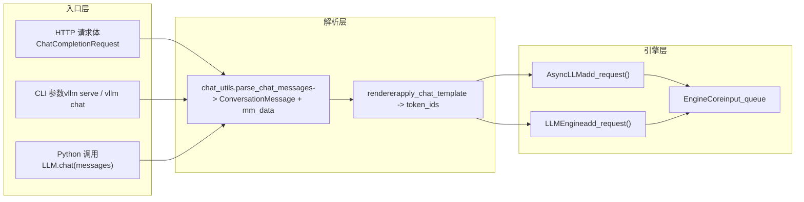

# Chapitre 3 : Entrée des requêtes : le chemin complet depuis HTTP/CLI jusqu'à EngineCore

Dans le chapitre précédent, nous avons analysé les deux structures de données centrales internes au moteur, Request et KVCacheSpec, et compris comment la séquence logique et les blocs de mémoire GPU physiques sont découplés. Mais comment un corps de requête HTTP ou une chaîne Python traverse-t-il réellement l'API Server, le chat template et le traitement multimodal pour finalement devenir un EngineCoreRequest ? Ce chapitre tracera complètement ce chemin et révélera comment les trois voies d'entrée — CLI synchrone, API asynchrone et classe LLM hors ligne — convergent vers le même cœur de moteur.

# 3.1 Le point de convergence des trois voies d'entrée : AsyncLLMEngine et LLMEngine

Avant d'approfondir l'analyse des requêtes, il faut d'abord examiner clairement la topologie des trois voies d'entrée. vLLM propose trois modes d'utilisation :`vllm serve`le service HTTP compatible OpenAI lancé par , l'outil en ligne de commande`vllm`, ainsi que l'instanciation directe en Python de la classe`LLM`pour l'inférence hors ligne. Ils semblent indépendants, mais partagent en réalité le même cœur de moteur.

Examinons d'abord le mécanisme d'alias de la voie API asynchrone.

[FACT:vllm/engine/async_llm_engine.py:7-7]

Ce fichier est si court qu'il ne ressemble presque pas à un module — il ne fait qu'une seule chose : faire pointer l'alias`AsyncLLMEngine`vers`vllm.v1.engine.async_llm.AsyncLLM`. C'est une trace typique de migration architecturale. À l'époque de vLLM v0,`AsyncLLMEngine`était une classe volumineuse et complexe ; après la réécriture de l'architecture v1, la nouvelle`AsyncLLM`assume les mêmes responsabilités. Pour ne pas casser le code utilisateur existant, vLLM conserve l'ancien chemin de module comme couche de compatibilité.

> **[Design Inference & Architectural Trade-offs]**
> Ce modèle « l'ancien chemin pointe par alias vers la nouvelle implémentation » apparaît de manière récurrente dans vLLM (comme`api_server.py`avec son avertissement de dépréciation), ce qui montre que le projet a adopté une stratégie progressive lors de la migration de v0 à v1 : le nouveau code utilise le nouveau chemin, l'ancien code ne génère pas d'erreur mais reçoit un avertissement, laissant aux utilisateurs une fenêtre de migration suffisante.

Examinons maintenant l'entrée de la voie hors ligne.

[FACT:vllm/entrypoints/llm.py:344-346]

`LLM.__init__`appelle finalement`LLMEngine.from_engine_args`, en passant`UsageContext.LLM_CLASS`. Cette énumération`UsageContext`est la clé pour distinguer les voies d'entrée — elle permet au moteur de savoir s'il fonctionne en mode traitement par lots hors ligne ou en mode service en ligne, afin d'ajuster les stratégies de journalisation, de métriques et de gestion des ressources.

[FACT:vllm/entrypoints/llm.py:357-359]

Notez ici l'affectation de`self.renderer = self.llm_engine.renderer`et`self.input_processor = self.llm_engine.input_processor`. La classe hors ligne`LLM`n'implémente pas elle-même le rendu du chat template, mais réutilise le`renderer`interne au moteur. Cela signifie que la logique d'analyse du chat template est le même code sur les voies hors ligne et en ligne, seul le moment de l'appel diffère.

La relation de convergence des trois voies peut être représentée par le diagramme de flux de données suivant.

Ce diagramme révèle une conception clé : quelle que soit la provenance de la requête — HTTP, CLI ou Python —`chat_utils`est l'unique point d'entrée pour le traitement multimodal et du chat template. Il unifie les formats d'entrée hétérogènes en une`ConversationMessage`liste plus`MultiModalDataDict`, puis les confie au renderer pour générer la séquence de tokens.

# 3.2 chat_utils : des messages hétérogènes à une structure de dialogue unifiée

`chat_utils.py`est le module le plus complexe de toute la couche d'entrée des requêtes ; ses 2264 lignes de code traitent tous les formats d'entrée : format compatible OpenAI, extensions personnalisées, intégrations multimodales, appels d'outils, etc. Son rôle principal peut se résumer en une phrase : normaliser toute liste de messages transmise par l'utilisateur en une`ConversationMessage`liste compréhensible par le chat template, tout en extrayant les données multimodales dans un`MultiModalDataDict`séparé.

## Modèle intuitif : traducteur et trieur de bagages

Imaginez`chat_utils`comme un traducteur et trieur de bagages à l'aéroport. Les voyageurs (utilisateurs) viennent de différents pays (format OpenAI, format personnalisé, format Harmony) et parlent différentes langues. Le traducteur traduit d'abord les paroles de chacun dans une langue de travail commune (`ConversationMessage`), tout en triant les bagages enregistrés des passagers (images, audio, vidéo) sur des tapis roulants indépendants (`MultiModalDataDict`), en apposant une étiquette (UUID), puis en acheminant séparément les personnes et les bagages vers le même avion (moteur).

Sans cette couche, le moteur devrait comprendre les détails de chaque format d'entrée, la logique d'extraction des données multimodales serait dispersée dans chaque point d'entrée, et l'ajout de tout nouveau format nécessiterait de modifier le cœur du moteur.

## Structure de données : collaboration à double classe entre tracker et parser

`chat_utils`Le cœur de  repose sur la collaboration de deux groupes de classes :`BaseMultiModalItemTracker`et ses sous-classes sont responsables du « suivi » des éléments multimodaux,`BaseMultiModalContentParser`et ses sous-classes sont responsables de l'« analyse » de la partie contenu.

Examinons d'abord la disposition des champs du tracker.

[FACT:vllm/entrypoints/chat_utils.py:598-601]

`_items_by_modality`est un`defaultdict[str, list[_T]]`, stockant les éléments à traiter groupés par modalité (image, audio, vidéo, etc.).`_modality_order`enregistre spécifiquement pour la modalité`vision_chunk`la modalité d'origine de chaque chunk (image ou vidéo), car le modèle de chunk visuel unifié mappe les deux vers`vision_chunk`, mais le traitement ultérieur doit connaître le type d'origine.

[FACT:vllm/entrypoints/chat_utils.py:613-615]

`use_unified_vision_chunk_modality`est un`cached_property`, lisant le flag`use_unified_vision_chunk`depuis la configuration HuggingFace. L'utilisation de`cached_property`plutôt qu'un attribut ordinaire s'explique par le fait que cette vérification est déclenchée à chaque appel de`add`, et la mise en cache évite les surcoûts répétés de`getattr`.

La méthode`add`du tracker est le point d'entrée principal.

[FACT:vllm/entrypoints/chat_utils.py:656-684]

`add`La méthode  appelle d'abord`_validate_add`pour la validation, puis stocke les éléments sous différentes clés selon que la modalité de chunk visuel unifiée est utilisée ou non. Notons le traitement spécial de`prompt_embeds`: il ajoute directement à`_items_by_modality["prompt_embeds"]`et retourne`None`, car les embeddings précalculés ne passent pas par le processeur HF et n'ont pas de chaîne de placeholder.

`_validate_add`La logique de validation dans  mérite un examen attentif.

[FACT:vllm/entrypoints/chat_utils.py:686-721]

Il y a ici une branche subtile : lorsque`enable_mm_embeds=True`et que la limite par prompt de cette modalité est de 0 et que la modalité d'origine se termine par`_embeds`, la validation du nombre est ignorée. Cela permet aux entrées d'embeddings de contourner la limite de nombre de la modalité d'origine — les embeddings sont précalculés et n'occupent pas les ressources de traitement de la modalité d'origine.

## Piloté par scénario : comment une requête chat avec image est analysée

Supposons qu'un utilisateur envoie une requête chat contenant une URL d'image et du texte.`parse_chat_messages`est le point d'entrée du chemin synchrone.

[FACT:vllm/entrypoints/chat_utils.py:2161-2197]

`parse_chat_messages`crée`MultiModalItemTracker`, parcourt chaque message en appelant`_parse_chat_message_content`, appelle enfin`_postprocess_messages`pour traiter les paramètres d'appel d'outil, puis matérialise les données multimodales via`mm_tracker.resolve_items()`.

`_parse_chat_message_content`est responsable de l'analyse d'un seul message.

[FACT:vllm/entrypoints/chat_utils.py:2007-2029]

Il normalise d'abord le contenu :`None`devient une liste vide, une chaîne devient une seule partie texte. Puis il appelle`_parse_chat_message_content_parts`, où le paramètre`wrap_dicts`est déterminé par`content_format == "openai"`— cela détermine si la sortie est une liste de dictionnaires structurés ou une chaîne concaténée.

`_parse_chat_message_content_parts`parcourt chaque partie.

[FACT:vllm/entrypoints/chat_utils.py:1814-1853]

Chaque partie est traitée par`_parse_chat_message_content_part`. Si`wrap_dicts=False`, le texte et les placeholders sont finalement concaténés en une seule chaîne ; si`wrap_dicts=True`, une liste de dictionnaires structurés est retournée.

`_parse_chat_message_content_part`est le cœur de la distribution.

[FACT:vllm/entrypoints/chat_utils.py:1875-1884]

Pour une partie en texte pur, une vérification de conservation du placeholder est d'abord effectuée, puis le format de retour est déterminé selon`wrap_dicts`. Pour une partie structurée,`_parse_chat_message_content_mm_part`est appelé pour extraire le type et le contenu.

[FACT:vllm/entrypoints/chat_utils.py:1690-1723]

`_parse_chat_message_content_mm_part`recherche la fonction d'analyse correspondante via`MM_PARSER_MAP`. Notons la condition de`uuid is None`— si l'utilisateur a fourni un UUID, cela signifie que les données média ne sont peut-être pas dans le corps de la requête (déjà téléversées par un autre moyen), auquel cas on passe à la branche du champ URL direct ci-dessous.

[FACT:vllm/entrypoints/chat_utils.py:1731-1733]

Lorsque`part_type is None`ou`uuid is not None`, le code tente d'extraire directement le champ URL de la partie. Cette « analyse permissive » vise à assurer la compatibilité avec les clients qui ne suivent pas strictement le format OpenAI.

Revenons à`_parse_chat_message_content_part`, les parties de type média sont distribuées vers les méthodes`mm_parser`correspondantes.

[FACT:vllm/entrypoints/chat_utils.py:1923-1968]

Chaque type de média appelle la méthode`parse_*`correspondante, qui en interne appelle`tracker.add`pour ajouter l'élément au tracker et retourne une chaîne de placeholder. Enfin, selon`interleave_strings`, on décide de retourner le placeholder ou`None`。

[FACT:vllm/entrypoints/chat_utils.py:1984-1999]

`prompt_embeds`est traité spécialement : quel que soit`interleave_strings`, on retourne`PROMPT_EMBEDS_PLACEHOLDER_TOKEN`. Le commentaire explique pourquoi — prompt_embeds est concaténé aux décalages de tokens, la position est importante, et passer par la logique de remplissage préalable de`missing_placeholders`perturberait l'ordre.

## Différences du chemin asynchrone

Le chemin asynchrone utilise`AsyncMultiModalItemTracker`et`AsyncMultiModalContentParser`. La différence principale réside dans`resolve_items`。

[FACT:vllm/entrypoints/chat_utils.py:906-952]

La version asynchrone utilise`asyncio.gather`pour attendre concurremment tous les éléments de modalité. Le commentaire indique explicitement : chaque élément suivi est déjà un awaitable indépendant, le connecteur asynchrone décharge le travail de décodage bloquant vers le pool de threads, donc attendre séquentiellement une modalité puis la suivante augmenterait inutilement la latence.`return_exceptions=True`permet de ne lever l'exception qu'après que toutes les tâches sont terminées ou échouées, évitant d'abandonner les requêtes réseau encore en cours dès le premier échec.

## Réflexion de conception : pourquoi séparer tracker et parser

> **[Design Inference & Architectural Trade-offs]**
> La séparation entre tracker et parser est une conception intéressante. Le tracker est responsable de la « gestion d'état » — enregistrer combien d'éléments par modalité, valider les limites de nombre, maintenir l'ordre de modalité d'origine des vision_chunk. Le parser est responsable de l'« extraction de contenu » — récupérer les images depuis une URL, décoder les embeddings depuis du base64, gérer la conversion de format audio. Cette séparation permet aux chemins synchrone et asynchrone de partager la logique de suivi (`BaseMultiModalItemTracker`est une classe de base abstraite), et de diverger uniquement au niveau du parser. Si l'on fusionnait en une seule classe, les différences entre synchrone et asynchrone s'infiltreraient dans la logique de suivi, entraînant une duplication de code et une complexification de la gestion d'état.

# 3.3 Des messages aux tokens : la passation entre renderer et EngineCore

`chat_utils`La liste`ConversationMessage`et`MultiModalDataDict`produits doivent encore passer par le rendu du template de chat pour devenir une séquence de tokens. Cette étape est effectuée par le renderer, après quoi la requête entre véritablement dans le moteur.

## Piloté par scénario : rendu du template de chat et soumission de la requête

`parse_chat_messages`Après le retour, l'appelant (comme`OpenAIServingChat`) transmet`conversation`et`mm_data`au renderer. Le renderer applique le chat template, rend la liste`ConversationMessage`sous forme de texte, puis la tokenise en une séquence d'ID de tokens. Les placeholders multimodaux (comme`<##IMAGE##>`) sont remplacés après tokenisation par des tokens placeholders spécifiques au modèle.

Une fois le rendu terminé, la requête est encapsulée en`EngineCoreRequest`, puis déposée dans la file d'entrée de l'EngineCore via`AsyncLLM.add_request()`ou`LLMEngine.add_request()`.

[FACT:vllm/entrypoints/llm.py:420-484]

La méthode hors ligne`LLM.generate`illustre cette chaîne : elle valide d'abord`runner_type`, récupère les paramètres d'échantillonnage par défaut, puis appelle`_run_completion`。`_run_completion`. En interne,`llm_engine`appelle le renderer pour rendre le prompt, puis dépose la requête via

[FACT:vllm/entrypoints/llm.py:615-708]

`LLM.chat`. La méthode`messages`illustre quant à elle le chemin chat : elle reçoit la liste`_run_chat`, appelle`parse_chat_messages`, qui en interne appelle

## et le renderer.

> **[Design Inference & Architectural Trade-offs]**
> `LLM.__init__`〔Inférences de conception et compromis architecturaux〕`self.renderer = self.llm_engine.renderer`Dans`self.renderer.warmup(ChatParams(...))`, la ligne`LLM`révèle une décision de conception importante : le renderer appartient au moteur et non à la couche d'entrée. Cela signifie que le chargement, la mise en cache et le préchauffage du chat template (`AsyncLLM`) sont effectués lors de l'initialisation du moteur, la couche d'entrée n'étant qu'un appelant. L'avantage est que le mode hors ligne

## et le mode en ligne

`_postprocess_messages`partagent la même implémentation de renderer et le même cache, évitant le rechargement répété du tokenizer et du chat template. De plus, le préchauffage du renderer peut être effectué au démarrage du moteur, évitant ainsi la latence de démarrage à froid de la première requête.

[FACT:vllm/entrypoints/chat_utils.py:2118-2158]

Récupération d'erreurs et pièges en production`tool_calls`Le traitement des paramètres d'appel d'outils dans`arguments`est un piège typique en environnement de production.`arguments`Lorsqu'un message assistant contient

, le champ

[FACT:vllm/entrypoints/chat_utils.py:1856-1872]

peut être une chaîne JSON, un dictionnaire ou un JSON invalide. Le code tente d'analyser la chaîne JSON ; en cas d'échec, il enregistre un avertissement et force la conversion en objet vide. Le commentaire explique la raison : des`enable_prompt_embeds`malformés existent dans l'historique de conversation ; si l'on fait échouer la requête ici, chaque tour suivant échouera également et la conversation ne pourra pas être récupérée. Il s'agit d'une conception de tolérance aux pannes réfléchie — mieux vaut que le modèle voie des paramètres d'outil vides plutôt que de bloquer toute la conversation.`PROMPT_EMBEDS_PLACEHOLDER_TOKEN`Un autre piège est la protection contre l'injection de placeholders réservés.`_reject_reserved_placeholder_in_text`Lorsque

[FACT:vllm/entrypoints/chat_utils.py:1889-1892]

est activé,`isinstance(part, str)`est enregistré comme token spécial insécable. Si le texte utilisateur contient exactement cette séquence littérale, le tokenizer l'encodera comme le même ID de token, et le renderer croira à tort qu'il s'agit d'un point de concaténation, permettant à l'appelant de déplacer ou d'injecter la position de concaténation via un contenu en texte brut.

# rejette ce type d'entrée lors de l'analyse des parties textuelles, colmatant ainsi cette faille de sécurité.

Notez que cette vérification est appelée à la fois dans la branche`LLM`et dans la branche de texte structuré, garantissant que tous les chemins textuels sont protégés.`chat_utils`Résumé du chapitre`BaseMultiModalItemTracker`Ce chapitre a retracé le premier segment du chemin d'une requête entrant dans le système depuis l'extérieur. Les trois chemins d'entrée — API HTTP, CLI et classe hors ligne`BaseMultiModalContentParser`— convergent tous finalement vers la couche d'analyse multimodale de`parse_chat_messages`.`ConversationMessage`est responsable de la gestion d'état,`MultiModalDataDict`est responsable de l'extraction de contenu ; leur séparation permet aux chemins synchrones et asynchrones de partager la logique de traçage.`EngineCoreRequest`normalise les messages hétérogènes en une liste

# et

, puis les confie au renderer interne du moteur pour effectuer le rendu du chat template et la tokenisation. Finalement, la requête est encapsulée en`_parse_chat_message_content_mm_part`et déposée dans la file d'entrée de l'EngineCore.`uuid is None`Réflexions et auto-évaluation du chapitre`if isinstance(part_type, str) and part_type in MM_PARSER_MAP:`Q1 : Dans

**, si l'on supprime la condition**：`uuid is None`(c'est-à-dire en la remplaçant par`MM_PARSER_MAP[part_type](part)`), dans quel scénario cela poserait-il problème ?`image_url`Analyse de référence`None`La condition`parse_image(None, uuid)`existe pour gérer le scénario où « l'utilisateur fournit un UUID mais les données média ne sont pas dans le corps de la requête ». Lorsqu'un utilisateur fournit un UUID, les données média ont peut-être déjà été téléversées par un autre moyen (par exemple préalablement téléversées dans le cache média) ; dans ce cas, la partie du corps de la requête peut ne contenir que l'UUID sans l'URL ou les données réelles. Si l'on supprime cette condition, le code tentera d'analyser via`_connector.fetch_image(None)`, mais la partie peut ne pas contenir le champ de données correspondant (par exemple`uuid is not None`vide), ce qui produirait un contenu[FACT:vllm/entrypoints/chat_utils.py:1713-1723]. Plus grave encore, le[FACT:vllm/entrypoints/chat_utils.py:1731-1733]。

Q2: `AsyncMultiModalItemTracker.resolve_items`suivant appellerait`asyncio.gather(..., return_exceptions=True)`, ce qui pourrait déclencher des requêtes réseau inutiles ou des exceptions.`return_exceptions=False`La branche`False`emprunte quant à elle le chemin d'extraction directe des champs, traitant correctement le cas « UUID présent sans données ». Voir

**et**：`return_exceptions=False`Utilise`asyncio.gather`au lieu du`return_exceptions=True`On laisse toutes les tâches se terminer ou échouer avant de vérifier de manière unifiée, afin de garantir qu'aucune tâche ne soit abandonnée. Le commentaire l'explique clairement : « Gathering with return_exceptions=True lets every task finish (or itself fail) before we raise, instead of abandoning still-in-flight fetches (real network/thread-pool work) the moment the first one fails. » Voir[FACT:vllm/entrypoints/chat_utils.py:924-931]。

Q3: `_postprocess_messages`, lorsque`arguments`est un JSON invalide, le code choisit de forcer la conversion en objet vide plutôt que de lever une exception. Si l'on changeait pour lever une exception, dans quel scénario de production cela entraînerait-il un état de conversation irrécupérable ?

**Analyse de référence**：`arguments`Le champ existe dans l'historique de conversation (le`tool_calls`du message assistant). Si lors d'un tour de conversation le modèle génère un`arguments`mal formé, cette erreur sera conservée dans l'historique de conversation. Si`_postprocess_messages`lève une exception lors de l'analyse de l'historique, alors chaque tour de requête suivant échouera à cause de cette erreur dans l'historique — même si l'entrée du tour actuel est parfaitement correcte. L'utilisateur ne pourra plus continuer cette conversation et devra abandonner toute la session pour recommencer. Forcer la conversion en objet vide permet à la conversation de continuer ; après avoir vu des paramètres d'outil vides, le modèle régénérera un appel correct. Le commentaire explique ce point : « A malformed arguments string lives in conversation history, so failing the request here would fail every subsequent turn too and leave the conversation unrecoverable. » Voir[FACT:vllm/entrypoints/chat_utils.py:2124-2139]。

Le chapitre suivant abordera le planificateur, pour voir comment EngineCore orchestre ces requêtes avec le traitement par lots continu et une stratégie sensible à la mémoire vidéo.

À ce stade, la requête a achevé sa transformation normalisée depuis l'entrée externe vers EngineCoreRequest, et a atteint l'entrée du cœur du moteur. Mais une fois la requête entrée, elle n'est pas exécutée immédiatement — le moteur doit décider quelles requêtes traiter à chaque étape et comment allouer les ressources limitées de mémoire vidéo. Le chapitre suivant plongera dans la boucle de planification d'EngineCore, analysera comment le Scheduler équilibre débit et latence dans le traitement par lots continu, et comment le chunked prefill, le prefix caching et l'allocation de blocs KV coopèrent.
