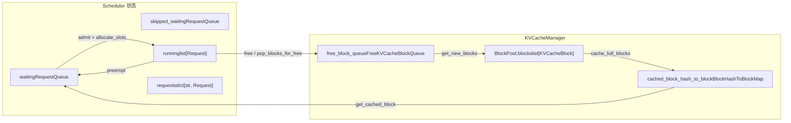
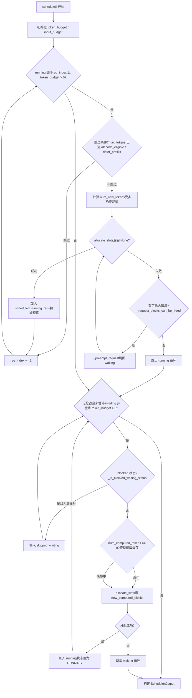

# Chapitre 4 : Planificateur : traitement par lots continu et orchestration des requêtes sensible à la mémoire vidéo

Après qu'une requête entre dans la file d'entrée d'EngineCore, elle n'est pas exécutée immédiatement. Quelles requêtes traiter à chaque étape, combien de budget de tokens allouer à chaque requête, qui sacrifier en priorité en cas de mémoire vidéo insuffisante — toutes ces décisions sont concentrées dans la méthode`Scheduler.schedule()`. Ce chapitre part des structures de données du planificateur et suit comment un appel`schedule()`organise la file waiting, la liste running et le pool de KV cache en un lot exécutable.

# 4.1 Structures de données du planificateur : trois files et un pool de mémoire vidéo

La question centrale à laquelle le planificateur doit répondre est :**Sous un budget limité de tokens et de blocs KV, quelles requêtes doivent avancer de combien de tokens à cette étape ?**Pour le comprendre, il faut d'abord voir quels états il détient.

Le planificateur maintient trois types de conteneurs de requêtes.`self.requests`est un dictionnaire global,`req_id -> Request`, source unique de vérité pour toutes les requêtes actives[FACT:vllm/v1/core/sched/scheduler.py:208-209]。`self.waiting`et`self.skipped_waiting`sont deux files de priorité ; la première contient les requêtes en attente normale de planification, la seconde contient les requêtes temporairement non planifiables en raison de dépendances asynchrones ou de contraintes (comme l'attente d'un KV distant, l'attente de la compilation de la grammaire de sortie structurée)[FACT:vllm/v1/core/sched/scheduler.py:208-209]。`self.running`est une liste ordinaire, contenant les requêtes déjà entrées en état d'exécution et détenant des blocs KV[FACT:vllm/v1/core/sched/scheduler.py:208-209]。

Il y a ici une conception facile à négliger :`max_num_running_reqs`et`max_num_active_reqs`sont deux limites supérieures différentes. La première provient de`max_num_seqs`, détermine le nombre d'emplacements du model runner ; la seconde provient de`max_num_active_seqs`, limite seulement le nombre de requêtes pouvant entrer en RUNNING, et est par défaut égale à la première[FACT:vllm/v1/core/sched/scheduler.py:123-131]. Cette séparation permet de réduire la taille réelle du lot de décodage concurrent sans diminuer la capacité de capture du CUDA graph.

Le côté mémoire vidéo est géré uniformément par`KVCacheManager`, qui détient en interne`BlockPool`。`BlockPool`Le cœur de`self.blocks`est`KVCacheBlock`(la liste de tous les`free_block_queue`) et[FACT:vllm/v1/core/block_pool.py:171-177](une liste doublement chaînée de blocs libres ordonnée selon l'ordre d'éviction)`null_block`. Notez la présence de`is_null=True`: c'est le premier bloc retiré de la tête de la file libre,[FACT:vllm/v1/core/block_pool.py:183-187], le compteur de références ne participe pas à la maintenance courante, il sert spécialement de placeholder

. Lorsqu'une position de token d'une requête n'a pas besoin d'un vrai bloc KV (par exemple une position sautée par la fenêtre glissante), ce null block est inséré dans la block table.`BlockHashToBlockMap`La structure d'index du cache de préfixes est`BlockHashWithGroupId`, elle mappe`KVCacheBlock`vers un`{block_id: KVCacheBlock}`ou un dictionnaire[FACT:vllm/v1/core/block_pool.py:56-59]. Pourquoi utiliser un type union ? Les commentaires donnent la réponse : la plupart des hachages ne correspondent qu'à un seul bloc, et utiliser un dictionnaire entraînerait des surcoûts de GC inutiles ; ce n'est que lorsque le même hachage est partagé par plusieurs blocs qu'on passe à un dictionnaire.[FACT:vllm/v1/core/block_pool.py:56-59]. Il s'agit d'un compromis typique consistant à échanger de la complexité de type contre un surcoût d'exécution.

`KVCacheBlocks`est l'objet d'interface entre le planificateur et le gestionnaire de KV cache, qui masque les structures de données internes. Son`blocks`champ est`tuple[Sequence[KVCacheBlock], ...]`, la dimension externe est le KV cache group, la dimension interne est la séquence de blocs[FACT:vllm/v1/core/kv_cache_manager.py:41-54]. Les commentaires expliquent clairement pourquoi ne pas utiliser le bloc comme dimension externe : cela supposerait que tous les groupes ont le même nombre de blocs, alors qu'à l'avenir il pourrait être possible de configurer une taille de bloc différente pour différents groupes.[FACT:vllm/v1/core/kv_cache_manager.py:43-48]。



Ce schéma ancre le flux de données entre le planificateur et le pool de mémoire GPU : les requêtes de la file waiting entrent dans running via`allocate_slots`, les requêtes running retournent dans waiting lorsqu'elles sont préemptées, les blocs libérés retournent dans la file d'attente libre, et la table de hachage du cache de préfixes est le point d'entrée pour que les requêtes waiting touchent le cache.

# 4.2 Flux principal de schedule() : priorité au running, complément par le waiting, préemption en dernier recours

`schedule()`est la méthode centrale de tout le planificateur, elle retourne un`SchedulerOutput`, décrivant ce qu'il faut exécuter à cette étape. Les commentaires au début de la méthode précisent la philosophie de conception : dans le planificateur, il n'y a pas de distinction entre « phase de décodage » et « phase de préremplissage », chaque requête n'a que`num_computed_tokens`et`num_tokens_with_spec`, et la tâche du planificateur est de faire rattraper le second par le premier[FACT:vllm/v1/core/sched/scheduler.py:559-568]. Cette vision unifiée est la base permettant la coexistence du chunked prefill, du prefix caching et du décodage spéculatif.

## 4.2.1 Initialisation du budget et calcul des seuils

Avant d'entrer dans la boucle principale, le planificateur définit d'abord deux budgets :`token_budget`initialisé à`max_num_scheduled_tokens`，`input_budget`initialisé à`max_num_batched_tokens` [FACT:vllm/v1/core/sched/scheduler.py:577-580]. Les deux sont généralement égaux, mais lorsque le modèle peut ajouter des tokens dans le lot (comme en décodage spéculatif),`max_num_scheduled_tokens`sera inférieur à`max_num_batched_tokens`, la différence étant l'espace réservé aux draft tokens.

`long_prefill_token_threshold`Le traitement de[FACT:vllm/v1/core/sched/scheduler.py:606-616]mérite un examen séparé. Son rôle est d'empêcher qu'un long prefill affame les autres requêtes, mais s'il n'y a qu'une seule requête actuellement, personne ne sera affamé, donc le seuil est mis à zéro`adaptive_long_prefill_threshold`. Lorsque`input_budget // num_eligible_reqs`est activé, le seuil est également relevé à[FACT:vllm/v1/core/sched/scheduler.py:617-622]。

## , garantissant que le budget d'une requête individuelle ne sera pas comprimé en dessous de sa part équitable.

4.2.2 Boucle de planification des requêtes running`self.running`La boucle principale parcourt à partir de la tête de`req_index`, le curseur étant[FACT:vllm/v1/core/sched/scheduler.py:624-627]. Pour chaque requête, une série de vérifications de saut est d'abord effectuée :

- En planification asynchrone, si le placeholder de sortie de la requête indique qu'elle a déjà atteint`max_tokens`, on saute pour éviter d'exécuter une étape supplémentaire[FACT:vllm/v1/core/sched/scheduler.py:631-645]。
- Dans le scénario V2 + PP + asynchrone, si l'étape actuelle n'a pas encore atteint`next_decode_eligible_step`, on saute pour correspondre au rythme de diffusion des tokens d'échantillonnage côté worker[FACT:vllm/v1/core/sched/scheduler.py:647-651]。
- Lorsque l'équilibrage DP prefill est activé, les chunks de prefill sur les étapes non alignées au rythme sont différés[FACT:vllm/v1/core/sched/scheduler.py:653-657]。

Après avoir passé les vérifications de saut, on calcule de combien de tokens cette requête peut avancer à cette étape :

```
num_new_tokens = request.num_tokens_with_spec
               + request.num_output_placeholders
               - request.num_computed_tokens
```

puis successivement contraint par`long_prefill_token_threshold`、`token_budget`、`input_budget - draft_slots`et`max_model_len`. Si la requête comporte une entrée d'encodeur, elle doit également être ajustée par[FACT:vllm/v1/core/sched/scheduler.py:670-688]`_try_schedule_encoder_inputs`L'étape suivante est la plus cruciale : allouer les KV blocks.[FACT:vllm/v1/core/sched/scheduler.py:700-712]。

`allocate_slots`est encapsulé dans une boucle`while True`[FACT:vllm/v1/core/sched/scheduler.py:742-747]. Si elle retourne`None`, cela signifie que la mémoire GPU est insuffisante, le planificateur commence la préemption : sélectionner une victime selon la stratégie (la stratégie PRIORITY choisit celle de plus basse priorité, la stratégie FCFS choisit celle en fin de liste running)[FACT:vllm/v1/core/sched/scheduler.py:761-767], appeler`_preempt_request`pour la renvoyer dans la file waiting, puis réessayer l'allocation[FACT:vllm/v1/core/sched/scheduler.py:801-806]. Si la victime est la requête actuelle elle-même, cela signifie qu'il n'y a plus d'objet à préempter, on sort de la boucle et la requête actuelle ne peut pas non plus être planifiée.[FACT:vllm/v1/core/sched/scheduler.py:807-813]。

Il y a un détail subtil dans la logique de préemption : sous la stratégie PRIORITY, si la requête préemptée est déjà dans`scheduled_running_reqs`(c'est-à-dire que des ressources lui ont déjà été allouées à cette étape), il faut restituer intégralement son budget de tokens, ses blocks, ses tokens spéculatifs et son budget d'encodeur[FACT:vllm/v1/core/sched/scheduler.py:779-797]. Cela garantit la cohérence du registre des budgets.

Après une allocation réussie, la requête est ajoutée à`scheduled_running_reqs`, on enregistre les blocks et le nombre de tokens, on déduit le budget[FACT:vllm/v1/core/sched/scheduler.py:815-823]. Les tokens liés au décodage spéculatif sont ici découpés et enregistrés.[FACT:vllm/v1/core/sched/scheduler.py:825-841]。

## 4.2.3 Admission des requêtes waiting

Après la fin de la boucle running, si aucune préemption n'a eu lieu à cette étape et que le planificateur n'est pas en pause, on commence à traiter la file waiting[FACT:vllm/v1/core/sched/scheduler.py:868-872]. Avant l'admission, deux limites sont vérifiées :`max_num_active_reqs`et`input_budget` [FACT:vllm/v1/core/sched/scheduler.py:873-879]。

La planification des requêtes waiting comporte une étape supplémentaire de recherche dans le cache de préfixes par rapport au running. Lorsque`request.num_computed_tokens == 0`, appeler`_get_local_prefix_cache_hit`pour rechercher une correspondance dans le cache local[FACT:vllm/v1/core/sched/scheduler.py:932-939]. Si un KV connector est configuré, on interroge également le cache distant pour une correspondance.[FACT:vllm/v1/core/sched/scheduler.py:942-954]。

Il y a ici une logique fine de gestion des conflits entre correspondances locales et distantes. Une correspondance locale peut ne pas être alignée sur les blocs (`partial_tail`), et si une correspondance distante dépasse strictement la correspondance locale complète, on abandonne la queue du sous-bloc local pour la laisser être couverte par le chargement distant, évitant ainsi le copy-on-write[FACT:vllm/v1/core/sched/scheduler.py:977-988]. Inversement, on conserve la queue locale et on ne charge pas l'externe.[FACT:vllm/v1/core/sched/scheduler.py:989-995]。

Après une admission réussie, la requête est retirée de la file waiting, son état est défini à RUNNING, et elle est ajoutée à la liste running[FACT:vllm/v1/core/sched/scheduler.py:1263-1319]. Si après cette étape elle est encore en prefill (`num_computed_tokens + num_new_tokens < request.num_tokens`), on l'ajoute à l'ensemble`_inflight_prefills`[FACT:vllm/v1/core/sched/scheduler.py:1326-1328]。



Ce graphe de flux de contrôle couvre les deux grandes boucles et la branche de préemption de`schedule()`. Noter le chemin de nouvelle tentative de préemption après échec de`allocate_slots`dans la boucle running, ainsi que le déplacement des requêtes en état blocked vers`skipped_waiting`du contournement.

# 4.3 Le cœur de la conscience de la mémoire vidéo : allocate_slots et la préemption

`allocate_slots`est la porte entre l'ordonnanceur et la mémoire vidéo. Sa liste de paramètres est elle-même un registre de mémoire vidéo :`num_new_tokens`est le nombre de tokens à recalculer,`num_new_computed_tokens`est le nombre de tokens nouvellement touchés par le cache de préfixe,`num_external_computed_tokens`est le nombre de touches externes fournies par le connector,`num_lookahead_tokens`est le nombre d'emplacements réservés pour le décodage spéculatif[FACT:vllm/v1/core/kv_cache_manager.py:371-383]。

Le commentaire au début de la méthode décrit précisément la disposition des blocs à l'aide d'un schéma ASCII[FACT:vllm/v1/core/kv_cache_manager.py:417-438]：

```
|  |  |   |   |  |
                                          |        |
                        |                       |
```

`comp`est les tokens déjà calculés,`new_comp`est les touches du cache de préfixe,`ext_comp`est les touches externes,`new`est le nouveau calcul de cette étape,`lookahead`est la réservation spéculative. L'allocation se fait en trois phases : d'abord libérer les blocs inutiles et vérifier s'il y a suffisamment de blocs libres, puis traiter les tokens de préfixe, et enfin allouer des blocs pour les tokens nouvellement calculés[FACT:vllm/v1/core/kv_cache_manager.py:458-461]。

## 4.3.1 Ligne de flottaison et contrôle d'admission

`allocate_slots`contient deux portes d'admission. La première est`full_sequence_must_fit`: lorsqu'elle est activée, on vérifie d'abord si la séquence de requête entière (et non seulement le premier chunk) peut tenir, sinon on retourne directement`None` [FACT:vllm/v1/core/kv_cache_manager.py:515-531]. Cela empêche une admission excessive sous chunked prefill de provoquer des oscillations du KV cache.

La seconde est la ligne de flottaison.`watermark_blocks`ne prend effet que lorsque l'état de la requête est WAITING ou PREEMPTED et qu'une requête a déjà été ordonnancée[FACT:vllm/v1/core/kv_cache_manager.py:506-513]. Elle exige de conserver au moins une certaine proportion de blocs libres après l'allocation, afin d'éviter les expulsions et préemptions fréquentes.`reserved_blocks`est utilisé dans les scénarios de chargement KV asynchrone, pour garantir que les blocs réservés du prefill en cours ne soient pas consommés par de nouvelles requêtes[FACT:vllm/v1/core/kv_cache_manager.py:564-570]。

## 4.3.2 Le coût et la récupération de la préemption

> **[Design Inference & Architectural Trade-offs]**
> `_preempt_request`fait une chose qui semble brutale mais nécessaire : réinitialiser le`num_computed_tokens`de la requête à 0[FACT:vllm/v1/core/sched/scheduler.py:1560-1561]. Cela signifie que la requête préemptée doit refaire le prefill depuis le début lors de la prochaine ordonnancement. Pourquoi cette conception ? Parce que les KV block de vLLM sont privés à la requête, la préemption doit libérer tous les blocs, et après libération, il n'est pas garanti de récupérer les mêmes blocs lors de la réallocation, donc on ne peut que recalculer depuis le début. L'existence du cache de préfixe compense partiellement ce coût : si le préfixe de la requête préemptée est déjà mis en cache, il peut être touché lors de la réordonnancement, sans véritable recalcul.

La préemption gère également le problème des « sorties obsolètes » sous ordonnancement asynchrone.`num_stale_output_tokens`est défini à`num_in_flight_tokens`, marquant toutes les sorties en cours comme obsolètes[FACT:vllm/v1/core/sched/scheduler.py:1571-1574]. Ces tokens seront quand même livrés (les jeter perturberait le taux d'acceptation du décodage spéculatif), mais ne modifieront pas les compteurs réinitialisés.`drop_stale_output`le flag détermine s'il faut jeter ou livrer[FACT:vllm/v1/core/sched/scheduler.py:1539-1547]。

## 4.3.3 Libération différée : risque de lecture après écriture des connecteurs asynchrones

Lorsqu'on utilise un KV connector et qu'il existe plusieurs lots en cours,`defer_block_free`est défini à`True` [FACT:vllm/v1/core/sched/scheduler.py:175-181]. La raison : une étape peut encore écrire dans les blocs KV d'une requête libérée, tandis qu'un connector consommateur peut réallouer et remplir ces blocs via un chargement non ordonné par rapport à cette écriture.

La libération différée est implémentée via`deferred_frees`une deque, chaque entrée étant`(fence_seq, blocks)` [FACT:vllm/v1/core/sched/scheduler.py:388-390]。`_free_request_blocks`vérifie`_request_blocks_can_be_freed`, si la dernière étape d'ordonnancement de la requête n'a pas encore été traitée, on place les blocs dans la file différée[FACT:vllm/v1/core/sched/scheduler.py:2679-2688]。`_drain_deferred_frees`dans`update_from_output`avance`processed_step_seq`puis appelle, libérant les blocs dont la fence est satisfaite[FACT:vllm/v1/core/sched/scheduler.py:2701-2706]。

# 4.4 Détermination des touches du cache de préfixe et cycle de vie des blocs

Le point d'entrée de la recherche du cache de préfixe est`KVCacheManager.get_computed_blocks`. Il vérifie d'abord si le cache est activé et si la requête n'est pas marquée pour ignorer la lecture[FACT:vllm/v1/core/kv_cache_manager.py:286-287]. Puis appelle`coordinator.find_longest_cache_hit`, en passant`request.block_hashes`et`max_cache_hit_length = request.num_tokens - 1` [FACT:vllm/v1/core/kv_cache_manager.py:295-300]。

Pourquoi`num_tokens - 1`? Le commentaire explique : lorsque tous les tokens touchent le cache, il faut recalculer le dernier token pour obtenir les logits[FACT:vllm/v1/core/kv_cache_manager.py:289-294]. C'est un cas limite facile à négliger : même si le préfixe est entièrement touché, il faut calculer au moins un token.

Le cycle de vie des blocs est géré par`BlockPool`.`get_new_blocks`retire un bloc de la tête de la file libre, si le cache est activé, appelle d'abord`_maybe_evict_cached_block`pour effacer ses métadonnées de hachage, puis incrémente le compteur de références[FACT:vllm/v1/core/block_pool.py:683-702]。`free_blocks`décide de replacer en tête ou en queue de file selon que le bloc a un hachage : les blocs sans hachage sont réutilisés en LIFO (meilleure localité GPU), les blocs avec hachage en FIFO (comportement d'éviction LRU)[FACT:vllm/v1/core/block_pool.py:785-805]。

`cache_full_blocks`est le moment où un bloc est écrit dans la table de hachage du cache de préfixe. Il parcourt les blocs nouvellement pleins, ignore les blocs null et les blocs masqués, calcule un hachage pour chaque bloc et l'insère dans`cached_block_hash_to_block` [FACT:vllm/v1/core/block_pool.py:272-300]. Si le bloc a déjà un hachage (scénario où un bloc partiel est promu en bloc plein), on retire d'abord l'ancien hachage puis on insère le nouveau[FACT:vllm/v1/core/block_pool.py:285-293]。

`touch`gère le compteur de références lors d'une touche de cache : si le bloc est dans la file libre (`ref_cnt == 0`), on le retire d'abord de la file, puis on incrémente le compteur de références[FACT:vllm/v1/core/block_pool.py:754-770]. Cela garantit que les blocs touchés ne seront pas évincés.

# Réflexions de conception

> **[Design Inference & Architectural Trade-offs]**
> **Pourquoi la préemption choisit-elle « recalcul depuis le début » plutôt que « conservation partielle » ?**La conservation partielle nécessite d'enregistrer la position physique des blocs de chaque requête au moment de la préemption, et de tenter de restaurer le mapping lors de la réordonnancement. Mais le pool de blocs est partagé globalement, d'autres requêtes peuvent déjà avoir occupé ces blocs. La complexité et le coût mémoire de maintenir ce mapping dépassent le coût du recalcul, surtout lorsque le cache de préfixe peut toucher la majeure partie du préfixe.

> **[Design Inference & Architectural Trade-offs]**
> **Pourquoi la ligne de flottaison est-elle à 0 par défaut ?**La ligne de flottaison est une assurance contre les préemptions fréquentes, mais elle sacrifie le taux d'utilisation de la mémoire vidéo. La désactiver par défaut signifie que vLLM privilégie le débit plutôt que la stabilité, l'utilisateur doit l'activer lui-même selon les caractéristiques de la charge.

> **[Design Inference & Architectural Trade-offs]**
> **`skipped_waiting`La raison d'être de la file.**Sans cette file d'attente, les requêtes bloquées occuperaient en permanence la tête de la file waiting, empêchant les requêtes suivantes d'être planifiées (selon la stratégie FCFS). En la séparant, le planificateur peut ignorer les requêtes bloquées et continuer à traiter les suivantes, tout en conservant l'état des requêtes bloquées pour une promotion ultérieure.

# Résumé du chapitre

Le cœur du planificateur réside dans les`schedule()`deux boucles de la méthode : la boucle running garantit en priorité la progression des requêtes déjà en cours, tandis que la boucle waiting admet de nouvelles requêtes lorsque le budget le permet. En cas d'insuffisance de mémoire GPU, de l'espace est libéré en préemptant la requête de plus faible priorité dans la liste running ; la requête préemptée voit son`num_computed_tokens`réinitialisé à 0, mais le cache de préfixes compense partiellement le coût de recalcul.`allocate_slots`est la porte de la mémoire GPU, qui empêche la surallocation via`full_sequence_must_fit`, les niveaux d'eau et`reserved_blocks`trois niveaux de contrôle d'admission. Le cache de préfixes permet le partage entre requêtes via un index par hachage de blocs, et le critère de succès est plafonné par`num_tokens - 1`afin de garantir qu'au moins un token soit calculé pour obtenir les logits.

# Réflexions et auto-évaluation de ce chapitre

Q1 : Dans la boucle running de`schedule()`, si`allocate_slots`renvoie`None`et que`_request_blocks_can_be_freed`renvoie`False`pour la victime, le code`break`sort de la boucle. Si l'on supprime cette vérification et qu'on appelle directement`_preempt_request`, dans quel scénario cela entraînerait-il une incohérence d'état ?

**Analyse de référence**：`_request_blocks_can_be_freed`vérifie`request.last_sched_seq <= self.processed_step_seq` [FACT:vllm/v1/core/sched/scheduler.py:2672-2677]. Lorsque`defer_block_free`est activé, si la dernière étape de planification de la victime n'a pas encore été traitée, ses blocs peuvent encore être écrits par des étapes GPU en vol. Une préemption directe appellerait`_free_request_blocks`, et ce dernier, lorsque`_request_blocks_can_be_freed`vaut`False`, placera les blocs dans`deferred_frees`au lieu de les libérer immédiatement[FACT:vllm/v1/core/sched/scheduler.py:2679-2688]. Mais la sémantique de la préemption est de « libérer immédiatement les blocs pour la requête courante », et une libération différée ne peut pas satisfaire ce besoin ;`allocate_slots`échouera à nouveau, formant une boucle infinie. Plus grave encore, si les blocs de la victime sont libérés de manière différée puis alloués à la requête courante, alors que le GPU écrit encore dans les blocs de la victime, une course de données se produira.

Q2: `get_computed_blocks`dans`max_cache_hit_length = request.num_tokens - 1`. Si l'on remplace par`request.num_tokens`, dans quels cas cela entraînerait-il une sortie erronée ?

**Analyse de référence**: lorsque tous les tokens d'une requête touchent le cache,`num_computed_tokens`sera égal à`num_tokens`. Le planificateur estime alors qu'aucun nouveau token n'a besoin d'être calculé, mais l'échantillonnage des logits nécessite l'état caché de la dernière position, et cet état caché provient de la propagation avant. Si aucun token n'est calculé, il n'y a pas de logits à échantillonner, et la requête restera bloquée ou produira une sortie erronée. Le commentaire l'explique explicitement[FACT:vllm/v1/core/kv_cache_manager.py:289-294]. De plus,`allocate_slots`exige que`num_computed_tokens`soit aligné sur la taille de bloc ; recalculer le dernier token peut déclencher le recalcul de tout un bloc, ce qui est une limitation connue de l'implémentation actuelle.

Q3: `_preempt_request`réinitialise`num_computed_tokens`à 0, mais conserve`request.num_tokens`(prompt + tokens déjà générés). Si le cache de préfixes ne touche pas lors de la replanification d'une requête préemptée, combien de tokens doit-elle recalculer ? Et si elle touche, combien peut-elle économiser ?

**Analyse de référence**：`num_computed_tokens = 0`signifie que lors de la replanification, on repart du premier token ;[FACT:vllm/v1/core/sched/scheduler.py:1561]。`request.num_tokens`reste inchangé, incluant le prompt original et les tokens de sortie déjà générés. Si le cache de préfixes ne touche pas, il faut recalculer le prefill de tous les`num_tokens`tokens. Si elle touche,`get_computed_blocks`renverra les blocs touchés, et`num_computed_tokens`reprendra à partir de la position touchée[FACT:vllm/v1/core/kv_cache_manager.py:296-300]. À noter que les tokens de sortie de la requête préemptée sont aussi dans`num_tokens`; leurs hachages de préfixe ont été mis en cache lors de la génération (si activé), donc lors de la replanification, les préfixes de ces tokens de sortie peuvent aussi toucher. Mais`max_cache_hit_length = num_tokens - 1`signifie que le dernier token doit toujours être recalculé.

La sortie du planificateur,`SchedulerOutput`, précise le contenu de l'exécution de cette étape : les ID de blocs des nouvelles requêtes, le nombre de tokens des requêtes en cache, les tokens spéculatifs, les entrées d'encodeur, etc. Le chapitre suivant tracera comment cette sortie est consommée par le ModelRunner, depuis`SchedulerOutput`jusqu'à la propagation avant sur GPU.
