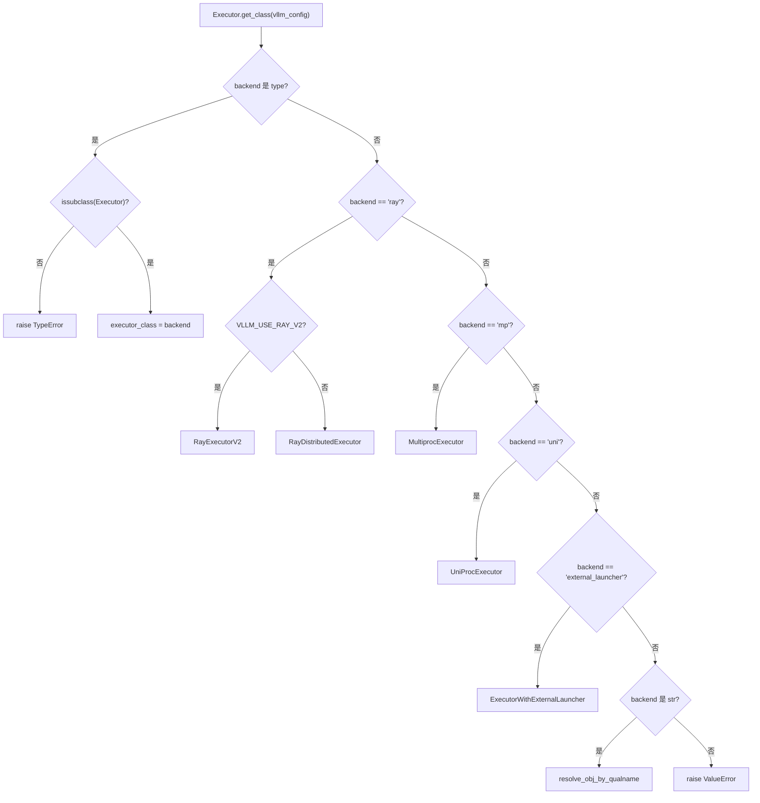
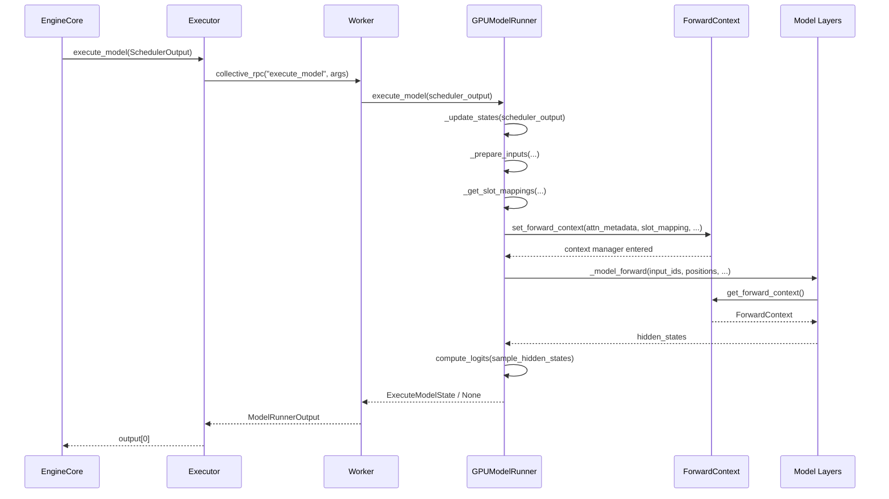

# Chapitre 5 : Colonne vertébrale de l'exécution du modèle : de SchedulerOutput à la propagation avant sur GPU

Dans le chapitre précédent, nous avons vu que le Scheduler, à chaque étape de sa boucle de planification, décide quelles requêtes entrent dans la file running, lesquelles sont préemptées, lesquelles attendent faute de mémoire GPU, et produit finalement un SchedulerOutput — qui décrit ce qu'il faut calculer à cette étape : quelles requêtes, combien de tokens chacune, et quels blocs KV utiliser. Mais cette liste n'est qu'une intention logique ; le GPU, lui, a besoin de tenseurs physiques. Ce chapitre trace comment SchedulerOutput est distribué par l'Executor aux Workers, puis traduit par le GPUModelRunner en entrées exécutables par le GPU telles que input_ids, positions, slot_mapping et block table, et finalement injecté dans chaque couche du modèle via forward_context pour décrire le lot partagé entre les couches, réalisant le passage de la décision de planification à la propagation avant.

# 5.1 Executor : acheminer le résultat de planification vers chaque carte

## Modèle intuitif

`Executor`est le « messager » entre EngineCore et les GPU Workers. Sans lui, EngineCore devrait savoir lui-même combien de cartes il y a dans le cluster, dans quel processus se trouve chaque carte, et comment`SchedulerOutput`Sérialiser le passé — la logique de planification s'entremêle avec la topologie distribuée.`Executor`Extraire cette responsabilité : EngineCore se contente d'appeler`execute_model(scheduler_output)`, le reste — « à qui envoyer, comment envoyer, combien de résultats recevoir » — est décidé par l'Executor.

## Hiérarchie de classes et champs

`Executor`est une classe de base abstraite dont les champs au niveau de la classe encodent directement les capacités du backend[FACT:vllm/v1/executor/abstract.py:48-49]：

```python
uses_ray: bool = False  # whether the executor uses Ray for orchestration.
supports_pp: bool = False  # whether the executor supports PP
```

Ces deux indicateurs ne sont pas décoratifs — le code de niveau supérieur les lit pour décider d'activer ou non certains chemins d'optimisation.`__init__`initialise dans`sleeping_tags`、`kv_output_aggregator`、`ec_output_aggregator`trois champs d'état[FACT:vllm/v1/executor/abstract.py:119-120], respectivement utilisés pour le suivi des étiquettes de mode veille, l'agrégation de sortie du connecteur KV, et l'agrégation de sortie du connecteur d'encodeur.

## Sélection du backend :`get_class`routage par branche de

`get_class`est une fabrique statique qui, selon la configuration`distributed_executor_backend`, retourne la classe Executor concrète[FACT:vllm/v1/executor/abstract.py:51-96]. Sa structure de branchement mérite un examen attentif :

- Si la configuration elle-même est un`type`, vérifier s'il s'agit d'une sous-classe de`Executor`puis l'utiliser directement[FACT:vllm/v1/executor/abstract.py:52-61]；
- `"ray"`La branche comporte également des sous-branches :`VLLM_USE_RAY_V2_EXECUTOR_BACKEND`si vrai, utiliser`RayExecutorV2`, sinon utiliser`RayDistributedExecutor` [FACT:vllm/v1/executor/abstract.py:64-72]；
- `"mp"`correspond à`MultiprocExecutor`，`"uni"`correspond à`UniProcExecutor` [FACT:vllm/v1/executor/abstract.py:73-80]；
- Un backend personnalisé sous forme de chaîne est résolu dynamiquement via`resolve_obj_by_qualname`résolution dynamique[FACT:vllm/v1/executor/abstract.py:85-90]。



## Step-by-Step : un flux d'appel de`execute_model`appel de

Mise en situation : EngineCore termine une étape de planification, obtient`SchedulerOutput`, appelle`executor.execute_model(scheduler_output)`。

`Executor.execute_model`L'implémentation de est minimaliste[FACT:vllm/v1/executor/abstract.py:237-238]：

```python
def execute_model(
    self, scheduler_output: SchedulerOutput, non_block: bool = False
) -> ModelRunnerOutput | None | Future[ModelRunnerOutput | None]:
    output = self.collective_rpc(
        "execute_model", args=(scheduler_output,), non_block=non_block
    )
    return output[0]
```

> **[Design Inference & Architectural Trade-offs]**
> Le point clé réside dans`collective_rpc`— il diffuse le nom de la méthode et les paramètres à tous les Workers, collecte la liste des valeurs de retour de chaque Worker, puis`output[0]`ne prend que le premier. Pourquoi ne prendre que le premier ? Parce qu'en parallélisme tensoriel, tous les Workers exécutent la même passe avant logique, et les sorties sont sémantiquement équivalentes ; le résultat d'échantillonnage est déterminé par le dernier stage PP ou le rank 0, prendre`output[0]`évite une agrégation redondante.`collective_rpc`La documentation de recommande explicitement de « ne transmettre que des messages de contrôle, la communication du plan de données étant établie séparément »[FACT:vllm/v1/executor/abstract.py:220-221], c'est précisément la position de`SchedulerOutput`— c'est un message de contrôle, les véritables données de tokens circulent en interne entre les Workers via des tenseurs GPU.

`sample_tokens`suit le même modèle[FACT:vllm/v1/executor/abstract.py:257-258], mais le type de retour n'inclut pas`None`— l'échantillonnage produit nécessairement un résultat. La répartition de ces deux méthodes correspond à la conception « séparation exécution-échantillonnage » de vLLM v1 :`execute_model`peut retourner`None`(indiquant que la passe avant a été soumise mais que l'échantillonnage est différé), auquel cas l'état est temporairement stocké dans`ExecuteModelState`.

## Réflexions de conception

`collective_rpc`est déclaré comme`@abstractmethod` [FACT:vllm/v1/executor/abstract.py:186-192], ce qui signifie que chaque backend doit implémenter lui-même « comment envoyer le RPC aux Workers ».`MultiprocExecutor`utilise des files de mémoire partagée,`RayDistributedExecutor`utilise des appels d'acteurs Ray,`UniProcExecutor`effectue des appels locaux directs. Cette abstraction permet au code de niveau supérieur de ne pas se soucier des détails distribués.

Un détail facile à négliger :`supported_tasks`est marqué comme`@cached_property` [FACT:vllm/v1/executor/abstract.py:306-309], le commentaire déclare explicitement « éviter les appels RPC inutiles ». Parce que`get_supported_tasks`nécessite une communication inter-processus, et que la liste des tâches reste inchangée pendant le cycle de vie du modèle, la mise en cache est une optimisation correcte et nécessaire.

# 5.2 GPUModelRunner : de SchedulerOutput aux tenseurs d'entrée

## Modèle intuitif

`GPUModelRunner`est un « traducteur » : il traduit la description logique de`SchedulerOutput`(ID de requête, nombre de tokens, ID de bloc) en tenseurs physiques directement consommables par le GPU. Sans lui, la couche modèle devrait gérer elle-même des questions comme « dans quel emplacement KV se trouve le 7e token de la 3e requête » — une fuite de préoccupations catastrophique.

## État central et disposition mémoire

`GPUModelRunner`hérite de trois Mixins[FACT:vllm/v1/worker/gpu_model_runner.py:479-480]：`LoRAModelRunnerMixin`、`KVConnectorModelRunnerMixin`、`ECConnectorModelRunnerMixin`, fournissant respectivement les capacités d'adaptation LoRA, de connecteur KV et de connecteur d'encodeur.

`__init__`met en cache tous les objets de configuration[FACT:vllm/v1/worker/gpu_model_runner.py:488-498], et initialise plusieurs indicateurs clés :

- `check_ep_fault`: uniquement lorsque le parallélisme de données > 1 et qu'il s'agit d'un modèle MoE, vérifier si le gestionnaire EP all2all supporte la tolérance aux pannes[FACT:vllm/v1/worker/gpu_model_runner.py:507-509]；
- `is_pooling_model`: déterminé par`runner_type == "pooling"`détermine[FACT:vllm/v1/worker/gpu_model_runner.py:515]；
- `enable_prompt_embeds`: activer ou non l'entrée prompt embedding[FACT:vllm/v1/worker/gpu_model_runner.py:516]。

`ExecuteModelState`est un`NamedTuple`, portant l'état temporaire entre`execute_model()`et`sample_tokens()`état temporaire entre[FACT:vllm/v1/worker/gpu_model_runner.py:463-476]. La conception de ses champs révèle l'essence de la séparation exécution-échantillonnage :`logits`、`hidden_states`、`sample_hidden_states`est le produit de la passe avant,`spec_decode_metadata`、`slot_mappings`est la métadonnée encore nécessaire à la phase d'échantillonnage. Le commentaire indique explicitement qu'il s'agit d'un « état de cache temporaire transmis après que execute_model() retourne None »[FACT:vllm/v1/worker/gpu_model_runner.py:464-464]。

## Step-by-Step：`_update_states`Comment synchroniser l'état du cache

Mise en situation : le planificateur décide de traiter à cette étape la requête A (nouvelle requête), B (continuation du decode de l'étape précédente), C (restaurée après préemption), tandis que la requête D est terminée.

**Première étape : nettoyer les requêtes terminées.**parcourt`finished_req_ids`, retire l'état du dictionnaire`self.requests`, retire de`input_batch`. Noter le cas limite signalé par le commentaire :[FACT:vllm/v1/worker/gpu_model_runner.py:1202-1217]et`finished_req_ids`peuvent se chevaucher — lorsqu'une requête est abandonnée puis resoumise avec le même ID, elles sont considérées comme deux requêtes distinctes`scheduled_req_ids`peuvent se chevaucher[FACT:vllm/v1/worker/gpu_model_runner.py:1211-1215]。

**Deuxième étape : remettre à zéro les blocs KV nouvellement alloués.**Si`new_block_ids_to_zero`n'est pas vide, appeler`_zero_block_ids`pour remettre à zéro la mémoire GPU, empêchant des NaN obsolètes de polluer l'attention ou les calculs SSM[FACT:vllm/v1/worker/gpu_model_runner.py:1219-1222]. C'est le prérequis de sécurité pour la réutilisation des blocs PagedAttention.

**Troisième étape : calculer l'ensemble des requêtes non planifiées.**C'est l'étape la plus sujette aux erreurs[FACT:vllm/v1/worker/gpu_model_runner.py:1238-1247]：

```python
scheduled_req_ids = scheduler_output.num_scheduled_tokens.keys()
cached_req_ids = self.input_batch.req_id_to_index.keys()
resumed_req_ids = scheduler_output.scheduled_cached_reqs.resumed_req_ids
unscheduled_req_ids = cached_req_ids - (scheduled_req_ids - resumed_req_ids)
```

Le commentaire explique pourquoi c'est`scheduled_req_ids - resumed_req_ids`plutôt que directement`scheduled_req_ids`: habituellement`cached_req_ids`et`resumed_req_ids`sont disjoints, mais dans le scénario de préemption forcée déclenché par`reset_prefix_cache`, les requêtes restaurées doivent d'abord être retirées du lot persistant avant d'être réintégrées[FACT:vllm/v1/worker/gpu_model_runner.py:1241-1246]。

**Quatrième étape : traiter les nouvelles requêtes.**Pour chaque`scheduled_new_reqs`, construire`CachedRequestState` [FACT:vllm/v1/worker/gpu_model_runner.py:1295-1308]. Si le type d'échantillonnage est`RANDOM_SEED`, créer un`torch.Generator` [FACT:vllm/v1/worker/gpu_model_runner.py:1277-1284]avec graine. Si le modèle utilise M-RoPE, appeler`_init_mrope_positions`pour précalculer les positions[FACT:vllm/v1/worker/gpu_model_runner.py:1319-1321]。

**Cinquième étape : mettre à jour les requêtes en cours.**Pour chaque`scheduled_cached_reqs`, mettre à jour`num_computed_tokens` [FACT:vllm/v1/worker/gpu_model_runner.py:1402], gérer l'ajout ou le remplacement d'ID de bloc[FACT:vllm/v1/worker/gpu_model_runner.py:1437-1448]. Si la requête n'est pas dans le lot persistant (`req_index is None`), ajouter à`reqs_to_add` [FACT:vllm/v1/worker/gpu_model_runner.py:1450-1465]。

**Sixième étape : compression et réorganisation.** `condense()`Combler les trous laissés par les requêtes de suppression[FACT:vllm/v1/worker/gpu_model_runner.py:1511-1512]，`_may_reorder_batch`Permettre au backend d'attention de réorganiser à la demande[FACT:vllm/v1/worker/gpu_model_runner.py:1513-1514]，`refresh_metadata()`Rafraîchir les métadonnées de lot[FACT:vllm/v1/worker/gpu_model_runner.py:1515-1516]。

## Préparation des tenseurs d'entrée :`_prepare_input_ids`le chemin rapide asynchrone de

`_prepare_input_ids`traite un problème subtil : en ordonnancement asynchrone, le token échantillonné de l'étape précédente est encore sur le GPU, et celui de l'étape courante`input_ids`doit les y insérer[FACT:vllm/v1/worker/gpu_model_runner.py:1767-1772]。

Le chemin normal (`prev_sampled_token_ids is None`) copie directement les tenseurs CPU vers le GPU[FACT:vllm/v1/worker/gpu_model_runner.py:1788-1794]. Le chemin asynchrone parcourt les requêtes, calcule l'index du dernier token de chaque requête dans le`input_ids`aplati[FACT:vllm/v1/worker/gpu_model_runner.py:1809-1836]. Les commentaires donnent un exemple concret :`cu_num_tokens = [2, 5, 8]`、`draft_tokens = [1, 2, 2]`lorsque`sample_flattened_indices = [0, 2, 5]`，`spec_flattened_indices = [1, 3, 4, 6, 7]` [FACT:vllm/v1/worker/gpu_model_runner.py:1820-1822]。

il existe une optimisation clé[FACT:vllm/v1/worker/gpu_model_runner.py:1859-1868]：

```python
if common_indices_match and max_flattened_index == (num_common_tokens - 1):
    self.input_ids.gpu[:num_common_tokens].copy_(
        self.input_batch.prev_sampled_token_ids[:num_common_tokens, 0],
        non_blocking=True,
    )
    return
```

Lorsque le lot est inchangé et sans réorganisation, les indices sont`0..N-1`la même permutation, on peut directement utiliser une copie par tranche unique, évitant le coût du scatter. C'est l'expression directe de l'optimisation des lots persistants.

## `slot_mapping`et la block table

`_get_slot_mappings`renvoie deux formats[FACT:vllm/v1/worker/gpu_model_runner.py:4078-4078]: indexé par KV cache group,`dict[int, torch.Tensor]`utilisé pour les métadonnées d'attention, indexé par nom de couche,`dict[str, torch.Tensor]`utilisé pour`ForwardContext`. Pour un KV cache group encoder-only, le slot mapping est un tenseur entièrement nul[FACT:vllm/v1/worker/gpu_model_runner.py:4096-4115]; sinon on découpe depuis`block_table.slot_mapping.gpu`tranche[FACT:vllm/v1/worker/gpu_model_runner.py:4107-4109]. Le remplissage de queue inutilisé`-1`, le commentaire explique que c'est`reshape_and_cache`nécessaire en mode CUDA graph complet[FACT:vllm/v1/worker/gpu_model_runner.py:4118-4122]。

`_get_block_table`pour chaque KV cache group, obtenir le tenseur de l'appareil[FACT:vllm/v1/worker/gpu_model_runner.py:2319-2335], et utiliser`NULL_BLOCK_ID`pour remplir les lignes de padding CUDAGraph — le bloc 0 est réservé au padding[FACT:vllm/v1/worker/gpu_model_runner.py:2332-2334]。

# 5.3 forward_context : description de lot partagée entre les couches

## Modèle intuitif

`forward_context`est le « tableau d'affichage unifié » collé à l'avant de la salle de classe : chaque couche du modèle lève les yeux et voit l'arrangement des places (attention metadata) et les règles (slot mapping) de l'examen en cours, sans avoir à les demander individuellement. Sans lui, chaque couche d'attention devrait recevoir ces informations via les paramètres — or la`forward`signature de la couche du modèle est fixe, impossible de passer des paramètres individuellement pour chaque couche.

## Structure de données

`ForwardContext`est un`@dataclass` [FACT:vllm/forward_context.py:141-202], champs principaux :

- `no_compile_layers`: depuis`static_forward_context`copie, marque les couches ne participant pas à la compilation[FACT:vllm/forward_context.py:132-137]；
- `attn_metadata`: mapping du nom de couche vers les métadonnées d'attention, en mode DBO c'est une liste de longueur 2 (une par microbatch)[FACT:vllm/forward_context.py:144-152]；
- `slot_mapping`: mapping du nom de couche vers le tenseur slot mapping[FACT:vllm/forward_context.py:145]；
- `cudagraph_runtime_mode`: mode CUDA graph à l'exécution, par défaut`NONE` [FACT:vllm/forward_context.py:155-157]；
- `batch_descriptor`: descripteur de lot, utilisé pour la distribution CUDA graph[FACT:vllm/forward_context.py:158]；
- `is_padding`: masque booléen sur l'axe des tokens,`True`indique les lignes de padding[FACT:vllm/forward_context.py:162-165]。

`BatchDescriptor`est un autre`@dataclass(frozen=True)` [FACT:vllm/forward_context.py:30-57], la conception des champs suit le principe de « minimisation des éléments de description » :`num_tokens`、`num_reqs`(peut être None en mode PIECEWISE),`uniform`(toutes les requêtes ont le même nombre de tokens),`has_lora`、`num_active_loras`. Le commentaire explique`num_active_loras`la raison d'être de : lorsque`cudagraph_specialize_lora_count`est activé, chaque valeur de nombre LoRA capture un CUDA graph indépendant, car`fused_moe_lora`la taille de grille des kernels comme dépend de cette valeur[FACT:vllm/forward_context.py:60-64]。

## Singleton global et gestion de contexte

`_forward_context`est une variable globale au niveau du module[FACT:vllm/forward_context.py:199-201], via`override_forward_context`le gestionnaire de contexte sauvegarde l'ancienne valeur à l'entrée et la restaure à la sortie[FACT:vllm/forward_context.py:263-274]。`set_forward_context`est une encapsulation de plus haut niveau[FACT:vllm/forward_context.py:277-394], qui gère en plus la construction des métadonnées DP, la création automatique du batch descriptor, l'injection de kwargs spécifiques à la plateforme.

## Step-by-Step : depuis`execute_model`jusqu'au forward du modèle

Mise en situation :`GPUModelRunner.execute_model`a préparé tous les tenseurs d'entrée, sur le point d'appeler le modèle.

Dans`execute_model`,`set_forward_context`est appelé[FACT:vllm/v1/worker/gpu_model_runner.py:4408-4420]：

```python
with (
    set_forward_context(
        attn_metadata,
        self.vllm_config,
        num_tokens=num_tokens_padded,
        num_tokens_across_dp=num_tokens_across_dp,
        cudagraph_runtime_mode=cudagraph_mode,
        batch_descriptor=batch_desc,
        ubatch_slices=ubatch_slices_padded,
        slot_mapping=slot_mappings,
        skip_compiled=has_encoder_input,
        is_padding=is_padding,
    ),
    ...
):
    model_output = self._model_forward(...)
```

`set_forward_context`construit d'abord en interne`DPMetadata`(si DP ou MoE à parallélisme de séquence est activé)[FACT:vllm/forward_context.py:299-328], puis appelle`create_forward_context`pour construire`ForwardContext`l'instance[FACT:vllm/forward_context.py:347-358], et enfin via`override_forward_context`définit la variable globale[FACT:vllm/forward_context.py:361-362]。

La couche du modèle via`get_forward_context()`lit[FACT:vllm/forward_context.py:208-214]. Si non défini, l'assertion échoue et suggère d'utiliser`set_forward_context`。



## Réflexions de conception

> **[Design Inference & Architectural Trade-offs]**
> Pourquoi utiliser une variable globale plutôt qu'un passage de paramètre explicite ? Parce que la`forward`signature de la couche du modèle est fixée par la convention HuggingFace, impossible d'injecter des paramètres supplémentaires par couche. Variable globale + gestionnaire de contexte est la seule solution permettant une injection inter-couches sans modifier le code du modèle. Le coût est une dépendance implicite —`get_forward_context()`l'appelant de doit s'assurer qu'il est dans`set_forward_context`la portée de.

`is_padding`La conception du champ mérite attention[FACT:vllm/forward_context.py:162-165]: le commentaire dit « le consommateur peut l'utiliser pour sauter le travail sur les padding tokens ». C'est une optimisation dans le contexte CUDA graph — les lignes de padding participent à la capture du graphe mais ne doivent pas produire de calcul réel.

`all_moe_layers`et`moe_layer_index`sont une paire d'astucieux workarounds[FACT:vllm/forward_context.py:170-195]. Le commentaire explique en détail le problème :`vllm.moe_forward`les opérateurs personnalisés codent en dur la chaîne du nom de couche dans le graphe, ce qui rend le temps de démarrage à froid de torch.compile trop long. La solution est de stocker la liste des noms de couches dans`ForwardContext`, les opérateurs personnalisés dépilent les chaînes dans l'ordre et incrémentent un compteur. Le commentaire admet aussi que cela repose sur l'hypothèse que « les opérateurs personnalisés s'exécutent dans l'ordre et que torch.compile ne réordonne pas »[FACT:vllm/forward_context.py:182-184]。

# Réflexions de conception et pièges en production

**Cohérence d'état en ordonnancement asynchrone.** `_update_states`adopte une stratégie d'« hypothèse optimiste » en décodage spéculatif asynchrone : suppose que tous les draft tokens de l'étape précédente sont acceptés, étend d'abord`output_token_ids`, puis enregistre une fonction de correction différée[FACT:vllm/v1/worker/gpu_model_runner.py:1376-1384]. La fonction de correction est appelée après le lancement du forward du modèle[FACT:vllm/v1/worker/gpu_model_runner.py:1509-1510], lit le nombre réel d'acceptations depuis le GPU et rétrograde`num_computed_tokens` [FACT:vllm/v1/worker/gpu_model_runner.py:1547-1558]. La subtilité de cette conception : la correction a lieu après le « lancement du lot », ne bloque pas le forward, et maintient la continuité du pipeline asynchrone.

**`_may_reorder_batch`La condition de déclenchement de.**Cette méthode vérifie d'abord`kv_cache_groups`si est vide[FACT:vllm/v1/worker/gpu_model_runner.py:1131-1132]. Le commentaire explique pourquoi on ne peut pas simplement vérifier`is_attention_free`: Le modèle Mamba est également sans attention, mais il utilise un KV cache pour conserver son état interne[FACT:vllm/v1/worker/gpu_model_runner.py:1116-1139]. Seuls les modèles qui n'ont véritablement pas de groupe KV cache sautent la réorganisation.

**`_prepare_input_ids`le piège du calcul d'indice.**Lorsqu'un lot contient à la fois des requêtes de décodage de l'étape précédente et de nouvelles requêtes,`num_common_tokens < total_without_spec`, il faut d'abord copier le tenseur CPU puis effectuer le scatter[FACT:vllm/v1/worker/gpu_model_runner.py:1849-1854]. Si`num_common_tokens == 0`, cela signifie qu'aucune requête ne chevauche l'étape précédente, et on retourne directement[FACT:vllm/v1/worker/gpu_model_runner.py:1855-1858]. La distinction entre ces deux branches est cruciale — en omettre une seule entraîne`input_ids`partiellement non initialisé.

**`AsyncGPUModelRunnerOutput`la synchronisation des flux.**La copie de sortie s'effectue sur un flux CUDA indépendant[FACT:vllm/v1/worker/gpu_model_runner.py:308-328], en utilisant`blocking=True`l'Event pour éviter le verrouillage du pilote CUDA par attente active[FACT:vllm/v1/worker/gpu_model_runner.py:296-298]。`get_output()`synchroniser d'abord puis libérer la référence du tenseur de périphérique[FACT:vllm/v1/worker/gpu_model_runner.py:336-340], l'ordre ne doit pas être inversé — sinon le tenseur pourrait être récupéré avant la fin de la copie.

# Résumé de ce chapitre

Ce chapitre a retracé`SchedulerOutput`le chemin complet depuis EngineCore jusqu'au forward GPU.`Executor`Via`collective_rpc`la diffusion des résultats de planification à tous les Workers,`GPUModelRunner`le`_update_states`synchronise l'état du cache,`_prepare_inputs`construit les tenseurs d'entrée,`_get_slot_mappings`génère la correspondance des slots KV, et enfin`set_forward_context`injecte la description du lot dans le contexte global pour consommation par les différentes couches du modèle. Le chemin de planification asynchrone maintient la continuité du pipeline via une hypothèse optimiste + correction différée, tandis que`ForwardContext`la conception de singleton global résout la contradiction entre la signature fixe des couches du modèle et l'injection de métadonnées inter-couches.

# Réflexions et auto-évaluation de ce chapitre

Q1: `_update_states`Dans`unscheduled_req_ids = cached_req_ids - (scheduled_req_ids - resumed_req_ids)`cette expression, si l'on retire`resumed_req_ids`de la soustraction pour obtenir`cached_req_ids - scheduled_req_ids`, dans quel scénario cela entraînerait-il une incohérence d'état ?

**Analyse de référence**: Le commentaire indique explicitement que[FACT:vllm/v1/worker/gpu_model_runner.py:1241-1246]，`cached_req_ids`et`resumed_req_ids`ne se recoupent généralement pas, mais dans le scénario de préemption forcée déclenché par`reset_prefix_cache`, une requête peut apparaître simultanément dans`cached_req_ids`et`resumed_req_ids`. Dans ce cas,`scheduled_req_ids - resumed_req_ids`exclut cette requête de l'ensemble « planifié », la faisant tomber dans`unscheduled_req_ids`, ce qui la retire d'abord du lot persistant, puis la réintègre via le chemin resumed normal. Si l'on retire`resumed_req_ids`, la requête serait considérée comme « planifiée » et conservée dans le lot, mais son ID de bloc a déjà été remplacé (`req_state.block_ids = new_block_ids` [FACT:vllm/v1/worker/gpu_model_runner.py:1448]), entraînant une inadéquation entre l'ancienne ligne de la block table et le nouvel ID de bloc, et le calcul d'attention lirait des positions KV erronées.

Q2: `_prepare_input_ids`Le chemin rapide de[FACT:vllm/v1/worker/gpu_model_runner.py:1859-1868]utilise`common_indices_match and max_flattened_index == (num_common_tokens - 1)`comme condition. Si l'ordre des requêtes dans le lot change (par exemple, le backend d'attention réorganise le lot), mais que`common_indices_match`reste True, que se passe-t-il ?

**Analyse de référence**：`common_indices_match`Dans la boucle, via`prev_index == flattened_index`on accumule[FACT:vllm/v1/worker/gpu_model_runner.py:1835]。`prev_index`provenant de`prev_positions`, mappant la position du lot actuel à la position du lot précédent ;`flattened_index`est l'indice aplati du dernier token de cette requête dans le lot actuel. Si le lot est réorganisé,`prev_index`et`flattened_index`la correspondance change,`common_indices_match`deviendra False, et le chemin rapide ne se déclenchera pas. Mais si la réorganisation fait恰好 que`prev_index == flattened_index`soit vrai pour toutes les requêtes (par exemple, en échangeant deux requêtes avec le même nombre de tokens), le chemin rapide copierait erronément par tranche directe via`prev_sampled_token_ids[:num_common_tokens, 0]`— cela remplirait la position de la requête B avec le token échantillonné de la requête A.`max_flattened_index == num_common_tokens - 1`Cette condition supplémentaire vise précisément à prévenir ce cas dégénéré : elle exige que les indices aplatis soient exactement une permutation de`0..N-1`, excluant toute réorganisation non triviale.

Q3: `ForwardContext`Utilise une variable globale au niveau du module`_forward_context`plutôt qu'une variable locale au thread. Dans la planification asynchrone où`execute_model`et`sample_tokens`sont séparés, si`sample_tokens`est appelé avant la fin du forward, que retourne`get_forward_context()`? Quel problème cela entraînerait-il ?

**Analyse de référence**：`set_forward_context`est un gestionnaire de contexte[FACT:vllm/forward_context.py:278-288], qui à la sortie du bloc`with`restaure l'ancienne valeur via`override_forward_context`de`finally`. Dans[FACT:vllm/forward_context.py:263-274], le bloc`execute_model`de`set_forward_context`n'enveloppe que l'appel`with`à`_model_forward`, et le contexte est restauré dès le retour du forward. Si[FACT:vllm/v1/worker/gpu_model_runner.py:4408-4433]est appelé après la fin du forward,`sample_tokens`échouera à l'assertion`get_forward_context()`, car[FACT:vllm/forward_context.py:208-214]a été réinitialisé à`_forward_context`(ou à la valeur externe). C'est précisément la raison d'être de`None`: l'état nécessaire à l'échantillonnage (`ExecuteModelState`) est explicitement conservé dans un NamedTuple, plutôt que de dépendre du passage implicite de[FACT:vllm/v1/worker/gpu_model_runner.py:463-476]. Si l'on suppose à tort que`logits`、`hidden_states`、`slot_mappings`est encore disponible dans`ForwardContext`, cela déclenchera une erreur d'assertion ou lira des métadonnées erronées.`ForwardContext`Nous avons ainsi parcouru le chemin complet de SchedulerOutput à la propagation forward GPU : distribution par l'Executor, exécution par le Worker, traduction par GPUModelRunner de la liste logique en tenseurs physiques, et injection de la description du lot dans chaque couche via forward_context. Cependant, la partie la plus coûteuse du forward du modèle — le calcul d'attention — n'a pas encore été détaillée. Le chapitre suivant plongera dans les backends d'attention, pour voir comment la block table et le slot mapping dans attn_metadata sont consommés par le noyau PagedAttention, et comment différents backends tels que FlashAttention, FlashInfer, Triton sont sélectionnés et planifiés via une interface unifiée.`sample_tokens`← Chapitre précédent : Chapitre 4

Retour en haut ↑
