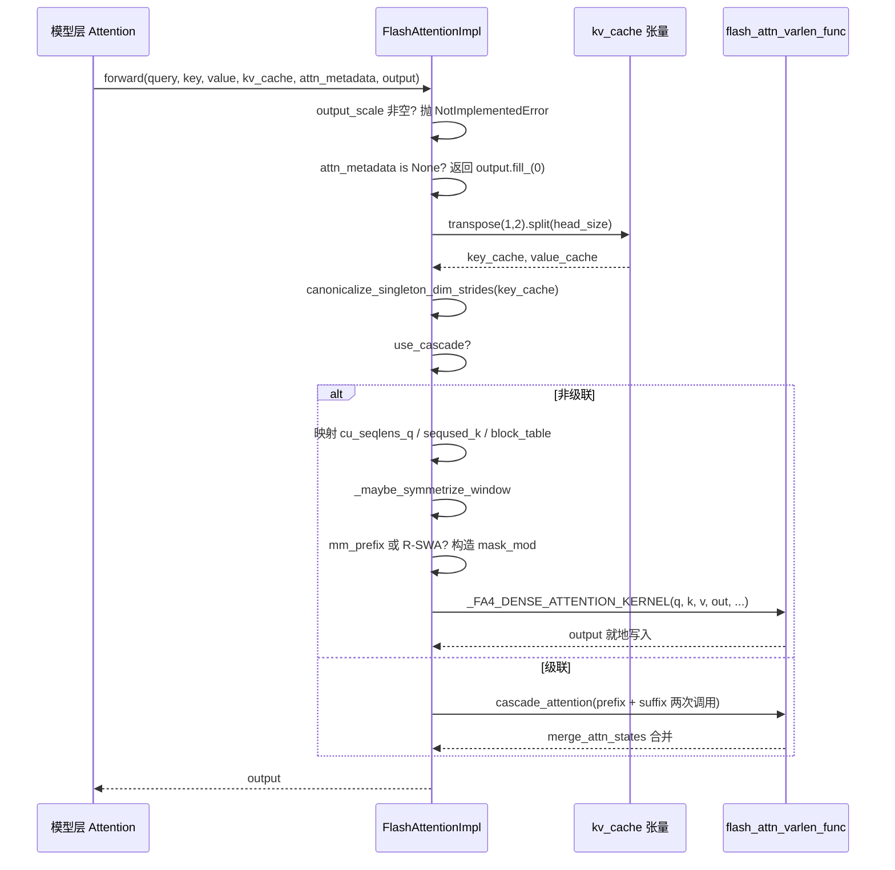

# Progression de l'ouvrage : Chapitre 6 / 14

Dans le chapitre précédent, nous avons vu comment GPUModelRunner traduit les résultats de planification en tenseurs physiques tels que input_ids, slot_mapping et block_table, et les injecte dans chaque couche via forward_context. Mais le véritable gros consommateur de temps GPU — le calcul d'attention — reste en suspens. Qui consomme réellement les tenseurs dans attn_metadata ? Pourquoi FlashAttention, FlashInfer et Triton peuvent-ils être interchangeables sous le même code de modèle ? La réponse réside dans la couche d'abstraction AttentionBackend. Elle découple « comment calculer l'attention » de « comment le modèle l'appelle » : la couche modèle ne détient qu'une référence AttentionImpl et appelle l'interface unifiée forward(query, key, value, kv_cache, attn_metadata, output) ; tandis que le backend concret se charge de traduire block_table, slot_mapping, seq_lens en paramètres que son propre noyau peut consommer. Ce chapitre suit FlashAttentionBackend comme fil conducteur, car il couvre simultanément la sémantique de gather de PagedAttention, la compatibilité CUDA Graph, l'attention en cascade, le contexte distribué DCP et les branches les plus riches. Une fois maîtrisé, les autres backends ne sont que des variantes de mappage de paramètres. La motivation de cette conception « enregistrement de backend + interface unifiée » est directe : les noyaux d'attention évoluent extrêmement vite (FA2→FA3→FA4, itérations de FlashInfer, Triton maison), et si la couche modèle dépendait directement d'un noyau concret, chaque mise à niveau du noyau nécessiterait de modifier le code du modèle. La couche d'abstraction isole le changement derrière une seule méthode de fabrique get_impl_cls().

# Sélection du backend : déclaration de capacités et construction des métadonnées

## Modèle intuitif

Considérez`AttentionBackend`comme une offre d'emploi : elle ne travaille pas, elle déclare seulement « quels dtype, quels head_size, quels formats de quantification KV cache, quels types d'attention je peux traiter ». Le planificateur utilise la configuration du modèle pour faire correspondre, et en cas d'échec, passe au candidat suivant. Sans cette couche de déclaration, le système ne découvrirait qu'à l'exécution que « ce noyau ne supporte pas ce head_size », et planterait directement.

## Matrice de capacités : les champs comme contrat

`FlashAttentionBackend`Les attributs de classe de sont ses limites de capacités.`supported_dtypes`restreint à fp16/bf16[FACT:vllm/v1/attention/backends/flash_attn.py:287-287]；`supported_kv_cache_dtypes`autorise en plus la série fp8[FACT:vllm/v1/attention/backends/flash_attn.py:298-299]. Mais « déclarer le support » ne signifie pas « support inconditionnel » —`supports_kv_cache_dtype`pour le KV quantifié, délègue davantage à`flash_attn_supports_kv_cache_dtype`pour effectuer un jugement lié au dispositif[FACT:vllm/v1/attention/backends/flash_attn.py:431-438]。

Plus fin encore est`supports_combination`: il reçoit un ensemble complet de paramètres combinés tels que head_size, dtype, block_size, use_mla, has_sink, et retourne`None`pour indiquer la disponibilité, ou une chaîne pour indiquer la raison du rejet[FACT:vllm/v1/attention/backends/flash_attn.py:454-507]. Par exemple, sink est rejeté sur une puissance de calcul < 9.0[FACT:vllm/v1/attention/backends/flash_attn.py:467-468], et sur SM90, FP8 KV avec mm_prefix doit passer par Triton[FACT:vllm/v1/attention/backends/flash_attn.py:472-472]. Cette conception de « retourner une chaîne de raison » permet à la couche supérieure de fournir des erreurs diagnostiquables plutôt qu'un repli silencieux.

Le choix de block_size est également piloté par les capacités. Par défaut, retourne`MultipleOf(16)`, mais SM90 FP8-KV force 64[FACT:vllm/v1/attention/backends/flash_attn.py:297-324], et le noyau FA4 avec head_size=256 force`FA4_HD256_PAGE_SIZE` [FACT:vllm/v1/attention/backends/flash_attn.py:326-352]. Cela explique pourquoi la taille de bloc du KV cache n'est pas arbitraire — elle est contrainte en retour par la taille de tuile TMA du noyau.

## Structure des métadonnées : disposition des champs de FlashAttentionMetadata

`FlashAttentionMetadata`est une dataclass, les champs se répartissent en quatre groupes[FACT:vllm/v1/attention/backends/flash_attn.py:511-566]：

Le premier groupe est la description de base du lot :`num_actual_tokens`(nombre réel de tokens sans padding),`max_query_len`、`query_start_loc`(somme préfixe, utilisée par les noyaux varlen pour localiser le début et la fin de chaque séquence),`seq_lens`、`block_table`、`slot_mapping` [FACT:vllm/v1/attention/backends/flash_attn.py:520-526]. Notez le schéma ASCII dans les commentaires du code source[FACT:vllm/v1/attention/backends/flash_attn.py:512-518], il distingue précisément`context_len`(KV historiques),`query_len`(nouveaux ajouts),`seq_len`(somme des deux) — c'est la clé pour comprendre les paramètres des noyaux varlen.

Le deuxième groupe est les champs d'attention en cascade :`use_cascade`、`common_prefix_len`、`cu_prefix_query_lens`etc.[FACT:vllm/v1/attention/backends/flash_attn.py:528-533]。

Le troisième groupe est les champs DCP (Decode Context Parallel) :`max_dcp_context_kv_len`、`dcp_context_kv_lens`, ainsi que les compteurs distinguant le nombre de requêtes decode/prefill[FACT:vllm/v1/attention/backends/flash_attn.py:535-544]。

Le quatrième groupe est la planification optionnelle et les masques spéciaux :`scheduler_metadata`(utilisé pour la planification FA3 AOT),`causal`(peut être bool ou tenseur, supporte le causal par séquence),`mm_prefix_query_range_tensor`(plages bidirectionnelles multimodales), champs liés à R-SWA[FACT:vllm/v1/attention/backends/flash_attn.py:546-566]。

> **[Design Inference & Architectural Trade-offs]**
> `causal`Le type du champ est`bool | torch.Tensor`plutôt qu'un simple bool, afin de supporter le scénario « dans le même lot, certaines séquences causales, d'autres non causales » (comme PrefixLM). Lorsqu'il est un tenseur, le paramètre`dynamic_causal`de FA4 prend le relais, FA2/FA3 lèvera directement NotImplementedError[FACT:vllm/v1/attention/backends/flash_attn.py:1429-1433]。

## build() étape par étape

Mise en situation : un lot mixte, 3 séquences decode + 2 séquences prefill, sans cascade, sans DCP.

Première étape, à partir de`common_attn_metadata`déballer les tenseurs de base[FACT:vllm/v1/attention/backends/flash_attn.py:824-832]. Deuxième étape, décider s'il faut activer l'ordonnancement AOT :`aot_schedule = self.aot_schedule and not fast_build and not envs.VLLM_BATCH_INVARIANT` [FACT:vllm/v1/attention/backends/flash_attn.py:836-838]。`self.aot_schedule`dans`__init__`est déterminé par`get_flash_attn_version() == 3`— seul FA3 prend en charge les métadonnées d'ordonnancement précalculées. Troisième étape, remplir paresseusement lors du premier build[FACT:vllm/v1/attention/backends/flash_attn.py:709-709]: parcourir toutes les`aot_sliding_window`couches pour collecter la configuration de fenêtre glissante ; si la configuration est unique, l'adopter ; si plusieurs, désactiver AOT`FlashAttentionImpl`Quatrième étape, calculer[FACT:vllm/v1/attention/backends/flash_attn.py:848-851]。

. Par défaut 0 (laisser FA3 utiliser l'heuristique), défini à`max_num_splits`uniquement lorsque full CUDA graph est activé et que le nombre de tokens est dans la plage de capture`self.max_num_splits` [FACT:vllm/v1/attention/backends/flash_attn.py:856-866]. Le commentaire explique la raison :`num_splits > 1`alloue`[num_splits, num_heads, num_tokens, head_size]`un buffer intermédiaire, coût mémoire élevé, ne vaut le coup que dans le scénario CUDA graph[FACT:vllm/v1/attention/backends/flash_attn.py:862-865]。

Cinquième étape, emprunter la branche non-cascadée non-DCP, appeler`_get_scheduler_metadata`pour générer les métadonnées d'ordonnancement de FA3[FACT:vllm/v1/attention/backends/flash_attn.py:976-986]. Sixième étape,`_store_scheduler_metadata`gère le scénario CUDA graph : copier les nouvelles métadonnées dans le buffer préalloué, et mettre à zéro la partie restante[FACT:vllm/v1/attention/backends/flash_attn.py:671-684]. Cette mise à zéro est cruciale — le commentaire indique explicitement que sinon certains thread blocks liraient des métadonnées invalides et écraseraient le buffer de sortie[FACT:vllm/v1/attention/backends/flash_attn.py:671-672]。

Septième étape, construire`FlashAttentionMetadata`et retourner[FACT:vllm/v1/attention/backends/flash_attn.py:992-1015]。

```mermaid
flowchart TD
    start["build(common_prefix_len, common_attn_metadata)"] --> unpack["解包 query_start_loc / seq_lens / block_table / slot_mapping"]
    unpack --> aot{"aot_schedule 且非 fast_build 且非 BATCH_INVARIANT?"}
    aot -->|是| sw_check{"aot_sliding_window 已初始化?"}
    aot -->|否| maxsplit
    sw_check -->|否, 首次| collect["_get_sliding_window_configs 收集层滑窗"]
    collect --> sw_unique{"配置数量 == 1?"}
    sw_unique -->|是| set_sw["设置 aot_sliding_window"]
    sw_unique -->|否, >1| disable_aot["self.aot_schedule = False"]
    set_sw --> maxsplit
    disable_aot --> maxsplit
    sw_check -->|是| maxsplit["计算 max_num_splits"]
    maxsplit --> cg_check{"use_full_cuda_graph 且 tokens |是| set_splits["max_num_splits = self.max_num_splits"]
    cg_check -->|否| zero_splits["max_num_splits = 0"]
    set_splits --> branch
    zero_splits --> branch
    branch{"dcp_world_size > 1?"}
    branch -->|是| dcp_path["计算 dcp_context_kv_lens, 可能 skip"]
    branch -->|否| cascade_check{"common_prefix_len > 0?"}
    cascade_check -->|是| cascade_path["构造 prefix/suffix 双份 scheduler_metadata"]
    cascade_check -->|否| normal_path["_get_scheduler_metadata 单份"]
    dcp_path --> store
    cascade_path --> store
    normal_path --> store
    store["_store_scheduler_metadata: CUDA graph 时拷入预分配缓冲并清零尾部"] --> build_meta["构造 FlashAttentionMetadata"]
    build_meta --> mm_check{"mm_req_doc_ranges 非空?"}
    mm_check -->|是| fill_mm["fill_mm_prefix_query_ranges + 拷贝到 GPU"]
    mm_check -->|否| rswa_check
    fill_mm --> rswa_check{"rswa_window 非空?"}
    rswa_check -->|是| copy_rswa["拷贝 prefix_lens 到持久缓冲"]
    rswa_check -->|否| done
    copy_rswa --> done["返回 attn_metadata"]
```

---

# forward() : la chaîne complète des métadonnées à l'appel du kernel

## Modèle intuitif

`forward()`est l'« atelier d'assemblage final » du backend : il reçoit les Q/K/V calculés par les couches du modèle, les tenseurs KV cache, et les métadonnées construites à l'étape précédente, ajuste la disposition physique du KV cache à la forme attendue par le kernel, puis dispatche vers le kernel spécifique. Sans cette étape, le kernel lirait une disposition mémoire erronée, produisant des erreurs silencieuses — plus difficiles à diagnostiquer qu'un crash.

## Transformation de la disposition mémoire du KV cache

La forme physique du KV cache de vLLM est`[num_blocks, num_kv_heads, block_size, 2 * head_size]`— K et V concaténés sur la dernière dimension[FACT:vllm/v1/attention/backends/flash_attn.py:1246-1247]. Mais les kernels FlashAttention attendent K et V séparés, avec la disposition`[num_blocks, block_size, num_kv_heads, head_size]`。

La transformation a lieu au début de`forward()`:`kv_cache.transpose(1, 2).split(self.head_size, dim=-1)` [FACT:vllm/v1/attention/backends/flash_attn.py:1310-1310]。`transpose(1,2)`transforme`[blocks, heads, block_size, 2D]`en`[blocks, block_size, heads, 2D]`，`split`en découpant K et V le long de la dernière dimension. Noter que`transpose`ne modifie que les strides sans déplacer les données, donc les kernels suivants doivent prendre en charge l'accès non contigu.

Vient ensuite`canonicalize_singleton_dim_strides` [FACT:vllm/v1/attention/backends/flash_attn.py:1310-1310]. Le commentaire précise la motivation : lorsque`num_kv_heads=1`(fréquent en scénario TP), les strides des dimensions de taille 1 sont dégénérés, et FA3/FA4 sur H100+ utilisent TMA, exigeant un alignement d'au moins 16 octets pour les strides[FACT:vllm/v1/attention/backends/flash_attn.py:1310-1310]. C'est un piège typique « logiquement équivalent, physiquement invalide ».

## Flux des paramètres du chemin non-cascadé

Après être entré dans la branche`if not attn_metadata.use_cascade`, les paramètres sont mappés un à un[FACT:vllm/v1/attention/backends/flash_attn.py:1326-1342]：`cu_seqlens_q = query_start_loc`，`seqused_k = seq_lens`，`block_table = attn_metadata.block_table`。`descale_shape`prend`(batch_size, num_kv_heads)`, utilisé pour la diffusion du scale de quantification FP8 — le commentaire indique que flash-attn attend une forme descale de`(num_sequences, num_kv_heads)`, utiliser`.expand()`pour éviter la copie[FACT:vllm/v1/attention/backends/flash_attn.py:1258-1258]。

Puis vient le traitement de symétrisation de la fenêtre glissante.`_maybe_symmetrize_window`logique : la fenêtre glissante causale`(w, 0)`doit devenir`(w, w)`en scénario non-causal, permettant aux requêtes bidirectionnelles de regarder dans les deux directions[FACT:vllm/v1/attention/backends/flash_attn.py:587-589]. Le commentaire souligne également que « la window propre à la couche est prioritaire sur celle du group », car un KV cache group peut contenir à la fois des couches fenêtrées et des couches globales (comme Gemma-3 lorsque hybrid KV cache manager est désactivé)[FACT:vllm/v1/attention/backends/flash_attn.py:1362-1365]。

## Branche de masque : mm_prefix et R-SWA

Lorsque`mm_prefix_query_ranges`est non vide et satisfait les conditions FA4 + causal statique, le code construit le`mask_mod` [FACT:vllm/v1/attention/backends/flash_attn.py:1374-1407]de CuTE-DSL. Les actions clés sont`causal = False`et`sliding_window_size = None` [FACT:vllm/v1/attention/backends/flash_attn.py:1406-1407]. Le commentaire explique la raison : la sémantique de mm_prefix est`(causal ∧ window) ∨ bidirectional-range`, pas un sous-ensemble de causal ; après FA #155, définir mask_mod ne supprime plus automatiquement causal/local, l'appelant doit le désactiver explicitement, sinon le chemin causal intégré court-circuite mask_mod[FACT:vllm/v1/attention/backends/flash_attn.py:1402-1405]。

`_make_mm_prefix_mask_mod`utilise`functools.cache`pour mettre en cache[FACT:vllm/v1/attention/backends/flash_attn.py:1793-1802]. Le commentaire donne une raison technique : le`hash_callable`de FA4 mélange le`repr()`de l'unité de closure dans la clé de compilation, le`_load_q_range`imbriqué ayant une adresse différente à chaque appel, ce qui déclenche une recompilation JIT complète à chaque forward[FACT:vllm/v1/attention/backends/flash_attn.py:1793-1802]. C'est un exemple typique de piège de performance en production.

À l'intérieur du masque se trouve un détail de conversion de coordonnées : FA4 transmet le`q_idx`local (0-based dans le chunk prefill courant), tandis que`kv_idx`est la position absolue. Le code utilise`q_abs = q_idx + seqlen_k - seqlen_q`pour restaurer la position absolue[FACT:vllm/v1/attention/backends/flash_attn.py:1859-1865]。`__vec_size__ = 1`a aussi sa raison d'être :`_load_q_range`lit lane 0, un appel ne peut pas traverser une ligne de query[FACT:vllm/v1/attention/backends/flash_attn.py:1897-1897]。

Le mask_mod de R-SWA est similaire, mais la sémantique est`causal & (in_prefix | in_window)` [FACT:vllm/v1/attention/backends/flash_attn.py:1945-1948], et`use_fast_sampling = True`fait que FA4 saute les KV blocks entièrement masqués, sans charger leurs données[FACT:vllm/v1/attention/backends/flash_attn.py:1950-1950]。

## Traitement spécial de FA4 hd256

Lorsque`self.fa4_hd256`est vrai, le code force l'alignement sur les pages :`num_pages = cdiv(max_seqlen_k, FA4_HD256_PAGE_SIZE)`，`max_seqlen_k`arrondi supérieur à la frontière de page,`block_table`tronqué au nombre exact de pages,`num_splits = 1` [FACT:vllm/v1/attention/backends/flash_attn.py:1442-1448]. Le commentaire indique que le kernel hd256 exige une longueur alignée sur les pages, un block table de largeur exacte, et ne prend pas en charge SplitKV.

Appel final à`_FA4_DENSE_ATTENTION_KERNEL(...)`, transmettant q, k, v, out, cu_seqlens_q, seqused_k, block_table, softcap, mask_mod, aux_tensors, etc.[FACT:vllm/v1/attention/backends/flash_attn.py:1450-1475]。

## Écriture du KV cache : do_kv_cache_update

`forward()`ne fait que lire le KV cache, l'écriture est effectuée par`do_kv_cache_update`. Il appelle`reshape_and_cache_flash`, utilise`slot_mapping`pour écrire en scatter les K/V nouvellement calculés dans le cache[FACT:vllm/v1/attention/backends/flash_attn.py:1532-1541]. Le commentaire indique :`key`/`value`est padded tandis que`slot_mapping`Non, mais aucune découpe manuelle n'est nécessaire, car l'op utilise`slot_mapping`la shape de[FACT:vllm/v1/attention/backends/flash_attn.py:1527-1531]pour déterminer le nombre réel de tokens[FACT:vllm/v1/attention/backends/flash_attn.py:1520-1521]。



---

# Copie

> **[Design Inference & Architectural Trade-offs]**
> **〔Inférence de conception et compromis architecturaux〕**。`supports_combination`Séparation entre déclaration de capacité et implémentation

**retourne une chaîne de raison plutôt qu'un bool, afin que la couche supérieure puisse enregistrer « pourquoi FA n'a pas été utilisé » lors du repli vers un autre backend, ce qui réduit considérablement le coût de diagnostic en production. Contrairement à un repli silencieux, cette conception explicite la base de décision.**。`_store_scheduler_metadata`La compatibilité avec CUDA Graph est une contrainte invisible de la conception des métadonnées[FACT:vllm/v1/attention/backends/flash_attn.py:671-684]Le mode « copie + remise à zéro de la queue » de[FACT:vllm/v1/attention/backends/flash_attn.py:787-798]apparaît de manière récurrente dans le tampon persistant R-SWA[FACT:vllm/v1/attention/backends/flash_attn.py:800-813]et la zone de staging mm_prefix`__init__`. Le schéma commun est : préallouer un tampon persistant de taille maximale dans`build()`, et ne faire que de la copie sans allocation dans[FACT:vllm/v1/attention/backends/flash_attn.py:1044-1046]。

**. La raison est indiquée dans les commentaires — aucune opération d'allocation ne peut avoir lieu pendant la capture de CUDA graph**。`supports_draft_decode_metadata_update = self.dcp_world_size == 1` [FACT:vllm/v1/attention/backends/flash_attn.py:742-742]Exclusion mutuelle entre DCP et fused draft decode`skip_dcp_context_attention()`. Le commentaire explique : fused draft decode réutilise les objets de métadonnées capturés à travers les étapes de draft, mais les décisions côté hôte au moment du build de DCP (comme[FACT:vllm/v1/attention/backends/flash_attn.py:736-741]) modifient la forme des métadonnées, et ces champs Python ne sont pas rafraîchis en place entre les replays de graph

**. C'est un compromis typique de « choisir la correction en cas de conflit entre optimisation de performance et correction ».**。`use_cascade_attention`Seuil heuristique de l'attention en cascade[FACT:vllm/v1/attention/backends/flash_attn.py:1967-1967]utilise une série de seuils pour filtrer : common_prefix_len < 256 est rejeté directement[FACT:vllm/v1/attention/backends/flash_attn.py:1978-1979], alibi/sliding_window/local_attention ne sont pas pris en charge[FACT:vllm/v1/attention/backends/flash_attn.py:1982-1984], un nombre de requêtes < 8 est rejeté[FACT:vllm/v1/attention/backends/flash_attn.py:1985-1987], le scénario DCP est désactivé[FACT:vllm/v1/attention/backends/flash_attn.py:2011-2029]. Après validation, un modèle de performance approximatif compare le nombre de CTA et de vagues entre cascade et FlashDecoding[FACT:vllm/v1/attention/backends/flash_attn.py:2009-2010]。

**. Le commentaire admet que ce modèle est « very rough »**：`forward()`Points de friction en production`view`/`slice`contient un commentaire bien visible avertissant que, sous piece-wise CUDA graph, cette méthode s'exécute en mode eager,[FACT:vllm/v1/attention/backends/flash_attn.py:1277-1284]et que des méthodes apparemment sans opération GPU comme`[:num_actual_tokens]`sont en réalité très lentes ; toute modification doit être benchmarkée

---

# . Cela explique pourquoi le code utilise massivement le slicing

plutôt qu'une écriture plus « élégante » — chaque endroit est le résultat d'un compromis de performance.`FlashAttentionBackend`Résumé de ce chapitre`supports_*`Ce chapitre suit`build()`à travers le cycle de vie complet du backend d'attention : déclaration de capacité (série`CommonAttentionMetadata`) → construction des métadonnées (`FlashAttentionMetadata`traduit`forward()`en`transpose+split`) → appel des noyaux (

transforme la disposition du KV cache, construit les masques, dispatche vers les noyaux FA). Les mécanismes clés incluent : la transformation de disposition

du KV cache, la normalisation des strides dégénérés, le mode de tampon persistant sous CUDA graph, la construction de masques CuTE-DSL pour mm_prefix/R-SWA, et la décision heuristique de l'attention en cascade.`logits`Principe de conception clé : séparation entre déclaration de capacité et implémentation, préallocation des métadonnées pilotée par la compatibilité CUDA graph, priorité à la correction en cas de conflit entre optimisation de performance et correction (DCP désactive fused draft decode).

# Le prochain chapitre se tournera vers l'échantillonnage et la sortie :

comment`_store_scheduler_metadata`devient un token via la chaîne de processeurs (température, top-p, pénalités), comment la sortie structurée contraint le décodage, et comment le retour en streaming coopère avec le planificateur.`self.scheduler_metadata[n:] = 0`Réflexions et auto-évaluation de ce chapitre

**Q1 : Si l'on supprime l'opération de remise à zéro de**：`_store_scheduler_metadata`dans[FACT:vllm/v1/attention/backends/flash_attn.py:671-684], dans quels scénarios cela entraînerait-il une sortie erronée ? Pourquoi le commentaire insiste-t-il particulièrement sur ce point ?[FACT:vllm/v1/attention/backends/flash_attn.py:671-672]Analyse de référence

Q2: `_make_mm_prefix_mask_mod`copie les nouvelles métadonnées dans les n premières positions du tampon préalloué`functools.cache`dans le scénario CUDA graph. Si la queue n'est pas remise à zéro, les métadonnées de planification résiduelles du build précédent seront lues par le noyau actuel. Le commentaire indique explicitement que « some thread blocks may use the invalid scheduler metadata and overwrite the output buffer »

**. Scénario déclencheur : la taille de batch passe de grande à petite (par exemple de 8 séquences à 3), les 3 premières positions du tampon contiennent les nouvelles données, mais les positions 4 à 8 contiennent encore les données de l'ancien batch. Les métadonnées de planification de FA3 incluent les informations d'allocation de tiles ; si le noyau lit selon batch_size et que le calcul de batch_size présente un écart ou que le noyau scanne selon un stride fixe, il lira des données sales et corrompra la sortie. C'est le piège classique de la réutilisation de tampons sous CUDA graph : le cycle de vie du tampon s'étend sur plusieurs replays, un nettoyage explicite est indispensable.**utilise`hash_callable`comme cache, le commentaire indiquant que sinon cela « force a full JIT recompile every forward ». Si l'on supprime ce décorateur de cache, de combien la performance se dégraderait-elle ? Pourquoi la clé de compilation de FA4 est-elle affectée par l'adresse de la closure ?`repr()`Analyse de référence[FACT:vllm/v1/attention/backends/flash_attn.py:1793-1802]。`_make_mm_prefix_mask_mod`: le commentaire explique que`_load_q_range`de FA4 intègre`repr()`Contient des adresses mémoire, différentes à chaque fois → la clé de compilation diffère à chaque fois → FA4 estime qu'une recompilation JIT est nécessaire. Après mise en cache, identique`(sliding_window, sliding_window_left)`Les paramètres réutilisent le même objet fonction, la clé de compilation est stable. Le degré de dégradation des performances dépend du temps de compilation de FA4, mais on peut affirmer qu'« un cycle de compilation complet est déclenché à chaque forward », compilant une fois à chaque étape de la boucle decode, la latence passant de l'ordre de la milliseconde à celui de la seconde. C'est un cas typique d'invalidation du cache JIT provoquée par une « fermeture Python apparemment inoffensive ».

Q3: `supports_draft_decode_metadata_update = self.dcp_world_size == 1`Cette ligne désactive le fused draft decode dans le scénario DCP. Supposons que vous la modifiiez de force en`True`, quelles erreurs concrètes surviendraient dans la combinaison décodage spéculatif + DCP ?

**Analyse de référence**: le commentaire indique que le fused draft decode réutilise entre les étapes de draft l'objet de métadonnées capturé, tandis que les décisions côté hôte au moment du build de DCP (comme`skip_dcp_context_attention()`) modifient la forme des métadonnées/le chemin de contrôle, par exemple`max_dcp_context_kv_len` [FACT:vllm/v1/attention/backends/flash_attn.py:736-741]. Ces champs Python ne sont pas rafraîchis en place entre les replays de CUDA graph. Erreur concrète : la longueur de séquence croît entre les étapes de draft,`skip_dcp_context_attention`le verdict peut passer de True à False (ou inversement), mais l'objet de métadonnées réutilisé conserve encore l'ancienne valeur. Si l'ancienne valeur est`max_dcp_context_kv_len = 0`, le kernel emprunte le chemin « sans contexte DCP »[FACT:vllm/v1/attention/backends/flash_attn.py:1565-1589], saute l'attention de contexte inter-rank, ce qui fait que la sortie perd des informations de contexte — erreur silencieuse, sans crash. C'est précisément l'illustration de « privilégier la correction lorsque l'optimisation des performances entre en conflit avec la correction ».

À ce stade, la chaîne complète du backend d'attention, de l'interface abstraite à l'implémentation du kernel, est établie : la couche modèle appelle uniformément via AttentionImpl, le backend se charge de traduire les métadonnées telles que block_table, slot_mapping en paramètres concrets de kernel, et l'implémentation PagedAttention de FlashAttentionBackend illustre la sémantique de gather sous KV Cache paginé ainsi que la stratégie de compatibilité avec CUDA Graph. Mais le calcul d'attention ne produit que des états cachés ; ce que le modèle doit finalement produire, c'est le prochain token. Comment ces états cachés deviennent-ils des logits, comment les logits passent-ils par l'échantillonnage et le post-traitement, et sont-ils finalement renvoyés au client sous forme de texte en streaming ? Le chapitre suivant retracera ce dernier kilomètre.
