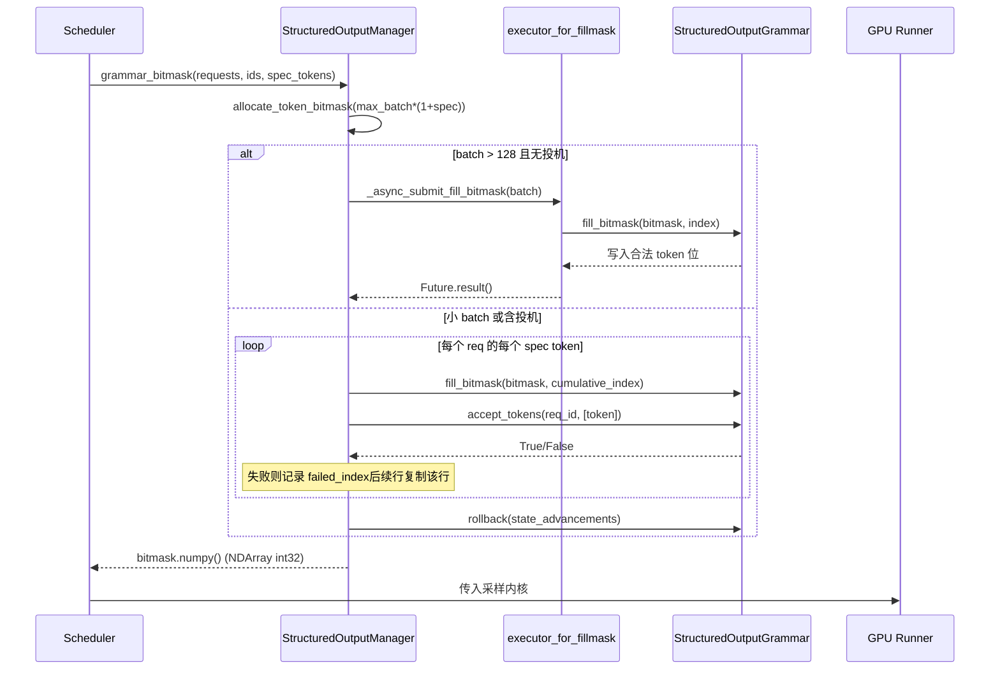

# Chapitre 7 : Échantillonnage et sortie : traitement des Logits, sortie structurée et retour en streaming

Dans le chapitre précédent, nous avons retracé comment le backend d'attention traduit le block table en paramètres de kernel, réalisant un calcul d'attention de type gather sur une mémoire GPU non contiguë. Mais l'attention ne produit que des états cachés — ce que le modèle doit réellement livrer à l'utilisateur, c'est le texte du prochain token. Ce chapitre retrace ce dernier kilomètre : après projection des états cachés en logits via lm_head, comment ceux-ci traversent une chaîne de processeurs soigneusement ordonnée (température, pénalités, top-k/top-p, contraintes structurelles), sont échantillonnés en token id, puis restaurés en texte par le detokenizer et poussés en streaming. Toute étape de cette chaîne dont l'ordre est erroné ou dont l'état fuit entraîne une dégradation silencieuse de la qualité de sortie.

# Sampler : l'ordre de la chaîne de processeurs, c'est la correction

**Modèle intuitif**: le Sampler est comme une chaîne de montage, les logits sont l'ébauche à usiner. Chaque poste (processor) de la chaîne modifie l'ébauche, et l'ordre des postes détermine directement le produit fini — dégrossir puis polir et polir puis dégrossir donnent deux choses différentes. Sans cette chaîne, le modèle ne pourrait produire que la distribution de probabilité brute, et l'utilisateur obtiendrait un « échantillonnage nu » sans contrôle de la température, sans suppression des répétitions, sans contrainte de format.

## Structures de données et disposition mémoire

Le Sampler lui-même est`nn.Module`, mais son état central est extrêmement mince : il ne détient que le sous-module`topk_topp_sampler`, les indicateurs`logprobs_mode`et`use_fp64_gumbel`. Le véritable état au niveau du batch est entièrement encapsulé dans[FACT:vllm/v1/sample/sampler.py:61-64], transmis via les paramètres de forward. Cette conception « Sampler sans état + métadonnées externes » est délibérée : l'instance de Sampler n'est créée qu'une seule fois durant le cycle de vie du moteur, alors que la composition du batch change à chaque decode step ; externaliser l'état est la seule façon de permettre au Sampler d'être capturé par CUDA Graph puis rejoué en toute sécurité.`SamplingMetadata`La constante clé est

. Elle sert simultanément deux sémantiques : une température inférieure à cette valeur est considérée comme greedy, et`_SAMPLING_EPS = 1e-5` [FACT:vllm/v1/sample/sampler.py:18]sert de garde-fou contre la division par zéro dans`apply_temperature`.

## Step-by-Step Walkthrough

Mise en situation : un batch mélange des requêtes greedy et des requêtes d'échantillonnage aléatoire, certaines ayant aussi activé logprobs.

**Première étape, capture des logprobs bruts.**Avant d'appliquer toute pénalité ou température, si la requête nécessite des logprobs, on décide d'abord selon`logprobs_mode`le contenu de la capture[FACT:vllm/v1/sample/sampler.py:84-93]. Notons que le commentaire souligne explicitement la différence avec V0 : V1 utilise**les logits bruts**(avant pénalités et température) pour calculer les top-k logprobs[FACT:vllm/v1/sample/sampler.py:72-77]. C'est un contrat sémantique — le logprob vu par l'utilisateur doit refléter la distribution réelle du modèle, et non une distribution déformée par les pénalités.

**Deuxième étape, unifier en float32.** [FACT:vllm/v1/sample/sampler.py:95-96]Que l'entrée soit en bf16 ou fp16, on convertit en float32. La raison est que les opérations suivantes de log_softmax, top-k et probabilité cumulée accumulent des erreurs en basse précision, surtout lorsque le vocabulaire atteint 150 000.

**Troisième étape, chaîne de processeurs invariants pour non-argmax.** `apply_logits_processors`Appliquer successivement : masque de liste blanche de tokens autorisés, exclusion de bad words,`non_argmax_invariant`processeurs, termes de pénalité[FACT:vllm/v1/sample/sampler.py:391-404]. La classification ici est la conception centrale —`non_argmax_invariant`désigne ceux**qui modifient le résultat glouton**(comme min_tokens, logit_bias), ils doivent prendre effet avant l'échantillonnage glouton ; tandis que les`argmax_invariant`processeurs (comme min_p) ne modifient pas l'argmax et peuvent être différés après la température.

**Quatrième étape, échantillonnage.** `sample`La méthode vérifie d'abord si tout est aléatoire[FACT:vllm/v1/sample/sampler.py:256-271]: si`all_greedy`, retour direct par argmax ; sinon, calculer d'abord le résultat glouton en réserve, puis appliquer la température, les processeurs invariants pour argmax, top-k/top-p[FACT:vllm/v1/sample/sampler.py:275-291]. Enfin utiliser`torch.where`pour choisir entre le résultat glouton et aléatoire selon le seuil de température[FACT:vllm/v1/sample/sampler.py:305-306], et réutiliser`greedy_sampled`le tenseur comme tampon de sortie, évitant une allocation supplémentaire.

**Cinquième étape, collecter les logprobs et encapsuler la sortie.**Selon`num_logprobs`trois cas : None ne retourne que les logprobs des tokens spécifiés ; -1 retourne tous les logprobs non triés ; sinon top-k[FACT:vllm/v1/sample/sampler.py:120-131]. Enfin, l'id de token est converti en int32 pour compresser la taille, étendu en`[num_requests, 1]`tenseur bidimensionnel[FACT:vllm/v1/sample/sampler.py:138-148]。

```mermaid
flowchart TD
    in_logits["logits (bf16/fp16)"] --> snap{"需要 logprobs?"}
    snap -->|是| raw["compute_logprobs / cloneraw_logprobs 快照"]
    snap -->|否| f32
    raw --> f32["logits.to(float32)"]
    f32 --> proc["apply_logits_processors"]
    proc --> mask{"allowed_token_ids_mask?"}
    mask -->|是| fill["masked_fill_(-inf)"]
    mask -->|否| bad
    fill --> bad{"bad_words_token_ids?"}
    bad -->|是| apply_bad["apply_bad_words"]
    bad -->|否| noninv
    apply_bad --> noninv["non_argmax_invariant 处理器"]
    noninv --> pen["apply_penalties"]
    pen --> sample["sample()"]
    sample --> allg{"all_greedy?"}
    allg -->|是| greedy["greedy_sample (argmax)"]
    allg -->|否| temp["apply_temperature"]
    temp --> arginv["argmax_invariant 处理器"]
    arginv --> topp["topk_topp_sampler"]
    topp --> where["torch.where(temp  out
    where --> out["SamplerOutputsampled_token_ids"]
```

## Réflexions de conception et pièges rencontrés

**Pourquoi les termes de pénalité doivent-ils être avant la température ?**La température est une mise à l'échelle de la distribution, la pénalité est un ajustement additif/soustractif sur des tokens spécifiques. Si l'on met à l'échelle avant de pénaliser, l'amplitude absolue de la pénalité sera amplifiée ou réduite par la température, entraînant un comportement incohérent des mêmes paramètres de pénalité à différentes températures. V1 fixe la pénalité avant la température, garantissant la stabilité sémantique des paramètres.

**`mark_unbacked`Le piège de compilation de**Dans`gather_logprobs`,`batched_count_greater_than`est compilé, et lorsque la dimension batch passe de 1 à ≥2, cela déclenche une recompilation de spécialisation 0/1 de dynamo[FACT:vllm/v1/sample/sampler.py:345-348]。`mark_unbacked`marque cette dimension comme entièrement symbolique, évitant cette recompilation. En production, si l'on observe un soudain blocage après la première requête de decode, c'est très probablement ce type de recompilation.

**`gpu_sync_allowed`La frontière de synchronisation de** `batched_count_greater_than`peut déclencher une synchronisation GPU en interne, vLLM utilise`gpu_sync_allowed(first_only=True)`le contexte pour déclarer explicitement « ici la synchronisation est autorisée, mais seulement la première fois »[FACT:vllm/v1/sample/sampler.py:345-348]. Si une synchronisation inattendue se produit dans une zone de capture CUDA Graph, cela provoquera l'échec de la capture — c'est un indice clé pour diagnostiquer les problèmes de capture de graphe.

# Sortie structurée : machine à états à double voie entre bitmask et grammaire

**Modèle intuitif**: la sortie structurée équivaut à mettre une « paire de lunettes grammaticales » sur l'échantillonneur — à chaque étape, il ne voit que les tokens conformes au JSON schema ou à la grammaire. Sans cela, le modèle pourrait générer du JSON syntaxiquement incorrect, faisant planter directement l'analyseur en aval. L'essence de l'implémentation de vLLM réside dans : la machine à états grammaticale progresse côté CPU, tandis que les contraintes sont transmises côté GPU sous forme de bitmask pour l'échantillonnage.

## Structures de données et disposition mémoire

`StructuredOutputManager`est un singleton au niveau du moteur, détenant`backend`(l'un parmi xgrammar/guidance/outlines/lm-format-enforcer),`reasoner_cls`et deux pools de threads[FACT:vllm/v1/structured_output/__init__.py:39-98]。

Le bitmask est la structure de données centrale :`_grammar_bitmask`est un tenseur int32 de forme`[max_batch_size * (1 + max_num_spec_tokens), vocab_size/32]`. Chaque bit correspond à la validité d'un token.[FACT:vllm/v1/structured_output/__init__.py:327-336]représente « tout à 1 » — tous les tokens sont valides`_full_mask = torch.tensor(-1, dtype=torch.int32)`Les deux pools de threads ont une répartition claire :[FACT:vllm/v1/structured_output/__init__.py:59]。

est responsable de la compilation grammaticale (intensif CPU, nombre de workers égal à la moitié du nombre de CPU)`executor`est responsable du remplissage parallèle de bitmasks pour les grands batchs, activé uniquement lorsque le batch dépasse 128[FACT:vllm/v1/structured_output/__init__.py:71-78]；`executor_for_fillmask`Initialisation de la grammaire.[FACT:vllm/v1/structured_output/__init__.py:62-69]。

## Step-by-Step Walkthrough

**Lors de la première entrée d'une requête**est appelé`grammar_init`. Si le backend n'est pas initialisé, choisir l'implémentation selon la configuration[FACT:vllm/v1/structured_output/__init__.py:115-176]. Ensuite soumettre la tâche de compilation : par défaut asynchrone[FACT:vllm/v1/structured_output/__init__.py:130-165], mais en mode`executor.submit`doit être synchrone`external_launcher`Génération du bitmask.[FACT:vllm/v1/structured_output/__init__.py:167-176]。

**À chaque decode step,**génère les masques pour toutes les requêtes structurées du batch`grammar_bitmask`. Les grands batchs empruntent le chemin parallèle : soumission par lots de 16 au pool de threads[FACT:vllm/v1/structured_output/__init__.py:314-442]. Les petits batchs empruntent le chemin série, faisant progresser l'état grammatical token par token[FACT:vllm/v1/structured_output/__init__.py:346-373]Alignement des masques en décodage spéculatif.[FACT:vllm/v1/structured_output/__init__.py:374-433]。

**C'est la partie la plus ingénieuse. Lorsqu'il y a des draft tokens, chaque requête nécessite**lignes de masque. Le chemin série traite token par token : si un draft token est rejeté par la grammaire, enregistrer`1 + max_num_spec_tokens`, les lignes suivantes copient directement le masque de cette ligne`failed_index`. Cela garantit que « après le rejet d'un draft, l'état de contrainte des positions suivantes revient au point de rejet ».[FACT:vllm/v1/structured_output/__init__.py:396-418]Rollback d'état.

**Pendant le remplissage du bitmask, l'état grammatical a été avancé de**pas, mais les draft tokens n'ont pas encore été réellement acceptés, il faut donc`state_advancements`revenir en arrière`grammar.rollback(state_advancements)`. L'acceptation réelle a lieu dans[FACT:vllm/v1/structured_output/__init__.py:422-430]copie`accept_tokens` [FACT:vllm/v1/structured_output/__init__.py:444-466]。



## Pourquoi external_launcher doit-il compiler de manière synchrone ?

**Les commentaires donnent la raison précise : la compilation asynchrone ferait que les**transitions d'état se produisent à des moments différents sur différents rangs TP, brisant l'hypothèse de déterminisme dont dépend external_launcher`WAITING_FOR_STRUCTURED_OUTPUT_GRAMMAR → WAITING` 状态转换在不同 TP rank 上发生于不同时刻，破坏 external_launcher 依赖的确定性假设 [FACT:vllm/v1/structured_output/__init__.py:47-56]. C'est un cas typique de conflit entre le déterminisme distribué et l'optimisation asynchrone.

**Point de départ des contraintes sous un modèle de raisonnement.** `_get_constraint_start`Détermine à partir de quel token commencer à appliquer les contraintes syntaxiques[FACT:vllm/v1/structured_output/__init__.py:220-292]. Pour les modèles avec chaîne de pensée, la phase de reasoning ne doit pas être soumise aux contraintes JSON ; elle ne démarre qu'après la fin du reasoning.`enable_in_reasoning`Lorsque True, retourne directement 0 (contrainte sur toute la séquence)[FACT:vllm/v1/structured_output/__init__.py:235-236]. Si le reasoner prend en charge`find_reasoning_end_offset`, l'utiliser pour localiser précisément[FACT:vllm/v1/structured_output/__init__.py:261-267]; sinon, revenir à une recherche par régression token par token[FACT:vllm/v1/structured_output/__init__.py:287-291]。

**`validate_tokens`la sémantique de préfixe de**Lors du décodage spéculatif, les draft tokens peuvent violer la grammaire,`validate_tokens`retourne le « plus long préfixe légal »[FACT:vllm/v1/structured_output/__init__.py:294-312]. Notez qu'il retire d'abord le remplissage spéculatif (-1), puis calcule le point de départ des contraintes, et enfin n'effectue la validation syntaxique que sur les tokens dans l'intervalle contraint.

# Detokenizer : le jeu de frontières entre décodage incrémental et stop string

**Modèle intuitif**: le detokenizer est comme un greffier qui recopie caractère par caractère, traduisant les token ids en texte lisible par l'humain. La difficulté réside dans le fait que les tokens et les caractères ne correspondent pas un à un (un token peut ne correspondre qu'à la moitié d'un caractère UTF-8), et qu'une stop string peut s'étendre sur plusieurs tokens. Sans décodage incrémental, il faudrait redécoder toute la séquence depuis le début à chaque étape, et le coût O(n²) écraserait le débit.

## Structures de données et disposition mémoire

`IncrementalDetokenizer`La classe de base ne détient que`token_ids`la liste[FACT:vllm/v1/engine/detokenizer.py:32-33]。`BaseIncrementalDetokenizer`ajoute les champs liés au stop :`stop`liste,`min_tokens`、`include_stop_str_in_output`、`stop_buffer_length`et`_last_output_text_offset` [FACT:vllm/v1/engine/detokenizer.py:70-94]。

`stop_buffer_length`sont essentiels : lorsque la stop string n'est pas incluse dans la sortie, il est égal à la longueur de la plus longue stop string moins un[FACT:vllm/v1/engine/detokenizer.py:87-90]. Ce « tampon de repli » garantit que la sortie en flux ne émet pas prématurément des caractères qui pourraient être un préfixe de stop string.

Deux chemins d'implémentation :`FastIncrementalDetokenizer`utiliser le`DecodeStream` [FACT:vllm/v1/engine/detokenizer.py:166-246]；`SlowIncrementalDetokenizer`de la bibliothèque tokenizers, utiliser le`detokenize_incrementally` [FACT:vllm/v1/engine/detokenizer.py:249-305]côté Python. Le critère de choix est une version de tokenizers ≥ 0.22.0 et un type de tokenizer correspondant[FACT:vllm/v1/engine/detokenizer.py:32-33][FACT:vllm/v1/engine/detokenizer.py:61-63]。

## Step-by-Step Walkthrough

**décodage incrémental.** `update`reçoit les nouveaux token ids et`stop_terminated`le flag[FACT:vllm/v1/engine/detokenizer.py:96-142]. Si le stop termine et n'inclut pas la stop string, alors le dernier token est exclu du décodage[FACT:vllm/v1/engine/detokenizer.py:107-111]. Ensuite, appel token par token à`decode_next`accumule le texte[FACT:vllm/v1/engine/detokenizer.py:117-122]。

**détection de stop string.** `check_stop_strings`ne recherche que dans la plage des nouveaux caractères[FACT:vllm/v1/engine/detokenizer.py:308-360]. Le point de départ de la recherche est`1 - new_char_count - stop_string_len` [FACT:vllm/v1/engine/detokenizer.py:338], ce décalage garantit que les stop strings à cheval sur les frontières de tokens sont également capturées. Lorsque plusieurs stop strings correspondent simultanément, on choisit**celle qui se termine le plus tôt**[FACT:vllm/v1/engine/detokenizer.py:342-347]。

**découpage de la sortie en flux.** `get_next_output_text`selon`delta`le paramètre détermine s'il faut retourner le tout ou l'incrément[FACT:vllm/v1/engine/detokenizer.py:148-163]. Si non terminé, conserver`stop_buffer_length`caractères non émis[FACT:vllm/v1/engine/detokenizer.py:145-146], utiliser`_last_output_text_offset`pour enregistrer la position déjà envoyée[FACT:vllm/v1/engine/detokenizer.py:148-163]。

**récupération après exception.** `FastIncrementalDetokenizer._protected_step`gère deux types d'exceptions : OverflowError/TypeError journalise et retourne None[FACT:vllm/v1/engine/detokenizer.py:225-229]; l'erreur « Invalid prefix » quant à elle**reconstruit le DecodeStream**et réessaie[FACT:vllm/v1/engine/detokenizer.py:222-246]. Ce dernier cas répond à la situation limite où le tokenizer produit une sortie UTF-8 non monotone.

## Réflexions de conception et pièges rencontrés

**Le compromis sur stop_buffer_length.**Plus le tampon est long, plus la latence du flux est grande (le moment où l'utilisateur voit le texte est repoussé), mais moins on risque de manquer une stop string à cheval sur plusieurs tokens. Prendre « la longueur de la plus longue stop string moins un » est une borne inférieure exacte : tout préfixe de stop string a au plus cette longueur.

**min_tokens et stop_check_offset.**Lorsque le nombre de tokens de sortie n'atteint pas`min_tokens`,`stop_check_offset`est continuellement repoussé à la fin du texte[FACT:vllm/v1/engine/detokenizer.py:120-122], ce qui signifie que ce texte ne sera pas soumis à la détection de stop. Cela empêche le modèle de heurter une stop string dès le début et de produire une sortie vide.

**Le cache added_token_ids du chemin Fast.**Lorsque`spaces_between_special_tokens`est False, il faut supprimer les espaces entre les tokens spéciaux[FACT:vllm/v1/engine/detokenizer.py:192-207]. Le code met en cache`added_token_ids`sur l'objet tokenizer[FACT:vllm/v1/engine/detokenizer.py:195-200], évitant de reconstruire le dictionnaire à chaque decode.

# Réflexions de conception

Les trois modules partagent une même philosophie de conception :**séparer l'avancement de l'état de la vérification des contraintes, pour que le côté GPU n'effectue que des opérations tensorielles sans état**. Le Sampler est sans état, l'état est dans`SamplingMetadata`; la machine à états syntaxique avance côté CPU, le GPU ne consomme que le masque de bits ; le`_last_output_text_offset`du detokenizer est l'unique curseur de flux. Cette séparation permet à chaque composant côté GPU d'être capturé par CUDA Graph.

Une autre ligne directrice est**l'ordre est la sémantique**. L'ordre de la chaîne de processeurs du Sampler, le point de départ des contraintes de la sortie structurée, le décalage de détection de stop du detokenizer : une erreur d'ordre n'importe où ne provoquera pas de crash, mais produira silencieusement des résultats erronés — c'est précisément ce qui rend ce type de code si difficile à déboguer.

# Résumé de ce chapitre

- La chaîne de processeurs du Sampler est strictement ordonnée : instantané des logprobs bruts → float32 → liste blanche/bad words → non-argmax-invariant → pénalités → température → argmax-invariant → top-k/top-p.
- La sortie structurée transmet l'état syntaxique côté CPU au GPU via un masque de bits, et en décodage spéculatif, assure la cohérence de l'état par`failed_index`copie et`rollback`.
- Le Detokenizer utilise`stop_buffer_length`un tampon de repli pour équilibrer la latence du streaming et la détection des stop strings à travers les tokens ; le chemin Fast dépend de tokenizers ≥ 0.22.0`DecodeStream`。

# Réflexions et auto-évaluation de ce chapitre

Q1 : Si l'on déplace le`apply_logits_processors`terme de pénalité (`apply_penalties`) après la température, quel biais concret apparaîtrait dans un scénario d'échantillonnage à haute température avec temperature=2.0 ? Pourquoi ?

**Analyse de référence**: La température est une mise à l'échelle de tout le vecteur de logits (`logits.div_(temp)`）[FACT:vllm/v1/sample/sampler.py:241-242]. Le terme de pénalité (comme repetition penalty) est un ajustement multiplicatif/additif sur des tokens spécifiques. Si l'on met à l'échelle avant de pénaliser, l'amplitude absolue de la pénalité est amplifiée 2 fois par la température, ce qui fait que le même ensemble de`repetition_penalty`paramètres a un effet de suppression bien plus fort à haute température qu'à basse température ; la sémantique des paramètres dérive avec la température. V1 fixe la pénalité avant la température[FACT:vllm/v1/sample/sampler.py:403-404], garantissant que l'amplitude de la pénalité est découplée de la température. De plus, la pénalité appartient à la catégorie`non_argmax_invariant`(elle affecte le résultat glouton), et le chemin glouton retourne déjà avant la température[FACT:vllm/v1/sample/sampler.py:261-271]; si on la déplaçait après la température, les requêtes glouton contourneraient complètement la pénalité, ce qui rendrait le comportement incohérent.

Q2 : Dans le`grammar_bitmask`chemin série, si l'on supprime la ligne`grammar.rollback(state_advancements)` [FACT:vllm/v1/structured_output/__init__.py:422-430], que se passerait-il dans la combinaison décodage spéculatif + sortie structurée ? Analysez en vous appuyant sur le moment d'appel de`accept_tokens`.

**Analyse de référence**: Lors du remplissage du masque de bits, le code appelle`grammar.accept_tokens`pour chaque draft token afin de faire avancer l'état syntaxique et générer le masque de la position suivante[FACT:vllm/v1/structured_output/__init__.py:396-418], mais il ne s'agit que d'une « avancée exploratoire » — le draft token n'a pas encore été validé et accepté par le modèle cible. Si l'on supprime`rollback`, l'état syntaxique resterait définitivement à la position « tous les drafts sont acceptés ». Lorsque le modèle cible rejette effectivement une partie des draft tokens, la séquence de tokens réellement acceptée ne correspond plus à l'état syntaxique :`accept_tokens` [FACT:vllm/v1/structured_output/__init__.py:444-466]validerait sur la base d'un état syntaxique erroné, ce qui conduirait à rejeter des tokens valides ou à laisser passer des tokens invalides. Le résultat est une corruption silencieuse de la sortie JSON : pas de crash, mais un échec d'analyse en aval.

Q3: `check_stop_strings`Le point de départ de la recherche est`1 - new_char_count - stop_string_len` [FACT:vllm/v1/engine/detokenizer.py:338]. Si l'on passait à une recherche complète depuis 0, serait-ce fonctionnellement correct ? Quels problèmes de performance cela poserait-il dans un scénario de streaming sur de longues séquences ?

**Analyse de référence**: Fonctionnellement correct — une recherche depuis 0 trouverait toutes les correspondances, y compris celles à travers les frontières de tokens. Mais en termes de performance, à chaque étape on ferait`output_text`sur tout le`find`, la complexité passant de O(new_char_count) à O(total_length), soit O(n²) sur de longues séquences. Plus grave encore, une recherche depuis 0 pourrait correspondre à**des sous-chaînes de stop string dans le texte historique**déjà envoyé à l'utilisateur, provoquant un déclenchement répété du stop ou une troncature erronée. L'offset`1 - new_char_count - stop_string_len`de la conception originale couvre précisément la fenêtre minimale nécessaire « nouveaux caractères + préfixe de stop string susceptible de traverser la frontière », garantissant à la fois l'absence de détection manquée et l'évitement des fausses correspondances historiques.

À ce stade, la chaîne complète d'inférence sur une seule machine est opérationnelle : du calcul d'attention à la sortie d'échantillonnage, chaque maillon influence directement la qualité du texte final livré. Mais lorsque la taille du modèle dépasse la capacité d'une seule carte, cette chaîne doit être exécutée en coordination sur plusieurs dispositifs. Dans le chapitre suivant, nous quitterons la machine unique pour entrer dans le parallélisme distribué : comment TP, PP et EP découpent le modèle, et comment les primitives de communication synchronisent ces résultats d'échantillonnage entre les ranks.
