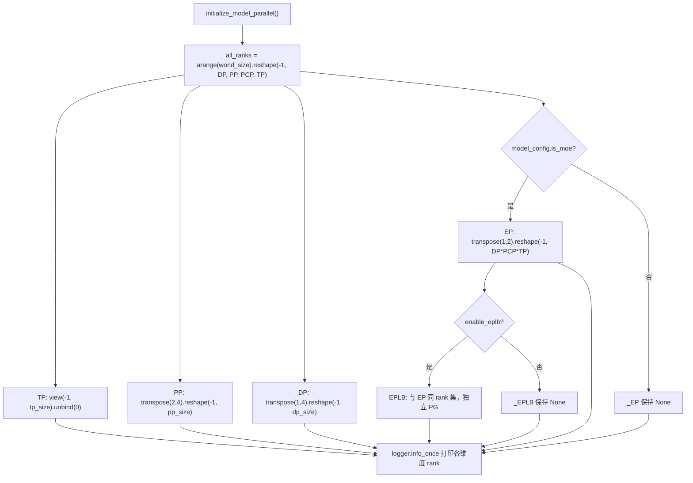
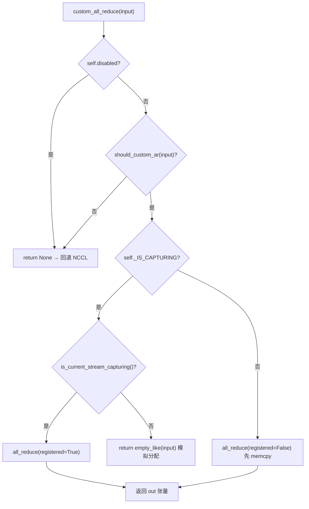

# Chapitre 8 : Parallélisme distribué : TP, PP, EP et primitives de communication

Dans le chapitre précédent, nous avons parcouru le dernier kilomètre du cycle de vie d'une inférence unique, de l'échantillonnage des logits à la sortie en streaming. Mais lorsque le modèle est trop grand pour tenir sur une seule carte, ce pipeline doit être découpé et exécuté en coordination sur plusieurs dispositifs. La question première de l'inférence distribuée n'est pas « comment découper le modèle », mais « une fois découpé, qui parle à qui et de quelle manière ». vLLM confie ces deux questions respectivement à la topologie des groupes de processus de parallel_state.py et à l'implémentation du communicateur de custom_all_reduce.py. Ce chapitre suit la chaîne « création de groupes → découpage → communication → rééquilibrage de charge » pour démonter couche par couche les stratégies de parallélisme TP, PP, EP et les primitives de communication sous-jacentes.

# 8.1 Topologie des groupes de processus : comment une grille de ranks découpe TP/PP/DP/EP

## Modèle intuitif

Imaginez 8 GPU comme une longue table de 8 places. Le parallélisme tensoriel (Tensor Parallelism, TP) exige que « les convives de la même table lèvent leur verre en même temps », le parallélisme de pipeline (Pipeline Parallelism, PP) exige que « les sièges adjacents se passent les plats en relais », le parallélisme de données (Data Parallelism, DP) exige que « chaque table mange de son côté mais qu'on fasse les comptes à la fin », et le parallélisme d'experts (Expert Parallelism, EP) exige que « les tokens soient triés par service ». Sans une organisation unifiée des places, chaque module`new_group`, il se produit un décalage de communication du type « je pensais que tu étais dans le groupe TP, alors qu'en fait tu es dans le groupe DP » — dès qu'un rank est absent lors d'une communication collective, NCCL se bloque directement au lieu de signaler une erreur.

## Structures de données et disposition mémoire

`GroupCoordinator`est le support de tout cela. La conception de ses champs correspond directement au «多重身份 d'un processus sur plusieurs dimensions parallèles » :

- `rank`est le rank global,`ranks`est la liste des ranks globaux des membres de ce groupe,`world_size`est la taille du groupe[FACT:vllm/distributed/parallel_state.py:434-436]。
- `local_rank`sert à lier le périphérique,`rank_in_group`est l'indice au sein du groupe — le code source utilise une table pour distinguer précisément les deux : dans un groupe de 4 cartes réparties sur deux nœuds, le`local_rank`du rank 2 est 0 (c'est la première carte sur le nœud 1), mais son`rank_in_group`est 2[FACT:vllm/distributed/parallel_state.py:437-445]。
- `cpu_group`et`device_group`existent par paire : le premier passe par gloo pour la communication de métadonnées/objets, le second passe par NCCL pour la communication de tenseurs[FACT:vllm/distributed/parallel_state.py:446-447]。

Il y a ici une conception clé :**Pourquoi chaque groupe doit-il maintenir un groupe CPU ?**Parce que`broadcast_object`、`send_object`ce type d'opération transmet des objets Python (octets sérialisés) ; passer par NCCL gaspille de la mémoire GPU et peut polluer le périphérique CUDA courant.`barrier()`Les commentaires de  expriment cela très clairement : la barrière de NCCL est en interne un broadcast, qui crée furtivement des tenseurs GPU et risque de perturber le périphérique courant, il faut donc utiliser le groupe CPU[FACT:vllm/distributed/parallel_state.py:1355-1362]。

## Step-by-Step：`initialize_model_parallel`Comment découper la grille

Prenons un scénario concret : 8 cartes, TP=2, PP=4, DP=1. L'essentiel est de reshape une séquence de ranks unidimensionnelle en une grille multidimensionnelle, puis de la découper le long de chaque dimension.

Première étape, construire la grille de ranks. L'ordre de disposition est explicitement défini comme`ExternalDP x DP x PP x PCP x TP` [FACT:vllm/distributed/parallel_state.py:2045-2060]：

```python
all_ranks = torch.arange(world_size).reshape(
    -1, data_parallel_size, pipeline_model_parallel_size,
    prefill_context_model_parallel_size, tensor_model_parallel_size,
)
```

Deuxième étape, découper le groupe TP : view la grille en`(-1, tp_size)`puis unbind, on obtient`[g0,g1],[g2,g3],...` [FACT:vllm/distributed/parallel_state.py:2065-2077]. Notez que le groupe TP passe en plus`use_message_queue_broadcaster=True`, car le groupe TP a besoin d'un broadcast en mémoire partagée pour distribuer les métadonnées.

Troisième étape, découper le groupe PP :`all_ranks.transpose(2, 4)`On déplace la dimension PP en dernière position puis on découpe, on obtient`[g0,g2,g4,g6],[g1,g3,g5,g7]` [FACT:vllm/distributed/parallel_state.py:2175-2188]. C'est exactement l'exemple donné dans la docstring[FACT:vllm/distributed/parallel_state.py:1997-1997]。

Quatrième étape, découper le groupe DP :`transpose(1, 4)`puis découper[FACT:vllm/distributed/parallel_state.py:2195-2202]。

Cinquième étape, découper le groupe EP — il y a ici un détail facile à négliger : le groupe EP n'est créé que pour les modèles MoE, les modèles dense sont directement ignorés[FACT:vllm/distributed/parallel_state.py:2210-2241]. L'ensemble des ranks du groupe EP est le produit de`DP x PCP x TP`, ce qui signifie que EP réutilise les cartes physiques de DP et TP, plutôt qu'une dimension indépendante.



## Réflexions de conception et pièges

**Pourquoi EPLB a-t-il besoin d'un groupe de processus indépendant ?**Les commentaires donnent la réponse : isoler la communication EPLB de la communication collective du forward MoE, pour éviter que le « torch.distributed d'exécution » et le « torch.distributed d'EPLB » ne se bloquent mutuellement[FACT:vllm/distributed/parallel_state.py:2243-2246]. C'est un compromis typique « échanger un domaine de communication indépendant contre du déterminisme » — le coût mémoire supplémentaire d'un PG est échangé contre l'absence de blocage du forward lors du transfert de poids.

**Contrainte de synchronisation du groupe DP**est le piège le plus fréquemment rencontré en production : tous les ranks d'un même groupe DP doivent appeler`generate`en même temps, sinon blocage[FACT:vllm/distributed/parallel_state.py:2048-2051]. Car au sein du groupe DP s'effectue un all-reduce des gradients/résultats d'échantillonnage ; l'absence de n'importe quel rank bloque définitivement la communication collective.

**Ordre de destruction**Il y a également des subtilités.`destroy()`On détruit d'abord le device communicator, puis le device_group et le cpu_group[FACT:vllm/distributed/parallel_state.py:1380-1393]. Les commentaires expliquent la raison : le device communicator peut détenir des espaces de travail de communication collective dépendant de ces PG (comme la barrière IPC PCIe de FlashInfer), il faut donc les libérer en premier[FACT:vllm/distributed/parallel_state.py:1377-1377]。

# 8.2 Primitives de communication : comment un all-reduce personnalisé contourne NCCL

## Modèle intuitif

L'all-reduce de NCCL est un « camion universel », capable de transporter n'importe quelle marchandise sur n'importe quelle route, mais avec des coûts de démarrage et de protocole fixes. Lorsque vous devez effectuer de manière répétée des all-reduce sur de petits tenseurs sur une machine à 8 cartes entièrement interconnectées en NVLink (chaque couche attention/MLP de TP doit le faire), le « péage » du camion universel devient non négligeable. L'all-reduce personnalisé est un « petit chariot dédié » : activé uniquement sur la même machine, en interconnexion NVLink complète, et pour des tailles de tenseurs appropriées, en échangeant un`cudaMemcpy`contre les coûts de handshake et de protocole de NCCL.

## Structures de données et disposition mémoire

`CustomAllreduce`L'initialisation de  est une combinaison de « détection de capacités + préallocation de ressources ». Champs clés :

- `_SUPPORTED_WORLD_SIZES = [2, 4, 6, 8, 16]`: ne prend en charge que ces tailles de groupe[FACT:vllm/distributed/device_communicators/custom_all_reduce.py:113-129]。
- `meta_ptrs`: métadonnées de synchronisation + tampon de résultats intermédiaires, taille`ops.meta_size() + max_size` [FACT:vllm/distributed/device_communicators/custom_all_reduce.py:291-294]。
- `buffer_ptrs`: tampon IPC préenregistré, en mode eager le tenseur d'entrée est d'abord copié ici avant le calcul[FACT:vllm/distributed/device_communicators/custom_all_reduce.py:298-305]。
- `rank_data`: tenseur uint8 de 8 Mo, stockant les tuples de pointeurs de tampons IPC de tous les ranks[FACT:vllm/distributed/device_communicators/custom_all_reduce.py:309-315]。

**Pourquoi les tampons doivent-ils être préenregistrés ?**Parce que la capture CUDA Graph exige que toutes les adresses soient fixées au moment de la capture.`register_graph_buffers`À la fin de la capture, on diffuse à tous les ranks toutes les adresses de tampons utilisées et on les enregistre[FACT:vllm/distributed/device_communicators/custom_all_reduce.py:474-491]。

## Step-by-Step : le flux de décision d'un all-reduce

Prenons un scénario : la sortie d'une couche MLP dans le groupe TP nécessite un all-reduce, l'entrée est un tenseur bf16 de 4 Mo.

Première étape,`custom_all_reduce`vérifier si c'est désactivé, si`should_custom_ar` [FACT:vllm/distributed/device_communicators/custom_all_reduce.py:529-533]。

Deuxième étape,`should_custom_ar`Filtrage un par un : world_size > 8 rejeté ; dtype doit être fp32/fp16/bf16 ; le nombre d'octets doit être un multiple de 16 ; doit être faiblement contigu ; world_size==2 ou fully connected pour continuer[FACT:vllm/distributed/device_communicators/custom_all_reduce.py:493-508]。

Troisième étape, aiguillage selon qu'on est dans une capture CUDA Graph ou non : en capture on utilise`registered=True`(adresse déjà fixée), sinon`registered=False`(nécessite d'abord un memcpy vers un buffer pré-enregistré)[FACT:vllm/distributed/device_communicators/custom_all_reduce.py:529-545]。

Quatrième étape, appel effectif de`ops.all_reduce`, en passant`buffer_ptrs[rank]`et`max_size` [FACT:vllm/distributed/device_communicators/custom_all_reduce.py:519-527]。



## Réflexions de conception et pièges rencontrés

**Le chemin de repli pour les scénarios multi-nœuds**est la partie la plus ingénieuse de ce code.`same_node`Lorsque`mnnvl_only`est faux,[FACT:vllm/distributed/device_communicators/custom_all_reduce.py:198-199]est mis à vrai[FACT:vllm/distributed/device_communicators/custom_all_reduce.py:228-233]。`_group_can_attempt_mnnvl`, puis on vérifie la capacité MNNVL (Multi-Node NVLink). Si toutes les cartes du groupe ne supportent pas MNNVL, on désactive directement la communication collective personnalisée[FACT:vllm/distributed/device_communicators/custom_all_reduce.py:59-73]on utilise un all-reduce CPU (opération MIN) pour garantir que tous les ranks suivent le même flux de contrôle

**— c'est la protection clé dans un cluster hétérogène pour éviter que « certains ranks entrent dans le chemin MNNVL, d'autres passent par NCCL » et provoquent un blocage.**：`_can_p2p`Le coût de la vérification P2P`gpu_p2p_access_check`parcourt tous les peers pour faire[FACT:vllm/distributed/device_communicators/custom_all_reduce.py:278-278], le commentaire indique que le premier calcul est coûteux mais qu'il est mis en cache`VLLM_SKIP_P2P_CHECK`. En production, si le démarrage est lent, on peut définir[FACT:vllm/distributed/device_communicators/custom_all_reduce.py:86-100]。

**pour l'ignorer et faire directement confiance au rapport P2P du driver**La sélection à trois niveaux de backend pour reduce-scatter`_select_reduce_scatter_backend`mérite un examen séparé :`mnnvl_multimem` > `mnnvl_lamport` > `legacy` [FACT:vllm/distributed/device_communicators/custom_all_reduce.py:601-636]retourne par ordre de priorité`(2,4,8)`. Le chemin multimem exige que world_size soit dans[FACT:vllm/distributed/device_communicators/custom_all_reduce.py:103-104]et que la capacité du device soit (10,0) ou (10,3) (niveau Blackwell)`VLLM_BATCH_INVARIANT`. Attention :[FACT:vllm/distributed/device_communicators/custom_all_reduce.py:628]désactive le chemin multimem

# — car l'ordre de réduction de multimem est non déterministe, ce qui brise l'invariance de batch.

## 8.3 EPLB : logique d'ordonnancement du rééquilibrage de charge des experts

Modèle intuitif

## Dans un modèle MoE, 256 experts logiques sont répartis sur 32 cartes, 8 par carte. Mais sous le trafic réel, certains « experts populaires » (par exemple ceux traitant des structures syntaxiques courantes) sont routés par un grand nombre de tokens, ce qui fait de la carte qui les héberge un goulot d'étranglement, tandis que les autres cartes tournent à vide. EPLB (Expert Parallel Load Balancer) consiste à « ajouter des réplicas aux experts populaires » : copier les poids des experts populaires sur des cartes inoccupées pour y dériver des tokens. Sans lui, le débit réel du MoE serait bloqué par la carte la plus lente.

`EplbModelState`Structures de données et disposition mémoire

- `physical_to_logical_map`utilise trois tables de correspondance pour décrire la relation « expert logique ↔ expert physique » :`(num_moe_layers, num_physical_experts)`: forme[FACT:vllm/distributed/eplb/eplb_state.py:105-120]。
- `logical_to_physical_map`, chaque emplacement physique stocke l'id de l'expert logique qu'il porte`(num_moe_layers, num_logical_experts, max_replicas+1)`: forme[FACT:vllm/distributed/eplb/eplb_state.py:123-146]。
- `logical_replica_count`, matrice creuse, -1 signifie aucune correspondance[FACT:vllm/distributed/eplb/eplb_state.py:147-161]。

`expert_load_window`: nombre de réplicas de chaque expert logique`(window_size, num_moe_layers, num_physical_experts)` [FACT:vllm/distributed/eplb/eplb_state.py:180-187]est une fenêtre glissante, de forme[FACT:vllm/distributed/eplb/eplb_state.py:180-187]。

## . Le commentaire précise : on enregistre désormais la charge de tous les experts physiques et non seulement des experts locaux, afin de garantir la cohérence des statistiques entre différentes méthodes de dispatch (naive all-to-all, DeepEP) ; en naive all-to-all, chaque rank DP contribue au même ensemble de tokens, la charge est donc multipliée par dp_size

Step-by-Step : la chaîne complète d'un réarrangement`expert_rearrangement_step`Mise en situation :`rearrange()`。

atteint le seuil, déclenche`scatter_add_`Première étape, remapper la charge physique vers les experts logiques. On utilise`physical_to_logical_map`pour agréger selon`invalid_idx`, les emplacements invalides (<0) sont placés dans le bucket[FACT:vllm/distributed/eplb/eplb_state.py:794-816]。

puis finalement jetés`_allreduce_list`Deuxième étape, all-reduce inter-ranks pour obtenir la charge logique globale.[FACT:vllm/distributed/eplb/eplb_state.py:1045-1068]。

concatène les charges de plusieurs modèles puis fait un seul all-reduce avant de les séparer, évitant ainsi plusieurs communications`policy.rebalance_experts`Troisième étape, appel de la stratégie pour calculer la nouvelle correspondance.[FACT:vllm/distributed/eplb/eplb_state.py:859-867]。

s'exécute sur le host, donc la fenêtre de charge et la correspondance actuelle doivent être recopiées sur le CPU[FACT:vllm/distributed/eplb/eplb_state.py:869-923]Quatrième étape, jugement « saut de réarrangement » spécifique à ROCm : si la nouvelle correspondance améliore le déséquilibre de charge des ranks de moins de 5 %, on saute ce réarrangement

. C'est une optimisation pragmatique — le réarrangement lui-même a un coût de communication, si le gain est insuffisant on ne le fait pas.[FACT:vllm/distributed/eplb/eplb_state.py:925-942]。

```mermaid
sequenceDiagram
    participant Main as 主线程 step()
    participant Policy as DefaultEplbPolicy
    participant Comm as EplbCommunicator
    participant Async as async_worker 线程
    Main->>Main: expert_rearrangement_step >= interval
    Main->>Main: scatter_add_ 物理负载→逻辑负载
    Main->>Main: _allreduce_list 跨 rank 聚合
    Main->>Policy: rebalance_experts(load, replicas, groups, nodes, gpus, map)
    Policy-->>Main: new_physical_to_logical_map
    alt 同步模式
        Main->>Comm: rearrange_expert_weights_inplace()
        Comm-->>Main: 权重搬运完成
        Main->>Main: _commit_eplb_maps()
    else 异步模式
        Main->>Main: eplb_stats = EplbStats(...); rebalanced = True
        Main->>Async: rearrange_event.record()
        Async->>Comm: 后台搬运权重到 expert_buffer
        Async-->>Main: pending_result 就绪
        Main->>Main: _move_to_workspace() 提交
    end
```

## copie

**Réflexions de conception et pièges rencontrés**La primitive de synchronisation en mode asynchrone`rebalanced`est l'endroit le plus subtil de ce code.[FACT:vllm/distributed/eplb/eplb_state.py:194-203]Le flag`rebalanced`repose sur le GIL pour se synchroniser entre le thread principal et le worker async`_all_ranks_result_ready`. Mais le commentaire avertit :[FACT:vllm/distributed/eplb/eplb_state.py:664-665]。`_all_ranks_result_ready`doit rester cohérent sur tous les ranks, sinon[FACT:vllm/distributed/eplb/eplb_state.py:1024-1043]。

**l'all-reduce dans**：`_should_record_current_step`provoquera un blocage`window_size`on privilégie le groupe CPU pour l'all-reduce, car le groupe CPU est plus fiable[FACT:vllm/distributed/eplb/eplb_state.py:689-709]L'optimisation « enregistrement anticipé » de la fenêtre glissante`step_interval - window_size`n'active l'enregistrement que lorsque la distance jusqu'au prochain réarrangement ne dépasse pas[FACT:vllm/distributed/eplb/eplb_state.py:1196-1199]。`should_record_tensor`étapes`fill_`. Le commentaire explique : les données des[FACT:vllm/distributed/eplb/eplb_state.py:272-278]。

**étapes précédant chaque cycle de réarrangement seront écrasées par la fenêtre glissante, les enregistrer ne sert à rien et gaspille du calcul GPU**：`enable_elastic_ep`est le même tenseur scalaire partagé par toutes les couches, une seule`physical_expert_capacity`met à jour toutes les couches`elastic_ep_max_dp_size`La réservation de capacité de l'EP élastique[FACT:vllm/distributed/eplb/eplb_state.py:375-386]lors de`reconfigure_physical_expert_slots`,[FACT:vllm/distributed/eplb/eplb_state.py:1135-1160]。

**`_commit_eplb_maps`réserve selon**, la table de correspondance remplit les emplacements excédentaires avec -1`PIN_MEMORY`. Ainsi, lors d'une extension, il n'est pas nécessaire de réallouer la mémoire GPU, il suffit de remplir les emplacements -1 avec de vrais experts.`non_blocking=True`est chargé de rafraîchir la vue lors des extensions/réductions[FACT:vllm/distributed/eplb/eplb_state.py:1392-1400]La gestion de la pin memory dans

# : lorsque

Trois blocs de code partagent une même philosophie de conception :**Remplacer la certitude par une dégradation déterministe via la détection de capacités**。`GroupCoordinator`Lorsque`world_size == 1`on contourne directement toute communication collective[FACT:vllm/distributed/parallel_state.py:736-738]；`CustomAllreduce`on retourne`None`si l'une des conditions n'est pas remplie, permettant à l'appelant de revenir à NCCL[FACT:vllm/distributed/device_communicators/custom_all_reduce.py:532-533]; EPLB saute la redistribution lorsque l'amélioration est inférieure à 5 %[FACT:vllm/distributed/eplb/eplb_state.py:916]. Ce modèle « échec rapide + dégradation élégante » permet au même code de fonctionner sur toute la gamme de matériels, du mono-GPU au MNNVL multi-nœuds, sans écrire de branches pour chaque configuration.

Un autre point commun est**la priorité donnée à la cohérence du flux de contrôle sur la performance**。`_group_can_attempt_mnnvl`on force tous les ranks à emprunter la même branche via un all-reduce CPU[FACT:vllm/distributed/device_communicators/custom_all_reduce.py:59-73]，`_all_ranks_result_ready`De même[FACT:vllm/distributed/eplb/eplb_state.py:1024-1043]. Dans un système distribué, « certains ranks empruntent le chemin rapide et d'autres le chemin lent » est bien plus dangereux que « tous les ranks empruntent le chemin lent » — le premier provoque un blocage, le second n'est que lent.

# Résumé de ce chapitre

- `GroupCoordinator`On reshape une séquence de ranks unidimensionnelle en une grille`ExternalDP x DP x PP x PCP x TP`et on découpe le long de chaque dimension les groupes de processus TP/PP/DP/EP/EPLB ; chaque groupe maintient simultanément deux PG : CPU (gloo) et device (NCCL).
- `CustomAllreduce`On décide via la détection de capacités (même machine, interconnexion NVLink complète, taille du tenseur, dtype, alignement sur 16 octets) s'il faut prendre en charge l'all-reduce, avec dégradation vers MNNVL ou NCCL en scénario multi-nœuds.
- EPLB utilise trois tables de correspondance pour décrire les relations entre experts logiques et physiques, en statistiquant la charge via une fenêtre glissante, en calculant de nouvelles correspondances par stratégie, et en déplaçant les poids via un communicateur, avec prise en charge des modes synchrone et asynchrone.
- Le principe de conception commun aux trois : détection de capacités + dégradation déterministe + priorité à la cohérence du flux de contrôle.

# Réflexions et auto-évaluation de ce chapitre

Q1: `GroupCoordinator.destroy()`On détruit d'abord le device communicator puis le process group[FACT:vllm/distributed/parallel_state.py:1380-1393]. Si l'on inverse l'ordre, en détruisant d'abord le PG puis le communicator, dans quel scénario cela provoquerait-il un crash ?

**Analyse de référence**: Le commentaire indique explicitement que le device communicator peut détenir des espaces de travail de communication collective dépendant de ces PG, par exemple la barrière FlashInfer PCIe IPC[FACT:vllm/distributed/parallel_state.py:1377-1377]. Si l'on détruit d'abord le PG, et que le communicator`destroy()`doit encore utiliser ces PG en interne pour une barrière ou une communication de nettoyage, il accédera à un ProcessGroup déjà détruit, déclenchant un use-after-free ou un échec d'assertion interne à NCCL. L'ordre correct est « le dépendant meurt en premier » : le communicator dépend du PG, donc le communicator est détruit en premier.

Q2: `should_custom_ar`On exige`inp_size % 16 == 0` [FACT:vllm/distributed/device_communicators/custom_all_reduce.py:493-508]. Si l'on supprime cette vérification, que se passerait-il avec un tenseur bf16 de 15 octets (par exemple 7,5 éléments, en réalité impossible, mais supposons 8 éléments = cas limite de 16 octets) ? Pourquoi le kernel personnalisé a-t-il besoin de cet alignement ?

**Analyse de référence**: Le kernel all-reduce personnalisé utilise en interne des chargements vectorisés (comme un load 128 bits), exigeant que l'adresse et la taille soient alignées sur 16 octets pour pouvoir utiliser`float4`des instructions de chargement large telles que . Un défaut d'alignement entraîne une lecture hors limites du kernel ou déclenche une exception d'adresse mal alignée. Plus insidieux encore,`buffer_ptrs`le tampon préenregistré est alloué selon`max_size`; si la taille d'entrée n'est pas un multiple de 16, des données résiduelles en fin de tampon peuvent être réduites avec le reste après copie, produisant des erreurs silencieuses. Cette vérification est donc à la fois une protection de correction et un prérequis de performance.

Q3 : En mode asynchrone d'EPLB,`rebalanced`le flag dépend de la synchronisation du GIL[FACT:vllm/distributed/eplb/eplb_state.py:194-203], et le commentaire avertit que tous les ranks doivent rester cohérents, sinon l'all-reduce se bloque[FACT:vllm/distributed/eplb/eplb_state.py:664-665]. Supposons qu'un rank, à cause d'une gigue réseau, voie son async worker mettre`rebalanced`à False de manière anticipée, tandis que les autres ranks le gardent à True,`_all_ranks_result_ready`que se passe-t-il ?

**Analyse de référence**：`_all_ranks_result_ready`On effectue un all-reduce somme sur`has_result`puis on vérifie s'il est égal à la taille du groupe[FACT:vllm/distributed/eplb/eplb_state.py:1030-1032]. Si le`rebalanced`d'un rank passe à False de manière anticipée, son`pending_result`a peut-être déjà été consommé,`has_result`vaut 0, ce qui fait que le résultat de la somme est inférieur à la taille du groupe, et les autres ranks attendent indéfiniment. Pire encore, si ce rank a déjà quitté la`while ms.rebalanced`boucle, il ne participera plus aux all-reduce suivants, et les all-reduce des autres ranks se bloqueront définitivement — c'est ce que le commentaire appelle « hang at collective communication calls ». Les protections consistent à`_all_ranks_result_ready`utiliser le groupe CPU plutôt que le groupe device, et à`drain_async`vider explicitement tous les pending result avant la redistribution[FACT:vllm/distributed/eplb/eplb_state.py:985-1022]。

Nous avons ainsi clarifié les mécanismes de création de groupes, de découpage et de rééquilibrage de charge pour la communication entre cartes. Mais les défis de communication de l'inférence distribuée ne se limitent pas à l'intérieur d'une seule instance — lorsque le prefill et le decode sont répartis sur des instances différentes, le KV Cache doit être transféré entre nœuds. Dans le chapitre suivant, nous quitterons la « communication entre cartes » pour entrer dans la « communication entre instances » : comment le KV Cache est transféré entre les instances prefill et decode dans un déploiement désagrégé, et comment l'abstraction KV Connector unifie les backends de transfert tels que NIXL, Mooncake, etc.
