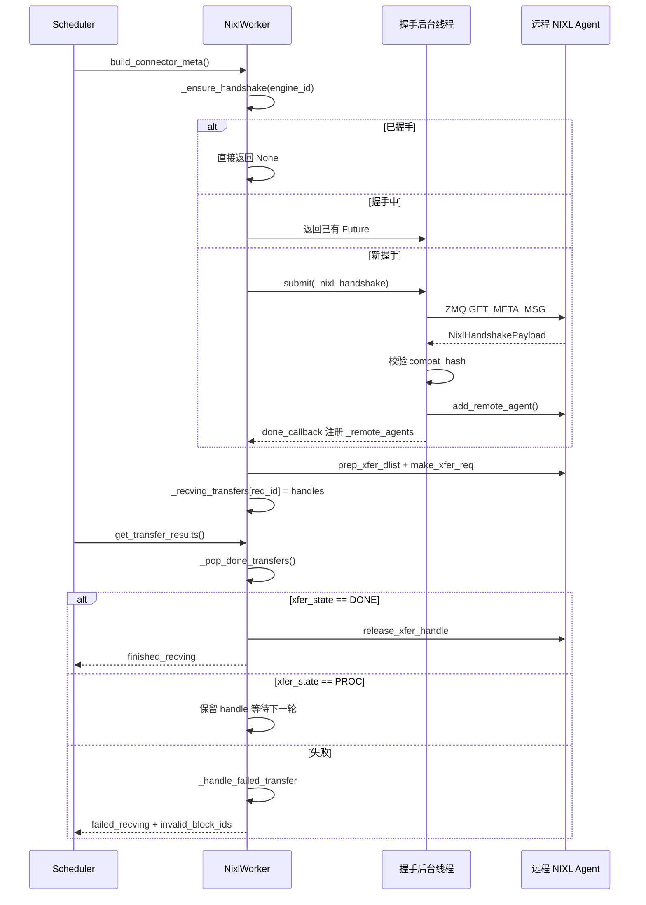

# Chapitre 9 : Transfert de KV Cache et déploiement désagrégé (PD Disaggregation)

Dans le chapitre précédent, nous avons concentré notre attention à l'intérieur d'une seule instance d'inférence : comment les groupes de processus TP/PP/DP/EP sont créés, comment les tenseurs sont découpés entre les cartes, et comment EPLB rééquilibre les experts dans la couche MoE. Mais tous ces mécanismes reposent sur une même prémisse — le prefill et le decode s'exécutent dans la même instance, et le KV Cache reste dans la mémoire locale du début à la fin. Le déploiement désagrégé (Prefill-Decode Disaggregation, en abrégé PD Disaggregation) brise cette prémisse. Il sépare le prefill et le decode en deux instances vLLM indépendantes : l'instance prefill effectue uniquement le calcul forward du prompt, produit le KV Cache puis le transmet à l'instance decode ; l'instance decode utilise ce KV Cache pour poursuivre la génération autorégressive. L'avantage de cette approche est que les ressources peuvent être configurées indépendamment selon les caractéristiques de chaque phase — le prefill est intensif en calcul, adapté à un grand TP et un grand batch ; le decode est intensif en accès mémoire, adapté à un petit batch et à une planification à faible latence. Les deux ne se pénalisent plus mutuellement. Le coût : le KV Cache doit être transféré entre instances. C'est le protagoniste de ce chapitre — le KV Connector. Le commentaire d'en-tête du fichier vllm/distributed/kv_transfer/kv_connector/v1/base.py énumère déjà les primitives essentielles de toute l'abstraction : le côté Scheduler est responsable de lier les métadonnées, de vérifier les hits de cache distant, et de décider s'il faut libérer les blocs de manière asynchrone ; le côté Worker est responsable du chargement et de la sauvegarde effectifs du KV. L'objectif de conception de cette interface est de découpler complètement la logique de planification de haut niveau des backends de transfert de bas niveau (NIXL, Mooncake, MoRIIO). D'un point de vue d'ingénierie, le plus grand risque de la PD Disaggregation n'est pas la lenteur du transfert, mais l'incohérence d'état : l'instance prefill croit que le KV a été envoyé, mais l'instance decode ne l'a pas reçu ; ou l'instance decode libère le bloc prématurément alors que le prefill y écrit encore. Ce chapitre vise précisément à élucider comment ce système de connecteurs utilise des protocoles de handshake, des leases, des heartbeats et des mécanismes de reprise sur échec pour couvrir ces cas limites.

# I. KVConnectorBase_V1 : abstraction à double rôle et contrat de métadonnées

## Modèle intuitif

Le KV Connector est comme un système de livraison entre deux succursales. La succursale Prefill prépare les produits semi-finis (KV Cache), les emballe et les envoie à la succursale Decode pour poursuivre la transformation. Mais un système de livraison ne peut pas se limiter à une seule action d'« expédition » — il a besoin d'un bordereau de transport (metadata) indiquant quoi envoyer et où l'envoyer ; il a besoin d'un mécanisme de signature pour confirmer la réception ; et il a besoin d'un ensemble de règles de timeout pour éviter qu'un colis reste bloqué indéfiniment en occupant un emplacement.

Sans cette abstraction, chaque backend de transfert (NIXL, Mooncake) devrait implémenter sa propre logique de planification, et le Scheduler de vLLM devrait écrire un ensemble de code d'adaptation pour chaque backend. La valeur de KVConnectorBase_V1 est de figer ce contrat.

## Double rôle : côté Scheduler et côté Worker

[FACT:vllm/distributed/kv_transfer/kv_connector/v1/base.py:137-142]définit les deux rôles du connecteur :

```python
class KVConnectorRole(enum.Enum):
    # Connector running in the scheduler process
    SCHEDULER = 0
    # Connector running in the worker process
    WORKER = 1
```

Cette division n'est pas arbitraire. Le processus Scheduler est responsable des décisions de planification globales — quelles requêtes nécessitent un transfert, quand les blocs peuvent être libérés ; le processus Worker est responsable du déplacement effectif des données. Les deux communiquent via`KVConnectorMetadata`.

[FACT:vllm/distributed/kv_transfer/kv_connector/v1/base.py:153-158]définit la classe de base des métadonnées dans la direction Scheduler vers Worker :

```python
class KVConnectorMetadata(ABC):  # noqa: B024
    """Abstract Metadata used to communicate
    Scheduler KVConnector -> Worker KVConnector.
    """
    pass
```

Dans la direction inverse Worker vers Scheduler,[FACT:vllm/distributed/kv_transfer/kv_connector/v1/base.py:161-176]définit`KVConnectorWorkerMetadata`, qui exige l'implémentation de la méthode`aggregate`— car dans un engine step, plusieurs workers peuvent chacun retourner des métadonnées, qui doivent être agrégées avant d'être transmises au Scheduler.

## Structure de données essentielle : KVConnectorTransferResults

[FACT:vllm/distributed/kv_transfer/kv_connector/v1/base.py:87-96]définit la structure instantanée des résultats de transfert :

```python
@dataclass
class KVConnectorTransferResults:
    finished_sending: set[str] = field(default_factory=set)
    finished_recving: set[str] = field(default_factory=set)
    failed_recving: set[str] = field(default_factory=set)
```

Notez la conception clé dans les commentaires :**Les réceptions échouées apparaissent également dans`finished_recving`**. Ceci permet au Scheduler de libérer les requêtes de l'état « en attente de transfert » — même si le transfert échoue, la requête ne doit pas rester bloquée indéfiniment. Les informations d'échec sont transmises séparément via`failed_recving`, et le Scheduler décide en conséquence de réessayer ou de dégrader.

## Hooks de cycle de vie : de la requête à la libération

Le cycle de vie complet du connecteur s'articule autour de quelques hooks clés. Côté Scheduler :

- `get_num_new_matched_tokens` [FACT:vllm/distributed/kv_transfer/kv_connector/v1/base.py:485-518]: interroge combien de tokens le cache distant peut couvrir. Le commentaire souligne particulièrement qu'« il ne faut considérer que le plus grand préfixe réellement disponible » ; si certains tokens sont inaccessibles en raison de problèmes de connexion ou d'éviction, ils ne doivent pas être comptés.
- `update_state_after_alloc` [FACT:vllm/distributed/kv_transfer/kv_connector/v1/base.py:520-544]: met à jour l'état après l'allocation des blocs. Le commentaire signale un piège courant — pour déterminer s'il faut charger, il faut examiner`num_external_tokens`, et non si`blocks`est vide, car les sous-connecteurs non sélectionnés de MultiConnector reçoivent également de vrais blocs.
- `request_finished` [FACT:vllm/distributed/kv_transfer/kv_connector/v1/base.py:579-598]: appelé à la fin de la requête, retourne`True`pour indiquer que le connecteur prend en charge la libération asynchrone des blocs.

Côté Worker :

- `start_load_kv` / `wait_for_layer_load`: chargement couche par couche, compatible avec le pipeline.
- `save_kv_layer` / `wait_for_save`: sauvegarde couche par couche.
- `get_transfer_results` [FACT:vllm/distributed/kv_transfer/kv_connector/v1/base.py:396-397]: retourne l'état d'achèvement du transfert asynchrone.

[FACT:vllm/distributed/kv_transfer/kv_connector/v1/base.py:192-201]Il existe également une conception facile à négliger mais cruciale —`requires_kv_delivery`la propriété :

```python
@property
def requires_kv_delivery(self) -> bool:
    """Whether this connector hands off KV that must be reliably delivered.
    ...
    """
    return self._kv_transfer_config.is_kv_producer
```

Le commentaire explique la motivation : si une requête est préemptée avant que la passation KV ne soit terminée, il faut recalculer plutôt que de la laisser se terminer et transférer des blocs déjà libérés par la préemption. Seul le rôle producer nécessite une livraison fiable ; un cache best-effort perdu ne représente qu'un futur cache miss.

## Métadonnées de handshake

[FACT:vllm/distributed/kv_transfer/kv_connector/v1/base.py:145-150]définit la classe de base des métadonnées de handshake :

```python
class KVConnectorHandshakeMetadata(ABC):  # noqa: B024
    """Metadata used for out of band connector handshake between
    P/D workers. This needs to serializable.
    """
    pass
```

« out of band » signifie que le handshake ne passe pas par le chemin de requête normal, mais communique directement entre les workers P/D. Cela prépare le terrain pour le protocole de handshake ZMQ de NIXL.

---

# II. Connecteur NIXL : handshake, enregistrement et construction de descripteurs

## Modèle intuitif

NIXL (NVIDIA Inference Xfer Library) est une bibliothèque de transport bas niveau fournie par NVIDIA, prenant en charge plusieurs backends tels qu'UCX, GDS, etc. Le rôle de NixlBaseConnectorWorker s'apparente à un centre de tri d'une société de livraison — il doit d'abord établir une ligne dédiée avec le centre de tri distant (handshake), enregistrer la disposition de ses propres rayonnages (enregistrer les régions mémoire du KV Cache), puis seulement ensuite il peut retirer et expédier efficacement les marchandises par adresse.

Sans ce mécanisme, chaque transfert devrait renégocier les adresses et rétablir les connexions, et la latence deviendrait inacceptable.

## Disposition mémoire : Region et Descriptor

Les concepts fondamentaux de NIXL sont**region**(région mémoire) et**descriptor**(descripteur). Chaque couche de KV Cache est enregistrée dans NIXL comme une ou plusieurs regions, chaque region ayant une adresse de base, une longueur de bloc et un pas de bloc.

[FACT:vllm/distributed/kv_transfer/kv_connector/v1/nixl/base_worker.py:740-751]énumère les champs fondamentaux liés aux regions :

```python
# Number of NIXL regions. Currently one region per cache
# (so 1 per layer for MLA, otherwise 2 per layer)
self.num_regions = 0
self.region_mem_types: list[str] = []
self.region_group_ids: list[int] = []
self._uses_region_group_mapping = False
self.region_names: list[str] = []
self.region_num_blocks: list[int] = []
self._mixed_mem_types = False
```

[FACT:vllm/distributed/kv_transfer/kv_connector/v1/nixl/base_worker.py:897-900]précise davantage l'origine du pas de bloc :

```python
# Per-region block stride in bytes. Taken from the registered tensor's
# stride(0) so it stays correct under layouts that interleave layers
# within a block (BLHNC/BHLNC), where stride > block_len.
self.block_stride_per_layer = list[int]()
```

L'observation clé ici est la suivante :**block_stride n'est pas égal à block_len**. Dans les dispositions entrelacées entre couches telles que BLHNC/BHLNC, l'étendue réelle d'un bloc peut être supérieure à sa longueur de données utiles. Si l'on utilise directement block_len comme pas, on lira des adresses erronées.

## Protocole de handshake : ZMQ + hash de compatibilité

Le handshake est la partie la plus complexe du connecteur NIXL.[FACT:vllm/distributed/kv_transfer/kv_connector/v1/nixl/base_worker.py:974-1128]La méthode`_nixl_handshake`de

illustre l'intégralité de ce processus.[FACT:vllm/distributed/kv_transfer/kv_connector/v1/nixl/base_worker.py:988-998]La première étape consiste à définir le contexte du périphérique CUDA.

```python
# the first time we connect to a remote agent.
# be careful, the handshake happens in a background thread.
# it does not have an active cuda context until any cuda runtime
# call is made. when UCX fails to find a valid cuda context, it will
# disable any cuda ipc communication, essentially disabling any NVLink
# communication.
if not self.use_host_buffer:
    current_platform.set_device(self.device_id)
```

en explique la raison :

Copier[FACT:vllm/distributed/kv_transfer/kv_connector/v1/nixl/base_worker.py:1029-1036]：

```python
msg = msgspec.msgpack.encode(
    (GET_META_MSG, remote_pp_rank, remote_rank)
)
# Set receive timeout to 5 seconds to avoid hanging on dead server
sock.setsockopt(zmq.RCVTIMEO, 5000)  # milliseconds
start_time = time.perf_counter()
sock.send(msg)
reply_parts = sock.recv_multipart()
```

La deuxième étape consiste à envoyer une requête de métadonnées via ZMQ.[FACT:vllm/distributed/kv_transfer/kv_connector/v1/nixl/base_worker.py:1042-1045]Copier

Le timeout de 5 secondes évite une attente infinie si le pair est mort. Par ailleurs, le code estime le décalage d'horloge via le RTT[FACT:vllm/distributed/kv_transfer/kv_connector/v1/nixl/base_worker.py:1063-1080]：

```python
assert self.compat_hash is not None
if (
    self.enforce_compat_hash
    and handshake_payload.compatibility_hash != self.compat_hash
):
    raise RuntimeError(
        f"NIXL compatibility hash mismatch. "
        ...
    )
```

La troisième étape est la vérification de compatibilité.[FACT:vllm/distributed/kv_transfer/kv_connector/v1/nixl/base_worker.py:1372-1376]Copier

```python
self.compat_hash = compute_nixl_compatibility_hash(
    self.vllm_config,
    self.backend_name,
    transfer_mode=self._TRANSFER_MODE,
)
```

:`transfer_mode`Copier[FACT:vllm/distributed/kv_transfer/kv_connector/v1/nixl/base_worker.py:163-166]Notons que

## participe également au hash —

Le commentaire de[FACT:vllm/distributed/kv_transfer/kv_connector/v1/nixl/base_worker.py:824-835]：

```python
self._handshake_initiation_executor = ThreadPoolExecutor(
    # NIXL is not guaranteed to be thread-safe, limit 1 worker.
    max_workers=1,
    thread_name_prefix="vllm-nixl-handshake-initiator",
)
self._ready_requests = queue.Queue[tuple[ReqId, ReqMeta]]()
self._handshake_futures: dict[
    EngineId, Future[tuple[dict[tuple[int, int], str], float]]
] = {}
# Protects _handshake_futures and _remote_agents.
self._handshake_lock = threading.RLock()
```

`max_workers=1`Planification asynchrone du handshake`_handshake_lock`Le handshake est asynchrone et s'exécute via un pool de threads.`_handshake_futures`Copier`_remote_agents`car NIXL ne garantit pas la sûreté des threads.

`_ensure_handshake` [FACT:vllm/distributed/kv_transfer/kv_connector/v1/nixl/base_worker.py:1257-1317]protège les deux dictionnaires

## et

.[FACT:vllm/distributed/kv_transfer/kv_connector/v1/nixl/base_worker.py:172-310]implémente un lancement de handshake idempotent : si le handshake a déjà réussi, retourne None directement ; s'il est en cours, retourne le Future existant ; sinon, soumet une nouvelle tâche et enregistre un callback.`_compute_desc_ids`Construction des descripteurs : du block ID au NIXL descriptor

Une fois le handshake terminé, il faut construire des descripteurs pour chaque requête.[FACT:vllm/distributed/kv_transfer/kv_connector/v1/nixl/base_worker.py:226-262]La méthode

```python
# NOTE (NickLucche) With HMA, every kv group has the same number of layers
# and layers from different groups share the same kv tensor.
# eg block_ids=[[1, 2], [3]]->blocks [1, 2] need to be
# read across all regions, same for [3], but group0-group1 blocks will
# always differ (different areas). Therefore we can just flatten the
# block_ids and compute the descs ids for all groups at once.
```

en est le cœur.[FACT:vllm/distributed/kv_transfer/kv_connector/v1/nixl/base_worker.py:285-304]：

```python
elif _is_ssm_spec(spec_type):
    # NOTE (NickLucche) SSM and Attention block regions can
    # be exchanged arbitrarily by manager.  Therefore, descs
    # are laid out as:
    #   [descs_fa (all regions) | descs_ssm (all regions)].
    # num_fa_descs offset must be computed per-engine since
    # P and D can have different num_blocks (and thus
    # different FA desc counts).
```

## . Le commentaire explique le traitement dans le scénario HMA :

Copier[FACT:vllm/distributed/kv_transfer/kv_connector/v1/nixl/base_worker.py:2130-2178]Pour les modèles hybrides SSM, la disposition des descripteurs est plus complexe`add_remote_agent`Copier

Lorsque D.world_size > P.world_size, plusieurs workers D lisent différents fragments de KV head depuis le même worker P. La documentation donne un exemple concret : D TP=4, P TP=2, tp_ratio=2. D-Worker0 lit la première moitié des KV heads de P-Worker0, D-Worker1 lit la seconde moitié.

Pour les modèles MLA, le KV Cache est répliqué entre les workers TP, donc rank_offset est toujours 0.

## Lease et heartbeat : empêcher la libération prématurée des blocks

C'est l'un des designs les plus ingénieux du connecteur NIXL. Après que l'instance Prefill a envoyé le KV, elle ne peut pas libérer immédiatement le block — car l'instance decode pourrait encore être en train de lire. Mais si on ne libère jamais, la mémoire GPU fuit.

La solution est le lease.[FACT:vllm/distributed/kv_transfer/kv_connector/v1/nixl/base_worker.py:528-528]：

```python
kv_lease_duration: int = vllm_config.kv_transfer_config.get_from_extra_config(
    "kv_lease_duration", 30
)
# NOTE (NickLucche): For now we use a hardcoded value for a simpler interface.
self._lease_extension = kv_lease_duration * 2 // 3
```

Le lease par défaut est de 30 secondes, prolongé de 20 secondes à chaque heartbeat (2/3).

Le traitement du heartbeat se fait dans[FACT:vllm/distributed/kv_transfer/kv_connector/v1/nixl/base_worker.py:3014-3034]：

```python
def _handle_heartbeat(self, payload: str) -> None:
    new_expiry = time.perf_counter() + self._lease_extension
    for req_id in payload.split(","):
        if req_id in self._reqs_to_send:
            old = self._reqs_to_send[req_id]
            self._reqs_to_send[req_id] = max(old, new_expiry)
```

Attention`max(old, new_expiry)`— le heartbeat ne peut que prolonger le lease, pas le raccourcir.

La récupération après expiration du lease se fait dans[FACT:vllm/distributed/kv_transfer/kv_connector/v1/nixl/base_worker.py:2986-3012]：

```python
def _reap_expired_send_leases(self, done_sending: set[str]) -> None:
    """Reclaim expired send-side KV leases into ``done_sending``.

    ``_reqs_to_send`` is not ordered by expiry: heartbeats update the
    deadline in place, and mixed TTLs share the map, so a live head
    entry can sit in front of already-expired ones. Scan every entry
    rather than stopping at the first still-live request.
    """
```

Le commentaire signale une erreur facile à commettre : on ne peut pas arrêter le scan dès qu'on rencontre la première requête non expirée, car le heartbeat met à jour le délai d'expiration sur place, ce qui fait que la map n'est pas triée par ordre d'expiration.

## Machine à états de transfert et récupération après échec

Le cycle de vie d'un transfert est géré via`_pop_done_transfers` [FACT:vllm/distributed/kv_transfer/kv_connector/v1/nixl/base_worker.py:3036-3086]:

```python
for handle in handles:
    try:
        xfer_state = self.nixl_wrapper.check_xfer_state(handle)
        if xfer_state == "DONE":
            res = self.nixl_wrapper.get_xfer_telemetry(handle)
            self.xfer_stats.record_transfer(res)
            self.nixl_wrapper.release_xfer_handle(handle)
        elif xfer_state == "PROC":
            in_progress.append(handle)
        else:
            self._log_failure(
                failure_type="transfer_failed",
                req_id=req_id,
                xfer_state=xfer_state,
            )
```

Le transfert NIXL a trois états :`DONE`(terminé),`PROC`(en cours), autre (échec).

Le traitement des échecs se fait dans[FACT:vllm/distributed/kv_transfer/kv_connector/v1/nixl/base_worker.py:3103-3127]：

```python
def _handle_failed_transfer(
    self,
    req_id: str,
    handle: int | None,
    failed_req_ids: set[str] | None = None,
    record_failed_transfer: bool = True,
) -> bool:
    if record_failed_transfer:
        self.xfer_stats.record_failed_transfer()
    if failed_req_ids is not None:
        failed_req_ids.add(req_id)
    return handle is None or self._try_release_xfer_handle(req_id, handle)
```

`_try_release_xfer_handle` [FACT:vllm/distributed/kv_transfer/kv_connector/v1/nixl/base_worker.py:3088-3101]Le commentaire de est crucial :

```python
except Exception as e:
    # A status error does not guarantee that the backend stopped DMA.
    self._log_failure(
        failure_type="transfer_release_failed",
        msg="Retaining handle and blocks until release succeeds",
        ...
    )
    return False
```

**Une erreur d'état ne garantit pas que le backend a arrêté le DMA**. Si la libération échoue, il faut conserver le handle et le block jusqu'à ce que la libération réussisse. C'est un design typique de « plutôt fuir que mal utiliser ».

## Traitement des blocks des requêtes en échec

Lorsqu'une réception échoue,[FACT:vllm/distributed/kv_transfer/kv_connector/v1/nixl/base_worker.py:2876-2891]montre la logique de traitement :

```python
for req_id in done_recving:
    meta = self._recving_metadata.pop(req_id, None)
    assert meta is not None, f"{req_id} not found in recving_metadata list"

    # Skip KV sync and post-processing for failed requests
    if req_id in failed_recv_reqs:
        self._pending_recv_notifs.pop(req_id, None)
        # TODO (NickLucche) handle failed transfer for HMA.
        if not self._is_hma_required:
            self._invalid_block_ids.put(set(meta.local_block_ids[0]))
        logger.warning(
            "Skipping KV post-processing for failed request %s",
            req_id,
        )
        continue
```

L'ID du block en échec est placé dans la file`_invalid_block_ids`, le Scheduler le récupère via`get_block_ids_with_load_errors` [FACT:vllm/distributed/kv_transfer/kv_connector/v1/nixl/base_worker.py:3491-3504]et décide s'il faut réessayer.

## Éviction TTL des moteurs distants

Les instances de longue durée rencontrent continuellement de nouveaux moteurs distants ; sans nettoyage, la mémoire croîtrait indéfiniment.[FACT:vllm/distributed/kv_transfer/kv_connector/v1/nixl/base_worker.py:3506-3532]Le de`_evict_stale_engines`implémente l'éviction TTL :

```python
def _evict_stale_engines(self) -> None:
    """Scan for and evict remote engines that have exceeded their TTL.

    Called from the main thread in when a new remote engine appears.
    We can only go OOM as we discover and register a new remote, therefore we make
    sure we clean up stale engine data structures before then.
    """
    if self._engine_ttl  self._engine_ttl and eid not in busy:
            self._cleanup_remote_engine(eid)
```

La contrainte clé est l'ensemble`busy`— les moteurs avec des transferts en cours ne peuvent pas être évincés.[FACT:vllm/distributed/kv_transfer/kv_connector/v1/nixl/base_worker.py:3534-3546]Le commentaire de explique la raison :

```python
"""Remote engines a transfer is still reading from.

The timestamp is stamped when a read is issued and not refreshed while
it runs, so a transfer that outlives the TTL leaves its engine looking
idle. A peer that has lost its NIC holds one indefinitely.
"""
```

Si la carte réseau du pair est défaillante, le transfert peut rester bloqué indéfiniment, le timestamp ne se rafraîchit pas, et le moteur semble inactif.`busy`L'ensemble protège explicitement ce cas.

## Chronologie de la poignée de main et du transfert

Le diagramme de séquence ci-dessous montre les interactions clés depuis la requête jusqu'à la fin du transfert :



---

# III. Réflexions sur le design : pourquoi ce choix

## Pourquoi la poignée de main est-elle asynchrone ?

La poignée de main implique un aller-retour réseau, pouvant prendre plusieurs dizaines de millisecondes. Si elle était exécutée de manière synchrone, elle bloquerait la boucle principale du Scheduler, affectant l'ordonnancement de toutes les requêtes. La poignée de main asynchrone permet au Scheduler de traiter d'abord d'autres requêtes, puis d'être notifié par callback une fois la poignée de main terminée.

Mais l'asynchrone apporte aussi de la complexité :`_handshake_futures`Le dictionnaire doit être protégé par un verrou, le callback doit gérer les cas de succès et d'échec, et il faut aussi éviter les poignées de main en double.

## Pourquoi utiliser un lease plutôt qu'un comptage de références ?

Le comptage de références nécessite que l'instance decode notifie explicitement au prefill « j'ai fini de lire ». Mais si l'instance decode plante, la notification n'arrivera jamais, et le block du prefill fuira pour toujours.

Le lease est une solution plus robuste : même si le decode plante, le prefill récupère automatiquement après expiration du lease. Le mécanisme de heartbeat garantit le renouvellement du lease en conditions normales.

## Pourquoi conserver le handle en cas d'échec ?

[FACT:vllm/distributed/kv_transfer/kv_connector/v1/nixl/base_worker.py:3088-3101]Le commentaire de le dit clairement : une erreur d'état ne garantit pas l'arrêt du DMA. Si on libère le handle à ce moment, le DMA pourrait encore écrire dans la mémoire libérée, causant une corruption de données ou un crash. Plutôt fuir temporairement que prendre ce risque.

## Pourquoi l'éviction TTL doit-elle vérifier busy ?

[FACT:vllm/distributed/kv_transfer/kv_connector/v1/nixl/base_worker.py:3534-3546]Le commentaire de révèle un scénario de bug sournois : le timestamp est posé au lancement de la lecture, et n'est pas rafraîchi pendant la lecture. Si le transfert dépasse le TTL, le moteur semble inactif, mais il est en réalité encore en cours de lecture. Si on l'évince à ce moment, le transfert en cours échouera.

## Pièges en environnement de production

1. **Problème de contexte CUDA**: la poignée de main s'exécute dans un thread d'arrière-plan, il faut explicitement`set_device`, sinon UCX désactivera silencieusement NVLink.

2. **Incompatibilité de hash de compatibilité**: la version vLLM, le modèle, le dtype, le KV layout et l'attention backend des instances P/D doivent être parfaitement identiques. En cas d'incompatibilité, la poignée de main échouera, et le message d'erreur indiquera comment désactiver la vérification (mais ce n'est pas recommandé).

3. **Expiration du lease**: si l'instance decode est très chargée, le heartbeat peut être retardé, entraînant l'expiration du lease. Un avertissement « Releasing expired KV blocks » apparaîtra dans les logs. On peut augmenter`kv_lease_duration`。

4. **Incompatibilité TP**: un TP hétérogène nécessite une disposition block-contiguous (comme LBHNC). Si une disposition non contiguë est utilisée, le TP hétérogène échouera.

5. **Épuisement des UAR NIXL**：[FACT:vllm/distributed/kv_transfer/kv_connector/v1/nixl/base_worker.py:631-636]Avertissement dans les commentaires de : chaque thread UCX alloue des UAR (doorbell pages) via DevX ; une utilisation excessive des UAR par NIXL épuise l'espace UAR de la NIC, ce qui provoque l'échec de NVSHMEM (utilisé par le noyau DeepEP) lors de l'initialisation RDMA.

---

# Résumé de ce chapitre

Ce chapitre a approfondi les mécanismes essentiels du système KV Connector :

1. **KVConnectorBase_V1**définit l'abstraction à double rôle côté Scheduler et côté Worker, via`KVConnectorMetadata`et`KVConnectorTransferResults`pour réaliser l'échange de métadonnées et le retour des résultats de transfert.

2. **Le connecteur NIXL**est l'implémentation la plus mature : il établit la connexion entre les instances P/D via un protocole de handshake ZMQ, utilise un hachage de compatibilité pour éviter les incompatibilités de configuration, et un pool de threads asynchrones pour éviter de bloquer la boucle principale.

3. **Le mécanisme de lease et de heartbeat**résout le problème de timing de la libération des blocs : après l'envoi des KV par le prefill, ceux-ci ne sont pas libérés immédiatement, mais attendent le renouvellement du heartbeat ou l'expiration du lease côté decode.

4. **La récupération après échec**suit le principe « plutôt fuir que mal utiliser » : en cas d'échec de libération, le handle est conservé, et l'ID du bloc en échec est signalé au Scheduler qui décide de réessayer.

5. **L'éviction TTL**empêche la croissance illimitée de l'état des moteurs distants lors d'exécutions prolongées, mais doit protéger les moteurs ayant des transferts en cours.

Dans le prochain chapitre, nous nous tournerons vers une autre direction pour éliminer les surcoûts : l'accélération de compilation et CUDA Graph. Une fois que la séparation PD a résolu le problème d'utilisation des ressources, le coût de lancement d'une seule passe avant devient le nouveau goulot d'étranglement — comment utiliser CUDA Graph pour compresser des centaines voire des milliers de lancements de noyaux en une seule relecture.

# Réflexions et auto-évaluation de ce chapitre

Q1 : Si l'on supprime la gestion des exceptions dans`_try_release_xfer_handle`et que l'on appelle directement`release_xfer_handle`, dans quels scénarios cela entraînerait-il une corruption des données ? Pourquoi ?

**Analyse de référence**：`_try_release_xfer_handle` [FACT:vllm/distributed/kv_transfer/kv_connector/v1/nixl/base_worker.py:3088-3101]Le commentaire de  indique explicitement : « A status error does not guarantee that the backend stopped DMA. » Si l'on supprime la gestion des exceptions, lorsque`release_xfer_handle`lève une exception, l'appelant considère que la libération a réussi et continue à libérer le bloc. Mais en réalité, le DMA du backend NIXL peut encore être en cours, en train d'écrire des données dans cette mémoire. Une fois le bloc réattribué à une autre requête, l'écriture DMA pollue le KV Cache de la nouvelle requête, entraînant un output corrompu ou des NaN. Pire encore, si le bloc est libéré vers le pool de mémoire GPU et réutilisé par d'autres tenseurs, le DMA peut écrire à une adresse invalide et provoquer un crash. La bonne pratique est de conserver le handle et le bloc, et de réessayer la libération lors du prochain`_pop_done_transfers`.

Q2: `_reap_expired_send_leases`Le commentaire de  dit « on ne peut pas arrêter le balayage parce qu'on rencontre la première requête non expirée ». Si l'on modifie le code pour faire un break dès qu'on rencontre une requête non expirée, dans quels scénarios cela déclencherait-il une fuite de blocs ?

**Analyse de référence**：`_reqs_to_send`est un dict ordinaire, pas une file de priorité triée par temps d'expiration. Le traitement des heartbeats`_handle_heartbeat` [FACT:vllm/distributed/kv_transfer/kv_connector/v1/nixl/base_worker.py:3014-3034]met à jour le temps d'expiration sur place :`self._reqs_to_send[req_id] = max(old, new_expiry)`. Cela signifie qu'une requête ajoutée en premier peut avoir un temps d'expiration très tardif grâce à des heartbeats continus, tandis qu'une requête située après elle peut déjà être expirée. Si l'on fait un break dès qu'on rencontre la première requête non expirée, les requêtes expirées suivantes ne seront jamais récupérées, et leurs blocs continueront d'occuper la mémoire GPU. Dans des scénarios d'exécution prolongée avec des motifs de requêtes mixtes (certaines requêtes fréquemment renouvelées par heartbeat, d'autres dont l'instance decode a déjà crashé), cela s'accumule en une grave fuite de mémoire GPU.

Q3: `_evict_stale_engines`utilise`_engines_with_inflight_transfers`pour protéger les moteurs ayant des transferts en cours. Si l'on supprime cette protection, dans quels scénarios de panne réseau cela entraînerait-il un échec de transfert ?

**Analyse de référence**：`_engines_with_inflight_transfers` [FACT:vllm/distributed/kv_transfer/kv_connector/v1/nixl/base_worker.py:3534-3546]Le commentaire de  explique un scénario critique : « The timestamp is stamped when a read is issued and not refreshed while it runs, so a transfer that outlives the TTL leaves its engine looking idle. A peer that has lost its NIC holds one indefinitely. » Supposons que la carte réseau du pair tombe en panne et qu'une opération de lecture NIXL reste suspendue au-delà du TTL (3600 secondes par défaut).`_engine_last_active`Le timestamp est apposé au moment du lancement de la lecture et n'est pas rafraîchi pendant celle-ci, donc le moteur semble inactif. Si à ce moment-là`_evict_stale_engines`évince ce moteur, il appellera`_cleanup_remote_engine`pour libérer`dst_xfer_side_handles`et supprimer le remote agent. Mais le DMA en cours utilise encore ces ressources, et la libération entraînera un échec de transfert voire un crash.`busy`L'ensemble  protège explicitement ce cas, en garantissant que les moteurs ayant des transferts en cours ne soient pas évincés.

À ce stade, nous avons vu comment le KV Connector établit un canal de données fiable entre les instances de prefill et de decode, et comment il préserve la cohérence d'état grâce à des mécanismes de bail, de heartbeat et de reprise après échec. Mais le transfert inter-instances ne représente que la moitié de l'histoire de la séparation PD — une fois le KV Cache arrivé sur l'instance de decode, le moteur d'inférence doit encore exécuter efficacement chaque étape de calcul forward au sein d'une instance unique. Or, la surcharge de planification Python et de lancement des kernels constitue le prochain goulot d'étranglement limitant la latence par étape. Le chapitre suivant se tournera vers l'accélération par compilation et CUDA Graph, pour voir comment vLLM élimine ces surcoûts avec torch.compile et le backend piecewise, et fait coexister harmonieusement CUDA Graph avec les formes de batch dynamiques.
