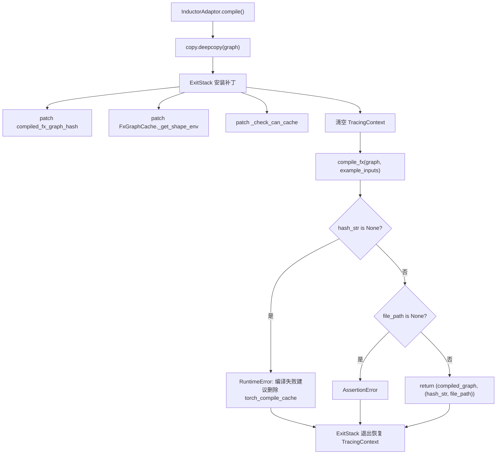
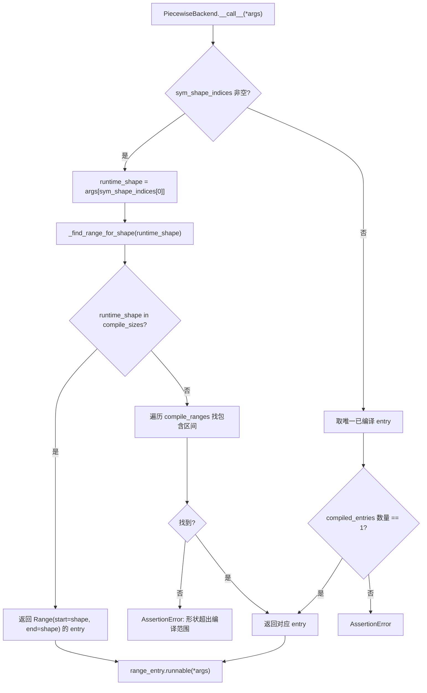

# Chapitre 10 : Accélération par compilation et CUDA Graph : éliminer les surcoûts de lancement et de planification

Dans le chapitre précédent, nous avons vu que le KV Connector, via des connecteurs tels que NIXL et Mooncake, transfère efficacement le KV cache entre les moteurs Prefill et Decode, permettant à l'architecture dissociée de réduire le TTFT tout en améliorant l'utilisation des ressources. Mais même avec un transfert très rapide, le décodage autorégressif conserve deux coûts fixes qu'aucun algorithme ne peut éliminer : la surcharge de planification de l'interpréteur Python et la surcharge de lancement des kernels GPU. Lorsque le forward du modèle est décomposé en centaines d'opérateurs, chacun nécessitant un appel de fonction Python et un lancement de kernel CUDA, la surcharge côté CPU suffit à faire tourner le GPU à vide entre deux calculs. Ce chapitre analyse comment vLLM utilise torch.compile pour fusionner les opérateurs en un graphe statique, puis CUDA Graph pour enregistrer toute la séquence de lancement des kernels en une seule relecture, réduisant ainsi ces deux types de surcoûts à un niveau proche de zéro.

# Cache de compilation et couche d'adaptation du compilateur : permettre la réutilisation des résultats de compilation entre processus

## Modèle intuitif

Le bénéfice de l'accélération par compilation est « compiler une fois, exécuter plusieurs fois », mais le coût est que la première compilation peut prendre plusieurs minutes. Sans cache, chaque redémarrage du service nécessite une recompilation, et le temps de démarrage à froid devient inacceptable.`CompilerInterface`Cette couche résout précisément la question de savoir « comment sérialiser les artefacts de compilation, comment les identifier par hachage, et comment les retrouver précisément au prochain démarrage ». Sans elle, le désastre auquel le système fait face n'est pas un crash, mais une dégradation en « premier lancement » à chaque redémarrage — dans un environnement de production avec auto-scaling, cela signifie que les instances mises à l'échelle ne peuvent pas fournir de service à faible latence pendant plusieurs minutes.

## Structures de données et contrat d'interface

`CompilerInterface`Définit le contrat abstrait de l'adaptateur de compilateur, dont le cœur est constitué de quatre méthodes :`initialize_cache`Responsable de rediriger le répertoire de cache du compilateur lui-même vers le répertoire de cache de vLLM[FACT:vllm/compilation/compiler_interface.py:36-51]；`compute_hash`Collecte les informations de configuration liées au compilateur pour générer un hachage[FACT:vllm/compilation/compiler_interface.py:53-62]；`compile`Exécute la compilation et renvoie un objet appelable ainsi qu'un handle[FACT:vllm/compilation/compiler_interface.py:64-95]；`load`Restaure l'artefact de compilation à partir du handle[FACT:vllm/compilation/compiler_interface.py:97-103]。

La conception clé ici est`compile`Renvoie un tuple de deux éléments`(callable, handle)`。`callable`Est le résultat de compilation directement appelable dans le processus courant ;`handle`Est le justificatif « utilisé pour restaurer au prochain démarrage », et la documentation exige explicitement qu'il soit un « plain Python object, preferably a string or a file path »[FACT:vllm/compilation/compiler_interface.py:81-81]. Cette séparation permet au chemin de succès du cache et au chemin de première compilation d'emprunter des codes totalement différents — en cas de succès, il n'est pas nécessaire de`compile`, il suffit de`load`。

`compile_range`Le paramètre porte la sémantique des formes dynamiques. Le commentaire indique qu'il « could be concrete size (if compile_sizes is provided), e.g. [4, 4] or a range [5, 8] », et que « Right now we only support one variable in ranges for all inputs, which is the batchsize (number of tokens) during inference »[FACT:vllm/compilation/compiler_interface.py:74-74]. C'est la contrainte centrale de la stratégie de compilation de vLLM : toutes les formes dynamiques sont réduites à une variable unique — le nombre de tokens.

## Scénario guidé : le flux complet d'une requête de compilation

Supposons que le service démarre pour la première fois,`InductorAdaptor.compile`Est appelé. Il incrémente d'abord le compteur de compilation[FACT:vllm/compilation/compiler_interface.py:477-489], puis entre dans une pile de patches soigneusement construite.

La première étape est la copie profonde du graphe. Le commentaire indique que « inductor can inplace modify the graph, so we need to copy it »[FACT:vllm/compilation/compiler_interface.py:500-502], c'est une conception défensive — en cas d'échec de compilation, le graphe original reste utilisable pour une nouvelle tentative.

La deuxième étape consiste à installer une série de monkey-patchs.`hijacked_compile_fx_inner`Enveloppe la fonction de compilation interne d'Inductor, et après la compilation, récupère le hachage depuis`inductor_compiled_graph._fx_graph_cache_key`Récupère le hachage[FACT:vllm/compilation/compiler_interface.py:512-536]。`hijack_compiled_fx_graph_hash`Intercepte la fonction de calcul de hachage elle-même[FACT:vllm/compilation/compiler_interface.py:538-542]. Pourquoi « détourner » le hachage ? Parce que vLLM doit compiler séparément en dehors du contexte de traçage de Dynamo, et que le calcul de hachage d'Inductor dépend de ce contexte.

La troisième étape est`_check_can_cache`patch, il retourne directement sans effectuer aucune vérification[FACT:vllm/compilation/compiler_interface.py:544-551]. Le commentaire explique la motivation : « Inductor refuse de mettre en cache le graphe en dehors du contexte de traçage Dynamo, et désactive également la mise en cache pour les graphes avec des opérations d'ordre supérieur. Pour vLLM, dans les deux cas, nous voulons mettre en cache le graphe »[FACT:vllm/compilation/compiler_interface.py:544-551]。

La quatrième étape consiste à nettoyer le contexte de traçage. C'est l'endroit le plus subtil : vLLM appelle`PiecewiseCompileInterpreter`depuis l'intérieur de`compile_fx`, à ce moment le`FakeTensorMode`de Dynamo et le`FakeTensorMode`des entrées du sous-graphe sont incohérents,`detect_fake_mode()`provoquera un échec d'assertion[FACT:vllm/compilation/compiler_interface.py:615-622]. Le code sauvegarde`TracingContext`puis le met à vide, et enregistre un callback pour le restaurer à la sortie[FACT:vllm/compilation/compiler_interface.py:623-630]。

## Réflexion de conception : AlwaysHitShapeEnv et cohérence du cache

`AlwaysHitShapeEnv`Cette classe mérite une analyse séparée. Sa docstring énonce directement la motivation : vLLM n'exécute qu'une seule fois la compilation du bytecode Dynamo, mais doit exécuter plusieurs fois la compilation Inductor avec différentes formes plus une forme générique ; la compilation spécifique à une forme se produit en dehors du contexte Dynamo, où aucun shape environment n'est fourni à Inductor, ce qui entraîne l'échec de la recherche dans le cache de code Inductor[FACT:vllm/compilation/compiler_interface.py:114-131]。

La solution consiste à fournir un faux shape environment qui « touche toujours » :`evaluate_guards_expression`retourne constamment`True` [FACT:vllm/compilation/compiler_interface.py:144-145]，`get_pruned_guards`retourne une liste vide[FACT:vllm/compilation/compiler_interface.py:144-145]，`produce_guards_expression`retourne une chaîne vide[FACT:vllm/compilation/compiler_interface.py:147-159]. Le commentaire admet que ces méthodes sont « obtained by trial-and-error until it works »[FACT:vllm/compilation/compiler_interface.py:137-142]— c'est un point de fragilité couplé à l'implémentation interne de PyTorch, et aussi l'endroit le plus susceptible de poser problème lors de la mise à jour de PyTorch.

La composition du hash de cache est tout aussi cruciale.`get_inductor_factors`collecte trois catégories de facteurs : l'état du système`CacheBase.get_system()`, l'état de PyTorch`torch_key()`, ainsi que la configuration d'Inductor et de functorch[FACT:vllm/compilation/compiler_interface.py:165-185]. Notez que la configuration de functorch est collectée dans le contexte`patch(_get_vllm_functorch_config())`, ce qui garantit que « la configuration à la compilation et la clé de cache sont toujours cohérentes » — le commentaire indique explicitement que c'est pour maintenir la cohérence entre[FACT:vllm/compilation/compiler_interface.py:188-189]et`set_functorch_config()``get_inductor_factors()`. Si ces deux endroits sont incohérents, il se produira un décalage du type « configuration A utilisée à la compilation, clé de cache calculée selon la configuration B », entraînant un chargement d'un artefact erroné malgré un hit de cache.[FACT:vllm/compilation/compiler_interface.py:147-159]Pièges en production :

est un backport pour torch < 2.10.0`_patch_standalone_compile_atomic_save`. Il modifie[FACT:vllm/compilation/compiler_interface.py:205-243]pour utiliser`CompiledArtifact.save()`en écriture au format binaire, le commentaire indiquant que l'objectif est de « preventing corrupt cache files when multiple processes compile concurrently »`write_atomic`. Dans un scénario de démarrage à froid simultané de plusieurs répliques, plusieurs processus écrivent concurremment dans le même fichier de cache ; une écriture non atomique produit un fichier tronqué, et les processus suivants lisant un artefact corrompu auront un comportement imprévisible.[FACT:vllm/compilation/compiler_interface.py:208-210]PiecewiseBackend : compilation par paliers de forme et dispatch à l'exécution

# Modèle intuitif

## est le centre de调度 entre compilation et exécution. Il compile « un sous-graphe FX » en « plusieurs objets appelables par paliers de forme », et sélectionne le plus approprié à l'exécution en fonction du nombre réel de tokens. Sans lui, soit toutes les formes passeraient par une même compilation générique (performance sous-optimale), soit chaque forme serait compilée séparément (explosion du temps de compilation).

`PiecewiseBackend`Structure de données : RangeEntry et plage de compilation

## La structure de données centrale est

, qui lie le flag`RangeEntry`et`compile_range`、`compiled`ensemble`runnable`maintient un[FACT:vllm/compilation/piecewise_backend.py:80-83]。`PiecewiseBackend`La construction de la plage de compilation se fait en deux étapes. D'abord, traiter`range_entries: dict[Range, RangeEntry]` [FACT:vllm/compilation/piecewise_backend.py:166-171]。

(tailles exactes), chaque taille génère un intervalle ponctuel`compile_sizes`de`Range(start=size, end=size)`. Notez qu'ici, pour la chaîne[FACT:vllm/compilation/piecewise_backend.py:166-171], une exception`"cudagraph_capture_sizes"`est directement levée, avec la mention « should be handled in`NotImplementedError`— c'est une déclaration explicite de frontière de responsabilité. Ensuite, traiter`post_init_cudagraph_sizes`" [FACT:vllm/compilation/piecewise_backend.py:166-171](intervalles), chaque intervalle génère une entrée`compile_ranges`supporte deux modes mutuellement exclusifs, le constructeur imposant cela par une assertion XOR[FACT:vllm/compilation/piecewise_backend.py:173-173]。

`PiecewiseBackend`: le mode compilation (avec graph, sans compiled_runnables) passe par[FACT:vllm/compilation/piecewise_backend.py:117-119]; le mode précompilé (sans graph, avec compiled_runnables) passe par`compile_all_ranges()` [FACT:vllm/compilation/piecewise_backend.py:193-194]. Cette conception permet au démarrage à froid et au démarrage à chaud de partager la même classe, seule la source des données diffère.`load_all_ranges()` [FACT:vllm/compilation/piecewise_backend.py:193-194]Pilotage par scénario : de la compilation au dispatch à l'exécution

## Phase de compilation

**parcourt toutes les range entries, et pour chaque entrée non compilée appelle**：`compile_all_ranges`enregistre l'événement de traçage`_log_compile_start`. La branche clé se situe dans la construction des paramètres : s'il s'agit d'une taille ponctuelle, appeler[FACT:vllm/compilation/piecewise_backend.py:252-256]pour générer un FakeTensor de forme concrète`create_concrete_args`; sinon appeler[FACT:vllm/compilation/piecewise_backend.py:258-261]pour réutiliser directement les métadonnées de placeholder du graphe`get_fake_args_from_graph`L'implémentation de[FACT:vllm/compilation/piecewise_backend.py:262-263]。

`create_concrete_args`révèle les détails de la concrétisation des formes symboliques. Il construit un`ShapeEnv`avec`FakeTensorMode` [FACT:vllm/compilation/piecewise_backend.py:54], puis parcourt les nœuds placeholder. Pour les entrées de type`SymInt`, utiliser`concretize`pour remplacer tous les symboles libres par`size` [FACT:vllm/compilation/piecewise_backend.py:47-52]; pour le type`Tensor`, il faut concrétiser simultanément shape, stride, storage_offset, et utiliser`compute_required_storage_length`pour calculer la longueur de stockage requise, puis reconstruire le tenseur via`as_strided`[FACT:vllm/compilation/piecewise_backend.py:64-73]. Pourquoi ne pas simplement modifier la shape ? Parce que stride et storage_offset peuvent aussi contenir des symboles, et les trois doivent être cohérents, sinon`as_strided`provoquera un dépassement de limites.

**Dispatch à l'exécution**：`__call__`est un chemin critique. S'il existe`sym_shape_indices`, extraire la forme d'exécution`args`, puis appeler[FACT:vllm/compilation/piecewise_backend.py:357-362]pour la recherche. La logique de recherche a des priorités : d'abord vérifier si une correspondance exacte avec`_find_range_for_shape`est trouvée, si oui retourner cet intervalle ponctuel`compile_sizes`; sinon parcourir[FACT:vllm/compilation/piecewise_backend.py:342-355]pour trouver l'intervalle contenant cette forme`compile_ranges`Copie[FACT:vllm/compilation/piecewise_backend.py:342-355]。

## 〔Inférence de conception et compromis architecturaux〕

> **[Design Inference & Architectural Trade-offs]**
> `to_bytes`: lorsque pickle rencontre`reducer_override`, il appelle d'abord`CachingAutotuner`puis sérialise`obj.prepare_for_pickle()`. Pourquoi ce hook est-il nécessaire ?[FACT:vllm/compilation/piecewise_backend.py:209-218]détient en interne les artefacts de compilation Triton et l'état d'exécution ; un pickle direct pourrait échouer ou produire des objets non réutilisables ;`CachingAutotuner`convertit évidemment l'objet en une forme purement sérialisable.`prepare_for_pickle`Lors de la sérialisation, on active aussi temporairement

, ce qui fait écho à la logique dans`bundled_autograd_cache` [FACT:vllm/compilation/piecewise_backend.py:222]— lorsque`_get_vllm_functorch_config`n'est pas activé, cette configuration est`VLLM_USE_MEGA_AOT_ARTIFACT`, et lors de la sérialisation elle est forcée à`False` [FACT:vllm/compilation/compiler_interface.py:160-161], garantissant que les artefacts sont empaquetés.`True`est le chemin de démarrage à chaud ; il vérifie que chaque range peut être trouvé dans

`load_all_ranges`avec la clé correspondante, sinon il lève une erreur contenant la liste des clés disponibles`compiled_runnables`. Ce message d'erreur est conçu de manière très pratique — il liste directement les clés disponibles, facilitant le diagnostic des incompatibilités de version de cache.[FACT:vllm/compilation/piecewise_backend.py:329-339]Wrapper CUDA Graph : capture, rejeu et dispatch imbriqué

# Modèle intuitif

## CUDA Graph enregistre « une séquence de lancements de kernels » sous forme d'un graphe statique, puis chaque rejeu ne nécessite qu'un seul appel API.

est l'exécutant de l'enregistrement et du rejeu. Le défi central auquel il fait face est : la taille de batch de vLLM est dynamique, alors que CUDA Graph exige des adresses d'entrée fixes. La solution est « la capture par paliers selon le batch descriptor » — une image est enregistrée par palier de forme, et à l'exécution on consulte la table par descriptor pour rejouer.`CUDAGraphWrapper`Structure de données : CUDAGraphEntry et contrat de dispatch

## détient trois champs clés :

`CUDAGraphEntry`comme clé de dispatch`batch_descriptor`est l'objet graphe capturé[FACT:vllm/compilation/cuda_graph.py:128-135]、`cudagraph`est la sortie au moment de la capture (conservée par référence faible pour économiser la mémoire)[FACT:vllm/compilation/cuda_graph.py:128-135]、`output`utilisé uniquement en mode debug pour vérifier la cohérence des adresses d'entrée lors du rejeu[FACT:vllm/compilation/cuda_graph.py:128-135]。`input_addresses`La documentation de classe décrit précisément le contrat de dispatch : à l'initialisation, allouer un runtime mode (FULL ou PIECEWISE)[FACT:vllm/compilation/cuda_graph.py:128-135]。

`CUDAGraphWrapper`; à l'exécution, recevoir runtime_mode et batch_descriptor depuis le forward context et « blindly trust them »[FACT:vllm/compilation/cuda_graph.py:158-158]; si runtime_mode est NONE ou ne correspond pas, appeler directement[FACT:vllm/compilation/cuda_graph.py:158-158]; sinon exécuter la capture ou le rejeu[FACT:vllm/compilation/cuda_graph.py:158-158]La documentation déclare aussi explicitement une limite : « CUDAGraphWrapper does not store persistent buffers or copy any runtime inputs into that buffers for replay »[FACT:vllm/compilation/cuda_graph.py:158-158]。

. Cela signifie que la gestion des buffers d'entrée est la responsabilité de l'appelant — le wrapper ne s'occupe que du graphe lui-même.[FACT:vllm/compilation/cuda_graph.py:164-164]Scénario guidé : une capture et un rejeu

## Chemin de capture

**: lorsque**est déclenché et que runtime_mode correspond, vérifier d'abord si le forward context est disponible. S'il ne l'est pas (comme le forward de l'encodeur visuel), appeler directement la fonction sous-jacente`__call__`. C'est la branche clé du scénario multimodal — le forward ViT ne passe pas par CUDA Graph.[FACT:vllm/compilation/cuda_graph.py:232-233]Ensuite, prendre

et`batch_descriptor`. Si le mode est NONE ou ne correspond pas, appeler directement`cudagraph_runtime_mode` [FACT:vllm/compilation/cuda_graph.py:242-244]. Cette conception « pas de correspondance, passage direct » permet la coexistence de wrappers imbriqués : le wrapper FULL à l'extérieur, le wrapper PIECEWISE à l'intérieur, un seul étant activé à l'exécution.[FACT:vllm/compilation/cuda_graph.py:246-256]Si le

de l'entry est None, entrer en capture. Appeler d'abord`cudagraph`pour valider la légalité`validate_cudagraph_capturing_enabled()`, puis enregistrer les adresses d'entrée[FACT:vllm/compilation/cuda_graph.py:279], créer[FACT:vllm/compilation/cuda_graph.py:281-284]. Dans le contexte de capture, il y a plusieurs opérations clés. Si`torch.cuda.CUDAGraph()` [FACT:vllm/compilation/cuda_graph.py:285]。

est activé, patcher`gc_disable`et`gc.collect`. Le commentaire explique la raison : en mode piecewise, chaque couche doit capturer un graphe, et des GC répétés rendraient la capture extrêmement lente, donc « only run gc for the first graph, and disable gc for the rest »`torch.accelerator.empty_cache` [FACT:vllm/compilation/cuda_graph.py:288-303]. Ensuite, définir le graph pool id[FACT:vllm/compilation/cuda_graph.py:289-294], et synchroniser le flux de copie de l'offloader[FACT:vllm/compilation/cuda_graph.py:305-308]. La capture réelle s'exécute dans le contexte[FACT:vllm/compilation/cuda_graph.py:310-312]。

`torch.cuda.graph(cudagraph, pool=..., stream=...)`. Après la capture, appeler`self.runnable(*args, **kwargs)` [FACT:vllm/compilation/cuda_graph.py:315-321]pour éviter les erreurs de flux non join`get_offloader().join_after_forward()`. Si[FACT:vllm/compilation/cuda_graph.py:322-326]est activé, convertir l'output en référence faible pour économiser la mémoire`weak_ref_output`. Enfin, l'entry sauvegarde la référence faible de l'output et l'objet graphe[FACT:vllm/compilation/cuda_graph.py:327-334], mais[FACT:vllm/compilation/cuda_graph.py:338-339]retourne l'output original et non la référence faible**— le commentaire souligne que c'est pour permettre à PyTorch de gérer correctement la mémoire pendant la capture**Chemin de rejeu[FACT:vllm/compilation/cuda_graph.py:343-346]。

**: si l'entry a déjà un graphe, en mode debug vérifier la cohérence des adresses d'entrée**, puis synchroniser l'offloader[FACT:vllm/compilation/cuda_graph.py:348-357], appeler[FACT:vllm/compilation/cuda_graph.py:359-361]et retourner`entry.cudagraph.replay()` 并返回 `entry.output` [FACT:vllm/compilation/cuda_graph.py:362-363]。

## Réflexion de conception : pourquoi la sortie doit être une référence faible, tandis que le retour doit être une référence forte

C'est`CUDAGraphWrapper`le point le plus contre-intuitif. Lors de la capture,`output`est géré par le cudagraph pool de PyTorch[FACT:vllm/compilation/cuda_graph.py:320]. Si l'entrée référence fortement la sortie, la mémoire GPU occupée par ce graphe ne pourra jamais être libérée ; mais si on la convertit en référence faible pendant la capture, PyTorch pourrait récupérer la mémoire avant la fin de la capture, entraînant l'échec de celle-ci. Le code utilise donc une référence faible[FACT:vllm/compilation/cuda_graph.py:334]dans le bloc de capture, stocke une référence faible[FACT:vllm/compilation/cuda_graph.py:338]dans l'entrée, mais la valeur de retour de la fonction est une référence forte[FACT:vllm/compilation/cuda_graph.py:346]. Cet « état de triple référence » est un équilibre précis entre sécurité mémoire et efficacité de la mémoire GPU.

Une autre conception notable est`_all_instances`ce`WeakSet` [FACT:vllm/compilation/cuda_graph.py:173-176]. Il permet à`clear_all_graphs`de vider en une seule fois les graphes de tous les wrappers[FACT:vllm/compilation/cuda_graph.py:173-176], pour une récupération d'urgence en cas de tension de mémoire GPU. L'utilisation de`WeakSet`plutôt qu'un ensemble ordinaire vise à ne pas empêcher le wrapper d'être GC——sinon le wrapper lui-même fuiterait.

Pièges en production :`__getattr__`l'implémentation de[FACT:vllm/compilation/cuda_graph.py:211-217]lève, en mode débogage, une erreur contextuelle pour un attribut inexistant`AttributeError`. Cela semble anodin, mais lors du diagnostic de « pourquoi un appel de méthode échoue », pouvoir voir la description sous forme de chaîne du runnable encapsulé par le wrapper est bien plus utile qu'un simple

# Réflexion de conception : découplage entre compilation et CUDA Graph

Le document de conception consigne explicitement la motivation de cette refonte. La compilation piecewise initiale visait à prendre en charge la capture piecewise CUDA Graph, en excluant les opérateurs non compatibles CUDA Graph (principalement attention)[FACT:docs/design/cuda_graphs.md:25]. Par la suite, le support full CUDA Graph a été ajouté, mais « this tight coupling between compilation and cudagraph capture led to an all-or-nothing experience with little flexibility »[FACT:docs/design/cuda_graphs.md:25]。

Après refonte, quatre objectifs : distinguer explicitement les lots prefill/mixed et uniform-decode et les capturer séparément[FACT:docs/design/cuda_graphs.md:25-25]; découpler la logique de capture CUDA Graph de la compilation, afin de « capturing piecewise and full cudagraphs using the same compiled graph »[FACT:docs/design/cuda_graphs.md:25-25]; dispatcher à l'exécution selon la composition du lot[FACT:docs/design/cuda_graphs.md:25-25]; centraliser le contrôle pour réduire la complexité[FACT:docs/design/cuda_graphs.md:25-25]。

`BatchDescriptor`est la structure centrale de la clé de dispatch, contenant`num_tokens`、`num_reqs`、`uniform`、`has_lora`quatre champs[FACT:docs/design/cuda_graphs.md:86-93]。`uniform`Le flag est particulièrement critique——de nombreux backends attention ne supportent full CUDA Graph que lorsque le lot est uniform[FACT:docs/design/cuda_graphs.md:95-95]. Le document annonce aussi que cette structure pourrait être étendue, par exemple en ajoutant`uniform_query_len`pour supporter plusieurs longueurs uniform decode[FACT:docs/design/cuda_graphs.md:95-95]。

La priorité de dispatch est`FULL > PIECEWISE > None`, et si la clé de dispatch n'existe pas, on retombe en mode NONE pour une exécution eager[FACT:docs/design/cuda_graphs.md:112-115]. Cette stratégie de « dégradation plutôt qu'erreur » garantit que toute combinaison de lots peut s'exécuter, seule la performance diffère.

`AttentionCGSupport`l'énumération quantifie la capacité CUDA Graph du backend, avec les valeurs`ALWAYS=3 > UNIFORM_BATCH=2 > UNIFORM_SINGLE_TOKEN_DECODE=1 > NEVER=0` [FACT:docs/design/cuda_graphs.md:153-162]. Les modèles à attention mixte (comme mamba mixer) prennent le minimum des capacités de tous les backends, et dégradent le mode CUDA Graph en conséquence[FACT:docs/design/cuda_graphs.md:173-175]. Cette conception découple « déclaration de capacité » et « sélection de mode »——ajouter un backend ne nécessite que de déclarer sa capacité, la stratégie de dégradation s'applique automatiquement.

# Résumé de ce chapitre

# Réflexions et auto-évaluation de ce chapitre

Q1 : si l'on retire le`_check_can_cache`patch ([FACT:vllm/compilation/compiler_interface.py:544-551]), laissant Inductor décider lui-même de mettre en cache ou non, dans quels scénarios cela entraînerait-il l'invalidation du cache de compilation ? Pourquoi le commentaire dit-il « Inductor refuses to cache the graph outside of Dynamo tracing context » ?

**Analyse de référence**：`_check_can_cache`retourne directement, sans aucune vérification, le commentaire indique qu'Inductor refuse la mise en cache dans deux cas : hors du contexte de traçage Dynamo, et lorsque le graphe contient des opérateurs d'ordre supérieur[FACT:vllm/compilation/compiler_interface.py:544-551]. Le flux de compilation de vLLM se situe précisément hors du contexte Dynamo (`compile_fx`est appelé par`PiecewiseCompileInterpreter`, et le code vide explicitement`TracingContext` [FACT:vllm/compilation/compiler_interface.py:623-625]). Si l'on retire le patch, Inductor jugera « non cachable », recompilant à chaque démarrage, faisant passer le temps de démarrage à froid de quelques secondes à plusieurs minutes. Plus insidieux encore, comme vLLM dépend de`hijacked_compile_fx_inner`pour récupérer`hash_str`, si le chemin de cache est ignoré,`hash_str`pourrait être None, déclenchant le RuntimeError de[FACT:vllm/compilation/compiler_interface.py:640-652]. Cela explique pourquoi le commentaire souligne « vLLM today assumes and requires the monkey-patched functions to get hit »[FACT:vllm/compilation/compiler_interface.py:596-598]。

Q2: `CUDAGraphWrapper`convertit output en référence faible lors de la capture et la stocke dans l'entrée ([FACT:vllm/compilation/cuda_graph.py:338]), mais retourne une référence forte ([FACT:vllm/compilation/cuda_graph.py:346]). Si l'on changeait aussi la valeur de retour en référence faible, dans quels scénarios cela planterait-il ?

**Analyse de référence**: pendant la capture`output`est géré par le cudagraph pool de PyTorch[FACT:vllm/compilation/cuda_graph.py:320]. Si la valeur de retour est une référence faible, l'objet obtenu par l'appelant peut être immédiatement récupéré par le GC après la sortie du bloc de capture — car à ce moment-là, aucune référence forte ne le maintient en vie. PyTorch a besoin que l'output reste vivant pendant la capture pour établir correctement la relation de mappage du pool mémoire ; une fois récupéré, lors du replay ultérieur`entry.output`la référence faible pointée est déjà invalide,`replay()`l'objet retourné après peut avoir été écrasé ou libéré. Le commentaire indique explicitement « we need to return the output, rather than the weak ref of the output, so that pytorch can correctly manage the memory during cuda graph capture »[FACT:vllm/compilation/cuda_graph.py:343-345]. Cette conception est un équilibre précis entre « référence forte pendant la capture, référence faible pendant le stockage ».

Q3 : Dans`PiecewiseBackend._find_range_for_shape`（[FACT:vllm/compilation/piecewise_backend.py:342-355]), la recherche par taille exacte est prioritaire sur la recherche par intervalle. Supposons`compile_sizes=[8]`、`compile_ranges=[Range(1,16)]`, avec un shape=8 à l'exécution, quelle entry sera touchée ? Si l'on inverse la priorité, quelles en seraient les conséquences ?

**Analyse de référence**: La logique actuelle vérifie d'abord`runtime_shape in self.compile_sizes`, et en cas de correspondance retourne`Range(start=8, end=8)`l'entry ponctuelle de[FACT:vllm/compilation/piecewise_backend.py:342-355]. Cette entry est compilée avec`create_concrete_args`, la forme est entièrement concrétisée, le noyau Triton peut effectuer la spécialisation maximale (par exemple`set_inductor_config`les tailles ponctuelles activent`max_autotune` [FACT:vllm/compilation/compiler_interface.py:747-754]). Si l'on inverse la priorité, shape=8 toucherait l'entry de l'intervalle`Range(1,16)`— c'est une version générique compilée avec des formes symboliques, aux performances sous-optimales. Plus grave encore,`compile_sizes`provient généralement de`cudagraph_capture_sizes`, ces tailles sont précisément les paliers que CUDA Graph doit capturer ; si à l'exécution on dispatche vers l'entry générique, le graphe capturé par CUDA Graph et le runnable dispatché seraient incohérents, ce qui pourrait provoquer une incompatibilité de forme lors du replay. La priorité à l'exact n'est donc pas seulement un choix de performance, mais une exigence de correction.

Le chapitre suivant abordera la quantification et les noyaux personnalisés, pour voir comment vLLM intervient dès la phase de chargement des poids pour contrôler la précision, et comment des opérateurs hautement spécialisés transforment réellement les gains de quantification en amélioration du débit.

Ce chapitre a analysé les deux niveaux de mécanisme de l'accélération de compilation de vLLM. Le premier niveau est CompilerInterface et PiecewiseBackend : le premier définit le contrat d'adaptation du compilateur et la stratégie de hachage du cache, en utilisant AlwaysHitShapeEnv pour contourner le problème d'absence de contexte Dynamo ; le second compile un seul sous-graphe FX en plusieurs paliers de forme, et dispatche à l'exécution selon le nombre de tokens. Le second niveau est CUDAGraphWrapper : il capture les CUDA Graph par paliers selon BatchDescriptor, et réalise un dispatch imbriqué via la correspondance du runtime mode, permettant aux modes FULL et PIECEWISE de coexister sur le même graphe compilé. Le découplage des deux est le cœur de cette refonte — les artefacts de compilation peuvent être réutilisés par les deux modes CUDA Graph, et CUDA Graph peut également fonctionner indépendamment de la compilation. Cependant, la compilation et la capture de graphe résolvent les surcoûts d'ordonnancement ; la précision des poids du modèle lui-même et l'efficacité des opérateurs restent une autre ligne d'optimisation. Le chapitre suivant abordera la quantification et les noyaux personnalisés, pour voir comment vLLM analyse les configurations de quantification, effectue la conversion de formats tels que FP8/INT4/AWQ/GPTQ lors du chargement des poids, et exploite davantage les performances matérielles grâce à _custom_ops et aux noyaux Triton.
