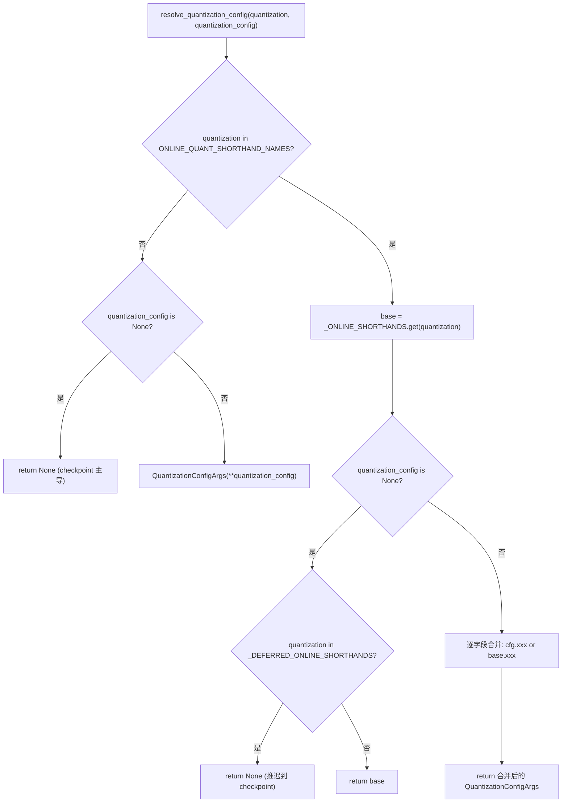
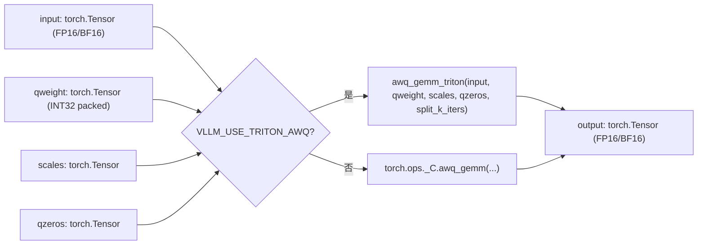
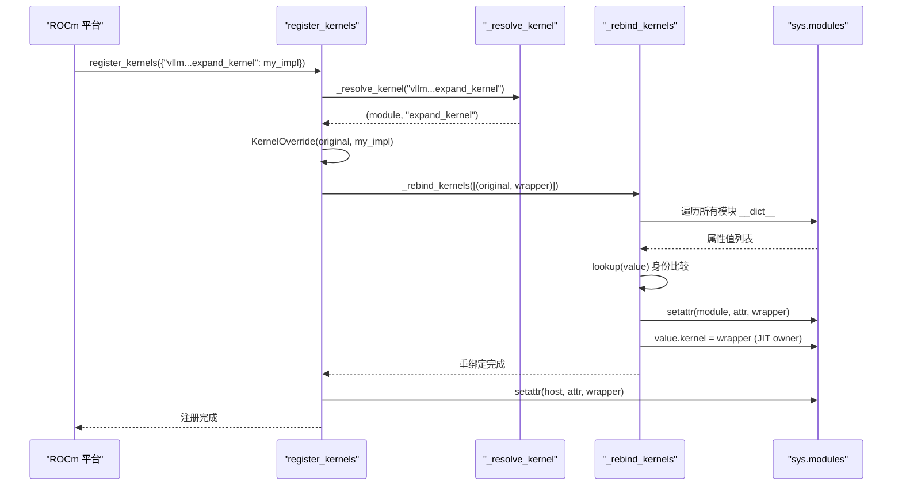

# Chapitre 11 : Quantification et noyaux personnalisés : du chargement des poids aux opérateurs haute performance

Dans le chapitre précédent, nous avons vu que torch.compile et CUDA Graph poussent à l'extrême la réduction des surcoûts d'ordonnancement Python et de lancement de noyaux. Mais peu importe la rapidité de l'ordonnancement, si les poids eux-mêmes sont en FP16 et que la multiplication matricielle utilise un GEMM générique, la puissance de calcul matérielle reste entravée par la bande passante mémoire et les opérateurs inefficaces. La quantification et les noyaux personnalisés constituent une autre ligne d'optimisation orthogonale : la première réduit la précision dès la phase de chargement des poids, la seconde transforme réellement les gains de quantification en débit. Ce chapitre part du point d'entrée de l'analyse de la configuration de quantification, et va jusqu'à l'enregistrement des opérateurs de _custom_ops et l'ordonnancement des noyaux Triton.

# 11.1 Configuration de quantification : de la chaîne CLI à QuantKey

## Modèle intuitif

Le rôle du module de configuration de quantification ressemble à un traducteur de menu dans un restaurant. L'utilisateur dit au comptoir « je veux fp8_per_tensor » (chaîne CLI), tandis que la cuisine a besoin du numéro précis de la recette (`QuantKey`). Le traducteur doit gérer trois types d'entrées : l'abréviation CLI pure, les métadonnées de quantification fournies par le checkpoint, et les scénarios combinés des deux. Sans cette couche de traduction, la cuisine recevrait une série de chaînes ambiguës et ne pourrait pas décider quel kernel appeler.

## Structures de données et disposition mémoire

Les structures de données centrales sont`QuantSpec`et`QuantizationConfigArgs`. La première décrit les clés de quantification des poids et activations d'un type de couche (linear ou MoE), la seconde est la configuration de niveau supérieur visible par l'utilisateur.

[FACT:vllm/config/quantization.py:73-99]

```python
@config
class QuantSpec:
    weight: QuantKeyField = None
    activation: QuantKeyField = None

    def __str__(self) -> str:
        def quant_key_str(quant_key: QuantKey | None) -> str:
            if quant_key is None:
                return "None"
            return next(
                (
                    name
                    for name, known_quant_key in QUANT_KEY_NAMES.items()
                    if known_quant_key == quant_key
                ),
                str(quant_key),
            )
        return quant_key_str(self.weight)
```

`weight`et`activation`sont tous deux optionnels`QuantKey`。`None`La sémantique de  est « revenir aux valeurs par défaut de la classe de méthode elle-même » — généralement héritées du checkpoint ; dans un scénario de quantification en ligne, cela signifie ne pas quantifier[FACT:vllm/config/quantization.py:74-74]。`QuantKey`est en soi un type complexe contenant les déclarations`NamedTuple`et`ClassVar[GroupShape]`, que pydantic ne peut pas introspecter directement ; l'auteur a donc utilisé`GetPydanticSchema`pour injecter un validateur personnalisé`_coerce_quant_key`, qui normalise uniformément les chaînes de caractères ou`QuantKey`[FACT:vllm/config/quantization.py:60-69]。

`QuantizationConfigArgs`La disposition des champs de  mérite attention[FACT:vllm/config/quantization.py:102-126]：

- `linear` / `moe`: ils s'appliquent respectivement aux couches`LinearBase`et`FusedMoEFactory`;
- `ignore`: liste des noms de couches à ignorer pour la quantification ; la quantification en ligne prend également en charge les jokers fnmatch ;
- `targets`: surcharge de quantification en ligne couche par couche ; la clé peut être un nom de couche exact, une expression régulière préfixée par`re:`, ou un motif fnmatch ; la valeur est mutuellement exclusive avec`linear`/`moe`.

`targets`et`linear`/`moe`sont rendus mutuellement exclusifs par`model_validator`qui l'impose[FACT:vllm/config/quantization.py:172-179]. Cette contrainte n'est pas du formalisme :`targets`emprunte le chemin de surcharge couche par couche,`linear`/`moe`emprunte le chemin des valeurs par défaut globales ; si les deux coexistent, il devient indécidable de savoir « quel spec s'applique à une couche donnée ».

## Étape par étape : une résolution de`--quantization fp8_per_tensor`

Mise en situation : l'utilisateur passe en ligne de commande`--quantization fp8_per_tensor`, et spécifie simultanément via`--quantization-config`la quantification d'activation des couches MoE.

Première étape,`resolve_quantization_config`est appelé avec comme arguments la chaîne CLI et le dictionnaire de configuration[FACT:vllm/config/quantization.py:233-235]. Il vérifie d'abord si`quantization`se trouve dans`ONLINE_QUANT_SHORTHAND_NAMES`— ce tuple contient tous les noms abrégés plus un`"online"` [FACT:vllm/config/quantization.py:216-222]。

Deuxième étape,`fp8_per_tensor`correspond à la table des abréviations,`base`est résolu en`_ONLINE_SHORTHANDS["fp8_per_tensor"]`, c'est-à-dire que linear et moe utilisent tous deux`kFp8StaticTensorSym` [FACT:vllm/config/quantization.py:188-190]。

Troisième étape,`quantization_config`est non vide et est construit comme un objet`QuantizationConfigArgs`. On entre ensuite dans la logique de fusion[FACT:vllm/config/quantization.py:267-268]: chaque champ est déterminé par`quantization_config.xxx or base.xxx`— les champs explicitement définis par l'utilisateur sont prioritaires, les champs non définis héritent des valeurs par défaut de l'abréviation. Ici, l'utilisation de`or`plutôt que`if is not None`est intentionnelle :`QuantSpec`et une liste vide sont tous deux falsy ; sémantiquement, « non défini » et « vide » sont équivalents.

Quatrième étape, si`quantization`ne figure pas dans la table des abréviations (par exemple s'il s'agit du`awq`propre au checkpoint), et que`quantization_config`vaut`None`, la fonction retourne directement`None` [FACT:vllm/config/quantization.py:256-257]. Cela signifie « ne pas superposer de quantification en ligne » ; la méthode de quantification du checkpoint reste dominante.

Il existe une branche facile à négliger :`_DEFERRED_ONLINE_SHORTHANDS`contient`mxfp4`et`mxfp8` [FACT:vllm/config/quantization.py:233-235]. Ces deux noms sont à la fois des abréviations CLI et des noms de méthodes de quantification de checkpoint. Lorsque l'utilisateur ne passe que`--quantization mxfp4`sans`quantization_config`, la fonction retourne`None`plutôt que`base` [FACT:vllm/config/quantization.py:267-268], reportant la décision aux métadonnées du checkpoint — ce n'est que lorsque le checkpoint ne contient aucune information de quantification que l'on revient à l'abréviation en ligne.



## Réflexions de conception et pièges

`_coerce_spec`Le validateur gère un scénario subtil : lorsque`linear`ou`moe`reçoit une chaîne de caractères, il consulte d'abord`_ONLINE_SHORTHANDS`; en cas de correspondance, il extrait le spec du champ correspondant ; sinon, il la traite comme un seul nom`QuantKey`[FACT:vllm/config/quantization.py:130-139]. Cela signifie que`linear="fp8_per_tensor"`et`linear="fp8_per_tensor_static"`empruntent deux chemins différents — le premier est une abréviation de configuration complète, le second une clé de quantification unique. Si dans l'abréviation ce champ vaut`None`(par exemple`int8_per_channel_weight_only`n'a pas de champ`linear`), une`ValueError`explicite est levée plutôt qu'un retour silencieux de`None` [FACT:vllm/config/quantization.py:130-139]。

Un piège courant en production :`targets`les clés d'expression régulière de  sont précompilées et validées dans`_validate_targets`[FACT:vllm/config/quantization.py:166-167], mais les clés de motif fnmatch ne sont pas validées. Si l'utilisateur écrit un motif fnmatch qui ne correspondra jamais à aucune couche, aucune erreur n'est signalée ; cette couche reste simplement non quantifiée — lors du diagnostic, il faut vérifier si les noms de couches correspondent réellement.

# 11.2 `_custom_ops`: enregistrement des opérateurs et implémentations fake

## Modèle intuitif

`_custom_ops.py`est la couche d'adaptation entre vLLM et les opérateurs CUDA/C++ sous-jacents, comme une douane. L'espace de noms`torch.ops._C`de PyTorch contient les opérateurs C++ compilés, mais les appeler directement pose trois problèmes : les ensembles d'opérateurs diffèrent selon la plateforme (CUDA/ROCm/CPU/XPU),`torch.compile`nécessite des implémentations fake pour déduire les formes de sortie, et certains opérateurs nécessitent un prétraitement des paramètres côté Python.`_custom_ops`encapsule uniformément ces problèmes.

## Structures de données et mécanisme d'enregistrement

Au chargement du module, on appelle d'abord`current_platform.import_kernels()` [FACT:vllm/_custom_ops.py:25-26], pour donner à la couche plateforme l'occasion d'importer sa propre bibliothèque d'opérateurs. On définit ensuite`register_fake`— sous`TYPE_CHECKING`c'est un décorateur vide ; à l'exécution, on importe depuis`torch.library`[FACT:vllm/_custom_ops.py:25-26]。

Le rôle principal des implémentations fake est de permettre à`torch.compile`de connaître la forme de sortie et le dtype de l'opérateur pendant la phase de traçage, sans l'exécuter réellement. Prenons`scaled_fp4_quant`comme exemple :

[FACT:vllm/_custom_ops.py:90-100]

```python
if hasattr(torch.ops, "_C") and hasattr(torch.ops._C, "scaled_fp4_quant"):

    @register_fake("_C::scaled_fp4_quant")
    def _scaled_fp4_quant_fake(
        input: torch.Tensor,
        input_scale: torch.Tensor,
        is_sf_swizzled_layout: bool,
    ) -> tuple[torch.Tensor, torch.Tensor]:
        n = input.shape[-1]
        m = input.numel() // n
        return create_fp4_output_tensors(m, n, input.device, is_sf_swizzled_layout)
```

Noter la garde`hasattr`: l'implémentation fake n'est définie que si la plateforme a réellement enregistré`_C::scaled_fp4_quant`. Cela garantit que l'import du module sur CPU ou sur un ancien GPU ne plantera pas à cause d'un opérateur manquant.

`create_fp4_output_tensors`illustre les détails de disposition mémoire de la sortie de quantification FP4[FACT:vllm/_custom_ops.py:69-87]. Lorsque`is_sf_swizzled_layout=True`, le tenseur de scale doit être disposé selon les tuiles 128x4 exigées par les Tensor Cores : le nombre de lignes est arrondi au multiple de 128 supérieur, le nombre de colonnes (`n // 16`) est arrondi au multiple de 4 supérieur, et chaque groupe de 4 float8_e4m3 est empaqueté dans un int32[FACT:vllm/_custom_ops.py:55-64]. Le commentaire indique explicitement que le noyau de quantification NVFP4 met explicitement à zéro toutes les entrées de scale de padding, ce qui rend inutile un kernel d'initialisation à zéro séparé[FACT:vllm/_custom_ops.py:60-61]。

## Étape par étape : le flux d'appel d'un GEMM AWQ

Mise en situation : le modèle a chargé des poids quantifiés AWQ ; lors de la propagation avant, il faut effectuer une multiplication matricielle entre les activations et les poids quantifiés.

Première étape, appel de`awq_gemm` [FACT:vllm/_custom_ops.py:587-592]. La fonction vérifie d'abord la variable d'environnement`VLLM_USE_TRITON_AWQ`. Si elle est vraie, elle importe paresseusement`awq_gemm_triton`et l'appelle — c'est un chemin d'implémentation purement Triton, utilisé pour les plateformes ne prenant pas en charge les opérateurs CUDA ou pour le débogage.

Deuxième étape, le chemin par défaut appelle`torch.ops._C.awq_gemm`, en passant input, qweight, scales, qzeros et`split_k_iters` [FACT:vllm/_custom_ops.py:598-598]。

Troisième étape, si`torch.ops._C.awq_gemm`existe, l'implémentation fake est enregistrée[FACT:vllm/_custom_ops.py:601-616]. La forme retournée par fake est`(split_k_iters, num_in_feats, qweight.size(1) * 8)`puis`.sum(0)`— cela simule précisément la forme des résultats intermédiaires du split-K et la forme finale après réduction.`qweight.size(1) * 8`Provient du mode d'empaquetage d'AWQ : chaque int32 stocke 8 poids de 4 bits.

Quatrième étape,`awq_dequantize`suit un chemin similaire[FACT:vllm/_custom_ops.py:553-559], mais l'implémentation fake déduit une forme différente :`out_c = qout_c * 8`, car après déquantification le nombre de colonnes est multiplié par 8[FACT:vllm/_custom_ops.py:587-592]。

La fonction repack de la série Marlin illustre un autre schéma.`gptq_marlin_repack`L'implémentation fake de calcule`pack_factor = 32 // num_bits`, la forme de sortie est`(size_k // 16, size_n * 16 // pack_factor)` [FACT:vllm/_custom_ops.py:1103-1119]. Ici`16`est la taille de tuile Marlin,`size_k // 16`indique que la dimension K est découpée par tuile. La version MoE de`gptq_marlin_moe_repack`appelle en boucle au niveau Python le repack mono-expert pour chaque expert[FACT:vllm/_custom_ops.py:1154-1172], et affirme`size_k % 16 == 0`— c'est une contrainte stricte du format Marlin.



## Réflexions de conception et pièges

L'implémentation fake doit être parfaitement cohérente avec la forme de sortie de l'opérateur réel, sinon`torch.compile`le graphe tracé par présentera des incompatibilités de forme à l'exécution.`create_fp4_output_tensors`Le commentaire de souligne particulièrement « Must match the C++ scaled_fp4_quant_func allocation exactly when padded_n is None »[FACT:vllm/_custom_ops.py:69-74]. C'est un point propice aux erreurs : si le côté C++ modifie la logique d'allocation sans que le fake soit synchronisé, le graphe compilé plantera lors du rejeu du CUDA Graph.

Un autre piège est`torch.library.custom_op`la règle d'alias de .`safeFusedQuantizeNv`Le commentaire de indique que torch 2.12+ n'autorise pas la sortie d'un opérateur personnalisé à aliaser une quelconque entrée, c'est pourquoi l'auteur a transformé le tenseur de retour en paramètre in-place[FACT:vllm/_custom_ops.py:4650-4655]. Cette approche consistant à « modifier la forme de l'API pour contourner les limitations du framework » est courante dans la couche d'adaptation des opérateurs ; lors du diagnostic, il faut vérifier si la déclaration`mutates_args`est cohérente avec le comportement réel.

`CPUDNNLGEMMHandler`présente un autre mode de gestion des ressources : le pointeur de handler est stocké dans un tenseur int64,`__del__`lors de appelle`release_dnnl_matmul_handler`pour libérer[FACT:vllm/_custom_ops.py:3708-3717]. Stocker le pointeur dans un tenseur vise à éviter qu'il soit optimisé par l'inlining des entiers Python — c'est une technique classique de liaison bas niveau.

# 11.3 Planification des kernels Triton :`KernelOverride`et reliaison inter-modules

## Modèle intuitif

Le rôle du planificateur de kernels Triton ressemble à un système de remplacement de postes dans une entreprise. Lorsqu'une plateforme (par exemple ROCm) doit remplacer un kernel Triton du cœur de vLLM par sa propre implémentation, elle ne peut pas modifier directement le code cœur — cela polluerait l'upstream.`dispatcher`permet à une plateforme d'enregistrer un remplaçant, puis remplace discrètement toutes les références pointant vers le kernel original par le remplaçant. Sans ce mécanisme, chaque plateforme devrait maintenir un fork, avec des conflits incessants lors de la fusion des changements upstream.

## Structures de données et disposition mémoire

La structure de données centrale est`_registry`le dictionnaire et`KernelOverride`la classe[FACT:vllm/triton_utils/dispatcher.py:29-36]。

`KernelOverride`les champs clés de[FACT:vllm/triton_utils/dispatcher.py:50-61]：

- `_impl`: fonction d'implémentation de la plateforme ;
- `arg_names`: tuple des noms de paramètres miroir du kernel original, utilisé pour la liaison par mot-clé au lancement ;
- `constexprs`: déclarations constexpr héritées du kernel original ;
- `func`: pointe vers la fonction d'implémentation, pour l'introspection du warmup ;
- `_forward_by_name`: indicateur booléen déterminant si les paramètres sont transmis par mot-clé ou par position au lancement.

`_forward_by_name`La logique de calcul de est : comparer`inspect.signature(impl).parameters`avec le du kernel original`arg_names`pour vérifier s'ils sont parfaitement égaux[FACT:vllm/triton_utils/dispatcher.py:50-61]. Si égaux, cela signifie que les noms de paramètres de l'implémentation correspondent au kernel et la transmission par mot-clé est sûre ; sinon, la transmission doit se faire par position selon l'ordre des paramètres du kernel original.

## Step-by-Step : une`register_kernels`reliaison de

Mise en situation : la plateforme ROCm appelle lors de l'initialisation`register_kernels({"vllm.v1.sample.rejection_sampler.expand_kernel": my_expand_impl})`。

Première étape,`register_kernels`parcourt les overrides, et pour chaque nom appelle`_resolve_kernel` [FACT:vllm/triton_utils/dispatcher.py:162-166]。`_resolve_kernel`pour découper le nom selon le dernier`.`en nom de module et nom d'attribut[FACT:vllm/triton_utils/dispatcher.py:83-94]. Si la première lettre du dernier segment du nom de module est en majuscule, cela signifie que le kernel appartient à une classe (JIT warmup owner) ; il faut d'abord importer le module parent puis`getattr`récupérer la classe, et retourner`(类, 属性名)`; sinon importer le module lui-même et retourner`(模块, 属性名)`。

Deuxième étape, après avoir obtenu l'objet kernel original, construire`KernelOverride`le wrapper, et l'enregistrer dans`_registry` [FACT:vllm/triton_utils/dispatcher.py:167-169]。

Troisième étape,`_rebind_kernels`exécute un balayage de tous les modules[FACT:vllm/triton_utils/dispatcher.py:97-144]. Il parcourt`sys.modules`les de tous les modules dans`__dict__`, et effectue une comparaison d'identité sur chaque valeur d'attribut — attention, c'est`is`et non`==`, car certaines valeurs d'attribut (comme`PlaceholderModule`la sentinelle) déclenchent des imports ou des exceptions lors du hash/eq[FACT:vllm/triton_utils/dispatcher.py:116-123]。

Quatrième étape, pour les attributs correspondant au kernel original, directement`setattr`remplacer par le wrapper[FACT:vllm/triton_utils/dispatcher.py:125-135]. Pour le JIT warmup owner (objet dont l'attribut d'instance`kernel`pointe vers le kernel original), remplacer`value.kernel`et effacer le cache de`_kernel_arg_names`, pour que la liaison au lancement soit redéduite depuis le wrapper[FACT:vllm/triton_utils/dispatcher.py:138-139]。

Cinquième étape,`_rebind_kernels`une fois terminé, remplacer également l'attribut à l'endroit de la définition par le wrapper[FACT:vllm/triton_utils/dispatcher.py:170-174]. Le commentaire explique l'importance de l'ordre : si l'on remplace d'abord l'endroit de la définition, le kernel original ne sera plus trouvable lors du balayage[FACT:vllm/triton_utils/dispatcher.py:170-171]。



## Réflexions de conception et pièges

`KernelOverride.__getitem__`retourne`self._launch`, rendant`kernel[grid](**kwargs)`cette syntaxe de lancement Triton standard transparente pour le wrapper[FACT:vllm/triton_utils/dispatcher.py:63-74]。`_launch`La logique de transmission de se divise en trois cas[FACT:vllm/triton_utils/dispatcher.py:63-74]: s'il y a des arguments positionnels, transmission directe ;`_forward_by_name`si vrai, transmission par mot-clé ; sinon vérifier si kwargs contient des noms de paramètres inconnus du kernel original, si oui lever`RuntimeError`, sinon extraire les valeurs dans l'ordre des paramètres du kernel original et transmettre par position.

Ce`RuntimeError`est une défense importante : si les noms de paramètres implémentés par la plateforme ne correspondent pas à ceux du noyau, et que l'appelant transmet des paramètres que l'implémentation ne reconnaît pas, un ignoré silencieux conduirait à des résultats erronés difficiles à diagnostiquer. Un signalement explicite d'erreur expose le problème dès la phase d'enregistrement.

Un piège en environnement de production :`_rebind_kernels`le balayage est en O(nombre de modules × nombre d'attributs × nombre de noyaux). Pour les grands modèles,`sys.modules`il peut y avoir des milliers de modules, chacun avec des centaines d'attributs. Bien que cela ne s'exécute qu'une seule fois à l'initialisation, si de nombreux noyaux sont enregistrés, le temps de démarrage augmente sensiblement.`lookup`la fonction utilise un balayage linéaire plutôt qu'une recherche par hachage, et le commentaire explique pourquoi — certaines valeurs d'attributs ne sont pas hachables[FACT:vllm/triton_utils/dispatcher.py:116-123]. C'est un compromis typique de « la correction prime sur la performance ».

Un autre piège :`_resolve_kernel`détermine s'il s'agit d'un attribut de classe par « la première lettre du dernier segment du nom de module est en majuscule »[FACT:vllm/triton_utils/dispatcher.py:83-94]. Si un nom de module commence justement par une majuscule (ce qui ne respecte pas les conventions de nommage Python mais est syntaxiquement légal), il sera pris à tort pour une classe. C'est une conception où la convention prime sur la configuration, qui repose sur les normes de nommage internes de vLLM.

# Réflexions sur la conception

Les deux mécanismes que sont la configuration de quantification et l'enregistrement d'opérateurs constituent ensemble la surface de réglage « précision-performance » de vLLM.`QuantizationConfigArgs`la conception reflète la séparation entre « l'intention de l'utilisateur » et « les valeurs par défaut de la méthode » :`None`ce n'est pas « ne pas quantifier », mais « laisser la classe de méthode décider elle-même ». Cette décision différée permet à une même configuration de s'adapter à deux scénarios : la quantification du checkpoint et la quantification en ligne.

`_custom_ops`le mode d'implémentation fake est`torch.compile`un standard de l'écosystème, mais la particularité de vLLM réside dans`hasattr`l'usage généralisé des gardes. Cela permet à un même module d'être importé sans plantage sur CUDA, ROCm, CPU et XPU, au prix de trois emplacements de code par opérateur : le wrapper Python, l'implémentation fake, et la garde de plateforme.

La reliaison inter-modules du dispatcher Triton est une approche radicale. Elle ne repose pas sur les hooks d'import de Python ni sur`__getattr__`, mais scanne et remplace directement toutes les références. L'avantage de cette méthode est son exhaustivité — peu importe`from mod import kernel`combien de fois le noyau est copié, il peut être remplacé ; l'inconvénient est sa fragilité — toute nouvelle façon de détenir une référence au noyau (comme une capture par closure) peut échapper au balayage.

# Résumé de ce chapitre

# Réflexions et auto-évaluation de ce chapitre

Q1 : Dans`resolve_quantization_config`, si l'on supprime la branche`_DEFERRED_ONLINE_SHORTHANDS`(c'est-à-dire lorsque`quantization in _DEFERRED_ONLINE_SHORTHANDS`on retourne`base`au lieu de`None`), que se passe-t-il lors du chargement d'un modèle dont le checkpoint possède son propre`quant_method: "mxfp4"`et où l'utilisateur ne transmet que`--quantization mxfp4`?

**Analyse de référence**：`_DEFERRED_ONLINE_SHORTHANDS`l'intention de conception est de donner la priorité à la méthode de quantification du checkpoint[FACT:vllm/config/quantization.py:233-235]. Si l'on supprime cette branche,`mxfp4`on tombera sur`_ONLINE_SHORTHANDS`et on retournera`base`(c'est-à-dire`QuantSpec(weight=kMxfp4Static)`）[FACT:vllm/config/quantization.py:198-210]. À ce moment, la configuration de quantification en ligne écrasera la méthode de quantification du checkpoint, alors que les poids du checkpoint sont stockés au format`mxfp4`— si le`kMxfp4Static`de la configuration en ligne ne correspond pas exactement au format réel du checkpoint (par exemple une disposition des scales différente), le chargement des poids échouera ou produira des résultats erronés. Un cas plus insidieux : le`mxfp4`du checkpoint peut utiliser un group size ou un scale dtype différents, et les valeurs par défaut de la configuration en ligne ne correspondent pas, entraînant une baisse de précision d'inférence sans erreur signalée.

Q2: `KernelOverride._launch`dans, si`_forward_by_name`vaut`False`et que les kwargs transmis par l'appelant contiennent un nom de paramètre que le noyau d'origine ne reconnaît pas, le code lèvera`RuntimeError`. Si l'on supprime cette vérification pour ignorer silencieusement les paramètres inconnus, dans quel scénario cela conduirait-il à des problèmes difficiles à diagnostiquer ?

**Analyse de référence**：`_forward_by_name`vaut`False`signifie que les noms de paramètres de l'implémentation de plateforme ne correspondent pas à ceux du noyau d'origine, et qu'il faut transmettre par position[FACT:vllm/triton_utils/dispatcher.py:50-61]. Si l'appelant transmet un paramètre que le noyau d'origine ne reconnaît pas (par exemple un nouveau paramètre optionnel ajouté en amont), l'ignoré silencieux entraînera la perte de la valeur de ce paramètre. Dans le cas d'un noyau Triton, cela signifie généralement qu'un constexpr ou une dimension de grid n'est pas transmis, et le noyau peut démarrer avec des valeurs par défaut — le résultat peut être un calcul erroné plutôt qu'un plantage. Comme les résultats erronés d'un noyau Triton se manifestent souvent par des écarts numériques plutôt que par des exceptions, le diagnostic est extrêmement difficile. Un`RuntimeError`explicite expose le problème dès le premier launch[FACT:vllm/triton_utils/dispatcher.py:63-74]。

Q3: `_rebind_kernels`après avoir remplacé la propriété`kernel`du propriétaire du JIT warmup, on exécute`value.__dict__.pop("_kernel_arg_names", None)`. Si l'on supprime cette ligne, dans quel cas cela conduirait-il à une erreur de liaison au launch ?

**Analyse de référence**: le propriétaire du JIT warmup met en cache`_kernel_arg_names`, utilisé au launch pour lier les kwargs aux paramètres du noyau[FACT:vllm/triton_utils/dispatcher.py:138-139]. Après avoir remplacé`kernel`par le wrapper, le`arg_names`du wrapper peut différer de celui du noyau d'origine (si les noms de paramètres de l'implémentation de plateforme diffèrent, le`arg_names`du wrapper reflète toujours le noyau d'origine, mais`_forward_by_name`peut valoir`False`). Si l'on ne vide pas le cache, le mécanisme de warmup continuera d'utiliser l'ancienne liste de noms de paramètres pour la liaison, alors que la logique de launch du wrapper peut attendre une méthode de liaison différente. Concrètement,`KernelOverride._launch`lorsque`_forward_by_name`vaut`False`, extrait les valeurs dans l'ordre`self.arg_names`, et si le[FACT:vllm/triton_utils/dispatcher.py:79-80]mis en cache ne correspond pas au`_kernel_arg_names`du wrapper, l'ordre des paramètres extraits sera erroné, et le noyau recevra des valeurs de paramètres incorrectes.`arg_names`Le chapitre suivant se tournera vers les fonctionnalités d'inférence avancées, pour voir comment le cache de préfixes réutilise les KV blocks, comment le décodage spéculatif accélère les grands modèles avec de petits modèles, et comment LoRA permet de basculer dynamiquement les adaptateurs sans modifier les poids de base.

下一章将转向高级推理特性，看前缀缓存如何复用 KV block、投机解码如何用小模型加速大模型、以及 LoRA 如何在不改基座权重的前提下动态切换适配器。

Ce chapitre analyse les deux couches d'infrastructure de la quantification et des kernels personnalisés de vLLM. La première couche est l'analyse de la configuration de quantification : QuantSpec et QuantizationConfigArgs normalisent uniformément les chaînes CLI, les métadonnées de checkpoint et les surcharges par couche en QuantKey ; resolve_quantization_config gère l'expansion des abréviations et la fusion des champs ; _DEFERRED_ONLINE_SHORTHANDS résout les scénarios de conflit de noms. La seconde couche est l'adaptation des opérateurs : _custom_ops réalise l'enregistrement d'opérateurs multiplateformes via des gardes hasattr et register_fake ; l'implémentation fake reproduit précisément les formes de sortie des opérateurs réels pour prendre en charge torch.compile ; le dispatcher réalise le remplacement multiplateforme des kernels Triton via KernelOverride et un balayage complet des modules. Ensemble, elles soutiennent la concrétisation des gains de quantification, du chargement des poids au calcul forward. Nous nous tournerons ensuite vers les fonctionnalités avancées d'inférence qui améliorent le débit et réduisent la latence : comment le cache de préfixe automatique réutilise les KV entre requêtes, comment le décodage spéculatif accélère la génération avec un modèle draft, et comment LoRA commute dynamiquement les adaptateurs.
