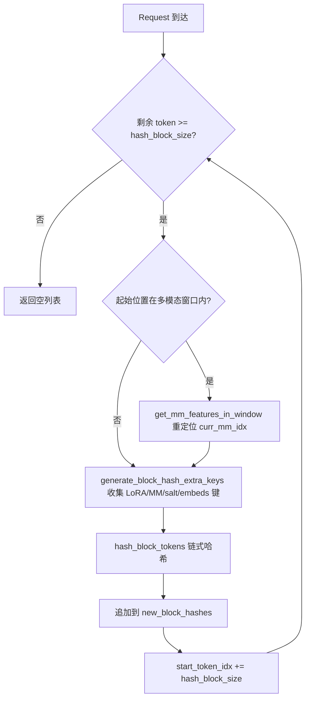
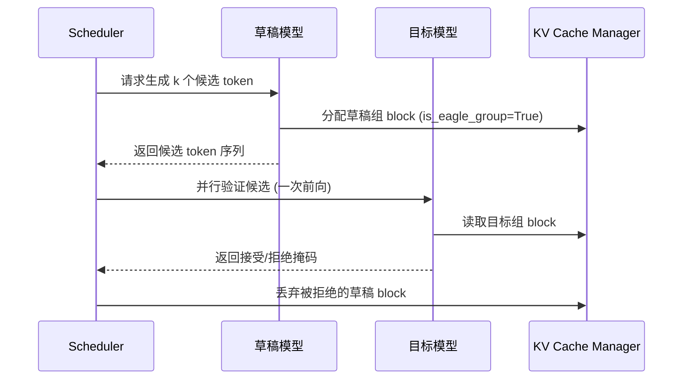

# Chapitre 12 : Fonctionnalités avancées d'inférence : cache de préfixe, décodage spéculatif et LoRA

Dans le chapitre précédent, nous avons approfondi le système de quantification et l'infrastructure d'opérateurs personnalisés de vLLM, en voyant comment la configuration de quantification est analysée et comment les kernels correspondants sont sélectionnés, ainsi que la manière dont les schémas FP8, INT4, AWQ, GPTQ, etc. effectuent la conversion lors du chargement des poids. En parallèle, nous avons élucidé comment _custom_ops enregistre les opérateurs CUDA, le mécanisme d'ordonnancement des kernels Triton, et comment les kernels fusionnés MoE réduisent les allers-retours en mémoire. Ces capacités de bas niveau ouvrent la voie à des optimisations d'inférence plus avancées. Ce chapitre se concentrera sur les trois principales fonctionnalités avancées d'inférence de vLLM : le cache de préfixe automatique (APC), le décodage spéculatif et LoRA. Bien qu'elles semblent indépendantes, elles partagent en réalité la même infrastructure sous-jacente — le hachage des blocs KV, l'allocation de slots par l'ordonnanceur, et l'injection dynamique de poids lors de l'exécution du modèle. La clé pour les comprendre est de comprendre comment elles poussent la « réutilisation » à l'extrême sans briser la sémantique de pagination de PagedAttention.

# 12.1 Cache de préfixe : comment le block hash empreinte une préfixe

## Modèle intuitif

Le cache de préfixe ressemble à un « recueil d'extraits communs » de bibliothèque : deux étudiants rédigent une dissertation, et leurs débuts citent le même passage ancien ; le professeur n'a besoin de corriger ce passage qu'une seule fois, puis examine séparément les parties différentes qui suivent. Sans cela, chaque requête devrait préremplir l'intégralité du prompt depuis le début, et dans les scénarios de questions-réponses sur de longs documents, la puissance de calcul serait consommée plusieurs fois de manière répétée.

## Structure de données : mapping des tokens vers le block hash

Le cœur du cache de préfixe est de « déterminer si deux requêtes ont le même préfixe ». La réponse de vLLM est : découper la séquence de tokens en blocs, et calculer un hachage chaîné pour chaque bloc. Le chaînage signifie que le hachage du N-ième bloc contient le hachage des N-1 blocs précédents ; ainsi, un block hash empreinte de manière unique l'intégralité du préfixe « du début de la séquence jusqu'à la fin de ce bloc ».

Le support du hachage est`BlockHash`, défini comme`bytes`de`NewType`, et non un`bytes`nu, afin d'empêcher au niveau du typage toute utilisation abusive de[FACT:vllm/v1/core/kv_cache_utils.py:59-62]. Lorsqu'il faut combiner le block hash avec le KV cache group id pour former une clé de dictionnaire, vLLM n'utilise pas de tuple, mais concatène directement le group id de 4 octets en big-endian à la fin des octets du hash[FACT:vllm/v1/core/kv_cache_utils.py:75-76]：

```python
def make_block_hash_with_group_id(block_hash, group_id):
    return BlockHashWithGroupId(block_hash + group_id.to_bytes(4, "big", signed=False))
```

> **[Design Inference & Architectural Trade-offs]**
> Il s'agit d'une optimisation typique « pour éviter l'allocation de tuples » : sur le chemin critique, chaque recherche de bloc doit construire une clé ; un tuple entraînerait une allocation supplémentaire d'objets Python et un surcoût de hachage, tandis que la concaténation d'octets s'effectue au niveau C, et la chaîne d'octets elle-même est hachable. Lors de la récupération, on utilise le découpage`key[:-4]`et`int.from_bytes(key[-4:])`pour restaurer[FACT:vllm/v1/core/kv_cache_utils.py:87-89]。

La fonction de hachage elle-même est assurée par`hash_block_tokens`, qui alimente la fonction de hachage avec le hash du bloc parent, le tuple des token id du bloc courant, ainsi que des clés supplémentaires[FACT:vllm/v1/core/kv_cache_utils.py:650-680]. Notez que le hash parent du premier bloc n'est pas`None`, mais le global`NONE_HASH`：

```python
if not parent_block_hash:
    parent_block_hash = NONE_HASH
```

[FACT:vllm/v1/core/kv_cache_utils.py:674-675]。`NONE_HASH`Le choix de la graine de`"vllm-none-hash"`recèle une conception de sécurité : pour les hachages cryptographiques comme SHA-256, la graine est fixe[FACT:vllm/v1/core/kv_cache_utils.py:105-126]。`resolve_none_hash_seed`, ce qui permet à différents processus vLLM de calculer le même hash pour un même contenu, et donc de partager le cache de préfixe entre nœuds ; tandis que pour les hachages non cryptographiques comme xxhash, la graine est aléatoire par processus, car une graine prévisible permettrait à un attaquant de précalculer hors ligne des blocs en collision`PYTHONHASHSEED`implémente cette bifurcation :`os.urandom(32)` [FACT:vllm/v1/core/kv_cache_utils.py:132-145]。

## La variable d'environnement est prioritaire ; sinon, les hachages cryptographiques utilisent une graine fixe et les hachages non cryptographiques utilisent

Supposons qu'une requête arrive avec 128 tokens, avec une taille de bloc de 16.`get_request_block_hasher`La closure retournée est chargée du calcul incrémental[FACT:vllm/v1/core/kv_cache_utils.py:802-861]：

Première étape, déterminer où commencer le calcul.`start_token_idx = len(request.block_hashes) * hash_block_size` [FACT:vllm/v1/core/kv_cache_utils.py:812-812], c'est-à-dire le nombre de blocs déjà calculés multiplié par la taille de bloc. Si les tokens restants ne suffisent pas pour un bloc, retourner directement vide[FACT:vllm/v1/core/kv_cache_utils.py:812-812]。

Deuxième étape, traiter le décalage multimodal. Si la position de départ tombe à l'intérieur d'une entrée multimodale, il faut utiliser`get_mm_features_in_window`pour repositionner`curr_mm_idx` [FACT:vllm/v1/core/kv_cache_utils.py:823-832]. Cela est dû au fait que le token placeholder de l'entrée multimodale ne porte pas de sémantique en lui-même ; il faut incorporer l'identifiant de caractéristique mm et son décalage dans le bloc comme clés supplémentaires dans le hachage.

Troisième étape, calculer chaque bloc en boucle.`generate_block_hash_extra_keys`collecter toutes les clés supplémentaires[FACT:vllm/v1/core/kv_cache_utils.py:611-647], incluant le nom LoRA, les clés multimodales, le cache salt, le hachage des prompt embeds. Le cache salt ne prend effet que dans le premier bloc[FACT:vllm/v1/core/kv_cache_utils.py:633-635], c'est intentionnel : le rôle du salt est d'isoler tout l'espace de nommage du cache, il suffit de l'injecter une fois au point de départ de la chaîne.

Quatrième étape,`hash_block_tokens`hacher ensemble le hash parent, le tuple de tokens et les clés supplémentaires, le résultat servant de hash parent pour le bloc suivant[FACT:vllm/v1/core/kv_cache_utils.py:851-857]. La structure en chaîne se forme ainsi.

## Conversion de granularité multi block size

Lorsqu'un modèle possède plusieurs groupes de KV cache avec des tailles de bloc différentes, la granularité de hachage et la granularité de bloc du groupe peuvent être incohérentes.`BlockHashListWithBlockSize`résout ce problème : il ne recalcule pas le hachage, mais exploite la propriété du hachage en chaîne — le hash d'un target block est le hash de son dernier hash block interne[FACT:vllm/v1/core/kv_cache_utils.py:2781-2851]. Par exemple, avec un hash block de 16 et un target block de 32, le hash des tokens 0-31 est le deuxième hash de taille 16 (qui couvre déjà 0-31 en chaîne)[FACT:vllm/v1/core/kv_cache_utils.py:2794-2806]。`_get_value_at`l'implémentation est`self.block_hashes[(idx + 1) * self.scale_factor - 1]` [FACT:vllm/v1/core/kv_cache_utils.py:2848-2851]。



## Réflexions de conception et pièges rencontrés

**Pourquoi utiliser un hachage en chaîne plutôt qu'un hachage indépendant ?**Le hachage indépendant ne peut pas distinguer le cas où « le même bloc apparaît à différentes positions de préfixe ». Le hachage en chaîne permet au block hash d'empreinter de manière unique tout le préfixe, ce qui est précisément`find_longest_cache_hit`la condition préalable pour réutiliser le KV en toute sécurité.

**Le piège inter-processus du hachage non cryptographique.**Si l'on utilise xxhash sans définir`PYTHONHASHSEED`, le`NONE_HASH`de chaque processus est différent, entraînant une défaillance complète du cache de préfixe inter-instances.`init_none_hash`affichera un avertissement[FACT:vllm/v1/core/kv_cache_utils.py:161-169]. En production, si l'on déploie plusieurs instances partageant un cache, il faut explicitement définir`PYTHONHASHSEED`ou passer à sha256.

**La subtilité du décalage multimodal.** `_gen_mm_extra_hash_keys`utiliser`(mm_identifier, offset - start_token_idx)`comme clé supplémentaire[FACT:vllm/v1/core/kv_cache_utils.py:552]. Le décalage est relatif au début du bloc, ainsi le même élément mm apparaissant à différentes positions de bloc aura un hash différent, évitant les faux positifs.

# 12.2 Décodage spéculatif : synergie entre brouillon et vérification

## Modèle intuitif

Le décodage spéculatif ressemble à un secrétaire qui rédige d'abord plusieurs versions de réponse pour le dirigeant, qui n'a plus qu'à cocher rapidement celle qui convient. Le modèle brouillon (drafter) prédit plusieurs tokens candidats à très faible coût, le modèle cible (target) vérifie ces candidats en parallèle en une seule passe avant, acceptant les parties correspondantes. Sans cela, le modèle cible ne peut générer les tokens qu'en série un par un, et l'utilisation du GPU est extrêmement faible pendant la phase de decode.

## Structure de données : annotation des EAGLE group

Le problème central du décodage spéculatif dans la gestion du KV cache est : comment regrouper les couches KV du modèle brouillon et celles du modèle cible ?`_annotate_eagle_groups`utilise deux règles pour identifier le groupe brouillon[FACT:vllm/v1/core/kv_cache_utils.py:2134-2189]：

Règle un, pilotée par spec :`non_causal_multi_token_decode`le flag est déclaré sur`MLAAttentionSpec`, défini par la couche d'attention brouillon exécutant un décodage multi-token non causal, et peut survivre à l'opération`merge`[FACT:vllm/v1/core/kv_cache_utils.py:2175-2177]。

Règle deux, repli par position : les drafters MTP (comme DeepseekV4/V4.1 DSpark) réutilisent les propres couches decoder du modèle cible, sans marquage sur spec, mais leurs couches d'attention brouillon sont toujours enregistrées après toutes les couches cibles, donc on annote le groupe qui détient la dernière couche enregistrée[FACT:vllm/v1/core/kv_cache_utils.py:2183-2184]. Cette règle ne prend effet que lorsque le groupe partitionne exactement`kv_cache_spec`toutes les couches[FACT:vllm/v1/core/kv_cache_utils.py:2183-2184]。

## Piloté par scénario : allocation KV du décodage spéculatif

Lorsque`speculative_config`est activé et`use_eagle_block_drop()`est vrai,`_annotate_eagle_groups`est appelé[FACT:vllm/v1/core/kv_cache_utils.py:2175-2177]. Le résultat d'annotation`is_eagle_group`influence la stratégie d'allocation de blocs ultérieure — les blocs du groupe brouillon peuvent être jetés après vérification.

Dans`get_kv_cache_groups`du chemin principal, l'annotation se produit après le regroupement[FACT:vllm/v1/core/kv_cache_utils.py:2364-2365]. Si aucun groupe n'est annoté comme groupe brouillon,`_warn_if_unannotated_eagle_mamba`émettra un avertissement[FACT:vllm/v1/core/kv_cache_utils.py:2192-2222]。



## Réflexions de conception et pièges rencontrés

**Pourquoi le groupe brouillon nécessite-t-il une annotation séparée ?**Les tokens générés par le modèle brouillon peuvent être rejetés après vérification, et les KV correspondants doivent être jetés. Si les KV brouillon et les KV cible sont mélangés dans le même groupe, l'opération de rejet endommagerait par erreur les KV cible. L'annotation permet au planificateur de récupérer précisément.

**La fragilité de la règle de repli par position.**La règle deux dépend de la convention « la couche brouillon est enregistrée en dernier », les commentaires indiquent explicitement qu'il s'agit d'un hacky check et laissent un FIXME[FACT:vllm/v1/core/kv_cache_utils.py:2158-2159]. Lorsque le cache de queue du brouillon s'étend sur plusieurs groupes, cette règle n'annote que le groupe détenant la dernière couche, et doit être généralisée.

**Contraintes supplémentaires du modèle Mamba.**Si le décodage spéculatif est activé mais qu'aucun groupe n'est identifié comme groupe brouillon, et qu'un groupe Mamba existe, un avertissement est déclenché[FACT:vllm/v1/core/kv_cache_utils.py:2211-2213]. Cela signifie généralement que le spec de la couche brouillon ne peut pas être distingué de la couche cible, il faut vérifier l'ordre d'enregistrement du modèle.

# 12.3 LoRA : adaptateurs dynamiques sans rechargement du modèle de base

## Modèle intuitif

LoRA, c'est comme changer de coque pour le même téléphone : le corps du téléphone (modèle de base) reste inchangé, on change la coque (adaptateur) et il devient un style différent. Sans cela, chaque tâche de fine-tuning devrait charger une copie complète des poids, ce que la mémoire GPU ne pourrait pas supporter.

## Structure de données : double cache LRU et tableau de slots

`LoRAModelManager`Deux caches LRU gèrent le cycle de vie des adaptateurs[FACT:vllm/lora/model_manager.py:115-120]：

```python
self._registered_adapters: AdapterLRUCache[LoRAModel] = AdapterLRUCache(
    self.capacity, self.deactivate_adapter
)
self._active_adapters: AdapterLRUCache[None] = AdapterLRUCache(
    self.lora_slots, self._deactivate_adapter
)
```

`capacity`est le nombre total d'adaptateurs pouvant être mis en cache côté CPU (`max_cpu_loras`）[FACT:vllm/lora/model_manager.py:340-342]，`lora_slots`est le nombre d'adaptateurs pouvant être activés simultanément côté GPU (`max_loras`）[FACT:vllm/lora/model_manager.py:345-346]。`_registered_adapters`lorsqu'il est retiré, déclenche le rappel`deactivate_adapter`callback[FACT:vllm/lora/model_manager.py:71-74], garantissant que lorsque le cache CPU évince une entrée, la copie sur le GPU est également nettoyée.

`lora_index_to_id`est un tableau de longueur`lora_slots`qui mappe l'index de slot GPU vers l'id d'adaptateur[FACT:vllm/lora/model_manager.py:122]. Ce tableau est l'index central utilisé par le punica wrapper pour le calcul LoRA par lots.

## Piloté par scénario : activation d'adaptateur

Lorsqu'une requête arrive avec un adaptateur LoRA,`activate_adapter`est appelé[FACT:vllm/lora/model_manager.py:352-409]：

Première étape, vérifier s'il est déjà activé, si oui retourner directement[FACT:vllm/lora/model_manager.py:352-354]。

Deuxième étape, chercher un slot libre. Parcourir`lora_index_to_id`pour trouver le premier`None` [FACT:vllm/lora/model_manager.py:362-362]. Si aucun slot libre, lever`ValueError("No free lora slots")` [FACT:vllm/lora/model_manager.py:368-368]。

Troisième étape, mettre à jour l'état et parcourir tous les modules wrappés, appeler`module.set_lora(index, lora_a, lora_b)`pour copier les poids dans le stacked buffer du GPU[FACT:vllm/lora/model_manager.py:377-401]. Si un module n'a pas de poids LoRA correspondant, appeler`reset_lora(index)`pour remettre à zéro[FACT:vllm/lora/model_manager.py:378-385]。

Quatrième étape, si aucun poids n'a été appliqué, imprimer un log de débogage unique[FACT:vllm/lora/model_manager.py:411-416]. C'est le comportement attendu en pipeline parallèle ou expert parallèle — certains ranks ne détiennent pas les couches adaptées.

## Wrapping de module : de nn.Linear à BaseLayerWithLoRA

`_create_lora_modules`parcourt tous les modules nommés du modèle[FACT:vllm/lora/model_manager.py:462-606]. Logique clé :

- Ignorer`PPMissingLayer` [FACT:vllm/lora/model_manager.py:473-474]。
- Filtrer selon`target_modules`: si non spécifié, utiliser`is_supported_lora_module`pour juger, sinon utiliser`_match_target_modules` [FACT:vllm/lora/model_manager.py:479-493]。
- Gérer les modules alias : un même module sous-jacent peut être accédé via plusieurs chemins (par exemple le gate MoE est à la fois sur le block et dans le runner). Dans ce cas, rediriger la propriété alias vers le même wrapper, mais sans réenregistrer, sinon`activate_adapter`appellerait`reset_lora`sur l'alias et effacerait les poids tout juste définis[FACT:vllm/lora/model_manager.py:512-527]。
- Utiliser`from_layer`pour créer le wrapper et remplacer le module original[FACT:vllm/lora/model_manager.py:546-553]。

## Réflexions de conception et pièges

**Un changement de disposition des slots déclenche une mise à jour du mapping.** `set_adapter_mapping`ne compare pas seulement si le mapping a changé, mais aussi le snapshot de tuple de`lora_index_to_id`[FACT:vllm/lora/model_manager.py:1323-1331]. La raison est clairement indiquée en commentaire : un`add_lora()`hors bande peut déclencher une éviction LRU et réattribuer un slot, alors que le batch en cours d'exécution et son mapping n'ont pas changé[FACT:vllm/lora/model_manager.py:1323-1331]. Si l'on ne regarde que le mapping, les métadonnées punica utiliseraient une disposition de slots obsolète.

**Découpage EP de MoE.**Lorsque le parallélisme expert est activé, le checkpoint détient les poids de tous les experts globaux, mais chaque rank ne possède que`local_num_experts`.`_stack_moe_lora_weights`d'abord selon`global_num_experts`reshape, puis découper`[expert_start:expert_end]` [FACT:vllm/lora/model_manager.py:966-977]. Hors EP, le découpage est un no-op.

**Timing de pin_memory.**L'empaquetage des poids (comme`pack_moe`) peut invalider l'allocation pin_memory, donc pin_memory est exécuté après la fusion de tous les poids[FACT:vllm/lora/model_manager.py:916-934]. Le commentaire indique explicitement deux raisons : le nombre élevé de poids LoRA dans les modèles MoE rend le pin prématuré coûteux ; l'empaquetage peut invalider l'allocation[FACT:vllm/lora/model_manager.py:916-921]。

# Réflexion de conception : le point de convergence des trois

Les trois fonctionnalités convergent au niveau de la gestion du KV cache. Le cache de préfixe réutilise le KV via le block hash ; le décodage spéculatif utilise`is_eagle_group`pour marquer et distinguer le KV brouillon ; LoRA utilise`_gen_lora_extra_hash_keys`pour intégrer le nom de l'adaptateur dans le block hash[FACT:vllm/v1/core/kv_cache_utils.py:568-581], garantissant que des séquences de tokens identiques avec des adaptateurs différents ne se trompent pas de KV.

`generate_block_hash_extra_keys`place la clé LoRA en tête de la liste de clés supplémentaires[FACT:vllm/v1/core/kv_cache_utils.py:640-642], formant avec les clés multimodales, le cache salt et les clés prompt embeds l'entrée de hachage complète. Cela garantit que même si deux requêtes ont des tokens identiques, tant que leurs adaptateurs LoRA diffèrent, leurs block hash diffèrent et les KV ne sont pas mélangés.

# Résumé du chapitre

# Réflexions et auto-évaluation du chapitre

Q1 : Si l'on supprime la logique de graine aléatoire du hachage non cryptographique dans`init_none_hash`et qu'on utilise toujours une graine fixe, dans quels scénarios cela introduirait-il un risque de sécurité ? Pourquoi le commentaire source insiste-t-il particulièrement sur le fait que xxhash nécessite une graine secrète ?

**Analyse de référence**: le code source dans`_NON_CRYPTO_HASH_FUNCTIONS`liste explicitement xxhash et xxhash_cbor comme algorithmes non résistants aux collisions[FACT:vllm/v1/core/kv_cache_utils.py:125-126]。`resolve_none_hash_seed`retourne`os.urandom(32).hex()` [FACT:vllm/v1/core/kv_cache_utils.py:143-144]pour ce type d'algorithmes. Si l'on passait à une graine fixe, un attaquant pourrait précalculer hors ligne des blocks en collision avec le préfixe cible, construire des requêtes avec le même hash mais un contenu différent, et ainsi atteindre et lire le KV cache d'autrui — c'est une fuite d'informations entre requêtes. La résistance aux collisions de SHA-256 ne dépend pas du secret de la graine, donc une graine fixe n'affecte que la reproductibilité, pas la sécurité[FACT:vllm/v1/core/kv_cache_utils.py:97-111]。

Q2: `_create_lora_modules`lors du traitement des modules alias, si l'on supprime la logique « ne pas réenregistrer » et qu'on appelle directement`register_module`aussi sur l'alias, dans`activate_adapter`que se passe-t-il ? Veuillez analyser en combinant`reset_lora`le chemin d'appel de

**Analyse de référence**：`activate_adapter`parcourt`self.modules`et appelle pour chaque module`set_lora`ou`reset_lora` [FACT:vllm/lora/model_manager.py:377-401]. Si l'alias et le nom canonique sont tous deux enregistrés, le même wrapper sous-jacent sera accédé deux fois. Sous le chemin du nom canonique,`_get_lora_layer_weights`peut trouver les poids et appeler`set_lora`pour écrire ; sous le chemin de l'alias, en raison de la non-concordance des noms,`_get_lora_layer_weights`renvoie None, déclenchant`reset_lora(index)` [FACT:vllm/lora/model_manager.py:378-385], ce qui remet à zéro les poids qui viennent d'être écrits. Les commentaires du code source signalent explicitement ce piège[FACT:vllm/lora/model_manager.py:519-523]. La bonne pratique consiste à rediriger l'attribut d'alias vers le même wrapper sans réenregistrer[FACT:vllm/lora/model_manager.py:531-537]。

Q3: `BlockHashListWithBlockSize`dépend de la propriété selon laquelle « le hachage du target block est égal au hachage de son dernier hash block interne ». Si la fonction de hachage n'est pas chaînée (c'est-à-dire que chaque block est haché indépendamment), cette classe peut-elle encore fonctionner correctement ? Dans quels cas produirait-elle des hits de cache erronés ?

**Analyse de référence**: Non.`_get_value_at`renvoie directement`self.block_hashes[(idx + 1) * self.scale_factor - 1]` [FACT:vllm/v1/core/kv_cache_utils.py:2848-2851], ce qui suppose que le hachage du dernier hash block couvre déjà en chaîne tous les tokens qui le précèdent. Si les hachages sont indépendants, cette valeur n'empreinte que le contenu du dernier hash block, et non l'ensemble du target block. Deux target blocks peuvent différer dans leur première partie mais avoir le même dernier hash block, provoquant une collision de hachage,`find_longest_cache_hit`réutiliserait à tort un KV non correspondant. Les commentaires du code source indiquent explicitement « Each hash_block_size hash is already chained over its entire prefix »[FACT:vllm/v1/core/kv_cache_utils.py:2787-2792]。

Le chapitre suivant se tournera vers le système de plugins et l'extensibilité, pour voir comment vLLM prend en charge des formes de déploiement diversifiées via l'abstraction de plateforme, les processeurs IO et l'extension d'endpoints.

Ce chapitre analyse les mécanismes sous-jacents des trois principales fonctionnalités avancées d'inférence de vLLM. Le cœur du cache de préfixe est le hachage de block chaîné : hash_block_tokens hache ensemble le hachage parent, le tuple de tokens et les clés supplémentaires, et la stratégie de graine NONE_HASH arbitre entre partage inter-processus et sécurité contre les collisions. Le décodage spéculatif distingue les groupes KV de brouillon via l'annotation is_eagle_group. LoRA gère le cycle de vie des adaptateurs via un double cache LRU et un tableau de slots, et intègre le nom de l'adaptateur dans le block hash pour isoler le cache. Ces fonctionnalités illustrent ensemble la profondeur et la flexibilité de vLLM en matière d'optimisation d'inférence. Ensuite, nous nous tournerons vers le système de plugins et l'extensibilité de vLLM, pour voir comment les plugins de plateforme s'adaptent aux nouveaux matériels, comment les plugins IO processor interviennent dans le traitement des entrées multimodales, et comment les plugins d'endpoints injectent des routes API personnalisées. Comprendre l'ordre de chargement de l'enregistrement et de la découverte des plugins révélera comment étendre les capacités de vLLM sans modifier le code cœur.
