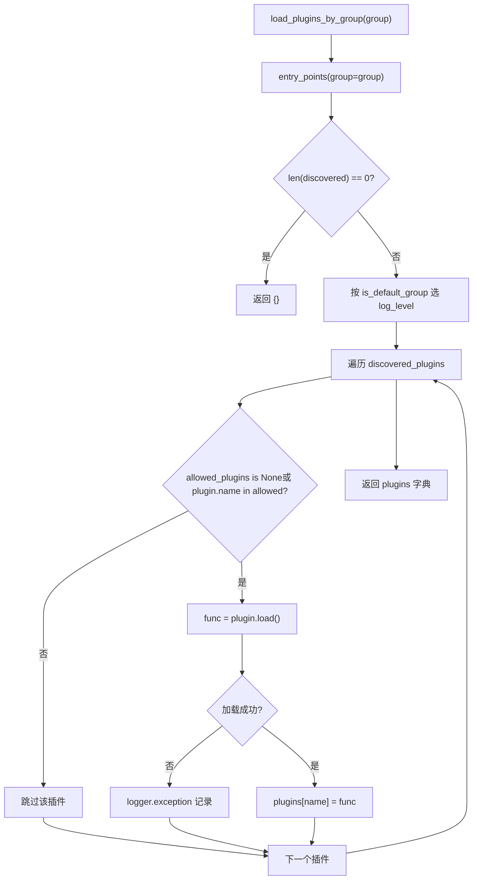
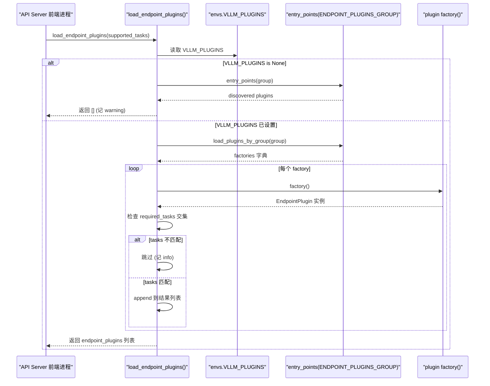

# Chapitre 13 : Système de plugins et extensibilité : plateformes, processeurs IO et extensions d'endpoints

Dans le chapitre précédent, nous avons vu que des fonctionnalités avancées telles que le cache de préfixe, le décodage spéculatif et LoRA sont profondément couplées au cœur du planificateur, de la gestion KV et de l'exécution du modèle. Mais pour qu'un moteur d'inférence atteigne véritablement la production, la performance seule ne suffit pas — il doit répondre à une question plus épineuse : lorsque la communauté souhaite intégrer un nouveau matériel, un nouveau format d'entrée multimodal ou une route HTTP personnalisée, comment y parvenir sans forker le code cœur ? C'est précisément la raison d'être du système de plugins. L'architecture de vLLM est naturellement multi-processus : le processus frontal API Server, le processus EngineCore, et le processus Worker correspondant à chaque rang TP/PP. Si le mécanisme de plugins se contentait simplement d'« exécuter du code à l'import », il s'exécuterait soit de manière répétée dans chaque processus, entraînant une accumulation d'effets de bord, soit uniquement dans le processus principal, empêchant les Workers d'obtenir l'extension. Ce que ce chapitre décompose, c'est la manière dont vLLM utilise le mécanisme standard Python entry_points, combiné à la triple contrainte groupe + frontière de processus + moment de chargement, pour construire un système de plugins capable à la fois de couvrir tous les processus et de contrôler précisément la surface exposée. Nous nous concentrons sur trois axes principaux : les plugins de plateforme (adaptation au nouveau matériel), les plugins IO processor (intervention dans le traitement des entrées multimodales), et les plugins d'endpoints (injection de routes API personnalisées). Les stratégies de chargement de ces trois éléments sont radicalement différentes ; comprendre cette différence, c'est comprendre la philosophie d'arbitrage de vLLM entre « capacité d'extension » et « frontière de sécurité ».

# I. Découverte et chargement des plugins : le contrat de regroupement des entry_points

## Modèle intuitif : les « canaux de diffusion » des plugins

Imaginez le système de plugins de vLLM comme un ensemble de canaux de diffusion. Chaque package de plugin, lors de l'installation, via`setup.py`de`entry_points`« enregistre » auprès d'un canal son indicatif d'appel (plugin name) et sa fonction de réponse (plugin value). vLLM scanne ces canaux au démarrage et décide quels canaux sont « écoutés » dans quels processus.

Sans ce mécanisme, étendre vLLM ne pourrait se faire qu'en modifiant le code source — chaque ajout de matériel par la communauté nécessiterait la maintenance d'un fork, aboutissant à une fragmentation des versions. La valeur du mécanisme de regroupement réside dans :**Un même paquet de plugin peut être enregistré uniquement dans un canal spécifique, ce qui le limite à un chargement dans un processus particulier**。

## Structure de données : cinq constantes de groupe et un indicateur global

vLLM dans`vllm/plugins/__init__.py`définit en tête cinq constantes de groupe entry point, chaque constante correspondant à une stratégie de chargement :

[FACT:vllm/plugins/__init__.py:16-30]

```python
DEFAULT_PLUGINS_GROUP = "vllm.general_plugins"
IO_PROCESSOR_PLUGINS_GROUP = "vllm.io_processor_plugins"
PLATFORM_PLUGINS_GROUP = "vllm.platform_plugins"
STAT_LOGGER_PLUGINS_GROUP = "vllm.stat_logger_plugins"
ENDPOINT_PLUGINS_GROUP = "vllm.endpoint_plugins"
```

Les commentaires contiennent des informations clés :`DEFAULT_PLUGINS_GROUP`dans**Tous les processus**chargement (process0, engine core, worker) ;`IO_PROCESSOR_PLUGINS_GROUP` **uniquement dans process0**；`PLATFORM_PLUGINS_GROUP`chargé dans tous les processus, mais le déclenchement se fait lors du`current_platform`premier accès ;`STAT_LOGGER_PLUGINS_GROUP`uniquement dans process0 et en mode asynchrone ;`ENDPOINT_PLUGINS_GROUP`uniquement dans le processus frontal API Server.

Immédiatement après se trouve une variable globale au niveau du module`plugins_loaded = False` [FACT:vllm/plugins/__init__.py:32-33], qui est un garde pour le chargement idempotent — le commentaire indique explicitement « make sure one process only loads plugins once ».

## Step-by-Step : un`load_plugins_by_group`flux d'appel complet

Mise en situation : l'utilisateur dans`setup.py`a enregistré`vllm.general_plugins`sous`register_dummy_model`, maintenant vLLM démarre, un processus appelle`load_general_plugins()`。

**Première étape : garde d'idempotence.** `load_general_plugins`vérifie d'abord`plugins_loaded`, si déjà`True`retourne directement[FACT:vllm/plugins/__init__.py:77-90]. Notez une subtilité ici : le garde est positionné**avant**le chargement, ce qui signifie que même si le chargement ultérieur lève une exception, il n'y aura pas de nouvelle tentative. C'est intentionnel — un échec de chargement de plugin ne doit pas entraîner des tentatives répétées du processus.

**Deuxième étape : découverte.**entre dans`load_plugins_by_group`, via`importlib.metadata.entry_points(group=group)`obtient tous les entry points installés sous ce groupe[FACT:vllm/plugins/__init__.py:36-45]. Si vide, enregistre un log debug puis retourne un dictionnaire vide.

**Troisième étape : gradation des logs.**Le code source distingue le niveau de log entre les groupes par défaut et non par défaut :`is_default_group`si vrai, utilise`logger.debug`, sinon utilise`logger.info` [FACT:vllm/plugins/__init__.py:47-54]. La motivation est pratique —`vllm.general_plugins`sous

**se trouvent généralement de nombreux plugins d'enregistrement de modèles, utiliser INFO saturerait les logs ; tandis que les plugins de plateforme/endpoint sont peu nombreux et importants, méritant d'être visibles en INFO.**Quatrième étape : filtrage par liste blanche.`envs.VLLM_PLUGINS`lit`None`, si[FACT:vllm/plugins/__init__.py:62-70]alors charge tout, sinon ne charge que les plugins dont le nom est dans la liste`plugin.load()`. Notez que[FACT:vllm/plugins/__init__.py:68-72]。

**est enveloppé dans un try/except, l'échec de chargement d'un seul plugin n'enregistre qu'un log exception, sans affecter les autres plugins**Cinquième étape : exécution.`load_general_plugins`retourne à`func()` [FACT:vllm/plugins/__init__.py:77-90], pour chaque fonction chargée appelle directement**. C'est pourquoi la documentation insiste sur le fait que les fonctions de plugin doivent être**réentrantes (re-entrant)

— elles peuvent être appelées plusieurs fois dans plusieurs processus.`load_plugins_by_group`Le diagramme de flux ci-dessous décrit



## Réflexion de conception : pourquoi utiliser entry_points plutôt qu'un fichier de configuration

> **[Design Inference & Architectural Trade-offs]**
> Choisir`entry_points`plutôt qu'un fichier de configuration personnalisé, la motivation principale est**de distribuer les plugins avec le paquet Python**. Après que l'utilisateur`pip install vllm-add-dummy-platform`, le plugin apparaît automatiquement dans le groupe correspondant, sans édition manuelle de la configuration de vLLM. Cela s'inscrit dans la lignée de l'écosystème de plugins d'outils comme pytest, flake8. Le coût est que la découverte de plugins dépend des métadonnées du paquet ; si le paquet de plugin est installé de manière incomplète (par exemple, seul le répertoire source a été copié sans passer par pip), entry_points ne le détectera pas.

---

# II. Plugins de plateforme : couche d'abstraction pour l'adaptation matérielle

## Modèle intuitif : la plateforme est un « traducteur de dialectes matériels »

`Platform`La classe**est le**seul traducteur`current_platform.get_attn_backend_cls()`、`current_platform.is_cuda_alike()`de tout vLLM dialoguant avec le matériel. Le code du modèle n'appelle que`import torch.cuda`des méthodes abstraites comme`if device == "xpu"`, jamais directement

## . Sans cette couche d'abstraction, chaque nouveau matériel supporté nécessiterait d'ajouter des branches

`Platform`dans le code du modèle, aboutissant à des spaghettis.`vllm/platforms/interface.py`Structure de données : disposition des champs de la classe de base Platform[FACT:vllm/platforms/interface.py:135-179]：

```python
class Platform:
    _enum: PlatformEnum
    device_name: str
    device_type: str
    dispatch_key: str = "CPU"
    ray_device_key: str = ""
    device_control_env_var: str = "VLLM_DEVICE_CONTROL_ENV_VAR_PLACEHOLDER"
    ray_noset_device_env_vars: list[str] = []
    simple_compile_backend: str = "inductor"
    dist_backend: str = ""
    supported_quantization: list[str] = []
    additional_env_vars: list[str] = []
    _global_graph_pool: Any | None = None
```

`_enum`Copier`PlatformEnum`est`is_cuda()`、`is_rocm()`une valeur d'énumération, déterminant[FACT:vllm/platforms/interface.py:69-78]。`device_control_env_var`etc. pour juger`CUDA_VISIBLE_DEVICES`est une abstraction « variable d'environnement de visibilité des dispositifs » indépendante de la plateforme — CUDA est[FACT:vllm/platforms/interface.py:151-152]。`_global_graph_pool`, les autres plateformes définissent chacune`get_global_graph_pool`est un cache de pool de mémoire CUDA graph au niveau de la classe, initialisé paresseusement via[FACT:vllm/platforms/interface.py:1210-1215]。

Il est à noter que`__getattr__`la logique de repli de[FACT:vllm/platforms/interface.py:1189-1208]: lors de l'accès à un attribut inexistant sur Platform, il tente de transférer depuis l'espace de noms`torch.<device_type>`. Cela permet au code de plateforme d'écrire`current_platform.memory_allocated()`tout en appelant réellement`torch.cuda.memory_allocated()`. Mais le code source exclut délibérément les méthodes dunder — sinon la vérification pickle`__getstate__`obtiendrait`None`et tenterait de l'appeler[FACT:vllm/platforms/interface.py:1182-1185]。

## Step-by-Step : conversion à trois espaces de noms des ID de dispositif

Le piège le plus courant dans l'abstraction de plateforme est**l'espace de noms des ID de dispositif**. Les commentaires du code source listent explicitement trois[FACT:vllm/platforms/interface.py:275-283]：

- **logical**: le local rank interne à vLLM, indexant`_assigned_physical_gpu_ids`
- **visible**: le numéro torch/CUDA du processus actuel après remappage par`CUDA_VISIBLE_DEVICES`: l'ID GPU global utilisé par les API de topologie comme NVML, non affecté par les variables d'environnement
- **physical**Mise en situation : un processus Worker s'est vu attribuer le GPU physique

, variable d'environnement`[4, 5]`, maintenant il faut convertir local rank 0 en`CUDA_VISIBLE_DEVICES=4,5`Première étape : logical → physical.`torch.device("cuda:0")`。

**vérifie d'abord** `device_id_to_physical_device_id(0)`, si déjà défini, retourne directement l'index`_assigned_physical_gpu_ids`. Si non défini, prend le premier élément de la liste séparée par des virgules de`4` [FACT:vllm/platforms/interface.py:296-297]. Notez que le code source traite délibérément`device_control_env_var`la chaîne vide[FACT:vllm/platforms/interface.py:305-311]comme non définie — c'est une configuration légitime lorsque Ray démarre le moteur sur un placement group purement CPU**空字符串**当作未设置处理——这是 Ray 在纯 CPU placement group 上启动引擎时的合法配置 [FACT:vllm/platforms/interface.py:296-297]。

**Deuxième étape : physical → visible.** `logical_device_id_to_visible_device_id(0)`Après avoir obtenu physical`4`, on décompose les variables d'environnement en`[4, 5]`, on trouve`4`l'index de`0`et on retourne[FACT:vllm/platforms/interface.py:316-339]. Si le physical ID n'est pas dans la liste visible, on lève`RuntimeError`— c'est une protection stricte contre l'utilisation abusive d'un appareil invisible entre processus.

`set_assigned_physical_gpu_ids`La conception idempotente de`RuntimeError` [FACT:vllm/platforms/interface.py:38-56]mérite également attention : répéter la même valeur est une opération nulle, tandis que définir une valeur différente lève

## . Cela empêche l'écrasement accidentel du mapping d'appareils dans un environnement multithread.

Enregistrement et injection de configuration des plugins de plateforme`vllm.platform_plugins`Les plugins de plateforme sont enregistrés via le groupe`None`, la fonction du plugin retourne le nom qualifié complet de la classe de plateforme (ou[FACT:docs/design/plugin_system.md:50-50]pour indiquer que l'environnement actuel n'est pas pris en charge)[FACT:docs/design/plugin_system.md:100-100]：

- `_enum`. L'implémentation minimale donnée dans la documentation exige`PlatformEnum.OOT`（out-of-tree）
- `device_type`est généralement défini à
- `check_and_update_config`retourne la chaîne de type d'appareil reconnue par PyTorch**est appelé au début de l'initialisation de vLLM,`worker_cls`**
- `get_attn_backend_cls`il faut définir ici
- `get_device_communicator_cls`retourne le nom de classe du backend d'attention

`check_and_update_config`retourne le nom de classe du communicateur[FACT:vllm/platforms/interface.py:583-592]est le hook le plus critique du plugin de plateforme`VllmConfig`. Il reçoit[FACT:docs/design/plugin_system.md:105-105]par référence et le modifie sur place, permettant d'ajuster le block size, le graph mode, etc. La documentation souligne que « le plus important est que worker_cls doit être défini ici »

## — car vLLM doit savoir quelle classe Worker utiliser pour instancier le processus de travail.

Réflexion de conception : stratégie en trois phases pour l'alignement du block size`update_block_size_for_backend` [FACT:vllm/platforms/interface.py:666-708]La logique la plus complexe de l'interface de plateforme est

**Phase 1**. Elle se divise en trois phases pour garantir la compatibilité du block size avec le backend d'attention :`--block-size`: si l'utilisateur n'a pas explicitement spécifié`_preferred_block_size_for_backends`, appeler[FACT:vllm/platforms/interface.py:687-697]pour sélectionner le plus petit block size pris en charge par tous les backends[FACT:vllm/platforms/interface.py:622-663]。

**Phase 2**. Cette fonction énumère les valeurs candidates par LCM (plus petit commun multiple), car certains backends (comme CPU_MLA) n'acceptent que des tailles exactes et non des multiples[FACT:vllm/platforms/interface.py:699-702]。

**Phase 3**: les modèles hybrides (attention + mamba) doivent aligner le block et le mamba page size[FACT:vllm/platforms/interface.py:704-708]。

> **[Design Inference & Architectural Trade-offs]**
> 〔Inférence de conception et compromis architecturaux〕

---

# Cette conception par phases reflète la réalité à laquelle vLLM fait face : différents matériels, différents schémas de quantification et différentes architectures de modèles imposent des contraintes de block size mutuellement conflictuelles, impossibles à résoudre par une formule unique. La division en phases permet de traiter chaque contrainte indépendamment, puis de prendre la solution satisfaisant toutes les contraintes.

## III. IO Processor et plugins d'endpoint : traitement des entrées et extension de l'API

Modèle intuitif : IO Processor est une « couche de traduction multimodale »

## L'entrée d'un modèle multimodal (comme LLaVA) n'est pas du texte pur, mais un mélange de texte + images. Le plugin IO Processor est chargé de convertir les données multimodales brutes en tenseurs que le modèle peut consommer, puis de reconvertir la sortie du modèle en format lisible par l'humain. Il agit comme un traducteur des douanes : la langue étrangère entrante (image/audio) est traduite vers la langue maternelle du modèle, et la langue maternelle du modèle sortante est retraduite vers la langue étrangère.

Étape par étape : découverte et instanciation de l'IO Processor`io_processor_plugin`Mise en situation : charger un modèle avec un HF config contenant le champ

**.** `get_io_processor`Première étape : déterminer le nom du plugin.`plugin_from_init`On utilise en priorité le`hf_config`explicitement passé, sinon on lit le champ`io_processor_plugin`de[FACT:vllm/plugins/io_processors/__init__.py:42-50]. Si les deux sont vides, on retourne`None`— cela signifie que le modèle n'a pas besoin d'IO processor[FACT:vllm/plugins/io_processors/__init__.py:52-54]。

**Deuxième étape : charger tous les plugins installés.**On appelle`load_plugins_by_group(IO_PROCESSOR_PLUGINS_GROUP)`pour obtenir tous les plugins de ce groupe[FACT:vllm/plugins/io_processors/__init__.py:59-61]。

**Troisième étape : construire le mapping chargeable.**On parcourt chaque plugin, on appelle sa fonction pour obtenir`processor_cls_qualname`, si ce n'est pas`None`on l'enregistre dans`loadable_plugins` [FACT:vllm/plugins/io_processors/__init__.py:66-76]. Noter que l'appel de fonction de chaque plugin est également entouré d'un try/except, un échec individuel n'affectant pas les autres.

**Quatrième étape : validation et instanciation.**Si le nombre de plugins chargeables est 0, on lève`ValueError`en indiquant « un plugin IOProcessor est requis mais aucun n'est installé »[FACT:vllm/plugins/io_processors/__init__.py:66-76]. Si le nom de plugin requis par le modèle n'est pas dans la liste chargeable, on lève`ValueError`et on liste tous les noms de plugins disponibles[FACT:vllm/plugins/io_processors/__init__.py:80-81]. Enfin, via`resolve_obj_by_qualname`on résout le nom de classe et on l'instancie[FACT:vllm/plugins/io_processors/__init__.py:80-81]。

## Plugins d'endpoint : posture de sécurité par refus par défaut

Les plugins d'endpoint sont la catégorie la plus particulière de ce chapitre, car ils**ne sont pas chargés par défaut**。`load_endpoint_plugins`La docstring de`load_plugins_by_group`explique clairement la raison : les plugins d'endpoint ajoutent des routes HTTP au API Server, élargissant la surface d'exposition réseau, d'où une posture de « refus par défaut » plus stricte que[FACT:vllm/plugins/__init__.py:93-94]。

La règle concrète est : un plugin n'est chargé que si son nom**apparaît explicitement dans`VLLM_PLUGINS`,**et que son`required_tasks`est`None`ou a une intersection avec les tasks supportées par le serveur[FACT:vllm/plugins/__init__.py:108-108]。

Mise en situation : l'utilisateur a installé un plugin d'endpoint mais a oublié de définir`VLLM_PLUGINS`。

**Première étape : vérifier si VLLM_PLUGINS n'est pas défini.**Si`envs.VLLM_PLUGINS is None`, on découvre d'abord les plugins de ce groupe, et s'il y en a, on enregistre un warning indiquant « allowlist explicite requise »[FACT:vllm/plugins/__init__.py:126-126]. Noter que le commentaire du code source précise particulièrement :`VLLM_PLUGINS=""`est interprété comme`[""]`et non`None`, donc considéré comme une « allowlist ne correspondant à aucun plugin », et non comme « non défini »[FACT:vllm/plugins/__init__.py:108-108]. Cette distinction de cas limite est importante — une chaîne vide est un « ne rien charger » explicite, tandis que`None`est « non configuré ».

**Deuxième étape : charger et instancier.**Après avoir obtenu la fonction factory via`load_plugins_by_group`, on appelle une par une`factory()`pour instancier[FACT:vllm/plugins/__init__.py:133-141]. Un échec d'instanciation enregistre une exception et continue.

**Troisième étape : contrôle par task.**On vérifie`plugin.required_tasks`, si ce n'est pas`None`et qu'il y a une intersection avec`supported_tasks`Aucune intersection, ignorer ce plugin[FACT:vllm/plugins/__init__.py:144-145]. Cela permet à un même package de plugin d'enregistrer différents points de terminaison pour différentes tâches (comme embedding vs generation).

Le diagramme de séquence ci-dessous décrit l'interaction complète du plugin de point de terminaison, de la découverte au chargement :



## Réflexion de conception : la frontière de processus détermine la stratégie de chargement

La différence entre les stratégies de chargement des trois types de plugins est essentiellement une**frontière de processus**:

| Type de plugin | Processus de chargement | Comportement par défaut | Motivation |
| --- | --- | --- | --- |
| general | Tous les processus | Chargement complet | L'enregistrement du modèle doit être visible dans chaque Worker |
| platform | Tous les processus | Chargement complet | L'abstraction matérielle est dépendante de tous les processus |
| io_processor | Uniquement process0 | Chargement complet | Le traitement d'entrée ne se produit qu'au niveau du frontend |
| stat_logger | Uniquement process0 (asynchrone) | Chargement complet | Les journaux ne sont collectés que dans le processus principal |
| endpoint | Uniquement API Server | **Refus par défaut** | Élargit la surface d'exposition réseau, nécessite une autorisation explicite |

> **[Design Inference & Architectural Trade-offs]**
> Le « refus par défaut » du plugin de point de terminaison est une pratique standard en ingénierie de sécurité : toute extension élargissant la surface d'attaque doit être opt-in. Les autres plugins sont chargés par défaut car ils n'exposent pas directement d'interfaces réseau, et l'écosystème communautaire a besoin d'une expérience d'intégration à faible friction.

## Piège en production : dégradation silencieuse en cas d'échec de chargement d'un plugin

`load_plugins_by_group`Pour chaque plugin,`plugin.load()`est enveloppé dans un try/except, en cas d'échec seule une exception est journalisée[FACT:vllm/plugins/__init__.py:68-72]. Cela signifie que**un plugin défectueux n'empêchera pas vLLM de démarrer**, mais ne donnera pas non plus d'erreur explicite — l'utilisateur peut être perplexe quant à « pourquoi mon plugin ne fonctionne pas ».

Conseil de dépannage : passez le niveau de journalisation à DEBUG, recherchez`"Failed to load plugin"`. Si le plugin est dans le groupe`vllm.general_plugins`, le niveau de journalisation par défaut est DEBUG, il faut l'activer explicitement pour voir les détails du chargement[FACT:vllm/plugins/__init__.py:49-50]。

Un autre piège est le moment de positionnement du garde`plugins_loaded`[FACT:vllm/plugins/__init__.py:77-90]: il est positionné avant le chargement`True`. Si le premier chargement échoue pour une raison quelconque (comme une anomalie de scan des entry_points), les appels suivants retourneront directement sans réessayer. Cela peut provoquer dans les environnements de test le phénomène étrange de « plugins qui fonctionnent par intermittence ».

---

# Résumé de ce chapitre

Le système de plugins de vLLM est construit sur Python`entry_points`, via**cinq constantes de groupe**pour diviser les types d'extension, via**la frontière de processus**pour déterminer la portée de chargement, via**`VLLM_PLUGINS`une liste blanche**pour contrôler l'ensemble de chargement. Les plugins de plateforme utilisent la classe de base`Platform`pour abstraire les différences matérielles, leur conversion à trois espaces de noms d'ID de périphérique (logical/visible/physical) est au cœur de la gestion des périphériques inter-processus ; les plugins IO processor sont déclenchés via le champ`io_processor_plugin`de la config HF, responsables de la traduction des entrées multimodales ; les plugins de point de terminaison adoptent une posture de « refus par défaut », n'étant chargés que lorsqu'ils figurent explicitement dans l'allowlist et que la tâche correspond, afin de contrôler la surface d'exposition réseau.

Les trois lignes directrices partagent le même mécanisme de découverte, mais les différences de stratégie de chargement reflètent le compromis de vLLM entre « facilité d'extension » et « frontière de sécurité » : les plugins n'exposant pas le réseau sont chargés par défaut, ceux exposant le réseau doivent être opt-in.

# Réflexions et auto-évaluation de ce chapitre

Q1 : Si l'on retire le try/except de`load_plugins_by_group`dans`plugin.load()`, laissant l'échec de chargement se propager directement, quel impact cela aurait-il sur le démarrage multiprocessus de vLLM ? Dans quels scénarios cela serait-il au contraire une meilleure conception ?

> **[Design Inference & Architectural Trade-offs]**
> **Analyse de référence**: L'implémentation actuelle[FACT:vllm/plugins/__init__.py:68-72]fait que l'échec de chargement d'un plugin individuel est silencieusement absorbé, seule une exception est journalisée. Si l'on retire le try/except, l'échec de chargement se propagera vers le haut jusqu'à`load_general_plugins`, interrompant ainsi le démarrage du processus. Dans un scénario multiprocessus, cela entraînerait : si le chargement d'un plugin dans un processus Worker échoue, tout le moteur ne peut pas démarrer — cela peut être une bonne chose (échec rapide, évitant qu'un processus partiellement défaillant provoque une incohérence d'état), ou une mauvaise chose (un bug dans un plugin optionnel fait s'effondrer tout le service). Une meilleure conception pourrait introduire une variable d'environnement`VLLM_PLUGINS_STRICT`: par défaut permissif (comportement actuel), en mode strict l'échec de chargement lève une exception. Ainsi, l'environnement de production peut exiger que « tous les plugins déclarés soient chargés avec succès », tandis que l'environnement de développement reste tolérant.

Q2: `load_endpoint_plugins`Dans`VLLM_PLUGINS=""`, quelle est la différence de comportement entre`VLLM_PLUGINS`et`None`non défini (

> **[Design Inference & Architectural Trade-offs]**
> **〔Inférence de conception et compromis architecturaux〕**Analyse de référence`VLLM_PLUGINS=""`: Les commentaires du code source indiquent explicitement que`[""]`est interprété comme`None`et non[FACT:vllm/plugins/__init__.py:108-108], donc considéré comme une « allowlist ne correspondant à aucun plugin »`VLLM_PLUGINS is None`. Lorsque`load_endpoint_plugins`,`[]`retourne directement[FACT:vllm/plugins/__init__.py:126-126]et journalise un warning`VLLM_PLUGINS=""`; tandis que lorsque`load_plugins_by_group`, le code continue jusqu'à**, mais comme la chaîne vide ne correspond à aucun nom de plugin, il retourne finalement une liste vide. Les deux ont un**résultat identique**(aucun plugin de point de terminaison n'est chargé), mais une**：`None`sémantique différente`""`:

Q3: `device_id_to_physical_device_id`signifie « l'utilisateur n'a pas configuré, nous refusons activement et avertissons »,`device_control_env_var`signifie « l'utilisateur a explicitement configuré une allowlist vide, nous respectons son intention sans avertir ». Cette distinction permet aux opérations de « désactiver silencieusement tous les plugins de point de terminaison » en définissant une chaîne vide, sans avoir à subir le bruit des warnings à chaque démarrage.[FACT:vllm/platforms/interface.py:302-308]Dans

**, pourquoi le code source traite-t-il un**vide comme non défini[FACT:vllm/platforms/interface.py:296-297]? Si l'on retire cette vérification de chaîne vide, que se passerait-il dans le scénario de placement group CPU-only de Ray ?`!= ""`Analyse de référence`device_ids = "".split(",")`: Les commentaires du code source expliquent qu'une variable d'environnement vide est une configuration légitime lorsque Ray démarre un placement group CPU-only sur un nœud GPU`[""]`. Si l'on retire la vérification`device_ids[device_id]`, le code entrerait dans la branche`int("")`, obtiendrait`ValueError`. Cela entraîne l'échec du démarrage du moteur avec une configuration Ray légitime. Après avoir conservé la vérification, une variable d'environnement vide emprunte la`else`branche et retourne directement`device_id`, c'est-à-dire en supposant que l'ID logique est égal à l'ID physique — ce qui est sûr dans un scénario CPU-only, puisqu'aucun GPU n'a besoin d'être mappé. Ce cas illustre que « non défini » et « défini comme vide » ont des sémantiques différentes dans les systèmes d'orchestration distribués, et que le code doit les traiter explicitement.

---

Le chapitre suivant se tournera vers les compromis architecturaux, les pièges en production et l'évolution future ; nous rassemblerons les mécanismes décomposés dans les treize chapitres précédents pour examiner les arbitrages de vLLM entre performance, maintenabilité et extensibilité, et nous envisagerons les directions d'évolution des moteurs d'inférence.

À ce stade, nous avons clairement vu comment vLLM, grâce au mécanisme de regroupement des entry_points, au moment de chargement sensible aux frontières de processus, ainsi qu'aux stratégies différenciées des trois types de plugins — plateforme, IO processor et endpoint —, ouvre des surfaces d'extension tout en maintenant la stabilité du code cœur. Ce système de plugins permet à de nouveaux matériels, de nouveaux formats d'entrée et de nouvelles routes API de s'intégrer de manière non intrusive, mais l'extensibilité elle-même implique davantage de dimensions à arbitrer. Le chapitre suivant clôturera l'ouvrage en organisant systématiquement les tensions dans les décisions de conception clés de vLLM — continuous batching et fragmentation de la mémoire GPU, CUDA Graph et formes dynamiques, déploiement disaggregated et surcoût réseau — et fournira une liste de pièges en production ainsi qu'un parcours de diagnostic, tout en esquissant les tendances d'évolution vers un frontend Rust, une couche IR et le matériel hétérogène.
